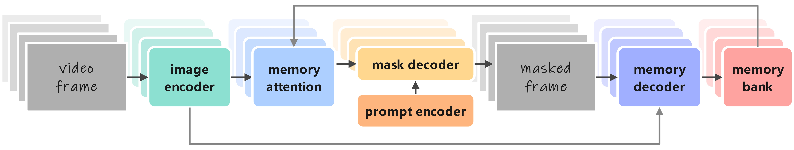
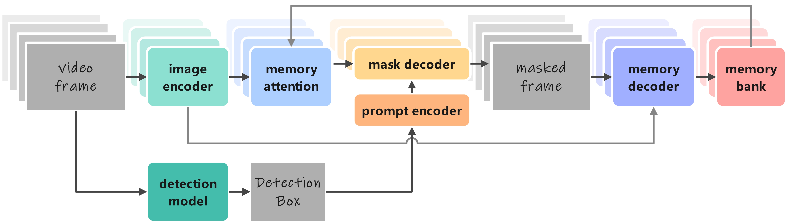
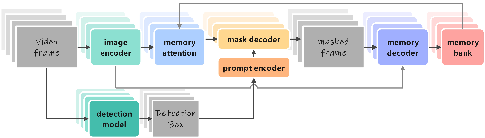
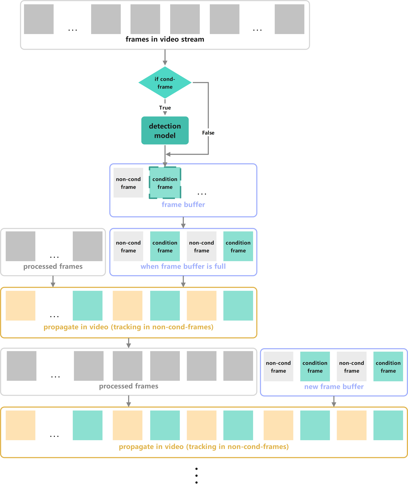
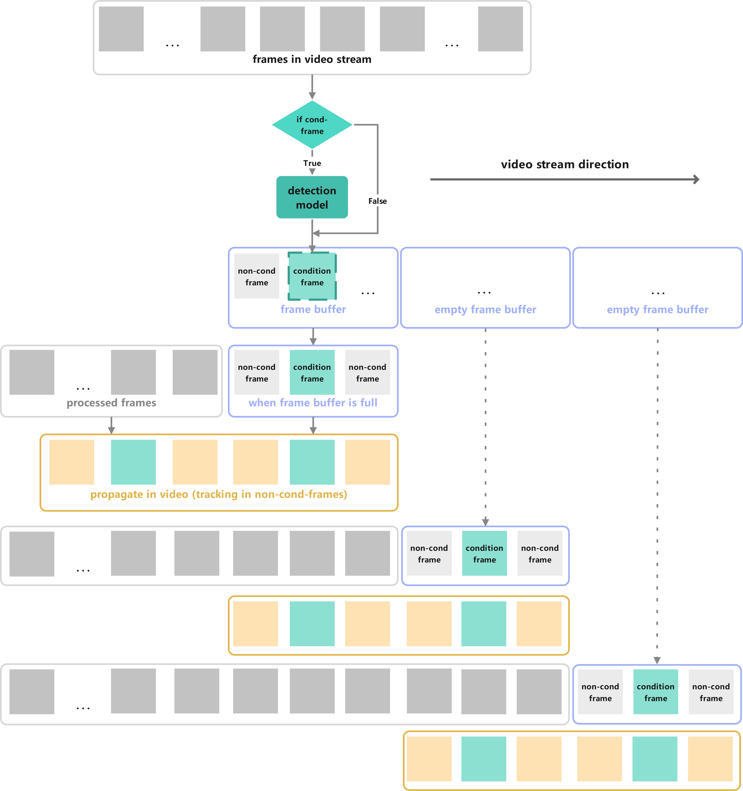
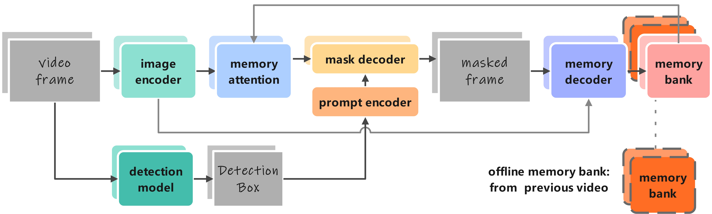
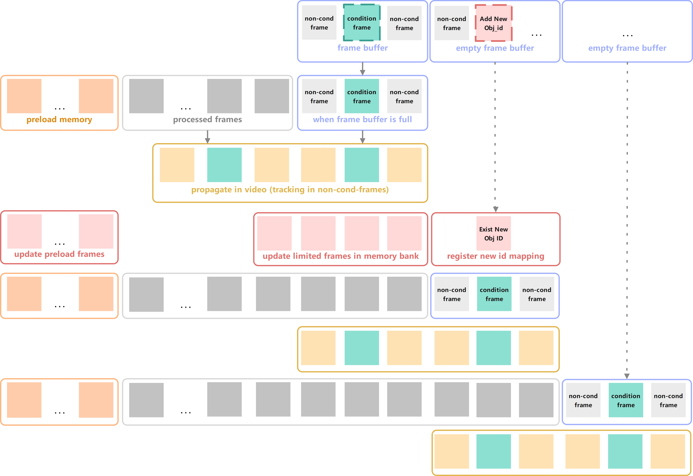
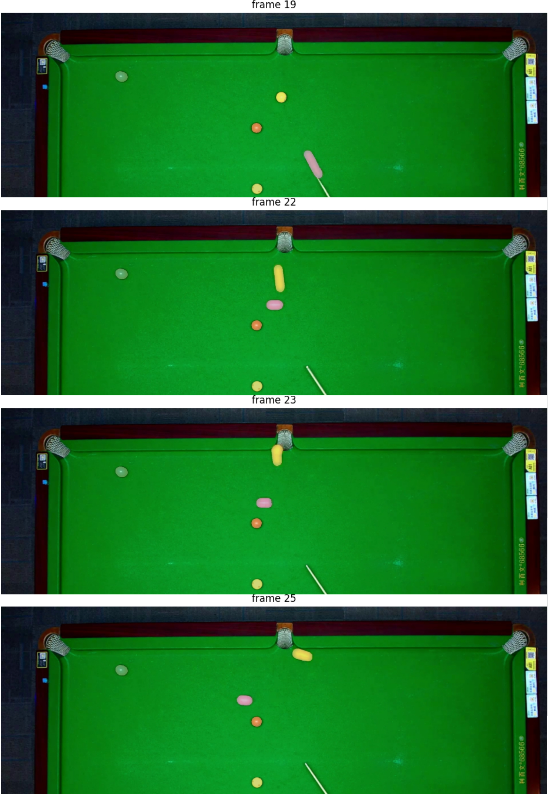

#### Det-SAM2: Technical Report on the Self-Prompting Segmentation Framework Based on Segment Anything Model 2

Det-SAM2：基于Segment Anything Model 2的自提示分割框架的技术报告


#### abstract

Segment Anything Model 2（SAM2）展现了强大的视频分割能力和分割结果修正能力，我们希望它能够进一步发展，以更高的自动化程度实现实际应用的落地。我们在SAM2的基础上做了一系列尝试，最终实现了一个真正无人工干预的由检测模型自动提供物体提示以供SAM2推理和修正的pipeline（Det-SAM2）。该pipeline允许以恒定的显存与内存开销一次性推理无限长的视频流并且在效率和精度上与原始SAM2持平。本技术报告重点在于介绍Det-SAM2整体框架的搭建与SAM2的后续工程优化，同时展示一个我们利用Det-SAM2框架搭建的应用示例（台球场景的AI裁判）。


#### 1. Introduction

Segment Anything Model 2（SAM2）【1】是目前视频分割领域的SOTA模型，其展现了领先的对象级实例分割能力，且延续了Segment Anything（SAM）【2】中的mask模糊匹配与交互修正能力。然而，在官方实现的SAM2中，人们需要首先在视频的起始帧与SAM2进行交互，施加条件提示后才可以开始推理。在推理过程中如果需要修正SAM2错误的推理结果，人们需要在错误帧附近添加新的条件提示后再次进行推理。一方面频繁的手动交互限制了SAM2在自动化场景大规模落地的可能，另一方面SAM2本身每次添加新的条件提示和新的类别后都需要从头开始重新推理，这加重了SAM2本身就具有的极大性能开销。

因此我们构造了Det-SAM2。Det-SAM2是一个基于SAM2【1】，利用YOLOv8【3】检测模型自动为SAM2添加提示，再对SAM2分割结果进行后处理以在专有场景进行业务判断，无需人工干预的视频物体分割pipeline。它既保持了SAM2对物体对象强大的分割与修正能力，也解决了条件提示必须人为手动传入而无法实现自动化推理的困境。同时，我们对Det-SAM2框架实施了一系列工程改进，降低了性能开销。

具体而言，我们的核心贡献有：

1. 实现了无需人工干预提示交互的自提示视频实例分割pipeline（Det-SAM2-pipeline）。其支持对特定类别（由自定义检测模型决定）以**视频流**进行推理分割，并且以SAM2原有的精度返回分割结果以支持后处理业务层的使用。

2. 我们实现了在SAM2**推理追踪过程中在线添加新的类别**而不中断推理状态的功能。

3. 我们的pipeline允许将一段视频上推理过后的记忆库应用在新的视频上，我们称其为预加载记忆库（preload memory bank）。它可以利用上一段视频中推理分析的记忆（物体类别/形态/运动状态）辅助其在新的视频中执行类似的推理而**不需要在新的视频中添加任何条件提示**。

4. 我们实现了在Det-SAM2-pipeline上**恒定的显存与内存开销**，从而支持一次性推理无限长的视频。

我们的工作仅限于工程优化，并不涉及到SAM2【1】模型本身的训练与微调。我们在Det-SAM2框架的实现过程和应用示例的搭建（台球场景的AI裁判）中，每个部分的tasks如【图1】所示。


【图1】：Det-SAM2任务概览。整体技术pipeline由三个部分组成：检测部分、SAM2实例的像素级视频追踪部分 和 后处理部分。其中检测模型提供初步（可能会出错）的检测框，将检测框作为SAM2的条件提示，SAM2视频预测器将离散帧的条件提示传播（propagate_in_video）到视频中所有帧中连续地进行推理，最终SAM2视频预测器输出物体实例在视频时空中的Mask。后处理部分对获取到的Mask做相应的判断以提供准确且量化的结果以支持上层应用（例如台球场景的AI教练或AI裁判）。


#### 2. Related Work

**Segment Anything Model 2** 【1】实现了在视频中的物体分割，其掌握的对象级物体的通用概念，能够完美地适应物体的拉伸、遮挡等形变，是凌驾于传统检测模型与分割模型之上的突破性壮举。同时，SAM2还具备强大的修正能力，它允许将新输入的条件提示作用到所有已经推理过的帧上，从而可以修正其中的一些错误。SAM2的Video Predictor如【图2】所示：每一帧的输入图像特征和预测的mask结果都会存在Memory Bank中。同时每一帧预测分割mask的时候，Memory Bank、条件提示和输入图像特征又都会参与推理计算。




【图2】：SAM2原始框架图。视频帧特征会通过Memory Attention综合当前帧的信息与Memory Bank中的信息，并在Mask Decoder中接收条件提示生成预测mask。Memory Bank由条件帧的Memory Decoder提取，Memory Decoder不仅接收来自Mask Decoder的输出结果，也接收来自Image Encoder的输出结果。

**YOLOv8**【3】是 Ultralytics在2023年推出的YOLO系列的新版本。它在YOLOv5【4】的基础上构建，融入了显著的架构和方法论创新。现在，兼具优秀的性能与广泛应用的YOLOv8已经是检测领域工业落地的优先选择。


#### 3. Methodology

在本节中，我们重点介绍我们是如何搭建Det-SAM2 pipeline的（对应【图1】中的七项子任务），以及在此过程中实现的一系列工程问题。

#### 3.1 Detection Model + SAM2 Video Predictior

正如前文所说，交互性提示既是SAM2【1】能准确分割的关键，也是SAM2面向无需人类的全自动化推理的阻碍。SAM2的首个输入帧必须要人为给予初始提示才可以开始推理，我们思考能否使用一个检测模型来替代人为给予的提示。如【图3】所示，相比【图2】我们增加了一个从video frames input到prompt input 的分支，该分支由detection model连接，detection model 负责以detection box的形式为video frame 施加我们指定类别的提示。有了这个分支，SAM2就可以无需人工干预地启动预测了。这便是Det-SAM2（Detection Model + SAM2 Video Predictior） 最初的形态。



【图3】：Det-SAM2试验Demo框架图。自动地为某一帧添加条件提示，条件提示由检测模型（这里使用的是YOLOv8）给出，检测框结果信息作为框提示输入给Prompt Encoder。

#### 3.2 Det-SAM2 in Video Stream

当我们的Det-SAM2能够无需人工干预地启动分割预测时，我们也希望它能够继承SAM2【1】强大的修正能力，而非仅仅依靠初始帧的提示信息来推断出整个视频的预测结果。我们希望在video stream中向SAM2不断地添加由检测模型自动生成的Box prompt。由于SAM2的修正机制，每当SAM2接收到新的prompt时，SAM2会将新的prompt信息向此前推理过的所有帧进行一次propagate（propagate_in_video），从而将接收到新prompt的memory bank重新参与到此前每一帧的memory attention中，重新计算出每一帧的分割mask，以此实现修正的功能。

当我们实现在Det-SAM2框架中自动地为每一帧都添加条件提示时，示意图如【图4】所示。其与【图3】的区别仅仅在于我们在每一帧中都调用了detection model分支。同时Det-SAM2 in video stream【图4】在时间维度（视频流走向）上的示意图如【图5】所示。



【图4】：Det-SAM2框架允许自动地为每一帧都添加条件提示。与【图3】相比，detection model分支不仅在视频初始帧生效，而是在视频的每一帧生效。


【图5】：Det-SAM2处理视频流示意图。每一帧都经过Detection Model作为SAM2的条件帧（图中绿色），随后在整个已有视频帧中进行传播（图中黄色的“propagate in video”）以实现修正的能力。

然而如【图5】所示，在实际情况中传播过程（propagate_in_video）会占用相当长的推理时间。因为在传播过程中，每一次新增条件视频帧，SAM2都会对此前所有帧进行一次推理。这使得我们当前的框架处理长度为N帧的视频时，一共需要对$$ \frac{1}{2} N^2 $$的帧执行推理。

#### 3.3 Cumulative Video Stream

一个很简单优化推理开销的办法，就是减少推理传播（propagate_in_video）的次数。减少推理传播的次数可以从两个方面入手：一是减少条件帧产生的频率，只有条件帧会触发SAM2【1】的修正机制使其重复地对已有帧进行二次推理传播；二是增加一次输入中的视频帧数量，一次性输入多帧时，SAM2也只会传播一次。

因此我们希望间隔检测模型的推理，不再需要输入进SAM2的每一帧都由检测模型添加条件提示。而且我们经过实验发现，如果每一帧都由检测模型施加条件提示的话，一旦出现一帧非条件帧，那么这一帧非条件帧就会由于SAM2过度依赖频繁的条件提示而无法预测出分割mask。

我们同时希望在接收视频流的基础上，允许新进来的视频帧累积在视频帧缓存中。我们不再每一帧都输入一次Det-SAM2框架，而是一次性输入一个视频帧累积的序列，这样SAM2一次处理多个帧，减少传播次数。

我们累积视频流和间隔检测模型条件提示的流程示意图如【图6】



【图6】：Det-SAM2中cumulative video stream和间隔检测条件提示的流程图。对于视频流接收到的每一帧，会先累积到帧缓存中。当我们设置的帧缓存累积足够帧时，我们会将一个帧缓存中的序列一次性输入进Det-SAM2框架。SAM2在推理当前的视频帧序列时，会根据间隔设置判断哪些帧是条件帧(cond-frame)哪些帧是非条件帧(non-cond-frame)。条件帧由检测模型提供条件提示，由SAM2的Prompt Encoder提供prompt embedding。

我们通过累积一定数量的视频帧再进行推理可以极大地缓解SAM2传播的次数。假设我们一次缓存序列为K帧，则对整个长度为N帧的视频推理时的传播过程（propagate_in_video）只需要对大约$$ \frac{1}{2K} N^2 $$帧进行处理。

#### 3.4 Limited Video Propagate

我们已经知晓SAM2【1】实现提示修正的过程是通过接收新的条件提示，并且在所有历史帧中进行再次推理传播（propagate_in_video）实现的。在静态视频中（即一开始就输入完整的视频）每次传播都要在整个视频所有帧上进行无可厚非，然而在视频流中推理时我们可以不需要传播过程在所有历史帧中执行。

在Det-SAM2流程的实际情况中，需要修正的非条件帧与其所依赖的条件帧之间不会间隔太远。因此我们可以限制每次传播时推理所涉及到的帧数。在视频流的每次推理过程中，相对于本次推理，过去遥远大多数视频帧都是已经确定且不需要被修正的，过去越是近期的越新的视频帧的推理结果越有可能在未来的推理中被颠覆。因此我们需要对传播操作（propagate_in_video）做如下限制：

1. 设置传播中追踪处理顺序为倒序处理，起始帧为当前最新帧。
2. 限制传播中追踪处理的最大处理帧数。但是本次传播处理的长度应当至少完整包含上一次推理的累积视频帧序列，否则传播将不具备任何修正意义。

Limited video propagate的流程示意图如【图7】所示。



【图7】：Limited video propagate的流程示意图。传播（propagate in video）时只在人为设置的最大追踪长度（max_frame_num_to_track）上执行，而非遍历此前的所有帧。

增加视频传播的最大长度（max_frame_num_to_track）可以扩大修正范围，但也会带来更大的计算开销。减小视频传播的最大长度则可以带来更快的推理速度，但也会降低视频流中条件帧能够修正非条件帧的最大范围。

通过限制传播长度（max_frame_num_to_track）为$$M$$，累积帧缓存（frame_buffer_size）为$$K$$，我们在推理长度为N帧的视频时只需要对大约$$ \frac{M}{K} N $$帧做处理。这意味着当$$M$$与$$K$$恒定时，Det-SAM2推理的实际帧数随视频长度线性增长。

#### 3.5 Preload Memory Bank（Offline Memory Bank）

SAM2【1】相比于SAM【2】，其能将图像分割能力迁移到视频分割领域的一个重要改进就是增加了Memory Bank可以通过Memory Attentio提供帧与帧之间的关联。然而，Memory Bank的生成与构造必须是在线的，必须在推理过程中实时地基于已输入的帧与条件提示进行构造（每次输入新的视频帧时，会将新帧的条件提示、output mask与video frame feature经由Memory Decoder存储在Memory Bank中）

我们受到官方代码仓库issue中讨论的启发【5】，我们希望能够通过预加载一个在旧视频中已经构建好的内存库，从而在新的视频上利用已有旧视频的记忆信息，无需添加任何条件提示而直接进行推理。即允许SAM2预先加载一个离线内存库，该离线内存库经过精心设计，包含了新视频中可能会需要的所有提示和难样本提示示例，就像“system prompt”一样。在之后新视频的推理中，新生成的Memory会累加在预加载的内存库上。新生成的Memory与预加载的Memory在人为概念上区分，但是在SAM2实际推理中没有区别。preload memory bank流程如【图8】所示。



【图8】：preload memory bank流程图。Memory Bank预先加载一个离线内存库，源自此前推理过的视频。至此，本次推理的时候可以直接将先前视频中的推理记忆作用于新视频的推理。

在具体实现上，SAM2代码中的inference_state存有memory bank中所有的信息，因此将inference_state迁移到新视频推理中，且新视频不再重新初始化init_state即可。

#### 3.6 Support Add New Objects in Tracking

截止至当前，在SAM2【1】官方实现中只允许在追踪开始之前事先确定好本次视频推理中需要分割的实例，而不允许在追踪过程中在线地新增需要分割的新实例。具体原因是在首次初始化memory bank（init_state）时类别映射列表就已经固定了，此后如果新帧存在新增需要推理的物体类别，则会导致新帧的特征张量与旧帧的特征张量尺寸不匹配而无法计算。

事实上在我们Det-SAM2处理实时视频流的过程中，大部分情况下我们无法预知未来会出现什么物体。我们的检测模型很有可能在首次初始化memory bank时仅仅至输出了其中的部分类别结果，而剩余的类别在推理开始后输入给SAM2时，对SAM2而言就是在推理开始后出现新增需要推理的物体了。此时官方的一种解决方法是执行reset_state重置memory bank，即在出现新类别的这一帧中重新初始化memory bank。这种方法的后果是丢失前面所有推理结果而从此刻重新开始分割推理。

即便如此，在每次出现新类别的帧时执行重新初始化也无法保证这次初始化的帧序列中包含了所有可能出现的类别，因而只要是采用遇见新类别就重新初始化的方法，就必然会导致在长视频中几乎不断地触发reset_state初始化，不断地为了避免帧与帧之间内别数不同而产生的张量尺寸不匹配报错，不断地丢失前面所有推理结果，不断地清空memory bank。memory bank的不连续会极大地影响SAM2视频推理中分割预测的准确性。

我们希望能够允许追踪过程中自然地增加新物体ID而不需要重置整个内存库，我们通过追踪过程中在线地更新内存库来实现。为了推理追踪过程中在线地增加新物体类别，在遇到新物体类别时，我们需要更新如下操作：

1. 在Inference_state中注册新ID相应的ID索引列表和信息存储字典

2. 以新的ID映射表，更新此前所有帧的memory bank（重新获取output_dict或temp_output_dict，通过Memory Encoder生成新ID映射关系下的memory bank）

追踪过程中在线更新memory bank示意图如【图9】


【图9】：Det-SAM2 add new objects in tracking，在线更新memory bank示意图。当框架在开始推理追踪后接收到新的物体类别时，首先会在memory bank中注册新物体的ID映射，其次基于更新的ID映射表将此前所有历史帧的Memory bank进行更新（每一帧在memory bank中的信息张量的Batch维度大小取决于需要预测的ID数量，如果不更新则会引发张量不匹配无法计算Memory Attention）。

在实现了如【图9】的功能后，我们支持了在追踪开始后在线添加新物体ID的情况。然而，在长视频推理中，已实现的在线更新memory bank的方法一旦使用便会使用memory encoder对memory bank中所有历史帧都进行一次处理。一旦新物体在长视频的末尾出现，这个开销是巨大的。为了性能高效，我们还需要对两个组件进行限制：一是限制出现新物体类别时在线更新memory bank的帧数量，二是限制memory attention计算的条件帧的数量以避免使用到没有更新过的旧的帧。具体做法是：

1. 推理追踪过程中新增类别时只更新memory bank中靠近当前时刻的一定数量的帧，同时也必须保证preload memory bank中所有帧被更新。
2. 限制Memory Attention计算的条件帧数量，同时也必须保证预加载内存库中的所有条件帧都参与计算。

优化后的流程如【图10】所示。



【图10】：Det-SAM2追踪过程中输入新的物体ID，在线更新Memory Bank的优化示意图。通过限制更新Memory Bank的最大帧数和Memory Attention计算的条件帧数量，同时保证Preload Memory Bank中的帧必须被更新和Memory Attention计算来保证效能的同时减小计算开销。

#### 3.7 GPU/CPU memory optimization

SAM2【1】官方源码支持在CPU、GPU和NPU上运行，但由于我们自己的设备主要是CPU和GPU，所以我们的优化主要在GPU memory（VRAM） and system memory（RAM）上。在这一小节，我们开始着手减少 Det-SAM2架构在推理过程中的 RAM and VRAM usage。我们会介绍一些官方在源码中预留的接口，期间会涉及许多SAM2源码中的函数名。在优化前，Det-SAM2框架在24G显存上大约可以推理200视频帧/每帧6-7个分割物体，此时RAM and VRAM usage是随着推理视频总帧数线性增长的。

1. 首先我们尝试官方预留的第一个优化接口，`SAM2VideoPredictor.init_state()`方法中的`offload_video_to_cpu`参数。该参数可以将内存库中的视频帧（即`inference_state["images"]`）从GPU显存中转移到CPU内存上。在1920*1080视频分辨率下，可以降低大约每帧0.025G显存开销，即减小2.5G开销/100帧。

2. 其次我们尝试官方预留的第二个优化接口，`SAM2VideoPredictor.init_state()`方法中的`offload_state_to_cpu`参数。该参数希望起到的作用是将一些不需要频繁计算且体积巨大的特征张量存储在CPU内存中。然而在我们构建的Det-SAM2框架中使用这个参数并没有直接节省显存，反而会导致生成出来的分割mask与帧索引产生错位。直到我们将该参数涉及到的`inference["storage_device"]`张量设备迁移的所有位置均设置张量转移参数`non_blocking=False`时，该接口才能正常使用：

   ```python
   device = inference_state["storage_device"]
   tensor.to(device,non_blocking=False)
   ```

   `offload_state_to_cpu=True`时，修复后的最终效果正如官方在注释中所说，会节约显存，同时推理耗时增加约22%。

3. 我们受到官方代码仓库issue中【6】讨论的启发，希望尝试能否选择不断清除掉旧的帧数据（前提是确保不会再使用到旧的帧数据）以维持Memory总量不再无限上升。
   为了实现这个功能，我们在`sam2.sam2_video_predictor`中`SAM2VideoPredictor`类实现了`release_old_frames()`方法，该方法可以设置最大保留帧数（`max_inference_state_frames`），距离当前帧超过最大保留帧数距离的帧会被认为是需要清除的帧。因此为了确保只清除掉不会再被使用的`max_inference_state_frames`应当大于`propagate_in_video()`中的最大传播长度`max_frame_num_to_track`。
   不断清除旧帧过程示意图如【图11】所示，其中实现的`release_old_frames()`见附录【A1】。至此可以在无限长度的视频帧推理过程中，真正实现恒定的显存开销。


【图11】：不断释放旧帧以维持恒定显存开销示意图。图中为保留最大帧数等于最大传播长度的情况(图中示例max_inference_state_frames=max_frame_num_to_track=4)，在每次传播propagate in video后超过最大保留帧数（4帧）的已处理帧会被释放清除。除此之外，预加载内存库中的帧永远不应该被释放。因此在这个示例（最大保留帧数等于最大传播长度）长视频稳定推理过程中：显存占用的上限为len(new_frames)+max_inference_state_frames+len(preload_memory)帧的数据占用；显存占用的下限为max_frame_num_to_track+len(preload_memory)帧的数据占用。

4. 我们意外地发现Memory Attention计算在我们的pipeline中会产生大量未被及时释放的中间变量占用显存，因此我们需要在Memory Attention计算后手动释放显存，我们发现它可以在Det-SAM2-pipeline中显出降低显存占用上限。具体做法见附录【A2】

5. 同样受到官方代码仓库中issue【7】的启发，我们尝试了将图像以FP16半精度存储而非原始的FP32，这样可以在1920*1080分辨率下节约0.007G/帧的内存开销，且几乎不会损失分割mask的效果。

6. 在显存占用恒定时，我们想进一步降低内存占用线性增长的速度，我们希望不断的清除旧数据的时候，也能不断的清除视频帧缓存，即`inference[”images“]`中缓存的视频帧。尽管已经通过`offload_video_to_cpu=True`参数卸载到CPU内存中，但我们仍然希望这一部分是恒定占用（1920*1080分辨率下0.025G/帧）。
   为了实现这一功能，我们需要进行四项改动：

   - 将`SAM2VideoPredictor._get_image_feature()`方法中原本直接从对应帧索引来获取图像帧，改为依靠一个独立的索引映射列表（用于记录视频帧tensor中不连续的索引关系）来获取对应帧tensor：

     ```python
     target_idx = inference_state["images_idx"].index(frame_idx)
     image = inference_state["images"][target_idx].to(device).float().unsqueeze(0)
     ```

   - 在`SAM2VideoPredictor.init_state()`方法和`update_state()`方法分别实现注册和更新`inference_state["images_idx"]`索引映射表的功能。

   - 在`SAM2VideoPredictor.release_old_framse()`方法中增加清除旧的图像帧功能，此处会同步更新`inference_state["images"]`和`inference_state["images_idx"]`。

   - 修改`SAM2VideoPredictor`中所有涉及到`inference_state["num_frames"]`的地方，确保其始终为所有历史加载过的视频总帧数而非当前（可能删除过一定数量旧的视频帧）的视频总帧数。

7. 我们已经实现了恒定的显存占用，实现不断的清除inference[”images“]视频帧缓存依然存在线性增长的内存占用。那么如何实现恒定的内存占用呢？

   事实上，剩下产生线性增长的内存占用几乎完全源自推理过程中不断收集的分割结果字典`video_segments`：

   ```python
   video_segments[out_frame_idx] = {
   	out_obj_id: (out_mask_logits[i] > 0.0).cpu().numpy()
   	for i, out_obj_id in enumerate(out_obj_ids)
   }
   ```

   只需要在各种下游任务中，处理完分割结果的每一帧后及时释放掉分割结果字典video_segments中对应帧，即可实现恒定内存开销：

   ```python
   import gc
   ...
   # After your post-process in every frames
   video_segments.pop(frame_idx, None)
   gc.collect()
   ```


#### 4. Experiments

我们使用Det-SAM2结合自己实现的一个业务场景示例的post-process算法（见附录【B1】）组成了一个Det-SAM2-pipeline（见附录【B2】）。我们下面展示一个Det-SAM2-pipeline的可视化结果并作以说明。

面对台球场景下球的高速移动，Det-SAM2能够以SAM2原有的精度自动地推理长视频，并且准确追踪了球发生形变拉伸（如【图12】中ID为9的球），能够准确判断球与球之间的碰撞（【图12】中ID为9和17的球），能够准确检测到球在桌边发生了反弹（【图12】中ID为17的球）。


【图12】：Det-SAM2-pipeline在我们自己实现的一个台球场景示例中的后处理结果可视化图。本图由SAM2预测的分割mask【如图13】经过后处理得到。可以看到在SAM2的加持下，高速移动的球尽管在相机画面中被拉伸，但依然能够被完美地捕捉到。



【图13】：Det-SAM2-pipeline在我们自己实现的一个台球场景示例中的分割mask渲染图。Det-SAM2框架能够在自动运行的基础上保持原始SAM2的分割能力。

#### 5. Discussion

1. 在实现过程中我们发现Det-SAM2框架频繁地向SAM2生成条件提示会使其过分依赖于检测模型。一但某些帧没有提示，则SAM2会在本可以正常预测分割结果的场景失效，而此时几乎没有受到额外干扰。因此，需要在自定义的场景上仔细调整检测模型生效的间隔，以寻求最佳参数。我们实现了一个评估脚本，专门在示例场景下评估各个参数的最优组合。

2. 在资源占用优化等一系列工程实现中，我们限制了memory bank的容量，使其只能保存最近有限帧数的提示信息。这必然会在物体关联跨度较大的视频中产生影响。好消息是我们的检测分支可以在整个视频中保持我们指定类别物体提示信息的供应，坏消息是为了保证最好的效果我们依然需要在实际场景中仔细调整memory bank最大容量以找到最佳值。这同样可以通过一个用于评估各个参数最优组合的脚本自动实现。

   我们限制了memory bank的容量以实现恒定的显存内存开销，有没有一种办法既能够实现恒定显存内存开销又能够保留完整的memory信息呢？一种未来可行的思路是改变memory bank的结构，使用类似RWKV【8】等采用weight state的架构，以此实现将多帧记忆信息存储在恒定的权重参数空间下。

3. 一个需要注意的问题是，检测模型与SAM2在推理对象的概念上存在一定的gap。检测模型输出的是类别，一帧中可能会出现多个相同类别的物体。SAM2接收的是物体ID，在一帧中物体ID只会对应一个物体。我们Det-SAM2的一个局限是，其只能在每个类别都仅可能出现一次的场景下使用。例如在台球场景，检测模型的输出需要认为每个球是一个类别，才能保证SAM2接收到的每个球都有唯一的物体ID。而如果我们的检测模型只区分白球和其他球，又或者是只区分花色球和纯色球，那么SAM2就会面临一个物体ID被传入多个不同位置的提示而使得SAM2非常困惑。

   我们暂时没有解决Det-SAM2中检测模型输出类别概念与SAM2接收物体概念之间gap的问题。一些可能的方法是在其中增加一些工程判断，手动地为同一个检测类别的不同物体分配唯一且固定的SAM2物体ID，然而这种情况下又该如何再次区分同一个检测类别的不同物体对应的ID以保证它们是固定对应的呢？


#### 6. Conclusion

本文介绍了Det-SAM2的实现过程，这是一个基于SAM2向无需手动交互进行工程拓展的框架。我们实现了一些SAM2落地在具体业务场景中必须要实现的功能，使得最终我们可以以恒定的显存与内存开销在长视频中不受影响地自动进行SAM2推理。我们相信更多基于SAM2的应用成果很快就可以到来。

#### References

【1】Ravi, Nikhila, et al. "Sam 2: Segment anything in images and videos." *arXiv preprint arXiv:2408.00714* (2024).

【2】Kirillov, Alexander, et al. "Segment anything." *Proceedings of the IEEE/CVF International Conference on Computer Vision*. 2023.

【3】Varghese, Rejin, and M. Sambath. "YOLOv8: A Novel Object Detection Algorithm with Enhanced Performance and Robustness." *2024 International Conference on Advances in Data Engineering and Intelligent Computing Systems (ADICS)*. IEEE, 2024.

【4】Jocher, Glenn, et al. "ultralytics/yolov5: v3. 1-bug fixes and performance improvements." *Zenodo* (2020).

【5】https://github.com/facebookresearch/sam2/issues/210

【6】https://github.com/facebookresearch/sam2/issues/196#issuecomment-2286352777

【7】https://github.com/facebookresearch/sam2/issues/196#issuecomment-2475114783

【8】Peng, Bo, et al. "Rwkv: Reinventing rnns for the transformer era." *arXiv preprint arXiv:2305.13048* (2023).


#### 附录

【A1】Release Old Frames

在`sam2.sam2_video_predictor`中`SAM2VideoPredictor.release_old_frames()`方法清除旧帧过程中具体会释放Memory Bank中`output_dict`和`output_dict_per_obj`中的非条件帧以及`output_dict`、`output_dict_per_obj`和`consolidated_frame_inds`的条件帧：

```python
def release_old_frames():
    ...
    # delate old non_cond_frames
	inference_state['output_dict']['non_cond_frame_outputs'].pop(old_idx)
	for obj in inference_state['output_dict_per_obj'].keys():
		inference_state['output_dict_per_obj'][obj]['non_cond_frame_outputs'].pop(old_idx)
	# delate old cond_framse
	inference_state['output_dict']['cond_frame_outputs'].pop(old_idx)
	inference_state['consolidated_frame_inds']['cond_frame_outputs'].discard(old_idx)
	for obj in inference_state['output_dict_per_obj'].keys():
		inference_state['output_dict_per_obj'][obj]['cond_frame_outputs'].pop(old_idx)
    ...
```


【A2】 Release GPU memory after Memory Attention.

我们在`sam2.modeling.sam2_base`的`SAM2Base._prepare_memory_conditioned_features()`方法中Memory Attention计算后增加手动释放显存的操作：

```python
def _prepare_memory_conditioned_features():
	...
    pix_feat_with_mem = self.memory_attention(
        curr=current_vision_feats,
        curr_pos=current_vision_pos_embeds,
        memory=memory,
        memory_pos=memory_pos_embed,
        num_obj_ptr_tokens=num_obj_ptr_tokens,
    )
    # Add release GPU memory
    torch.cuda.empty_cache()
    ...
```


【B1】Post-processing Example

如【图1】所示，后处理是Det-SAM2走向上层应用的必经之路。我们实现了一个在台球场景下的后处理示例，以展示我们的Det-SAM2落地在具体应用上的潜力。我们的后处理示例主要设计了三种台球场景的事件监测算法，用于判断：进球、球与球之间碰撞和球撞击桌边反弹。

具体而言，我们在`postprocess_det_sam2.py`中首先根据分割mask计算出每个mask的质心（每个球的位置坐标）以及每两帧之间球的速度向量。以位置坐标和速度向量为基础，进行中层事件（例如进球，碰撞，翻袋）判断。

##### 1. 进球检测

首先从SAM2推理主干的检测模型中获取6个袋口位置，为6个袋口位置分配名称，确定哪个位置是哪个袋口。

在每一帧遍历过程中判断：

​	1.球的上一帧的位置在洞口附近，并在这一帧消失；
​	2.球上一帧速度指向洞口。

​	如果1，2条件都满足，则认为该球进了目标洞口。

修正机制。如果后续有该球重复进洞的信息，最新的进球信息会覆盖旧信息。

##### 2. 球间碰撞检测

在每一帧遍历过程中，如果球速度向量发生显著变化（超出一定阈值）的时候开始检测判断：

​	1.找到可能与当前球发生碰撞的球——符合碰撞后后变化的速度向量；
​		1.1 碰撞前两颗球相向运动
​		1.2 碰撞后两颗球速度发生明显变化，且加速度具有相关性（例如新增相互远离的分量）

​	2.判断可能发生碰撞的球是否在当前球附近。

​	如果1，2条件都满足，则认为两个球之间发生了碰撞。

修正机制。后续如果再次对这一帧进行判断而出现不同结果时，新判断结果会覆盖旧信息。

注：球间碰撞需要计算加速度，因此计算条件需要获取当前帧+前两帧，共计三帧的信息。

##### 3. 桌边反弹检测

首先从获取到的六个袋口的坐标中，提取出球桌上下左右四个有效边界，并根据四个有效边界向内缩小，得到用于触发反弹检测的上下左右边带缓冲区域。

在每一帧遍历过程中，当球处于缓冲边界内，记录边界位置（上下左右）并触发桌边反弹检测判断：

​	1.判断反弹前（上一帧）球是否与对应边界相向运动；
​	2.判断反弹后（这一帧）球是否与对应边界相离运动；
​	3.检查垂直于边界的速度分量变化是否基本反向，如否，改为检查平行于边界的速度分量是否基本一致；

​	如果1，2，3条件均满足，则认为球在对应边界发生反弹。如果满足1 不满足2，3 则继续检查是否因为撞击的时袋口附近的弧面而无法使用一般的反弹规律来判断：

​		4.检查当前球是否在洞口附近；
​		5.判断这一帧与前一帧的速度向量显著变化（说明可能发生了外力碰撞）；
​		6.检查前一帧并不朝向任何球靠近（速度分量并不大致指向任何球，排除在洞口附近撞击球的情况）；
​		7.继续确认当前帧不存在该球和其他球的碰撞（直接从球间碰撞结果字典中查询）。

​		如果4，5，6，7条件均满足，则同样认为球在对应边界发生反弹。

修正机制。后续如果再次对这一帧进行重复判断而结果不一致时，新的判断结果会覆盖旧结果。

注：桌边反弹需要计算前一帧的速度向量，因此计算条件需要获取当前帧+前两帧，共计三帧的信息。


【B2】Det-SAM2-pipeline

Det-SAM2-pipeline是结合了Det-SAM2与post-process的完整流程

`Det-SAM2_pipeline.py`使用`det_sam2_RT.py`中视频推理主干类和`postprocess_det_sam2.py`中后处理类，在`Det-SAM2_pipeline.py`的`DetSAM2Pipeline.inference()`函数中集成。

在`DetSAM2Pipeline.inference()`过程中，SAM2视频推理主干和后处理各占一个线程，两个线程实现异步并行的工作流：

1.主推理线程：

负责逐帧从视频流中读取数据并执行检测与分割推理。

- 从视频源中以视频流的形式读取视频每一帧
- 将读取的帧传入Det-SAM2推理框架（检测模型给予条件提示SAM2执行分割与修正分割的实时视频流框架）
- 将Det-SAM2每次推理传播（propagate_in_video）的分割结果存入推理结果缓存video_segments，并将新增推理结果缓存添加到后处理队列（frames_queue）中
- 触发后处理线程，当后处理需要的设置（袋口坐标、球桌边界）收集完成时，启动后处理线程

2.后处理线程：

并行处理主推理线程推送的分割结果，用于进一步的物体跟踪和状态分析。

- 监听后处理队列（frames_queue），当有新的推理结果进入时，立即开始处理（可以处理过去处理过的帧，但不允许跳过一些帧直接处理后面的帧）

- 根据从frames_queue获取到的分割结果，进行球位置坐标与速度向量计算
- 对当前处理的帧执行进球检测（从第2帧开始）
- 对当前处理的帧执行碰撞检测（从第3帧开始）
- 对当前处理的帧执行反弹检测（从第3帧开始）