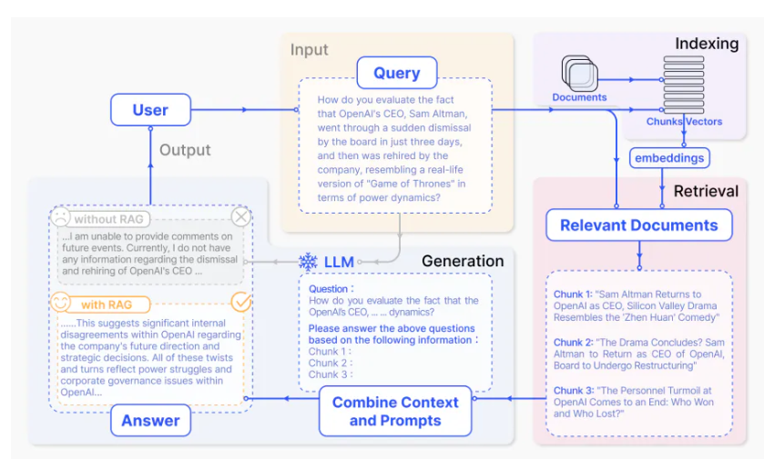
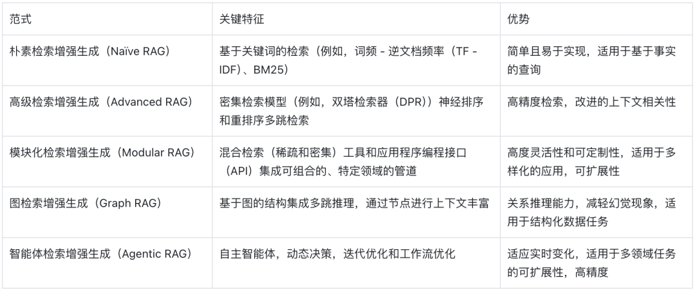
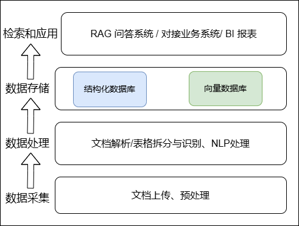
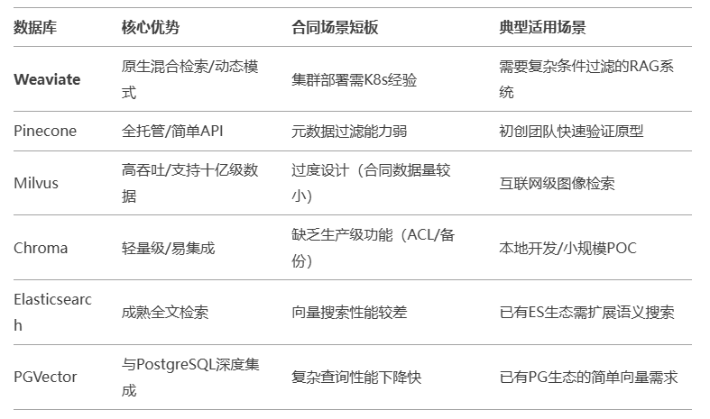

## RAG技术调研

- 当前主流的RAG框架

- 结合业务如何使用构建RAG（以合同流程为例）

  

  **RAG简单流程与总览**



图1：应用于问答的RAG过程的代表性实例。它主要包括3个步骤。1)索引。文档被分割成块，编码成向量，存储在向量数据库中。2)检索。根据语义相似度检索与问题最相关的Top k块。3)生成。将原始问题和检索到的块一起输入LLM，生成最终答案。


图2：RAG三种范式的比较。

(左)朴素RAG主要由三部分组成:索引、检索和生成。

(中)高级RAG围绕检索前和检索后提出了多种优化策略，其过程与朴素RAG相似，仍然遵循链状结构。

(右)模块化RAG继承和发展了以前的范式，整体上展示了更大的灵活性。这在引入多个特定功能模块和替换现有模块方面表现得很明显。整个过程并不局限于顺序检索和生成；它包括迭代和自适应检索等方法



### 当前主流的RAG框架

#### RAGFlow

**GitHub 44.2k stars  4k forks**    https://github.com/infiniflow/ragflow

RAGFlow 是 RAG 框架领域中一个相对较新的加入者，注重简洁性和效率，高度集成化，简化RAG开发复杂度。该框架旨在通过提供一套预建组件和工作流来简化基于 RAG 的应用程序的构建过程：

- 直观的工作流设计界面
- 针对常见用例的预配置 RAG 管道
- 与流行的矢量数据库集成
- 支持自定义嵌入模型

适用于希望快速创建和部署 RAG 应用程序原型，而无需深入研究底层的复杂性。

#### LlamaIndex

**GitHub 39.9k stars   5.7k forks**    https://github.com/run-llama/llama_index

专注数据索引与检索的中间件。LlamaIndex 提供可组合的模块，帮助开发者构建LLM 应用程序，包括 RAG 管道，用于问答、聊天机器人或作为agent的一部分。这些构建模块可以根据偏好进行定制、组合起来，以结构化的方式基于多个知识库进行推理。结合了ReAct模式，可以快速构建ReAct智能体。

#### LangChain

**GitHub 103k stars   16.7k forks**    https://github.com/langchain-ai/langchain

大模型应用开发的全能工具箱。提供 Chain 和 Agent 抽象，可灵活编排 RAG 流程，集成大量数据连接器和向量数据库，支持多种LLM接口。高度的抽象也有可能使得代码变得难以理解、维护，很多开发者诟病之处。


### 结合业务如何使用构建RAG（以合同流程为例）

目前情况：

- 从合同文档中提取信息，低效重复
- 部门之间信息隔阂，不同人员重复劳动

预期实现：

一套系统从 合同归档--->自动化信息提取、增量存储--->信息检索--->暴露前端页面



*系统设计需要模块化，各个组件（解析、提取、存储、检索）尽量解耦，方便单独优化或替换

#### 一. 自动抽取合同文本与关键字段

1. 针对文档（.docx）可直接通过相关解析库（如 `python-docx`、`Unstructured`）进行文本解析。

```
Title: 自助寄存柜合作协议
NarrativeText: 本协议由以下双方于2024年...
Table: <表格JSON数据>
FigureCaption: 表1-设备规格参数表
```

2. 业务字段抽取

   基于规则+NLP实体识别**混合抽取**信息抽取

   规则：文本内容较固定或有明显关键词的字段、出现在特定位置的字段

   NLP 实体识别：选择适用于合同的NER模型，必要时对领域专有名词（网点名称、合作方名称、分成比例等）做fine-tune

#### 二. 向量数据库与 RAG 系统搭建

*文本处理、向量化、入库是离线/增量过程

*「实时检索-生成」的RAG框架专注对向量数据库的检索和 LLM 的调用


1. 文本处理：

- 条款分段：基于标题层级划分知识单元
- 语义分块

2. 向量编码：选择合适的嵌入模型（ OpenAI Embeddings 或 Hugging Face Sentence-BERT）生成向量；然后把向量+文本一起写入向量数据库


Weaviate (支持混合检索) 



依赖一个RAG框架实现RAG系统编排：

1. **Input**：用户的原始问题（Q）
2. **Retrieval**：调用 Weaviate 向量检索接口，根据用户问题的向量嵌入来获取最相似的段落（Top-k）
3. **Context Construction**：将检索到的段落进行适度地合并/精简，比如限制在某个 token 长度以内，以避免模型一次输入过多文本
4. **LLM Call**：将问题 Q + Context 输入到 LLM，形成应答
5. **Post-processing**：根据需要对答案进行格式化、调优或增加引用链接