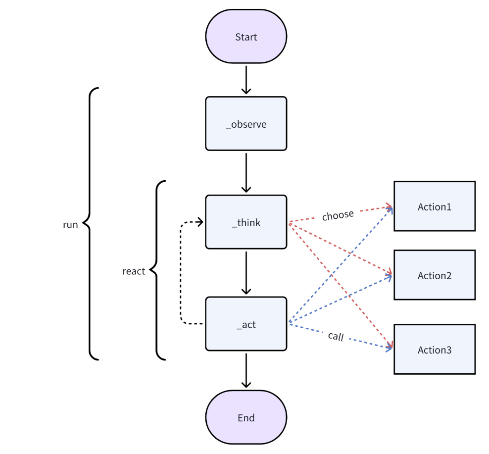

## 1. 智能体入门


```python
from metagpt.context import Context
from metagpt.roles.product_manager import ProductManager
from metagpt.logs import logger

async def main():
    msg = "Write a PRD for a snake game"
    context = Context()  # 显式创建会话Context对象，Role对象会隐式的自动将它共享给自己的Action对象
    role = ProductManager(context=context)
    while msg:
        msg = await role.run(msg)
        logger.info(str(msg))
```

首先显示创建 Context 对象

其次实例化一个角色，ProductManager，并将 Context 对象传入

最后使用实例化角色的 .run（） 方法运行msg


### 1.1 Context 类

主要用于管理MetaGPT运行环境，包括：

- `kwargs`（使用 `AttrDict` 存储额外环境参数）

  其中 `AttrDict` 支持通过属性访问键值对，运行额外字段，额外提供 `set()`、`get()`、`remove()` 方法。

- `config`（系统配置）
- `cost_manager`（费用管理）
- `_llm`（缓存的 LLM 实例）

关键功能：

1. 运行环境变量

   **new_environ**

   复制当前环境变量，返回一个新的环境变量字典。

2. LLM 费用管理

   **_select_costmanager**

   根据不同 LLM 配置，选择合适的费用管理器。

3. 获取 LLM 实例 

   **llm**

   创建 LLM 实例并缓存。

   若 LLM 实例没有 `cost_manager`，则为其设置费用管理器。

4. 直接从 `llm_config` 获取 LLM

   **llm_with_cost_manager_from_llm_config**

   直接基于 `llm_config` 生成一个 LLM 实例，并设置费用管理器。

5. 序列化和反序列化

   **serialize**

   `kwargs` 转换为字典存储。

   `cost_manager` 通过 `model_dump_json()` 序列化为 JSON。

   **deserialize**

   `kwargs` 逐项恢复。

   `cost_manager` 反序列化 JSON 并进行 Pydantic 验证。


### 1.2 专业化角色（RoleZero） 类

所有实例化的专业化角色都继承自 `RoleZero` 类，在所有专业化角色中都包括：

- `name`：str 角色名字
- `profile`：str 角色简介

- `goal`：str 角色目标
- `constraints`：str 角色约束
- `instruction`：`metagpt.prompts` 中获取，该角色的提示词指令，默认定义为常量
- `tools`：list[str] 该角色可用的工具，`metagpt.tools.libs` 中获取

关键功能

1. 初始化

   这里初始化每个专业化角色所需要初始化的都不同

2. 更新工具执行

   **_update_tool_execution**

   创建 `WritePRD()` 实例

   更新工具执行映射，指定 WritePRD 工具的运行方法

3. 自定义能力

   这里专业化角色会有自己定义的能力，例如  `_think`，`_act`，然而这些能力并不是最小化的技能单元。不同的专业化角色可能有相同的 `_think` 方法命名，但却执行不同的作用。所以MetaGPT这里在专业化角色中自定义的能力不是最小单元的技能，而是由多个最小单元的技能操作按照固定顺序封装的方法。

   > 一个更通用的设计是将这些最小单元的技能skills像Tools一样放在技能库里，由外部配置来组装而非固定顺序写死在代码中。由单Agent内部的循环去决定每一个step执行什么样的skill或tool。

> 在基础角色类以上，如果想实现一个动态角色类，所有的角色仅根据不同的配置文件初始化相同的动态角色类，可以尝试使用 `getattr` 动态调用：
>
> ```python
> class DynamicClass:
>     def __init__(self, name, method_choices):
>         self.name = name
>         self.method_map = {
>             "a": self.method_a,
>             "b": self.method_b,
>             "c": self.method_c
>         }
>         self.available_methods = {key: self.method_map[key] for key in method_choices if key in self.method_map}
> 
>     def method_a(self):
>         print(f"{self.name} 执行了 method_a")
> 
>     def method_b(self):
>         print(f"{self.name} 执行了 method_b")
> 
>     def method_c(self):
>         print(f"{self.name} 执行了 method_c")
> 
>     def call_method(self, method_name):
>         method = self.available_methods.get(method_name, lambda: print("未定义的方法"))
>         method()
> 
> # 创建实例
> obj1 = DynamicClass("实例1", ["a", "b"])  # 具有 method_a 和 method_b
> obj2 = DynamicClass("实例2", ["c"])      # 只有 method_c
> 
> # 调用动态方法
> obj1.call_method("a")  # 实例1 执行了 method_a
> obj1.call_method("b")  # 实例1 执行了 method_b
> obj2.call_method("c")  # 实例2 执行了 method_c
> obj2.call_method("a")  # 未定义的方法
> ```
>
> 如果方法名可能变化，`getattr()` 方式更灵活。


#### 1.2.1 RoleZero（Role） 类

RoleZero 定义了一个可以动态思考和行动的角色，具备工具调用和执行功能，并且可以根据配置进行个性化扩展

------

类的基本信息

```python
name: str = "Zero"
profile: str = "RoleZero"
goal: str = ""
system_msg: Optional[list[str]] = None  # 使用 None 作为默认值
system_prompt: str = SYSTEM_PROMPT
cmd_prompt: str = CMD_PROMPT
cmd_prompt_current_state: str = ""
instruction: str = ROLE_INSTRUCTION
task_type_desc: Optional[str] = None
```

`name` 和 `profile`：角色的名称和身份标识。

`goal`：角色的目标，可以动态设置。

`system_msg` / `system_prompt` / `cmd_prompt`：系统和指令相关的提示，影响角色的行为逻辑。

`instruction`：角色的基本指令。

`cmd_prompt_current_state`：用于存储当前的指令状态。

------

反应模式（ReAct）

```python
react_mode: Literal["react"] = "react"
max_react_loop: int = 50
```

`react_mode`：强制为 `"react"`，表示采用 ReAct 框架（结合推理与行动）。

`max_react_loop`：最大反应循环次数，避免死循环。

------

工具（Tools）

```python
tools: list[str] = []  # 使用特殊符号 ["<all>"] 表示使用所有已注册的工具
tool_recommender: Optional[ToolRecommender] = None
tool_execution_map: Annotated[dict[str, Callable], Field(exclude=True)] = {}
special_tool_commands: list[str] = ["Plan.finish_current_task", "end", "Terminal.run_command", "RoleZero.ask_human"]
exclusive_tool_commands: list[str] = [
    "Editor.edit_file_by_replace",
    "Editor.insert_content_at_line",
    "Editor.append_file",
    "Editor.open_file",
]
```

- `tools`：可用工具列表，可以是具体工具，也可以是 `["<all>"]` 表示全部工具。
- `tool_recommender`：工具推荐器，使用 BM25 进行匹配（后续会初始化）。
- `tool_execution_map`：工具名称到实际方法的映射（将在 `set_tool_execution` 里初始化）。
- `special_tool_commands`：这些特殊工具命令具有更高优先级（如 `ask_human`）。
- `exclusive_tool_commands`：独占工具命令，多个出现时只保留第一个。

------

默认工具

```python
editor: Editor = Editor(enable_auto_lint=True)
browser: Browser = Browser()
```

`editor`：提供文本编辑能力。

`browser`：提供网页浏览能力。

------

经验系统

```python
experience_retriever: Annotated[ExpRetriever, Field(exclude=True)] = DummyExpRetriever()
```

`experience_retriever`：经验检索模块（这里默认是 `DummyExpRetriever`，可能后续会替换成更复杂的版本）

------

记忆管理

```python
observe_all_msg_from_buffer: bool = True
command_rsp: str = ""  # 包含命令的原始字符串
commands: list[dict] = []  # 要执行的命令
memory_k: int = 200  # 记忆的数量
use_fixed_sop: bool = False
respond_language: str = ""  # 语言
use_summary: bool = True  # 是否总结
```

`observe_all_msg_from_buffer`：是否观察所有消息缓冲区内容。

`command_rsp` / `commands`：存储执行的命令。

`memory_k`：控制短期记忆容量。

`respond_language`：应答的语言。

`use_summary`：是否在最终总结任务。

------

**`_think` 方法**

该方法用于代理在 `ReAct` 模式下的思考（Think）过程，决定下一步行动。

**兼容性检查**：

- 如果 `use_fixed_sop` 为 `True`，则调用 `super()._think()`（父类的 `_think` 方法）。

**初始化目标**：

- 如果 `self.rc.todo` 为空，说明没有任务要执行，返回 `False`。
- 如果 `self.planner.plan.goal` 为空，则从记忆中获取最新的用户输入内容作为目标 (`self.get_memories()[-1].content`)。
- 通过 `DETECT_LANGUAGE_PROMPT` 让 LLM 检测语言，并存入 `self.respond_language`。

**获取经验**：

- `self._retrieve_experience()` 获取过去的相关经验（可能是从知识库或存储中检索示例）。

**获取计划状态**：

- `self._get_plan_status()` 获取当前计划状态，并返回 `plan_status` 和 `current_task`。

**工具推荐**：

- `self.tool_recommender.recommend_tools()` 推荐适合的工具，并将其转换为 JSON 格式存入 `tool_info`。

**构造系统提示（System Prompt）**：

- `system_prompt` 包含角色信息、任务描述、可用工具、示例、指令等信息。

**生成 LLM 提示（Prompt）**：

- `self.cmd_prompt.format(...)` 构造 LLM 需要的 `prompt`，用于指引 LLM 进行决策。

**处理记忆信息**：

- `memory = self.rc.memory.get(self.memory_k)` 获取历史记忆。
- 解析浏览器动作（`self.parse_browser_actions(memory)`）。
- 解析编辑器结果（`self.parse_editor_result(memory)`）。
- 解析图片（`self.parse_images(memory)`）。

**调用 LLM 进行推理**：

- `req = self.llm.format_msg(memory + [UserMessage(content=prompt)])` 构造 LLM 请求。
- `self.command_rsp = await self.llm_cached_aask(req=req, system_msgs=[system_prompt], state_data=state_data)` 发送请求，获取 LLM 的响应。
- `self.command_rsp = await self._check_duplicates(req, self.command_rsp)` 进行去重检查。

**返回 `True` 表示有任务待执行**。

------

**`_act` 方法**

执行 LLM 生成的命令。

- `commands, ok, self.command_rsp = await self._parse_commands(self.command_rsp)` 解析 LLM 生成的命令。
- 如果解析失败，则将错误信息存入 `self.rc.memory` 并返回错误消息。
- `outputs = await self._run_commands(commands)` 执行命令并获取输出结果。
- 记录命令及其输出。
- 将输出存入 `self.rc.memory` 并返回 `AIMessage`。

------

**`_react` 方法**

实现 `ReAct`（思考-行动-观察-思考）循环。

**设置 `todo`**：

- 调用 `self._set_state(0)` 允许处理新信息。

**快速思考**：

- `quick_rsp, _ = await self._quick_think()` 进行快速推理，如果可以快速回答，则直接返回答案。

**循环执行 `_think` 和 `_act`**：

- 进入 

  ```
  while actions_taken < self.rc.max_react_loop
  ```

   循环：

  - `await self._observe()` 观察新的信息。
  - `has_todo = await self._think()` 进行思考。
  - 如果没有新的待办事项，跳出循环。
  - `rsp = await self._act()` 执行任务。
  - 记录操作次数 `actions_taken += 1`。

**最大操作轮次检查**：

- 如果 `actions_taken >= self.rc.max_react_loop`，向人类用户询问是否继续。

**返回最终的 `rsp`**。

------

其他附加方法暂时不作介绍

#### 1.2.2 Role（BaseRole, ...）类

Role(BaseRole, SerializationMixin, ContextMixin, BaseModel)

> ##### 1.2.2.1 RoleReactMode
>
> 角色反应模式
>
> `RoleReactMode` 是一个 **枚举类**，定义了角色在不同情境下的 **反应方式**：
>
> - `REACT`（react）：常规模式，角色根据接收到的信息立即做出反应。
>
> - `BY_ORDER`（by_order）：按顺序执行任务，可能意味着角色有预设任务链，按步骤执行。
>
> - `PLAN_AND_ACT`（plan_and_act）：先进行规划（如任务分解、策略生成），然后执行。
>
> **作用**：
>
> 影响 `Role` 在 `RoleContext` 中如何处理 **消息和任务**。
>
> 可能决定 `Role` 处理任务的复杂度，例如：
>
> - `REACT` 适用于简单的指令执行。
>
> - `PLAN_AND_ACT` 可能适用于更复杂的 AI 角色，如 LLM 代理。
>
> ------
>
> ##### 1.2.2.2 RoleContext
>
> 角色的运行时上下文
>
> `RoleContext` 维护了角色的运行环境、记忆、状态等数据，是角色在运行时的核心上下文。
>
> **核心属性：**
>
> `env`：角色所在的环境（`BaseEnvironment`），避免循环导入问题。
>
> `msg_buffer`：角色的 **消息缓冲区**，基于 `MessageQueue`，支持异步更新。
>
> `memory`：角色的 **长期记忆**，存储过去的信息。
>
> `working_memory`：角色的 **工作记忆**，用于短期存储当前任务相关的信息。
>
> `state`：角色的 **当前状态**，默认值 `-1` 代表初始状态。
>
> `todo`：角色当前的 **待办任务**，类型为 `Action`，默认为 `None`。
>
> `watch`：角色 **关注的标签集合**，用于筛选重要消息。
>
> `news`：存储角色感兴趣的消息，当前未使用。
>
> `react_mode`：角色的 **反应模式**（`RoleReactMode`），默认值为 `REACT`。
>
> `max_react_loop`：**最大反应循环次数**，用于防止角色陷入无限循环。
>
> **关键方法：**
>
> - `important_memory(self) -> list[Message]` 
>
>   这个方法通过 `watch` 关注的标签，从 `memory` 获取相关记忆。
>
> - `history(self) -> list[Message]`
>
>   获取所有存储在 `memory` 里的对话历史。
>
> **作用**：
>
> `RoleContext` 充当 **角色的“运行时大脑”**，管理 **环境、消息、记忆、任务、状态** 等信息。
>
> 结合 `react_mode`，决定角色如何做出决策。

------

**基本信息**

```python
name: str = ""  # 角色名称
profile: str = ""  # 角色简介
goal: str = ""  # 角色目标
constraints: str = ""  # 角色约束条件
desc: str = ""  # 角色详细描述
role_id: str = ""  # 角色ID
```

**控制逻辑**

`is_human`：表示该角色是否是一个人类代理。如果是，则 LLM（大语言模型）应替换为 `HumanProvider`。

`enable_memory`：控制该角色是否可以记忆过去的信息。

**运行时状态**

`states`：存储角色当前的状态信息，例如当前正在执行的任务、角色的不同阶段等。

`actions`：该角色可以执行的动作，存储 `Action` 实例。

`rc`（`RoleContext`）：用于管理角色的运行时上下文，例如当前的任务状态、对话记录等。

**角色行为**

`addresses`：`set[str]` 角色的地址集合，通常用于消息传递或识别角色。

`planner`：角色的任务计划器，决定如何执行任务。

`recovered`：标记角色是否从某个状态恢复，例如因故暂停后恢复执行。

`latest_observed_msg`：如果角色因中断而停止，该字段会存储最新的观察消息，以便恢复时使用。

`observe_all_msg_from_buffer`：如果为 `True`，角色会存储所有缓冲区中的消息，否则仅存储特定类别的消息。

------

**核心方法**：

- `_think(self) -> bool`

  让智能体思考下一步该做什么

  如果 `actions` 只有一个，就直接执行该 `Action`

  如果存在恢复状态（`self.recovered`），就从 `self.rc.state` 继续

  如果 `react_mode` 是 **BY_ORDER**（按顺序执行），按顺序推进 `self.rc.state`

  其他情况，调用 **LLM 计算下一步状态**，并转换为整数

- `_act(self) -> Message`

  执行当前 `self.rc.todo`

  可能返回 `ActionOutput`、`ActionNode` 或 `Message`

  结果存入 `self.rc.memory`

- `_observe(self) -> int`

  处理新消息

  过滤出感兴趣的消息并存入 `self.rc.memory`

  维护 `self.latest_observed_msg`（最新观察到的消息）

- `_react(self) -> Message`

  **标准 ReAct（思考-行动循环）**

  调用 `_think()` 获取状态

  调用 `_act()` 执行动作

  直到 `self.rc.max_react_loop` 达到上限或任务完成

- `_plan_and_act(self) -> Message`

  先用 `self.planner` 进行 LLM 规划

  再执行多个 **_act()**

  处理任务结果，并返回最终计划

#### 1.2.3 BaseRole(BaseSerialization) 类

`BaseRole` 是一个抽象基类，定义了所有角色（agent）的基本行为。它继承自 `BaseSerialization`，并提供了一些必须由子类实现的方法。其中包含：

`is_idle`：表示角色是否处于空闲状态（即是否没有待执行的任务）

`think`：思考接下来要做什么，并决定下一步的行动。

`act`：执行当前的动作

`react`：`react` 是一个异步方法，表示角色在接收到信息后，采用某种策略进行反应：

​	基于规则 (By Order)：按照预设的顺序执行任务。

​	ReAct (Reason + Act)：通过思考 (`think()`) 和执行 (`act()`) 交替进行推理和行动。

​	基于计划 (Plan & Act)：角色会先制定一个完整的计划，然后依次执行各个任务。

`run`：该方法用于启动角色，使其能够在收到输入消息后进行思考 (`think()`) 并执行 (`act()`)。

​	该方法结合了观察、思考和行动的流程，通常会：观察 (`_observe()`)，思考 (`_think()`)。执行 (`_act()`)


### 1.3 


### 1.x 一个Agent运行周期流程


