## 1. 多Agent协作系统（MAS）相关工作：

### 1.1 MetaGPT

**MetaGPT：The Multi-Agent Framework**

多Agent框架：为 GPT 分配不同的角色，以形成用于复杂任务的协作实体。

该项目 48.6k Star 和 5.8k Fork ：[geekan/MetaGPT: 🌟 The Multi-Agent Framework: First AI Software Company, Towards Natural Language Programming](https://github.com/geekan/MetaGPT?tab=readme-ov-file)

该团队公开的论文：

[MetaGPT: Meta Programming for a Multi-Agent Collaborative Framework](https://arxiv.org/html/2308.00352v7)

MetaGPT支持AFlow自动生成工作流框架

[AFlow: Automating Agentic Workflow Generation](https://arxiv.org/abs/2410.10762)

MetaGPT其他支持实现的功能：

[FACT](https://arxiv.org/abs/2410.21012)，[SELA](https://arxiv.org/abs/2410.17238)，[SPO](https://arxiv.org/pdf/2502.06855)，[AOT](https://arxiv.org/pdf/2502.12018)

> **FACT：**基于上下文检索事实的迭代重写方法，对于用户的查询，通过使用LLM作为检索器或基于向量的方法检索候选事实。然后，这些候选事实位于上下文中，通过删除或替换其他噪声数据来重写它们，从而产生一个新的上下文。这个过程不断重复，指导达到最大迭代次数或满足停止条件。在每次迭代中找到的候选事实被聚合以形成最终的事实集。
>
> 
>
> 
>
> **SELA：**自动化ML树搜索增强型LLM Agent。利用MCTS来优化AutoML工作流。
>
> 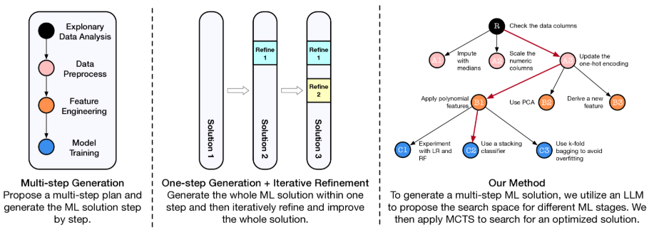
>
> 图一注：与其他基于代理的 AutoML 框架的比较。对于 AutoML 问题，基于代理的方法主要有两种类型。第一种方法将一个机器学习任务分为多个阶段，为每个阶段提出一个计划，并根据计划逐步生成和执行代码，方案完成后不做细化。第二中在一个步骤中生成整个解决方案，并将其作为一个整体迭代优化。我们SELA集成了这两种方法，支持分阶段规划，同时在每个阶段级别迭代探索更好的解决方案。
>
> 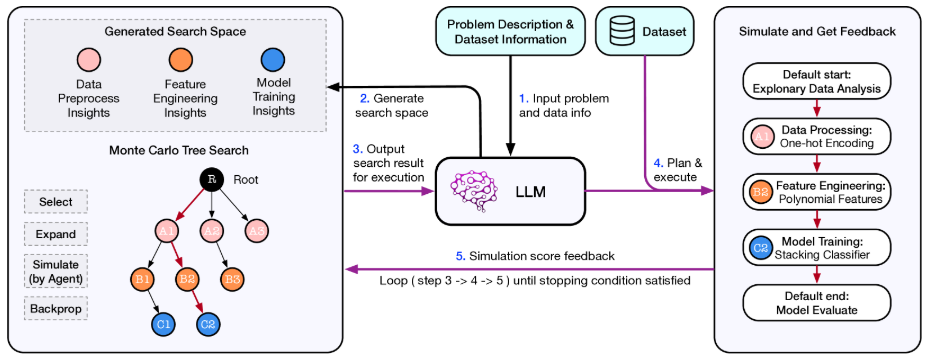
>
> 图二注：系统首先将问题描述和数据集信息输入到 LLM 中，LLM 会生成潜在解决方案的搜索空间，包括数据预处理、特征工程和模型训练。搜索模块由蒙特卡洛树搜索（MCTS） 提供支持，通过选择、扩展和模拟潜在配置来探索此空间。然后，LLM 代理通过规划、编码和执行实验来模拟选定的配置。来自模拟的反馈被反馈到搜索模块中，在反向传播步骤中用于优化未来的搜索。此迭代过程将持续，直到满足预定义的停止标准，从而产生优化的实验pipeline。
>
> 
>
> **SPO：**自监督提示优化（SPO），LLM可以有效地评估队任务需求的遵守程度，受此观察的激励，纯粹从输出比较重获得评估和优化信号。SPO优于最先进的提示优化方法，以现有方法1.1%-5.6%的成本和更少的样本（3个）取得相当或更好的结果。
>
> 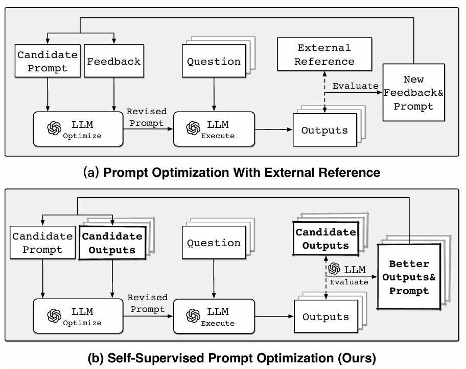
>
> 图一注：提示优化方法的比较。（a） 通过外部参考说明了传统的提示优化过程，其中来自人类基本事实的反馈用于迭代改进最佳提示。（b） 我们提出的自我监督提示优化，它利用 LLM 自身输出的成对比较来优化提示，而无需依赖外部参考。
>
> 
>
> **AOT：**测试时规模扩展（test-time scaling）进一步增强LLM在推理阶段的能力。现有的测试时扩展方法会受到历史信息累积的影响，不仅浪费计算资源，还会干扰有效推理。
>
> 我们发现复杂推理的进展通常通过解决一系列相互独立的子问题来实现，每个子问题都是 自包含（self-contained）且可验证的（verifiable）。这些子问题本质上是原子问题（atomic questions），主要依赖于 当前状态，而非累计的历史信息，这与 马尔可夫过程（Markov process） 中的无记忆性状态转移相似。
>
> 基于这一观察，我们提出 原子思维（Atom of Thoughts, AoT） 方法。在 AoT 中，推理过程的每一步都涉及 将当前问题分解为基于依赖关系的有向无环图（DAG），并 收缩（contract）其子问题，从而形成新的原子问题状态。这一 迭代的分解-收缩（decomposition-contraction） 过程会持续进行，直到得到可直接求解的原子问题，进而 自然实现问题状态之间的马尔可夫转移。
>
> 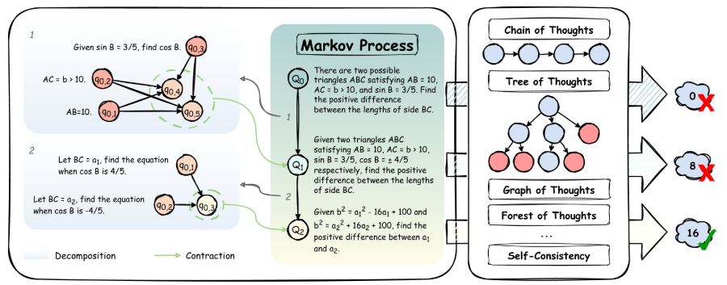
>
> 图一注：**AoT 概述**。左侧部分展示了 我们的马尔可夫过程，其中每个状态 $Q_i$ 代表一个 原子推理状态（atomic reasoning state），通过 DAG 分解 和 收缩（contraction） 由其前驱状态推导而来；右侧部分展示了 AoT 与现有测试时扩展方法（如 CoT、ToT）的集成能力。该集成的 关键特性 在于：任意中间状态 $Q_i$ 都可以作为其他方法的起点（$Q_0$），使得不同方法能够灵活组合，同时保证答案与原始问题的等价性。
>
> 这一设计使得 AoT 既可以作为独立的迭代推理框架，也可以作为预处理模块，通过结构优化 增强现有方法。

MetaGPT项目的论文于23.8月公开，其被ICLR 2024接收，并在同期LLM-based Agent category工作中排名第一

------

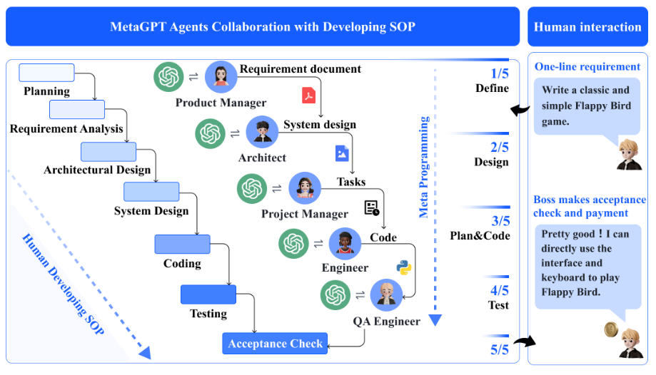

图一注： **MetaGPT 和现实世界的人类团队之间的软件开发 SOP。**在软件工程中，SOP 促进不同角色之间的协作。 MetaGPT 展示了它将复杂任务分解为分配给各种角色（例如，产品经理、架构师、工程师等）的特定可作程序的能力。

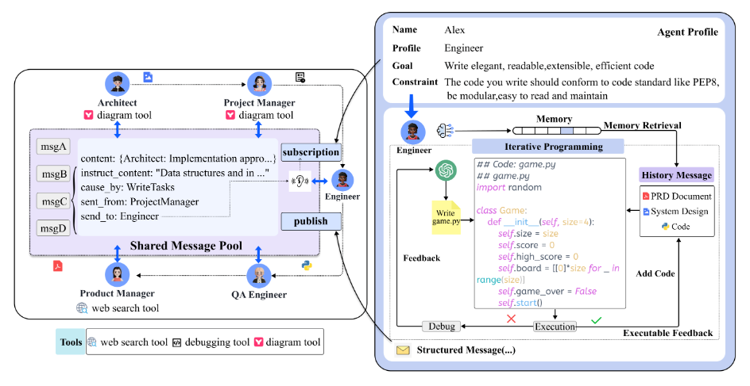

图二注：通信协议示例（左）和带有可执行反馈的迭代编程示例（右）。**左**：Agent使用共享消息池发布结构化消息。他们还可以根据自己的配置文件订阅相关消息。**右**：生成初始代码后，Engineer Agent运行并检查错误。如果发生错误，Agent会检查存储在内存中的过去消息，并将其与 PRD、系统设计和代码文件进行比较。

#### 角色专业化

明确的角色专业化可以将复杂的工作分解为更小、更具体的任务。 解决复杂的任务或问题通常需要具有不同技能和专业知识的座席合作，每个座席都为特定问题提供量身定制的专业输出。

在 MetaGPT 中，我们指定Agent的配置文件，其中包括他们的名称、配置文件、目标和每个角色的约束。 我们还为每个角色初始化特定的上下文和技能。例如，产品经理可以使用 Web 搜索工具，而工程师可以执行代码，如图 [2](https://arxiv.org/html/2308.00352v7#S3.F2) 所示。

**每个Agent都会监控环境**（*即* MetaGPT 中的消息池）以发现重要的观察结果（*例如，*来自其他Agent的消息）。这些消息可以直接触发作或帮助完成作业。

#### 跨Agent的工作流

通过定义Agent的角色和作技能，我们可以建立基本的工作流程。在我们的工作中，我们在软件开发中遵循 SOP，这使得所有Agent都能按顺序工作。

具体来说，如图 [1](https://arxiv.org/html/2308.00352v7#S1.F1) 所示，在获得用户需求后，产品经理进行全面分析，制定详细的 PRD，其中包括 User Stories 和 Requirement Pool。这用作初步的功能分解。然后，结构化的 PRD 被传递给架构师，架构师将需求转换为系统设计组件，例如文件列表、数据结构和接口定义。一旦在系统设计中捕获，信息就会被直接发送给项目经理进行任务分配。工程师继续执行指定的类和函数，如图 2 所示（详见[图 2](https://arxiv.org/html/2308.00352v7#S3.F2)）。在接下来的阶段，QA 工程师制定测试用例以强制实施严格的代码质量。

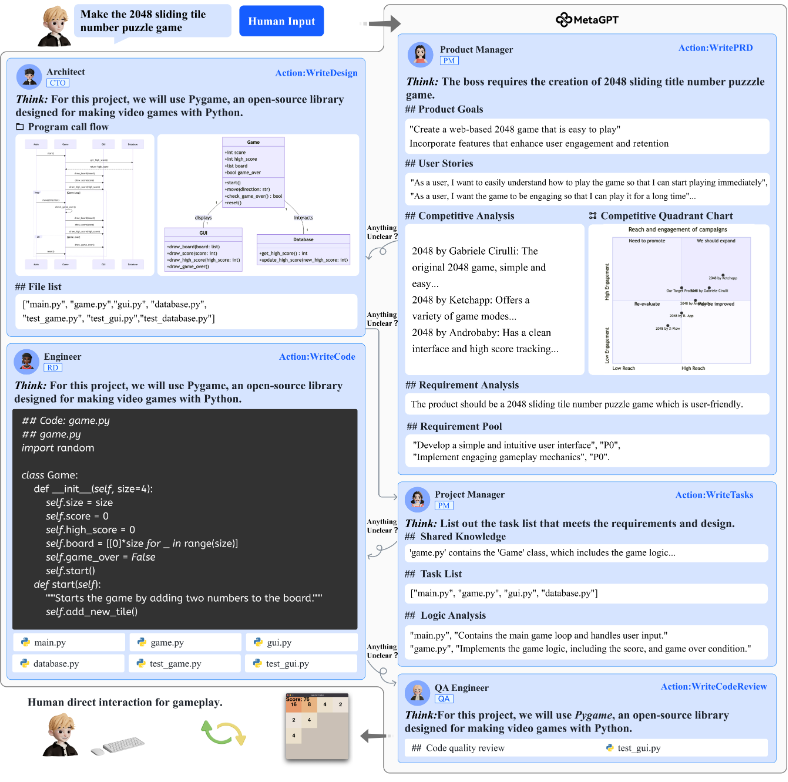

图三注：显示 MetaGPT 中软件开发过程的图表，强调其对 SOP 的严重依赖。

#### 结构化通信接口

当前基于 LLM 的多Agent框架（Li 等人，[2023](https://arxiv.org/html/2308.00352v7#bib.bib28);Zhuge 等人，[2023](https://arxiv.org/html/2308.00352v7#bib.bib77);Zhang et al.，[2023 年一](https://arxiv.org/html/2308.00352v7#bib.bib71);Park 等人，[2023](https://arxiv.org/html/2308.00352v7#bib.bib42)) 利用不受约束的自然语言作为通信接口。

然而，尽管自然语言用途广泛，但一个问题出现了：纯自然语言交流是否足以解决复杂的任务？ 例如，在电话游戏中（或中文耳语）2，经过几轮沟通，原始信息可能会相当失真。 受人类社会结构的启发，我们建议使用结构化通信来构建Agent的通信。我们为每个角色建立架构和格式，并要求个人根据其特定角色和背景提供必要的输出。

如图 [3](https://arxiv.org/html/2308.00352v7#S3.F3) 所示，Architect Agent生成两个输出：系统接口设计和序列流程图。这些包含系统模块设计和交互序列，它们是工程师的重要交付成果。 与 ChatDev 不同（Zhao 等人，[2023](https://arxiv.org/html/2308.00352v7#bib.bib73))，MetaGPT 中的Agent通过文档和图表（结构化输出）而不是对话进行通信。这些文档包含所有必要的信息，防止不相关或缺失的内容。

#### 发布-订阅机制

共享信息在协作中至关重要。 例如，架构师和工程师经常需要引用 PRD。但是，正如以前的工作所表明的那样，每次都以一对一的方式传达此信息（Li 等人，[2023](https://arxiv.org/html/2308.00352v7#bib.bib28);Zhao 等人，[2023](https://arxiv.org/html/2308.00352v7#bib.bib73);Zhang et al.，[2023 年一](https://arxiv.org/html/2308.00352v7#bib.bib71))可能会使通信拓扑复杂化，从而导致效率低下。

为了应对这一挑战，一种可行的方法是将信息存储在全局*消息池中*。 如图 [2](https://arxiv.org/html/2308.00352v7#S3.F2) 所示（左），我们引入了一个共享消息池，它允许所有Agent直接交换消息。这些Agent不仅**在池中发布**其结构化消息，而且还透明地访问来自其他实体的消息。 任何Agent都可以直接从共享池中检索所需信息，无需询问其他Agent并等待他们的响应。这提高了通信效率。

与每个Agent共享所有信息可能会导致信息过载。 在任务执行期间，Agent通常更喜欢只接收与任务相关的信息，并避免因不相关的细节而分心。 这些信息的有效管理和传播起着至关重要的作用。 我们提供了一种简单有效的解决方案**订阅机制**（如图 [2](https://arxiv.org/html/2308.00352v7#S3.F2) （左）所示）。 Agent不依赖对话，而是利用特定于角色的利益来提取相关信息。他们可以根据其角色配置文件选择要关注的信息。 在实际实现中，Agent仅在收到其所有先决条件依赖项后才会激活其作。如图 [3](https://arxiv.org/html/2308.00352v7#S3.F3) 所示，架构师主要关注产品经理提供的 PRD，而来自 QA 工程师等角色的文档可能不太重要。

### 1.2 AFLOW 

[AFlow: Automating Agentic Workflow Generation](https://arxiv.org/abs/2410.10762)

MetaGPT所支持的后续工作AFlow于24.10月公开，其被ICLR 2025接收，并在同期LLM-based Agent category工作中排名第二

------

大型语言模型 （LLM） 在解决不同领域的复杂任务方面表现出了巨大的潜力，通常是通过采用遵循详细说明和作顺序的Agent工作。但是，构建这些工作流需要大量的人力，从而限制了可扩展性和通用性。最近的研究试图自动生成和优化这些工作流程，但现有方法仍然依赖于初始人工设置，无法实现完全自动化和有效的工作流程生成。

为了应对这一挑战，我们将工作流优化重新表述为代码表示工作流上的搜索问题，其中 LLM 调用节点由边沿（edge）连接。我们介绍了 AFLOW，这是一个自动化框架，它使用 Monte Carlo Tree Search 有效地探索这一领域，通过代码修改、树状结构体验和执行反馈迭代优化工作流程。

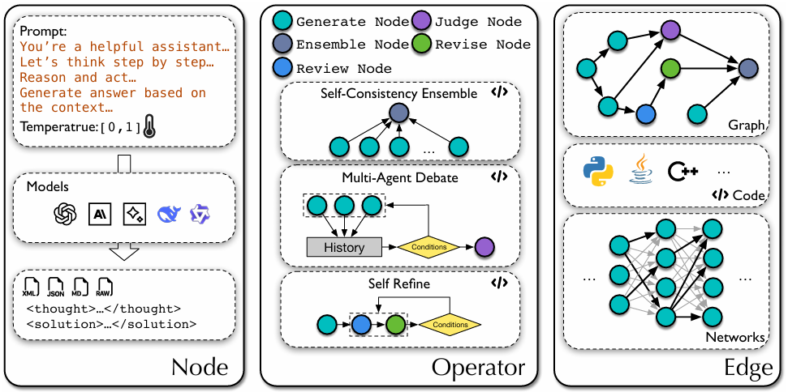

图一注：node、operator 和 edge 的示例。我们演示了 Node 的可选参数、一些 Operator 的结构以及 Edge 的常见表示形式。

#### Agent工作流

我们将Agent工作流 W 定义为一系列由边沿连接的 LLM 调用节点，以定义执行顺序，表示为 N = {N1，N2,...,Ni ...}。每个节点 Ni 代表 LLM 执行的特定作，其特征如下。

- 模型 M：在节点 Ni 处调用的特定语言模型。
- 提示 P：在每个节点提供给模型的输入或任务说明。
- 温度 τ：控制 LLM 在节点 Ni 处输出随机性的参数。
- 输出格式 F：模型输出的结构格式 （例如，xml、json、markdown、raw）。工作流中的节点应提供不同的输出格式。

边沿 E 表示定义节点关系的摘要结构，控制执行顺序。边沿 E 可以通过各种结构表示，例如：

- Graph （Zhuge et al. 2024）：一种灵活的结构，表示节点之间的分层、顺序或同等等位关系，允许复杂的分支工作流程。
- Neural Network（Liu et al.， 2023）：一种可以表示节点之间复杂、非线性关系的结构，允许基于输入和反馈的自适应和可学习的工作流程。
- Code（胡 et al.， 2024）：一种全面的表示，可以表达线性序列、条件逻辑、循环，并结合图形或网络结构，为 LLM 的工作流执行提供最精确的控制

虽然图形结构可以表示工作流关系，但它们需要除基本 DAG 之外的复杂扩展（例如，Petri网、BPMN）才能自然地表达并行执行和条件逻辑。神经网络支持自适应过渡，但缺乏对工作流程执行的精确控制。相比之下，代码表示本身就通过标准 program-ming 构造支持所有这些关系。因此，我们采用代码作为主要的边沿结构，以最大限度地提高表现度。

#### 自动工作流优化

在给定任务 $T$ 和评估函数 $G$ 的情况下，工作流优化的目标是找到一个 工作流 $W$，使得 $G(W,T)$ 最大化。这可以形式化为一个搜索过程，其中算法 $A$ 在搜索空间 $S$ 中探索，以确定最优的工作流配置。

工作流优化问题的 搜索空间 $S$ 包含所有可能的 节点参数配置 和 边沿结构，其数学表示如下：
$$
S = \{ (N, E) \ | \ E \in \mathcal{E} \}
$$
其中：

$N = \{ N(M, \tau, P, F) \ | \ M \in \mathcal{M}, \tau \in [0,1], P \in \mathcal{P}, F \in \mathcal{F} \}$

- $\mathcal{M}$ —— 可能的**语言模型**集合
- $\mathcal{P}$ —— 可能的**提示（Prompt）**集合
- $\mathcal{F}$ —— 可能的**输出格式**集合
- $\mathcal{E}$ —— 可能的**边结构**集合

在上述定义下，工作流优化问题可以表述为：
$$
W = A(S, G, T)
$$
其中：

- $A$ 是用于搜索的**优化算法**，
- $S$ 是搜索空间，
- $G$ 是评估函数，
- $T$ 是给定的任务，
- $W$ 是搜索得到的工作流配置。

最终，我们希望找到最优的工作流 $W^*$，使得：
$$
W^* = \arg\max_{W \in S} G(W, T)
$$
即，我们要找到一个最优的工作流配置 $W^*$，使得其在任务 $T$ 下的评估函数 $G(W,T)$ 取得最大值。

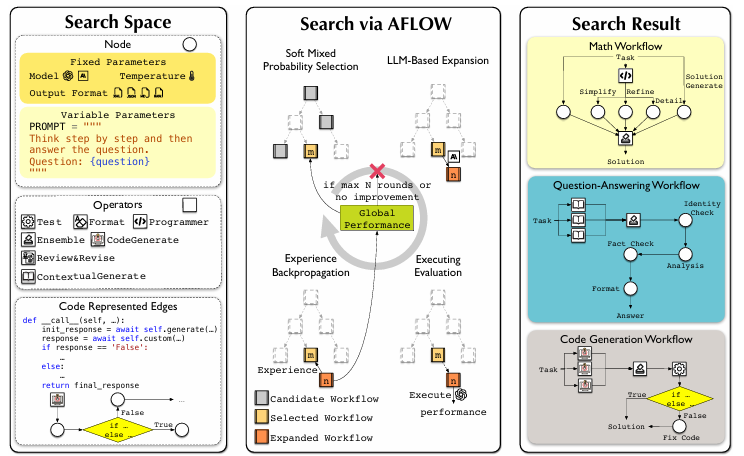

图二注：总体AFLOW框架：通过设置一个搜索空间由节点组成，其中只有 prompt 参数可修改，一个给定的运算符集（Operators set），以及一个代码表示的边沿集（Code Represented Edges），AFLOW 在此空间内执行基于 MCTS 的搜索。通过为工作流作计时设计的 MCTS 变体，AFLOW 迭代执行 Soft Mixed Probability Selection 的循环，基于 LLM 的扩展，Execution Evaluation 和 Experience Backpropagation，直到达到最大迭代次数或满足收敛条件。

#### AFLOW 概览

为了解决以前方法的局限性，我们提出了一种新颖的框架工作，该工作**利用 LLMs 作为蒙特卡洛树搜索（MCTS）的优化器来搜索最佳工作流**。正如上文讨论的，边集（edges）可以同时在图和代码中表示。为了确保 AFLOW 能够探索所有可能的智能体（Agentic）工作流，我们使用 代码 来表示 节点 $N$ 和 边 $E$。具体而言，如 图二 所示。

为了提高搜索效率，AFLOW 固定了一些关键参数，包括：模型$M$，温度 $\tau$，输出格式 $F$ 。这种简化使得 AFLOW 的搜索主要集中在代码表示的边 $E$ 和提示词（Prompt） 上

由于搜索空间仍然庞大，我们引入了 Operators（操作符）的概念。这些 Operators 封装了常见的Agent操作（如 集成（Ensemble）、审查（Review）、修改（Revise）），它们将 节点 $N$ 和边 $E$ 组合成统一的接口，从而提升 AFLOW 的搜索效率，并简化工作流的生成。

正式地，给定一组 Operators 集合 **$O$**，其中每个 Operator 代表预定义的节点组合，同时边 **$E$** 由代码表示，则 AFLOW 的优化问题可定义为：
$$
S_{\text{AFlow}} = \{ (P_1, ..., P_n, E, O_1, ..., O_n) \ | \ P_i \in \mathcal{P}, E \in \mathcal{E}, O_i \in \mathcal{O} \}
$$
AFLOW 通过优化搜索空间 **$S_{\text{AFlow}}$** 来找到最优的工作流 $W^*$：
$$
W^* = \text{AFLOW}(S_{\text{AFlow}}, G, T)
$$
其中：

- $S_{\text{AFlow}}$ 表示**AFLOW 的搜索空间**，
- $G$ 是评估函数，
- $T$ 是任务，
- $W^*$ 是优化后的最优工作流。

通过这种方法，AFLOW 高效探索搜索空间，生成**优化的Agent工作流**。

#### 任务范围于操作符

在本文中，我们专注于将 **AFLOW** 应用于**具有数值评估函数的推理任务**。我们从现有文献中提取了常见操作，并将其定义为**操作符集合 $O$** 的一部分。这些操作包括：

1. **生成（Generate）**
2. **格式化（Format）**
3. **审查与修改（Review and Revise）** *（Madaan et al., 2023）*
4. **集成（Ensemble）** *（Wang et al., 2022）*
5. **测试（Test）** *（Zhong et al., 2024a）*
6. **编程（Programmer）**
7. **自定义（Custom）**（作为基本节点构造的默认操作符）

操作符集合 $O$ 可轻松扩展，以提升不同任务的搜索效率。

即使没有任何预定义操作符，AFLOW 仍然可以使用 Custom 操作符 构建不同的工作流节点。

#### AFLOW设计细节

AFLOW 的核心理念是利用大语言模型（LLMs）作为优化器，结合蒙特卡洛树搜索（MCTS）变体来发现高效的工作流。在我们的 MCTS 结构中，每个树节点表示一个完整的工作流，而非单独调用 LLM 的节点。这种设计使得 AFLOW 能够发现适用于一类问题的通用解决方案。

搜索过程采用迭代循环，包括以下几个关键步骤：

1. **软混合概率选择（Soft Mixed Probability Selection）**
2. **LLM 进行优化扩展（LLM-based Optimization Expansion）**
3. **执行评估（Execution Evaluation）**
4. **经验回传（Experience Backpropagation）**

整个流程会持续进行，直至达到最大迭代次数或满足收敛条件。简化流程示意图如图 3 所示，详细算法流程和理论分析可见原文附录 A.6 和 G。

当前的工作流优化方法依赖于使用过去的工作流结构来提示 LLM 生成新结构。但由于信息在累积过程中丢失（输入 Token 数量增加导致），这一方法难以有效引导 LLM 优化特定性能指标。此外，代码的巨大搜索空间进一步降低了搜索效率。

AFLOW 采用MCTS 树结构，在Nmax 轮优化中保留基于工作流的探索经验：

- 当某个工作流被重新访问时，AFLOW 能精准复用过去的成功经验并避免失败路径，从而提升搜索效率并生成更优的工作流。
- 为防止陷入局部最优解，我们引入了一种特殊选择机制，允许在任何轮次从空白模板重新生成工作流。

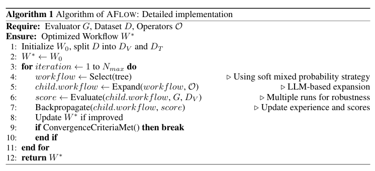

**1.初始化（Initialization）**

AFLOW 以一个模板工作流 $W_0$ 作为起点，该模板用于调用节点和操作符。

代码模板（详见附录 A.3）允许 LLM 通过补全函数调用来完成工作流。

在正式开始搜索之前，AFLOW 随机划分数据集：

- 验证集：20%
- 测试集：80%
- 固定随机种子为 42 以保证实验可复现性。

优化计算效率：

- AFLOW 先在验证集上运行空白模板 5 次，然后筛选分数方差较大的子集作为最终验证集。

**2.选择（Selection）**

初始工作流评估：

- 我们首先在验证集上评估一个空白工作流，作为基准。

软混合概率选择策略（Soft Mixed Probability Selection）：

- 结合均匀分布和基于分数的加权概率分布，从前 k 个最佳工作流以及初始工作流中进行选择。
- 保留初始工作流的目的是确保持续探索能力，避免陷入局部最优。

软混合概率 $P_{\text{mixed}}(i)$ 计算如下：
$$
P_{\text{mixed}}(i) = \lambda \cdot \frac{1}{n} + (1 - \lambda) \cdot \frac{\exp(\alpha \cdot (s_i - s_{\max}))}{\sum_{j=1}^{n} \exp(\alpha \cdot (s_j - s_{\max}))}
$$
其中：

- $n$ ：工作流总数
- $s_i$ ：第 $i$ 个工作流的得分
- $s_{\max}$ ：最高分工作流的得分
- $\alpha = 0.4$ ：控制分数的影响权重
- $\lambda = 0.2$ ：在探索（exploration）与开发（exploitation）之间进行平衡

**3.扩展（Expansion）**

在扩展阶段，我们使用 LLM 作为优化器来创建新工作流（优化提示示例见附录 A.1）。

优化器的核心思路：

- 利用已选工作流的经验生成新的提示，或
- 修改节点连接方式（更改代码）以形成新工作流。

最大化挖掘历史经验：

- 记录所有修改操作及其对应的改进或失败情况。
- 精确记录预测结果与预期输出，确保优化器能有效学习历史信息。

**4.评估（Evaluation）**

由于推理任务中具有显式的评估函数，AFLOW 通过直接执行工作流来获得反馈：

- 每个生成的工作流在验证集上测试 5 次，计算均值和标准差。
- 尽管每轮迭代的计算成本增加，但能提供更准确的反馈，提升优化器的搜索效率。
- 高精度反馈有助于减少总迭代次数，从而加速找到有效的解决方案。

**5.回传（Backpropagation）**

执行完成后，我们记录以下信息：

1. 工作流的性能。
2. 优化器对其父工作流的修改。
3. 相较于父工作流的优化成功与否。

这些信息会：

- 存入经验库并向父工作流回传。
- 工作流的性能分数会加入全局记录，用于后续选择。

**6.终止条件（Terminal Condition）**

为了减少不必要的计算成本，AFLOW 采用提前停止（Early Stopping）策略：

- 若前 k 个最佳工作流的平均得分在连续 n 轮内未提升，则提前终止。
- 若未提前终止，则最多运行 N 轮后停止。

详细算法流程见原文附录 A.6。

### 1.3 ChatDev

**ChatDev：Communicative Agents for Software Development**

清华与悉尼大学合作研究：用于软件开发的通信Agent

该项目拥有 26.3k Star 和 3.3k Fork，地址：

https://github.com/OpenBMB/ChatDev

论文地址：[ChatDev: Communicative Agents for Software Development](https://arxiv.org/html/2307.07924v5)

我们介绍了 ChatDev，这是一个聊天驱动的软件开发框架，它集成了多个“软件Agent”，这些Agent具有各种社交角色（*例如，*需求分析师、专业程序员和测试工程师），在软件生命周期的核心阶段进行协作，参见图 [1](https://arxiv.org/html/2307.07924v5#S0.F1)。 从技术上讲，为了促进合作沟通，ChatDev 引入了*聊天链*，进一步将每个阶段分解为更小且可管理的子任务，从而指导不同角色之间的多轮沟通，为每个子任务提出和验证解决方案。 此外，为了减轻意外的幻觉，设计了一种称为*交际幻觉的*交际模式，其中Agent在直接回应之前要求更详细的信息，然后根据这些细节继续下一轮交流。

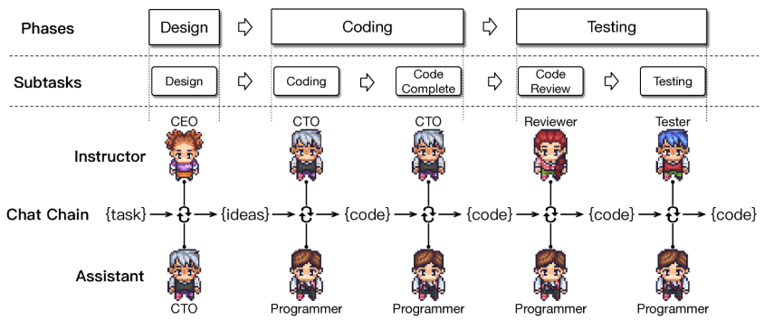

图一注：在收到初步任务要求（*例如，*“*开发 Gomoku 游戏*”）后，这些软件Agent会进行多回合通信，并沿着链式结构化的工作流程执行指令跟踪，协作自主执行一系列子任务，以制定全面的解决方案。

#### 聊天链

尽管大语言模型（LLMs）在自然语言和编程语言方面表现出良好的理解能力，但要高效地将文本需求一步转化为可运行的软件仍然是一个重大挑战。因此，ChatDev 采用瀑布模型的核心原则，并使用**聊天链（$C$）**来组织软件开发流程。该流程由**顺序阶段（$P$）**组成，每个阶段包含**顺序子任务（T）**。

具体而言，ChatDev 将软件开发过程划分为三个顺序阶段：设计、编码和测试。其中，编码阶段进一步细分为代码编写和代码补全子任务，测试阶段则分为代码审查（静态测试）和系统测试（动态测试），如图 1 所示。

在每个子任务中，两个具有专门技能的Agent（例如，一个擅长识别死循环的审查员和一个精通 GUI 设计的程序员）分别扮演**指导者（$I$）**和**助手（$A$）**的角色： 

- 指导者agent负责提出指令，引导（→）对话向着子任务的完成方向进行； 
- 助手agent根据指令提供（↝）合适的解决方案。

它们通过多轮对话（𝖢）协同合作，直到达成共识，并提取（τ）最终的解决方案。这个解决方案可以是文本（例如软件功能点的定义），也可以是代码（例如源代码的初始版本）。最终，子任务得以完成。整个任务求解过程基于Agent工作流，可形式化表示如下：
$$
C = ⟨P^1, P^2, …, P^{|C|}⟩
$$

$$
P^i = ⟨T^1, T^2, …, /T^{|P^i|}⟩
$$

$$
T^j = τ(C(I, A))
$$

$$
C(I, A) = ⟨I → A, A ↝ I⟩ ↺
$$

ChatDev 采用的**双Agent通信设计**避免了复杂的多Agent拓扑结构，从而简化了沟通过程并提高了共识达成的效率。此外，先前任务的解决方案可以作为桥梁，顺畅地过渡到下一个阶段，确保任务间的衔接性。这个流程会持续进行，直到所有子任务完成。

值得注意的是，这种链式结构虽然概念上简单，但在实践中非常高效。它不仅指导Agent之间的交流，促进协作，还能顺畅衔接自然语言任务与编程任务。此外，该结构提供了透明化的软件开发流程，使得开发者能够检查中间解决方案，并及时发现潜在问题

#### Agent

为了确保稳健且高效的工作流，ChatDev 采用 **Inception Prompting 机制**（Li et al., 2023a）来 启动、维持和终结 Agent之间的通信。该机制由 指导者系统提示（$P_I$） 和 助手系统提示（$P_A$）组成。

这两种系统提示在结构上大致对称，主要包含以下内容：

- 当前子任务的概述和目标 
- 具体的角色分工 
- 可访问的外部工具 
- 通信协议 
- 终止条件 
- 约束条件（避免不良行为）

随后，通过使用 $P_I$ 和 $P_A$ 对大语言模型（LLM）进行引导，可以分别实例化 **指导者（$I$）** 和 **助手（$A$）**：
$$
I = ρ(LLM, P_I), \quad A = ρ(LLM, P_A)
$$
其中，$ρ$ 代表角色定制操作，具体实现方式是通过系统消息设定来完成角色指派。

#### 记忆

由于常见的大语言模型（LLM）存在有限的上下文长度，通常难以维护所有Agent和阶段的完整通信历史。为了解决这一问题，我们基于聊天链（Chat Chain）的特性，对Agent的上下文记忆进行分段，划分为两种功能不同的记忆类型：短期记忆（Short-Term Memory, $M$） 和 长期记忆（Long-Term Memory, $M^\sim$）。

 短期记忆用于维持单个阶段内的对话连续性。长期记忆用于在不同阶段之间保持上下文感知。

**短期记忆 **记录Agent当前阶段的对话内容，辅助其进行上下文感知的决策。在阶段 **$P_i$** 的时间步 **$t$**，我们用 **$I^t_i$** 表示指导者的指令，**$A^t_i$** 表示助手的响应。那么，短期记忆 **$M$** 在时间 **$t$** 时的存储内容如下：
$$
M^t_i = \langle (I^1_i, A^1_i), (I^2_i, A^2_i), \dots, (I^t_i, A^t_i) \rangle
$$
在下一时间步 **$t+1$** 时，指导者利用当前记忆生成新的指令 **$I^{t+1}_i$**，然后传递给助手，助手根据指令生成新的响应 **$A^{t+1}_i$**。短期记忆随着对话进行不断更新，直到达到设定的上限 **$|M_i|$**：
$$
I^{t+1}_i = I(M^t_i), \quad A^{t+1}_i = A(M^t_i, I^{t+1}_i)
$$

$$
M^{t+1}_i = M^t_i \cup (I^{t+1}_i, A^{t+1}_i)
$$

**长期记忆** $M^\sim$ 为了在不同阶段之间传递上下文信息，聊天链仅传输每个阶段的最终解决方案，并在下一个阶段开始时引入，以实现跨阶段的上下文关联：
$$
I^1_{i+1} = M^\sim_i \cup P_I^{i+1}, \quad M^\sim_i = \bigcup_{j=1}^{i} \tau(M^{|M_j|}_j)
$$
其中，**$P$** 代表每个阶段开始时的预设提示（Prompt）。通过仅共享每个子任务的最终解决方案，而不是完整的通信历史，ChatDev 有效地减少了信息过载的风险，使Agent能更加专注于当前任务，实现更精准的协作。同时，这种方式也增强了跨阶段的上下文连续性，确保整个软件开发过程的信息流畅传递。

#### 交际幻觉

当助手难以精确遵循指令时，经常会出现编码幻觉，这通常是由于某些指令的模糊性和通用性，需要多次调整，这使得Agent难以实现完全依从性。 受此启发，我们引入了*交际幻*觉，鼓励助手在做出正式回应之前主动向教练寻求更详细的建议。

在 ChatDev 体系中，指导者（Instructor, $I$） 与 助手（Assistant, $A$） 之间的基础通信模式遵循 指令-响应（Instruction-Response）的简单格式：
$$
\langle I \to A, A \rightsquigarrow I \rangle \circlearrowleft
$$
交互式去幻觉机制：相比于简单的指令-响应模式，我们引入了一种“角色反转”机制（Role Reversal），使助手能够在生成最终答案之前，主动询问更具体的信息（例如，外部依赖的具体名称及其相关类）。这一机制的交互流程如下：

1. **指导者 → 助手**：指导者提供初始指令； 
2. **助手 → 指导者**：助手主动询问具体信息； 
3. **指导者 → 助手**：指导者提供具体的修改建议；
4. **助手 → 指导者**：助手执行优化并返回最终响应。

其通信模式如下：
$$
\langle I \to A, \langle A \to I, I \rightsquigarrow A \rangle \circlearrowleft, A \rightsquigarrow I \rangle \circlearrowleft
$$
由于此机制一次解决一个具体问题，因此需要多轮沟通以优化各种潜在问题。 通信模式指示Agent如何通信，实现更精细的信息交换以实现有效的解决方案优化，这实际上有助于减少编码幻觉。

### 1.4 AutoGen

**AutoGen：Enabling Next-Gen LLM Applications via Multi-Agent Conversation**

微软开源，多Agent协作的下一代LLM应用

该项目拥有 40.6k Star 和 6k Fork，地址：[microsoft/autogen: A programming framework for agentic AI 🤖 PyPi: autogen-agentchat Discord: https://aka.ms/autogen-discord Office Hour: https://aka.ms/autogen-officehour](https://github.com/microsoft/autogen)

论文地址：https://arxiv.org/pdf/2308.08155

该框架允许开发人员通过多个Agent构建 LLM 应用程序，这些Agent可以相互交谈以完成任务。AutoGen Agent 是可定制的、可交谈的，并且可以在采用 LLM、人工输入和工具组合的各种模式下运行。使用 AutoGen，开发人员还可以灵活地定义Agent交互行为。

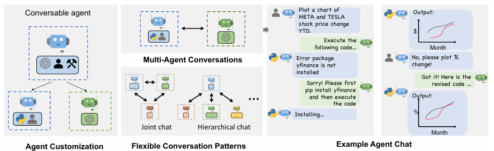

图一注：AutoGen 使用多Agent对话支持基于 LLM 的各种应用程序。（左）AutoGen Agent是可对话的、可定制的，并且可以基于 LLM、工具、人类，甚至是它们的组合。（上中）Agent可以交谈以解决任务。（右）他们可以与循环中的人类形成聊天。（中下）该框架支持灵活的对话模式

#### 可交互Agents

在 AutoGen 中，可交互Agent是具有特定角色的实体，它可以传递消息以与其他可交互Agent发送和接收信息，例如，开始或继续对话。它根据发送和接收的消息维护其内部上下文，并且可以配置为拥有一组功能，例如，通过 LLM、工具或人工输入等启用。Agent可以根据下面描述的编程行为模式进行作。

**由LLM，人类，工具所支持的Agent功能。**

由于Agent的功能直接影响其处理和响应消息的方式，因此 AutoGen 允许灵活地为其Agent赋予各种功能。AutoGen 支持Agent的许多常见可组合功能，包括 ：

- LLM

  LLM 支持的Agent利用高级 LLM 的许多功能，例如角色扮演、隐式状态推理和以对话历史记录为条件的进度制定、提供反馈、根据反馈进行调整和编码。这些能力可以通过新颖的提示技术4以不同的方式组合起来，以提高Agent的技能和自主性。AutoGen 还通过增强的 LLM 推理层提供增强的 LLM 推理功能，例如结果缓存、错误处理、消息模板等。

- 人类

  在许多 LLM 应用程序中，人工参与是可取的，甚至是必不可少的。AutoGen 允许人类通过人类支持Agent（human-backed agents）参与Agent对话。这些Agent可以在对话的特定轮次请求人类输入，具体触发时机取决于Agent的配置。默认用户Agent允许可配置的人工参与级别和模式，例如，请求人工输入的频率和条件，包括人工跳过提供输入的选项。

- 工具

  工具支持的Agent能够通过代码执行或函数执行来执行工具。例如，AutoGen 中的默认用户Agent能够执行 LLM 建议的代码，或进行 LLM 建议的函数调用。

**Agent的自定义与协作。**

根据特定应用需求，每个Agent可以配置为具有多种基本后端类型，以在多Agent对话中展现复杂行为。AutoGen 允许通过复用或扩展内置Agent，轻松创建具备特定能力和角色的Agent。

图 2 中黄色阴影区域概述了 AutoGen 的内置Agent。Conversable Agent 类是最高级别的智能体摘要，默认情况下可以使用 LLM、人类和工具。Assistant Agent 和 User Proxy Agent 是两个预配置的 ConversableAgent 子类，分别代表常见的使用模式，即充当 AI 助手（由 LLM 支持）和充当人类Agent以请求人类输入或执行代码/函数调用（由人类和/或工具支持）

在图 1 右侧的示例中，一个由 LLM 支持的助手Agent与一个由工具和人类支持的用户代理Agent被部署在一起以解决任务。在此过程中，助手Agent借助 LLM 生成解决方案，并将其传递给用户代理Agent。随后，用户代理Agent会请求人类输入或执行助手Agent的代码，并将结果作为反馈传回给助手Agent。

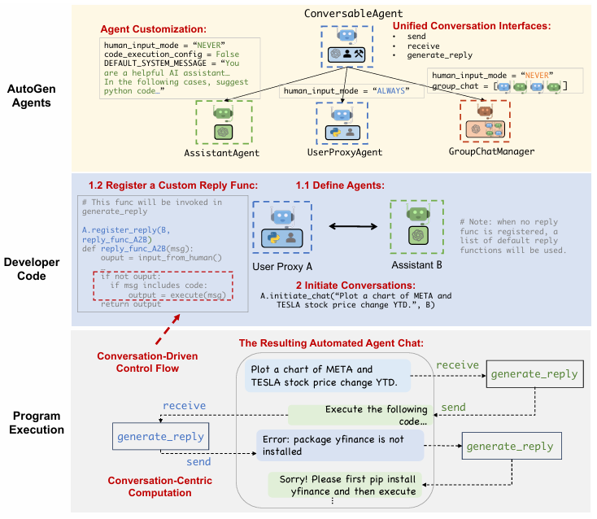

图二注：如何使用 AutoGen 对多代理对话进行编程的图示。最上面的子图说明了 AutoGen 提供的内置代理，这些代理具有统一的对话界面，并且可以自定义。中间的子图显示了使用 AutoGen 开发具有自定义回复功能的双智能体系统的示例。底部的子图说明了在程序执行期间从双代理系统生成的自动代理聊天。

通过允许自定义Agent相互对话，AutoGen 中的可对话Agent成为一个有用的构建模块。然而，为了开发能够在任务上取得实际进展的应用，开发者还需要能够指定和调整这些多Agent对话的模式。

#### 对话编程 Conversation Programming

作为上述问题的解决方案，AutoGen 采用 **对话式编程（conversation programming）** 这一范式，该范式涉及两个核心概念：

首先是 计算，即智能体在多智能体对话中采取的计算响应的行动；其次是 控制流（control flow），即这些计算发生的顺序或条件。正如我们将在应用部分展示的那样，这种编程能力有助于实现灵活的多智能体对话模式。

在 AutoGen 中，这些计算是以对话为中心的。智能体会根据所参与的对话采取相关行动，而其行动会促使消息在后续对话中传递（除非满足终止条件）。同样地，控制流也是由对话驱动的——参与的智能体决定向哪些智能体发送消息，以及计算的执行流程，这些都取决于智能体之间的对话。这一范式使得开发者能够以直观的方式理解复杂的工作流，将其归结为 **智能体的行动** 以及 **智能体之间的消息传递**。

图 2 提供了一个简单的示例。底部子图展示了各个智能体如何执行其特定角色的 **对话式计算** 来生成响应（例如通过 LLM 推理调用或代码执行）。任务的推进体现在对话框中的消息传递。中间子图展示了基于对话的控制流。当助手智能体接收到消息时，用户代理智能体通常会将人类输入作为回复发送。如果没有人类输入，它会执行助手消息中的任何代码。

AutoGen 提供以下设计模式，以促进对话式编程：

1. 统一接口与自动回复机制，实现智能体自动对话
   AutoGen 为智能体提供了 **统一的对话接口**，用于执行与对话相关的计算，包括用于发送/接收消息的 `send/receive` 函数，以及用于执行操作并基于收到的消息生成回复的 `generate_reply` 函数。此外，AutoGen 引入并默认采用 智能体自动回复机制 来实现 对话驱动的控制：当智能体接收到另一智能体的消息时，它会自动调用 `generate_reply` 生成回复，并将其发送回消息发送者，除非满足终止条件。AutoGen 内置了基于 **LLM 推理、代码/函数执行或人类输入** 的回复函数，开发者也可以注册自定义的回复函数，以调整智能体的行为模式。例如，一个智能体可以在回复发送者之前，先与另一个智能体进行对话。
   在此机制下，一旦注册了回复函数并初始化对话，**对话流程便会自然推进**，无需额外的控制模块（即专门用于管理对话流的模块）。例如，在 **图 2** 中蓝色阴影区域（标记为“开发者代码”）所示的代码，可以轻松触发智能体间的对话，而实际的对话流程会自动进行，如灰色阴影区域（标记为“程序执行”）所示的对话框内容。自动回复机制提供了一种 去中心化、模块化且统一 的方式来定义工作流。

2. 融合编程与自然语言进行控制

   AutoGen 允许开发者在控制流管理中结合 编程语言 和 自然语言 进行灵活控制，具体包括：

   - **(1) 通过 LLM 进行自然语言控制**：在 AutoGen 中，可以通过对 LLM 支持的智能体进行 自然语言提示（prompting） 来控制对话流程。例如，AutoGen 内置 `AssistantAgent` 的默认系统消息使用自然语言指示智能体在检测到错误时修正错误并重新生成代码。此外，还可以引导智能体 将 LLM 输出限制在特定结构内，使其更易被其他工具驱动的智能体处理。例如，可以指示智能体在任务全部完成时回复 `"TERMINATE"`，以终止程序。
   - **(2) 通过编程语言控制**：在 AutoGen 中，可以使用 Python 代码 定义终止条件、设置人类输入模式、控制工具执行逻辑（例如自动回复的最大次数）。开发者还可以 注册编程式自动回复函数，以 Python 代码控制对话流程，如 **图 2** 中标记为 “对话驱动的控制流” 的代码块所示。
   - **(3) 在自然语言与编程语言控制之间灵活切换**：AutoGen 还支持在 自然语言控制 和 编程控制 之间灵活过渡。例如，可以在自定义的回复函数中调用 包含特定控制逻辑的 LLM 推理，以实现 从代码控制到自然语言控制 的转换；或者通过 LLM 生成的函数调用，实现 从自然语言控制到代码控制。

在对话式编程范式下，可以实现多种模式的多智能体对话。除了 预定义流程的静态对话 之外，AutoGen 还支持 具有动态对话流程的多智能体交互。AutoGen 提供了两种通用方法来实现这一点：

- 自定义 `generate_reply` 函数：在自定义的 `generate_reply` 函数中，一个智能体可以在 保持当前对话的同时，根据当前消息的内容和上下文 动态调用其他智能体进行对话。

- 函数调用（Function Calls）：在这种方法中，LLM 根据对话状态决定是否调用特定函数。在被调用的函数中，LLM 可以向额外的智能体发送消息，从而推动动态的多智能体对话。

此外，AutoGen 还提供了更复杂的 动态群聊（Group Chat） 机制，通过内置的 `GroupChatManager`，可以 动态选择下一个发言者，并 将其回复广播给其他智能体。

为了展示这些不同的对话模式，我们提供了已实现的工作系统，其中一些示例可在 **图 3** 中可视化呈现。

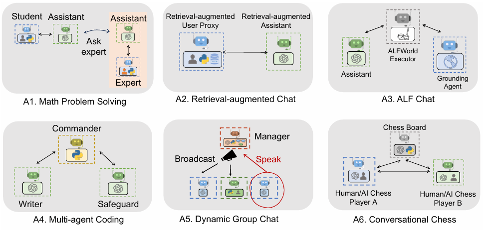

图三注：使用 AutoGen 构建的不同应用程序的 6 个示例。他们的对话模式显示了 AutoGen 的灵活性和强大功能。

### 1.5 其他工作

------

**XAgent** [OpenBMB/XAgent: An Autonomous LLM Agent for Complex Task Solving](https://github.com/OpenBMB/XAgent)

面壁智能联合清华大学NLP实验室共同研发开源的基于LLM的自主Agent。XAgent由三部分组成：

**调度器** 负责动态实例化和分派任务给不同的智能体。它允许添加新的智能体和改进智能体的能力。

**规划器** 负责为任务生成和校正计划。它将任务分解为子任务，并为它们生成里程碑，使智能体能够逐步解决任务。

**行动者** 负责采取行动实现目标和完成子任务。行动者利用各种工具来解决子任务，它也可以与人类合作来解决任务。

XAgent提出了**双循环机制**，外循环负责宏观规划，而内循环则负责细节的执行。

------

**ProAgent** [2311.10751](https://arxiv.org/pdf/2311.10751)

清华、面壁智能、中国人大、MIT、CMU等共同发布的新一代流程自动化范式 “智能体流程自动化” Agentic Process Automation（APA）。一是帮助人类以生成代码的方式构建工作流；二是让智能体自主处理工作流中涉及复杂决策与动态处理的环节，即难以固化为规则表示的复杂任务让agent来动态决定。

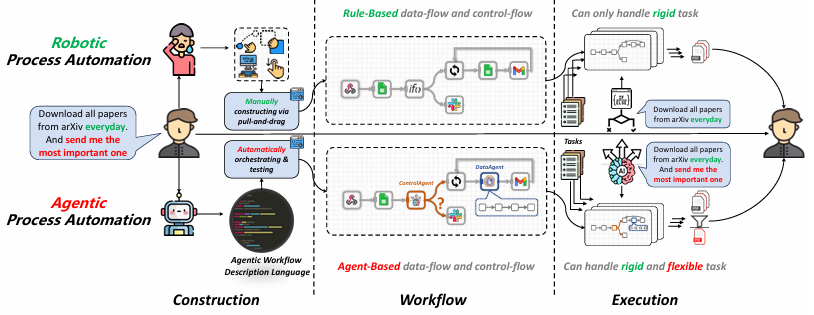

图一注：机器流程自动化与代理流程自动化的比较

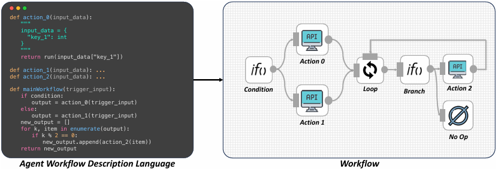

图二注：代理工作流描述语言图示

工作流中引入DataAgent和ControlAgent实现复杂数据处理与控制逻辑。基于智能体工作流描述语言Agentic Workflow Description Language，使用JSON实现工作流中数据的组织和管理，选择 Python 语法实现对工作流的逻辑控制，将控制流中的跳转、循环等直接通过 Python 语法进行表征，同时将工作流中的工具调用封装为 Python Function。于是对于 ProAgent，工作流构建任务便转化为代码生成任务。当接收到人类指令时，ProAgent 便编写相应的 Agentic Workflow Description Language，从而实现了工作流自动化构建。

------

**AgentVerse** [2308.10848 AgentVerse: Facilitating Multi-Agent Collaboration and Exploring Emergent Behaviors](https://arxiv.org/abs/2308.10848)

由清华-计算机系、北邮-计算机系、腾讯-微信AI-模式识别中心 合作提出的多功能框架，简化了为LLMs创建自定义多智能体环境的过程。整体技术实现分为四大部分：

1.专家招募

专家招募阶段决定了多智能体群体的构成，是决定群体能力上限的重要模块。当前采用自动化的方式招募专家，目的是增强配置智能体的可扩展性。

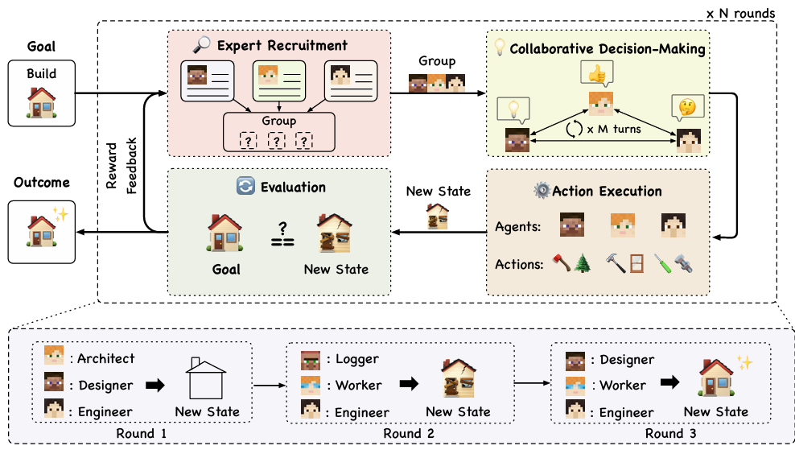

图一注：AgentVerse的概览

2.协作决策

此阶段主要是聚集专家智能体进行协同决策，选择两种经典的沟通结构来提升决策效率：

- 横向沟通

  每个智能体积极共享并细化其决策，这种民主的沟通结构鼓励智能体之间的相互理解和协作。然后将智能体的集体意见结合起来，使用一个集成函数来形成当前回合的群体决策。

- 纵向沟通

  纵向沟通的特点是职责分工，由一个智能体提出初始决策，其余的智能体充当评审人，对解决方案提供反馈；根据反馈，不断完善决策，直到所有的评审智能体就解决方案达成共识，或者达到最大迭代次数。

3.行动执行

在决策制定完毕后，智能体需要执行指定的动作，具体取决于实现方式，某些智能体可能会不执行任何操作，然后对环境状态进行更新。

4.评估

使用奖励反馈机制评估当前状态与期望目标之间的差距，并给出口头反馈，解释为什么当前状态仍然不令人满意并提供建设性建议，讨论下一轮如何改进。

其中奖励反馈机制可以由人工定义（人机协作循环），也可以由自动反馈模型定义，具体取决于实现方式。

如果确定尚未达到预期目标，则奖励反馈循环回到初始阶段，即专家招募；在下一轮专家招募阶段会利用该反馈信号结合初始目标来调整专家组的构成，从而演化出更有效的多智能体群组，以供后续决策和行动执行

# 2. Muti-Agent-System 

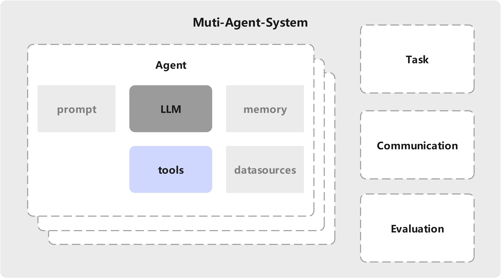

为了实现一个功能齐全的Agent系统，我们需要从几个方面入手

Agent内部的构建：

- LLM系统的迭代与推理优化：一个准确、强大且快速，并通过RFT持续迭代的LLM

- 完善Agent使用的外部工具库：检索向量数据库，联网搜索，计算器，访问办公软件文档等外部工具链
- Agent单元工作逻辑的流程闭环：一个包含LLM System工作与反思，使用工具与记忆的循环

Agent之间的协作（MAS）：

- 搭建多Agent协作框架：任务的初始化与分配，Agent间的通信与合作，任务执行的监控等

## 2.1 Agent内部的构建：一个LLM System

一个传统Agent主要由三个核心组件构成：

- Reasoning：由LLM提供
- Routing：决定使用何种工具的路由模块

- Action：执行工具调用，API调用或代码操作的操作模块

在我们的Agent内部构建中，我们放大其中的路由模块，将路由决策交由一个逻辑闭环的工作流来实现。因此在构建一个Agent基元时，我们主要从三个方面入手:

- LLM系统本身的迭代与推理优化（2.1.1）

- Agent 工具库的完善，Action与Skills的构建（2.1.2）

- Agent内部工作流的逻辑闭环，Routing的走向（2.1.3）

### 2.1.1 LLM系统的迭代与推理优化

#### 2.1.1-A 评估

常见的评估有：

Hallucinations 幻觉检测。检测LLM是否使用上下文信息而非虚构内容

Retrieval relevance 检索相关性。若系统需检索文档或上下文，需评估其是否与查询真正相关

Q&A accuracy 问答准确性评估。判断回答是否符合事实标准或用户需求

Toxicity 毒性检测。识别LLM是否输出有害或不恰当语言

Overal preformance 整体性能评估。衡量系统实现核心目标的有效性

而在Agent中，我们不仅需要评估LLM的原始输出，还需要评估Agent在每个环节的决策过程（可能包括调用错误工具，误用上下文等）。这种评估可以由人类介入循环，也可以直接使用LLM充当判别器。

需要注意的是，在Agent中即使对提示词的微小修改或代码调整，都可能产生意外的连锁反应。其可能在多个用例中提升表现，但也可能导致未预见的测试用例性能退化。因此需要维护有代表性的测试用例集，或反映关键用例的数据集。每次系统调整后可重新运行评估以发生退化现象，并持续扩展Agent的新功能。这是构建健壮Agent评估体系的关键

##### A1 跟踪数据轨迹

在Agent中添加可观测性，这将使我们能够洞察执行轨迹，即Agent响应用户查询时采取的一系列步骤。可观测性在LLM应用中通常包括追踪提示词、响应内容、token用量以及围绕LLM调用的所有相关调用。

可观测性通常由跟踪数据（Traces）和跨度（Spans）组成。跟踪数据指应用程序的完整运行过程，即从单个跟踪数据表示从输入到输出的完整端到端运行。跟踪数据由多个跨度组成，跨度是调用LLM的独立步骤、代码执行、数据库查询等操作单元。因此一个Traces由多个Spans组成，通常以层级结构呈现（跨度Spans可以互相嵌套以展示其在其他跨度中的运行关系），一组跨度构成完整的跟踪数据层级。可能存在LLM调用跨度，工具调用跨度，以及逻辑链跨度。这些是跟踪数据中的通用逻辑步骤。

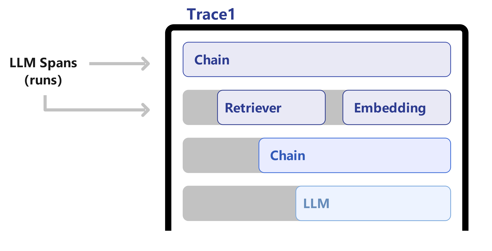

##### A2 路由与工具评估

这里将重点评估各Agent的技能（使用不同工具），以及路由模块选择正确工具的能力，并根据用户请求正确执行工具的能力。这里包含三种评估器类型：基于代码的评估器、由LLM充当评委和人工标注。

- 基于代码的评估，需在应用输出端运行特定代码。典型应用场景包括：检查输出是否符合特定正则表达式；确保响应支持JSON解析；包含特定关键词等。使用代码评估直接比对实际输出与预期结果非常有效，也可采用余弦相似度或余弦距离进行语义层面的匹配度评估。

- 由LLM充当评委/判别器（LLM as a judge），该技术使用独立的LLM来评估应用输出。典型的流程包括获取应用运行的输入和输出以及可能涉及的其他关键信息。基于这些信息构建独立提示用于评估特定标准，将该提示发送至独立的评估模型，由该LLM在特定评估维度上为响应打标签。

  当前LLM来判别的评估方式非常强大，因为它支持同时进行大规模定量和定性指标评估。但使用LLM判别法时需注意几个关键点。首先，只有顶级模型才能较好吻合人工标注结果。即便如此，LLM判别也并非完全准确，始终存在误差空间。可通过优化LLM评估指令或调整LLM模型来减少误差。最后需要牢记**使用离散分类标签而非模糊分数**来定义LLM评估的输出（应当采用正确/错误，有关/无关，而非“请以1-100分评价此响应”）

- 人工标注，一种方式是构建人工标注的评估集，另一种方式是收集终端用户的反馈。

Router路由器的评估通常分为两类：一是函数调用选择的评估，即验证路由器是否选择了正确的调用函数；二是参数提取的评估，当路由器选定调用函数后，能否正确从问题中提取参数并传递给目标函数？

##### A3 Agent轨迹

什么是Agent轨迹？轨迹就是Agent在处理特定输入时经过不同路由模块、工具和其他逻辑步骤的路径。

对于大多数生产环境或实际应用中的Agent，一定程度的效率要求是必要的。若能用6个步骤而非11个步骤解答用户问题，意味着更少的LLM调用、更低的随机性、更低的成本和更短的响应延迟。

如何跟踪和测量轨迹，可使用称为“收敛”的评估工具。收敛分数用于衡量Agent执行特定查询时接近最优路径的程度。因此可以将此视为，Agent针对特定类型查询收敛到最优路径程度的度量。如何测试收敛性？一种方法是采用以下技术：让Agent处理一组相似的查询。

其核心思想是选择足够相似的问题使得Agent在处理每个问题时本应采用相同的路径，但又存在足够差异，以便发现Agent中可优化的潜在差异。接下来通过Agent运行每个查询，并记录每个查询所经历的步骤数，然后找出所采取的最优路径长度。此处指Agent完成其中任一查询所需的最少步骤数。利用这些不同数值可计算收敛分数，该分数以数值形式表示Agent采取该最优路径的频率：
$$
\text{Overall Convergence Score} = 
\sum_{i=1}^{N}min(1,\frac{S_{\text{optimal}}}{S_{\text{agent},i}}) /N
$$
对该公式的另一种理解方式是：对于给定输入集，Agent采取最优路径的时间百分比。收敛分数为1表示Agent始终采取最优路径。该分数的取值始终在0-1之间。

进行收敛评估时需要注意几个事项：

首先收敛通常无法检测Agent在测试集中为每个查询都执行多余步骤的情况。这是因为收敛评估中的最优路径通常时Agent完成某个查询所用的最少步骤数。因此如果Agent的所有运行都包含多余步骤，收敛评估通常无法发现这种情况。

其次我们需要确保运行收敛评估器时，仅使用Agent完整完成的运行数据。如果Agent执行三个步骤后出错终止，则不应记录这三个步骤。

##### A4 评估驱动开发

评估驱动开发（Evaluation-Driven Development）是一种通过系统化使用评估指标和Agent运行数据来指导开发方向的方法论。它能帮助合理分配优化时间，实现Agent的持续迭代和功能开发。包含以下几个关键步骤：

首先需要构建**测试案例数据集**，这些案例可以用于不同Agent版本的对比测试。每次调整Agent版本、提示词设计或Agent逻辑等参数，完成多版本测试后收集所有实验结果并输入评估器进行分析。评估器将输出标准化评分，使不同迭代版本能在统一标准下进行对比。

对于测试数据集，重点在于案例的代表性而非数量。选择能代表预期输入类型的典型样例，每个输入类型只需1-2个典型示例即可，无需收集几百个相似样例特别是同质化案例。实践中通常先手动构建基础案例集，再根据实际运行数据逐步扩充完善。

尽可能为测试案例添加预期输出，虽非必须，但提供预期输出可启用更多评估方式。基于LLM的自动评估可不依赖预期输出，但代码化评估通常需要预期输出来进行比对。

当准备好数据集和测试案例后，就可以对Agent进行修改并**跟踪记录每个改动（Track Agent Changes）**。常见的测试包括修改Agent使用的提示词、调整传入路由模块的工具参数配置、修改路由逻辑本身、调整部分技能模块或技能结构、或者直接替换需要测试的新模型。

将测试案例通过不同版本的Agent运行的过程通常称为实验测试，即对特定版本的Agent进行实验。通过实验可以记录并测量不同运行批次的结果。

收集完所有实验数据后，即可**使用评估器进行分析**——基于代码的评估和基于LLM的评估（Code-based evals，LLM-as-a-Judge evals）。

##### A5 改进LLM驱动的评估器

这里将探讨如何改进LLM评估器以及智能体内部的LLM-as-a-Judge评估方法。核心思路在于，当采用LLM-as-a-Judge时，需要持续优化评估器本身，因为他们无法达到绝对准确。

在上文的案例中，我们同时采用了基于代码的评估和基于LLM的评估来测试路由模块的性能。可能存在的疑问是：为什么需要对同一对象使用两种评估方法？特别是考虑到代码基准评估器具有100%准确性，为何还要引入LLM评估器？

关键在于这种双评估体系能够准确测量LLM评估方式和代码评估方式的契合程度。LLM评估不是一种100%准确的方法，但其评估规模远超基于真值比对的方法，可将LLM评估应用于所有应用运行实例，实现全面覆盖。但关键在于量化LLM相对于精准评估方法的准确度。

我们可以对相同案例使用不同的LLM作为评估的驱动模型，同时使用不同的提示词以比较LLM评估器输出的评估结果，从而简单地选择更好的LLM评估器和评估时的提示词。现在的问题转化为：如何有效评估这些LLM评估器的输出结果？

当存在预期输出时，就不再是简单的正确或错误标签。这种明确的预期输出源于结构化格式。假设LLM评估其返回的分析原因清晰分明且易于理解，这应当是正确的，但不能直接进行字符串精确匹配。此时可使用语义相似度等数值化方法比较字符串含义，而非直接对比输出与预期输出。

##### A6 持续监控Agent

在开发并优化Agent至生成就绪状态后，需要应用相同的追踪、评估指标和实验技术到生成环境的Agent中。在生产阶段，代码变更或模型更新可能降低Agent性能。可以使用评估指标并通过实验持续监控并改进Agent。

此时应当已完成从初始原型到生产就绪系统的四个关键步骤：

- 选择合适架构：确定符合用例的Agent框架
- 选定评估指标：明确系统的核心指标，如准确性、延迟和收敛性。
- 构建评估体系：包含提示词、工具和性能测量数据。
- 数据迭代：通过结果分析持续优化，调整提示词或逻辑后重新测试。

这个循环在开发与生产环境间持续进行，从而实现问题早发现，基于实际反馈优化。进入生产环境后可能会发现，初始简单设计需要提升复杂度。可能采用多Agent系统，实现Agent间的协同调用。或构建多模态系统处理异构数据，如文本、图像、音频等。亦或建立持续优化系统，通过实时用户交互学习，结合人工更新与自动流程。

所以，生产环境有何不同？

- 常会暴露新的故障模式：用户可能提出开发阶段未遇到的问题，或涉及系统未知的新信息，如全新产品。
- 更高的复杂度：若Agent需调用额外API或其他Agent，错误或异常输出的风险增加。
- 对Agent进行修改：可能会进行A-B测试，或常采用在受控环境未预见的模型策略导致意外性能退化。

值得庆幸的是，在开发过程中构建的工具，如监控工具和反馈循环，在生产环境同样有效。

收集用户反馈用于评估在生成环境至关重要。例如获取真实使用数据，包括每个用户查询与交互，通过人工标注突显问题或成功案例。如果评估指标与真实用户的反馈不一致，这意味着需要重新检查系统或评估方法。

我们还需要持续跟踪指标随时间的变化，以理解效率或执行依赖关系。这是通过维护一致性测试数据集，并不断用生成样本进行增强决定的。

#### 2.1.1-B 迭代

构建一个输出反馈的在线强化学习迭代器（前提是一个可微调即本地部署的LLM）

> TODO

#### 2.1.1-C 推理优化

> TODO
>

### 2.1.2 LLMs工具库

工具使用：给LLM提供工具，如网络搜索、代码执行或任何其他功能，以帮助它收集信息、采取行动或处理数据。

> TODO
>

### 2.1.3 Agent单元的工作流程（逻辑闭环）

Agent单元内部的工作流程，是Agent在多Agent系统中处理某一任务中某一step的具体执行方式。若把整个Muti-Agent-System的任务分发与监控看作是一个大循环的话，则Agent内部执行某一具体任务的方式为一个内循环（小循环）。

在23年及其以前的早期Agent研究中，研究者们主要聚焦于单个Agent的工作流程，其中包括吴恩达教授指出的两种Agent工作流模式：反思工作流（2.1.3-A）与规划工作流（2.1.3-B）

在24年后，反思与规划这两大功能主要被集成在多Agent协作大框架中任务的大循环里。但我们仍然可以学习反思工作流与规划工作流的相关研究以指导我们单个Agent内的工作流程设计。

#### 2.1.3-A 反思工作流 Reflection

##### A1. Self-Refine

**Self-Refine: Iterative Refinement with Self-Feedback**

英伟达、谷歌Brain等联合发布 https://arxiv.org/abs/2303.17651

一种通过迭代反馈和细化来改进LLMs的初始输出的方法。不使用任何监督训练数据、额外的训练或强化学习，而是使用单个LLM作为生成器、细化器和反馈提供者。

图一注：给定一个输入（ 0 ），Self-Refine 机制首先由模型 M 生成初始输出，并将其反馈回模型自身以获取反馈（ 1 ）。   随后，该反馈被再次传递给模型 M，使其对先前生成的输出进行优化（ 2 ）。   步骤（ 1 ）和（ 2 ）会不断迭代，直到满足停止条件。

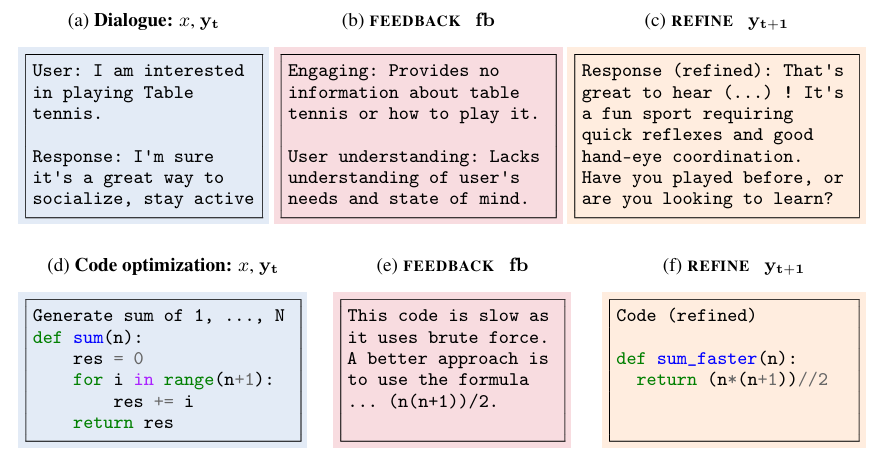

图二注：由基本 LLM 生成的初始输出（蓝色），然后传递回同一 LLM 以接收对同一 LLM 的反馈（红色）以优化输出（黄色）。顶行说明了对话生成方面的这一点，其中初始对话响应可以转换为更具吸引力的对话响应，该响应也可以通过应用反馈来理解用户。底行说明了代码优化的情况，其中通过应用反馈可以提高代码的效率。

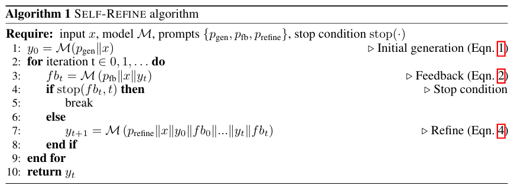

##### A2. CRITIC

**CRITIC: Large Language Models Can Self-Correct with Tool-Interactive Critiquing**

清华、微软亚研院联合发布 https://arxiv.org/abs/2305.11738

允许LLMs通过与外部工具的交互来验证和改进自己的输出，类似人类与工具的互动。CRITIC通过与搜索引擎、代码解释器等工具的交互，评估初始输出的某些方面，并根据验证过程中获得的反馈来修正输出。 该过程可以重复进行，以确保持续的输出改进。

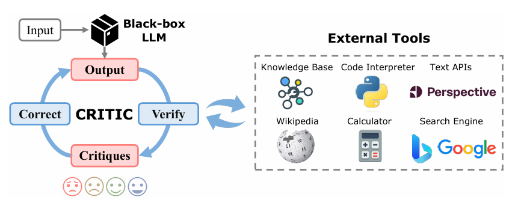

图一注：框架包括两个步骤：（1） 通过与外部工具交互来生成评论来验证输出，以及 （2） 根据收到的评论纠正输出。我们可以迭代这种先验证后纠正的过程，以实现持续改进。

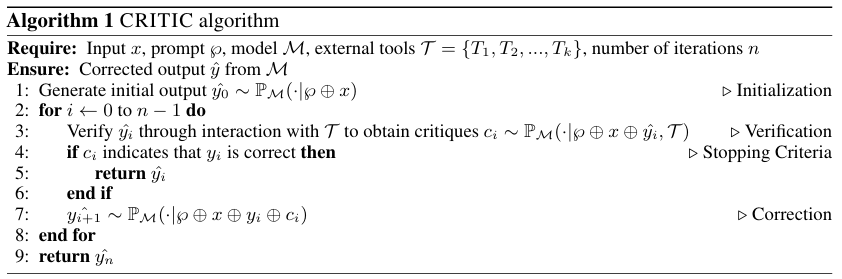

##### A3. Reflexion

**Reflexion: Language Agents with Verbal Reinforcement Learning**

[2303.11366](https://arxiv.org/pdf/2303.11366)

作者指出最近的一些工作诸如[ReAct](https://zhida.zhihu.com/search?content_id=243405184&content_type=Article&match_order=1&q=ReAct&zhida_source=entity)、[SayCan](https://zhida.zhihu.com/search?content_id=243405184&content_type=Article&match_order=1&q=SayCan&zhida_source=entity)、[Toolformer](https://zhida.zhihu.com/search?content_id=243405184&content_type=Article&match_order=1&q=Toolformer&zhida_source=entity)、[HuggingGPT](https://zhida.zhihu.com/search?content_id=243405184&content_type=Article&match_order=1&q=HuggingGPT&zhida_source=entity)以及[WebGPT](https://zhida.zhihu.com/search?content_id=243405184&content_type=Article&match_order=1&q=WebGPT&zhida_source=entity)证明了使用基于LLM构建的自动化决策Agent是可行的，但是这些方法大多依赖于在当前情景中的例子(in-context example)来指导LLM生成内容，因为用梯度下降的强化学习需要很多计算和时间。简单说，就是他们依赖的只是短期记忆。

所以作者提出一种新的叫做Reflexion的框架，它通过使用语言强化学习（verb reinforcement）来帮助Agent从之前的失败中学习。Reflexion会把环境的二进制或量化的反馈转换成文字描述，作为下次迭代中的额外信息。这种自我反思式的反馈就像是个语意上的梯度信号来提供给Agent具体的优化方向，让Agent知道怎样改正错误，这样就能更好地完成任务了。

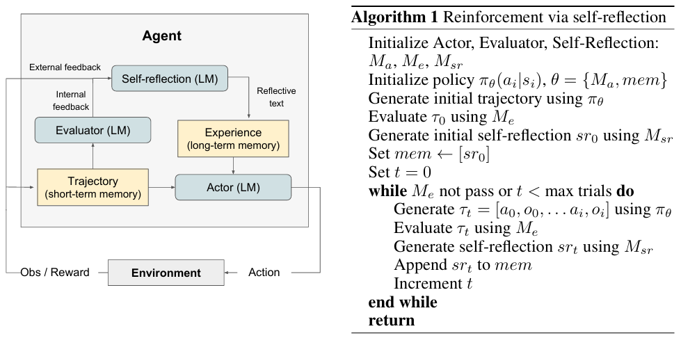

图一注：（a） 反思流程图。（b） 反思强化算法

#### 2.1.3-B 规划工作流 Planning

##### B1. CoT

**Chain-of-Thought Prompting Elicits Reasoning in Large Language Models**

谷歌Brain Research https://arxiv.org/abs/2201.11903

主要探讨通过CoT来引导LLM进行推理。是CoT的早期工作，研究表明，通过在提示中明确展示逐步推理过程，可以显著提高语言模型在复杂推理任务上的表现。

##### B2. HuggingGPT

**HuggingGPT: Solving AI Tasks with ChatGPT and its Friends in Hugging Face**

浙大，微软亚研院合作研究 https://arxiv.org/abs/2303.17580

HuggingGPT的工作流程主要分为以下几个步骤：

- 任务规划：使用ChatGPT分析用户的请求，理解他们的意图，并将其分解为可能可解决的任务。
- 模型选择：为了完成规划的任务，ChatGPT根据模型的描述选择托管在Hugging Face上的专家模型。
- 任务执行：调用并执行每个选定的模型，然后将结果返回给ChatGPT。
- 响应生成：最后，使用ChatGPT整合所有模型的预测结果，并生成响应。

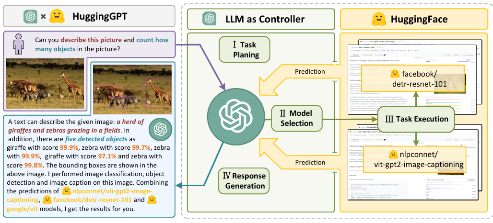

图一注：语言充当 LLM（例如 ChatGPT）的接口，以连接众多 AI 模型（例如 Hugging Face 中的模型）以解决复杂的 AI 任务。在这个概念中，LLM 充当控制者，管理和组织专家模型的合作。LLM 首先根据用户请求规划任务列表，然后为每个任务分配专家模型。专家执行任务后，LLM 会收集结果并响应用户。

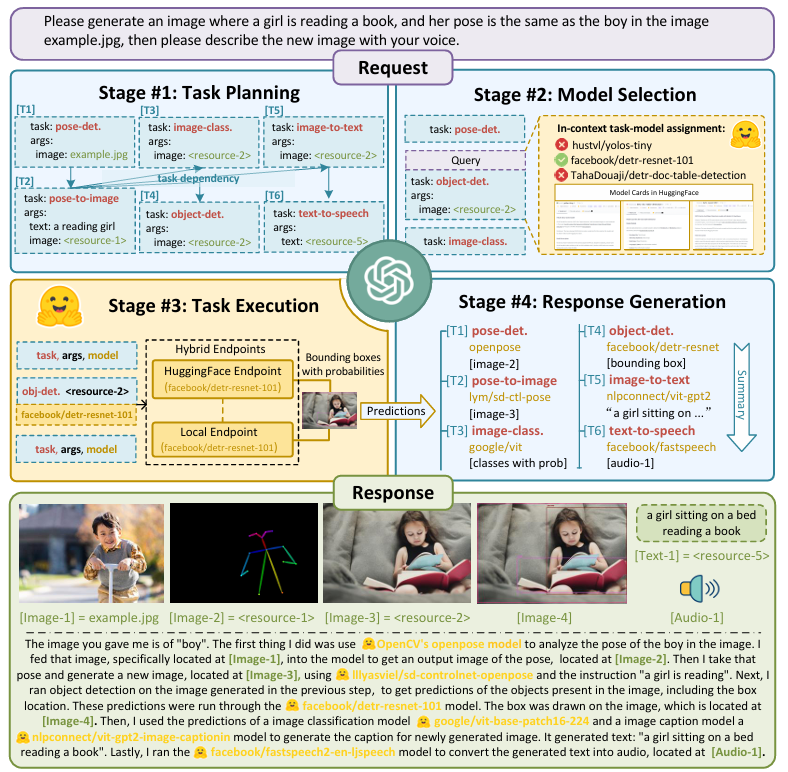

图二注：HuggingGPT 概述。以 LLM（如 ChatGPT）为核心控制器，以专家模型为执行者，HuggingGPT 的工作流程包括四个阶段：**1） 任务规划：**LLM 将用户请求解析成任务列表，并确定任务之间的执行顺序和资源依赖关系;  **2） 模型选择：**LLM 根据 Hugging Face 上专家模型的描述为任务分配合适的模型;  **3） 任务执行：**混合终端节点上的专家模型执行分配的任务;  **4） 响应生成：**LLM 整合专家的推理结果，生成工作流日志摘要以响应用户。

##### B3. A Survey

**Understanding the planning of LLM agents: A Survey**

中科大，华为合作研究 https://arxiv.org/abs/2402.02716

该综述系统探讨LLM提升自主Agent的规划能力，论文认为当前LLM Agent规划主要分为以下几类：

**任务分解：**通过“分而治之”的策略，将复杂任务拆解为多个子任务，分别进行规划。代表作：CoT、ReAct和HuggingGPT。

**多计划选择：**生成多个备选计划，并使用搜索算法（如树搜索）从中选择最优方案。代表作：ToT、GoT、CoT-SC。

**外部模块辅助规划：**结合外部规划器，提升规划效率和可行性，同时利用LLM进行任务形式化。代表作：LLM+P、LLM+PDDL。

**反思与精炼：**通过自我反思和总结失败经验，提升错误纠正能力，避免“思维循环”。代表作：Reflexion、CRITIC、Self-Refine。

**记忆增强规划：**引入额外的记忆模块，存储常识、过往经验等，辅助规划过程。代表作：REMEMBER、MemoryBank。

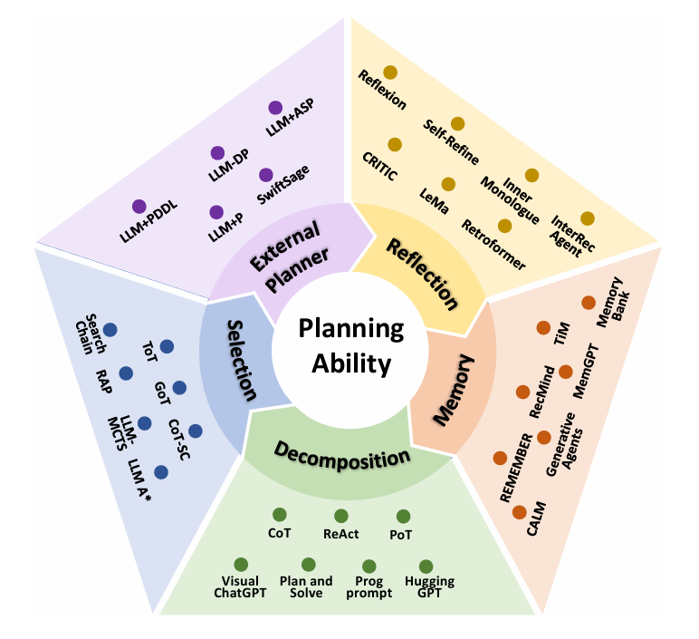

图一注：LLM-Agent规划中的分类。

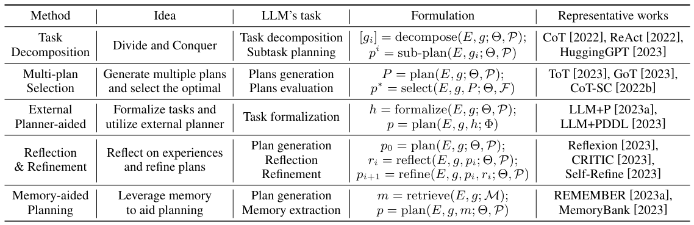

实验结果表明，Reflexion框架在所有数据集中均展现出最高的成功率，但与此同时，其成本也相对较高。这是因为Reflexion框架在ReAct或CoT的基础上，增加了多轮反思迭代，从而提高了解决问题的深度和准确性，但相应的资源消耗也随之增加。相比之下，CoT-SC在成本和成功率之间取得了较好的平衡。其成功率与ReAct相近，但成本明显较低，这使得CoT-SC成为一个在成本效益和性能之间做出折衷选择的优选方案。然而，对于自建的大型语言模型（LLM）且对实时性要求不高的应用场景，Reflexion框架仍然是一个更为理想的选择。它通过增加迭代次数，虽然提高了成本，但也显著提升了问题解决的质量和深度。

##### B4. Tree of Thoughts

**Tree of Thoughts: Deliberate Problem Solving with Large Language Models**

NeurIPS 2023，2330次引用 : [271db9922b8d1f4dd7aaef84ed5ac703-Paper-Conference.pdf](https://proceedings.neurips.cc/paper_files/paper/2023/file/271db9922b8d1f4dd7aaef84ed5ac703-Paper-Conference.pdf)

ToT推广了流行的CoT方法来提示语言模型，并支持探索作为解决问题的中间步骤的连贯文本单元（Thought）。ToT 允许 LM 通过考虑多种不同的推理路径和自我评估选择来决定下一步行动，并在必要时向前看或回溯以做出全局选择，从而进行深思熟虑的决策。

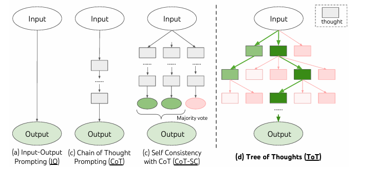

图一注：示意图说明了使用 LLM 解决问题的各种方法。每个矩形框代表一个想法，它是一个连贯的语言序列，是解决问题的中间步骤。请参阅图 2、3、6 中有关如何生成、评估和搜索思想的具体示例。

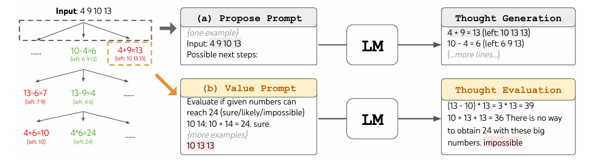

图二注：24 对局的 ToT。提示 LM 进行 （a） 思维生成和 （b） 评估。

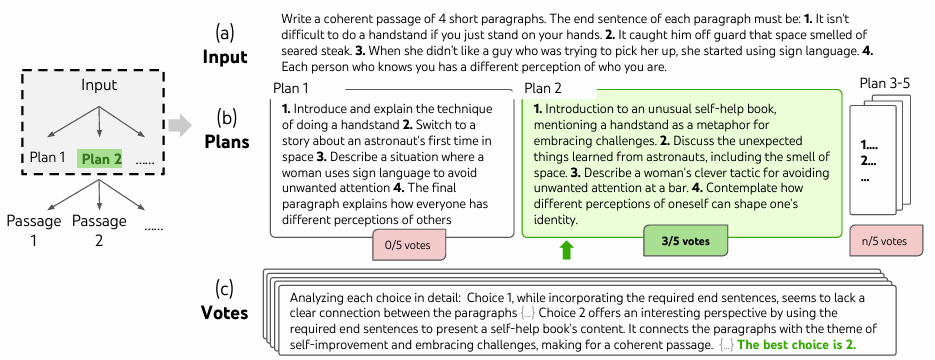

图三注：给定输入，LLM采样 5 个不同的规划，然后投票 5 次来决定哪个规划是最好的。多数选择用于用相同的样本投票程序编写输出段落。

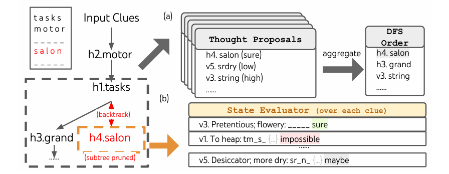

图四注：在 Mini Crosswords 中，(a) 通过 深度优先搜索 (DFS)，思维（thoughts）被提议并聚合到 优先队列 中；(b) 通过评估每个剩余单词线索的填充可能性来评估当前状态，并且如果任何剩余线索被 语言模型 (LM) 认为无法填充，则该状态将被剪枝。随后，DFS 回溯到父状态，并探索下一个最有希望的线索思维。

##### B5. Graph of Thoughts

**Graph of Thoughts: Solving Elaborate Problems with Large Language Models**

AAAI 2024，738引用：[Graph of Thoughts: Solving Elaborate Problems with Large Language Models | Proceedings of the AAAI Conference on Artificial Intelligence](https://ojs.aaai.org/index.php/AAAI/article/view/29720)

思维图（GoT）超越了思维链（CoT）或思维树（ToT）等范式提供的功能。GoT 的关键思想和主要优势是能够对 LLM助手任意图生成的信息进行建模，其中信息单位（“LLM 思想”）是顶点，边对应于这些顶点之间的依赖关系。这种方法能够将任意的 LLM 思想组合成协同的结果，提炼整个思想网络的本质，或使用反馈循环增强思想。

我们现在详细介绍 GoT 框架，并在图 1 中展示其结构，同时将其与其他提示策略进行比较。
与 LLM 的对话由用户消息（提示）和 LLM 回复（思维）组成。我们遵循既定的符号表示方式，用 pθ 表示具有参数 θ 的预训练语言模型（LM）。
小写字母（如 x, y, z, ...）表示 LLM 的思维。正式而言，GoT 可以建模为一个元组 (G, T, E, R)，其中：
G 代表 “LLM 推理过程”（即上下文中的所有 LLM 思维及其关系），
T 代表潜在的思维转换，
E 是一个评估函数，用于获取思维的评分，
R 是一个排序函数，用于选择最相关的思维。

图一注：思维图 （GoT） 与其他提示策略的比较

**推理过程 Resoning Process**

------

我们将推理过程建模为一个有向图 G = (V, E)，其中 V 是顶点集合，E ⊆ V × V 是边集合。一个顶点包含当前问题的一个解（可以是初始解、中间解或最终解）。
具体的思维形式取决于应用场景，例如在写作任务中，它可能是一个段落，而在排序任务中，它可能是一串数字序列。

有向边 (t1, t2) 表示思维 t2 是使用 t1 作为“直接输入”构建的，即明确指示 LLM 使用 t1 生成 t2。我们将 G 与 LLM 推理过程关联起来。为了推进这一过程，可以对 G 进行思维转换。

例如，一种转换方式是将当前评分最高的思维合并成一个新的思维。另一种转换方式是对某个思维进行循环优化，以增强其内容。需要注意的是，这些转换严格扩展了 CoT、CoT-SC 或 ToT 中可用的转换集合。

**思维转换 Transformations of Thoughts**

------

GoT 通过基于图的推理模型，实现了新的思维转换，我们称之为 **图增强转换（graph-enabled transformations）**。例如，在写作任务中，可以将多个输入文章合并为一个连贯的摘要；在排序任务中，可以将多个已排序的子数组合并为最终的有序数组。

从形式上看，每个转换可建模为 **T(G, pθ)**，其中 G = (V, E) 表示当前推理状态的图，pθ 为使用的 LLM。T 通过添加新顶点及其入边来修改 G，使得 G = T(G, pθ) = (V', E')，其中：

- **V' = (V ∪ V+) \ V−**
- **E' = (E ∪ E+) \ E−**

其中：

- **V+ 和 E+** 表示新增的顶点和边，以建模新的思维及其依赖关系。
- **V− 和 E−** 表示被移除的顶点和边，以节省上下文空间，去除无助于改进的推理路径。

为了实现更广泛的推理能力，GoT 允许基于整个推理过程 G 进行评估 **E(G, pθ)**，因为在某些情况下，思维的评分是相对的。GoT 还可以对思维进行排序，其排序函数定义如下：
$$
R(G, pθ, h)
$$
其中 **h** 指定返回 G 中得分最高的 **h** 个思维。虽然 R 的具体形式依赖于应用场景，但通常采用简单有效的方法，即返回得分最高的 **h** 个思维：
$$
v_1, ..., v_h = R(G, pθ, h)
$$
例如，在排序任务中，评分可以基于正确排序的元素数量（或基于错误率来评分）。

思维转换的具体类型：

- 思维合并

GoT 允许将多个思维聚合成一个新思维，以结合和强化这些思维的优点，同时消除其缺点。在最基础的形式下，合并的 k 个思维 **v1, ..., vk** 形成一个新顶点 **v+**，其边定义如下：
$$
V+ = \{v+\}
$$
进一步而言，这一机制可用于聚合完整的推理路径，而不仅仅是单个思维。在图模型中，只需将多个推理链的最终顶点 **v1, ..., vk** 连接到一个新顶点 **v+**，即可实现思维链的融合。

- 思维优化

通过修改现有思维 **v** 的内容来优化其表达。这种转换的数学表示如下：
$$
V+ = \{\}
$$
在图中，这表示对同一思维的多轮优化，其连接关系保持不变。

- 基于单个思维生成新思维

该转换模式与 **ToT** 或 **CoT-SC** 中的推理步骤类似，即从一个现有思维 **v** 生成多个新思维 **v+1, ..., v+k**，定义如下：
$$
V+ = \{v+_1, ..., v+_k\}
$$
这一转换允许从当前思维出发，扩展出多个可能的推理方向，以支持更丰富的推理探索。

**思维评分与排序 Scoring & Ranking Thoughts**

------

为了判断当前解是否足够优秀，我们对思维进行评分。评分被建模为一个通用函数：
$$
E(v, G, pθ)
$$
其中：

- **v** 代表需要评估的思维。
- **G** 代表整个推理过程的状态。
- **pθ** 代表使用的 LLM。

我们使用整个推理过程 **G** 作为评分的背景，以保证通用性。例如，在某些评估场景中，思维的得分可能是相对的，而不是绝对的。

GoT 还支持对思维进行排序，排序函数定义如下：
$$
R(G, pθ, h)
$$
其中 **h** 指定返回 G 中得分最高的 **h** 个思维。虽然 **R** 的具体形式依赖于应用场景，但通常采用简单有效的方法，即返回得分最高的 **h** 个思维：
$$
v_1, ..., v_h = R(G, pθ, h)
$$
评分 **E** 和排序 **R** 的具体形式取决于具体任务。例如，在排序任务中，评分可以定义为正确排序的元素数量，或者错误排序的元素数量（作为误差评分）

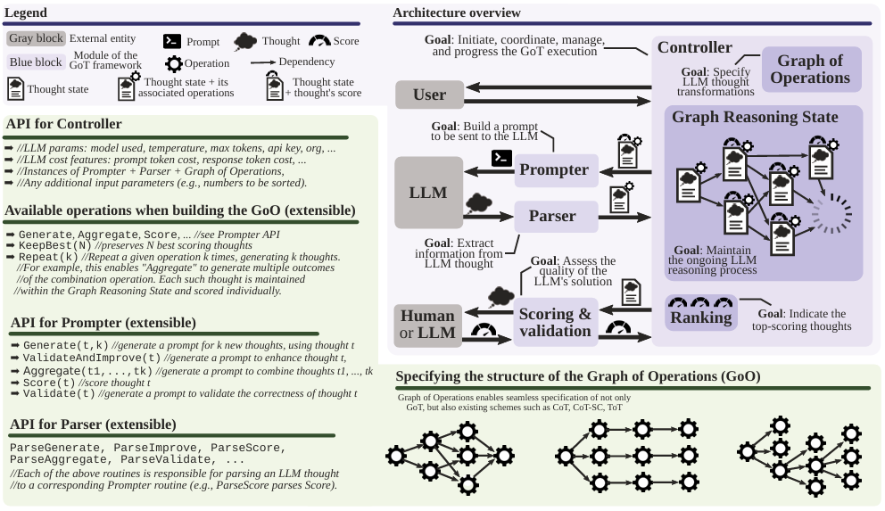

图二注：GoT 的系统架构及各模块的 API。用户可以直接扩展该设计，以支持新的提示方案，尝试新的思维转换方法，并集成不同的 **LLM**。图中 **蓝色部分** 展示了系统架构概览，**绿色部分** 列出了 API。

**系统架构与可拓展性**

GoT 架构由一组交互模块组成，如图 2（蓝色部分）所示。这些模块包括：

- **Prompter（提示生成器）**：为 LLM 准备消息。

  Prompter 负责准备要发送给 LLM 的提示信息。该模块的主要任务是根据图结构对提示进行编码。GoT 架构允许用户完全访问图结构，以便实现特定于应用场景的图编码方式。

- **Parser（解析器）**：从 LLM 生成的思维中提取信息。

  Parser 负责从 LLM 生成的思维中提取信息。对于每个思维，Parser 构建其**思维状态**，其中包含提取的信息。然后，思维状态被用于更新 GRS。

- **Scoring（评分模块）**：验证并评分 LLM 生成的思维。

  在该模块中，我们验证 LLM 生成的思维是否满足可能的正确性条件，并赋予其评分。

  - 评分的来源可能包括 LLM 本身（即 LLM 参与评分）。
  - 也可以由人类手动评分，具体取决于应用场景。
  - 例如，在排序任务中，评分可以使用简单的局部评分函数，如计算正确排序的元素个数。

- **Controller（控制器）**：协调整个推理过程，并决定如何推进。

  Controller 负责从 GRS 结构中选择适当的思维，并决定要应用哪些**思维转换**，然后将相关信息传递给 Prompter。此外，它还决定整个推理过程是否应结束，或者是否应启动下一轮与 LLM 的交互。在当前设计中，这由 GoO 规定的执行计划决定。

控制器包含两个关键元素：

- **Graph of Operations (GoO，操作图)**：静态结构，指定给定任务的图分解，即规定应用于 LLM 思维的转换方式及其顺序和依赖关系。

  用户需要构造 GoO 实例，以指定思维操作的执行计划。GoO 是一个静态结构，在执行开始前构建，每个操作对象都知道其前驱和后继操作。

- **Graph Reasoning State (GRS，图推理状态)**：动态结构，维护 LLM 推理过程的状态（包括思维的历史及其状态）。

  执行过程中，GRS 维护 LLM 推理的实时状态，包括：

  - 已执行的操作。
  - 所有生成思维的状态、有效性和评分。
  - 其他相关信息。

上述组件提供了可扩展的 API，使得不同的提示生成方式可以被轻松实现。这些 API 在图 2（绿色部分）中概述，并在文档中详细说明。

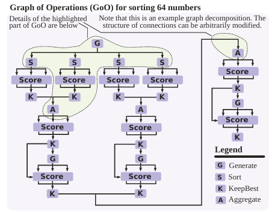

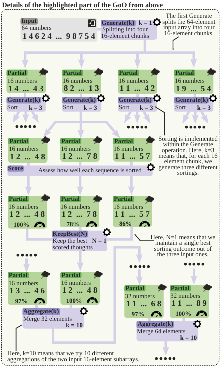

图三注：GoT的排序用例的示例图分解。所有使用的操作（Generate，Aggregate， Score，KeepBest）中描述在图 2 中。

由于篇幅限制，我们详细介绍一个示例用例（排序）。我们重点关注其分解方式和**操作图（Graph of Operations, GoO）**，因为这些是 GoT 体系结构中实现和执行任何任务的核心。

我们考虑对 0–9 之间的数字进行排序（可能包含重复元素）。在某些长度范围之外，所使用的 LLM 无法稳定地正确排序这些数字序列，原因在于重复计数可能不匹配。

**排序（Sorting）**

在 GoT 中，我们采用归并排序（merge-based sorting）的方法：

1. 先将输入的数字序列分解为多个子数组。
2. 分别对这些子数组进行排序。
3. 依次合并已排序的子数组，最终获得完整的排序结果。

图 3 展示了此用例及其图分解（graph decomposition）方式。在这里，LLM 的思维（LLM thought）是一个已排序的数字序列。

**集合操作（Set Operations）**

我们还研究了**集合操作（主要是集合交集）**，这些操作在多种问题场景下具有广泛的应用，例如：

- 基因组比对（genome comparison）
- 文档相似度计算（document comparison）
- 模式匹配（pattern matching）（Besta et al. 2020, 2021a）

集合交集的实现方式类似于排序：

1. 将第二个输入集合拆分为多个子集。
2. 利用 LLM 计算这些子集与第一个输入集合的交集。
3. 聚合所有交集子集的结果，得到最终的交集。

在评估过程中，我们使用了不同大小的集合（32、64 和 128 个元素），并调整两个集合中共有元素的比例（25% 到 75%）。

**关键词计数（Keyword Counting）**

该任务的目标是统计输入文本中某一类别的关键词频率（示例实现中使用国家名称）。

在 GoT 体系结构下：

1. 首先将输入文本拆分为多个段落。
2. 统计每个段落中出现的关键词数量。
3. 将各个段落的子结果聚合，得到最终的关键词频率统计。

段落数量是可配置的，也可以让 LLM 处理整个文本，并将每个句子视为一个独立段落。

对于评分：

- 首先计算每个关键词的绝对误差（预测值与真实值的差值）。
- 对所有关键词的误差求和，作为最终评分。

**文档合并（Document Merging）**

该任务的目标是基于多个部分重叠的输入文档生成一个新的保密协议（NDA）文件，同时：

- 最大限度减少重复内容。
- 尽可能保留所有重要信息。

文档合并在多个领域都有广泛的应用，例如：

- 法律程序（legal procedures），需要将多个来源的信息整合成单一文件或条款。

评分方式：

1. 我们让 LLM 评估两个值（每个值计算 3 次，取平均值）：
   - 冗余度（Redundancy）：10 表示无冗余，0 表示至少有一半的信息是冗余的。
   - 信息保留度（Information Retention）：10 表示所有信息都被保留，0 表示完全丢失信息。
2. 计算两个值的调和平均数，作为最终评分。

##### B6. Chain of Draft

**Chain of Draft: Thinking Faster by Writing Less**

https://arxiv.org/abs/2502.18600

LLM 在通过 CoT 提示等机制时，强调冗长、循序渐进的推理。 然而，人类通常采用更有效的策略：起草简洁的中间思想，只捕捉基本信息。 我们提出了 *Chain of Draft* （CoD），LLM 在解决任务时生成极简但信息丰富的中间推理输出。 通过减少冗长程度并专注于关键见解，CoD 在准确性上匹配或超过 CoT，同时仅使用 7.6% 的 token，从而显着降低了各种推理任务的成本和延迟。

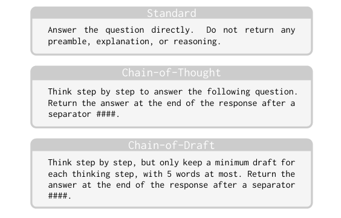

#### 2.1.3-Z 如何实现一个合理的单Agent工作流

一个自然产生的问题是，如何将反思，短期规划，调用工具等操作动态融合到同一个工作流中；或者说，如何在一个工作流中，Agent自主决定何时反思，何时规划，何时调用工具？

##### Z1. 工作流v1

我们暂时手工指定了V1版本的单Agent工作流：

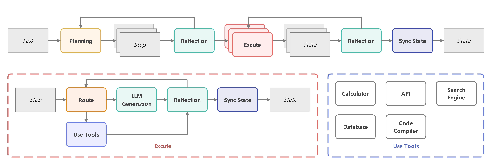

- Planning

  Task进来后会被由LLM驱动的Planning模块规划多个Step。规划器应当避免生成不必要而重复的Step，这由规划器的收敛性决定。同时需要保证在此之中的**一个Step只做一件单一的事情**，例如“调用一次API”、“由LLM总结上一个Step调用API返回的结果”、“生成一段话”等

- Reflection（after Planning）

  紧接Planning后的Reflection反思模块用于审查规划结果。如果规划无误需保证规划step的格式能够被Excute正确执行；如果需要修改则指导Planning模块进行修改。反思模块可以由LLM驱动也可以由人类驱动。
  
- Excute

  执行模块用于执行每一个Step，执行模块内部按照一定的工作流运行：

  - Route

    当前Step信息会包含是否使用工具的属性，交由Route模块进行分发。如果不需要使用工具完成当前Step，则转发给LLM生成器；如果需要使用工具，则路由模块内调用一个将任务参数提取为命令的LLM，将命令转发给工具模块。

  - Use Tools

    工具模块包含计算器，搜索引擎，代码编译器，外部数据库与其他应用API。工具模块会将执行结果交给Reflection反思模块

  - LLM Generation

    LLM生成器用于直接文本回答。

  - Reflection（inside Excute）

    Excute内部的Reflection反思模块用于审查来自工具的返回结果或LLM直接回复的文本结果是否能够满足当前Step的需求。如果能满足，则总结为step的最终输出；如果无法满足，则将改进方法的指导交由路由模块重新进行工具调用或生成（包括调用工具进行验证）。

    Excute内部的Reflection可以带一个评估器和一个反思器（参考Reflexion一文），当前步的执行结果会由评估器决定是否进行反思。如果需要反思，则反思器获取评估结果、执行结果和长期反思记忆。反思器生成反思结果，并将反思结果存在长期反思记忆中，将当前反思结果交给执行器执行

  - Sync State（inside Excute）

    如果当前Step执行完毕且通过反思模块的验收，则生成当前step的状态信息（需要传出Excute模块的结果，一定的日志信息和当前step的状态标记）。将生成的Step状态同步到日志/消息池（如有）中。

- Reflection（after Excute）

  当所有Step的状态信息都已同步，则执行Reflection反思模块来审查所有Step的结果。如果无误则总结成最终输出并进入下一流程，如果有误则附带指导意见重新运行某些Step的Excute执行过程。

- Sync State（after Excute）

  当所有step执行完毕并且通过Reflection反思模块的审查后，汇总每个Step的状态，生成关于任务Task的状态。Task state包括需要最终返回的任务的输出（由最后一步Reflection总结）、一定的日志信息和Task的任务状态标记。并将生成的Task state同步到日志/消息池（如有）/长期记忆缓存（如有）中。

##### Z1. 工作流v2

我们基于v1改进为v2，明晰了一些不清晰的模块。

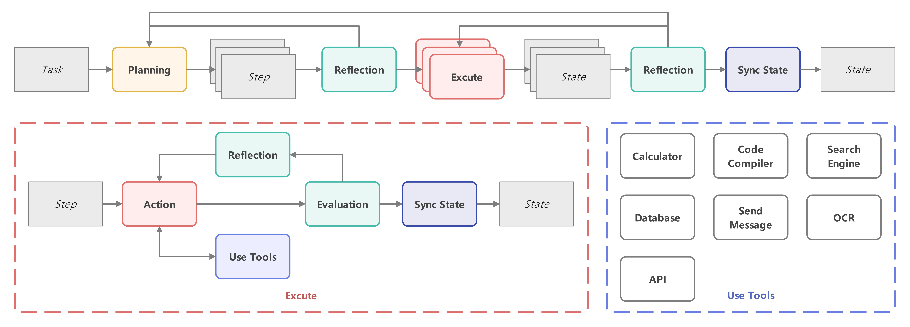

- Planning

  Task进来后会被由LLM驱动的Planning模块规划多个Step。规划器应当避免生成不必要而重复的Step，这由规划器的收敛性决定。同时需要保证在此之中的**一个Step只做一件单一的事情**，例如“调用一次API”、“由LLM总结上一个Step调用API返回的结果”、“生成一段话”等

- Reflection（after Planning）

  紧接Planning后的Reflection反思模块用于审查规划结果。如果规划无误需保证规划step的格式能够被Excute正确执行；如果需要修改则指导Planning模块进行修改。反思模块可以由LLM驱动也可以由人类驱动。

- Excute

  执行模块用于执行每一个Step，执行模块内部按照一定的工作流运行：

  - Action

    由LLM驱动完成Step中的可能存在的多个操作，例如生成多个文本或在需要调用工具时生成调用指令。当被调用工具完成响应时，Action模块的LLM接收响应并自动执行下一个操作。

  - Use Tools 

    包含计算器，搜索引擎，代码编译器，外部数据库与其他应用API。工具模块会将执行结果交给Reflection反思模块

  - Evaluation

    用来评估Action的工具调用决策和调用参数提取是否正确，或用来分析Action是否真正完成当前step。如果无法满足则进入Reflection模块。

  - Reflection（inside Excute）

    反思模块获取上一步Evaluation结果、Action执行结果和长期反思记忆。反思模块会生成修正意见，并将修正意见存在长期反思记忆中，将当前最新修正意见交给执行器执行

  - Sync State（inside Excute）

    如果当前Step执行完毕且通过反思模块的验收，则生成当前step的状态信息（需要传出Excute模块的结果，一定的日志信息和当前step的状态标记）。将生成的Step状态同步到日志/消息池（如有）中。

- Reflection（after Excute）

  当所有Step的状态信息都已同步，则执行Reflection反思模块来审查所有Step的结果。如果无误则总结成最终输出并进入下一流程，如果有误则附带指导意见重新运行某些Step的Excute执行过程。

- Sync State（after Excute）

  当所有step执行完毕并且通过Reflection反思模块的审查后，汇总每个Step的状态，生成关于任务Task的状态。Task state包括需要最终返回的任务的输出（由最后一步Reflection总结）、一定的日志信息和Task的任务状态标记。并将生成的Task state同步到日志/消息池（如有）/长期记忆缓存（如有）中。

## 2.2 多智能体协作框架 Muti-Agent System

多Agent协作工作流

一个多Agent协同工作核心机制与交互流程的闭环：

**1.任务分配与初始化（Task Allocation and Initialization）**

- 任务定义（Task Definition） 

  根据需求拟定任务流程，每个step需要做什么事情

- 任务分配（Task Allocation） 

  评估Agent能力，将任务每个步骤分配给特定Agent或人类

- 任务初始化（Task Initialization） 

  初始化任务状态与实例化各角色Agent

- 反馈调整（Task Evaluation and Adjustment）

  任务初始化后评估任务可行性，调整任务或重新分配任务各step的Agent

明确任务定义，评估Agent能力，实现任务与Agent的匹配。

初始化任务状态和Agent状态，为协同执行奠定基础。

**2.多Agent协同执行（Muti-Agent Collaborative）**

- Agent间通信（Inter-Agent Communication）

  在任务初始化后建立任务涉及的Agent间或Agent与人类的通信渠道

- 任务协同执行（Task Collaborative Execution）

  在共享信息池中完成短期记忆（上下文）的信息共享与协同

- 任务进度同步（Task Progress Synchronization）

  协同执行过程中，在共享信息池中同步任务进度

- 协同反馈（Collaborative Feedback）

  在每次任务进度同步后评估协同效率，通过调整协同策略影响任务协同执行

Agent间通过通信共享信息，支持任务协同执行。

基于共享信息，Agent协同执行子任务，同步任务进度。

**3.任务监控与调整（Task Monitoring and Adjustment）**

- 任务执行监控（Task Monitoring）

  从任务进度同步中获取

- 任务调整（Task Adjustment）

  管理者（Agent/人类）根据任务监控结果决定是否调整任务安排，执行至任务完成

监控任务执行情况，根据需要进行任务调整与再分配。

**4.任务完成与总结（Task Completion and Summary）**

- 任务完成判定（Task Completion Determination）

  根据监控信息和任务初始化时的目标需求，由管理者（Agent/人类）确认任务已经提前完成；或当任务执行完最后一步时触发任务完成判定。判断任务是否完成，否则需要追加任务step。

- 执行结果总结（Execution Result Summary）

  如果任务判定完成，则进入执行结果总结流程。由管理者总结任务执行经验（该任务执行日志与经验可以选择保存在长期记忆库中）。

  如果任务未完成需要追加任务step，则将执行结果的总结继续提交给下一“执行效果反馈”流程。

- 执行效果反馈（Execution Feedback）

  如果任务判定完成，总结的执行经验（如在长期记忆库中）则会在下一次任务分配与初始化中提交给管理者（Agent/人类）参考。

  如果任务未完成需要追加任务step，则判定结果和经验总结将会递交给管理者，重新进入“任务分配与初始化”环节进行任务step的追加。

判定任务是否完成，总结经验教训，提升未来任务执行效率。

然而，在以上的一般过程中，默认管理者是Agent或人类，执行者是Agent，管理者通过【任务监控】与【任务完成反馈】来介入Agent的行为流程。

我们需要Agent不再属于人类的附属层级，在一些子任务中，监管者可以是Agent，执行者可以是人类。那么在【多Agent协同执行】过程中，我们还需要面对Agent与人类在执行层的消息共享。

（具体而言，Agent角色与人类操作角色在任务分配上不做区分，实例化的Agent角色与人类操作角色共享同一个基类，拥有相同的内部信息共享与协同机制。实例化的各个Agent角色通过其配置指定权限的外部工具库与环境交互，而实例化的人类操作角色通过办公软件的接口直接由真实人类操控）

