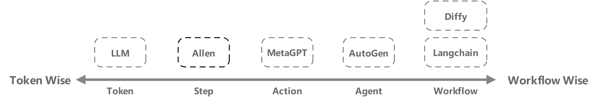

## Abstract

## 1. Introduction

Multi-Agent System 拥有单Agent所不具备的对复杂并行任务的适应能力，近年来受到大家的普遍关注。大家思考如何构建一个 Multi-Agent System 时往往会将其拆分成两个部分：

- 1.Agent内部工作逻辑/模式
- 2.Agent和Agent之间协作执行任务的关系框架

对于第一个子问题——如何构建Agent内部工作逻辑/模式，24年一篇具有代表性的综述【[Agent Design Pattern Catalogue](https://arxiv.org/html/2405.10467v4)】总结了各个Agent架构。其被分为了18种不同的模式，并给出了不同场景下如何决策具体模式的指导。这些模式包含：提示/响应优化、检索增强生成、单/多路径规划、自我反思、基于投票/角色/辩论的多Agent合作等等。

时至今日，新的工作很难再在Agent行为模式上创新：提出一种新的模式，用于处理一种此前从未考虑到的具体场景。不过好消息是，我们认为当前的Agent的瓶颈不在于提出更多新的模式了，而是在于如何合理地决策使得Agent能够在不同场景下使用最合适的行为模式，具体工作逻辑或任务流程。

我们认为一个Agent工作逻辑/模式的能力不应当只实现某种单一的模式，而需要能够决策选择合适当前场景下的模式。我们定义该决策的程度，受整个系统中**决策自由度**的上限决定。即有的Agent系统只允许预先定义好一套工作流，在运行时只能严格遵从工作流的逻辑，系统的决策自由度只在预定义好的工作流的几个的分支节点出现；有的系统允许预先定义多个不同的Agent，系统的决策自由度体现在可以自主决策使用哪些Agent。

因此，我们重新描述我们的第一个目标——构建合理的Agent内部工作逻辑/模式为：如何提高整个系统中的**决策自由度**？

同时，我们也重新描述第二个目标——构建Agent间协作执行任务的框架为：如何在已实现单一Agent内部模式下，构建一个动态的任务流程使得，Agent能够自主地管理和协作以保持整个系统的**决策自由度**？

本文贡献：

- 我们思考如何

- 我们提出一种以Step为最小执行单位的视角来重构MultiAgent任务。该方法得以使得

## 2. Related Work

> **重点以决策自由度的视角横向解释不同的架构，突出不同架构之间的区别**

> ChatGPT agent
>
> Manus
>
> Genspark
>
> Comet
>
> Fellou
>
> Warmwind
>
> NeuralOS
>
> 
>
> LangChain
>
> LangGraph
>
> Llamalndex
>
> FastGPT
>
> LobeChat
>
> SWE Agent
>
> 
>
> 多Agent框架
>
> CAMEL
>
> AutoGen
>
> MetaGPT
>
> AgentScope
>
> [构建多智能体(Multi-Agent)架构的八大原则-腾讯云开发者社区-腾讯云](https://cloud.tencent.com/developer/article/2538674)

在Agent决策自由度的视角下，一种不严谨的横向比较方式如图所示：

- 图注：我们从**决策自由度**的视角来衡量不同Agent框架。图中左侧和右侧代表着两个极端：**Token Wise** 以 token作为系统的最小单位，决策自由度最高；**Workflow Wise** 以workflow为系统的最小执行单位，决策自由度最低。

当今比较流行的

综述【[Agent Design Pattern Catalogue](https://arxiv.org/html/2405.10467v4)】提到的挑战：

- 由于整个生态系统中各种利益相关者，基于Foundation Model的Agent、非Agent AI Model 和 非AI软件应用程序之间的交互，问责过程非常复杂。高度自主的Agent可以委派甚至创建其他Agent或工具来执行某些任务。在这种情况下，责任和问责机制可能在多个实体之间交织在一起。

## 3. Approach

## 4. Disscussion

- 多Agent系统和单Agent系统

  从系统**决策自由度**的角度来说，当我们的决策自由度从workflow wise跨越至agent wise时，单Agent系统自然而然地演变成多Agent系统了。至此你期望能够根据不同的需要去选择不同的Agent（每个Agent背后代表了一条独特的工作流/工作逻辑）

- 系统易于迭代和优化

  我们的框架可以兼容任何Model/Context/Tool层面的优化和改进方法，正如25.7月综述【[A Survey of Self-Evolving Agents](https://arxiv.org/html/2507.21046v1)】所指出的迭代方向。我们的架构创新在于重新定义Multi-Agent System运行模式，而一切的model policy、model experience、context prompt、context memory等模块的改进措施均可以适配最新研究方法。

## 5. Conclusion

## References

