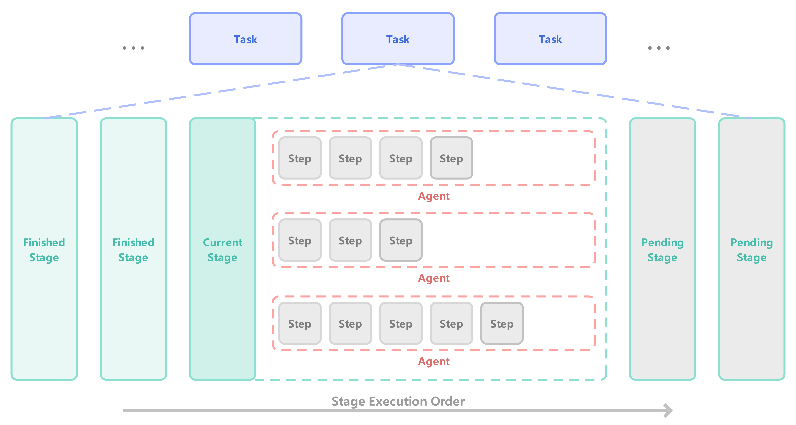
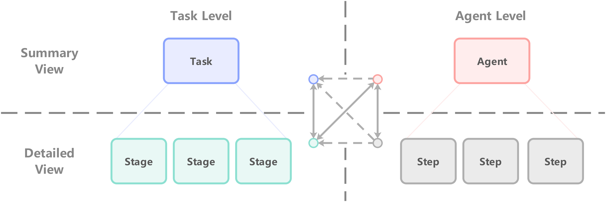
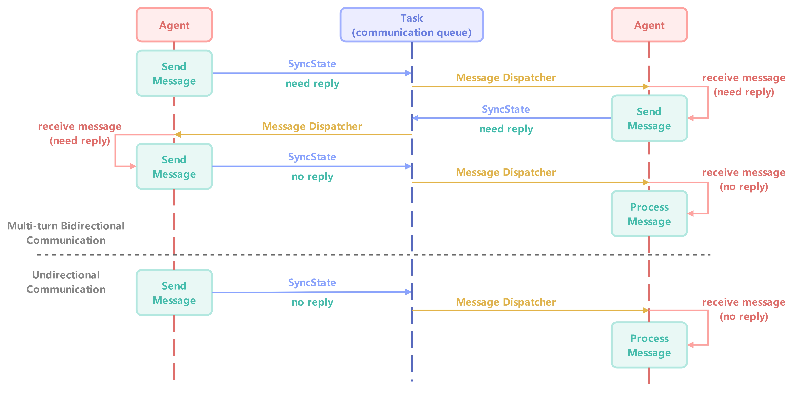

## Abstract


## 1. Introduction

Multi-Agent System 拥有单Agent所不具备的对复杂并行任务的适应能力，近年来受到大家的普遍关注。大家思考如何构建一个 Multi-Agent System 时往往会将其拆分成两个子问题：

- 1.如何构建Agent内部工作逻辑/模式
- 2.如何构建Agent和Agent之间协作执行任务的关系框架


对于第一个子问题——如何构建Agent内部工作逻辑/模式，24年一篇具有代表性的综述【[Agent Design Pattern Catalogue](https://arxiv.org/html/2405.10467v4)】总结了各个Agent架构。其被分为了18种不同的模式，并给出了不同场景下如何决策具体模式的指导。这些模式包含：提示/响应优化、检索增强生成、单/多路径规划、自我反思、基于投票/角色/辩论的多Agent合作等等。

时至今日，新的工作很难再在Agent行为模式上创新：提出一种新的模式，用于处理一种此前从未考虑到的具体场景。不过好消息是，我们认为当前的Agent的瓶颈不在于提出更多新的模式了，而是在于如何合理地决策使得Agent能够在不同场景下使用最合适的行为模式，具体工作逻辑或任务流程。

我们认为一个Agent工作逻辑/模式的能力不应当只实现某种单一的模式，而需要能够决策选择合适当前场景下的模式。我们定义该决策的程度，受整个系统中**决策自由度（Policy Autonomy）**的上限决定。即有的Agent系统只允许预先定义好一套工作流，在运行时只能严格遵从工作流的逻辑，系统的Policy Autonomy只在预定义好的工作流的几个的分支节点出现；有的系统允许预先定义多个不同的Agent，系统的Policy Autonomy体现在可以自主决策使用哪些Agent。

因此，我们重新描述我们的第一个目标——构建合理的Agent内部工作逻辑/模式为：

- 如何提高整个系统中的Policy Autonomy？


对于第二个子问题——如何构建Agent和Agent之间协作执行任务的关系框架。Google在25.2月的一篇文章【[ Multi-Agent Design](https://arxiv.org/abs/2502.02533)】中强调多Agent框架性能提升的核心是优化拓扑结构。我们通过在构建Agent内部逻辑时优化Agent内部的拓扑结构，通过在多Agent系统构建时赋予Agent来决策任务执行的能力（赋予Agent自主规划与其他Agent的通信时机、定义任务流程的能力）来获得在多Agent系统层面优化拓扑结构的潜力。

优化Multi-Agent System的拓扑结构可以带来多Agent的协同效率的提升，然而在实际使用中，我们往往还关注已用性的另外两个点：任务进度可监控 与 人类可干预。然而，复杂自由的拓扑结构往往与任务进度可监控、人类可干预程度相冲突。因此，我们也重新描述第二个目标——构建Agent间协作执行任务的框架为：

- Multi-Agent System 如何实现协同效率、进度监控与人类可干预之间的平衡？


我们通过重新定义Agent执行的最小单元，并同步实现task、stage、agent和step四种状态层级来实现以上两个目标。我们将我们的Multi-Agent System命名为Allen。具体而言，本文贡献如下：

- 我们提出一种新的视角“系统Policy Autonomy”来指导Agent系统的构建工作。

- 我们提出一种以Step为最小执行单位的视角来重构Agent执行逻辑/模式。该方法使得我们实现了当前最高的系统Policy Autonomy，它几乎可以执行任何一种Agent工作模式。
- 我们基于已实现的Agent执行逻辑，构筑了由四种状态层级区分的多Agent协同任务架构，完美平衡了协同效率、进度可监控 与 人类可干预。


## 2. Related Work

如果以 Policy Autonomy 的视角下审视不同的Agent架构，一种不严谨的横向比较方式如图所示：


- 图【1】注：我们从**决策自由度（Policy Autonomy）**的视角来衡量不同Agent框架。图中左侧和右侧代表着两个极端：**Token Wise** 以 token作为系统的最小单位，决策自由度最高；**Workflow Wise** 以workflow为系统的最小执行单位，决策自由度最低。其中我们的架构——Allen属于较靠近左侧的的step wise层级。

当今主流的用于实现Agent的框架（而非产品）均可以在图【1】中的坐标轴中表示。在坐标轴的最左边代表决策自由度最高，例如原始的LLM，实际上每个token对于llm来说都是一次自主决策。坐标轴的最右侧代表决策自由度最低，例如工作流级别的决策自由度，我们只能在不同工作流之间选择，并且需要为每个新环境新场景构建新的适配的完整工作流。

其中Langchain【[langchain](https://github.com/langchain-ai/langchain)】、Diffy【[dify](https://github.com/langgenius/dify)】等框架的决策自由度是在workflow层面实现，这意味着我们需要为每个场景搭建属于自己的工作流。严格来说，这是一种实现workflow的工具。而AutoGen【[AutoGen](https://arxiv.org/pdf/2308.08155)】具备 agent wise 的决策自由度，其中我们只需要面对新场景时构建新的的Agent，在该框架中可以自主地选择有哪些Agent参与任务。

MetaGPT【[MetaGPT](https://arxiv.org/html/2308.00352v7)】做到了相比上述框架更高的决策自由度，其具体实现的action wise级别的决策自由度。该框架下的每个Agent都可以根据情况选择执行不同的预先定义好的action，此时的action就已经非常接近一个Agent的运行模式的概念了。其中Agent在运行时会执行think - act循环，且能够在该循环中每次都自主决策使用不同的action。这些action由候选技能和工具库中组装而成。因此MetaGPT【[MetaGPT](https://arxiv.org/html/2308.00352v7)】已经是一个相当灵活且具有很高决策自由度的Agent框架了。

然而我们仍然不希望在适配新任务时去实现一个个具体的action，我们认为由多种技能和工具组成的action仍然不是一个agent系统决策自由度的极限。我们试图寻找一个Agent的最小执行单元，我们只需要排列这些最小的执行单元，就能够在宏观上产生不同的Agent执行逻辑与模式。并且我们无需为新任务手工地适配工作逻辑，只要实现每个最小执行单元自然的相互过渡，就能够在宏观上实现由Agent自主地决定其具体工作逻辑。

我们将系统中的最小执行单元定义为一个个Step，因此最终我们 Allen 框架实现了一个 具备 step wise 决策自由度的系统。并且由于 token wise 的纯 llm system 往往不具备不同的Agent工作模式和严谨的任务判断，如果只是直接给LLM加上固定的输出指令检测则实际上会形成workflow wise的决策自由度。因此 Allen 是我们已知决策自由度最高的系统，它实现了Step wise 的决策自由度，即便Agent能够自主决定何时使用什么step，从而组合出一系列的具体行为模式action，故而每个Agent都能决定出自己在当前环境下的最佳行为模式action，而不需要我们手动预设。


> ChatGPT agent，Manus，Genspark，Comet，Fellou，Warmwind，NeuralOS
>
> LangGraph，Llamalndex，FastGPT，LobeChat，SWE Agent
>
> 多Agent框架：CAMEL，AgentScope
>


## 3. Agent‘s Internal Mechanisms

本章我们将介绍我们如何构建一个合理的Agent内部工作逻辑/模式。在第一章Introdouction部分，我们已经将这个目标转化为“如何提高一个单Agent系统的决策自由度（Policy Autonomy）”。

一个自然产生的问题是，如何将综述【[Agent Design Pattern Catalogue](https://arxiv.org/html/2405.10467v4)】中总结的各种Agent工作模式（例如反思、规划等）动态融合到一个Agent执行流程中；或者说，如何在这样一个Agent内部，有Agent自主决定何时反思、何时规划以及何时调用工具？我们认为它需要实现两个标志性的能力：

- Agent能够决定使用什么工具与技能
- Agent能够决定自身工作逻辑

从 Policy Autonomy 的角度思考，当整个系统的决策自由度越高，系统越容易实现上述两个标志性的能力。Agent能够决定使用什么工具与技能，该能力要求我们的Policy Autonomy在工具与技能层面。Agent能够决定自身工作逻辑，该能力要求我们的自身工作逻辑是动态的。一个较为自然的结合就是有Agent自主决策一个个的工具与技能从而形成一个完整动态的工作逻辑，从而实现Agent能够决定和改变自身工作逻辑。

因此这个问题缩小到了我们去实现一个在工具和技能层面决策的Agent执行机制。并且这个每次产生决策单元足够的小，从而可以通过每一次决策出的小单元组成一个个宏观的Agent内部工作模式。

我们定义了我们Agent执行的最小单元为一个Step，同时这也是我们系统的最小决策单元，一些step可以决定下一个step执行什么内容。这样，我们只需要尽可能地实现一些基础的Step，然后一切交给LLM去决策何时使用具体的Step，从而实现一个极易拓展地，能够适应任何任务的Agent动态工作逻辑。至此我们的Agent就能够同时具备上述两个能力：1）Agent能够决定使用什么工具与技能；2）Agent能够决定自身工作逻辑。

从拓扑结构的角度看待我们的Step，会发现一些Step是相互关联的，例如Planning Step，Reflection Step，Decision Step等都具备为Agent添加其他Step的能力。所以在我们所有的Step中，可以认为上述的Step是指向其他Step的。Agent的执行可以从这些Step的执行后跳转去执行其他的Step，例如Planning Step规划了一些新的Step。但同时被规划的新的Step有时又可以重新规划一些已执行过，且具备决策和规划能力的Step。故而由所有Step组成的整个空间里，在这些可执行Step的指向关系中，存在多个环结构。从而确保Agent具备自主持续执行和运转下去的能力，而不需要人类时不时地“上发条”。


### 3.1 Execution Process of Step

现在我们介绍整个系统的最小执行单元——Step是如何被执行的。Step有两种类型，分别为技能和工具。我们将所有需要调用LLM的步骤统称为技能，所有不调用LLM的步骤统称为工具。我们技能和工具的实现见附录【[附录A]()】

一次Step的执行可能会进行一次技能调用也可能会执行一次工具调用。Step在实际执行时的具体流程如下图所示：


- 图【2】注：Step的实际执行流程。StepState承载了Step的状态信息，当我们执行某一个Step时，Router会根据StepState中记录的信息调用具体的Executor，具体的skills/tools executor会根据Step State的内容执行具体交互行为，随后额外生成指令用于指导SyncState组件进行任务层面的状态同步。

在具体实现中，我们为每个要执行的具体Step都实例化了一个StepState用于承载Step的唯一标识、类型、步骤意图等详细的执行信息。并且我们将一个具体Step的执行定义为Agent的一次Action。在其他框架例如MetaGPT【[MetaGPT](https://arxiv.org/html/2308.00352v7)】中Action的定义是多个具体步骤的执行，因此需要预设不同种类的Action，而我们只需要预设不同种类的Step Executor。

在Agent的每次Action中，当前要被执行的Step会被处理。Agent会首先将StepState中记录的executor信息传递给Router，Router会将StepState分发给对应的executor实例。如果是Skill Executor，则会在Executor内完成对Agent自身状态及StepState的更新；如果是Tool Executor，则会在Executor内完成对外部环境的实际交互与StepState的更新。

而如果需要同步非自身状态例如任务信息或其他Agent信息，则通过全局的SyncState实现。Executor执行结束会返回用于指导SyncState进行全局状态更新的指令，SyncState会在Agent的一次Action中显示地调用作为该次Action的结束。

因此，每个Step的执行都被相互隔离开来，我们实现所有基础的技能或工具executor，在每次Step中，executor仅根据StepState的内容执行相应操作。一些决策技能例如Planning、Reflection、Decision等则通过追加一系列新的待执行的StepState来赋予Agent改变自身工作流的能力。


### 3.2 The Action of Agent

我们已知每个Step内部是如何被执行的，现在我们介绍Agent是如何顺序执行这一个个Step的。


- 图【3】注：Agent依次执行每个Step流程图。其中一些Step的执行（例如step 1和step3）能够为Agent添加新的Step，这类Step通常代表了决策型技能的调用。故而在决策型技能的执行步骤中，Agent能够自主地决定接下来自身的工作内容。纵轴为处理每个Step的过程，横轴为处理每个Step的顺序。

在图【3】中我们展示了Agent执行Step的顺序，所有待执行的Step会在Agent中被依次执行。其中横向从左到右为Agent依次执行Step的顺序；纵向为每个Step的执行过程，Action模块（详情见【图2】）会处理接受StepState，并将完成的情况反映在StepState中。在图【3】示例中，Agent在执行Step 1和 Step 3 的Action时（在实际执行中这代表任意的决策型技能），Agent能够自主决策为后续添加怎样的Step从而影响Agent的后续行为。

我们发现这个架构和RNN【[Finding structure in time]()】类似。在动态决策和灵活调整上，RNN【[Finding structure in time]()】根据当前的输入和前一个时刻的隐藏状态做出决策，决定如何生成下一个时间步的输出。因此，RNN【[Finding structure in time]()】在每个时间步都有能力依据历史信息来做出不同的决策。而我们的Agent依据当前Step的状态和决策动态调整后续流程，从而影响整个执行路径。这个灵活性与RNN根据历史状态和当前输入动态生成下一步输出的过程相似。

RNN会在处理过程将信息存储在隐状态中，通过隐状态来保持自己对长期依赖关系的关注。而我们的架构也会在每个Action时，将获取到的相关信息更新在一个持续的状态中，我们称之为AgentState。


### 3.3 Agent State

Agent State是Agent运行的重要载体。Agent State是一个用于维护Agent自身运行的状态空间，其中记录了Agent自身持有的属性和Agent在执行过程中产生的persistent memory【[附录B]()】。其中persistent memory是Agent自主管理和追加的记忆内容，除非Agent主动要求清除，否则不会随着任务的执行的而自然清除。persistent memory可以使Agent在面对复杂任务时保持上下文的长程依赖关系。

所有Agent使用相同的类，具有相同的函数功能，相同的代码构造。不同Agent的区别仅有 agent state 的不同，agent state包含了一个Agent的所有信息，我们可以通过agent state还原出一模一样的Agent来。Agent State中记录的信息可以指导其具体能够使用的技能或工具权限，能够定义Agent的背景角色性格等。

这对于我们构建多Agent系统时非常方便，因为我们无需再为每一个Agent去实现不同的代码构造，我们只需要为每一个Agent编写用于生成agent state的配置文件。同时，这也给予了Agent主动去创造系统中未预设的新Agent的能力，只要管理Agent能够生成相应的Agent配置文件。


## 4. Inter-Agent Collaboration Mechanism

在上一章，我们已经介绍了Agent内部的实现机制，现在我们介绍如何让多个Agent一起协作完成一个大型任务。

我们认为一个良好的多Agent协作执行机制需要满足任务进程清晰可追踪，但这往往不是一件容易的事情。综述【[Agent Design Pattern Catalogue](https://arxiv.org/html/2405.10467v4)】提到了多Agent协同执行复杂任务的挑战：由于整个生态系统中各种利益相关者，基于Foundation Model的Agent、非Agent AI Model 和 非AI软件应用程序之间的交互，问责过程非常复杂。高度自主的Agent可以委派甚至创建其他Agent或工具来执行某些任务。在这种情况下，责任和问责机制可能在多个实体之间交织在一起。



- 图【4】注：我们实现的MAS架构。我们使用四种状态层级来记录和追踪Multi-Agent System中的任务执行过程。分别是Task、Stage、Agent和Step。其中MAS内许多个Task同时进行，每个Task内顺序执行一个个Stage；在Stage中许多个Agent并行执行，每个Agent内部顺序执行一个个Step。

为此我们实现了如图【4】所示的一种构型，通过两个任务层面的状态（Task State和Stage State）和两个Agent执行层面的状态（Agent State和Step State）来有序地管理任务的执行。

我们使用Agent和Step两个层级来确保每个Agent的执行均拥有很大的自主决策权，确保对单点任务的强大攻坚能力。我们使用Task和Stage两个层级来确保任务分工的明确，Stage与Stage之间的串行执行和Stage内部多Agent的并行执行能够适应绝大多数的复杂任务框架。

### 4.1 Status Records Task Information

现在我们详细地说明我们是如何通过状态来追踪和管理任务进程的。由图【4】可以看到，我们的一个Task下包含了多个Stage，每个Stage顺序执行，同一时刻只有一个Stage处于执行状态。在一个Stage中，可能有多个Agent协作执行该阶段目标。而每个Agent会通过一个个具体Step（见图【3】）来逐步完成其被分配的阶段目标。

我们先简要介绍这四种状态所对应的实际运行逻辑：

- Task State

  当整个系统被指派多个任务时，每个任务会有自己的一个任务群组。任务群组由多个参与执行该任务的Agent组成。对每个Agent而言，可能同时参与多个任务群组。但一个任务群组只专注于一个任务，因此Task State负责记录一个任务群组中所有的参与Agent，并记录一个完整的任务流程，即该任务下包含的所有Stage。

  当任务完成时该任务群组解散，随之Task State被清除。

- Stage State

  面对复杂任务时，Agent往往会将任务目标拆分成多个顺序执行的子目标，每个Stage负责一个子目标。面对一些复杂的阶段目标时，阶段支持由多个Agent并行执行该阶段目标。Agent之间可以通信交流来合作实现具体的阶段目标。

  Stage State用于记录该子目标的详细内容，包括Stage中每个参与Agent的具体目标等。Stage完成后并不会立即清除Stage State，而是等到Task结束时一起清除。因为需要保留阶段完成情况以供Task结束判定。

- Agent State

  正如本文第【[3.3]()】节描述的，Agent State是Agent的重要载体。Agent实例化后的一切信息均存储在Agent State中，例如Agent的角色背景设定、技能与工具的权限、持续性记忆等。

  Agent State主要由Agent自身进行更新，例如更新自身的Agent Step以赋予自己行动和决策的能力。但在一些情况下，管理Agent和人类操作员也可以主动改变其他Agent State。Agent State只有在系统中对应Agent被休眠时才会清除释放。

- Step State

  我们在本文【[3.1]()】和【[3.2]()】节说明的Step的执行方式，并强调Step不仅是整个MAS中最小的执行单位，同时也是Agent的活动基础，Agent通过执行一个个Step产生与环境的交互行为。

  Step State用于记录每个Step的具体信息的，包括步骤类型、执行器名称、步骤意图、执行结果等。Step State一般在Agent State中实例化，由Agent State的Agent Step实例统一管理。Step State的创建由Agent的决策规划技能自主决定，Step State的清除则由任务决定（阶段结束时会通知所有Agent释放该阶段相关的Step）。



- 图【5】注：我们MAS中四种State的关系图。其中左侧Task和Stage均属于任务层面的状态记录，右侧Agent和Step均属于执行/实施单位/Agent层面的状态记录；上方的Task和Agent的具体实现均以总览粗略的视角记录信息，下方Stage和Step的具体实现均以具体详尽的细节视角记录信息。

  分界线交叉处的箭头图描述了四种状态的关系，如果两两状态之间存在指向箭头，说明从起始状态的信息中会记录相关的另一种终点状态的索引。

除此之外，上述四种状态也存在一些相互关联的性质，例如图【5】所示。Task State和Agent State均记录全局内容的大量信息，Stage State 和 Step State 均只关注局部细节的少量信息。Task 下所有 Stage 都是顺序执行的，Agent 下所有 Step 也是顺序执行的。

图【5】中分界线中心的箭头图描述了四种状态的相互索引的关系，其中虚线代表单向索引，实线代表双向索引。可以看到Task需要记录相关的Stage和Agent，Stage也会记录相关的Task和Agent。Agent则需要记录所有相关的Task、Stage和Step，而Step也需要记录所有相关的Task、Stage和Agent。

在Task、Stage和Agent之间，每一种状态都需要记录和自己相关联的其他两种状态的索引。这可以提供较强的任务追踪管理能力。但是 Stage 和 Task 是不指向具体 Step 的（不记录其下属有哪些Step状态），只指向负责执行的 Agent（只记录下属哪些Agent），因为 Step State 是由 Agent 内部产生的，只被记录在 Agent State 里。

然而，Step State 会指向 Task 和 Stage 用于标明自己属于哪一个任务哪一个阶段，因为一个Agent可能被分配多个不同任务的不同阶段 Stage ，Agent需要区分自己执行的步骤属于哪个阶段。

从信息传递的角度看，四种状态的实现非常利于任务拆分与追踪。在任务层面的 Task State、Stage State 能有效记录任务实时状态且能在Agent间保持全局（Task State）与局部（Stage State）的信息同步。同时，在Agent内部的 Step State 则能约束和规范Agent执行流程，是Agent自我观察的信息来源之一。


### 4.2 Messages Carry Agent Communications

上一节中我们通过四种状态维持了任务内容的动态记录与追踪，在本节中我们描述我们如何实现MAS中的交互——Agent的通信机制。我们仅实现Agent的消息发送和对应的消息接受就可以支持MAS内所有的通讯方式，包括单向消息发送、双向对话式通讯、群发消息等。

我们首先将MAS系统内的所有消息都化简成两个Agent点对点的通讯，如果是群发消息则也可以拆分成多个两两Agent消息通信。其次对于两个Agent点对点的通讯，我们将一般需要建立长连接的长期通话和短期单向消息发送合并为使用同一种方式来通讯。

随后我们秉承着上文中使用最小执行单位Step来构建MAS内的一切机制的设计原则，我们使用两个具体的技能Step（Send Message和Process Message）来实现MAS内的任意形式的点对点通讯。**Send Message**：在该技能步骤中Agent会结合历史过往信息（包括近期接受到的消息）整理自身将要对外发送的消息，并以特殊消息结构组装；**Process Message**：在该技能步骤中Agent仅消化接受到的消息。



- 图【6】注：Agent通讯过程示意图。上半部分展示了两个Agent间双向多轮通信，下半部分展示了两个Agent间的单次单向通信。Agent间的通信会以Send Message技能开始，消息通过SyncState和MessageDispatcher传递给接受者Agent。其中SyncState负责将Agent生成的消息体上传到Task的消息队列中，MessageDispatcher负责将消息队列中的消息发送给具体Agent。如果接收者回复该条消息则通过追加执行一个Send Message；如果不回复消息，则追加执行一个Process Message。

如图【6】所示，发送者Agent会通过Send Message 技能整理并生成特定结构的消息体。该消息体会注明是否需要回复的属性，如果是单向单次消息发送，仅起到告知作用则注明不需要回复。

由于Agent无法直接访问到其他Agent（MAS中的每个Agent实例都相互隔离开），于是我们所有的消息都经由Task这一层级的实例帮忙中转。Send Message生成的消息体会被SyncState组件添加到Task State的conmunication queue中。此时系统中存在一个单独的Message Dispatcher组件会定期检查每个任务通讯队列中的未被分发的消息，并将该消息分发给消息体中注明的接受者Agent。

Message Dispatcher的消息分发会触发接受者Agent的receive message逻辑。接受者根据消息属性中是否需要回复的信息为自己的AgentStep中添加相应的处理步骤，如果需要回复则添加一个Send Message步骤，不需要回复则添加一个Process Message步骤。

因此，单向的单次消息发送过程如图【6】下半部分所示。发起方通过Send Message生成一个不需要回复的消息体，该消息体经过中转后，接受方被动添加一个Process Message用于处理并理解该消息内容。

双向长期的多轮对话过程如图【6】上班部分所示。发起方通过Send Message生成一个注明需要回复的消息体，接收方接收到该消息时回添加一个Send Message用于生成并反向发送该回复消息体，同时在Send Message中决定该次消息是否需要继续回复。如果两方Agent均认为自己生成的最新消息是需要对方回复的，则两方Agent会不断地通过Send Message将该对话延续下去。如果一方Agent认为自己生成的最新消息不再需要对方回复了，则在自己的Send Message中会注明该条最新消息不需要回复。此时另一方的Agent会以Process Message作为该多轮对话的结束。


## 5. Disscussion

**Agent对通讯有相当大的决策权**

需要特别注意的是，在我们Allen架构的Multi-Agent System中，Agent间通信的开始与结束，都是由当时最新消息的创建者Agent决定的，Agent可以主动添加Send Message来创建发送给其他Agent的消息，Agent在Send Message技能中也可以随时决定改消息是否需要回复，如果不需要回复一般意味着这一次通讯的终止。

这和人类很相似，我们可以在工作中随时去打扰同事，只因为我们愿意，而不需要被打扰的同事事先同意。因此在Allen架构中，我们需要谨慎设计提示词避免Agent过于频繁地去通过沟通来决策一些细枝末节的小事。因为沟通的时候双方Agent均会将线程暂时用于该通讯Step（Send Message和Process Message）而非其原本执行的任务相关的步骤，尤其是触发步骤锁【附录C】时。

对此我们的另一层限制是仅限同一个Task下的Agent相互通信，和任务无关的两个Agent从根本上无法进行通信（通信的消息体必须在TaskState中转发）。


**消息干预Agent的执行**

我们这里阐述我们允许何种形式的消息干预执行。我们需要Agent能够对消息内容产生自主的Action。具体而言，我们不应该一一指定什么样的非指令消息对应什么样的反应，而是希望Agent能够自己决策。

因此，我们的消息处理逻辑会导向一个能够产生行为的决策分支。准确说就是导向到添加一个名为Decision的技能Step由Decision Step规划短期即时的步骤去产生和MAS内环境的交互。

为此我们为Agent接收消息的逻辑分支的两个末端：Send Message 和 Process Message 技能，都引入了一个新的决策分支。我们允许这两个技能在必要时刻通过插入追加Decision Step来实现与环境交互的能力，而非单纯的回复消息和理解消息。


**Agent同时处理多个不同Stage的任务**

在系统中我们并不限制Agent同时接受多个Stage的任务。然而Agent执行Step是单线程顺序执行，因此同时接受多个Stage的任务并不能在总体效率上有所提高。反而可能出现多个Stage各自的Step交替执行而延长每个Stage的交付周期。

在任务专注这一点上，Agent是很符合人类的工作模式的，请让Agent尽量保持专注在一个任务阶段上。我们应当避免Agent同时接受过多的Stage，我们可以通过实例化多个相似功能的Agent来真正实现并行。


**单Agent系统如何过渡到多Agent系统**

从系统决策自由度的角度来说，当我们的决策自由度从workflow wise跨越至agent wise时，单Agent系统自然而然地演变成多Agent系统了。至此你期望能够根据不同的需要去选择不同的Agent（每个Agent背后代表了一条独特的工作流/工作逻辑）


**Allen架构易于迭代和优化**

我们的框架可以兼容任何Model/Context/Tool层面的优化和改进方法，正如25.7月综述【[A Survey of Self-Evolving Agents](https://arxiv.org/html/2507.21046v1)】所指出的迭代方向。我们的架构创新在于重新定义Multi-Agent System运行模式，而一切的model policy、model experience、context prompt、context memory等模块的改进措施均可以自行替换以适配最新研究方法。


## 6. Conclusion

我们介绍了Allen框架，这是一个新的Multi-Agent System。在这个框架内我们提出了以Step作为最小执行单位，让Agent以Step迭代地形式执行自身工作流。该方法能够以前所未有的决策自由度去泛化到绝大部分的场景，仅需与系统中的管理Agent交互而不需要修改任何代码实现。

此外，Allen框架具体实现了基于step wise执行方式的一种构型。我们通过四种层级的状态来定义和追踪复杂任务和多Agent协同的管理和进程，完美平衡了协同效率、进度可监控与人类可干预。


## References


## Appendix


### A. Skills and Tools

技能的定义是所有由LLM驱动的具体衍生能力。其主要区别在于提示词的不同，且是随提示词的改变而具备的特定衍生能力。

工具的定义是LLM本身所不具备的能力，而通过访问Agent外部模块接口实现的一系列功能。相比于技能，工具更接近现实世界的交互行为，能够获取或改变Agent系统外的事物。

#### A1. Skills


#### A2. Tools


### B. Presistent Memory

在Allen架构的MAS中，Agent的执行被拆分为了一个个Step，每个Step之间重新组提示词并不共享上下文。因此我们为了弥补Agent在跨Step乃至跨Stage和Task之间的长期记忆，我们实现了名为Persistent Memory的机制。该机制无需手动管理Agent上下文，而是由Agent自主决定哪些内容需要被长期记忆，哪些内容可以从长期记忆中删除。

**持续性记忆的形式**

我们在AgentState中初始化一个字典，`agent_state["persistent_memory"] = {}` 。在每个step执行中，Agent要添加的持续性记忆都会以 时间戳为Key、具体内容为Value 添加到字典中。例如：

```python
{
	"20250613T103022":"I've done...",
    "20250613T103523":"I'm doing...",
    "20250613T104023":"Recording task information...",
}
```

**持续性记忆的管理**

我们单独实现了一段教会Agent理解和管理持续性记忆的提示词，并在每个步骤都会使用到的 `ExecutorBase` 类实现了用于从LLM返回结果中解析持续性记忆指令并应用指令的管理方法。

我们允许Agent以以下指令管理其持续性记忆：

- 追加永久持续性记忆

  使用add指令和要添加的新记忆内容。通过在输出结果中添加以下格式的文本来追加永久持续性记忆：

  ```python
  <persistent_memory>
  [{"add":"Persistent memory content to append"}]
  </persistent_memory>
  ```

- 删除已有的记忆内容：

  通过使用delete指令和对应的时间戳，删除对应时间戳下的记忆内容。通过在输出结果中添加以下格式的文本来替换/修改已有的永久持续性记忆内容：

  ```python
  <persistent_memory>
  [{"delete":"Timestamps for permanent memory deletion"}]
  </persistent_memory>
  ```


### C. Communication Step Lock

