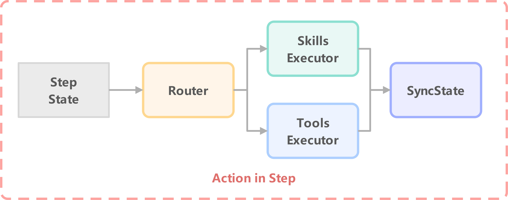
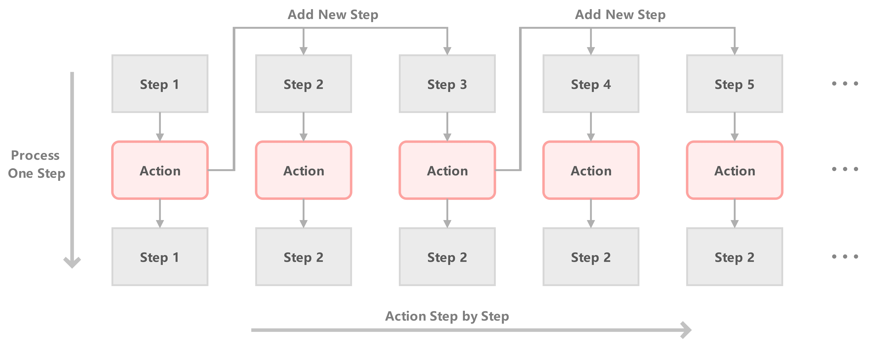

## Abstract

## 1. Introduction

相较于单一智能体（Single-Agent），多智能体系统（Multi-Agent System）因其在处理复杂并行任务时表现出的卓越适应性和效率，近年来受到了学术界与工业界的广泛关注。在设计和构建该类系统时，通常将其分解为两个核心子问题：

- **智能体内部机制**：如何构建单个智能体（Agent）的内部工作逻辑与决策模型。
- **智能体间协作框架**：如何构建智能体之间的交互协议与协作模式，以实现高效的任务协同。

In contrast to single-agent systems, Multi-Agent Systems (MAS) have garnered significant attention from both academia and industry in recent years. This is due to their superior adaptability and efficiency in managing complex and parallel tasks. The design and construction of such systems are typically broken down into two core sub-problems:

- **Intra-Agent Architecture Design**: How to construct the internal working mechanisms and decision-making logic of individual agents

- **Inter-Agent Collaboration Framework Design**: How to establish the interaction protocols and collaborative structures that enable agents to work together effectively on tasks.

针对第一个子问题——智能体内部工作逻辑与模式的构建，2024年发表的一篇具有里程碑意义的综述论文《Agent Design Pattern Catalogue》系统性地总结了现有的各种智能体架构模式。该研究将智能体架构归纳为18种不同的设计模式，并为不同应用场景下的模式选择提供了决策指导框架。这些模式包含：这些模式涵盖了：提示优化与响应生成、检索增强生成（RAG）、单路径与多路径规划、自我反思机制、基于投票的多智能体协作、基于角色分工的协作模式、以及基于辩论机制的群体决策等核心范式。

当前，在智能体行为模式层面提出根本性创新已变得极为困难——即针对全新的特定场景设计出前所未有的行为模式。然而，我们认为这一现状实际上反映了该领域的成熟化发展。现阶段智能体系统的核心瓶颈已不再是模式的丰富性不足，而是如何构建智能的决策机制，使智能体能够根据任务特征与环境上下文，自适应地选择并执行最优的行为模式与任务流程。

Regarding the first sub-problem—the construction of agent-internal operational logic and patterns—a landmark survey paper published in 2024, 【[Agent Design Pattern Catalogue](https://arxiv.org/html/2405.10467v4)】 systematically summarized existing agent architectural patterns. This research categorized agent architectures into 18 distinct design patterns and provided a decision-making framework for pattern selection across different application scenarios. These patterns encompass: prompt optimization and response generation, Retrieval-Augmented Generation (RAG), single-path and multi-path planning, self-reflection mechanisms, voting-based multi-agent collaboration, role-based collaborative frameworks, and debate-driven collective decision-making paradigms.

Currently, achieving fundamental innovation at the agent behavioral pattern level has become extremely challenging—that is, designing unprecedented behavioral patterns for entirely novel specific scenarios. However, we believe this situation actually reflects the field's maturation. The core bottleneck in agent systems has shifted from insufficient pattern diversity to the challenge of constructing intelligent decision-making mechanisms that enable agents to adaptively select and execute optimal behavioral patterns and task workflows based on task characteristics and environmental context.

我们认为，一个智能体的工作逻辑与模式不应局限于实现单一的、固定的范式，而应具备根据当前情境动态决策、选择最优模式的能力。我们将这种决策能力的范围和灵活性，定义为系统的**决策自由度（Policy Autonomy）**，其上限决定了系统的智能化与适应性水平。例如，在一些系统中，智能体被严格限制在预设的工作流内，其决策自由度仅体现在工作流中预设的少数分支节点上。而在另一些系统中，其决策自由度则体现在系统能够根据任务需求，自主选择并组合多个功能各异的预定义智能体。

因此，我们将第一个子目标——“构建合理的智能体内部工作逻辑/模式”——重新定义为一个更根本性的问题：

- 如何最大化系统的决策自由度（Policy Autonomy）？

We contend that an agent's operational logic and patterns should not be confined to a single, fixed paradigm. Instead, an agent must possess the capability to dynamically decide upon and select the optimal pattern that suits the current context. We define the scope and flexibility of this decision-making capability as the system's **Policy Autonomy**, the upper limit of which dictates the system's overall level of intelligence and adaptability. For instance, some systems exhibit low Policy Autonomy, where agents are strictly bound to predefined workflows, and their decision-making is limited to a few branching points within that flow. In contrast, other systems demonstrate higher Policy Autonomy, where the system can autonomously select and orchestrate multiple, functionally distinct, predefined agents based on task requirements.

Therefore, we reframe our first objective—"to construct a rational agent-internal logic and pattern"—into a more fundamental question:

- How can we maximize the Policy Autonomy of the entire system?

关于第二个子问题——构建智能体间的协作框架，Google于2025年2月发表的论文【[ Multi-Agent Design](https://arxiv.org/abs/2502.02533)】指出，提升多智能体框架性能的关键在于优化其拓扑结构。我们的方法论与之呼应：首先，在构建单个智能体时优化其内部的决策拓扑；其次，在系统层面，通过赋予智能体规划任务流和通信时机的自主权，从而为在系统级优化整体拓扑结构创造了可能性。

优化拓扑结构固然能够提升多智能体系统的协同效率，但在实际应用中，系统的可用性还取决于另外两个关键维度：任务进度的可观测性（Observability）与\**人工干预的可行性（Intervenability）。然而，一个高度动态和复杂的拓扑结构，往往会与高可观测性和高可干预性的要求相悖因此，我们将第二个核心目标重新阐述为：

- 多智能体系统如何在协同效率、进度可观测性与人类可干预性这三者之间取得理想的平衡？

Concerning the second sub-problem—constructing the collaborative framework among agents—a paper published by Google in February 2025, "*Multi-Agent Design*," highlights that the key to enhancing the performance of multi-agent frameworks lies in **optimizing their topological structure**. Our methodology aligns with this principle. First, we optimize the internal decision-making topology within each agent. Second, at the system level, we unlock the potential for optimizing the overall topology by empowering agents with the autonomy to define task workflows and determine communication timing with other agents.

While optimizing the topology undeniably boosts the synergistic efficiency of a Multi-Agent System, its practical usability also hinges on two other critical factors:  the observability of task progress and the feasibility of human intervention. However, a tension exists, as highly dynamic and complex topological structures often conflict with the requirements for high observability and intervenability.

Therefore, we redefine our second primary objective as follows:

- How can a Multi-Agent System achieve an optimal balance among synergistic efficiency, progress observability, and human intervenability?

为实现上述两大目标，我们重新定义了智能体执行的最小单元，并引入了一个包含任务（Task）、阶段（Stage）、智能体（Agent）和步骤（Step）的四层级状态架构。为此，我们设计并实现了一个名为Allen的多智能体系统。

本文的主要贡献归纳如下：

1. 提出全新视角：我们提出了“系统决策自由度”（System Policy Autonomy）这一全新视角，并以此作为构建和评估智能体系统的核心指导原则。
2. 构建执行模型：我们提出一种以“步骤”（Step）为核心的执行模型，用以重构智能体的执行逻辑。该模型实现了前所未有的系统决策自由度，使其能够模拟并执行现有几乎所有的智能体工作模式。
3. 设计协作架构：基于该执行模型，我们构建了一个包含四个状态层级的多智能体协作架构，在协同效率、进度可观测性与人类可干预性之间取得了卓越的平衡。

To achieve these two primary objectives, we redefine the minimal unit of agent execution and introduce a four-tier state hierarchy comprising Task, Stage, Agent, and Step. To this end, we have designed and implemented a Multi-Agent System named Allen.

Specifically, the contributions of this paper are as follows:

1. **Novel Perspective**: We introduce "System Policy Autonomy" as a novel perspective to guide the design and evaluation of agent systems.
2. **Execution Model**: We propose a Step-centric execution model to reconstruct the agent's operational logic. This model achieves a state-of-the-art level of System Policy Autonomy, enabling it to simulate and execute virtually any existing agent work pattern.
3. **Collaborative Architecture**: Building upon this execution model, we have constructed a four-tier collaborative architecture for the multi-agent system. This architecture strikes an exceptional balance among synergistic efficiency, progress observability, and human intervenability.

## 2. Related Work

若以“决策自由度”（Policy Autonomy）的视角对主流智能体架构进行审视，可以得到一种概念性的横向对比如下图所示：

Examining agent architectures through the lens of Policy Autonomy allows for a conceptual, horizontal comparison, as illustrated in the figure below.

- 图【1】注：我们从**决策自由度（Policy Autonomy）**的视角对不同的智能体框架进行评估。该谱系的两端代表了两种极端范式：左侧的**Token-wise**架构以单个Token为最小执行单元，具备最高的决策自由度；而右侧的**Workflow-wise**架构以固化的工作流为最小执行单元，其决策自由度最低。我们的Allen架构则定位于该谱系中靠近左侧的**Step-wise**层级。
- **Figure 1**: We evaluate different agent frameworks from the perspective of **Policy Autonomy**. The two ends of this spectrum represent two extreme paradigms: on the left, the **Token-wise** approach treats a single token as the minimal unit of execution, thus offering the highest degree of Policy Autonomy. On the right, the **Workflow-wise** approach uses a predefined workflow as the minimal unit of execution, resulting in the lowest Policy Autonomy. Our architecture, Allen, is positioned within this spectrum at the **Step-wise** level, situated closer to the left side.

当前主流的智能体实现框架（而非终端产品）均可被置于图【1】的决策自由度谱系中进行评估。在坐标轴的最左边代表决策自由度最高，例如原始的LLM，实际上每个token对于llm来说都是一次自主决策。坐标轴的最右侧代表决策自由度最低，例如工作流级别的决策自由度，我们只能在不同工作流之间选择，并且需要为每个新环境新场景构建新的适配的完整工作流。

谱系的右端是**工作流级（Workflow-wise）**决策。此范式下，系统自由度最低，限于在预定义的、固化的工作流之间进行选择。任何新场景都要求开发者手动构建全新的、与之适配的工作流。诸如【[langchain](https://github.com/langchain-ai/langchain)】、【[dify](https://github.com/langgenius/dify)】等框架的核心便位于此层面，它们本质上是高效构建和执行特定工作流的工具集。谱系的左端是**词元级（Token-wise）**决策，其典型代表是基础大语言模型（LLM）。理论上，模型在生成每个token时都在进行一次微观决策，因而拥有最高的自由度。在两者之间，【[AutoGen](https://arxiv.org/pdf/2308.08155)】 提升至**智能体级（Agent-wise）**的决策自由度。在该框架中，系统能够根据任务需求自主决策并编排需要参与的智能体组合，但其仍要求开发者为新场景预先构建新的智能体角色。【[MetaGPT](https://arxiv.org/html/2308.00352v7)】则实现了更高的**行动级（Action-wise）**决策自由度。其框架内的智能体能够在“思考-行动”（think-act）的循环中，根据上下文动态选择执行不同的预定义行动（Action）。这些行动由候选技能和工具库动态组装而成，使得“行动”的概念已十分接近一个完整的智能体运行模式。这使MetaGPT成为一个高度灵活且决策自由度较高的先进智能体框架。

Prominent contemporary frameworks for agent implementation (as distinct from end-user products) can be situated along the Policy Autonomy spectrum shown in Figure 1.

At the far right of the spectrum lies **Workflow-wise** autonomy. In this paradigm, the system has the lowest degree of freedom, limited to selecting from a set of predefined, rigid workflows. Any new scenario necessitates the manual construction of a new, bespoke workflow. Frameworks such as Langchain and Dify operate at this level; they are essentially toolkits for efficiently building and executing these specific processes.

At the opposite end of the spectrum is **Token-wise** autonomy, exemplified by a foundational Large Language Model (LLM). Theoretically, the model makes a micro-decision for each token it generates, thus possessing the maximum possible degree of freedom.

Positioned between these extremes, **AutoGen** ascends to **Agent-wise** policy autonomy. This framework can autonomously decide upon and orchestrate the composition of agents required for a task. However, it still necessitates that developers pre-define new agent personas for novel scenarios.

**MetaGPT** achieves an even higher level of **Action-wise** policy autonomy. Within its "think-act" cycle, an agent in this framework can dynamically select from a set of predefined Actions based on the context. These Actions are dynamically assembled from a library of candidate skills and tools, bringing the concept of an "Action" very close to that of a complete agent operational mode. This positions MetaGPT as a remarkably flexible and advanced agent framework with a high degree of policy autonomy.

然而，我们主张，为新任务适配并实现具体的“行动”（Action）仍然是一种次优的开发范式。我们认为，由多种技能和工具组成的“行动”并非决策自由度的理论上限。我们的目标是定义一个更为基础的最小执行单元，通过对这些单元进行动态编排，便可在宏观层面涌现出多样的智能体执行逻辑与模式。这种方法的核心优势在于，只要定义好单元之间的衔接规则，系统便能赋予智能体在宏观层面自主决定其工作逻辑的能力，从而摆脱为新场景手动适配的桎梏。

我们将系统中的最小执行单元定义为“步骤”（Step）。基于此，我们的Allen框架最终实现了一个具备**步骤级（Step-wise）**决策自由度的系统。我们认为，纯粹的**词元级（Token-wise）**系统（如原始LLM）虽理论上自由度最高，但因缺乏结构化的任务导向和可靠的状态判断，难以直接应用于复杂任务；而为其强加固定的输出格式校验，则无异于将其退化为**工作流级（Workflow-wise）**的系统。

因此，Allen是我们所知的、在兼顾结构化与灵活性的前提下，实现了最高决策自由度的智能体系统。它通过赋予智能体自主选择并组合“步骤”（Step）的能力，使其能够动态生成并执行最适合当前情境的“行动”（Action）序列，从而实现了行为模式的自适应，无需任何人工预设。

However, we argue that adapting and implementing concrete "Actions" for new tasks remains a suboptimal development paradigm. We contend that an "Action," composed of various skills and tools, does not represent the theoretical upper limit of policy autonomy. Our objective is to define a more fundamental minimal execution unit. Through the dynamic orchestration of these units, a diverse range of agent execution logics and patterns can emerge at a macroscopic level. The core advantage of this approach is that by defining the transition rules between these units, the system can empower an agent to autonomously determine its own operational logic, thereby breaking free from the constraints of manual adaptation for new scenarios.

We define the minimal execution unit within our system as a "Step." Consequently, our Allen framework implements a system with **Step-wise** policy autonomy. We posit that a purely **Token-wise** system (such as a raw LLM), despite having the highest theoretical freedom, is impractical for complex tasks due to its lack of structured task-orientation and reliable state judgment. Furthermore, imposing fixed output validation on it is tantamount to degrading it to a **Workflow-wise** system.

Therefore, to our knowledge, Allen is the agent system that achieves the highest degree of policy autonomy while maintaining a crucial balance between structure and flexibility. It empowers each agent to autonomously select and combine "Steps," enabling it to dynamically generate and execute a sequence of "Actions" best suited for the current context. This achieves adaptive behavioral patterns without the need for manual pre-define.

> ChatGPT agent，Manus，Genspark，Comet，Fellou，Warmwind，NeuralOS
>
> LangGraph，Llamalndex，FastGPT，LobeChat，SWE Agent
>
> 多Agent框架：CAMEL，AgentScope
>

## 3. Agent‘s Internal Mechanisms

本章我们将介绍我们如何构建一个合理的Agent内部工作逻辑/模式。在第一章Introdouction部分，我们已经将这个目标转化为“如何提高一个单Agent系统的决策自由度（Policy Autonomy）”。

一个自然产生的问题是，如何将综述【[Agent Design Pattern Catalogue](https://arxiv.org/html/2405.10467v4)】中总结的各种Agent工作模式（例如反思、规划等）动态融合到一个Agent执行流程中；或者说，如何在这样一个Agent内部，有Agent自主决定何时反思、何时规划以及何时调用工具？我们认为它需要实现两个标志性的能力：

- Agent能够决定使用什么工具与技能
- Agent能够决定自身工作逻辑

从 Policy Autonomy 的角度思考，当整个系统的决策自由度越高，系统越容易实现上述两个标志性的能力。Agent能够决定使用什么工具与技能，该能力要求我们的Policy Autonomy在工具与技能层面。Agent能够决定自身工作逻辑，该能力要求我们的自身工作逻辑是动态的。一个较为自然的结合就是有Agent自主决策一个个的工具与技能从而形成一个完整动态的工作逻辑，从而实现Agent能够决定和改变自身工作逻辑。

因此这个问题缩小到了我们去实现一个在工具和技能层面决策的Agent执行机制。并且这个每次产生决策单元足够的小，从而可以通过每一次决策出的小单元组成一个个宏观的Agent内部工作模式。

我们定义了我们Agent执行的最小单元为一个Step，同时这也是我们系统的最小决策单元，一些step可以决定下一个step执行什么内容。这样，我们只需要尽可能地实现一些基础的Step，然后一切交给LLM去决策何时使用具体的Step，从而实现一个极易拓展地，能够适应任何任务的Agent动态工作逻辑。至此我们的Agent就能够同时具备上述两个能力：1）Agent能够决定使用什么工具与技能；2）Agent能够决定自身工作逻辑。

从拓扑结构的角度看待我们的Step，会发现一些Step是相互关联的，例如Planning Step，Reflection Step，Decision Step等都具备为Agent添加其他Step的能力。所以在我们所有的Step中，可以认为上述的Step是指向其他Step的。Agent的执行可以从这些Step的执行后跳转去执行其他的Step，例如Planning Step规划了一些新的Step。但同时被规划的新的Step有时又可以重新规划一些已执行过，且具备决策和规划能力的Step。故而由所有Step组成的整个空间里，在这些可执行Step的指向关系中，存在多个环结构。从而确保Agent具备自主持续执行和运转下去的能力，而不需要人类时不时地“上发条”。

### 3.1 Execution Process of Step

接下来，我们详细阐述系统的最小执行单元——“步骤”（Step）——的具体执行机制。一个“步骤”可以是两种类型之一：**技能（Skill）**或**工具（Tool）**。我们定义，所有需要调用大语言模型（LLM）的原子操作为“技能”，而所有不涉及LLM调用的确定性操作（如API调用、代码执行等）则为“工具”。关于技能和工具的具体实现细节，请参阅【[附录A]()】。

We will now detail the execution mechanism of the system's minimal unit: the **Step**. A Step can be one of two types: a **Skill** or a **Tool**. We define all atomic operations that require invoking a Large Language Model (LLM) as "Skills," whereas all deterministic operations not involving an LLM (such as API calls or code execution) are defined as "Tools." For specific implementation details of our Skills and Tools, please refer to 【Appendix A】.

一次“步骤”的执行，意味着对单个技能或工具的调用。其完整的执行流程如【图2】所示。

The execution of a single Step corresponds to the invocation of either one Skill or one Tool. The complete execution flow is illustrated in the 【figure 2】.

- 图【2】注：“步骤”（Step）的执行流程。此流程的核心是步骤状态（StepState），它封装了执行所需的所有上下文信息。当一个步骤被触发时：1. 路由器Router根据`StepState`中记录的信息如步骤类型，选择并调用相应的执行器（Executor）。2. 指定的技能/工具执行器依据`StepState`的内容，执行具体的操作（如与LLM交互或调用外部API）。3. 执行完成后，执行器会生成额外的指令，用以指导状态同步组件（SyncState）进行全局任务层面的状态更新与同步。
- **Figure 2 :** The Execution Flow of a Step. The process is orchestrated around the **StepState**, which encapsulates all state information required for execution. When a Step is initiated: 1. The **Router** component analyzes the `StepState` to determine the type of Step and invokes the corresponding **Executor**. 2. The designated **Skill/Tool Executor** performs the specific interaction (e.g., communicating with the LLM or calling an external API) based on the context provided by the `StepState`. 3. Upon completion, the Executor generates additional instructions to guide the **SyncState** component in performing task-level state synchronization and updates.

在我们的实现中，我们为每个待执行的“步骤”（Step）都实例化一个独一无二的**步骤状态（StepState）**对象。该对象封装了此步骤完整的执行上下文，包括其唯一标识、类型（技能或工具）以及具体意图。至关重要的是，我们将单个“步骤”的执行定义为智能体的一次“行动”（Action）。这一设计将我们的框架与MetaGPT等其他框架显著区别开来。在MetaGPT中，“行动”被定义为多个具体步骤的组合，因此开发者需要预先定义多种复杂的“行动”类型。而在我们的Allen框架中，开发者只需定义不同类型的“步骤执行器”（Step Executor），这极大地降低了系统的设计复杂性，并提升了灵活性。

在智能体的单次“行动”（Action）中，流程如下：

1. 智能体将当前`StepState`提交至**路由器（Router）**。

2. 路由器根据`StepState`中记录的执行器信息，将其分派至相应的**执行器实例**。

3. 执行器

   根据其类型执行核心逻辑：

   - **技能执行器（Skill Executor）**：负责更新智能体自身的内部状态及`StepState`。
   - **工具执行器（Tool Executor）**：负责与外部环境（如API、数据库）进行实际交互，并更新`StepState`。

对于跨智能体的全局状态（如任务信息、其他智能体状态）的同步，这一职责由全局的**状态同步组件（SyncState）**承担。任何执行器在完成其操作后，都会返回一个用于指导状态同步的指令对象。`SyncState`组件将依据此指令，作为该“行动”的收尾步骤被显式调用，确保整个系统的状态一致性。

这种设计确保了每个“步骤”（Step）的执行都是高度封装和相互隔离的。我们为框架提供了一套基础的技能与工具执行器（Executor）库，其中每个执行器自身不维护状态，其行为完全由传入的`StepState`内容所驱动。

而智能体之所以能实现高级的自主决策，其机制也被统一在该框架之下。诸如规划（Planning）、反思（Reflection）和决策（Decision）等“决策型技能”，其执行的输出并非直接的外部行动，而是通过生成并向执行队列中追加一系列新的`StepState`实例，来程序化地改变智能体自身后续的行为序列。正是通过这种方式，智能体被赋予了动态调整其自身“工作流”的强大能力。

In our concrete implementation, we instantiate a unique **StepState** object for each Step to be executed. This object encapsulates the Step's complete execution context, including its unique identifier, type (Skill or Tool), and specific intent. Critically, **we define an agent's "Action" as the execution of a single "Step."**

This design choice distinguishes our framework from others like MetaGPT, where an "Action" is defined as a composite of multiple steps, thus requiring developers to pre-define various complex Action types. In our Allen framework, the developmental burden is shifted to pre-defining different types of **Step Executors**, which significantly reduces design complexity and enhances system flexibility.

Within a single agent Action, the process unfolds as follows:

1. The agent submits the current `StepState` to the **Router**.
2. The Router dispatches the `StepState` to the corresponding **Executor** instance, based on the executor information logged within the `StepState`.
3. The Executor then performs its core logic based on its type:
   - A **Skill Executor** is responsible for mutating the agent's own internal state and updating the `StepState`.
   - A **Tool Executor** is responsible for interacting with the external environment (e.g., APIs, databases) and updating the `StepState`.

For synchronizing global, non-local states (such as task information or the state of other agents), this responsibility is delegated to a global **SyncState** component. Upon completion, every Executor returns a directive object to guide this global state update. The `SyncState` component is then explicitly invoked with this directive as the concluding phase of the Action, ensuring system-wide state consistency.

This architectural design ensures that the execution of each "Step" is highly encapsulated and isolated from one another. We provide a foundational library of Skill and Tool Executors, each of which is stateless; its behavior is driven solely by the contents of the `StepState` it receives. 

Consequently, the agent's capacity for high-level autonomous reasoning is unified under this same model. Special "decision-making Skills"—such as Planning, Reflection, and Decision—do not produce direct external actions as their output. Instead, they programmatically alter the agent's own subsequent sequence of behaviors by generating and appending a new series of `StepState` instances to the execution queue. It is precisely through this mechanism that the agent is empowered with the profound ability to dynamically adapt its own workflow.

### 3.2 The Action of Agent

我们已经阐明了单个“步骤”（Step）的内部执行机制，接下来将描述一个智能体（Agent）是如何串联并顺序执行这些步骤的。

We have explained how a single "Step" works. Now, we will describe how an Agent executes a sequence of these Steps.

- 图【3】注：Agen顺序执行步骤的流程示意图。横轴表示步骤的执行顺序，纵轴表示单个步骤的处理流程。关键机制在于：特定的决策型步骤（如步骤1和3）可以向执行队列中动态添加新步骤，从而使智能体能够自主地决定并构建其未来的工作流。
-  **Figure 3** : A flowchart showing the Agent's sequential execution of Steps. The horizontal axis is the timeline of Steps. The vertical axis is the process for each Step. Critically, some  decision-making Steps (like 1 and 3) can add new Steps to the queue. This allows the Agent to autonomously decide its own future work.

智能体通过维护一个待执行的步骤队列，并按顺序处理它们来实现其宏观行为。【图3】展示了这一顺序执行的过程。在此示意图中，横轴代表了步骤的执行时序，而纵轴则代表了单个步骤的内部处理流程。每个“行动”模块在接收一个`StepState`后，会执行相应的操作，并将结果反映回`StepState`中。该模型的关键机制在于，特定的决策型技能（如【图3】中的步骤1和步骤3）具备改变智能体自身执行序列的能力。当执行这类步骤时，其“行动”的产出不仅是状态更新，还包括向待执行队列的末尾追加一个或多个新的`StepState`。正是这一机制，赋予了智能体动态地、自主地规划和调整其后续行为的强大能力。

An Agent works through a queue of pending Steps in order. Figure 3 shows this process. The horizontal axis shows the order of execution from left to right. The vertical axis shows the internal processing flow for a single Step. During an Action, the system takes a `StepState`, executes the corresponding operation, and updates the `StepState` with the outcome. The key feature of our model is that some decision-making Steps can add *new* Steps to the Agent's queue (exemplified by Step 1 and Step 3 in Figure 3). When such a Step is executed, its resulting "Action" includes appending one or more new `StepState` objects to the end of the pending queue.  This is how the Agent dynamically controls its own behavior and autonomously decides what to do next. 

我们发现，该架构在运行机制上与**循环神经网络（RNN）**【[Finding structure in time]()】展现出显著的相似性。RNN的核心机制是，在每个时间步，它都会结合**当前输入**与上一时刻的**隐藏状态（Hidden State）**，来生成当前时刻的输出并更新其自身状态。这种设计赋予了RNN在每个时间步都能依据历史信息做出不同决策的能力。

与此高度类似，我们的智能体在执行每个“步骤”时，会依据**当前`StepState`（可类比为RNN的输入）**与智能体自身的**`AgentState`（可类比为RNN的隐藏状态）**做出决策。这些决策不仅决定了当前步骤的执行结果，更可能动态地调整后续的执行流程，从而影响整个任务路径。这种灵活性与RNN依据历史和当前输入动态生成下一步输出的过程高度同构。

此外，RNN通过在时间步之间传递隐藏状态来捕捉信息和长期依赖关系。在我们的架构中，这一角色由**智能体状态（AgentState）**承担。每次“行动”（Action）执行完毕后，所有新获取的关键信息都会被整合并更新至`AgentState`中，使其成为智能体记忆与上下文的持续载体。

We observe a strong analogy between our architecture and a Recurrent Neural Network (RNN). An RNN processes sequences. At each timestep, it uses the **current input** and its **previous hidden state** to generate an output and update its state. This allows the RNN to make different decisions at each step based on prior information. Our Agent operates in a similar way by processing a sequence of Steps.

- The current `StepState` acts like the **input** for the RNN.
- A persistent state, which we call `AgentState`, acts like the **hidden state**.

During each Action, the Agent uses the current `StepState` and its `AgentState` to perform a task. The outcome updates the `AgentState` and can dynamically add new Steps to the execution queue. This is how the Agent adjusts its future behavior based on its history, much like an RNN.

Just as the hidden state carries information through time for an RNN, the `AgentState` serves as the Agent's memory. It carries context from one Step to the next, enabling the Agent to handle long-term dependencies within a task.

### 3.3 Agent State

Agent State是一个用于维护Agent自身运行的状态空间，其中记录了Agent自身持有的属性和Agent在执行过程中产生的持续性记忆【[附录B]()】

## 4. Inter-Agent Collaboration Mechanism

综述【[Agent Design Pattern Catalogue](https://arxiv.org/html/2405.10467v4)】提到的挑战：

- 由于整个生态系统中各种利益相关者，基于Foundation Model的Agent、非Agent AI Model 和 非AI软件应用程序之间的交互，问责过程非常复杂。高度自主的Agent可以委派甚至创建其他Agent或工具来执行某些任务。在这种情况下，责任和问责机制可能在多个实体之间交织在一起。

## 5. Disscussion

- 多Agent系统和单Agent系统

  从系统**决策自由度**的角度来说，当我们的决策自由度从workflow wise跨越至agent wise时，单Agent系统自然而然地演变成多Agent系统了。至此你期望能够根据不同的需要去选择不同的Agent（每个Agent背后代表了一条独特的工作流/工作逻辑）

- 系统易于迭代和优化

  我们的框架可以兼容任何Model/Context/Tool层面的优化和改进方法，正如25.7月综述【[A Survey of Self-Evolving Agents](https://arxiv.org/html/2507.21046v1)】所指出的迭代方向。我们的架构创新在于重新定义Multi-Agent System运行模式，而一切的model policy、model experience、context prompt、context memory等模块的改进措施均可以适配最新研究方法。

## 6. Conclusion

## References

## Appendix

### A. Skills and Tools

### B. Presistent Memory

