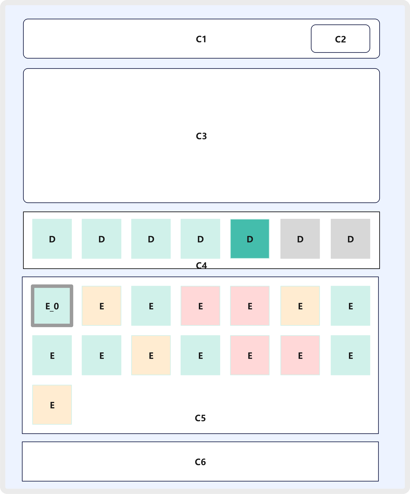
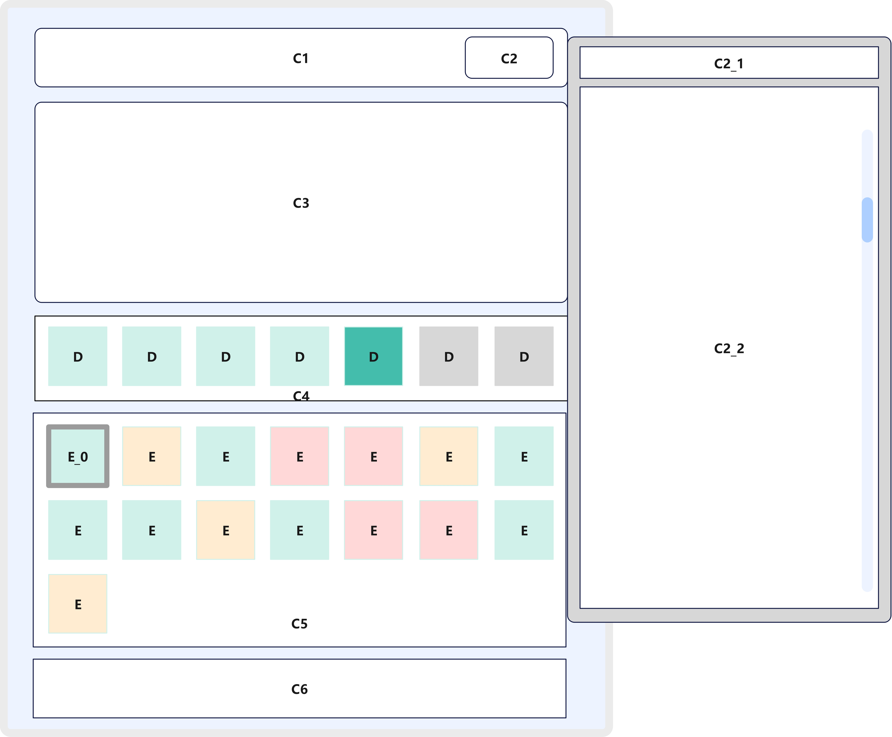
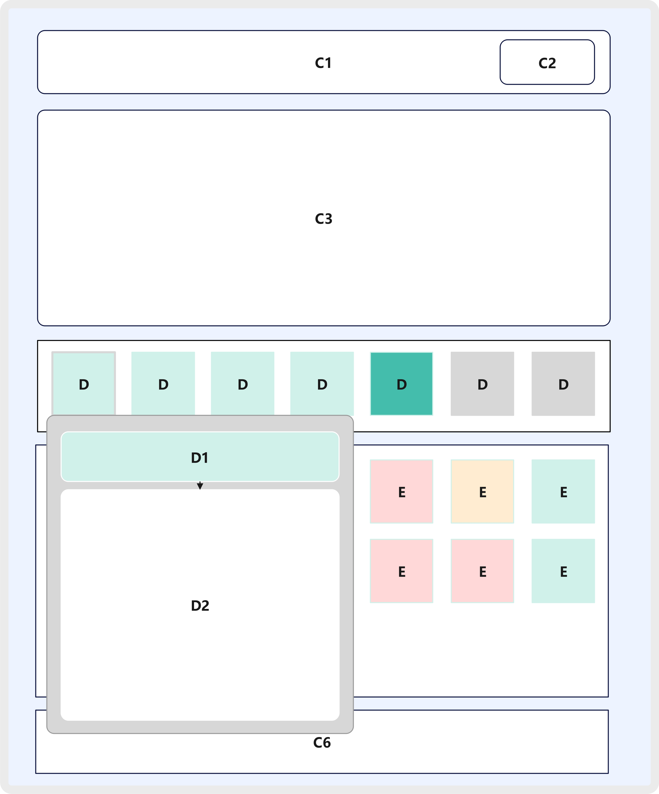
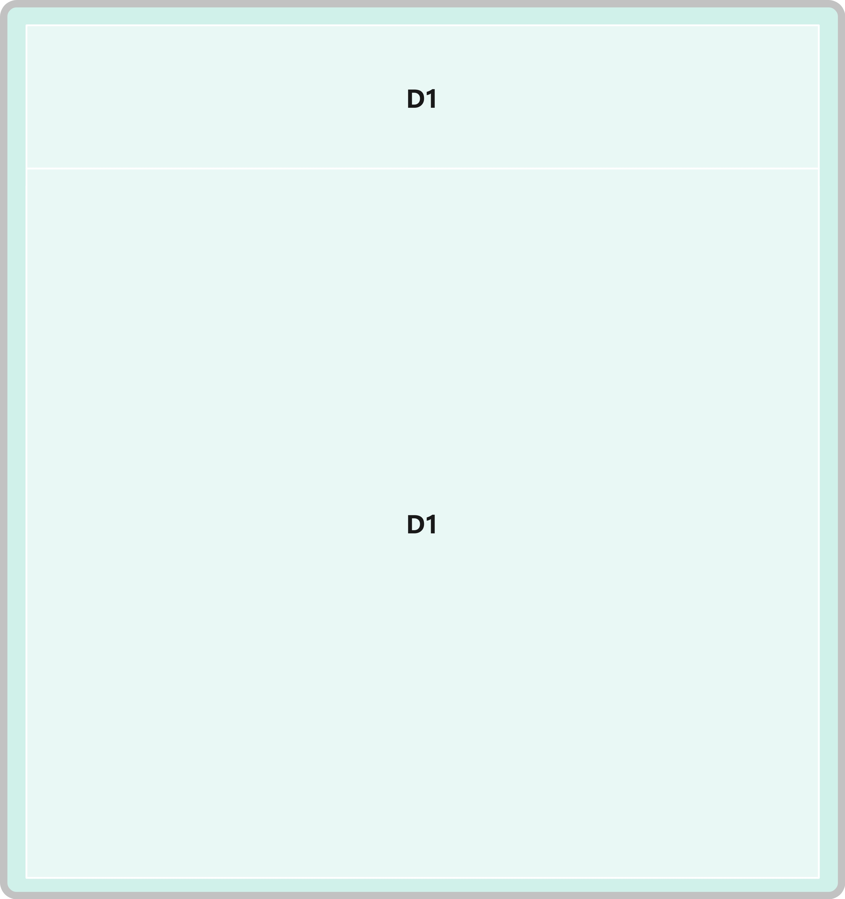

# 界面基础说明


图注：默认界面示意图，其中元素`A`为控制边栏，元素`B1`为主要工作区，元素`B2`为次要工作区


## A 控制边栏-说明


图注：控制边栏元素排列示意图。控制边栏中的元素以图标形式呈现，纵向排列。


**简介：**


控制边栏位于界面左侧，其中元素纵向排列。


**元素含义**：

元素`A0`表示菜单，**包含所有功能选项**（一些功能已经默认添加至控制边栏中，如`A1-A4`。其他不在控制边栏中直接显示的功能依然可以在控制边栏-菜单中找到），需要预留元素`A0`拓展空间。

元素`A1`表示 `Task State` ，含义是任务状态；

元素`A2`表示 `Stage State` ，含义是阶段状态；

元素`A3`表示 `Agent State` ，含义是Agent状态；

元素`A4`表示 `Step State` ，含义是步骤状态；


**呈现方式：**

元素`A0-A4`均默认以图标（具体图标暂未确定）的形式呈现。

鼠标悬停在对应元素上时显示元素对应含义的文字说明，

例如：菜单、Task 任务状态、Stage 阶段状态、Agent 智能体状态、Step 步骤状态。


**功能：**

控制边栏的主要功能是为右侧主要工作区（`B1`）呈现不同层级的内容。

1.用户点击元素`A1-A4`时：右侧主要工作区（`B1`）则显示该元素对应层级状态的内容。

2.用户点击元素`A0`时：展开控制边栏-菜单总览的第一层级目录，点击在第一层级目录中某个元素时，展开对应的第二层级目录。示意图如下：


图注：控制边栏-菜单（`A0`）操作示意图。鼠标首先点击元素`A0`展开第一级目录`A0_1-A0_9`，随后点击元素`A0_4`，展开其对应的第二级目录并最终选择元素`A0_4_3`。


**特殊说明：**

控制边栏默认元素是`A0-A4`，是为了方便用户而预设的常用功能。然而**所有的功能都可以在元素`A0`控制边栏-菜单中找到**


## B1 主要工作区-说明

对于主要工作区的第一级元素（一般是元素`C`），我们努力将其所展示的子信息限制在3-4个元素以内，其余的完整信息，通过一个按钮可以单独展开。


### 1. 显示任务状态（TODO：简化元素）

当点击控制边栏-任务状态（元素`A1`）时，主要工作区`B1`展示MAS所有任务状态。


图注：Task状态展示。每个Task State以一个独立的元素容器`C`显示在主要工作区`B1`中


**简介：**

点击选择 控制边栏-任务状态（`A1`） 时 主要工作区（`B1`）呈现 Muti-Agent System 中全部任务状态信息。每个任务状态信息以一个单立的元素容器（`C`）呈现，默认以行列对齐排布。


**呈现方式：**

每一个任务状态的元素容器`C`所包含的具体内容如下：



图注：任务状态示意图。展示一个任务状态时，在元素容器`C`中所包含的内容。

接下来我们将详细说明，在展示任务状态时，元素容器`C`所包含的各个组件是什么。


**数据来源：**

任务状态的数据来源通过接口：

```python
GET /api/states?type=task
```

返回格式：

```python
{
    "StateID_1": { "task_id": "...", "task_name": "...", ... },
    "StateID_2": { ... },
    ...
}
```

返回字典，每个键值对代表一条任务状态。

任务状态的详细属性同样以字典的形式包含在内。


#### C1 任务名称

元素`C1`表示任务名称。一个任务简介的名称，向人类使用者提供基本的信息区分。


**呈现方式：**

填充字符串

**数据来源：**

获取任务状态 `task_name (str)` 字段内容；

**交互功能：**

允许复制字符串内容


#### C2 执行状态

元素`C2`表示任务执行状态，包含（"init"、"running"、"finished"、"failed"）


**呈现方式：**

填充字符串，"init"、"running"、"finished"、"failed"

并显示对应颜色，init 灰色，running 黄色，finished 绿色，failed 红色

**数据来源：**

获取任务状态 `execution_state (str)` 字段内容；

**交互功能：**

鼠标悬停时展开详细信息，移走时取消详细信息的展开；

鼠标点击时展开详细信息，点击其他地方才关闭详细信息的展开。

------

元素`C2`展开的 `执行状态-详细信息`：


图注：任务状态中执行状态（`C2`）的详细展开


其中元素`C2_1`展示任务ID；元素`C2_2`展示任务完成总结，如果任务执行状态未处于完成状态，则一般元素`C2_2`不会有任何实质的内容。


**呈现方式：**

元素`C2_1`和`C2_2`均以字符串填充；

元素`C2_1`的背景颜色与元素`C2`保持一致

**数据来源：**

元素`C2_1`从任务状态 `task_id (str)` 字段获取；

元素`C2_2`从任务状态 `task_summary (str)` 字段获取；

**交互功能：**

元素`C2_1`和`C2_2`均允许复制


#### C3 任务意图

元素`C3`表示任务执行状态，较为详细的任务目标说明


**呈现方式：**

填充字符串

**数据来源：**

获取 `task_intention (str)` 字段内容；

**交互功能：**

允许复制字符串内容


#### C4 任务阶段（TODO：点击D1跳转阶段）

元素`C4`用于展示任务中所有阶段，元素`D`用于表示其中一个阶段


**呈现方式：**

元素`C4`中将该任务下的每个阶段都以一个方块（元素`D`）的形式呈现，方块中不显示文字，方块颜色随着阶段的`execution_state`字段变化：init 灰色，running 深绿色，finished 浅绿色，failed 红色

方块从左往右对应获取字段的列表的顺序（该任务下的第一个阶段在最左侧，最后一个阶段在最右侧）

**数据来源：**

获取 `stage_list (list[Dict[str,str]])` 字段内容；

字段值为一个记录了多个阶段Stage的列表，列表中的每个Stage以字典形式表示：

```python
{
    "stage_id": str,
    "stage_intention": str,
    "execution_state": str,
}
```

**交互功能：**

对于元素`D`：

鼠标悬停时展开详细信息，移走时取消详细信息的展开；

鼠标点击时展开详细信息，点击其他地方才关闭详细信息的展开。

------

元素`D`展开的 `任务阶段-详细信息`：


图注：任务状态中任务阶段（`D`）的详细展开。其中元素`D1`展示阶段ID；元素`D2`展示阶段意图。


**呈现方式：**

元素`D1`和`D2`均以字符串填充；

元素`D1`的背景颜色与元素`D`保持一致

**数据来源：**

元素`D1`从任务状态 `stage_list 字段中，对应阶段字点的`stage_id (str)`字段获取；

元素`D2`从任务状态 `stage_list` 字段中，对应阶段字点的`stage_intention (str)`字段获取；

**交互功能：**

元素`D1`和`D2`均允许复制


#### C5 任务群组（TODO：点击E跳转Agent）

元素`C5`展示任务群组，包含参与这个任务的所有Agent，每个Agent以一个独立的元素方框`E`表示。
其中任务管理Agent比较特殊，需要突出描边标明，以元素方框`E_0`代表。


**呈现方式：**

元素`C5`中将该任务群组的每个Agent都以一个方块（元素`E`）的形式呈现。

方块中不显示文字，方块颜色随着Agent的状态变化：
idle 绿色，working 黄色，waiting 红色

其中元素`E_0`代表管理Agent用特殊描边标明

**数据来源：**

- 直接获取：

获取 `task_group (list[str])` 字段内容，为所有Agent的agent_id。

获取 `task_manager (str)` 字段内容，为管理Agent的agent_id。需要为对应的元素`E_0`进行特殊标明。

- 间接获取：

在获取了所有Agent的agent_id后，如何知晓Agent的状态以填充元素方块`E`和`E_0`的颜色呢？

目前后端并未直接提供根据`agent_id`查询Agent的`working_state`的接口，但是查询Agent状态的API包含了Agent的working_state信息：

```python
GET /api/states?type=agent
```

返回MAS中所有Agent的状态：

```
{
    "StateID_1": { "working_state": "...",  ... },
    "StateID_2": { "working_state": "...",  ...  },
    ...
}
```

**交互功能：**

/


#### C6 共享消息池（TODO：点击C6_1跳转阶段/C6_2跳转Agent）

元素`C6`展示共享消息池，由于共享消息池的内容非常多，所以默认只呈现最新的两条消息。


**呈现方式：**

只呈现最新的两条消息，以字符串的形式呈现：[角色] 内容

```python
[<role>] <content>
[<role>] <content>
```

**数据来源：**

从任务状态获取 `shared_message_pool (List[Dict])` 字段内容，列表中每一个字典都是一条消息：

```python
{
    "agent_id": str,
    "role": str,
    "stage_id": str,
    "content": str
}
```


**交互功能：**

鼠标点击时展开详细信息，点击其他地方才关闭详细信息的展开。

------

元素`C6`展开的 `共享消息池-详细信息`：


图注：任务状态中共享消息池（`C6`）的详细展开。其中元素`C6_1`表示对应阶段；元素`C6_2`表示Agent角色；元素`C6_3`展示消息内容


**呈现方式：**

元素`C6_1` **显示固定字符串”Stage“** ，其背景颜色与任务阶段`C4`中对应的任务阶段一致（反映该阶段状态）

元素`C6_2`显示Agent的`role`角色字符串，其背景颜色与任务群组`C5`中的对应Agent一致（反映该Agent状态）

元素`C6_3`显示该条共享消息的内容，字符串。

**数据来源：**

直接获取：

从任务状态 `shared_message_pool (List[Dict])` 字段中可以获取所有共享消息的列表，列表中每一个元素都是一个字典形式的共享消息，包含：

```python
{
    "agent_id": str,
    "role": str,
    "stage_id": str,
    "content": str
}
```

元素`C6_2`需要获取`role`字段，元素`C6_3`需要获取`content`字段

间接获取：

元素`C6_1`表示阶段，阶段ID可从`stage_id`字段获取；则该阶段状态等信息可查询。

元素`C6_2`表示Agent，AgentID可从`agent_id`字段获取；则该Agent状态等信息可查询。


**交互功能：**

元素`C6_3`允许复制


------

### 2. 显示阶段状态（简化元素）

当点击控制边栏-阶段状态（元素`A2`）时，主要工作区`B1`展示MAS所有阶段状态。


图注：Stage状态展示。每个Stage State以一个独立的元素容器`C2`显示在主要工作区`B1`中。同属于相同任务的Stage State阶段状态排列在一行；该行的最左侧有该任务的基本信息展示（元素`C1`）。

**简介：**

点击选择 控制边栏-阶段状态（`A2`） 时 主要工作区（`B1`）呈现 Muti-Agent System 中全部阶段状态信息。属于同意一个任务的阶段信息排列在同一行中，每个阶段信息以一个单独的元素容器（`C2`）呈现，该行的最左侧展示任务该状态基本信息如下。


**呈现方式：**

每一行最左侧的任务基本信息的元素容器`C1`所包含的具体内容如下：


图注：阶段状态展示中左侧任务信息（`C1`）示意图。其中`D1`用于展示任务状态，`D2`用于展示任务名称`task_name`，`D3`用于展示任务意图`task_intention`。`D4`为固定按钮，用于打开显示该任务完整信息的窗口。


每一行中，每一个阶段状态的元素容器`C2`所包含的具体内容如下：

图注：阶段状态展示中每一个阶段信息的示意图。Stage状态展示中的元素`C2`表示一个阶段。其中`E1`用来展示阶段状态，`E2`用于展示阶段意图`stage_intention`，`E3`用于展示阶段中Agent协作情况：其中每个Agent使用一个独立元素`F`表示。`E4`为一个固定按钮，用于展开该阶段的详细信息。

**数据来源：**

- 直接获取：

任务状态的数据来源通过接口：

```python
GET /api/states?type=stage
```

返回格式：

```python
{
    "StateID_1": { "task_id": "...", "stage_id": "...", ... },
    "StateID_2": { ... },
    ...
}
```

返回字典，每个键值对代表一条阶段状态。

阶段状态的详细属性同样以字典的形式包含在内。

- 间接获取：

对于需要展示的Agent信息与Task信息，可以通过调用接口进行筛选：

```
GET /api/states?type=task
GET /api/states?type=agent
```


#### D1 任务状态

在Stage状态展示中，左`C1`元素中的`D1`用于表示该任务状态

**呈现方式：**

纯色色块（状态指示灯），init 灰色，finished 绿色，running 黄色，failed 红色

**数据来源：**

已知任务ID `task_id`；

查找对应任务状态 `execution_state (str)` 字段内容；


#### D2 任务名称

`C1`中元素`D2`表示任务名称。个任务简介的名称，向人类使用者提供基本的信息区分。

**呈现方式：**

填充字符串

**数据来源：**

已知任务ID `task_id`；

查找对应任务状态 `task_name (str)` 字段内容；

**交互功能：**

允许复制字符串内容


#### D3 任务意图

`C1`中元素`D3`表示任务意图，较为详细的任务目标说明

**呈现方式：**

填充字符串

**数据来源：**

已知任务ID `task_id`；

获取 `task_intention (str)` 字段内容；

**交互功能：**

允许复制字符串内容


#### D4 显示完整信息

元素`D4`作为一个固定按钮用于弹出该任务完整信息的窗口

**呈现方式：**

红色竖向长条状色块

**数据来源：**

/

**交互功能：**

鼠标悬停时显示”完整信息“字样

鼠标点击元素`D4`时弹出完整Agent信息，[T1 Task完整信息](#Task)


#### C2 阶段状态

在Stage状态展示中，一行中右侧每个`C2`元素表示同一任务下的每个阶段的信息。

**呈现方式：**

展示`C2`中`D1`和`D2`元素内容。

元素`C2`的背景颜色根据阶段的执行状态`execution_state`显示：
init 灰色，running 深绿色，finished 浅绿色，failed 红色

**数据来源：**

`C2` 元素背景颜色：

获取对应阶段状态 `execution_state (str)` 字段内容；


#### C2-D1 阶段意图

`C2`中元素`D1`表示阶段意图，是较为详细的阶段目标

**呈现方式：**

填充字符串

**数据来源：**

获取 `stage_intention (str)` 字段内容；

**交互功能：**

允许复制字符串内容

点击元素`D1`展开完整阶段意图内容，点击其他地方关闭完整内容的展开。



图注：鼠标点击`C2-D1`时，展开`D1`信息到覆盖整个`C2`


#### C2-D2 Agent协作情况（TODO：点击E1跳转Agent）

`C2`中元素`D2`表示Agent协作情况，包含每个Agent的角色、状态和划分职责。

在`D2`中，每一行表示一个Agent信息：每一行的左侧`E1`表示Agent状态和角色，右侧`E2`展示Agent的具体阶段目标。

**呈现方式：**

`E1`为纯色方块，颜色取决于该Agent的状态：idle 灰色，working 黄色，finished 绿色，failed 红色

`E2`填充Agent具体阶段目标的字符串。

**数据来源：**

- 直接获取

Agent被分配阶段目标：

获取 `agent_allocation (Dict[<agent_id>, <agent_stage_goal>])` 字段内容；阶段中Agent的分配情况，key为Agent ID，value为Agent在这个阶段职责的详细说明。

Agent阶段工作状态：

获取 `every_agent_state (Dict[<agent_id>, <agent_state>])` 字段内容；包含：idle 空闲，working 工作中，finished 已完成，failed 失败（agent没能完成阶段目标）。这里的状态是指Agent在这个阶段的状态，不是全局状态。

- 间接获取

已知agent_id；

则可以筛选获得agent的`role`字段内容

```python
GET /api/states?type=agent
```

**交互功能：**

`E1`鼠标悬停时显示Agent的角色信息：


图注：鼠标悬停`E1`时，展开详细信息，`E1_1`显示该Agent的`role`角色名


`E2` 鼠标点击时展开详细信息，点击其他地方关闭详细信息的展开：


图注：鼠标悬停`E2`时，展开详细信息，`E2_1`显示该`E2`为完全显示的完整内容，该Agent被分配的阶段目标。


### 3 显示Agent状态

当点击控制边栏-Agent状态（元素`A3`）时，主要工作区`B1`展示MAS所有Agent的状态。


图注：Agent状态展示。每个Agent State以一个独立的元素容器`C`显示在主要工作区`B1`中。容器`C`的背景色保持和工作区背景一致，避免干扰到其内部信息展示。


**简介：**

点击选择 控制边栏-Agent状态（`A3`） 是 主要工作区（`B1`）呈现 Muti-Agent System 中全部Agent状态信息。每个Agent信息以一个单独的元素容器（`C`）呈现


**呈现方式：**

每个元素容器`C`所包含的具体内容如下：


图注：Agent状态容器内容图。其中`C1`展示Agent状态，`C2`展示Agent名字和角色，`C3`展示Agent的执行步骤。`C4`为固定按钮点击弹出Agent完整信息的窗口。

**数据来源：**

任务状态的数据来源通过接口：

```python
GET /api/states?type=agent
```

返回格式：

```python
{
    "StateID_1": { "working_state": "...", "name": "...", ... },
    "StateID_2": { ... },
    ...
}
```

返回字典，每个键值对代表一条Agent状态。

Agent状态的详细属性同样以字典的形式包含在内。


#### C1 Agent状态

元素`C1`展示Agent状态

**呈现方式：**

纯色色块（状态指示灯），idle 灰色，working 绿色，waiting 黄色

**数据来源：**

获取Agent状态 `working_state (str)` 字段内容；

**交互功能：**

鼠标悬停时显示原始字段值：idle , working , waiting


#### C2 Agent角色与名字

元素`C2`展示Agent名字和Agent角色

**呈现方式：**

字符串填充，填充内容：

```markdown
[<role>] <name>
```

例如：[工程师]小灰

**数据来源：**

Agent角色 role：从Agent状态中获取 `role (str)` 字段
Agent名字 name：从Agent状态中获取 `name (str)` 字段

**交互功能：**

鼠标点击`C2`时展开显示详细信息，点击其他地方时取消展开：

------


图注：鼠标点击`C2`时展开显示详细信息，展开后元素`C2_1`填满整个Agent容器`C`

**呈现方式：**

字符串填充，填充内容：

```markdown
[<role>] <name>

<profile>
```

**数据来源：**

Agent角色 role：从Agent状态中获取 `role (str)` 字段
Agent名字 name：从Agent状态中获取 `name (str)` 字段
Agent简介 profile：从Agent状态中获取 `profile (str)` 字段

**交互功能：**

允许复制


#### C3 Agent步骤

元素`C3`展示Agent的具体执行步骤，每一个元素`D`都表示一个步骤状态Step State

**呈现方式：**

在元素`C3`中展示所有的AgentStep，每个Step以一个纯色方块呈现, Step的颜色反映其执行状态`execution_state`：init 灰色 ，pending 黄色， running 深绿色，finished 浅绿色，failed 红色。

所有Step按照`todo_list`的顺序从左到右，从上到下依次排列。


**数据来源：**

AgentStep顺序：从Agent状态中获取 `todo_list (List[str])` 字段

获取到由`step_id`组成的顺序列表。Agent执行顺序由`todo_list`决定，`step_list`只负责记录内容，不负责记录顺序。


AgentStep内容：从Agent状态中获取 `step_list (List[Dict[str,str]])` 字段

由列表装载的Step基础内容（字典形式）：

```python
{
    "step_id": str,
    "step_intention": str,
    "execution_state": str,
}
```

`execution_state`决定`C3`中元素`D`的颜色；

`step_intention`提供鼠标悬停展开的详细信息。

**交互功能：**

鼠标悬停在元素`D`时，显示元素`D`对应步骤的意图（`step_intention`内容）。

鼠标点击元素`D`时，弹出完整Step信息[T4 Step完整信息](#Step)


#### C4 显示完整信息

元素`C4`作为一个固定按钮用于弹出该Agent完整信息的窗口

**呈现方式：**

紫色竖向长条状色块

**数据来源：**

/

**交互功能：**

鼠标悬停时显示”完整信息“字样

鼠标点击元素`C4`时弹出完整Agent信息[T3 Agent完整信息](#Agent)


## T 状态弹窗-说明

在许多场合下，点击元素会弹出其代表状态的完整信息的弹窗。本小节介绍弹窗的具体内容。

以下内容均在主要工作区`B1`以独立容器窗口（弹窗）的形式呈现


<a id="Task"></a>

### T1 Task完整信息


<a id="Stage"></a>

### T2 Stage完整信息


<a id="Agent"></a>

### T3 Agent完整信息


<a id="Step"></a>


### T4 Step完整信息


