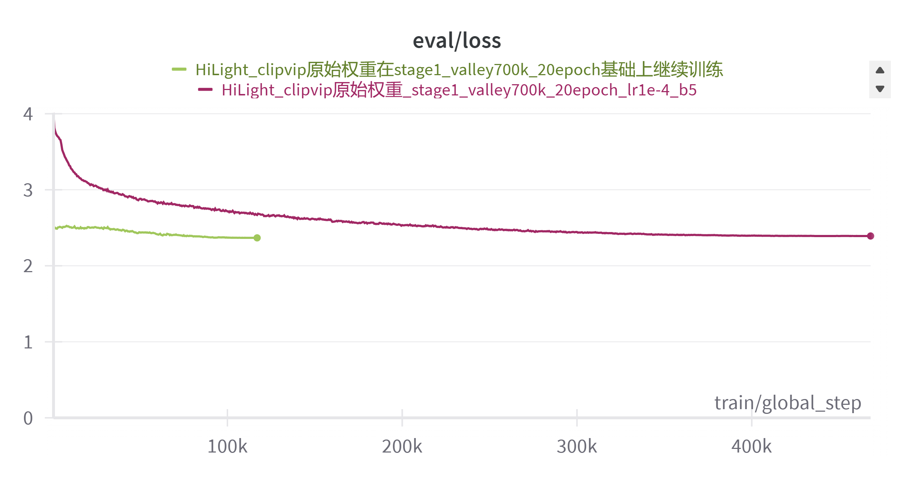
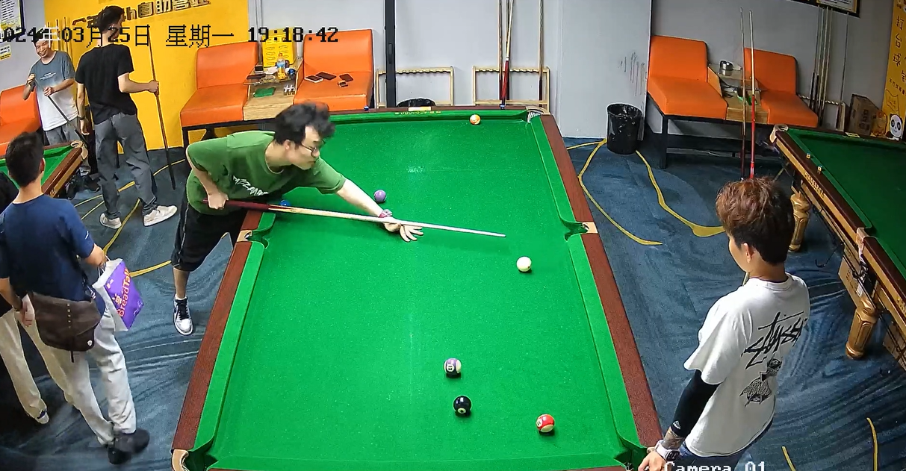
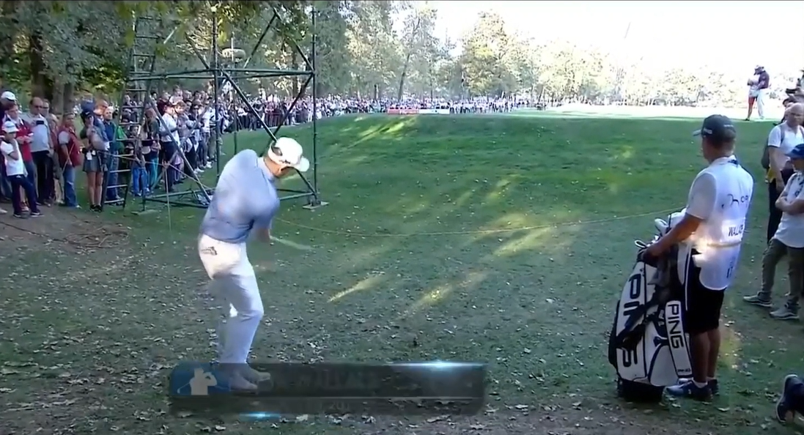
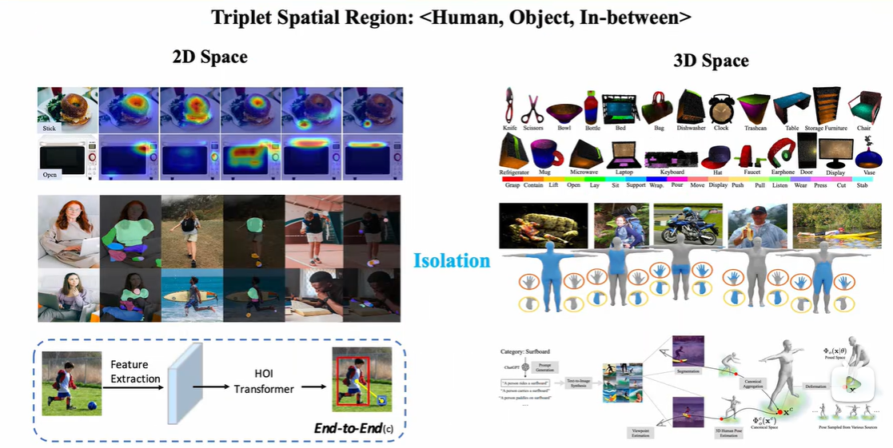
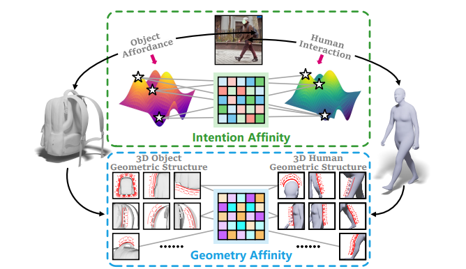
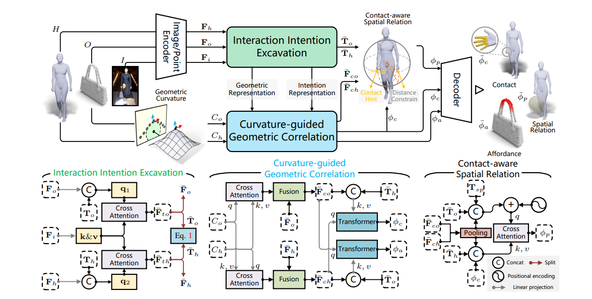
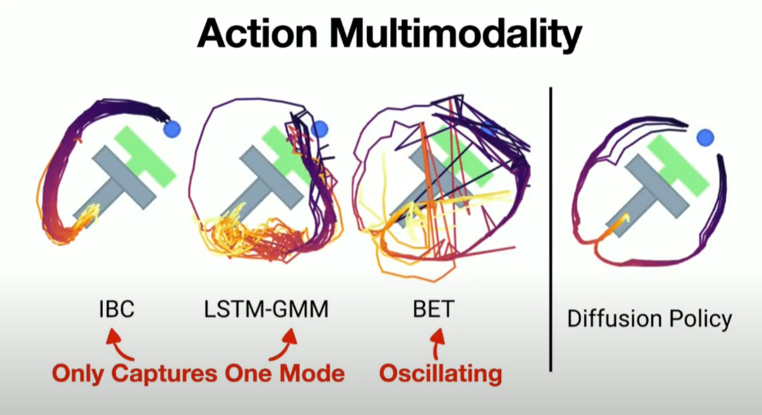
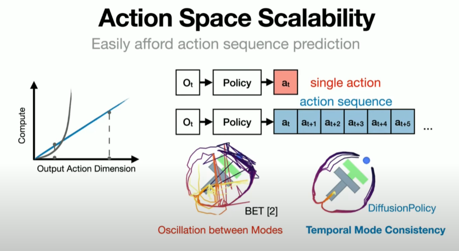

#### 1. 算法进展

任何时候算法进展，请关注：
1.算法进展表：https://alidocs.dingtalk.com/i/nodes/N7dx2rn0JbNZP2xRtdlqAyo7JMGjLRb3?doc_type=wiki_notable&iframeQuery=sheetId%3Da5mpmcw3o0a3agno7gde9%26viewId%3DRe1tn0o&rnd=0.8072404881274278

2.技术报告：[代码浏览 - hi_light - motern_ai - MOTERN (coding.net)](https://serverless-100013832940.coding.net/p/motern_ai/d/hi_light/git/tree/master/HiLight_Tech_Report)

##### 1.1 HiLight 视频问答模型 近期事项

1. **性能检查后VLM TokenMining预训练**

   我们从两组权重中（CLIP-ViP的1K权重和原始权重）通过TokenMining预训练选择了原始权重进行后续操作：
   

   原始权重训练得到的结果在各方面明显优于1K权重。

   

2. **VLM指令微调第一步骤完成**

​	我们采用前一个阶段得到的 原始权重valley_20epoch.bin 权重进行Lora指令微调

​	我们首先在VideoInstruck100k上以2e-5余弦退火学习率进行3个epoch的lora微调，实际训练时间约为3.5时训练过程验证loss变化如下：

| 第二阶段指令微调VI100K前后比较                               | 指令微调前（预训练原始权重valley_20epoch.bin）               | 指令微调后（HiLight-2B-LoRA-Merge-stage2-IV100K-1.5epoch）   | 指令微调后（HiLight-2B-LoRA-Merge-stage2-IV100K-3epoch）     |
| ------------------------------------------------------------ | ------------------------------------------------------------ | ------------------------------------------------------------ | ------------------------------------------------------------ |
| video1.MP4 | Chur, poland - august 25, 2019: people playing board game at a family game night in a bar. people playing board games in the evening. family time and fun. | increa effe fta fta effe effe fta desir effe effe fta effe   | The video shows two men playing a game of pool.              |
| video2.MP4 | China, 14 august 2019: group of young men playing chinese checkers on a playing board. chinese checkers game played on a playing board. chinese checkers game. chinese checkers game. young men | increa effe increa fluo fta effe increa fluo fta fluo fta effe fluo fta fluo fta fluo | In this video, two men are playing pool in a room.           |
| video38.MP4 | A man in a white coat is reading a letter and smiling. he is sitting at a desk and looking at a computer screen. he is wearing a white shirt and a white tie. he is holding a pen. | increa effe effe effe fta effe effe effe fta effe effe       | The video shows a man smoking a cigarette while sitting in a chair. |
| video39.MP4 | Taipei, taiwan, august 26 2019. gregory mishandles the ball and the ball goes to the right. gregory mishandles the ball and the ball goes to the right. gregory mishandles the ball and the ball goes | increa effe effe effe fta effe effe effe fta effe effe       | In this video, a man is seen throwing a ball into a net.     |
| video40.MP4 | Young woman dances with a girl in a dance studio. the woman is dressed in a beautiful dress and the girl dances in the studio. the camera is placed in the center of the studio. | increa effe effe effe fta effe effe effe fta effe effe       | In this video, a woman is seen dancing on a wooden floor while a man is standing behind her |
| videoA.MP4 | Cute caucasian girl girl having fun in the water. girl having fun in the water. summer vacation. yongguang. yongguang. yongguang... | increa effe effe effe fta effe effe effe fta effe effe       | In this video, a woman is seen riding a water slide with a child on her back |

指令微调第一阶段的结果显示，在videoinstruck100k微调后的回答清晰明确了许多，明显优于微调之前。

#### 2. 讨论

##### 2.1 3D人-物交互《LEMON:Learning 3D Human-Object Interaction Relation from 2D Images》

论文连接：[2312.08963 (arxiv.org)](https://arxiv.org/pdf/2312.08963)

3D人-物交互理解。该方法也可迁移至3D机器人-物交互理解。根据交互图像去推理能够揭示三维任务交互关系的空间区域三元组。

输入为一张图像和从该图像推理的人体模型以及一个给定的3D物体（只需要类别与图像中物体一致），输出为人体的接触区域，物体的可供性区域（物体能够支持某种交互的区域）以及人-物之间的相对空间关系。

解析这些交互元素能够为具身智能体或者交互建模以及生成提供交互的空间先验和约束。

##### 背景：

HOI Understanding分为三个阶段  Perecption->Grounding->Modeling 。
第一个阶段主要high level语义的理解（动作识别或caption），在理解这些概念之后第二个阶段需要去理解交互具体体验在空间中的哪些区域（人体的接触，物体的可供性区域），最后一个阶段则是理解交互的构型（如何去形成一个交互）。本文LEMON工作处于第二个阶段，Grounding交互的空间区域作为Perecption和Modeling或action之间的连接。

之前在2D或3D空间的方法大多是独立的预测交互区域三元组中的一个方面，这回导致最终交互的行程受限（比如预测到了交互物体的哪个区域，但不知道主题应该用哪个区域去操作，也不知道主客体之间的空间关系是怎样的，难以明确地建模一个交互）

##### 方法：

本文认为交互中的任何物体本身就是协同的，这种协同性不仅体现在语义层面也体现在几何关联上。物体被设计来满足人的需求，符合人体工程学，很大程度上暗示了人与其发生交互的意图。本文将这种关联定义为Intention Affinity（意图关联）。在交互意图的驱使下，人会调整寻找自身适配的构型去完成交互，本文将这种关联定义为geometry affinity（几何关联）。
通过去建模这两种affinity的表征去联合预测空间交互区域的三元组。

在这种情况下，模型利用两个模块去分别构建人与物体和几何结构的关联性，进而计算接触和可供性表征。交互语义主要通过图像中的交互内容作为桥梁，几何结构主要通过一个手工特征：几何曲率来引导几何结构的关联建模，接触表征还被用来进一步约束空间关系的预测，是一个人和物体相对距离的loss（因为图像中估计的人体可能有多种旋转和平移，这回导致物体在空间中的位置缺乏一致性，不易被模型学习。然而人和物体的相对距离是不受平移和旋转影响的，通过这个约束来减小优化空间）。

##### 2.1 Diffusion Policy 视觉-运动策略学习

**什么是Diffusion Policy？**

Diffusion Policy是一种新型机器人行为生成方法（Robot Action Generation），将机器人的视觉动作策略（Visuomotor Policy）表示为条件去噪扩散过程（Conditional Denoising Diffusion Process）。

**Diffusion Policy和Diffusion Model的关系**

Diffusion Policy可以理解为Diffusion Model在机器人领域的应用。Diffusion Model在图像领域的应用产生了非常好的图像生成模型，比如Stable Diffusion这些，比GAN这类图像生成模型的效果好很多。同样的，Diffusion Policy可以理解为这套Diffusion Model在机器人动作生成领域的应用，尤其是部署到物理机器人领域的动作生成。

图像生成：输入-->文本； 输出--> 图像

动作生成：policy输入-->图像； policy输出-->可能的动作序列

**为什么用Diffusion Policy？**

**Diffusion Policy解决的核心问题**

从最简单的形式来看，从演示中学习策略可以被表述为学习将观察映射到动作的监督回归任务。然而，在实践中，预测机器人动作有一系列挑战，比如存在多模态分布、时序相关性和训练稳定性的要求。

**解决机器人Multi-Modal分布问题**

机器人Multi-Modal的问题，简单理解，现实世界中解决某一特定任务的方式是多样的，而不是唯一的。但神经网络预测只能给出单一的方式，无法应对可能有多种方式的任务情况。

关于什么是机器人Multi-Modal问题，迟宬给了非常清晰的解释：假设我现在在开车，前面有一棵树。比如说，我雇佣了100个司机来解决这个问题。在这种情况下，有可能有50个司机选择往左拐，绕过树的左边，还有50个司机选择从树的右边绕过去。在这种情况下，往左绕和往右绕都是完全合理的。然而，当我们将所有这些解决方案合并为一个时，问题就变成了一个多模态分布，即我看到的相同场景有两种不同的选择。这对传统神经网络的预测来说并不友好，因为它通常使用均方误差（MSE）损失进行训练，而这无法有效处理Multi-Modal情况。

前馈神经网络本质上是一个函数，即对于给定输入，只有一种输出。然而，在某些情况下，一个输入可能对应两种不同的输出。这导致了一个问题，即我想要神经网络执行的任务和它能够执行的任务存在冲突。强行让神经网络处理这种情况，通常是通过预测一个中间值，试图最小化与数据之间的距离。但这可能导致不符合预期的行为，例如直接往树上撞。为了解决这个问题，引入了概率分布，使得神经网络不再是一个输入一个输出的函数，而是一个输入可以有多个输出的函数。这种方法提供了更大的灵活性，可以表示各种概率分布，解决了原有方法的限制。

引入概率分布的方法提供了更大的灵活性，让机器人有机会在相同的情况下选择不同的行为，从而避免陷入不可预测的循环。这种非确定性的特性在实际应用中表现出很大的优势，可以防止算法陷入一成不变的状态。但这和传统机器人控制需要对机器人动作严格控制的思路相违背，每次只执行一项任务，整个机器人系统都被认为是受到严格控制的。这也是为什么大多数人没有把机器人动作生成表现为一个概率分布的原因。

**Action Space Scalability的问题**

关于Action Space Scalabiltiy或者sequential correlation问题，简单理解就是机器人对未来动作的预测不应该只局限于眼前的一步两步动作，而应该更有前瞻性，可以往前预测数十步动作。

针对这个问题，迟宬给了非常清晰的解释：数据预测有两种方法：一是直接输出一个数值，另一种是将可能的数值分成几个区间，进行离散预测。在预测Multi-Modal Action的时候，人们倾向于采用离散预测，将连续值问题转化为分类问题，但这样做涉及的算力成本很高，尤其在处理高维空间时。此外，针对机器人控制问题，如果采用分类方法，每一步都需要预测下一步要执行的动作，而实际需求是希望一次性预测多步动作，这就涉及到了连续控制中的动作一致性问题。解决这个问题的挑战在于平衡成本和对高维连续控制的需求。

由于它们预测高维空间的成本非常高，因为它们只能预测一步，接下来的步骤是什么。如果再加上更多的步骤，维度就会变得越来越高，它们就无法胜任。然而，实际上我们现在追求的是具有以下特性的方法：不仅可以预测每一步，而且可以在高维连续控制中实现。对于我们来说，我们可以直接预测未来每一步，无论是接下来的20步还是100步，是向左还是向右，而不是在每一步预测之后再执行，再决定下一步该怎么走。

**Training Stability问题**

Diffusion Policy和其他使用生成式模型的策略比，他的最大特点是训练过程非常稳定。

关于训练稳定性，迟宬的进一步解释是：在Robot Learning领域，机器人动作执行主要有三种方法：包括直接回归、分类预测和生成式模型。第一类回归，即将神经网络视为一个函数，输入是图片，输出是一个动作。这是最常见的方法，绝大多数强化学习都采用这种方式。第二类分类预测，这种方法通过预测分类来生成动作，前文已经大致描述。第三类生成模型，理论上所有的生成模型都可以预测连续的多模态分布，但很多生成模型的问题是训练不稳定。

基于Diffusion Model的第三类方法具有一个重要的优势，即训练非常稳定。基本上，你可以随便调整参数，生成器就能够输出结果，可能效果不是最优的，但基本上都能work。同时，这也解释了为什么像Stable Diffusion这样的方法，以及现在各种图像生成模型能够在如此庞大的数据集上进行训练，这是因为它们的训练非常稳定。如果你在如此大规模的数据上使用其他方法进行训练，可能会在训练一段时间后出现奇怪的问题，模型无法进一步优化。

**优势**

① 支持多模态演示，允许人类演示者自然地教授行为，而不必担心破坏机器人的学习。

② 适用于高维动作空间，使机器人能够及时计划并避免不稳定的行为。

③ 稳定可靠，适合大规模训练机器人。

**为什么 Diffusion Policy 对控制特别有效？**

1、最简单的形式来看，从演示中学习策略可以被表述为**学习将观察映射到动作的监督回归任务**。但在实践中，预测机器人动作存在多模态分布、时序相关性和训练稳定性的要求。

① 在机器人学习领域，常用的机器人控制方法有直接回归（regression）、分类预测（classification）和生成式模型，但均存在局限。

2、解决机器人多模态分布方面，Diffusion Policy 的优势在于引入**概率分布**，允许一个输入对应多个可能的输出，提供了更大的灵活性，能够表示各种概率分布。

① Multi-Modal 可以概括为现实世界中解决某一特定任务的方式可以有多种，但传统神经网络预测只能给出单一的方式，无法应对可能有多种方式的任务情况。

② 扩散模型本身就表示概率分布的优质方法，由此增加的自由度对提高算法稳健性有很大影响。

3、解决动作空间可扩展性问题方面，DIffusion Policy 能够一次性预测多步动作，避免了高维空间中分类方法的高成本，同时解决了连续控制中的动作一致性问题。

① Action Space Scalability 或 Sequential Correlation 问题可以归纳为机器人对未来动作的预测不应仅限于眼前几步，而应具有前瞻性，能够预测更远未来的多步动作。

② 传统分类方法一次只能预测一步，将连续值问题转化为分类问题虽然可行，但随着维度的增加，计算成本呈指数级增长。

4、解决训练稳定性方面，相比于其他生成模型（如 GAN），Diffusion Policy 的训练过程非常稳定，不需要精细调整参数即可获得有效的输出。

① 理论上所有的生成模型都可以预测连续的多模态分布，但 GAN 因训练不稳定性需要耗费大量成本进行调参， VAE 方法也有自己的局限。

5、Diffusion Policy 的另一项优势在于，作为一种策略逻辑，它适用于输入图像并输出相应动作的情境，与机器人控制中常用的强化学习和模仿学习两条路径并不冲突。

① 论文中展示了 Diffusion Policy 结合模仿学习的方式，由人类遥控机器人执行动作，收集数据，并通过学习将其转化为策略。

① 基于强化学习的策略可能为了加速训练采用低纬度的信息作为输入，但这个状态信息在真实环境无法获得，不能直接驱动机器人。研究者对此会把 RL Policy 生成的数据训练成以图片为输入的模仿学习策略，也就是「蒸馏」。

#### 3. 其他

##### 3.1 如何理解3D人-物交互理解中三元组的概念？

在3D人-物交互理解中，三元组（triplets）的概念是用来描述和捕捉人与物体之间的关系和交互信息的基本单位。三元组通常由三部分组成：人、物体和交互行为。每个三元组描述了一个人如何与一个特定物体进行某种交互。具体来说，三元组的形式通常是：

1. **人（Human）**：描述参与交互的人的信息。这可以包括人的姿态、位置、动作等。例如，一个人的姿态可以通过骨架关键点（3D joints）来表示。
2. **物体（Object）**：描述参与交互的物体的信息。这可以包括物体的种类、位置、姿态等。例如，一个物体可以通过其3D模型或包围盒（bounding box）来表示。
3. **交互行为（Interaction）**：描述人和物体之间发生的具体交互行为。这可以是接触、抓取、推、拉等动作。交互行为可以通过动作标签（action labels）或交互类型（interaction types）来表示。

##### 示例

考虑以下几种人-物交互情景，可以用三元组来描述：

1. **抓取杯子**：

   - 人：一个人的骨架关键点。
   - 物体：一个杯子的3D模型。
   - 交互行为：抓取（grasping）。

   三元组表示为：(Human, Cup, Grasping)

2. **推椅子**：

   - 人：一个人的骨架关键点。
   - 物体：一把椅子的3D模型。
   - 交互行为：推（pushing）。

   三元组表示为：(Human, Chair, Pushing)

3. **坐在沙发上**：

   - 人：一个人的骨架关键点。
   - 物体：一张沙发的3D模型。
   - 交互行为：坐（sitting）。

   三元组表示为：(Human, Sofa, Sitting)

##### 应用

在3D人-物交互理解中的三元组概念有以下几个应用：

1. **行为识别**：通过分析三元组，可以识别和分类人在3D环境中的各种交互行为。
2. **动作预测**：基于当前的三元组，可以预测人下一步可能的动作和交互行为。
3. **虚拟现实**：在虚拟现实（VR）和增强现实（AR）中，三元组可以用于生成和模拟逼真的人-物交互场景。
4. **机器人学**：在机器人学中，三元组可以帮助机器人理解和学习如何与物体交互，从而执行复杂的任务。

##### 3.2 **Diffusion Policy和RL以及Imitational Learning是什么关系？**

在Robot Learning领域，机器人操作比较常用的两个路径是强化学习（Reinforcement Learning）和模仿学习（Imitation Learning），Diffusion policy并不与强化学习和模仿学习冲突，它可以应用于两者。该方法是一种策略逻辑，适用于输入图像并输出相应动作的情境。在论文中，我们使用了模仿学习，即由人类遥控机器人执行动作，收集数据，并通过学习将其转化为策略。这种学习过程通过遥控机器人完成一系列动作开始，然后将其迁移到机器人身上。输入数据包括过去几帧的图像，而输出涉及对未来动作的预测。

##### 3.3 **操作（Manipulation）和移动（Locomotion）的训练有什么不同？**

RL在移动有更好的效果，Sim2Real Gap的问题相对好解决；但在操作，RL存在最大的问题是Sim2Real Gap没法很好的解决。对于操控而言，需要考虑的因素较多，其中一个关键区别是在机器人操作中除了需要考虑机器人本身的物理特性，同时还要适应复杂多变的环境和被操作物体。操控涉及与各种各样的物体进行交互，每个物体都具有独特的物理特性，如重心、摩擦力和动力学。这些在模拟器中难以准确模拟，即便能够模拟，精度通常较低，速度较慢。相比之下，对于locomotion，外界环境大多可以视为一个刚体，物理特性基本可以忽略。这使得可以花费更多时间来建立机器人本体的精确物理模型，以及设计更复杂的物理引擎。这是为什么RL更适合Locomotion，而对有物理机器人部署Manipulation没有那么好的效果。