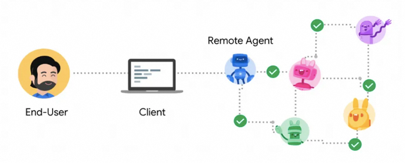
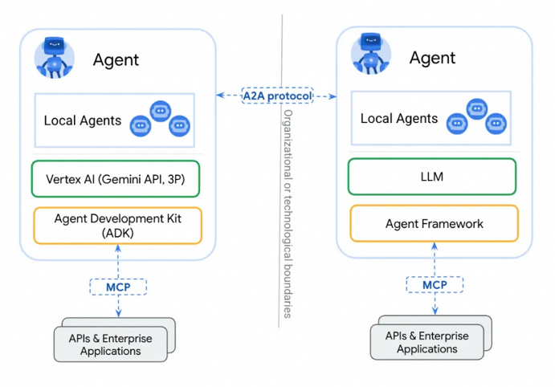
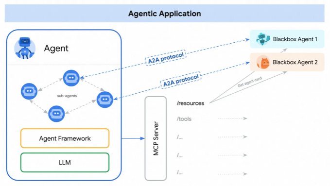

# Agent2Agent 协议 (A2A)


## 1. A2A 设计原则

**A2A** 是一个用于链接不同封闭Agent，并实现其相互操作的开放协议。它为Agent之间协作提供了一种标准方式，不受底层框架或供应商的限制。在与合作伙伴设计该协议时，我们遵循了五项关键原则：


- **拥抱代理能力**：A2A 致力于使代理能够以自然、非结构化的模式进行协作，即使它们不共享内存、工具和上下文。我们正在实现真正的多代理场景，而不将代理局限于单一的“工具”。

- **基于现有标准：**该协议建立在现有的流行标准之上，包括 HTTP、SSE、JSON-RPC，这意味着它更容易与企业日常使用的现有 IT 堆栈集成。

- **安全协作**：A2A 旨在支持企业级身份验证和授权，在启动时与 OpenAPI 的身份验证方案相同。

- **支持长时间运行的任务：**我们设计 A2A 时就考虑到了灵活性，并支持各种场景，使其能够出色地完成各种任务，从快速任务到深度研究，这些任务可能需要数小时甚至数天的时间（如果人工参与）。在此过程中，A2A 可以为用户提供实时反馈、通知和状态更新。

- **与模态无关：**代理世界不仅限于文本，这就是我们设计 A2A 来支持各种模态（包括音频和视频流）的原因。

##  2. A2A 的工作原理


### 2.1 关键概念

#### 2.1.1 核心三要素



A2A 中包含三个核心的参与者：

- **用户(User)**
  使用代理系统完成任务的最终用户（人类或服务）。
- **客户端(Client Agent)**
  代表用户向不透明代理请求操作的实体（服务、代理、应用程序）。
- **远程代理（Remote Agent）**
  不透明（“黑匣子”）代理，即 A2A 服务器。

**User**存在于协议中，主要的作用是用于 **认证&授权** 。**Client Agent** 指的是任务发起者，**Server Agent** 指的是任务的执行者。

**Client** 和 **Server** 之间的通信，可以理解为就是一个个简单的请求和结果的响应，只不过这个请求是一个个的任务。一个 **Agent** 既可以是 **Client** 也可以是 **Server**。


#### 2.2.2 核心概念

Client Agent 和Server Agent 交互的过程中，主要涉及到的一些Entity：**AgentCard**、**Task** 、**Artifact** 、**Message**、**Part**。这里主要介绍涉及到的相关核心概念：


**AgentCard**

AgentCard是Server Agent的名片，描述了Server Agent的能力、认证机制等信息。Client Agent通过获取不同的Server Agent，了解不同 Server Agent的能力，来决断具体的任务执行应该调用哪个 Server Agent

一个AgentCard内容示例：

```typescript
inferface AgentCard {
  name: string;  // Server Agent的名称，便于识别
  description: string;  // 对Server Agent功能和角色的简短说明
  url: string;  // Server Agent 的网页链接，提供更多信息或访问接口
  provider?: {    // ?表示可选对象
    organization: string;    //  提供该Server Agent的组织名称，帮助Client Agent确定来源的可信度。
    url: string;    // 提供者的网页链接，便于获取更多背景信息。
};
  version: string;  // 当前 Agent 的版本，用于确保 Client Agent 使用的兼容性。
  documentationUrl?: string;  // 链接到详细文档的 URL，提供对 Agent 功能更深入的理解。
  capabilities: {    
    streaming?: boolean;     // 指出 Agent 是否支持流式传输，影响执行实时数据处理任务的决策
    pushNotifications?: boolean;    // 指出 Agent 是否支持推送通知，适合需要即时反馈的场景。
    stateTransitionHistory?: boolean;   // 表示是否可以记录状态转移历史，可能对需要跟踪状态的应用有价值
    };
    
   authentication: {    
     schemes: string[];     // 支持的认证方案，例如 OAuth、API Key 等，提供给 Client Agent 有关如何认证的信息。
     credentials?: string;  // 有关如何获取或存储凭证的说明，帮助 Client Agent 理解认证过程
   };
     defaultInputModes: string[];  // 指定该 Agent 支持的默认输入模式，比如文本、语音等，影响数据传递方式
     defaultOutputModes: string[];  // 指定 Agent 可以提供的默认输出模式，用于确定返回的结果格式
     skills: { // 该Agent的技能属性
       id: string;    // 技能的唯一标识
       name: string;   // 技能的名称
       description: string;    // 技能的描述
       tags: string[];    // 相关标签，便于分类和搜索
       examples?: string[];    // 提供技能调用的示例，帮助 Client Agent 理解如何使用该技能
       inputModes?: string[];    // 特定技能支持的输入模式，指明该技能在调用时所需的数据格式
       outputModes?: string[];   // 特定技能的输出模式，指明返回结果的格式
     }[];
   }
```

AgentCard 的设计旨在简化对 Agent 功能的理解和交互，促进系统间的有效合作


**Task**

Task 是一个具有状态的实体，由Client Agent创建，其状态由Server Agent维护。一个Task用于达到特定的目标或者结果。Agent Client和Server Client在Task中交换Message，Server Agent生成的结果叫做Artifact。

除此之外，每个Task有一个唯一的sessionId，多个Task可以使用一个sessionId，表明多个Task属于同一个会话的一部分。

Task示例：

```typescript
interface Task {  
  id: string;                // Task 的唯一标识符  
  sessionId: string;        // 该 Task 所属会话的 ID  
  status: TaskStatus;       // Task 的当前状态  
  history?: Message[];      // 可选的历史消息，记录通信的过程  
  artifacts?: Artifact[];   // 可选的生成结果，表示 Server Agent 的输出  
  metadata?: Record<string, any>; // 可选的扩展元数据，用于存储额外信息  
}  

interface TaskStatus {  
  state: TaskState;         // Task 的当前状态,可能的状态枚举于TaskState类型中
  message?: Message;        // 可选消息，描述当前状态或进展  
  timestamp?: string;       // 可选时间戳，记录状态更新时间  
}  
  
interface TaskStatusUpdateEvent {  
  id: string;               // 关联的 Task ID  
  status: TaskStatus;       // 当前 Task 状态  
  final: boolean;           // 表示事件流结束的标志。如果为 true，则指示该事件流的结束，表示不再发送后续状态更新
  metadata?: Record<string, any>; // 可选扩展元数据，可用于提供事件上下文信息
}  
  
interface TaskArtifactUpdateEvent {  
  id: string;               // 关联的 Task ID  
  artifact: Artifact;       // 当前生成的 Artifact，表示 Server Agent 的输出
  metadata?: Record<string, any>;   // 附加的元数据，可用于提供额外上下文
}
  
interface TaskSendParams {
  id: string;              // 关联的 Task ID  
  sessionId?: string;      // 可选会话 ID，规定消息属于哪个会话
  message: Message;        // 要发送的消息  
  historyLength?: number;   // 控制 Task 历史消息的记录长度；指定保留多少条历史消息
  pushNotification?: PushNotificationConfig;   // 可选的配置，用于启用推送通知功能，以便在 Task 状态变化或完成时通知用户
  metadata?: Record<string, any>; // 可选扩展元数据，可能用于控制消息的处理或额外上下文。
}

type TaskState =   
  | "submitted"        // 任务已提交  
  | "working"         // 任务正在处理  
  | "input-required"  // 任务需要输入  
  | "completed"       // 任务已完成  
  | "canceled"        // 任务已取消  
  | "failed"          // 任务执行失败  
  | "unknown";        // 状态未知  
```

Task 接口及其相关组件（如 Task Status、事件更新、发送参数等）构成了一个完整的任务管理结构，允许 Client Agent 和 Server Agent 在不同状态下高效地交换信息。Task 通过唯一的 `sessionId` 和状态管理，使得多个关联 Task 能够在同一个会话中进行处理，确保在复杂的系统中对任务执行的精确控制和监控。通过历史消息和生成的 Artifact，能够追溯并获取任务执行的详细信息，从而提高系统的透明度和可操作性。


**Artifact**

Artifacts：Server Agent 在执行任务后生成的目标结果叫做 Artifact，一个 Task 可能生成一个或者多个 Artifact。

Artifacts 是不可变的，可以命名，并且可以有多个部分。流式响应可以分批次，将结果附加到现有 Artifacts上。

Artifacts示例：

```typescript
interface Artifact {  
  name?: string;                      // 可选的 Artifact 名称  
  description?: string;               // 可选的描述，详细说明 Artifact 的内容  
  parts: Part[];                      // 必须存在的部分数组，构成 Artifact 的具体内容  
  metadata?: Record<string, any>;     // 可选的元数据，扩展 Artifact 的信息  
  index: number;                      // 数字，表示当前部分在流式响应中的顺序  
  append?: boolean;                   // 可选的布尔值，指示是否将结果附加到现有 Artifact  
  lastChunk?: boolean;                // 可选的布尔值，指示是否为最后一个数据包。当为 true 时，表明当前返回的是最终的数据包，后续将不再返回新的数据。有助于明确处理的结束点
}  
```

Artifacts 包含了服务器处理的结果，还能够通过流式传输方式进行组织，使得在处理复杂任务时能有效管理和组合生成的输出。Artifacts 在 Server Agent 任务执行后的输出中扮演了重要角色，提供了一个结构化的方式来呈现和组织结果。


**Message**

在 Task执行过程中，Server Agent和Client Agent之间是通过Message完成交流的，注意，Message中并不包括Artifact。它可以包括：Agent的思考、用户上下文、指令、错误、状态或元数据。

一个Message可以包含多个Part，每个Part携带不同的内容。

Message 示例：

```typescript
interface Message {  
  role: "user" | "agent";                // 消息发送者的角色（- "user": 表示消息来源于用户，通常用于描述用户输入或请求。- "agent": 表示消息来源于 Agent，通常包含系统的反馈、结果或状态更新。）
  parts: Part[];                         // 消息的主要内容部分，按照数组的形式包含多个 Part。每个 Part 代表不同类型的信息或数据 
  metadata?: Record<string, any>;        // 可选的扩展元数据，可以用于描述消息的上下文或提供额外信息，如时间戳、请求 ID 等
}  
```


**Part**

Part 是 Message 和 Artifact的核心组成部分，代表了其携带的主要内容。每个 Part 都标识了内容类型和具体内容。

Part示例：

```typescript
type Part = (TextPart | FilePart | DataPart) & {  
  metadata: Record<string, any>;         // 每个 Part 的 metadata  
};  
```

在这个接口中，Part 可以是三种具体类型中的一种，每种类型都有特定的结构。

```typescript
interface TextPart {  
  type: "text";                           // 识别 Part 的类型为文本  
  text: string;                           // 具体的文本内容，可能是用户输入、反馈或说明
}  

interface FilePart {  
  type: "file";                           // 识别 Part 的类型为文件  
  file: {  
    name?: string;                        // 可选，文件名称  
    mimeType?: string;                   // 可选，文件类型的 MIME 类型，帮助接收方理解文件格式
    // 互斥的内容，不能同时存在  
    bytes?: string;                       // 可选，文件的 base64 编码内容，此字段与 uri 互斥，不能同时存在。
    uri?: string;                         // 可选，文件的 URI 引用，允许直接通过链接访问文件内容
  };  
}  

interface DataPart {  
  type: "data";                           // 识别 Part 的类型为数据  
  data: Record<string, any>;              // 个键值对对象，表示任何类型的结构化数据，可以用于传递复杂的信息  
}  
```

### 2.2 通信&认证

Client Agent 和Server Agent之间通过HTTP协议进行通信，使用经典的C/S模式，支持SSE流式数据传输，数据格式为JSON-RPC2.0。

A2A遵循Open API规范进行身份验证。A2A不会在协议中交换身份信息。相反，它们会在带外获取材料（如令牌），并在HTTP头中传输。

### 2.3 核心流程

Client Agent和Server Agent 之间协同工作需要经过以下几个关键步骤:

- **Server Agent** 在指定站点托管自己的 **AgentCard**；
- **Client Agent** 主动发现 **AgentCard**；
- **Client Agent** 发起一个 **Task**；
- **Client Agent** 设置任务通知监听；
- **Server Agent** 执行任务，返回 **Artifact；**
- **Client Agent** 获取 **Artifact**。

#### 2.3.1 AgentCard托管&发现

官方建议将 AgentCard 托管在 `https://${host}/.well-known/agent.json`。
上面这种方式叫做 Open Discovery，除此之外，还有另外两种方式：Curated Discovery 和 Private Discovery，详见：https://google.github.io/A2A/#/topics/agent_discovery
Agent Client 可以通过请求`https://${host}/.well-known/agent.json`，获取到指定的 AgentCard，并集成到自己的提示词或者工具集中。

```typescript
//agent card
{  
    "name": "Google Maps Agent",  
    "description": "Plan routes, remember places, and generate directions",  
    "url": "https://maps-agent.google.com",  
    "provider": {    "organization": "Google",    "url": "https://google.com"  },  
    "version": "1.0.0",  
    "authentication": {    
        "schemes": "OAuth2"  
    },  
     "defaultInputModes": ["text/plain"],  
     "defaultOutputModes": ["text/plain", "application/html"],  
     "capabilities": {    "streaming": true,    "pushNotifications": false  },  
     "skills": [    
         {      
         "id": "route-planner",      
         "name": "Route planning",      
         "description": "Helps plan routing between two locations", 
         "tags": ["maps", "routing", "navigation"],      
         "examples": ["plan my route from Sunnyvale to Mountain View",       
                      "what's the commute time from Sunnyvale to San Francisco at 9AM",        
                      "create turn by turn directions from Sunnyvale to Mountain View"      
                     ],      // can return a video of the route
         "outputModes": ["application/html", "video/mp4"]    
         },    
         {      
          "id": "custom-map",      
          "name": "My Map",     
          "description": "Manage a custom map with your own saved places",
          "tags": ["custom-map", "saved-places"],      
          "examples": [ "show me my favorite restaurants on the map",        
                       "create a visual of all places I've visited in the past year"      
                      ],      
          "outputModes": ["application/html"]    
         }  
     ]
}
```

#### 2.3.2 发起Task

允许 Client Agent 向 Server Agent 发送请求，以启动新任务、恢复中断的任务或重新打开已完成的任务。

- 请求结构：

```json
{  "jsonrpc": "2.0",  
    "id": 1,  
    "method":"tasks/send",  
    "params": {    
        "id": "de38c76d-d54c-436c-8b9f-4c2703648d64",    
         "message": {      
             "role":"user",      
             "data": [
                 {        
                     "type":"text",        
                     "text": "tell me a joke"      
                 }
             ]    
         },    
             "metadata": {}  
    }
}
```

#### 2.3.3 设置Client Agent任务状态监听

Client Agent 可以设置一个方法，给到 Server Agent，当 Server Agent 修改 Task 状态后，同步调用 Client Agent 的监听方法。

- 请求结构：

```json
{  
  "jsonrpc": "2.0",  
  "id": 1,  
  "method": "tasks/pushNotification/set",  
  "params": {  
    "id": "de38c76d-d54c-436c-8b9f-4c2703648d64",   // 任务 ID  
    "pushNotificationConfig": {  
      "url": "https://example.com/callback",       // 回调接口  
      "authentication": {  
        "schemes": ["jwt"]                          // 认证方式  
      }  
    }  
  }  
}  
```

- 响应: Server Agent 确认配置的成功，返回相应的配置信息，确保 Client Agent 确认已正确设置。

#### 2.3.4 执行Task，返回Artifact

在 Task 执行完成后，Server Agent 返回一个结果，表示任务的执行状态和生成的 Artifact。

- 结果结构：

```json
{  
  "jsonrpc": "2.0",  
  "id": 1,  
  "result": {  
    "id": "de38c76d-d54c-436c-8b9f-4c2703648d64",   // 任务 ID  
    "sessionId": "c295ea44-7543-4f78-b524-7a38915ad6e4",   // 会话 ID  
    "status": {  
      "state": "completed"    // 任务完成状态  
    },  
    "artifacts": [{  
      "name": "joke",         // Artifact 名称  
      "parts": [{  
        "type": "text",  
        "text": "Why did the chicken cross the road? To get to the other side!" // 返回结果内容  
      }]  
    }],  
    "metadata": {}            // 附加元数据  
  }  
}  
```

#### 2.3.5 获取Artifact

Client Agent 需要通过调用获取方法来主动请求 Artifact，特别是在 Task 完成后以获取详细信息

- 请求结构

```json
{  
  "jsonrpc": "2.0",  
  "id": 1,  
  "method": "tasks/get",  
  "params": {  
    "id": "de38c76d-d54c-436c-8b9f-4c2703648d64",    // 任务 ID  
    "historyLength": 10,                               // 历史消息的长度  
    "metadata": {}                                     // 附加元数据  
  }  
}  
```

响应：包括任务的状态、生成的 Artifact、历史消息等信息，如下：

```json
{  
  "jsonrpc": "2.0",  
  "id": 1,  
  "result": {  
    "id": "de38c76d-d54c-436c-8b9f-4c2703648d64",    // 任务 ID  
    "sessionId": "c295ea44-7543-4f78-b524-7a38915ad6e4",    // 会话 ID  
    "status": {  
      "state": "completed"                           // 状态完成  
    },  
    "artifacts": [{  
      "parts": [{  
        "type": "text",  
        "text": "Why did the chicken cross the road? To get to the other side!" // 返回结果内容  
      }]  
    }],  
    "history": [{                                    // 历史消息记录  
      "role": "user",  
      "parts": [{  
        "type": "text",  
        "text": "tell me a joke"                     // 用户请求  
      }]  
    }],  
    "metadata": {}                                   // 附加元数据  
  }  
}  
```

整个核心流程反映了 Client Agent 和 Server Agent 之间的协作方式。通过 AgentCard 的托管与发现，Client Agent 能够识别并利用 Server Agent 的功能。发起 Task、设置任务状态监听、执行任务以及获取 Artifact 的步骤，构成了任务执行的完整链条，确保双方能够实时沟通、协作完成预定目标。

### 3. A2A vs. MCP

**MCP**的定位是提供一个规范的方式，向**LLMs/Agent**提供上下文。**MCP**强调的是**LLMs/Agent**为主体，**MCPServer**为附属的模式。而**A2A**强调的是**Agent**和**Agent**之间的相互操作，协议双端是对等的。

下面两个官方的图示，可以帮助大家理解**A2A**和**MCP** 在工程领域的定位问题。



