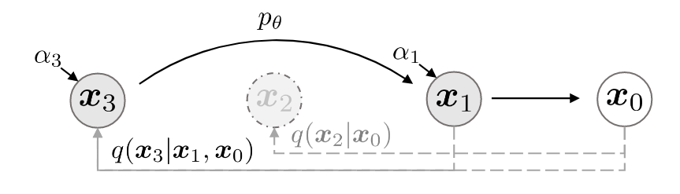
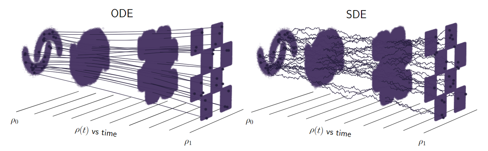
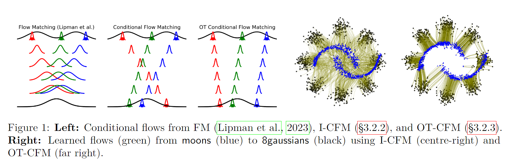
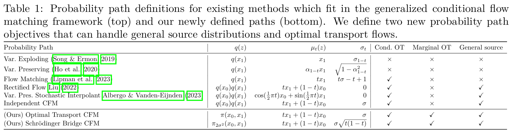

# A. Diffusion

## 1. DDPM

DDPM解读（一）| 数学基础，扩散与逆扩散过程和训练推理方法 - 卡卡猡特的文章 - 知乎
https://zhuanlan.zhihu.com/p/530602852

《Denoising Diffusion Probabilistic Models》https://arxiv.org/abs/2006.11239

### 1.1 数学基础

#### 1.1.1 先验概率与后验概率

直观理解：

**先验概率 (Prior)**：在看到数据之前，你对某件事的**原本相信程度**。

**后验概率 (Posterior)**：在看到数据之后，你根据**数据更新后的相信程度**。

------

举个例子：

比如你丢一枚硬币，事先不知道是不是公平的。

- 你**先验地认为**，硬币正反面各 50%（也可能觉得偏某一边）。

后来你丢了 100 次，结果正面出来了 80 次，这个数据很不对劲。

- 根据数据，你**更新你的相信**，硬币可能是偏向正面的一枚。

这个从 "50%" 更新到 "更偏向正面" 的过程，就是：

> **先验 →（看见数据）→ 后验**

------

数学推导：

设

- 事件 $A$ 是我们关心的（比如，"硬币是偏的"）
- 数据 $B$ 是我们观察到的（比如，"丢了100次，正面出了80次"）

那么：
$$
\text{后验概率} = \frac{\text{似然} \times \text{先验概率}}{\text{证据}}
$$
公式写成：
$$
P(A|B) = \frac{P(B|A) \times P(A)}{P(B)}
$$
其中：

- $P(A)$：**先验概率**，观察数据前对 $A$ 的主观相信
- $P(B|A)$：**似然（Likelihood）**，如果 $A$ 成立， $B$ 出现的可能性
- $P(B)$：**证据（Evidence）**，所有可能情况下数据 $B$ 出现的总体概率
- $P(A|B)$：**后验概率**，看过数据 $B$ 后，对 $A$ 的相信程度

| 名称       | 含义                                   |
| ---------- | -------------------------------------- |
| 先验概率   | 看到数据前的主观相信程度               |
| 似然       | 如果假设成立，观察到数据的可能性有多大 |
| 后验概率   | 看到数据后，新的相信程度               |
| 贝叶斯公式 | 后验 = 似然 × 先验 / 证据              |

> **似然函数和条件概率的区分**
>
> - 条件概率 是 “已知某个事件发生后，另一个事件发生的概率”；
>
> - 似然（Likelihood） 是 “在固定观察结果的情况下，不同参数值使这个结果发生的可能性有多大”。
>
> **似然函数是什么？**
>
> 似然看起来像概率，但语义不同。它是这样定义的：
> $$
> \mathcal{L}(θ∣x)=p_θ(x)
> $$
> 含义是：
>
> 已知数据 $x$，我们反过来看参数 $\theta$ 的“合理程度”有多大。
>
> - **概率**：固定参数，看数据出现的概率；
>
> - **似然**：固定数据，看哪个参数值更“合理”。
>
> 我们已知结果 $x$ ，但不知道参数 $\theta$ ，我们想通过这个结果估计 $\theta$ ，那么 $\mathcal{L}(θ∣x)$ 就是**似然函数**

#### 1.1.2 条件概率的一般形式

**定义**：
 如果你已经知道了事件 $B$ 发生，那么在这种条件下，事件 $A$ 发生的概率，叫做 **条件概率**。

数学上，记作：
$$
P(A|B)
$$
**公式是**：
$$
P(A|B) = \frac{P(A \cap B)}{P(B)}
\quad\quad \text{(前提是 } P(B) > 0\text{)}
$$

------

如果你有三个事件 $A$、$B$、$C$，那么：

1. **联合概率** $P(A, B, C)$ 表示
    → $A$、$B$、$C$ 三个**同时发生**的概率。
2. **条件概率的一般形式**可以写成：

$$
P(A, B, C) = P(A|B, C) \times P(B|C) \times P(C)
$$

也可以理解成：

> 联合概率可以被分解成一连串的条件概率相乘。

#### 1.1.3 马尔可夫链条件概率形式

> 马尔可夫链（**Markov Chain**）里，条件概率有个非常重要、特别简洁的形式。
> $$
> P(Xn+1∣Xn,Xn−1,…,X1)=P(Xn+1∣Xn)
> $$

马尔科夫链指当前状态的概率只与上一时刻有关，例如如满足马尔可夫关系 A→B→C ，ABC符合马尔可夫性质，那么我们可以用链式法则展开联合概 $P(A, B, C)$ :
$$
P(A,B,C)=P(A)⋅P(B∣A)⋅P(C∣B)
$$

> 马尔可夫链指当前状态的概率只与上一时刻有关，例如 $A \rightarrow B \rightarrow C$，那么有：
> $$
> P(C∣B,A)=P(C∣B)
> $$
> 马尔可夫性质。

#### 1.1.4 高斯分布的KL散度公式

设有两个一维高斯分布：

- $ p(x) = \mathcal{N}(\mu_p, \sigma_p^2) $

- $ q(x) = \mathcal{N}(\mu_q, \sigma_q^2) $

则 KL 散度 $ D_{\text{KL}}(p \,\|\, q) $ 的计算公式为：

$$
D_{\text{KL}}(p \,\|\, q) = \log\left( \frac{\sigma_q}{\sigma_p} \right) + \frac{\sigma_p^2 + (\mu_p - \mu_q)^2}{2\sigma_q^2} - \frac{1}{2}
$$
参数解释：

> 1. **第一项：**  $\log\left( \frac{\sigma_q}{\sigma_p} \right)$
>
>    反映两个分布在方差上的差异。
>
> 2. **第二项：**  $\frac{\sigma_p^2 + (\mu_p - \mu_q)^2}{2\sigma_q^2}$
>
>    包含：
>
>    - $\frac{\sigma_p^2}{2\sigma_q^2}$：分布宽度差异；
>    - $\frac{(\mu_p - \mu_q)^2}{2\sigma_q^2}$：均值之间的差异。
>
> 3. **第三项：**  $- \frac{1}{2}$
>
>    归一化常数，使散度为零时，代表两个分布完全相同。

特殊情况（均值相同）：

若 $\mu_p = \mu_q$，KL 散度简化为：

$$
D_{\text{KL}}(p \,\|\, q) = \log\left( \frac{\sigma_q}{\sigma_p} \right) + \frac{\sigma_p^2}{2\sigma_q^2} - \frac{1}{2}
$$
注：

- KL 散度 $ D_{\text{KL}}(p \,\|\, q) \geq 0 $，当且仅当 $ p = q $ 时取到 0；

- KL 散度是非对称的：
  $$
  D_{\text{KL}}(p \,\|\, q) \neq D_{\text{KL}}(q \,\|\, p)
  $$

#### 1.1.5 参数重整化（重参数技巧）

我们希望从一个高斯分布中采样：
$$
x \sim \mathcal{N}(\mu, \sigma^2)
$$
但由于采样操作不可导，无法直接用于反向传播。为了解决这个问题，我们使用重参数化技巧，将随机性转移到一个独立于模型参数的随机变量中。

**重参数化形式**

我们引入标准正态变量：
$$
z \sim \mathcal{N}(0, 1)
$$
然后构造采样变量：
$$
x = \mu + \sigma \cdot z
$$
这样，$ x $ 的分布为：
$$
x \sim \mathcal{N}(\mu, \sigma^2)
$$

这么做的好处：
- 将不可导的采样操作转化为可导的仿射变换；
- 使得模型在训练过程中可以使用反向传播更新 $ \mu $ 和 $ \sigma $；
- 是变分推断中训练 VAE（Variational Autoencoder）的关键技术。

**注意事项**

- 为保证正值，通常使用 $\log \sigma^2$ 表示，训练过程中实际预测的是 $\log \sigma^2$，然后用 $\exp(\frac{1}{2} \log \sigma^2)$ 计算 $\sigma$；

- 重参数化技巧仅适用于可以重参数化的分布（如高斯分布），对于离散分布则较为困难。

#### 1.1.5 变分法求泛函极值问题

设想一个问题：

> 我想找到一条曲线 $y(x)$，使得从 A 点到 B 点的路径长度最短。

路径长度是一个泛函（因为它取决于整条曲线 $y(x)$），求最短路径就等价于求一个泛函的最小值问题。

用传统的优化方法（对数字变量求导）不行，因为我们要优化的是一个函数 —— 这时候就要用变分法。

**变分问题的基本形式**

我们希望最小化（或最大化）如下泛函：
$$
J[y] = \int_a^b L(x, y(x), y'(x))\, dx
$$
其中：

- $y(x)$：未知的函数，我们要找的；
- $L(x, y, y')$：叫做拉格朗日函数（Lagrangian）；
- $y'(x)$：就是 $y(x)$ 的导数。

这就是变分法的经典形式，也叫第一类变分问题。

> 除此之外还有一些其他种类的变分问题
>
> #### 第二类变分问题（端点自由）
>
> **问题形式：**
> $$
> J[y] = \int_a^b L(x, y(x), y'(x)) \, dx
> $$
> 但这次我们不固定端点，即：
>
> - $y(a)$、$y(b)$ 是可变的（自由端点）。
>
> **额外条件：**
>
> 这会引入自然边界条件（natural boundary conditions）：
>
> 例如：
> $$
> \left. \frac{\partial L}{\partial y'} \right|_{x=a} = 0 \quad 或 \quad \left. \frac{\partial L}{\partial y'} \right|_{x=b} = 0
> $$
>
> #### 带约束的变分问题（等式约束）
>
> **问题形式：**
>
> 我们要极小化一个泛函 $J[y]$，但有**另一个泛函作为等式约束**：
> $$
> \text{极小化 } J[y] = \int_a^b L(x, y, y')\, dx \quad \text{约束：} K[y] = \int_a^b G(x, y, y')\, dx = c
> $$
> **求解工具：**
>
> - 拉格朗日乘子法（在函数空间中）；
> - 构造新的泛函：
>
> $$
> J^*[y] = J[y] + \lambda (K[y] - c)
> $$
>
> 然后对 $J^*[y]$ 应用欧拉-拉格朗日方程。
>
> #### 多变量函数变分问题
>
> 求极值函数不再是 $y(x)$，而是函数 $u(x, y)$，例如：
> $$
> J[u] = \iint_\Omega L(x, y, u, u_x, u_y)\, dxdy
> $$
> 对应的欧拉-拉格朗日方程变为偏微分方程：
> $$
> \frac{\partial L}{\partial u} - \frac{\partial}{\partial x} \left( \frac{\partial L}{\partial u_x} \right) - \frac{\partial}{\partial y} \left( \frac{\partial L}{\partial u_y} \right) = 0
> $$
>
> #### 高阶变分问题（含高阶导数）
>
> 如果泛函包含二阶、三阶导数，如：
> $$
> J[y] = \int_a^b L(x, y, y', y'', \ldots, y^{(n)})\, dx
> $$
> 那么欧拉-拉格朗日方程也会扩展为高阶形式：
> $$
> \sum_{k=0}^n (-1)^k \frac{d^k}{dx^k} \left( \frac{\partial L}{\partial y^{(k)}} \right) = 0
> $$
>
> #### 最优控制类变分问题
>
> 如：庞特里亚金极大值原理
>
> 泛函目标：
> $$
> J[u] = \int_0^T L(x(t), u(t), t)\, dt + \Phi(x(T))
> $$
>
> - 状态变量 $x(t)$，控制变量 $u(t)$；
> - 状态受微分方程约束：$\dot{x} = f(x, u, t)$。
>
> 这种属于控制论的变分问题，一般通过哈密顿函数和协态方程来解。

**欧拉-拉格朗日方程：变分的核心工具**

我们怎么求解这样的极值问题呢？
变分法的关键一步是推导出：

> 若函数 $y(x)$ 是泛函 $J[y]$ 的极值解，则它必须满足**欧拉-拉格朗日方程**：

$$
\frac{\partial L}{\partial y} - \frac{d}{dx} \left( \frac{\partial L}{\partial y'} \right) = 0
$$

这个方程是一个二阶常微分方程。我们可以像解普通微分方程一样解它，就能得到最优函数 $y(x)$。

> 其中：
>
> | 符号                                                         | 含义                                                       |
> | ------------------------------------------------------------ | ---------------------------------------------------------- |
> | $x$                                                          | 自变量（比如时间、空间坐标）                               |
> | $y(x)$                                                       | 要求解的未知函数（比如轨迹、路径、物理场）                 |
> | $y'(x) = \frac{dy}{dx}$                                      | 函数 $y(x)$ 对 $x$ 的导数（即斜率）                        |
> | $L(x, y, y')$                                                | 被积函数，称为**拉格朗日函数**，依赖于 $x$、$y$、$y'$ 三者 |
> | $\frac{\partial L}{\partial y}$                              | 对 $y$ 的偏导，表示 L 对函数值的敏感程度                   |
> | $\frac{\partial L}{\partial y'}$                             | 对导数 $y'$ 的偏导，表示 L 对斜率的敏感程度                |
> | $\frac{d}{dx} \left( \frac{\partial L}{\partial y'} \right)$ | 先求偏导，再对 $x$ 求导，是一个“复合导数”                  |

#### 1.1.6 期望形式与积分形式的转换

对于一个连续型随机变量 $X$，如果它的概率密度函数（PDF）为 $f_X(x)$，那么：

- 期望（数学期望）定义为：

$$
\mathbb{E}[X] = \int_{-\infty}^{+\infty} x f_X(x) \, dx
$$

- 对于函数 $g(X)$ 的期望：

$$
\mathbb{E}[g(X)] = \int_{-\infty}^{+\infty} g(x) f_X(x) \, dx
$$

### 1.2 DDPM模型

#### 1.2.1 模型总览

DDPM，全称 **Denoising Diffusion Probabilistic Model**，是一种基于**马尔可夫链的生成模型**。

DDPM模型主要分为两个过程：forward加噪过程（从右往左）和reverse去噪过程（从左往右）。

模型通过逐步添加噪声和反向去噪学习数据分布。

#### 1.2.2 Diffusion前向过程

**逐步加噪过程**

给定初始数据分布 $q(x_0)$（例如图像分布），我们定义一个前向扩散过程，在这个过程中逐步向数据中添加高斯噪声，使得原始数据在 $T$ 步之后几乎退化成各向同性高斯分布。

在这个持续 $T$ 次的加噪过程中，我们会产生一系列带噪声的图片 $x_1, ..., x_T$ 。在这个过程中，噪声的标准差/方差是以一个在区间 (0,1) 内的固定值 $β_T$ 来确定的，均值是以固定值 $β_T$ 和当前时刻的图片数据 $x_{t−1}$ 来确定的。

**加噪过程定义**

对于 $t = 1, 2, ..., T$，我们定义马尔可夫过程：

$$
q(x_t | x_{t-1}) = \mathcal{N}(x_t; \sqrt{1 - \beta_t} x_{t-1}, \beta_t I)
$$
其中：

- $\beta_t \in (0, 1)$ 是一个预设的固定方差调度表（称为 noise schedule），通常线性或余弦方式递增；
- $\sqrt{1 - \beta_t}$ 是该步的缩放因子。

> **加噪过程的另一种表示**
>
> 每一步的加噪过程如下：
>
> $$
> q(x_t | x_0) = \mathcal{N}(x_t; \sqrt{\bar{\alpha}_t} x_0, (1 - \bar{\alpha}_t) I)
> $$
>
> $$
> \bar{\alpha}_t = \prod_{i=1}^T (1 - \beta_i)
> $$
>
> $$
> \alpha_t = 1- \beta_t
> $$
>
> 
>
> - 这是一个高斯分布，其 **均值** 为 $\sqrt{\bar{\alpha}_t} x_0$，**方差** 为 $1 - \bar{\alpha}_t$；
> - 其中 $\bar{\alpha}_t = \prod_{i=1}^T (1 - \beta_i)$ 是噪声衰减因子；
> - 因为 $\beta_t$ 是预定义的 schedule，所以 $\bar{\alpha}_t$ 也是固定的；
> - 因此，这个分布完全由 $x_0$ 和 $t$ 决定 —— 无需学习，**不是模型的一部分**。

**加噪结果**

随着 $t$ 的不断增大，最终原始数据 $x_0$ 会逐步失去它的特征。最终当 $T→∞$ 时， $x_T$ 趋近于一个各向独立的高斯分布。从视觉上来看，就是将原本一张完好的照片加噪很多步后，图片几乎变成了一张完全是噪声的图片。

**任意时刻数据 $X_t$ 的计算（参数重整化技巧）**

在前向扩散过程中，虽然 $x_t$ 是通过从 $x_{t-1}$ 不断加噪得到的，但我们其实可以跳过中间所有步骤，直接从 $x_0$ 和固定值序列 $\{β_T∈(0,1)\}_{t=1}^T $ 计算得到任意时刻 $x_t$ 

我们首先定义:
$$
\alpha_t = 1 - \beta_t
$$

$$
\bar{\alpha}_t = \prod_{i=1}^t \alpha_i = \prod_{i=1}^t (1 - \beta_i)
$$

我们可以直接通过下式采样得到某一时刻 $t$ 的带噪图像 $x_t$：
$$
x_t = \sqrt{\bar{\alpha}_t} x_0 + \sqrt{1 - \bar{\alpha}_t} \, \epsilon,\quad \epsilon \sim \mathcal{N}(0, \mathbf{I})
$$
推导步骤：

> 我们希望从以下马尔可夫链定义的前向过程：
>
> $$
> q(x_t | x_{t-1}) = \mathcal{N}(x_t; \sqrt{\alpha_t} x_{t-1}, (1 - \alpha_t) \mathbf{I})
> $$
>
> 推导出：
>
> $$
> x_t = \sqrt{\bar{\alpha}_t} x_0 + \sqrt{1 - \bar{\alpha}_t} \epsilon,\quad \epsilon \sim \mathcal{N}(0, \mathbf{I})
> $$
>
> 其中：
>
> - $\bar{\alpha}_t = \prod_{i=1}^t \alpha_i$
>
> 
>
> **推导过程**
>
> 首先，从一步扩散定义：
> $$
> x_t = \sqrt{\alpha_t} x_{t-1} + \sqrt{1 - \alpha_t} \epsilon_t,\quad \epsilon_t \sim \mathcal{N}(0, \mathbf{I})
> $$
>
> 这表示 $x_t$ 是上一步 $x_{t-1}$ 的缩放加上独立高斯噪声的结果。
>
> 展开两步（将 $x_{t-1}$ 用 $x_{t-2}$ 表示）：
> $$
> x_{t-1} = \sqrt{\alpha_{t-1}} x_{t-2} + \sqrt{1 - \alpha_{t-1}} \epsilon_{t-1}
> $$
>
> 代入 $x_t$ 的公式中得到：
>
> $$
> x_t = \sqrt{\alpha_t} \left( \sqrt{\alpha_{t-1}} x_{t-2} + \sqrt{1 - \alpha_{t-1}} \epsilon_{t-1} \right) + \sqrt{1 - \alpha_t} \epsilon_t
> $$
>
> 继续展开并整理：
>
> $$
> x_t = \sqrt{\alpha_t \alpha_{t-1}} x_{t-2} + \sqrt{1-\alpha_t \alpha_{t-1}} \bar\epsilon,\quad ϵ∼N(0,I)\quad(*)
> $$
>
> 你可以看到，每次展开我们都得到一个 $x_0$ 的缩放加上一系列噪声项的线性组合。
>
> 
>
> > **关键技巧** $(*)$ :
> >
> > 这里使用了一个关键技巧，在 Diffusion 模型中常用于将**多步高斯噪声组合**成**一步标准高斯噪声**的形式，也叫**参数重整化**。
> >
> > 当我们合并两个均值都为 0，方差分别为 $\sigma_1^2$ 和 $\sigma_2^2$ 的高斯分布 $\mathcal{N}(0, \sigma_1^2 I)$ 和 $\mathcal{N}(0, \sigma_2^2 I)$ 时，我们得到的新的高斯分布为：
> > $$
> > \sqrt{\alpha_t - \alpha_t \alpha_{t-1}} z_{t-2} + \sqrt{1 - \alpha_t} z_{t-1}, \quad Z_{t-1},Z_{t-2}∼N(0,I)
> > $$
> > 因此可以通过参数重整化，变成只含一个随机变量 $z$ 构成的：
> > $$
> > \sqrt{1 - \bar{\alpha}_t} \cdot \bar{z},\quad Z∼N(0,I)
> > $$
> > 的形式。
> >
> > 
> >
> > 这里使用了高斯变量的加法性质，假设我们有：
> > $$
> > z=aϵ_1+bϵ_2, \quad ϵ_1,ϵ_2∼N(0,I),独立
> > $$
> > 那么我们可以把它写成：
> > $$
> > z= \sqrt{a^2+b^2}⋅ϵ, \quad ϵ∼N(0,I)
> > $$
>
> 
>
> 继续递推 $t$ 次，可以得到一个形式：
>
> 继续这样递推下去 $t$ 次，可以得到一个形式：
>
> $$
> x_t = \sqrt{\prod_{i=1}^t \alpha_i} \cdot x_0 + \sum_{i=1}^t \text{噪声项}
> $$
>
> 通过定义：
>
> $$
> \bar{\alpha}_t = \prod_{i=1}^t \alpha_i
> $$
> 我们得到：
> $$
> x_t = \sqrt{\bar{\alpha}_t} x_0 + \sqrt{1 - \bar{\alpha}_t} \epsilon,\quad \epsilon \sim \mathcal{N}(0, \mathbf{I})
> $$
>
> 这里的 $\epsilon$ 是一系列高斯噪声线性组合后的结果。由于线性组合仍是高斯分布，它等价于一个新的标准正态随机变量。
>
> 
>
> **结论：**
>
> 最终我们推导出：
> $$
> x_t = \sqrt{\bar{\alpha}_t} x_0 + \sqrt{1 - \bar{\alpha}_t} \epsilon,\quad \epsilon \sim \mathcal{N}(0, \mathbf{I})
> $$
>
> 该公式允许我们跳过逐步采样过程，直接从 $x_0$ 构造出 $x_t$ 。这意味着我们**不需要一步一步模拟 $x_1 \to x_2 \to \dots \to x_t$ 的过程**，只需要用初始图像 $x_0$ 和随机噪声 $\epsilon$ 即可直接生成任意时间步的 $x_t$ 。
>
> 这一步是训练阶段的关键，它使得我们可以构造任意时间步的训练样本 $x_t$ 来训练一个模型预测 $\epsilon$ 。

因此，由公式：

$$
x_t = \sqrt{\bar{\alpha}_t} x_0 + \sqrt{1 - \bar{\alpha}_t} \epsilon,\quad \epsilon \sim \mathcal{N}(0, \mathbf{I})
$$

可以看出，只要我们：

- 拥有初始图像或数据 \( x_0 \)；
- 知道固定的噪声调度表（即一组在区间 \( (0, 1) \) 内的预设值）：
  $$
  \{ \beta_t \}_{t=1}^T,\quad \alpha_t = 1 - \beta_t,\quad \bar{\alpha}_t = \prod_{i=1}^t \alpha_i
  $$
- 再从标准正态分布 $ \mathcal{N}(0, \mathbf{I}) $ 中采样一个噪声变量 $ \epsilon $；

就可以**直接计算出任意时间步 $ t $ 的加噪结果 $ x_t $**，而无需从 $ x_0 \to x_1 \to x_2 \to \dots \to x_t $ 一步步迭代。

这就是扩散模型中前向加噪过程的高效之处：虽然物理过程是马尔可夫链，但数值计算上我们可以跳步（skip steps），一步直接得出任意时刻的状态。

 **$β$ 序列与 $ᾱ$ 序列的单调性关系说明**

在扩散模型中，前向扩散过程采用高斯噪声不断扰动数据。在这一过程中，每一步的噪声强度由参数 $\beta_t$ 控制。

我们通常会选取一个单调递增的 $\beta_t$ 序列：

$$
0 < \beta_1 < \beta_2 < \cdots < \beta_T < 1
$$

- 这样设计的动机是：随着扩散步数 $t$ 的增大，图像中加入的噪声逐步增多，因此 $\beta_t$ 应该随时间增长，使得图像逐渐变为纯噪声。

我们定义：

$$
\alpha_t = 1 - \beta_t
$$

显然，$\alpha_t \in (0,1)$ 且也是单调递减的。

接着我们引入累积乘积项：

$$
\bar{\alpha}_t = \prod_{i=1}^t \alpha_i
$$

因为每个 $\alpha_i \in (0,1)$，所以 $\bar{\alpha}_t$ 会 随 $t$ 增大而逐渐减小：

$$
\bar{\alpha}_1 > \bar{\alpha}_2 > \cdots > \bar{\alpha}_T
$$

总结：

- $\beta_t$ 随时间增长，表示噪声比例增加；
- $\alpha_t = 1 - \beta_t$ 随时间减小；
- $\bar{\alpha}_t = \prod_{i=1}^t \alpha_i$ 也随时间单调减小。

这种设计保证了：
- 早期的图像保留更多原始信息；
- 后期的图像则接近完全高斯噪声。

#### 1.2.3 Reverse Diffusion逆向过程

##### a. 逆扩散过程近似模型 $p_θ$

如果我们能将上述过程转换方向，即从 $q(x_{t−1}|x_t)$ 中采样，那么我们就可以从一个随机的高斯分布 $N(0,I)$ 中重建出一个真实的原始样本，也就是从一个完全杂乱无章的噪声图片中得到一张真实图片。

但是，由于需要从完整数据集中找到数据分布，我们没办法很简单地预测 $q(x_{t−1}|x_t)$ ，因此我们需要学习一个模型 $p_θ$ 来近似模拟这个条件概率，从而运行逆扩散过程。

如果我们能学习逆过程：

$$
q(x_{t-1} \mid x_t)
$$

那么我们就可以从完全的噪声 $x_T \sim \mathcal{N}(0, \mathbf{I})$ 开始，通过一系列“去噪”步骤，逐步重建出原始的图像 $x_0$。

------

前向过程 $q(x_t \mid x_{t-1})$ 是已知的高斯扰动；

逆向过程 $q(x_{t-1} \mid x_t)$ 难以直接求解；

我们用神经网络 $p_\theta(x_{t-1} \mid x_t)$ 来近似它，从而实现从噪声到真实图像的生成建模。
$$
p_\theta(\mathbf{x}_{0:T}) = p(\mathbf{x}_T) \prod_{t=1}^T p_\theta(\mathbf{x}_{t-1} \mid \mathbf{x}_t)
$$

> **解释：**
>
> - $\mathbf{x}_{0:T}$ 表示从原始图像 $\mathbf{x}_0$ 到最终噪声图像 $\mathbf{x}_T$ 的整个序列。
> - $p(\mathbf{x}_T)$ 是在最终扩散步骤 $T$ 时，图像的先验分布，通常设为标准高斯分布 $\mathcal{N}(0, \mathbf{I})$。
> - $p_\theta(\mathbf{x}_{t-1} \mid \mathbf{x}_t)$ 是神经网络学习得到的近似逆过程的条件概率，表示如何从 $\mathbf{x}_t$ 还原出 $\mathbf{x}_{t-1}$。
> - 整个逆过程由 $T$ 个步骤组成，每一步都是一个高斯采样过程。

$$
p_\theta(\mathbf{x}_{t-1} \mid \mathbf{x}_t) = \mathcal{N}\left( \mathbf{x}_{t-1}; \mu_\theta(\mathbf{x}_t, t), \Sigma_\theta(\mathbf{x}_t, t) \right)
$$

> **解释：**
>
> - 我们假设从 $\mathbf{x}_t$ 到 $\mathbf{x}_{t-1}$ 的条件概率是一个高斯分布。
> - $\mu_\theta(\mathbf{x}_t, t)$ 是模型输出的均值，表示从 $\mathbf{x}_t$ 预测出的最可能的前一步图像。
> - $\Sigma_\theta(\mathbf{x}_t, t)$ 是预测的协方差矩阵，通常简化为对角阵，甚至是固定值（比如 $\sigma_t^2 \mathbf{I}$），代表预测不确定性。
> - 通过训练模型来尽可能地让这个条件分布 $p_\theta$ 逼近真实的后验分布 $q(\mathbf{x}_{t-1} \mid \mathbf{x}_t)$。

##### b. 后验扩散条件概率 $q(\mathbf{x}_{t-1} \mid \mathbf{x}_t, \mathbf{x}_0)$

在逆扩散过程中，如果我们给定了 $x_t$ 和 $x_0$ ,那么我们是可以计算出 $x_{t−1}$ 的，即后验扩散条件概率 $q(x_{t−1}|x_t,x_0)$ 是可以计算的。注意，这与直接用 $ q(x_{t-1} | x_t) $ 不同，因为我们无法在仅依赖于当前的噪声状态 $ x_t $ 就推断出 $q(x_{t−1}|x_t,x_0)$。

我们可以将后验扩散条件概率 $ q(x_{t-1} | x_t, x_0) $ 表达为以下的形式：
$$
q(x_{t-1} | x_t, x_0) = \mathcal{N}\left(x_{t-1} ; \tilde\mu_{t-1}(x_t, x_0), \tilde\beta_t \mathbf{I}\right)
$$

> **解释：**
>
> - $ q(x_{t-1} \mid x_t, x_0) $：表示在已知当前噪声状态 $ x_t $ 和原始图像 $ x_0 $ 的前提下，前一时刻状态 $ x_{t-1} $ 的**后验分布**。
> - 该分布是一个**高斯分布**，其：
>   - 均值为 $ \tilde\mu_{t-1}(x_t, x_0) $
>   - 协方差为 $ \tilde\beta_t \mathbf{I} $
>
> 这是一个**可解析的闭式解**，不需要模型学习，直接由前向过程的噪声调度参数推导而来
>

使用贝叶斯公式可以得到：

在扩散模型中，已知当前状态 $ x_t $ 和原始图像 $ x_0 $，我们可以使用贝叶斯公式来推导出后验分布：

$$
q(x_{t-1} \mid x_t, x_0) = q(x_t \mid x_{t-1}) \cdot \frac{ q(x_{t-1} \mid x_0)}{q(x_t \mid x_0)}
$$

> 注意：上式在马尔可夫扩散模型中 $x_t$ **只依赖** $x_{t-1}$，与 $x_0$ 条件独立（因为前向过程是马尔可夫链）；
>
> 所以 $q(x_t \mid x_{t-1}, x_0) = q(x_t \mid x_{t-1})$

其中每一项都是一个高斯分布：

- $q(x_t \mid x_{t-1}) $：前向过程的一步高斯扰动：
  $$
  q(x_t \mid x_{t-1}) = \mathcal{N}(x_t; \sqrt{1 - \beta_t} x_{t-1}, \beta_t \mathbf{I})
  $$

- $ q(x_{t-1} \mid x_0) $：前向过程的马尔可夫链的一部分，可以从 $ x_0 $ 直接采样出任意中间状态：
  $$
  q(x_{t-1} \mid x_0) = \mathcal{N}(x_{t-1}; \sqrt{\bar\alpha_{t-1}} x_0, (1 - \bar\alpha_{t-1}) \mathbf{I})
  $$

- $ q(x_t \mid x_0) $：类似地，可以从 $ x_0 $ 直接得到：
  $$
  q(x_t \mid x_0) = \mathcal{N}(x_t; \sqrt{\bar\alpha_t} x_0, (1 - \bar\alpha_t) \mathbf{I})
  $$

> 现在我们要计算：
> $$
> q(x_{t-1} \mid x_t, x_0) = q(x_t \mid x_{t-1}) \cdot \frac{ q(x_{t-1} \mid x_0)}{q(x_t \mid x_0)}
> $$
> 每一个高斯分布都可以写成如下形式：
> $$
> \mathcal{N}(x; \mu, \sigma^2 \mathbf{I}) = \frac{1}{Z} \exp\left(-\frac{1}{2\sigma^2} \|x - \mu\|^2\right)
> $$

我们将上面三个项都写成指数形式（写出三个项的负指数项，忽略常数）：

其中第一项 **$q(x_t \mid x_{t-1})$**:
$$
\exp\left( -\frac{1}{2(1 - \alpha_t)} \|x_t - \sqrt{\alpha_t} x_{t-1} \|^2 \right)
$$
其中第二项 **$q(x_{t-1} \mid x_0)$**:

$$
\exp\left( -\frac{1}{2(1 - \bar{\alpha}_{t-1})} \|x_{t-1} - \sqrt{\bar{\alpha}_{t-1}} x_0 \|^2 \right)
$$
其中第三项 **$q(x_t \mid x_0)$** （这是分母，带负号）:

$$
\exp\left( +\frac{1}{2(1 - \bar{\alpha}_t)} \|x_t - \sqrt{\bar{\alpha}_t} x_0 \|^2 \right)
$$
现在，我们的目标是得到关于 $x_{t-1}$ 的分布，只有第1项和第2项中出现了 $x_{t-1}$ （第三项在后续推导中不会显示写出来，它是归一化常数，不影响高斯的形式）。根据贝叶斯规则（可看作条件高斯分布的推导）：
$$
q(x_{t-1} \mid x_t, x_0) \propto q(x_t \mid x_{t-1}) \cdot q(x_{t-1} \mid x_0)
$$

> 其中我们把右边的乘积 $q(x_t \mid x_{t-1}) \cdot q(x_{t-1} \mid x_0)$ 被当成一个**未归一化的概率密度函数**，然后通过归一化使其总和为1，这样就变成了一个合法的概率分布。
> 
>
> > **为什么 $q(x_t \mid x_{t-1}) \cdot q(x_{t-1} \mid x_0)$ 被当成一个未归一化的概率密度函数？**
> >
> > 它是两个高斯密度函数的乘积，关于 $x_{t-1}$ 的函数。
> >
> > - 这个乘积不一定积分为1（可能大于或小于1），所以它不是合法概率密度函数（缺少归一化）；
> > - 但它的函数形式依然是一个**关于 $x_{t-1}$ 的高斯函数的形式（未归一化）**；
> > - 为了让它成为合法的概率密度函数，我们除以归一化常数 $q(x_t \mid x_0)$，让积分变成1
> >
> > (乘积给了我们**后验的“形状”**，归一化常数保证它是个真正的概率分布)
>
> 
>
> 而归一化的常数正好就是 $q(x_t \mid x_0)$，即：
> $$
> q(x_t ∣x_0)=∫q(x_t∣x_{t−1})⋅q(x_{t−1}∣x_0)dx_{t−1}
> $$
> 所以：
> $$
> q(x_{t-1} \mid x_t, x_0) = \frac{
>     q(x_t \mid x_{t-1}) \cdot q(x_{t-1} \mid x_0)
> }{
>     q(x_t \mid x_0)
> }
> = \frac{
>     q(x_t \mid x_{t-1}) \cdot q(x_{t-1} \mid x_0)
> }{
>     \int q(x_t \mid x_{t-1}) \cdot q(x_{t-1} \mid x_0) \, dx_{t-1}
> }
> = \text{归一化的乘积}
> $$
> 
>
> > **为什么 $q(x_t \mid x_0)$ 是归一化常数？**
> >
> > 上式分母：
> >
> > $$
> > q(x_t \mid x_0) = \int q(x_t \mid x_{t-1}) \, q(x_{t-1} \mid x_0) \, dx_{t-1}
> > $$
> >
> > 是对所有可能的 $ x_{t-1} $ 积分得到的，保证右边的分布对 $ x_{t-1} $ 归一化（即积分为1）。
> >
> > 换句话说，分母是一个 **标量值**，不依赖于 $ x_{t-1} $，它负责保证分子所定义的函数（关于 $ x_{t-1} $）是个合法的概率密度函数。
>
> 
>
> 而当我们推导具体形式（比如均值和方差）时：
>
> 由于高斯的乘积结果形式 **不依赖归一化常数**，我们就只计算了：
> $$
> 一个关于 x_{t−1} 的未归一化高斯密度函数 ∝ exp(−Q(x_{t−1}))
> $$
> 
>
> > **为什么归一化常数不影响高斯形式？**
> >
> > 高斯分布的概率密度函数形式是：
> >
> > $$
> > \mathcal{N}(x; \mu, \Sigma) = \frac{1}{(2\pi)^{d/2} |\Sigma|^{1/2}} \exp\left( -\frac{1}{2} (x - \mu)^T \Sigma^{-1} (x - \mu) \right)
> > $$
> >
> > - 归一化常数是开头的那部分（包含 $ (2\pi)^d $ 和 $ |\Sigma| $）；
> > - 指数部分控制了高斯的“形状”，即均值 $ \mu $ 和协方差矩阵 $ \Sigma $；
> >
> > ---
> >
> > 在推导后验时，我们先只关注**指数部分**，把它写成关于 $ x_{t-1} $ 的二次函数，然后通过配方（完成平方）得到新的均值和协方差矩阵。
> >
> > 归一化常数只是调整整体的“高度”，不会改变这个指数的结构，因而不会影响“是哪个均值、哪个方差的高斯”。
>
> 
>
> 并直接得到结果是一个新的高斯分布。
>
> 所以我们只用乘积那两项就可以**正确恢复一个高斯分布的形式**，而**第三项只是归一化常数，可以省略不写**。

我们带入第1项和第2项两个高斯分布后，得到：
$$
q(x_{t-1} \mid x_t, x_0) \propto 
\exp\left(
- \frac{1}{2\beta_t} \left\| x_t - \sqrt{\alpha_t} x_{t-1} \right\|^2
\right)
\cdot
\exp\left(
- \frac{1}{2(1 - \bar{\alpha}_{t-1})} \left\| x_{t-1} - \sqrt{\bar{\alpha}_{t-1}} x_0 \right\|^2
\right)
$$
合并两个指数项：
$$
q(x_{t-1} \mid x_t, x_0) \propto 
\exp\left(
- \frac{1}{2\beta_t} \left\| x_t - \sqrt{\alpha_t} x_{t-1} \right\|^2
- \frac{1}{2(1 - \bar{\alpha}_{t-1})} \left\| x_{t-1} - \sqrt{\bar{\alpha}_{t-1}} x_0 \right\|^2
\right)
$$
这是一个关于 $x_{t-1}$ 的二次函数指数项，所以它仍然是一个**高斯分布**！
现在我们将其合并成一个高斯（两高斯乘法）：

> 高斯乘积公式：
>
> - 协方差：
> $$
> \tilde{\Sigma} = \left( \Sigma_1^{-1} + \Sigma_2^{-1} \right)^{-1}
> $$
>
> - 均值：
>
> $$
> \tilde{\mu} = \tilde{\Sigma} \left( \Sigma_1^{-1} \mu_1 + \Sigma_2^{-1} \mu_2 \right)
> $$
>

那么两个高斯分布，记：

- $Σ_1=β_tI$, $\mu_1 = \frac{x_t}{\sqrt{\alpha_t}}$

- $Σ_2=(1−αˉ_{t−1})I$, $\mu_2 = \sqrt{\bar\alpha_{t-1}} x_0$

根据高斯分布乘法的协方差推导公式，我们可以得到：

$$
\tilde{\beta}_t 
= \left( \frac{1}{\beta_t} + \frac{1}{1 - \bar{\alpha}_{t-1}} \right)^{-1}
= \frac{(1 - \bar{\alpha}_{t-1}) \beta_t}{(1 - \bar{\alpha}_{t-1}) + \beta_t}
\approx \frac{(1 - \bar{\alpha}_{t-1}) \beta_t}{1 - \bar{\alpha}_t}
$$

> 其中近似是因为：
>
> $$
> \bar{\alpha}_t = \alpha_t \cdot \bar{\alpha}_{t-1}
> \Rightarrow 1 - \bar{\alpha}_t = 1 - \alpha_t \bar{\alpha}_{t-1} \approx 1 - \bar{\alpha}_{t-1} + \beta_t
> $$
>
> 则：
>
> $$
> \frac{(1 - \bar{\alpha}_{t-1}) \beta_t}{(1 - \bar{\alpha}_{t-1}) + \beta_t}
> \approx \frac{(1 - \bar{\alpha}_{t-1}) \beta_t}{1 - \bar{\alpha}_t}
> $$

因此，最终我们可以推导得到：
$$
q(x_{t-1} \mid x_t, x_0) = \mathcal{N}\left(x_{t-1}; \tilde\mu_{t}(x_t, x_0), \tilde\beta_t \mathbf{I} \right)
$$

$$
\tilde\mu_{t}(x_t, x_0) = \frac{\sqrt{\bar\alpha_{t-1}} \beta_t}{1 - \bar\alpha_t} x_0 + \frac{\sqrt{\alpha_t}(1 - \bar\alpha_{t-1})}{1 - \bar\alpha_t} x_t
$$

$$
\tilde\beta_t = \frac{1 - \bar\alpha_{t-1}}{1 - \bar\alpha_t} \beta_t
$$

> 其中：
>
> - 均值 $ \tilde\mu_{t}(x_t, x_0) $
>
> - 方差 $\tilde\beta_t$
>
>
> 该公式说明：
>
> - 后验分布 $ q(x_{t-1} \mid x_t, x_0) $ 是一个已知参数的高斯分布；
> - 可由贝叶斯公式结合前向过程的联合概率推导得到；
> - 是训练过程中用于监督模型预测的核心工具。

由前面Forward前向过程我们推导得到的 $x_0$ 和 $x_t$ 的关系，我们有：
$$
x_t = \sqrt{\bar{\alpha}_t} x_0 + \sqrt{1 - \bar{\alpha}_t} \, \epsilon,\quad \epsilon \sim \mathcal{N}(0, \mathbf{I})
$$

$$
x_0 = \frac{1}{ \sqrt{\bar{\alpha}_t} }(x_t - \sqrt{1-\bar{\alpha}_t}) \, \epsilon,\quad \epsilon \sim \mathcal{N}(0, \mathbf{I})
$$

由上式后验均值：
$$
\tilde\mu_{t}(x_t, x_0) = \frac{\sqrt{\bar\alpha_{t-1}} \beta_t}{1 - \bar\alpha_t} x_0 + \frac{\sqrt{\alpha_t}(1 - \bar\alpha_{t-1})}{1 - \bar\alpha_t} x_t
$$
把 $x_0$ 代入得到：
$$
\tilde\mu_{t}(x_t, \epsilon) = \frac{\sqrt{\bar\alpha_{t-1}} \beta_t}{1 - \bar\alpha_t} \cdot \frac{1}{\sqrt{\bar{\alpha}_t}} \left(x_t - \sqrt{1-\bar{\alpha}_t} \epsilon \right) + \frac{\sqrt{\alpha_t}(1 - \bar\alpha_{t-1})}{1 - \bar\alpha_t} x_t
$$
合并得到：
$$
\tilde{\mu}_{t}(x_t, \epsilon) =\left( \frac{\sqrt{\bar{\alpha}_{t-1}} \beta_t}{(1 - \bar{\alpha}_t) \sqrt{\bar{\alpha}_t}} + \frac{\sqrt{\alpha_t}(1 - \bar{\alpha}_{t-1})}{1 - \bar{\alpha}_t} \right) x_t 
 - \frac{\sqrt{\bar{\alpha}_{t-1}} \beta_t \sqrt{1 - \bar{\alpha}_t}}{(1 - \bar{\alpha}_t) \sqrt{\bar{\alpha}_t}} \epsilon
$$

> 上式推导 $\tilde{\mu}_t(x_t, \epsilon)$ 的简洁形式
>
> 将 $\sqrt{\alpha_t} = \dfrac{\sqrt{\bar{\alpha}_t}}{\sqrt{\bar{\alpha}_{t-1}}}$ 代入第二项：
> $$
> = \left( \frac{\sqrt{\bar{\alpha}_{t-1}} \beta_t}{(1 - \bar{\alpha}_t)\sqrt{\bar{\alpha}_t}} + \frac{ \frac{\sqrt{\bar{\alpha}_t}}{\sqrt{\bar{\alpha}_{t-1}}}(1 - \bar{\alpha}_{t-1}) }{1 - \bar{\alpha}_t} \right) x_t 
> - \frac{\sqrt{\bar{\alpha}_{t-1}} \beta_t \sqrt{1 - \bar{\alpha}_t}}{(1 - \bar{\alpha}_t)\sqrt{\bar{\alpha}_t}} \epsilon
> $$
> 通分并合并 $x_t$ 系数项，得到：
> $$
> = \left(
> \frac{ \beta_t \bar{\alpha}_{t-1} + \bar{\alpha}_t(1 - \bar{\alpha}_{t-1}) }{(1 - \bar{\alpha}_t)\sqrt{\bar{\alpha}_t}\sqrt{\bar{\alpha}_{t-1}}}
> \right) x_t
> - \frac{\sqrt{\bar{\alpha}_{t-1}} \beta_t \sqrt{1 - \bar{\alpha}_t}}{(1 - \bar{\alpha}_t)\sqrt{\bar{\alpha}_t}} \epsilon
> $$
> 注意 $\bar{\alpha}_t = \bar{\alpha}_{t-1}(1 - \beta_t)$，因此：
> $$
> \beta_t \bar{\alpha}_{t-1} + \bar{\alpha}_t(1 - \bar{\alpha}_{t-1})
> = \bar{\alpha}_{t-1} \beta_t + \bar{\alpha}_{t-1}(1 - \beta_t)(1 - \bar{\alpha}_{t-1})
> $$
> 展开化简得：！！！！！！！！！！！！！！！！！！！！！！！！！！！！！！！！！！！！！
> $$
> = \bar{\alpha}_{t-1} - \bar{\alpha}_t
> $$
> 代入回去：
> $$
> \tilde{\mu}_t(x_t, \epsilon)
> = \frac{\bar{\alpha}_{t-1} - \bar{\alpha}_t}{(1 - \bar{\alpha}_t)\sqrt{\bar{\alpha}_t}\sqrt{\bar{\alpha}_{t-1}}} x_t 
> - \frac{\sqrt{\bar{\alpha}_{t-1}} \beta_t \sqrt{1 - \bar{\alpha}_t}}{(1 - \bar{\alpha}_t)\sqrt{\bar{\alpha}_t}} \epsilon
> $$
> 又因为：
> $$
> \bar{\alpha}_{t-1} - \bar{\alpha}_t = \bar{\alpha}_{t-1} \beta_t
> $$
> 因此：
> $$
> \tilde{\mu}_t(x_t, \epsilon)
> = \frac{ \sqrt{\bar{\alpha}_{t-1}} \beta_t }{ (1 - \bar{\alpha}_t)\sqrt{\bar{\alpha}_t} } x_t 
> - \frac{\sqrt{\bar{\alpha}_{t-1}} \beta_t \sqrt{1 - \bar{\alpha}_t}}{(1 - \bar{\alpha}_t)\sqrt{\bar{\alpha}_t}} \epsilon
> $$
> 提取公共因子：
> $$
> = \frac{ \sqrt{\bar{\alpha}_{t-1}} \beta_t }{ (1 - \bar{\alpha}_t)\sqrt{\bar{\alpha}_t} }
> \left( x_t - \sqrt{1 - \bar{\alpha}_t} \epsilon \right)
> $$
> 注意：！！！！！！！！！！！！！！！！！！！！！！！！！！！！！！！！！！！！！！！！！
> $$
> \frac{ \sqrt{\bar{\alpha}_{t-1}} \beta_t }{ (1 - \bar{\alpha}_t)\sqrt{\bar{\alpha}_t} } = \frac{1}{\sqrt{\bar{\alpha}_t}}
> $$
> 最终可得：
> $$
> \boxed{
> \tilde{\mu}_t(x_t, \epsilon) = \frac{1}{\sqrt{\bar{\alpha}_t}} \left( x_t - \frac{\beta_t}{\sqrt{1 - \bar{\alpha}_t}} \epsilon \right)
> }
> $$

由上式子可最终推导为：
$$
\tilde\mu_{t} = 

\frac{1}{ \sqrt{\bar{\alpha}_t} }(x_t -\frac{\beta_t}{\sqrt{1-\bar{\alpha}_t}} \epsilon)
$$

##### c. 目标数据分布的似然函数

假设数据的真实分布为 $ q(x_0) $，模型的联合分布为 $ p_\theta(x_{0:T}) $，其中 $ x_0 $ 是观测数据，$ x_{1:T} $ 是潜变量（如扩散模型中的中间状态）。

这里与VAE很类似，我们可以使用VAE中推导变分下界（Variational Lower Bound, 简称 ELBO）的方式来优化负对数似然函数。

> 变分下界，本质是**一个对难以直接优化的目标函数的下界逼近，用于可行的训练和优化**。
>
> **直观理解**
>
> 很多生成模型的目标是最大化对观测数据 $x$ 的对数似然：
> $$
> \log p_θ(x)
> $$
> 但这个量通常涉及对高维潜变量 $z$（或 $x_{1:T}$）的积分，计算上是不可解的。
>
> 所以我们引入一个 **近似分布 $q(z|x)$**，用它来辅助估计 $\log p_\theta(x)$。
>
> 这时，就可以推导出下面这个著名的不等式：
> $$
> \log p_\theta(x) \geq \mathbb{E}_{q(z|x)} \left[ \log \frac{p_\theta(x, z)}{q(z|x)} \right] \triangleq \mathcal{L}_{\text{VLB}}(x)
> $$
> 这右边的量，就是所谓的 **变分下界（VLB）**，也称为 **ELBO（Evidence Lower Bound）**。
>
> > **为什么叫“下界”？**
> >
> > 因为它是对 $\log p_\theta(x)$ 的一个下界估计：
> >
> > - $\log p_θ(x)$ 是我们想最大化的目标；
> > - 但我们优化不了它（积分太复杂）；
> > - 所以退而求其次，最大化一个它的下界（VLB）；
> > - 最大化 VLB 会间接推动 $\log p_\theta(x)$ 的增大。
>
> 

在这里，我们也看到了一种将难以直接优化的负对数似然 $-\log p_θ(x_0)$ 转化为更容易优化的下界 $𝓛_{VLB}$ 的技巧。

> **为什么是 负对数似然（Negative Log-Likelihood, NLL）？**
>
> 我们通常使用 最大似然估计（MLE） 来训练模型，也就是：
> $$
> 最大化 \log p_θ(x)
> $$
> 而在实际优化中，我们通常 **最小化损失函数**，所以把最大化问题改写为一个最小化问题：
> $$
> \min_\theta \, -\log p_\theta(x)
> $$
> **为什么要取对数？**
>
> 1. 数值稳定性：
>
>    概率密度值通常很小（比如 $10^{-10}$，甚至更小），直接乘积容易下溢，取对数变加法，避免数值问题。
>
> 2. 简化梯度计算：
>
>    对数可以把连乘变成连加，更容易计算梯度、优化，比如：
>    $$
>    \log \prod_i p_\theta(x_i) = \sum_i \log p_\theta(x_i)
>    $$
>    所以对于多个样本（或时间步骤）时非常方便。
>
> **总结：**
>
> 最小化负对数似然（NLL） = 最大化对数似然 = 最大化似然

我们从负对数似然函数出发。在构造变分下界（ELBO）时，我们是通过人为引入 KL 散度的非负性来得到一个可优化的下界：
$$
-\log p_\theta(x_0)
\leq -\log p_\theta(x_0) + D_{\mathrm{KL}}(q(x_{1:T}|x_0) \,\|\, p_\theta(x_{1:T}|x_0)) \\
= -\log p_\theta(x_0) + \mathbb{E}_{x_{1:T} \sim q(x_{1:T}|x_0)} \left[ \log \frac{q(x_{1:T}|x_0)}{p_\theta(x_{1:T}|x_0)} \right]
$$

> **如何理解人为引入 KL 散度的非负性来得到一个可优化的下界？**
>
> 一、我们要解决的问题：最大化似然
>
> 我们想训练一个模型，使得它最大化训练样本 $x_0$ 的对数似然，也就是：
> $$
> \max_\theta \, \log p_\theta(x)
> $$
> 但由于模型是通过某种复杂的 **隐变量过程（如扩散过程中的 $x_{1:T}$）**定义的，直接求这个对数似然非常困难，甚至无法直接计算。
>
> 二、引入后验的挑战：对数似然不好计算
>
> 根据概率的边缘化：
> $$
> p_\theta(x_0) = \int p_\theta(x_{1:T}, x_0) \, dx_{1:T} 
> = \int p_\theta(x_0 \mid x_{1:T}) p_\theta(x_{1:T}) \, dx_{1:T}
> $$
> 但由于这个积分过于复杂，**我们无法精确计算** $\log p_\theta(x_0)$，也就无法直接最大化它。
>
> 三、人为引入变分分布 $q(x_{1:T}|x_0)$
>
> 于是，我们**“人为地”引入一个辅助分布**（叫变分分布）$q(x_{1:T}|x_0)$，来代替模型的后验 $p_\theta(x_{1:T}|x_0)$，这是变分推断的核心策略。
>
> 然后我们引入 **KL 散度**（总是非负）：
> $$
> D_{\mathrm{KL}}\big(q(x_{1:T}|x_0) \,\|\, p_\theta(x_{1:T}|x_0)\big) \geq 0
> $$
> 把它加到目标函数上（注意是**“加”一个非负项，所以变成了一个下界**）：
> $$
> -\log p_\theta(x_0) \leq -\log p_\theta(x_0) + D_{\mathrm{KL}}(q \| p_\theta)
> $$
> 四、总结这句话的含义
>
> > “通过人为引入 KL 散度的非负性来得到一个可优化的下界”，分解如下：
>
> - “人为引入”：我们不是自然地得到这个 KL 项，而是**人为设计一个变分分布 $q(x_{1:T}|x_0)$** 来构造 KL。
>
> - “KL 散度的非负性”：KL 总是 ≥ 0，因此加到目标中不会违反数学原理。
>
> - “得到一个下界”：因为我们加了 KL 散度，我们对原始的 log-likelihood 得到一个**下界（ELBO）**。
>
> - “可优化”：这个下界可以被计算并用于梯度下降优化训练模型。
>
> 五、一个简单的比喻
>
> 你有一个山洞（log-likelihood），里面藏着黄金（最优模型参数），但你进不去（无法精确计算 log-likelihood）。于是你画了一个地图（变分分布），虽然不是最真实的地形（后验），但你通过地图可以知道自己最起码可以挖到哪里（ELBO）。然后你不断改进地图（优化 q 和模型），直到找到一个能尽量逼近山洞真实地形的路线。

> 个人理解：原始目标不可计算，因此自然无法使用自动微分计算梯度，导致无法直接做优化。通过引入变分分布 $q(x_{1:T}|x_0)$，我们把难算的积分变成了在 $q$ 下的**期望**。从而获得一个关于 $\theta$ 和 $q$ 参数的期望的ELBO，自动微分能无障碍计算梯度，从而进行梯度下降。
>
> > **为什么我通过估计一个变分下界就能够近似原始目标呢？**
> >
> > 个人理解：
> >
> > 一方面是ELBO是对数似然的下界，通过优化ELBO，间接最大化 $\log p_θ(x0)$ ；
> >
> > 另一方面是我引入的这个KL散度本身就直接衡量了代理值（变分下界ELBO）和真实对数似然之间的差距
> > $$
> > \log p_θ (x_0)−\text{ELBO}=D_{\mathrm{KL}}(q(x_{1:T}|x_0) \,\|\, p_\theta(x_{1:T}|x_0)) 
> > $$
> >
> > - KL 散度的值越小，说明 $q$ 越接近真实的后验 $p_\theta(x_{1:T}|x_0)$，
> > - 也就是说，**ELBO 越接近 $\log p_\theta(x_0)$，我们的代理目标就越准确。**
> >
> > 那么此时的优化目标就已经包含了对原始目标的近似了。

利用贝叶斯公式展开 $p_\theta(x_{1:T}|x_0)$：
$$
= -\log p_\theta(x_0) + \mathbb{E}_q \left[ \log \frac{q(x_{1:T}|x_0)}{p_\theta(x_{0:T}) / p_\theta(x_0)} \right] \\
= -\log p_\theta(x_0) + \mathbb{E}_q \left[ \log \frac{q(x_{1:T}|x_0)}{p_\theta(x_{0:T})} + \log p_\theta(x_0) \right]
$$
将 $\log p_\theta(x_0)$ 抵消后得到：
$$
= \mathbb{E}_q \left[ \log \frac{q(x_{1:T}|x_0)}{p_\theta(x_{0:T})} \right]
$$
我们将其定义为变分下界（Variational Lower Bound, VLB）：
$$
\mathcal{L}_{\text{VLB}} = \mathbb{E}_{q(x_{0:T})} \left[ \log \frac{q(x_{1:T}|x_0)}{p_\theta(x_{0:T})} \right] \geq -\mathbb{E}_q \log p_\theta(x_0)
$$
这说明我们可以通过最大化 $\mathcal{L}_{\text{VLB}}$ 来最小化负对数似然，即优化生成模型的目标。

------

使用 Jensen 不等式也很容易得到相同的结果。假设数据的真实分布为 $ q(x_0) $，模型的联合分布为 $ p_\theta(x_{0:T}) $，其中 $ x_0 $ 是观测数据，$ x_{1:T} $ 是潜变量（如扩散模型中的中间状态）。

我们想最小化交叉熵作为学习目标：
$$
\mathcal{L}_{\text{CE}} = -\mathbb{E}_{q(x_0)} \log p_\theta(x_0)
$$
其中 $p_\theta(x_0)$ 是模型给出的边缘概率。

> 模型定义了一个联合分布：
> $$
> p_\theta(x_{0:T}) = p_\theta(x_0, x_1, \dots, x_T)
> $$
> 这里，
>
> - $x_0$ 是我们真正关心的观测数据（例如一张真实图片），
> - $x_{1:T}$ 是模型中的潜变量（latent variables），比如扩散模型中的多个中间状态。

第一步：边缘概率难以直接计算，需要对潜变量积分

模型的边缘概率  $ p_\theta(x_0) $ 是对联合分布 $ p_\theta(x_{0:T}) $ 在潜变量上的积分：
$$
p_\theta(x_0) = \int p_\theta(x_{0:T}) \, dx_{1:T}
$$

> **边缘概率 $p_\theta(x_0)$** 是从联合分布中“忽略”潜变量 $ x_{1:T} $，只关心 $x_0$ 的概率：
> $$
> p_\theta(x_0) = \int p_\theta(x_0, x_1, \dots, x_T) \, dx_1 \cdots dx_T
> $$
> 也就是说，边缘概率就是把潜变量“积分掉”后，模型对观测数据 $x_0$ 的整体概率分布。

所以交叉熵可写为：
$$
\mathcal{L}_{\text{CE}} = -\mathbb{E}_{q(x_0)} \log \left( \int p_\theta(x_{0:T}) \, dx_{1:T} \right)
$$
第二步：引入变分分布 $ q(x_{1:T} | x_0) $ 把积分写成期望

这是变分推断的关键技巧，我们在积分中乘除上相同的量：
$$
\int p_\theta(x_{0:T}) \, dx_{1:T} = \int q(x_{1:T}|x_0) \cdot \frac{p_\theta(x_{0:T})}{q(x_{1:T}|x_0)} \, dx_{1:T}
$$
所以可以写成期望形式：
$$
\mathcal{L}_{\text{CE}} = -\mathbb{E}_{q(x_0)} \log \left( \mathbb{E}_{q(x_{1:T}|x_0)} \left[ \frac{p_\theta(x_{0:T})}{q(x_{1:T}|x_0)} \right] \right)
$$
第三步：使用 Jensen 不等式

因为 $\log$ 是 concave 函数，我们可以使用 Jensen 不等式将 $\log$ 移入期望：

> Jensen 不等式利用对数的凹性，将对数期望变成期望对数，得到下界

$$
\log \mathbb{E}[X] \geq \mathbb{E}[\log X] \quad \Rightarrow \quad -\log \mathbb{E}[X] \leq - \mathbb{E}[\log X]
$$

应用公式中就是：
$$
\mathcal{L}_{\text{CE}} = -\mathbb{E}_{q(x_0)} \log \left( \mathbb{E}_{q(x_{1:T}|x_0)} \left[ \frac{p_\theta(x_{0:T})}{q(x_{1:T}|x_0)} \right] \right) 
\leq -\mathbb{E}_{q(x_0)} \mathbb{E}_{q(x_{1:T}|x_0)} \log \left( \frac{p_\theta(x_{0:T})}{q(x_{1:T}|x_0)} \right)
$$
换顺序（合并期望）：
$$
= \mathbb{E}_{q(x_{0:T})} \left[ \log \frac{q(x_{1:T}|x_0)}{p_\theta(x_{0:T})} \right]
$$
最后我们得到了变分下界：
$$
\mathcal{L}_{\text{VLB}} = \mathbb{E}_{q(x_{0:T})} \left[ \log \frac{q(x_{1:T}|x_0)}{p_\theta(x_{0:T})} \right]
$$
也就是交叉熵的上界（因为 Jensen 是反向的）：
$$
\mathcal{L}_{\text{CE}} \leq \mathcal{L}_{\text{VLB}}
$$

> 总结：
>
> - 目标是最小化 $ -\log p_\theta(x_0) $，但 $ p_\theta(x_0) $ 需要积分，难以直接计算。
> - 引入变分分布 $ q(x_{1:T}|x_0) $，把积分写成一个期望。
> - 利用 Jensen 不等式，把 $\log$ 外面的期望换成 $\log$ 内的期望，从而形成可 tractable 的表达式。
> - 得到的是一个可优化的上界：变分下界（VLB），作为训练目标。

这个过程是变分推断和扩散模型训练中的核心技巧。训练时优化的实际上是这个变分下界 $\mathcal{L}_{\text{VLB}}$，它是交叉熵的上界，也是 ELBO（Evidence Lower Bound）的负值形式

> **变分下界的物理意义**
>
> - $q(x_{1:T}|x_0)$ 是对潜变量的近似后验。通过选择合适的 $q$，使得变分下界尽可能接近真实的对数边缘似然。
> - 优化 $\mathcal{L}_{\text{VLB}}$ 意味着同时让模型分布 $p_\theta$ 和变分分布 $q$ 之间的 KL 散度尽可能小，从而提升模型对观测数据的拟合能力。

------

为了将变分下界方程中的每一项都转换使其可分析计算，可以将目标进一步重写为几个 KL 散度和熵项的组合:

$$
L_{\text{VLB}} = \mathbb{E}_{q(x_{0:T})} \left[ \log \frac{q(x_{1:T} | x_0)}{p_\theta(x_{0:T})} \right]
$$

> 注意这里：
>
> - $q(x_{0:T}) = q(x_0) q(x_{1:T} | x_0)$
> - 由于 $x_0 \sim q(x_0)$ 是已知的真实样本，所以只需要考虑 $x_{1:T} | x_0$

展开联合分布形式：
$$
= \mathbb{E}_q \left[ \log \frac{ \prod_{t=1}^T q(x_t | x_{t-1}) }{ p_\theta(x_T) \prod_{t=1}^T p_\theta(x_{t-1} | x_t) } \right]
$$
将分子分母拆开对数：
$$
= \mathbb{E}_q \left[ - \log p_\theta(x_T) + \sum_{t=1}^T \log \frac{q(x_t | x_{t-1})}{p_\theta(x_{t-1} | x_t)} \right]
$$
我们可以将第一项和第二项拆开来看：

- 对 $ t = 1 $ 时：
  $$
  \log \frac{q(x_1 | x_0)}{p_\theta(x_0 | x_1)} + \log \frac{1}{p_\theta(x_T)} = \log \frac{q(x_1 | x_0)}{p_\theta(x_0 | x_1)} + \log \frac{1}{p_\theta(x_T)}
  $$

- 对 $ t \geq 2 $ 时：
  $$
  \sum_{t=2}^{T} \log \frac{q(x_t | x_{t-1})}{p_\theta(x_{t-1} | x_t)}
  $$

但我们没有 $q(x_{t-1}|x_t)$，因为正向模型是 $q(x_t|x_{t-1})$，不是反向的条件概率。

我们引入真实后验 $ q(x_{t-1}|x_t, x_0) $ 来帮助计算 KL 散度，并重写为：
$$
= \mathbb{E}_q \left[ -\log p_\theta(x_T) + \sum_{t=2}^{T} \log \frac{q(x_{t-1}|x_t, x_0)}{p_\theta(x_{t-1} | x_t)} + \log \frac{q(x_t | x_{t-1})}{q(x_{t-1}|x_t, x_0)} + \log \frac{q(x_1 | x_0)}{p_\theta(x_0 | x_1)} \right]
$$

> 注意这个变换并没有改变原式的值，因为：
> $$
> \log \frac{a}{b} = \log \frac{c}{b} + \log \frac{a}{c}
> $$
> 这种技巧可以把一项分解成**一个 KL 散度 + 一项我们可以消掉的交叉项**。

其中：

- 使用了 $ \frac{q(x_t|x_{t-1})}{q(x_{t-1}|x_t,x_0)} $ 的变换，使 KL 更易处理
- 最后一项变为重建项 $ -\log p_\theta(x_0|x_1) $

最终我们得到如下组合形式：
$$
L_{\text{VLB}} = \underbrace{ \mathbb{E}_q \left[ D_{\text{KL}}(q(x_T|x_0) \| p_\theta(x_T)) \right] }_{L_T}
+ \sum_{t=2}^{T} \underbrace{ \mathbb{E}_q \left[ D_{\text{KL}}(q(x_{t-1}|x_t, x_0) \| p_\theta(x_{t-1}|x_t)) \right] }_{L_{t-1}}
- \underbrace{ \mathbb{E}_q \left[ \log p_\theta(x_0 | x_1) \right] }_{L_0}
$$
我们分别标记变分下界损失中的每个分量（写为若干项的加和）：
$$
L_{\text{VLB}} = L_T + L_{T-1} + \cdots + L_0
$$
其中各项定义如下：

- 终止项（Prior 约束项）：
  $$
  L_T = D_{\text{KL}}(q(\mathbf{x}_T | \mathbf{x}_0) \;\| \; p_\theta(\mathbf{x}_T))
  $$
  该项衡量的是数据终点在先验分布下的拟合程度。

- 中间项（时间步 KL 项）（对于 $1 \leq t \leq T-1$）：
  $$
  L_t = D_{\text{KL}}(q(\mathbf{x}_t | \mathbf{x}_{t+1}, \mathbf{x}_0) \;\| \; p_\theta(\mathbf{x}_t | \mathbf{x}_{t+1}))
  $$
  此项用于约束每个中间时间步的推理分布与模型的逆扩散过程匹配。

- 重建项（Likelihood 项）：
  $$
  L_0 = - \log p_\theta(\mathbf{x}_0 | \mathbf{x}_1)
  $$
  该项衡量的是模型还原出原始数据 $\mathbf{x}_0$ 的能力。

将上述每一项代入主公式，即构成了完整的 VLB 损失：
$$
L_{\text{VLB}} = D_{\text{KL}}(q(\mathbf{x}_T | \mathbf{x}_0) \;\| \; p_\theta(\mathbf{x}_T)) + \sum_{t=1}^{T-1} D_{\text{KL}}(q(\mathbf{x}_t | \mathbf{x}_{t+1}, \mathbf{x}_0) \;\| \; p_\theta(\mathbf{x}_t | \mathbf{x}_{t+1})) - \log p_\theta(\mathbf{x}_0 | \mathbf{x}_1)
$$
在变分下界 $L_{\text{VLB}}$ 中，除了 $L_0$ 以外的每一个 KL 项都比较了两个高斯分布，因此它们可以使用封闭形式（closed-form）进行计算。

其中：

- $L_T$ 是一个常数项，可以在训练过程中忽略，因为：
  - 它不依赖于可学习的参数；
  - $\mathbf{x}_T$ 是从一个固定的高斯噪声分布中采样得到的。

> 参考文献 [Ho et al., 2020](https://arxiv.org/abs/2006.11239) 提出：
>
> 使用一个从 $\mathcal{N}(\mathbf{x}_0; \boldsymbol{\mu}_\theta(\mathbf{x}_1, 1), \boldsymbol{\Sigma}_\theta(\mathbf{x}_1, 1))$ 推导出的独立的离散解码器（discrete decoder）来模拟 $L_0$。

这种处理方式使得模型训练更稳定，并将 $L_0$ 看作一种重建损失（reconstruction loss）。

 

#### 1.2.4 DDPM的训练

##### a. 训练损失 $L_t$ 的参数化

回忆一下，我们之前说到需要学习一个神经网络来近似模拟在逆扩散过程中的条件概率分布 $p_θ(x_{t−1}∣x_t)=N(x_{t−1};μ_θ(x_t,t),∑_θ(x_t,t))$ 。我们希望 $μ_θ$ 来预测 $μ~t=1αt(xt−βt1−α¯tzt)$ .因为我们已经有了 $xt$ 作为训练时的输入，我们可以将高斯噪声项进行参数化，从而在时刻 $t$ 从 $x_t$ 来预测 $z_t$ 。

 $\mu_\theta(\mathbf{x}_t, t)$ 的表达式：
$$
\mu_\theta(\mathbf{x}_t, t) = \frac{1}{\sqrt{\alpha_t}} \left( \mathbf{x}_t - \frac{\beta_t}{\sqrt{1 - \bar{\alpha}_t}} \mathbf{z}_\theta(\mathbf{x}_t, t) \right)
$$

> 其中：
>
> - $\alpha_t$, $\bar{\alpha}_t$：是时间步 $t$ 的调度参数（noise schedule）；
> - $\beta_t = 1 - \frac{\alpha_t}{\alpha_{t-1}}$：是每步添加的噪声比例；
> - $\mathbf{z}_\theta(\mathbf{x}_t, t)$：神经网络预测的噪声；
> - $\mu_\theta$：目标高斯分布的均值

从逆扩散分布中采样的方式：
$$
\mathbf{x}_{t-1} \sim \mathcal{N}\left(\mu_\theta(\mathbf{x}_t, t), \Sigma_\theta(\mathbf{x}_t, t)\right)
$$
展开写就是：
$$
\mathbf{x}_{t-1} \sim \mathcal{N}\left( \frac{1}{\sqrt{\alpha_t}} \left( \mathbf{x}_t - \frac{\beta_t}{\sqrt{1 - \bar{\alpha}_t}} \mathbf{z}_\theta(\mathbf{x}_t, t) \right), \Sigma_\theta(\mathbf{x}_t, t) \right)
$$
损失项 $L_t$ 被参数化，从而最小化它与 $\tilde{μ}_t$ 的差距。

我们希望学习的模型均值 $\mu_\theta(\mathbf{x}_t, t)$ 趋近于真实均值 $\tilde{\mu}_t(\mathbf{x}_t, \mathbf{x}_0)$，于是损失定义为：
$$
L_t = \mathbb{E}_{\mathbf{x}_0, \mathbf{z}} \left[ \frac{1}{2 \| \Sigma_\theta(\mathbf{x}_t, t) \|_2^2} \left\| \tilde{\mu}_t(\mathbf{x}_t, \mathbf{x}_0) - \mu_\theta(\mathbf{x}_t, t) \right\|_2^2 \right]
$$
将两者的表达式带入：

- $\tilde{\mu}_t = \frac{1}{\sqrt{\alpha_t}} \left( \mathbf{x}_t - \frac{\beta_t}{\sqrt{1 - \bar{\alpha}_t}} \mathbf{z}_t \right)$
- $\mu_\theta = \frac{1}{\sqrt{\alpha_t}} \left( \mathbf{x}_t - \frac{\beta_t}{\sqrt{1 - \bar{\alpha}_t}} \mathbf{z}_\theta(\mathbf{x}_t, t) \right)$

两者相减后，消去公共项 $\frac{1}{\sqrt{\alpha_t}} \mathbf{x}_t$，得到的是对噪声项差异的度量：
$$
L_t = \mathbb{E}_{\mathbf{x}_0, \mathbf{z}} \left[ \frac{\beta_t^2}{2 \alpha_t (1 - \bar{\alpha}_t) \| \Sigma_\theta \|_2^2} \left\| \mathbf{z}_t - \mathbf{z}_\theta(\mathbf{x}_t, t) \right\|_2^2 \right]
$$
最后用到了前向过程中的表达式：
$$
\mathbf{x}_t = \sqrt{\bar{\alpha}_t} \mathbf{x}_0 + \sqrt{1 - \bar{\alpha}_t} \mathbf{z}_t
$$
所以我们可以将 $\mathbf{x}_t$ 替换掉，只用 $\mathbf{x}_0$ 和 $\mathbf{z}_t$ 表达模型输入：
$$
L_t = \mathbb{E}_{\mathbf{x}_0, \mathbf{z}} \left[ C_t \cdot \left\| \mathbf{z}_t - \mathbf{z}_\theta(\sqrt{\bar{\alpha}_t} \mathbf{x}_0 + \sqrt{1 - \bar{\alpha}_t} \mathbf{z}_t, t) \right\|_2^2 \right]
$$

$$
C_t = \frac{\beta_t^2}{2 \alpha_t (1 - \bar{\alpha}_t) \| \Sigma_\theta \|_2^2}
$$

根据经验，[Ho et al. (2020)](https://link.zhihu.com/?target=https%3A//arxiv.org/abs/2006.11239) 发现，在忽略加权项的简化目标函数下，扩散模型可以训练得效果更好：
$$
L_t^{\text{simple}} = \mathbb{E}_{\mathbf{x}_0, \mathbf{z}, t} \left[ \left\| \mathbf{z}_t - \mathbf{z}_\theta\left( \sqrt{\bar{\alpha}_t} \mathbf{x}_0 + \sqrt{1 - \bar{\alpha}_t} \mathbf{z}_t, t \right) \right\|_2^2 \right]
$$

> **为什么这种简化有效？**
>
> 在原始推导中我们知道，训练目标是最小化预测均值的误差，即：
> $$
> \| \tilde{\mu}_t - \mu_\theta \|^2
> $$
> 但由于真实均值依赖于真实数据 $\mathbf{x}_0$，而预测均值依赖于网络参数，因此通过变量替换可以转换成对**高斯噪声 $\mathbf{z}$**的预测。
>
> **更稳定**：去掉了动态的加权系数 $\frac{\beta_t^2}{2\alpha_t(1 - \bar{\alpha}_t)}$，训练更加平滑。
>
> **直接学习噪声**：模型 $\mathbf{z}_\theta$ 直接学习去噪，从而可以反推出 $\mathbf{x}_0$，简化采样过程。

因此最终简化后得目标函数为：
$$
L_{\text{simple}} = L_t^{\text{simple}} + C_t
$$
其中， $C_t$ 是一个与 $θ$ 无关的常量。

##### b. 训练与推理过程伪代码

> **训练伪代码**
>
> - $\textbf{repeat}$
>
>   - $x_0 \sim q(x_0)$ 
>
>     从真实数据分布采样
>
>   - $t \sim \text{Uniform}(\{1, \ldots, T\})$
>
>     随机选择时间步
>
>   - $\epsilon \sim \mathcal{N}(0, I)$ 
>
>     生成高斯噪声
>
>   - $x_t = \sqrt{\alpha_t} x_0 + \sqrt{1 - \alpha_t} \epsilon$ 
>
>     构造带噪样本
>
>   - 梯度下降更新：$\nabla_\theta \left\| \epsilon - z_\theta(x_t, t) \right\|^2$
>
> - $\textbf{until}$ 收敛

> **采样伪代码**
>
> - $x_T \sim \mathcal{N}(0, I)$ 
>
>   初始化标准高斯噪声
>
> - $\textbf{for}$  $x_T \sim \mathcal{N}(0, I)$  $\textbf{do}$
>
>   - $z \sim \mathcal{N}(0, I)$  $\textbf{if}$  $t > 1$  $\textbf{else}$  $z = 0$
>   - $x_{t-1} = \frac{1}{\sqrt{\alpha_t}} \Big( x_t - \frac{1-\alpha_t}{\sqrt{1-\alpha_t}} z_\theta(x_t, t) \Big) + \sigma_t z$
>
> - $\textbf{end for}$
>
> - $\textbf{return}$ $x_0$
>
>   生成最终样本

## 2. DDIM

DDIM: Denoising Diffusion Implicit Models | DaNing的博客
https://adaning.github.io/posts/40650.html

《Denoising Diffusion Implicit Models》https://arxiv.org/abs/2010.02502

在DDPM中我们提到, 其前向过程和反向过程都是在**一阶马尔科夫链**下定义的。但是依赖马尔科夫链的DDPM生成速度非常慢, 有没有什么办法来加速采样, 实现更高效率的生成呢?

要是能在这个基础上和DDPM的前向过程兼容, 只改变反向过程, 以此达到复用训练好的DDPM模型权重的目的就更好了。

### 2.1 Non-Markovian 前向过程的变分推断

> **我们有DDPM训练目标：**
> $$
> L_t = \mathbb{E}_{\mathbf{x}_0, \mathbf{z}} \left[ C_t \cdot \left\| \mathbf{z}_t - \mathbf{z}_\theta(\sqrt{\bar{\alpha}_t} \mathbf{x}_0 + \sqrt{1 - \bar{\alpha}_t} \mathbf{z}_t, t) \right\|_2^2 \right]
> $$
>
> $$
> C_t = \frac{\beta_t^2}{2 \alpha_t (1 - \bar{\alpha}_t) \| \Sigma_\theta \|_2^2}
> $$
>

通过对DDPM的训练目标 $L_t$ 的观察, 发现 $L_t$ 实际上只取决于边缘分布$q(x_t∣x_0)$ , 而不是取决于联合分布 $q(x_{1:T}∣x_0)$ 。 因此可以考虑将 $q(x_t∣x_0)$ 推导过程中的遵循马尔科夫假设的 $q(x_t∣x_{t−1})$ 剥离, 建立一个非马尔科夫前向过程, 从而得到一个新的反向过程与生成过程.

> 因此这个观察也给我们一个启发, 只要任何满足DDPM条件, 且能保证模型具有等价目标函数的前向过程设计都是可行的.

#### 2.1.1 Non-Markovian 前向过程

我们不考虑马尔科夫性依赖时，可以将前向过程写成一组由方差 $σ$ 控制的分布：

$$
q_σ(\mathbf{x}_{1:T} \mid \mathbf{x}_0) := q_σ(\mathbf{x}_T \mid \mathbf{x}_0) \prod_{t=2}^T q_σ(\mathbf{x}_{t-1} \mid \mathbf{x}_t, \mathbf{x}_0)
$$
由于DDPM的定义，所以需要满足 $t>1$ 时，$q_σ(\mathbf{x}_T \mid \mathbf{x}_0) = \mathcal{N}(\sqrt{\bar{\alpha}_T} \mathbf{x}_0, (1 - \bar{\alpha}_T) \mathbf{I})$ ，即 $q_σ(\mathbf{x}_T \mid \mathbf{x}_0)$ 已知。

> 其中：
>
> - $\mathbf{x}_0$ 为原始图像或数据（通常来自真实数据分布 $q(\mathbf{x}_0)$）
> - $\mathbf{x}_t$ 为第 $t$ 步的中间状态，是逐步添加噪声后的图像或数据
> - $T$ 为前向过程的总步数
> - $q_σ(\cdot)$ 为前向过程的联合概率分布，受方差控制
> - $q_σ(\mathbf{x}_{1:T} \mid \mathbf{x}_0)$ 为给定原始数据 $\mathbf{x}_0$，整个噪声过程从 1 到 $T$ 步的联合分布
>
> - $q_σ(\mathbf{x}_T \mid \mathbf{x}_0)$ 为给定原始数据 $\mathbf{x}_0$，直接跳到第 $T$ 步的分布
> - $q_σ(\mathbf{x}_{t-1} \mid \mathbf{x}_t, \mathbf{x}_0)$ 为给定第 $t$ 步状态和原始数据的条件概率，描述 **从 $\mathbf{x}_{t}$ 到 $\mathbf{x}_{t-1}$ 的反向推理**
>
> - $\bar{\alpha}_T$ 为从时间 1 到 $T$ 的累计噪声衰减系数
> - $\mathbf{I}$ 为单位矩阵，代表各维度独立、协方差为单位值
>
> 而这里我们讨论的非马尔可夫性前向过程，意味着每一步的状态不仅依赖于前一状态，还可依赖原始状态 $\mathbf{x}_0$（这是合理的，因为我们可以显式知道 $q(\mathbf{x}_t \mid \mathbf{x}_0)$ 为高斯分布）。因此该表示形式允许我们构建一个 **完全基于 $\mathbf{x}_0$ 的分布族**，从 $\mathbf{x}*0$ 推出 $\mathbf{x}_{T}$，然后通过条件分布逐步重建前面的状态（如 $\mathbf{x}_{T-1}$、$\mathbf{x}_{T-2}$ 等）。

以上是 DDPM 中对完整前向过程联合分布的定义。

DDPM中出现的 $q_σ(\mathbf{x}_{t-1} \mid \mathbf{x}_t, \mathbf{x}_0)$ 被使用一阶马尔可夫链替换成 $q_σ(\mathbf{x}_{t-1} \mid \mathbf{x}_t)$ 。若想拜托对马尔可夫链的依赖，这里肯定就不能再把它替换成 $q_σ(\mathbf{x}_{t-1} \mid \mathbf{x}_t)$ 了，需要直接定义分布 $q_\sigma(\mathbf{x}_{t-1} \mid \mathbf{x}_t, \mathbf{x}_0)$：
$$
q_\sigma(\mathbf{x}_{t-1} \mid \mathbf{x}_t, \mathbf{x}_0) = \mathcal{N} \left( 
\sqrt{\bar{\alpha}_{t-1}} \mathbf{x}_0 + \sqrt{1 - \bar{\alpha}_{t-1} - \sigma_t^2} \cdot \frac{\mathbf{x}_t - \sqrt{\bar{\alpha}_t} \mathbf{x}_0}{\sqrt{1 - \bar{\alpha}_t}}, \ \sigma_t^2 \mathbf{I}
\right)
$$

> 解释如下：
> - 这项直接指定均值和方差，而不使用马尔科夫链的递归结构。
> - 该公式允许在 $\sigma_t \to 0$ 时实现确定性生成（DDIM 模式），或在 $\sigma_t$ 较大时引入随机性（DDPM 模式）。

当然，为了保证与DDPM兼容，能够共用相同的前向过程，我们需要确保 $\sigma_t = \sqrt{1 - \bar{\alpha}_t / \bar{\alpha}_{t-1}}$，此时：

$$
q_\sigma(\mathbf{x}_t \mid \mathbf{x}_0) = \mathcal{N}(\sqrt{\bar{\alpha}_t} \mathbf{x}_0, (1 - \bar{\alpha}_t) \mathbf{I})
$$
有了 $q_\sigma(\mathbf{x}_{t-1} \mid \mathbf{x}_t, \mathbf{x}_0)$ 和 $q(\mathbf{x}_t \mid \mathbf{x}_0)$ 后，可以根据贝叶斯公式，写出：

$$
q_\sigma(\mathbf{x}_{t} \mid \mathbf{x}_{t-1}, \mathbf{x}_0) = \frac{q_\sigma(\mathbf{x}_{t-1} \mid \mathbf{x}_t, \mathbf{x}_0) q_\sigma(\mathbf{x}_t \mid \mathbf{x}_0)}{q_\sigma(\mathbf{x}_{t-1} \mid \mathbf{x}_0)}
$$

> - 在 DDPM 中，每一步都是条件高斯采样，因此是**马尔科夫链结构**；
> - 在 DDIM 中，直接对 $q_\sigma(\mathbf{x}_{t-1} \mid \mathbf{x}_t, \mathbf{x}_0)$ 建模，不再依赖马尔科夫性；
> - $\sigma_t$ 控制生成过程的**随机程度**，$\sigma_t = 0$ 时为确定性（DDIM），$\sigma_t = \text{DDPM 标准}$ 时为随机采样。

它仍然是一个高斯分布。但是与 DDPM 的前向过程不同，这里的前向过程不再是一个马尔科夫链，因为每个步骤的分布 $q_\sigma(\mathbf{x}_{t-1} \mid \mathbf{x}_t, \mathbf{x}_0)$ 不仅依赖于 $\mathbf{x}_{t-1}$，还依赖于 $\mathbf{x}_0$ 

$\sigma_t$ 决定了前向过程的随机程度。当 $\sigma \to 0$ 时，有一个极端情况，即已知 $\mathbf{x}_0$ 和 $\mathbf{x}_t$ 时，那么 $\mathbf{x}_{t-1}$ 将是确定的，不再具有任何随机性。

##### Proof 证明

分布 $q_σ(x_{t−1}∣x_t,x_0)$ 的形式是怎么得到的呢?

------

##### a. Reverse Proof 反向证明

逆向证明仅需证明作者构造的 $q_\sigma(\mathbf{x}_{t-1} \mid \mathbf{x}_t, \mathbf{x}_0)$ 能使得 DDPM 的前向过程的设计 $q_\sigma(\mathbf{x}_t \mid \mathbf{x}_0) = \mathcal{N}(\alpha_t \mathbf{x}_0, (1 - \alpha_t)\mathbf{I})$ 对于所有的时间 $t \leq T$ 都能够被满足。

显然我们只需要验证中间过程是否满足 $q_\sigma(\mathbf{x}_{t-1} \mid \mathbf{x}_0) = \mathcal{N}(\alpha_{t-1} \mathbf{x}_0, (1 - \alpha_{t-1}) \mathbf{I})$ .

根据边缘分布的定义，我们可以通过对 $\mathbf{x}_t$ 的积分来计算 $q_\sigma(\mathbf{x}_{t-1} \mid \mathbf{x}_0)$：

$$
q_\sigma(\mathbf{x}_{t-1} \mid \mathbf{x}_0) := \int_{\mathbf{x}_t} q_\sigma(\mathbf{x}_t \mid \mathbf{x}_0) \cdot q_\sigma(\mathbf{x}_{t-1} \mid \mathbf{x}_t, \mathbf{x}_0) \, d\mathbf{x}_t
$$

> **边缘分布计算公式（Marginalization）**
>
> 从联合概率出发，如果你知道条件概率 $p(a \mid b)$ 和 $p(b)$，那么你可以得到边缘分布：
> $$
> p(a) = \int p(a \mid b) \cdot p(b) \, db
> $$
> 因此我们可以：
> $$
> q(\mathbf{x}_{t-1} \mid \mathbf{x}_0) = \int q(\mathbf{x}_{t}, \mathbf{x}_{t-1} \mid \mathbf{x}_0) \, d\mathbf{x}_t
> = \int q(\mathbf{x}_{t-1} \mid \mathbf{x}_{t}, \mathbf{x}_0) \cdot q(\mathbf{x}_t \mid \mathbf{x}_0) \, d\mathbf{x}_t
> $$

这个积分是两个高斯分布的卷积运算，因此 $q_\sigma(\mathbf{x}_{t-1} \mid \mathbf{x}_0)$ 仍然是一个高斯分布。设其形式为：
$$
q_\sigma(\mathbf{x}_{t-1} \mid \mathbf{x}_0) = \mathcal{N}(\boldsymbol{\mu}_{t-1}, \boldsymbol{\Sigma}_{t-1})
$$

> **概率论中高斯分布的卷积性质**
>
> - 积分的本质：边缘化
>
>   我们在算的积分是 $q_\sigma(\mathbf{x}_{t-1} \mid \mathbf{x}_0) = \int q_\sigma(\mathbf{x}_t \mid \mathbf{x}_0) \cdot q_\sigma(\mathbf{x}_{t-1} \mid \mathbf{x}_t, \mathbf{x}_0) \, d\mathbf{x}_t$ .这是将 $\mathbf{x}_t$ “积分掉”，目的是得到 $\mathbf{x}_{t-1}$ 在已知 $\mathbf{x}_0$ 下的边缘分布。
>
> - 两个高斯分布的加权积分（卷积）会得到一个高斯分布。
>
>   如果你从一个高斯 $\mathbf{x}_t \sim \mathcal{N}(\boldsymbol{\mu}_t, \boldsymbol{\Sigma}_t)$ 采样；
>   然后将这个变量通过一个高斯噪声过程生成 $\mathbf{x}_{t-1} \sim \mathcal{N}(A\mathbf{x}_t + b, \boldsymbol{\Sigma}')$；
>   那么边缘分布 $\mathbf{x}_{t-1} \mid \mathbf{x}_0$ 仍然是一个高斯分布！
>
>   这个结论来源于高斯分布在**仿射变换和加性噪声下的闭合性（closure property）**
>
> 因此从数学角度，这个积分形式：
> $$
> q(\mathbf{x}_{t-1}) = \int \mathcal{N}(\mathbf{x}_t; \boldsymbol{\mu}_t, \boldsymbol{\Sigma}_t) \cdot \mathcal{N}(\mathbf{x}_{t-1}; A \mathbf{x}_t + b, \boldsymbol{\Sigma}') \, d\mathbf{x}_t
> $$
> 是一个高斯卷积（convolution of Gaussians）。它的结果是：
> $$
> q(\mathbf{x}_{t-1}) = \mathcal{N}(A \boldsymbol{\mu}_t + b, A \boldsymbol{\Sigma}_t A^\top + \boldsymbol{\Sigma}')
> $$
> 也就是说，**两个高斯的组合积分得到的仍是高斯**，只需要根据公式计算新的均值和协方差。
>
> 这也是 DDPM 的 forward 过程设计中很关键的一点：**所有中间变量始终保持高斯分布形式，推导简单、采样容易、训练方便。**

我们代入已知条件：

- $q_\sigma(\mathbf{x}_t \mid \mathbf{x}_0) = \mathcal{N}(\alpha_t \mathbf{x}_0, (1 - \alpha_t)\mathbf{I})$
- $q_\sigma(\mathbf{x}_{t-1} \mid \mathbf{x}_t, \mathbf{x}_0) = \mathcal{N}\left(
\sqrt{\alpha_{t-1}} \mathbf{x}_0 + \sqrt{1 - \alpha_{t-1} - \sigma_t^2} \cdot \frac{\mathbf{x}_t - \sqrt{\alpha_t} \mathbf{x}_0}{\sqrt{1 - \alpha_t}}, \, \sigma_t^2 \mathbf{I} \right)$

从中可以计算得到 $\boldsymbol{\mu}_{t-1}$ 和 $\boldsymbol{\Sigma}_{t-1}$：

- 均值部分：

  $$
  \boldsymbol{\mu}_{t-1} = \sqrt{\alpha_{t-1}} \mathbf{x}_0 + \sqrt{\frac{1 - \alpha_{t-1} - \sigma_t^2}{1 - \alpha_t}} \cdot (\sqrt{\alpha_t} \mathbf{x}_0 - \sqrt{\alpha_t} \mathbf{x}_0) = \sqrt{\alpha_{t-1}} \mathbf{x}_0
  $$

- 方差部分（使用方差分解公式）：

  $$
  \boldsymbol{\Sigma}_{t-1} = \sigma_t^2 \mathbf{I} +  \frac{1 - \alpha_{t-1} - \sigma_t^2}{1 - \alpha_t}  \cdot (1 - \alpha_t) \mathbf{I} = (1 - \alpha_{t-1}) \mathbf{I}
  $$

因此我们最终得到：

$$
q_\sigma(\mathbf{x}_{t-1} \mid \mathbf{x}_0) = \mathcal{N}(\alpha_{t-1} \mathbf{x}_0, (1 - \alpha_{t-1}) \mathbf{I})
$$

这表明：通过递推的方式，我们可以证明对于所有 $t \leq T$，都有：

$$
q_\sigma(\mathbf{x}_t \mid \mathbf{x}_0) = \mathcal{N}(\alpha_t \mathbf{x}_0, (1 - \alpha_t) \mathbf{I})
$$

因此，作者所构造的 $q_\sigma(\mathbf{x}_{t-1} \mid \mathbf{x}_t, \mathbf{x}_0)$ 能够完美复现 DDPM 前向过程的设计目标。

------

##### b. Forward Proof 前向证明

当然, 一个更合理的视角是用**待定系数法**正着推, 思路来自[生成扩散模型漫谈（四）：DDIM = 高观点DDPM - 科学空间|Scientific Spaces](https://spaces.ac.cn/archives/9181).

在 DDPM 中，我们知道 $q_\sigma(\mathbf{x}_{t-1} \mid \mathbf{x}_t, \mathbf{x}_0)$ 本身是一个高斯分布，因此我们可以更一般地假设其形式为 $q_\sigma(\mathbf{x}_{t-1} \mid \mathbf{x}_t, \mathbf{x}_0) \sim \mathcal{N}(k\mathbf{x}_0 + m\mathbf{x}_t, \sigma^2 \mathbf{I})$ 因此我们可以写成：

$$
\mathbf{x}_{t-1} = k\mathbf{x}_0 + m\mathbf{x}_t + \sigma \boldsymbol{\epsilon}, \quad \boldsymbol{\epsilon} \sim \mathcal{N}(0, \mathbf{I})
$$

在 DDPM 中我们有：

$$
\mathbf{x}_t = \alpha_t \mathbf{x}_0 + \sqrt{1 - \alpha_t} \boldsymbol{\epsilon}' , \quad \boldsymbol{\epsilon}' \sim \mathcal{N}(0, \mathbf{I})
$$

$\mathbf{x}_{t-1}$ 中有 $\mathbf{x}_{t}$ ，将 $\mathbf{x}_{t}$ 其代入 $\mathbf{x}_{t-1}$ 得：

$$
\begin{aligned}
\mathbf{x}_{t-1} 
&= k\mathbf{x}_0 + m\mathbf{x}_t + \sigma \boldsymbol{\epsilon} \\
&= k\mathbf{x}_0 + m(\sqrt{\alpha_t} \mathbf{x}_0 + \sqrt{1 - \alpha_t} \boldsymbol{\epsilon}') + \sigma \boldsymbol{\epsilon} \\
&= (k + m\sqrt{\alpha_t})\mathbf{x}_0 + m\sqrt{1 - \alpha_t} \boldsymbol{\epsilon}' + \sigma \boldsymbol{\epsilon}
\end{aligned}
$$

注意此处 $\boldsymbol{\epsilon}, \boldsymbol{\epsilon}'$ 是两个独立的标准正态分布。两个正态分布的和的方差为二者方差之和。

根据 DDPM 的前向过程定义：

$$
\mathbf{x}_{t-1} = \sqrt{\alpha_{t-1}} \mathbf{x}_0 + \sqrt{1 - \alpha_{t-1}} \boldsymbol{\epsilon}, \quad \boldsymbol{\epsilon} \sim \mathcal{N}(0, \mathbf{I})
$$

由此我们可以采用待定系数法，匹配两边：

$$
\begin{cases}
k + m\sqrt{\alpha_t} = \sqrt{\alpha_{t-1}} \\
m^2 (1 - \alpha_t) + \sigma^2 = 1 - \alpha_{t-1}
\end{cases}
$$

从第一个方程可得 $k$：

$$
k = \sqrt{\alpha_{t-1}} - m\sqrt{\alpha_t}
$$

从第二个方程可得 $m^2$ ：

$$
m^2 (1 - \alpha_t) + \sigma^2 = 1 - \alpha_{t-1}
\Rightarrow
m^2 = \frac{1 - \alpha_{t-1} - \sigma^2}{1 - \alpha_t}
$$

因此第二个方程 $m$ ：

$$
m = \sqrt{\frac{1 - \alpha_{t-1} - \sigma^2}{1 - \alpha_t}}
$$

代入 $k$ 的表达式中：

$$
k = \sqrt{\alpha_{t-1}} - \sqrt{\alpha_t} \cdot \sqrt{\frac{1 - \alpha_{t-1} - \sigma^2}{1 - \alpha_t}}
$$

将 $m, k$ 代入到原公式：

$$
\mathbf{x}_{t-1} = k \mathbf{x}_0 + m \mathbf{x}_t + \sigma \boldsymbol{\epsilon}
$$

即可得到 $q_\sigma(\mathbf{x}_{t-1} \mid \mathbf{x}_t, \mathbf{x}_0) = \mathcal{N}(k \mathbf{x}_0 + m \mathbf{x}_t, \sigma^2 \mathbf{I})$ ，得证。

------

#### 2.1.2 Generative Process

扩散模型的生成过程 $p_\theta(x_{0:T})$ 是一个逐步去噪的马尔可夫链，其每一步都需要使用刚才定义的 $q_\sigma(\mathbf{x}_{t-1} \mid \mathbf{x}_t, \mathbf{x}_0)$：

$$
p_\theta(x_{0:T}) = p(x_T) \prod_{t=1}^{T} p_\theta(x_{t-1} \mid x_t)
$$

其中 $p(x_T) = \mathcal{N}(x_T; 0, I)$ 表示从初始高斯噪声开始的采样。

在前向过程（Forward Process）中，我们有：

$$
x_t = \sqrt{\bar{\alpha}_t} x_0 + \sqrt{1 - \bar{\alpha}_t} \, \epsilon, \quad \epsilon \sim \mathcal{N}(0, I)
$$

我们想要在生成过程中构建 $p_\theta(x_{t-1} \mid x_t)$，使用已知的 $q_\sigma(x_{t-1} \mid x_t, x_0)$。但由于在推理过程中我们无法直接获得 $x_0$，需要通过模型在已知 $x_t$ 的情况下用 $f_\theta^{(t)}(x_t)$ 将 $x_0$ 估计出来。

通过将前向过程公式 $x_t = \sqrt{\bar{\alpha}_t} x_0 + \sqrt{1 - \bar{\alpha}_t} \, \epsilon$ 变形得到：

$$
x_0 = \frac{1}{\sqrt{\bar{\alpha}_t}} \left( x_t - \sqrt{1 - \bar{\alpha}_t} \, \epsilon \right)
$$

其中的 $\epsilon$ 可以有模型 $\epsilon_\theta^{(t)}(x_t)$ 预测得到，因此在 $x_t$ 出对 $x_0$ 的估计 $f_\theta^{(t)}(x_t)$ 可以写成：

$$
f_\theta^{(t)}(x_t) := \frac{1}{\sqrt{\bar{\alpha}_t}} \left( x_t - \sqrt{1 - \bar{\alpha}_t} \cdot \epsilon_\theta^{(t)}(x_t) \right)
$$

接着就可以定义生成过程 $p_\theta(x_{0:T})$ ，同时将我们的估计值 $f_\theta^{(t)}(x_t)$ 代入原有的后验分布 $q_\sigma(x_{t-1} \mid x_t, x_0)$ 的 $x_0$ 中，定义生成过程每一步为：

$$
p_\theta^{(t)}(x_{t-1} \mid x_t) =
\begin{cases}
\mathcal{N}\left(f_\theta^{(1)}(x_1), \sigma_1^2 I\right) & \text{if } t = 1 \\
q_\sigma\left(x_{t-1} \mid x_t, f_\theta^{(t)}(x_t)\right) & \text{otherwise}
\end{cases}
$$

$$
p_\theta(x_{T}) = \mathcal{N}(0, I)
$$

综上，完整的生成过程定义为：
$$
p_\theta(x_{0:T}) = p(x_T) \prod_{t=1}^{T} p_\theta^{(t)}(x_{t-1} \mid x_t)
$$

### 2.2 从广义生成过程中采样

前面说过, DDPM中的训练目标 $L_1$ 只取决于 $q(x_t∣x_0)$ 。

> DDPM 的训练目标函数是：
> $$
> L_1 := \mathbb{E}_{x_0, \epsilon, t} \left[ \| \epsilon - \epsilon_\theta(x_t, t) \|^2 \right]
> $$
> 其中 $x_t$ 是通过前向过程加噪得到的：
> $$
> x_t = \sqrt{\bar{\alpha}_t} x_0 + \sqrt{1 - \bar{\alpha}_t} \epsilon,\quad \epsilon \sim \mathcal{N}(0, I)
> $$
> 你会发现，训练目标 $L_1$ 的**全部建模逻辑都基于 $q(x_t \mid x_0)$**，也就是说：
>
> - 并**没有用到 $q(x_{t-1} \mid x_t, x_0)$**，也没有限制后验的结构。
> - 更不依赖生成过程的马尔科夫性。

由于上面定义的 $q_σ(x_{t−1}∣x_t,x_0)$ 满足 $q_σ(x_t∣x_0) = N(\sqrt{α_t} x_0,(1−α_t)I)$ 的假设，

> DDPM 和 DDIM 可能使用不同形式的 $q_\sigma(x_{t-1} \mid x_t, x_0)$，但只要它们**都保证最终的边缘分布 $q(x_t \mid x_0)$ 相同**，那么它们就可以使用相同的训练数据和损失。
>
> 这是因为：
>
> - 训练目标依赖的是 $x_t$ 和 $x_0$ 的联合分布。
> - 如果这两个版本的扩散过程（DDPM 和 DDIM）都能从 $x_0$ 生成出相同分布的 $x_t$，那么训练目标就完全一样！

所以 DDPM 和 DDIM 的 $q_σ(x_t∣x_0)$ 是相同的，因此 DDPM 和 DDIM 的目标函数就是**等价**的。

> 如上所述，**两者的 $q(x_t \mid x_0)$ 是一样的**，训练目标是基于它定义的，所以：
> $$
> L_1^{\text{DDPM}} = L_1^{\text{DDIM}}
> $$
> 也就是说，你**只训练一次模型 $\epsilon_\theta$（通常在 DDPM 框架下训练）**，它就可以同时用于：
>
> - DDPM 的马尔科夫采样（每一步采样 $x_{t-1} \sim \mathcal{N}(\mu, \sigma^2 I)$）
> - DDIM 的确定性采样（无随机性，采样速度快）

所以, 实际上在 DDPM 用 $L_1$ 作为目标函数的同时, **不光训练了基于马尔科夫链的前向过程对应的生成过程**, **还顺手训练了我们引入 $σ$ 参数化的非马尔科夫的前向过程对应的生成过程**。如此一来就不用重新训 DDPM ，这么一看 DDPM 真是个大善人。

> - **DDPM 的训练目标并没有“锁死”只能用于马尔科夫的反向采样链。**
> - 你可以设计一个不同的采样方式（比如 DDIM 的确定性采样），只要它在训练时遵守相同的 $q(x_t \mid x_0)$ 分布即可。
> - 所以**DDIM 的非马尔科夫采样方式也能复用 DDPM 的模型参数**，而无需重新训练。
>
> 这就像你写了一个网络去预测 $\epsilon_\theta(x_t, t)$，然后可以**插上不同的“采样引擎”**（马尔科夫、非马尔科夫、随机的、确定的……），全都能跑！

#### 2.2.1 Denoising Diffusion Implict Models

写出生成过程 $p_\theta(x_{1:T})$ 中基于非马尔科夫推导的 $q_\sigma(x_{t-1} \mid x_t, f_\theta^{(t)}(x_t))$，得到通过 $x_t$ 得到 $x_{t-1}$ 的最终表达式：

$$
x_{t-1} = \underbrace{\sqrt{\alpha_{t-1}} \left( \frac{x_t - \sqrt{1 - \alpha_t} \epsilon_\theta^{(t)}(x_t)}{\sqrt{\alpha_t}} \right)}_{\text{predicted } x_0}
+ \underbrace{\sqrt{1 - \alpha_{t-1} - \sigma_t^2} \cdot \epsilon_\theta^{(t)}(x_t)}_{\text{direction pointing to } x_t}
+ \underbrace{\sigma_t \cdot \epsilon_t}_{\text{random noise}}
$$

其中定义 $\alpha_0 := 1$，$\epsilon_t \sim \mathcal{N}(0, I)$ 为与 $x_t$ 无关的标准正态分布噪声。不同的 $\sigma$ 可以决定不同的生成过程。$\epsilon_\theta$ 是由 DDPM 训练时候得到的，所以在推理时采样可以不用对模型重新训练，只需调整 $\sigma$ 即可。

这个式子由三项组成，逐一观察：

- 前面一项 ：

  就是 $f_\theta^{(t)}(x_t)$ 前面乘了个 $\sqrt{\alpha_{t-1}}$，整体作用是对 $x_0$ 的一个估计值（Predicted $x_0$）。

  显然，在生成过程的起始阶段（$t$ 较大时），由于 $x_t$ 相距 $x_0$ 还比较远，$x_t$ 已经被大量噪声污染，在 $t$ 时刻预测的 $x_0$ 很有可能不太准，所以这个过程需要多次迭代来实现对 $x_0$ 相对准确的估计。

  

- 中间一项：

  $\epsilon_\theta^{(t)}$ 是在 $t$ 时刻模型预测出的噪声。对于 $x_{t-1}$ 来说，$x_t$ 是对 $x_{t-1}$ 添加噪声得到的，所以这一项指示了 $x_t$ 的方向（Direction Pointing to $x_t$）。

  上面提到过，对 $\hat{x}_0$ 的估计并不够准确，因此这一项可以看成是在 $\hat{x}_0$ 的基础上引入对 $x_t$ 方向的修正，使得生成过程满足对前向过程中 $x_{t-1} \rightarrow x_t$ 条件的保证，防止得到的 $x_{t-1}$ 偏离 $x_{t-1} \rightarrow x_t$ 的路径。

  其中的 $\sqrt{1 - \alpha_{t-1} - \sigma_t^2}$ 是对 $\epsilon_\theta^{(t)}$ 的修正系数。$\epsilon_\theta^{(t)}$ 与 $\sigma_t$ 负相关。

  > $\sigma_t$ 越小，$\epsilon_\theta^{(t)}$ 的作用越大，模型预测的“去噪方向”更可信；
  >
  > $\sigma_t$ 越大，噪声占比越重，模型预测的“去噪方向”占比减少，更多依赖随机重采样。

  

- 最后一项：

  为了保证 $x_{t-1}$ 为概率分布而做的重采样，即在 $t$ 时刻添加的随机噪声 $\sigma_t \epsilon_t$。

  它是与 $\sigma_t$ 正相关的，总的噪声 $\epsilon_\theta^{(t)} + \epsilon_t$ 恰好可以在后两项得到平衡。

  >
  > 由于前向是概率过程，**反向也必须是一个概率过程**，否则就不能复现前向过程中引入的不确定性。
  >
  > 所以我们使用一个带噪声的分布来建模 $p_\theta(x_{t-1} | x_t)$，通常写作：
  > $$
  > p_\theta(x_{t-1} \mid x_t) = \mathcal{N}(\mu_\theta(x_t, t), \sigma_t^2 I)
  > $$
  > 这里的 $\sigma_t$ 是人为设定或计算出来的方差。
  >
  > **为什么要加 $\sigma_t \epsilon_t$？**
  >
  > 我们从上面的高斯分布采样时，实际执行的就是：
  > $$
  > x_{t-1} = \mu_\theta(x_t, t) + \sigma_t \epsilon_t,\quad \epsilon_t \sim \mathcal{N}(0, I)
  > $$
  > **噪声平衡是指什么**
  >
  > - $\epsilon_\theta^{(t)}(x_t)$ 是模型预测出来的，表示“**估计出的噪声方向**”
  >
  > - $\epsilon_t$ 是从标准正态分布中随机采样得到的，表示“**随机扰动方向**”。
  >
  > 在生成公式中：
  > $$
  > x_{t-1} = \underbrace{\text{predicted } x_0}_{\text{从 }\epsilon_\theta\text{得到}} + \underbrace{\text{修正方向（也包含 }\epsilon_\theta\text{）}} + \underbrace{\sigma_t \epsilon_t}_{\text{随机扰动}}
  > $$
  >
  > - 前两项（合起来）大体确定一个方向，是模型通过预测 $\epsilon_\theta$ 估计出的“退噪方向”；
  > - 第三项是随机性来源，**随着 $\sigma_t$ 越大，它的权重越大**，让生成多样性增加。
  >
  > 所以“噪声平衡”描述的是 **模型预测噪声 vs. 随机噪声** 的相对比例。你可以理解为：
  > $$
  > \text{总噪声} = \text{模型引导的噪声} + \text{采样带来的不确定性}
  > $$
  > 当 $\sigma_t$ 趋近于 0，就退化为 **确定性生成**（即 DDIM）

- 

当然，$\sigma_t$ 是可以任意选取的，有两种特殊情况：

- 当有 $\sigma_t = \sqrt{\frac{(1 - \alpha_{t-1})}{(1 - \alpha_t)}} \cdot {\sqrt{\frac{1 - \alpha_t}{\alpha_{t-1}}}}$ 时，前向过程是马尔科夫链，生成过程恰好是 DDPM。

- 当有 $\sigma_t = 0$ 时，在给定 $x_{t-1}, x_0$ 情况下，除去 $t=1$ 外，前向过程会变成一个**完全确定性**的过程，随机噪声 $\epsilon_t$ 也就为 0 了。第二项的修正系数恰好为 $1 - \alpha_{t-1}$，有
$$
x_{t-1} = \sqrt{\alpha_{t-1}} f_\theta^{(t)}(x_t) + \sqrt{1 - \alpha_{t-1}} \epsilon_\theta^{(t)}(x_t)
$$

虽然 $\sigma_t$ 可以任意取，但对于 DDIM，一般指 $\sigma_t = 0$ 的情况，生成的结果不再具有随机性。所以说它是一种具有 DDPM 训练目标的**隐式概率模型**，因而被称为 DDIM (Denoising Diffusion Implicit Model)。

#### 2.2.2 Accelerated Generation Processes 加速生成

正如上文所述，DDPM 的训练目标 $$\mathcal{L}_1$$ 与前向过程的形式无关，当 $$q_\sigma(x_t \mid x_0)$$ 固定时就是确定的。所以只要满足 $q_\sigma(x_t \mid x_0) = \mathcal{N}(\sqrt{\alpha_t} x_0, (1 - \alpha_t) \mathbf{I})$ 即可，怎么取前向过程都没问题。

分析一下 DDIM 的两个优势：

- 有了定义在非马尔科夫链上的 $$q_\sigma(x_{t-1} \mid x_t, x_0)$$，这就使得 $$x_{t-1}$$ 可以依赖对 $$x_0$$ 的估计，而不单取决于 $$x_t$$。

  不过注意，在 DDPM 中，$$t-1, t$$ 都来自于连续的时间序列 $$t \in [1, \dots, T]$$，所以 $$t-1, t$$ 都是连续的。但在 DDIM 中由于非马尔科夫性，这里的 $$t-1, t$$ **不再是一个连续序列中的两个时间步**。

  觉得别扭的话可以将它们换个字母，比如在一个新的不连续子序列 $$s \in [1, \dots, s_{i-1}, s_i, \dots, T]$$ 中，$$s_{i-1}$$ 可以对应 DDPM 里的 $$t = 900$$，$$s_i$$ 可以对应 $$t = 800$$。

- $$\sigma_t = 0$$ 的确定性采样带来了一条确定性轨迹，消除了随机性。这个性质使我们在已知 $$x_t$$ 的情况下可以估计到更远的地方，并具有更高的准确性，即**允许我们跳过更多的步骤采样**。

综上，甚至可以考虑定义长度远小于 $$T$$ 的前向过程来**加速采样过程**。

例如，可以考虑定义在一个 $$x_{1:T}$$ 的子集 $$\{x_{\tau_1}, \dots, x_{\tau_S}\}$$ 上的前向过程，$$\tau$$ 为长度为 $$S$$ 的递增子序列 $[1, \dots, T] = [\tau_1, \dots, \tau_S]$

该前向过程需要满足：

$$
q(x_{\tau_i} \mid x_0) = \mathcal{N}(\sqrt{\alpha_{\tau_i}} x_0, (1 - \alpha_{\tau_i}) \mathbf{I})
$$

相对应的，此时的生成过程是定义在这个子序列 $$\tau$$ 的逆序列 $$\text{reversed}(\tau)$$ 上的采样过程。此时的生成过程中 $$x_{\tau_{i-1}}$$ 为：

$$
x_{\tau_{i-1}} = \sqrt{\alpha_{\tau_{i-1}}} \left( \frac{x_{\tau_i} - \sqrt{1 - \alpha_{\tau_i}} \cdot \epsilon_\theta^{(\tau_i)}(x_{\tau_i})}{\sqrt{\alpha_{\tau_i}}} \right) + \sqrt{1 - \alpha_{\tau_{i-1}} - \sigma_{\tau_i}^2} \cdot \epsilon_\theta^{(\tau_i)}(x_{\tau_i}) + \sigma_{\tau_i} \cdot \epsilon
$$

由于子序列长度 $$S$$ 远远小于原序列长度 $$T$$，所以推理速度可以实现显著提升，即“**跳步采样**”。例如 $$\tau = [1, 3]$$ 时有：

##### Proof 证明

由于 $$\mathcal{L}_1$$ 与前向过程的形式无关，所以在加速过程中，可将前向过程分解为：

$$
q_{\sigma, \tau}(x_{1:T} \mid x_0) = q_{\sigma, \tau}(x_{\tau_S} \mid x_0) \prod_{i=1}^S q_{\sigma, \tau}(x_{\tau_{i-1}} \mid x_{\tau_i}, x_0) \prod_{t \in \bar{\tau}} q_{\sigma, \tau}(x_t \mid x_0)
$$

其中 $$\tau$$ 为长度为 $$S$$ 的子序列 $$[1, \dots, T]$$，且 $$\tau_S = T$$，同时令 $$\bar{\tau} := \{1, \dots, T\} \setminus \tau$$ 为 $$\tau$$ 的补集。第一项与第二项来自子序列 $$\tau$$，第三项来自于补集 $$\bar{\tau}$$。

> 基于子序列 $\tau$ 和对应的噪声方差参数 $\sigma$，构造出来的新前向过程：
> $$
> q_{\sigma, \tau}(x_{1:T} \mid x_0) = 
> \underbrace{q_{\sigma, \tau}(x_{\tau_S} \mid x_0)}_{\text{从 $x_0$ 直接加噪得到 $x_{\tau_S}$}} 
> \cdot \underbrace{\prod_{i=1}^S q_{\sigma, \tau}(x_{\tau_{i-1}} \mid x_{\tau_i}, x_0)}_{\text{非马尔科夫跳步扩散}} 
> \cdot \underbrace{\prod_{t \in \bar{\tau}} q_{\sigma, \tau}(x_t \mid x_0)}_{\text{补全所有未在 $\tau$ 中的时间步}}
> $$
> 第一项：我们最终仍然要生成 $x_{\tau_S}$，通常 $\tau_S = T$，也就是我们把整个噪声注入过程终止在 $T$ 时刻（虽然中间跳步了），但我们仍需保证这一步满足 $q(x_T \mid x_0)$ 的定义。
>
> 第二项：构建跳步链（DDIM 的核心），每个 $x_{\tau_{i-1}}$ 是从 $x_{\tau_i}$ 和 $x_0$ 推导出来的，不再是标准马尔科夫条件下的 $x_{\tau_{i-1}} \sim q(x_{\tau_{i-1}} \mid x_{\tau_i})$，而是依赖于 $x_0$ 的非马尔科夫链。
>
> 第三项：由于 $\tau$ 是一个子集（例如只取了 $[1, 10, 20, 30]$），剩下的那些时间步 $\bar{\tau}$（如 $2, 3, 4, 5,\dots$）我们不需要建链，但在变分下界（training loss）中仍然要计算 KL（作为 regularizer）。

接着，仿照在推导非马尔科夫的前向过程，给出定义：

$$
q_{\sigma, \tau}(x_t \mid x_0) = \mathcal{N}(\sqrt{\alpha_t} x_0, (1 - \alpha_t) \mathbf{I}), \quad \forall t \in \bar{\tau} \cup \{T\}
$$

$$
q_{\sigma, \tau}(x_{\tau_{i-1}} \mid x_{\tau_i}, x_0) = \mathcal{N} \left( \sqrt{\alpha_{\tau_{i-1}}} x_0 + \sqrt{1 - \alpha_{\tau_{i-1}} - \sigma_{\tau_i}^2} \cdot \frac{x_{\tau_i} - \sqrt{\alpha_{\tau_i}} x_0}{\sqrt{1 - \alpha_{\tau_i}}}, \sigma_{\tau_i}^2 \mathbf{I} \right), \quad \forall i \in [S]
$$

> - 对于补集 $\bar{\tau} \cup {T}$ 中的时间步 $q_{\sigma, \tau}(x_t \mid x_0)$：
>
>   和 DDPM 中的标准定义一致，表示在这些时间步，**直接从 $x_0$ 加噪声得到 $x_t$**，是一个「一步式」的加噪。
>
> - 对于子序列 $\tau = {\tau_1, \dots, \tau_S}$ 中的连接 $q_{\sigma, \tau}(x_{\tau_{i-1}} \mid x_{\tau_i}, x_0)$：
>
>   是一个非马尔科夫条件分布，也就是说虽然从 $x_{\tau_i}$ 采样 $x_{\tau_{i-1}}$，但这个分布显式依赖于 $x_0$；
>
>   这个设计的目标是：**即使我们跳过了一些中间时间步，只走了子序列，也能保证每个 $x_{\tau_i}$ 的边缘分布仍然是标准的高斯加噪结果**。

使得子序列 $$\tau$$ 对应的前向过程满足条件：
$$
q(x_{\tau_i} \mid x_0) = \mathcal{N}(\sqrt{\alpha_{\tau_i}} x_0, (1 - \alpha_{\tau_i}) \mathbf{I}), \quad \forall i \in [S]
$$

则对应的生成过程定义为：

$$
p_\theta(x_{0:T}) := p_\theta(x_T) \underbrace{\prod_{i=1}^S p_\theta^{(\tau_i)}(x_{\tau_{i-1}} \mid x_{\tau_i})}_{\text{use to produce samples}} \times \underbrace{\prod_{t \in \bar{\tau}} p_\theta^{(t)}(x_0 \mid x_t)}_{\text{in variational objective}}
$$

> **采样阶段（use to produce samples）只走子序列的路径：**
> $$
> x_T \rightarrow x_{\tau_{S-1}} \rightarrow \cdots \rightarrow x_0
> $$
> **训练阶段（in variational objective）**，仍然需要对所有时间步 $t \in \{1, \dots, T\}$ 有 KL loss，即便这些时间步不参与采样，所以我们对补集时间步 $\bar{\tau}$ 定义：
> $$
> p_\theta^{(t)}(x_0 \mid x_t)
> $$
> 来用于训练中的变分下界（ELBO）计算。

发现仅部分模型用于生成样本。条件分布为：
$$
p_\theta^{(\tau_i)}(x_{\tau_{i-1}} \mid x_{\tau_i}) = q_{\sigma, \tau}(x_{\tau_{i-1}} \mid x_{\tau_i}, f_\theta^{(\tau_i)}(x_{\tau_{i-1}})), \quad \text{if } i \in [S], i > 1
$$

$$
p_\theta^{(t)}(x_0 \mid x_t) = \mathcal{N}(f_\theta^{(t)}(x_t), \sigma_t^2 \mathbf{I}), \quad \text{otherwise}
$$

> 对于子序列中的时间步，其生成过程模型为：
> $$
> p_\theta^{(\tau_i)}(x_{\tau_{i-1}} \mid x_{\tau_i})
> $$
> 这些是训练得到的神经网络模型，用于采样；
>
> 而对于被跳过的时间步（$\bar{\tau}$），我们只定义：
> $$
> p_\theta^{(t)}(x_0 \mid x_t)
> $$
> 用于训练中变分下界中的 KL loss 计算，而不是采样

因此，采用子序列 $$\tau$$ 进行生成过程来得到 $$x_0$$ 是可行的。

> **虽然我们跳过了一些中间时间步，只走了子序列的反向路径，但仍然能够得到一个合理的样本 $x_0$**，因为：
>
> - 每一个 $x_{\tau_i} \mid x_0$ 的边缘分布仍然是标准加噪结果；
> - 因此只要我们训练好 $p_\theta^{(\tau_i)}(x_{\tau_{i-1}} \mid x_{\tau_i})$，就能正确、合理地生成 $x_0$。

#### 2.2.3 与 Neural ODEs 的相关性

首先我们从DDIM推导差分方程。

> 差分方程（**difference equation**）是**描述离散变量之间关系**的一类数学方程，它是微分方程在离散时间上的对应形式。
>
> 差分方程是一种用**当前值和之前若干时刻的值**来描述变量变化规律的方程。
>
> 最简单的一阶差分方程形式如 $x_{t+1} = f(x_t)$ ，这表示下一时刻的变量 $x_{t+1}$ 是当前时刻 $x_t$ 的函数。
>
> 或者更具体： $x_{t+1} - x_t = \Delta x_t = f(t, x_t)$ ，这就像微分方程中的 $\frac{dx}{dt} = f(t, x(t))$，只不过差分方程是“时间离散”的。
>
> ------
>
> **举些例子**
>
> - 等差数列（线性差分方程）
>
> $$
> x_{t+1} = x_t + d
> $$
>
> 这个差分方程表示每一步都增加一个常数 $d$，对应解是：
> $$
> x_t = x_0 + td
> $$
>
> - 斐波那契数列（递推型差分方程）
>
> $$
> x_{t+1} = x_t + x_{t-1}, \quad x_0 = 0, x_1 = 1
> $$
>
> 它告诉你每一项等于前两项之和。

在 $\sigma_t = 0$ 时，DDIM 的生成是确定性的，可以将 DDIM 重写为一个 Neural ODE：
$$
\frac{x_{t - \Delta t}}{\sqrt{\alpha_{t - \Delta t}}} = \frac{x_t}{\sqrt{\alpha_t}} + \left(\sqrt{ \frac{1 - \alpha_{t - \Delta t}}{\alpha_{t - \Delta t}} } - \sqrt{ \frac{1 - \alpha_t}{\alpha_t} } \right) \epsilon_\theta^{(t)}(x_t)
$$

> 这里将 $t - 1$ 推广到 $t - \Delta t$，$\alpha_t$ 推广到 $\alpha_{t - \Delta t}$，并令 $\sigma = 0$，代入即可得到。

记 $\sigma = \frac{\sqrt{1 - \alpha}}{\sqrt{\alpha}}$，$\bar{x} = \frac{x}{\sqrt{\alpha}}$。在连续条件下，$\sigma, x$ 都为 $t$ 的函数，上式可重写为：

$$
\bar{x}(t - \Delta t) = \bar{x}(t) + [\sigma(t - \Delta t) - \sigma(t)] \cdot \epsilon_\theta^{(t)}(x(t))
$$

> 我们记：
>
> - $\bar{x}(t) := \dfrac{x_t}{\sqrt{\alpha_t}}$：这是“标准化”后的图像。
> - $\sigma(t) := \sqrt{\dfrac{1 - \alpha_t}{\alpha_t}}$：表示当前时刻的“噪声水平”。

整理一下得到差分形式：
$$
\bar{x}(t) - \bar{x}(t - \Delta t) = [\sigma(t) - \sigma(t - \Delta t)] \cdot \epsilon_\theta^{(t)}(x(t))
$$

> 上述就是一个差分方程，表示“在离散时间上，变量 $\bar{x}(t)$ 是如何随着 $\sigma(t)$ 变化的”。然后取极限 $\Delta t \to 0$，就变成了微分方程。

当 $\Delta t \to 0$ 时，差分变为微分：
$$
d\bar{x}(t) = \epsilon_\theta^{(t)}(x_t) \, d\sigma(t)
$$

> $$
> \frac{d\bar{x}(t)}{d\sigma(t)} = \epsilon_\theta^{(t)}(x_t)
> $$

将 $x_t$ 用 $\bar{x}(t), \sigma(t)$ 表示，有：
$$
x_t = \sqrt{\alpha} \cdot \bar{x}(t), \quad \alpha = \frac{1}{\sqrt{\sigma^2(t) + 1}} \quad \Rightarrow \quad x_t = \frac{\bar{x}(t)}{\sqrt{\sigma^2(t) + 1}}
$$

> 我们想让右边只包含 $\bar{x}(t)$ 和 $\sigma(t)$，所以需要将 $x_t$ 表达出来。
>
> 回忆：
> $$
> \bar{x}(t) = \frac{x_t}{\sqrt{\alpha_t}} \quad \Rightarrow \quad x_t = \sqrt{\alpha_t} \cdot \bar{x}(t)
> $$
> 又因为：
> $$
> \sigma(t) = \sqrt{\frac{1 - \alpha_t}{\alpha_t}} \Rightarrow \alpha_t = \frac{1}{\sigma^2(t) + 1}
> $$
> 代入：
> $$
> x_t = \sqrt{ \frac{1}{\sigma^2(t) + 1} } \cdot \bar{x}(t) = \frac{\bar{x}(t)}{\sqrt{\sigma^2(t) + 1}}
> $$
> 所以我们将 $x_t$ 完全用 $\bar{x}(t)$ 和 $\sigma(t)$ 表示出来了。

代入微分方程得到最终ODE：
$$
d\bar{x}(t) = \epsilon_\theta^{(t)}\left(\frac{\bar{x}(t)}{\sqrt{\sigma^2 + 1}} \right) \, d\sigma(t)
$$

因此，DDIM 的迭代去噪过程可以被写成一个 **Neural ODE**。它对应着一个**向量场**，这意味着在这个场中任意粒子的运动轨迹都是**确定**与**可逆**的。

> 这是一个 **确定性的微分方程**，描述了在 DDIM 退噪过程中的连续状态演化，可以看作一个 Neural ODE，其中：
>
> - $\bar{x}(t)$：是归一化的生成状态（中间图像）
> - $\sigma(t)$：是与 $\alpha(t)$ 有关的参数
> - $\epsilon_\theta^{(t)}(\cdot)$：是神经网络预测的噪声估计
> - 所以这就像一个 ODE 向量场 $f(\bar{x}, t)$
>
> 微分方程的解在合理条件下是**唯一确定**的——即：
>
> - 给定初始条件 $\bar{x}(T)$，ODE 的解是唯一的
> - 如果 ODE 没有奇点，就可以反过来从 $\bar{x}(0)$ 推回 $\bar{x}(T)$

初始条件为 $x(T) \sim \mathcal{N}(0, \sigma(T))$，其中 $\sigma(T)$ 是一个非常大的值，这对应着 $\alpha \approx 0$ 的情况。这意味着只要离散步足够多、离散近似连续，在这个 Neural ODE 中是可以沿着生成过程的逆向轨迹将 $x_0$ 转换为 $x_T$ 的。

在某些需要 Latent Variable 的下游任务中，这一性质可能是有用的。

> 不过注意，DDIM 的跳步步长肯定是不能选得太大。一方面是步长太大会导致对 $x_0$ 的估计不准确，多步误差累积会特别严重；另一方面是，如果**步长选得太大**，**DDIM 就不能被视作 ODE**，从而不再具备可逆性。

# B. Flow Matching

通俗易懂的Flow Matching原理解读（附核心公式推导和源代码） - 知乎
https://zhuanlan.zhihu.com/p/4116861550

## 1. 背景基础

生成式模型本质是从已知分布采样并通过某种变换得到目标分布，核心是在已知分布的情况下，如何建模得到目标分布的过程。

比如大家熟知的扩散模型DDPM，是从已知的高斯分布采样，通过逐渐的去噪得到目标分布。其建模过程本质上是在目标数据分布到先验分布的过程中不断加噪，并对噪声预测进行建模，从高观点下看的话实际上是在求解随机微分方程SDE。

流匹配（Flow Matching）则是由 Continuous Normalizing Flows（CNF）和 Neural ODE 演进而来，最早由三个同期工作提出（https://arxiv.org/abs/2210.02747 / https://arxiv.org/abs/2209.15571 / https://arxiv.org/abs/2209.03003），将CNF的训练转化为对速度场的拟合。

> ### 1.标准化流（Normalizing Flow）
>
> **核心思想：**
>
> 使用一系列**可逆变换函数** $f_i$，将一个**简单分布**（比如高斯）通过多次变换，映射成一个复杂分布。
>
> **数学形式：**
>
> 假设：
>
> - $z \sim p_z(z)$ 是简单的 base distribution（如高斯）
> - $x = f(z)$，由一系列可逆函数构成：$f = f_K \circ \cdots \circ f_1$
>
> 则由**变换公式**，目标分布的密度为：
> $$
> \log p_x(x) = \log p_z(z) - \sum_{i=1}^K \log \left| \det \left( \frac{\partial f_i}{\partial z_{i-1}} \right) \right|
> $$
> 其中 $z_0 = z, z_1 = f_1(z_0), \dots, z_K = x$
>
> > 所以 NF 的关键在于：
> >
> > - 所有变换必须是 **可逆** 的
> > - 必须能计算 **雅可比行列式的行列式的 log**
>
> 
>
> ### 2. 连续标准化流（Continuous Normalizing Flow）
>
> **核心思想：**
>
> 将普通的离散 NF 推向极限 —— 用**微分方程（ODE）**来建模变换路径。
>
> 这就不再是一系列跳跃变换 $f_1, f_2, \dots$，而是一个连续演化的路径：
> $$
> \frac{dz(t)}{dt} = f_\theta(z(t), t)
> $$
> 其中 $z(t)$ 是隐变量随时间 $t$ 演化的轨迹，$f_\theta$ 是一个神经网络。
>
> **密度如何变化？**
>
> 通过 **ODE 的雅可比行列式演化公式（Instantaneous Change of Variables）**，可以得到：
> $$
> \frac{d \log p(z(t))}{dt} = -\text{Tr} \left( \frac{\partial f_\theta}{\partial z} \right)
> $$
> 于是整体密度变换为：
> $$
> \log p(z(t_1)) = \log p(z(t_0)) - \int_{t_0}^{t_1} \text{Tr} \left( \frac{\partial f_\theta}{\partial z(t)} \right) dt
> $$
> 这可以通过 ODE 解算器来数值计算。
>
> 
>
> ## NF vs CNF 对比总结：
>
> | 特性     | Normalizing Flow (NF) | Continuous NF (CNF)     |
> | -------- | --------------------- | ----------------------- |
> | 架构     | 离散可逆变换堆叠      | 微分方程控制连续变换    |
> | 密度计算 | 雅可比行列式求和      | trace of 雅可比矩阵积分 |
> | 可逆性   | 显式逆                | ODE 可逆性天然具备      |
> | 推理速度 | 快（前向+逆）         | 慢（需解 ODE）          |
> | 表达能力 | 受限于设计结构        | 理论上更强              |
>
> 
>
> ### NF,CNF,Diffusion/Flow区别
>
> Normalize Flow -> Continue Normalize Flow -> Diffusion/Flow
>
> 最早的NF实际上只需要一次sample，过很多层的网络，这每一个layer可以理解为Diffusion的一次时间步。
>
> 只不过Diffusion是通过很多次时间步过相同的Unet很多遍（每一次sampling模型的权重都是一样的），但是NF只需要过一次模型很多层，每一层权重都是不一样的。
>
> 那么大家为了解决NF本身需要堆积很多层网络，提出了CNF。
>
> CNF本质上只需要用一套网络，但是需要用这个网络去模拟，类似每一次training的时候需要做一次simulation得到你的$X_t$。这个用网络simulation从$X_0$到$X_t$的这个ODE过程是相当耗时的。每次都要通过ODE的过程算出来$X_t$，得到$X_t$之后再去算基于这个CNF的一个MLE的loss
>
> 正因此导致CNF的算法不是特别scalable，为了解决这个痛点，大家研发了一些simulation free的一些算法，就有了现在diffusion/flow这样的模型。
>
> 因此Diffusion/Flow的核心的优点就在于，它的$X_t$可以直接通过这个simulation free的方式去得到。
>
> Diffusion中就是对$X_0$不断去加噪，Flow里面就是sample的插值，在$X_0$和$X_1$这个区间根据预先定义的noise schedule去做这个插值。不管是Diffusion里面的加噪还是Flow里面的插值，本身是没有任何计算开销的

先验分布至目标分布的示意图如下:

假设我们有一批数据集代表着对目标分布的采样，每个数据点可表示为 $x∈R^d$ ，其中 $d$ 代表数据的维度，那么，我们定义一个随时间变化的速度场 $u(t,x):[0,1]×R^d→R^d$ ，概率流可以由以下常微分方程定义：
$$
dx = u_t (x) dt \tag{1}
$$
这里用 $u_t(x)$ 代替 $u(t,x)$ ，包括后续内容，我们约定俗成的把时间项 $t$ 放到脚标。常微分方程满足边界条件 $x_0∼p_0$ 和 $x_1∼p_1$ ，其中 $p_0$ 和 $p_1$ 分别代表先验分布和目标分布，下标代表时间，0为起始，1为终止。

> 现在我们希望把这些数据点 **从初始分布 $p_0$** 平滑地“变形”成 **目标分布 $p_1$**。
>
> **速度场 $u_t(x)$ 的引入：**
>
> 在任意时刻 $t$，任意位置 $x$，这个速度场会告诉我们“粒子”（即一个样本点）该往哪个方向、以多快的速度移动。为了简写，把时间放进下标记作 $u_t(x)$。
>
> **上式表示：**
>
> 一个数据点 $x$ 会以速度 $u_t(x)$ 移动，微小时间段 $dt$ 内会移动 $dx$。
> 初始点来自分布 $p_0$，在时间 $t=1$ 后，希望这些点的分布变为 $p_1$。

直观的理解，我们要找到合适的 $u_t(x)$ ，使得对于满足初始先验分布的数据点，对上式进行从0到1的积分以后，能得到目标分布的数据点。按照Lipman的原始论文，上式还可以写成如下形式：
$$
\frac{d}{dt}ψ_t(x) = u_t(ψ_t(x))  \tag{2}
$$
这里 $ψ_t(x)$ 可以理解为一个 Flow Map，概念上和物理模拟或者流体模拟里的拉格朗日视角下的 $X$ 很像，即给定初始条件 $t=0$ 下的某一个具体的 $x_s$ ，$ψ_t(x_s)$ 可以理解为 $x_s$ 点在任意时间 $t$ 下的位置。

> $ψ_t(x)$表示：初始时刻 $t = 0$ 的点 $x$，经过时间 $t$ 后，**流动**到了哪里。
>
> $\frac{d}{dt} \psi_t(x)$：表示 $\psi_t(x)$ 对时间 $t$ 的导数，也就是 **随时间变化的速率**

或者换句话讲，就是在 $x_s$ 点在时间 0~1 以内的移动轨迹。如果我们将输入 $x$ 理解为一个分布，那么 $ψ_t(x)$ 可以理解为整个分布在时间 $t$ 下的移动轨迹或者路径（所有采样点的移动轨迹集合）。

(1)和(2)本质上是等价的，唯一的不同是(1)式中的 $x$ 是 $t$ 的函数，而 (2)式中的 $x$ 其实代表的是初始分布，这里之后的推导，会主要以(2)式为主。

> - $ψ_t(x)$ 就像在流体力学中的 **拉格朗日描述**：你关注的是每个粒子的运动路径。
> - $u_t(x)$ 就像在流体力学中的 **欧拉描述**：你只关心空间中某个点的速度场，而不是哪个粒子在动。

作者这里假设大家有一些数值计算或者数值模拟的基础，对于(1)或者(2)来说，如果我们能获取到 $u$ 关于 $t$ 和 $x$ 的具体表达式（closed form），那么事情将会变得很简单，即只要对(1)或者(2)式进行离散化以后，采用数值积分即可，具体方法包括不限于欧拉法、隐式/半隐式欧拉法（牛顿迭代）、龙格库塔法等等。

简而言之，如果你现在有一个具体的 $u_t(x)$ 的表达式，那么只要你给出了初始的 $x_0$ （比如生成式任务里的一个高斯噪声采样，或者风格迁移里的原图），那么通过数值积分，你就可以得到满足目标分布的 $x_1$ ，下标代表时间。

> 已知速度场 $u_t(x)$ 的话，我们能干什么？
>
> - 如果你明确知道速度场 $u_t(x)$，那你就可以把它当成已知函数；
> - 然后你只需给定初始位置 $x_0$，就能通过**数值积分**计算粒子（或样本）在 0 到 1 时间段内的运动轨迹 $x_t$，最终得到目标分布中的样本 $x_1$。
>
> 这就像你有一个初始点和一个风速图（速度场），你想知道这个点在风中如何运动。

最后一点，考虑先验分布 $x_0∼p_0$ ，目标分布 $x_1∼p_1$ ，从初始时刻 $t=0$ 至终止时刻 $t=1$ ，通过(1)式或者(2)式的运动方程描述或引起的概率密度随时间的变化，可通过以下连续性方程描述
$$
\frac{\partial p}{\partial t} = - \nabla \cdot (p_t u_t)  \tag{3}
$$

> 概率密度如何随时间变化？——连续性方程
>
> 上述这个**连续性方程（Continuity Equation）**，可以这样理解它：
>
> - $p(t, x)$ 是时刻 $t$ 和位置 $x$ 下的**概率密度**；
> - $u_t(x)$ 是速度场；
> - 这个方程说明了：**“概率质量”在空间中如何随着速度场流动而变化**。
>
> 就像水流一样，某个位置的水多了，是因为有水流进来；少了，是因为水流走了。概率密度在这里扮演水的角色。

初始条件为 $p(t=0,x)=p_0(x)$ 。需要说明的，(3)式中省略掉了 $x$，实际上 $p$ 也是 $x$ 的函数，记为 $p:[0,1]×R^d→R$ 。连续性方程来源于质量守恒，常见于流体力学和连续介质力学，这里连续性方程可以简单理解为概率密度积分得到的概率（质量）是守恒的。

> 总概率必须等于 1（不能“凭空创造”或“消失”概率）；
>
> 所以就像物理中的质量守恒一样，概率“流动”但总量不变；
>
> 连续性方程就是把这个物理直觉写成数学公式。

比较重要的一点是， $p$ 本身是在 $R^d$ 空间下的概率分布，但因为存在速度场 $u_t(x)$  ，所以概率分布会随着时间的变化而变化。概率分布随时间的变化，可参考以下示意图（取自OT-CFM论文）

## 2. Flow Matching

上节提到，要完成生成采样的过程（我们想通过“速度场”来完成从先验分布 $p_0$ 到目标分布 $p_1$ 的采样过程），需要知道真实的速度场 $u_t(x)$ ，我们可以接受以下几种方式：

1. 知道速度场 $u_t(x)$ 的具体表达式；
2. 知道速度场 $u_t(x)$ 的一些采样分布，即在不同的 $t$ 和 $x$ 下，$u$ 的具体取值；

第一种情况，实际应用中大概率是不可能的，我们很难推导出 $u_t(x)$ 的解析式。

第二种情况，假设我们有一些 $u$ 的采样分布，那么最直观的做法就是想办法拟合 $u$ ，比如使用神经网络以 $t$ 和 $x$ 作为输入，学习 $u$ 在不同的时间和空间下的取值，那么我们同样可以通过数值方法得到目标分布。

考虑一个以 $θ$ 参数化的速度场 $v_θ(t,x):[0,1]×R^d→R^d$ ，那么flow matching的目标函数（Flow Matching Loss）定义如下：
$$
L_{FM}(θ):=E_{t∼Uniform(0,1),x∼p_t(x)}‖v_θ(t,x)−u_t(x)‖^2  \tag{4}
$$

> 在不同时间 $t$、不同位置 $x$ 下，让你学到的速度场 $v_\theta$ 尽可能接近真实的速度场 $u_t(x)$。
>
> 如果你能做到这一点，那么你就能用数值积分的方法从 $x_0 \sim p_0$ 积出 $x_1 \sim p_1$，任务就完成了。

这即是最原始版本的flow matching，利用一个神经网络参数化速度场，以时间 $t$ 和空间位置 $x$ 作为输入，通过拟合速度场，并结合(1)或(2)式求解得到目标分布。

然而，在实际应用中是我们往往无法获取 $u_t(x)$ 的具体表达式，包括采样分布，因此想通过(4)式拟合速度场无异于天方夜谭。为了解决这个问题，我们可以思考以下两个问题：

- 是否存在一个代理目标，通过优化这个代理目标，能达到和(4)式一样的效果？
- 在代理目标中，是否能满足被拟合目标是有具体表达式，或者是可采样的？

> 我们能不能：
>
> - **不直接拟合 $u_t(x)$**（因为它不可得），
> - 而是找一个“等价”目标（代理），它在训练上是可行的，
> - 并且最终让我们生成出的样本仍然服从 $p_1$。
>
> 这就是很多现代生成模型（如DDPM、Flow Matching、Rectified Flow、Optimal Transport等）试图解决的问题——**如何在没有真实速度场的情况下训练一个生成模型**。

## 3. Conditional Flow Matching

实际上，如果大家熟悉扩散SDE的目标函数的话，作者其实是用了一个trick，就是构建的是**条件分布**。条件分布的好处在于，可以让未知分布变成tractable的形式，比如ddpm，通过对样本持续加噪，那么中间分布都是高斯分布。

更一般的，假设中间分布是基于目标分布条件下的高斯分布，于是在分布已知的情况下便可以获得 $∇_xlogP(x|x_{sample})$ 的具体表达式，加上条件分布的目标和非条件分布目标函数对参数梯度的等价性，便可以获得分数预测的结果。

对于Flow Matching来说，求解的是速度场。我们无法直接获得速度场 $u_t(x)$，但能不能像 Score Matching 那样，构造一个“可采样的代理目标”，从而间接学到速度场？

> 我们能不能像 Score Matching 一样，用 **条件分布** 构造一个速度场 $u_t(x|x_1)$，使它成为我们真正可以使用的代理目标？

考虑最简单的情况，假设有一个目标分布的样本 $x_1$ （下标代表时间），对于任意时刻 $t$ ，我们可以构造一个依赖于时间的条件分布 $p_t(x|x_1)$ ，这个随时间变化的分布满足两个性质：

1. $p(t=0,x|x_1)=p(t=0,x)$ ，即初始状态下条件分布等于先验分布。在初始时刻它退化为一个和目标无关的先验分布；

2. $p(t=1,x|x_1)∼N(x_1,σ_{min}^2I)$ ，在最终时刻终止状态下条件分布集中在 $x_1$ 附近的一个很小的高斯区域内；

> 这个构造的条件分布是：
>
> - 随着时间从 $t=0$ 到 $t=1$，
> - 从一个通用的初始分布（比如高斯）**逐步收缩到特定样本点 $x_1$ 附近**。
>
> 这看起来就像：**把初始分布的样本一步步流向目标样本 $x_1$**，这个过程自然对应一个速度场 $u_t(x|x_1)$。

这样的条件分布对应的速度场 $u_t(x|x_1)$ 是可以达到我们给定先验分布、基于tractable的速度场通过数值积分得到目标分布的想法的，但这个事情的难处在于“因果倒置”，实际推理不可能先有样本，再有速度场，再给我们做数值积分。

> 我们真正想做的是：
>
> 从先验分布采样出初始点 $x_0 \sim p_0$，通过速度场 $v_\theta$ 的积分，最终得到目标样本 $x_1 \sim p_1$。
>
> 但现在这个想法是：
>
> - 从 $x_1$ 出发，构造条件分布 $p_t(x|x_1)$ 和速度场；
> - 然后训练模型学这个速度场；
> - 但你不能在生成时“先知道 $x_1$”！
>
> 所以这个想法在 **训练时是成立的**（你知道 $x_1$），但在 **推理时不可行**（你不能事先知道 $x_1$）。

因此，想要解决这个问题，我们还是要回到对通过条件分布构造代理目标的问题上。

> 虽然上面这个基于 $x_1$ 构造的条件分布会遇到因果倒置问题，但它启发我们：
>
> 我们是否可以从这些构造中**提取一个训练时可用的代理目标**，比如构造某种损失函数：
>
> - 不依赖真实的速度场 $u$，
> - 也不违反因果性，
> - 但最终学到的速度场能完成从 $p_0 \to p_1$ 的采样。

### 3.1 条件分布的构造和代理目标

首先要明确的一点是，满足初始分布为先验分布、终止分布为目标分布的概率路径的无穷多的，具体体现在连续性方程(3)的右式里。你可以加任意跟时间有关但跟位置无关(divergence-free)的项，所以我们的目的不是精确求解，而是找到一条简单且合适的即可。

> $$
> \frac{\partial p_t(x)}{\partial t} = -\nabla \cdot (u_t(x) p_t(x)) \tag{3}
> $$
>
> $\frac{\partial p_t(x)}{\partial t}$ 表示概率密度随时间的变化速率，由速度场推动。
>  由于你可以给 $u_t(x)$ **加上任何散度为零的向量场**（divergence-free field），不会改变右边的散度，因此解是**不唯一的**。
>  我们并不追求找出唯一“真”的解，而是找一条“简单且有效”的解。

考虑更一般的条件分布形式，我们通过引入假设的一个隐变量 $z$ 来形成条件模型。边缘分布 $p_t(x)$ 可以通过如下式子定义：
$$
p_t(x)=∫p_t(x|z)q(z)dz
\tag{5}
$$
其中 $p_t(x|z)$ 为条件分布， $q(z)$ 为隐变量分布， $p_t(x|z)$ 对应的速度场为 $u_t(x|z)$ 。现在我们要考虑 $u_t(x)$ 应该怎么被定义的问题。

> 这其实就是构造一个**生成模型**的典型方式：
>
> - $z \sim q(z)$ 是我们抽的隐变量（比如目标样本）；
> - $x \sim p_t(x|z)$ 是给定 $z$ 后的路径上的样本；
> - 积分就是边缘化 $z$，使得式子不再依赖于 $z$ ，得到干净的整体分布 $p_t(x)$。

首先，我们考察一下连续性方程是否能被满足，这个是一切假设的前提。
$$
\frac{∂}{∂t}p_t(x)=\frac{∂}{∂t}∫p_t(x|z)q(z)dz=∫\frac{∂}{∂t}[p_t(x|z)q(z)]dz=∫[\frac{∂}{∂t}p_t(x|z)]q(z)dz
$$
对每个条件分布 $p_t(x|z)$，都有自己的连续性方程 $\frac{∂}{∂t}p_t(x|z)=−∇(u_t(x|z)⋅p_t(x|z))$ ，带入上式得：
$$
\frac{∂}{∂t}p_t(x)=−∫[∇(u_t(x|z)⋅p_t(x|z))]q(z)dz=−∇∫u_t(x|z)p_t(x|z)q(z)dz \tag{5}
$$
我们希望能得到(3)式，即
$$
∇∫u_t(x|z)p_t(x|z)q(z)dz=∇(u_t(x)p_t(x))
$$
写到这里， $u_t$ 的表达式也就呼之欲出了，即
$$
u_t(x)=∫u_t(x|z)\frac{p_t(x|z)q(z)}{p_t(x)}dz
\tag{7}
$$

>
> 这其实就是对 $z$ 的加权平均，权重是：
> $$
> \frac{p_t(x|z) q(z)}{p_t(x)} = p(z|x, t)
> $$
>
> 因此，公式（7）也可以从积分形式写成期望形式：
> $$
> u_t(x)=E_{z∼p(z∣x,t)}[u_t(x∣z)]
> $$
>
> > 推导过程：从标准贝叶斯公式
> > $$
> > p(z|x) = \frac{p(x|z) p(z)}{p(x)}
> > $$
> > 现在，我们的分布带有时间变量 $t$ ——但本质不变。我们的问题中：
> >
> > - $q(z)$：就是隐变量 $z$ 的**先验分布**
> >
> > - $p_t(x|z)$：就是**在给定 $z$** 下、**时刻 $t$** 的条件分布（即似然）
> >
> > - $p_t(x) = \int p_t(x|z) q(z) dz$：是边缘分布
> >
> > - $p(z|x,t)$：就是我们要的**后验**
> >
> > 所以，贝叶斯公式在有时间参数的情况下写成：
> > $$
> > p(z|x,t) = \frac{p_t(x|z) q(z)}{p_t(x)}
> > $$
>
> 它告诉我们：
>
> - **边缘速度场 $u_t(x)$** 是一个**条件速度场 $u_t(x|z)$** 的加权平均；
> - 权重是后验 $p(z|x, t)$，也就是在时间 $t$ 下看到 $x$ 时，隐变量 $z$ 的可能性。

这个式由连续性方程推导出来的 $u_t(x)$ 应当具有的表达式，需要注意的是，按照(7)式即便我们有条件速度场的表达式， $u_t(x)$ 的积分表达式仍然难以获取。接下来我们考察以下loss：
$$
L_{CFM}(θ):=E_{t∼U(0,1),x∼p_t(x|z),z∼q(z)}‖v_θ(t,x)−u_t(x|z)‖^2
\tag{8}
$$

> 对于某个隐变量 $z$，我们知道其条件速度场 $u_t(x|z)$ 是可解的，我们可以采样到对应的 $x \sim p_t(x|z)$。
>  那么我就训练一个神经网络 $v_\theta(t,x)$ 来**尽量拟合这个真实的条件速度场**

这样写的直觉是，如果(8)式是一个好的代理目标，那么我们直接对(8)式进行优化就行，因为很有可能在给定 $z$ 的情况下，条件速度场是可采样或者可解的，类似分数匹配的条件概率一样。

> 虽然我们最终想学的是：
> $$
> v_\theta(t,x) \approx u_t(x) = \mathbb{E}_{z \sim p(z|x,t)}[u_t(x|z)]
> $$
> 但我们现在选择训练 $v_\theta(t,x)$ 使其在**每个采样的 $z$** 上拟合对应的条件速度场 $u_t(x|z)$。在这种情况下，由于我们在所有 $z \sim q(z)$ 上做了平均优化，理论上：
> $$
> v_\theta(t,x) \approx \mathbb{E}_{z \sim q(z)}[u_t(x|z)]
> $$
>
> > 我们不去直接学 $u_t(x)$，而是学所有 $u_t(x|z)$ 的平均。
> >
> > 定义损失函数为：
> > $$
> > L_{CFM}(\theta) = \mathbb{E}_{t \sim U(0,1),\, z \sim q(z),\, x \sim p_t(x|z)} \left[ \| v_\theta(t,x) - u_t(x|z) \|^2 \right]
> > \tag{8}
> > $$
> > 我们在训练时：
> >
> > - 采样一个 $z \sim q(z)$
> > - 采样 $x \sim p_t(x|z)$
> > - 用 $u_t(x|z)$ 做监督信号
> >
> > 这样训练下来的 $v_\theta(t,x)$，就等价于拟合所有采样 $z$ 下的条件速度场的平均值。
>
> 虽然这不是完整的 $\mathbb{E}_{z \sim p(z|x,t)}$，但如果 $q(z) \approx p(z|x,t)$，那么它是个**合理的估计**
>
> > **理论上得出什么？**
> > $$
> > v_\theta(t,x) \approx \mathbb{E}_{z \sim q(z)}[u_t(x|z)]
> > $$
> > 这就是说，模型学的是在 $z \sim q(z)$ 下，条件速度场的“期望”。
> >
> > **但我们想要的是：**
> > $$
> > u_t(x) = \mathbb{E}_{z \sim \underbrace{p(z|x,t)}_{\text{后验}}}[u_t(x|z)]
> > $$
> > 也就是说，如果我们真的想拟合完整的 $u_t(x)$，我们应该对 **后验分布** $p(z|x,t)$ 求期望。但我们只用了先验 $q(z)$，这两个是不一样的！
> >
> > **但是作者表达：**
> >
> > - 我们本来应该按后验 $p(z|x,t)$ 采样；
> >
> > - 但因为我们只能从 $q(z)$ 采样；
> >
> > - 如果这个 $q(z)$ 本身就跟 $p(z|x,t)$ 差不多（比如变分自编码器中经常这么做）；
> >
> > - 那么我们用 $q(z)$ 得到的期望，也就接近真正的 $u_t(x)$ 了。

因为优化目标是 $θ$ ，我们考察 $∇_θ L_{CFM}(θ)$ ，有：

$$
\begin{aligned}
\nabla_\theta L_{\text{CFM}}(\theta) 
&= \nabla_\theta \mathbb{E}_{t,\, p_t(x|z),\, q(z)} \left\| v_\theta(t, x) - u_t(x|z) \right\|^2 \\\\
&= \nabla_\theta \mathbb{E}_{t,\, p_t(x|z),\, q(z)} \left[ v_\theta(t, x)^2 - 2 \cdot v_\theta(t, x) \cdot u_t(x|z) + u_t(x|z)^2 \right] \\\\
&= \nabla_\theta \mathbb{E}_{t,\, p_t(x|z),\, q(z)} \left[ v_\theta(t, x)^2 \right] 
- 2 \nabla_\theta \mathbb{E}_{t,\, p_t(x|z),\, q(z)} \left[ v_\theta(t, x) \cdot u_t(x|z) \right]
\end{aligned}
$$

> 第一步先将 $v_\theta(t,x) - u_t(x|z)$​ 的完全平方展开：
> $$
> \left\| v_\theta(t,x) - u_t(x|z) \right\|^2 
> = v_\theta(t,x)^2 - 2 v_\theta(t,x) \cdot u_t(x|z) + u_t(x|z)^2
> $$
> 第二步计算对整个损失函数对 $\theta$ 求梯度求导的部分：
>
> 先将梯度运算符移进期望符号（可微条件时成立）
> $$
> = \mathbb{E}_{t,\, x \sim p_t(x|z),\, z \sim q(z)} \left[ 
> \nabla_\theta \left( v_\theta(t, x)^2 - 2 \cdot v_\theta(t, x) \cdot u_t(x|z) + u_t(x|z)^2 \right) 
> \right]
> $$
> 其中$u_t(x|z)$ 是 **已知的真实速度场**，不依赖于 $\theta$，所以它的梯度为 0，所以省略了 $u_t(x|z)^2$ 项的梯度，因为它与 $\theta$ 无关，其导数为零。
>
> 同时又因为梯度 $\nabla_\theta$ 是线性的，所以我们可以将期望拆开：
> $$
> \mathbb{E}_{t,\, x \sim p_t(x|z),\, z \sim q(z)} \left[ 
> \nabla_\theta v_\theta(t, x)^2 - 2 \cdot \nabla_\theta v_\theta(t, x) \cdot u_t(x|z)
> \right] \\\\
> = \nabla_\theta \mathbb{E}_{t,\, p_t(x|z),\, q(z)} \left[ v_\theta(t, x)^2 \right] 
> - 2 \nabla_\theta \mathbb{E}_{t,\, p_t(x|z),\, q(z)} \left[ v_\theta(t, x) \cdot u_t(x|z) \right]
> $$

类似的，我们考察(4)式对于 θ 的导数，有
$$
\begin{aligned}
\nabla_\theta L_{\text{FM}}(\theta) 
&= \nabla_\theta \mathbb{E}_{t,\, p_t(x)} \left\| v_\theta(t,x) - u_t(x) \right\|^2  \\\\
&= \nabla_\theta \mathbb{E}_{t,\, p_t(x)} \left[ v_\theta(t,x)^2 \right] 
- 2 \nabla_\theta \mathbb{E}_{t,\, p_t(x)} \left[ v_\theta(t,x) \cdot u_t(x) \right]
\end{aligned}
$$
所以现在的关键在于，以上两个式子的右边第二项有什么联系？我们继续化简
$$
\begin{aligned}
\nabla_\theta \mathbb{E}_{t,\, p_t(x)} \left[ v_\theta(t,x) \cdot u_t(x) \right]
&= \nabla_\theta \int \int v_\theta(t,x) \, u_t(x) \, p_t(x) \, dx \, dt \\\\
&= \nabla_\theta \int \int v_\theta(t,x) \left[ \int \frac{u_t(x|z) \, p_t(x|z) \,}{ p_t(x)} \, q(z) \, dz \right] p_t(x) \, dx \, dt \\\\
&= \nabla_\theta \int \int \int v_\theta(t,x) \, u_t(x|z) \, p_t(x|z) \, q(z) \, dx \, dt \, dz \\\\
&= \nabla_\theta \mathbb{E}_{t,\, p_t(x|z),\, q(z)} \left[ v_\theta(t,x) \cdot u_t(x|z) \right]
\end{aligned}
$$

> 首先将期望转换成积分形式
> $$
> \nabla_\theta \int \int v_\theta(t,x) \, u_t(x) \, p_t(x) \, dx \, dt
> $$
> 展开 $u_t(x)$：
> $$
> u_t(x) = \int \frac{u_t(x|z) \, p_t(x|z) \,}{p_t(x)} q(z) \, dz
> $$
> 将其代入得到：
> $$
> = \nabla_\theta \int \int v_\theta(t,x) \left[ \int \frac{u_t(x|z) \, p_t(x|z) \,}{ p_t(x)} \, q(z) \, dz \right] p_t(x) \, dx \, dt
> $$
> 由于 $\frac{p_t(x|z)}{p_t(x)} p_t(x) = p_t(x|z)$，所以整个式子可以写为：
> $$
> \nabla_\theta \int \int \int v_\theta(t,x) \, u_t(x|z) \, p_t(x|z) \, q(z) \, dz \, dx \, dt
> $$
> 再转化为期望的形式：
> $$
> \nabla_\theta \mathbb{E}_{t,\, p_t(x|z),\, q(z)} \left[ v_\theta(t,x) \cdot u_t(x|z) \right]
> $$

以上推导使用了 $u_t(x)$ 的定义(7)以及期望的积分定义，所以这就巧了，我们发现
$$
∇_θL_{FM}(θ)=∇_θ L_{CFM}(θ) \tag{9}
$$
这就意味着，优化(8)式和优化(4)式对于 $θ$ 来说是一样的，或者说你为了得到(4)式中的参数化速度场，你可以以(8)式为目标，构造条件速度场，然后用网络拟合 $u_t(x|z)$ 就行，至于拟合到的是什么没关系，实际推理的时候你可以直接把 $v_θ(t,x)$ 当作 $u_t(x)$ 的近似来使用。

到这里，构造代理目标的目的就完成了。很有意思的是，我们在满足连续性方程的情况下构造的 $u_t(x)$ ，直接可以让我们用条件分布作为代理目标，来拟合边缘分布。事实上，用类似的思路，也可以证明在扩散模型SDE框架里，条件分数匹配的目标跟得分匹配的目标对于优化网络参数而言是一致的，具体可以参考苏剑林的[生成扩散模型漫谈（十八）：得分匹配 = 条件得分匹配](https://link.zhihu.com/?target=https%3A//spaces.ac.cn/archives/9509)

> 核心观点是：条件得分匹配与得分匹配之差是一个跟优化无关的常数，所以两者实际上是完全等价的！
>
> 相关结果首次出现在文章[《A Connection Between Score Matching and Denoising Autoencoders》](https://www.iro.umontreal.ca/~vincentp/Publications/smdae_techreport.pdf)中

> 苏剑林原文分析的是Score Matching，但是性质是一样的：
>
> #### **Score Matching 与 Flow Matching 的区别**
>
> 定义和直觉上的区别：
>
> **Score Matching**
>
> - 目标是学习数据分布的**log 概率梯度**，即：
>   $$
>   \nabla_x \log p_{\text{data}}(x)
>   $$
>
> - 本质上是在拟合一个“分数函数”（score function）。
>
> - 常用于**能量基模型（EBM）\**或\**score-based 扩散模型（如 SGM）**。
>
> - 优点：不需要归一化常数（即分布的 partition function）。
>
> **Flow Matching**
>
> - 目标是学习一种 **向量场（vector field）**，用于描述从一种分布变换到另一种分布的**最优轨迹（flow）**。
> - 本质上是学习数据在分布空间中“流动”的方向。
> - 常用于**确定性生成模型**或**概率流 ODE（如DDIM、Flow Matching）**。
> - 优点：可与 ODE/SDE 解法结合，生成轨迹可控。
>
> ------
>
> 数学形式上的区别：
>
> **Score Matching Loss（Hyvärinen 2005）**
> $$
> \mathcal{L}_{\text{score}} = \mathbb{E}_{p_{\text{data}}(x)} \left[ \frac{1}{2} \|\nabla_x \log p_\theta(x) - \nabla_x \log p_{\text{data}}(x)\|^2 \right]
> $$
> 因为 $\log p_{\text{data}}$ 无法直接获得，通常采用以下等价形式：
> $$
> \mathcal{L}_{\text{score}} = \mathbb{E}_{p_{\text{data}}(x)} \left[ \frac{1}{2} \|\nabla_x \log p_\theta(x)\|^2 + \nabla_x^2 \log p_\theta(x) \right]
> $$
> **Flow Matching Loss（例如用于概率流 ODE）**
> $$
> \mathcal{L}_{\text{flow}} = \mathbb{E}_{x_0 \sim p_0, x_1 \sim p_1, t \sim \mathcal{U}(0, 1)} \left[\|v_\theta(x_t, t) - v^*(x_t, t)\|^2\right]
> $$
> 其中 $v^*$ 是理想的 velocity field，通常来自 ODE/SDE 的逆向路径。

### 3.2 条件分布的形式

按照上节的结论，我们只需要获得 $u_t(x|z)$ 的具体表达式或者采样分布就行。原文推导相对比较晦涩，这里尝试简化+泛化一下。

假设边缘概率分布 $p_t(x)=N(x | μ_t,σ_t^2)$ ，当 $t=0$ 时刻， $x_0∼N(μ_0,σ_0^2)$ ，概率流里的其中一条可以表示为
$$
ψ_t(x_0)=μ_t+σ_t(\frac{x_0−μ_0}{σ_0})   \tag{10}
$$

> 可以理解为：
>
> - 在初始分布空间中，$x_0$ 是一个点；
> - 你做了一个标准化变换得到 $\epsilon = \frac{x_0 - \mu_0}{\sigma_0}$；
> - 然后将这个标准化扰动 “搬到” $t$ 时刻的新分布中去 —— 即做了一个缩放+平移变换。
>
> 这其实是一个线性同构：每一时刻的高斯分布都是初始高斯的一个仿射变换
>
> 这个表达式的最大优点在于：
>
> - **可微分**：你可以对 $t$ 求导，进而构造速度场 $u_t(x)$；
> - **容易采样**：你只需从 $x_0$ 中采样一次，就能得到整个轨迹；
> - **自由度大**：它不要求 $\mu_0 = 0, \sigma_0 = 1$，即你可以从任意高斯分布出发，灵活建模。

注意：

1. 概率流有无穷多条，这个只是其中一条比较简单的，相当于高斯分布的重参数化形式；

   > 我们来把 (10) 式变个形：
   > $$
   > \epsilon = \frac{x_0 - \mu_0}{\sigma_0}
   > \Rightarrow x_0 = \mu_0 + \sigma_0 \epsilon
   > $$
   > 这就是**重参数化技巧（reparameterization trick）**中非常经典的变形，用来将采样从 $x_0 \sim \mathcal{N}(\mu_0, \sigma_0^2)$ 转化为从 $\epsilon \sim \mathcal{N}(0, 1)$ 采样。
   >
   > 因此，
   > $$
   > \psi_t(x_0) = \mu_t + \sigma_t \epsilon = \mu_t + \sigma_t \cdot \left( \frac{x_0 - \mu_0}{\sigma_0} \right)
   > $$
   > 你可以理解为：
   >
   > > 给定初始采样 $x_0 \sim \mathcal{N}(\mu_0, \sigma_0^2)$，通过一个线性变换，把它变成分布 $\mathcal{N}(\mu_t, \sigma_t^2)$ 下的对应点。
   >
   > 这说明你只是**保持原始采样中的标准化扰动 $\epsilon$** 不变，然后用新的分布参数（$\mu_t, \sigma_t$）对它进行“重构”。

2. 假设边缘分布是高斯分布，不是一个很合理的假设，因为两个分布之间的过渡分布，即便其中一个是高斯分布，过渡分布一般也不是高斯分布，但是如果我们将边缘分布转为条件概率分布，有可能会变得很合理，下文我们也将指出，我们可以构造出这样的分布；

   > 在概率流（Probability Flow）框架中，**边缘分布 $p_t(x)$** 指的是，在时刻 $t$ 下，变量 $x$ 的分布，也就是你建模的随机过程的“快照”。
   >
   > 举例：
   >
   > - $p_0(x)$：初始分布（通常是简单分布，比如高斯、均匀等）
   > - $p_1(x)$：目标分布（真实数据分布，往往很复杂）
   > - $p_t(x)$：中间某个时间点上的过渡分布
   >
   > 为什么说“边缘分布为高斯不是很合理”？从简单分布（如高斯）逐步流动到复杂分布（如图像的真实分布）；这个流动过程的中间状态，不太可能还是高斯！
   >
   > ------
   >
   > 这里作者的意思是：我们不要直接建模边缘分布 $p_t(x)$，而是转向建模**条件分布 $p_t(x|z)$**。
   >
   > 其中 $z$ 是某个**外部变量**（也可以是噪声、潜变量、标签、其他模态等等）。
   >
   > 换句话说：
   >
   > > 用**条件高斯分布**去近似那些看起来不是高斯的中间边缘分布，可能是合理的！
   >
   > **为什么“变成条件分布”之后更合理？**
   >
   > 这是概率建模中的一个常见技巧：
   >
   > - 边缘分布复杂难建；
   > - 但**在某个条件变量下**，原本复杂的分布可能**局部变简单**，甚至是高斯的！
   >
   > 例如：
   >
   > - 混合高斯分布的边缘分布是多峰的；
   > - 但在给定每个 mixture component 的条件下，分布就是高斯！
   >
   > 同样地，在扩散模型或概率流中，我们可以构造：
   > $$
   > p_t(x | z) = \mathcal{N}(x | \mu_t(z), \sigma_t^2(z))
   > $$
   > 在条件 $z$ 下是高斯 —— 这样，我们在每个 $z$ 上都可以使用重参数化表达和速度场表达，像你推导的 $u_t(x|z)$ 一样。
   >
   > > **另一种理解**：
   > >
   > > 复杂分布可以表示为多个高斯的加权和：
   > > $$
   > > p(x) = \sum_{k=1}^{K} \pi_k \cdot \mathcal{N}(x \mid \mu_k, \sigma_k^2)
   > > $$
   > >
   > > - 这里的 $k$ 类似于你的“条件变量”；
   > > - 给定 $z = k$ 时，$p(x|z=k)$ 就是一个高斯。

3. (10)式中的 $x_0$ 可以认为代表初始分布，这里也相当于假设了初始分布为高斯分布，但注意并没有限制它是不是标准正态分布，这个假设极为重要。

   > 可以把这个公式（10）理解为：
   >
   > > **一个高斯-to-高斯 的 reparameterization map，允许我们将任意初始高斯 $x_0 \sim \mathcal{N}(\mu_0, \sigma_0^2)$，映射为任意时刻的高斯变量 $x_t$**。
   >
   > - 它说明“flow map” $\psi_t$ 可以是线性可逆的；
   > - 它不需要标准正态初始分布，这给予我们更大的建模自由；
   > - 它也为推导速度场 $u_t(x)$ 提供了可解析表达式（如后面你看到的 $(12)$ 式）。

令 $y = \psi_t(x_0)$，那么我们有 $x_0 = \psi_t^{-1}(y)$，即正向和逆向的 flow map，根据（10）式我们有：
$$
x_0 - \mu_0 \sigma_0 = \frac{y - \mu_t}{\sigma_t}
$$

> $$
> y = \mu_t + \sigma_t \cdot \left( \frac{x_0 - \mu_0}{\sigma_0} \right)
> $$
>
> 两边减去 $\mu_t$，再除以 $\sigma_t$：
> $$
> \frac{y - \mu_t}{\sigma_t} = \frac{x_0 - \mu_0}{\sigma_0}
> $$
> 再乘以 $\sigma_0$，我们就得到了：
> $$
> x_0 - \mu_0 = \frac{\sigma_0}{\sigma_t} (y - \mu_t)
> \quad \Rightarrow \quad
> x_0 = \mu_0 + \frac{\sigma_0}{\sigma_t} (y - \mu_t)
> $$
> 于是就有 $x_0 - \mu_0 \sigma_0 = \frac{y - \mu_t}{\sigma_t}$ ，理解为“从 $y$ 推出 $x_0$”就行。

根据（2）式，代入（10）式，我们有：
$$
u_t(\psi_t(x_0)) = \frac{d}{dt} \psi_t(x_0) = \frac{d}{dt} \left[\mu_t + \sigma_t \left(\frac{x_0 - \mu_0}{\sigma_0} \right) \right] = \mu_t' + \sigma_t' \left(\frac{x_0 - \mu_0}{\sigma_0} \right)
$$

> 我们想知道：点 $x_0$ 在时间 $t$ 沿着 $\psi_t$ 路径变动的速度是多少？
>
> 也就是说，我们要对 $\psi_t(x_0)$ 对时间求导：
> $$
> u_t(\psi_t(x_0)) = \frac{d}{dt} \psi_t(x_0)
> $$
> 我们来展开 $\psi_t(x_0)$ 的表达式：
> $$
> \psi_t(x_0) = \mu_t + \sigma_t \cdot \left( \frac{x_0 - \mu_0}{\sigma_0} \right)
> $$
> 注意，$x_0, \mu_0, \sigma_0$ 都是**常数**（跟时间无关），所以只有 $\mu_t$ 和 $\sigma_t$ 是时间的函数。
>
> 我们现在来对时间 $t$ 求导：
> $$
> \frac{d}{dt} \psi_t(x_0) = \mu_t' + \sigma_t' \cdot \left( \frac{x_0 - \mu_0}{\sigma_0} \right)
> $$
>
> > 这是链式法则的应用，像在高中里学的那样：
> >  $\frac{d}{dt}(a(t) + b(t)\cdot C)$，对时间求导时，$C$ 是常数，所以变成 $a'(t) + b'(t)\cdot C$。

根据 $y = \psi_t(x_0)$ 和（11）式，我们有：
$$
u_t(y) = \sigma_t' \left( \frac{y - \mu_t}{\sigma_t} \right) + \mu_t'
$$

> 刚才我们得到了：
> $$
> u_t(\psi_t(x_0)) = \mu_t' + \sigma_t' \cdot \left( \frac{x_0 - \mu_0}{\sigma_0} \right)
> $$
> 但我们希望的是表达成 $u_t(y)$，因为 $y = \psi_t(x_0)$，所以我们只需要把右边的东西都换成 $y$ 表达。
>
> 我们前面推过：
> $$
> \frac{x_0 - \mu_0}{\sigma_0} = \frac{y - \mu_t}{\sigma_t}
> $$
> 把它代入上面式子：
> $$
> u_t(y) = \mu_t' + \sigma_t' \cdot \left( \frac{y - \mu_t}{\sigma_t} \right)
> $$
> 整理一下顺序就是：
> $$
> u_t(y) = \frac{\sigma_t'}{\sigma_t} (y - \mu_t) + \mu_t' \tag{11}
> $$
> 这就是最终推导出的速度场 $u_t$。

将 $y$ 改为 $x$，于是有：
$$
u_t(x) = \frac{\sigma_t'}{\sigma_t} (x - \mu_t) + \mu_t' \tag{12}
$$
注意，这里的推导方法跟Lipman等人[arXiv:2210.02747]的论文略有不同，主要参考的是Alex Tong等人[arXiv:2302.00482]的论文写法，不过基本思想是一样的，本质上就是找到flow map的表达式，然后将表达式里的 $x$ 替换成 $y$ ，就得到了 $u$ 的通用表达式。

> 我们一开始定义了 flow map：
> $$
> \psi_t(x_0) = \mu_t + \sigma_t \cdot \left( \frac{x_0 - \mu_0}{\sigma_0} \right)
> $$
> 然后我们对它对时间 $t$ 求导，得到了 $u_t(\psi_t(x_0))$；
>
> 最后我们把 $\psi_t(x_0) = y$，于是就得到了速度场：
> $$
> u_t(y) = \frac{\sigma_t'}{\sigma_t}(y - \mu_t) + \mu_t'
> $$
> 这里说的“把 $x$ 换成 $y$”其实是把变量从“初始点”换成“当前点”，最终得到了一个**适用于所有当前样本的速度表达式**，这就是“通用表达式”。

这里的推导，不需要假设初始分布是标准正态分布，意味着初始分布的构造有很大的自由度。(12)式我们如果将其变为条件分布，那么则有
$$
u_t(x|z)=\frac{σ_t(z)^′}{σ_t(z)}[x−μ_t(z)]+μ_t(z)^′  \tag{13}
$$
其中 $z$ 可以是任意的coupling，这个很关键。如果将 $z$ 设为 $x_1$ ，那么就是Lipman的原始论文里的(15)式。有了(12)或者(13)式以后，我们实际上就可以直接带入(8)式优化了，具体取决于随时间变化的均值和方差怎么定义。

> > 其中 z 可以是任意的coupling，这个很关键。
>
> 解释：
>
> - 我们之前的 $\mu_t$ 和 $\sigma_t$ 是只依赖时间的，现在我们引入一个**条件变量 $z$**，表示某种**额外的信息或上下文条件**。
> - 于是 $\mu_t(z)$ 表示“在条件 $z$ 下”的均值，$\sigma_t(z)$ 是“在条件 $z$ 下”的方差。
> - 整个速度场就变成了一个 **条件速度场**，它会根据不同的 $z$ 改变流动方式。
>
> **“coupling”** 在这里就是“条件变量”或“上下文信息”。它可以是：
>
> - 图像（做图像条件生成）
> - 文本（做文本条件生成）
> - 另一个样本（比如 diffusion 中的配对样本）
> - 某个初始编码，比如你后面说的 $x_1$
>
> ------
>
> > 有了(12)或者(13)式以后，我们实际上就可以直接带入(8)式优化了，具体取决于随时间变化的均值和方差怎么定义。
>
> **解释：**
>
> - 现在有了速度场 $u_t(x)$ 或 $u_t(x|z)$ 的明确公式；
>
> - 接下来要干什么？优化训练目标！比如：
>   $$
>   \mathcal{L} = \mathbb{E}_{x_0, x_1, t} \left[ \| u_t(x|z) - \hat{u}_t \|^2 \right]
>   \tag{8}
>   $$
>   或者其他基于 score matching、flow matching、diffusion 的目标。
>
> - 所以你只需要定义好 $\mu_t(z)$ 和 $\sigma_t(z)$ 的形式（比如神经网络预测的），就可以进行训练了。

### 3.2 条件分布的一些例子

如果我们选择如下形式

$$
z := x_1 \\
p_t(x|z) = \mathcal{N}(x \mid t x_1, (t \sigma - t + 1)^2)
$$

那么相当于：

$$
\mu_t = t x_1,\quad \sigma_t = 1 - (1 - \sigma) t
$$

> 将条件变量设为 $z = x_1$，意味着 flow 是从一个标准正态（初始状态）向 $x_1$ 演化的；
>
> 每一个 $t \in [0,1]$ 时刻，对应一个中间分布 $p_t(x|x_1)$，其均值是 $\mu_t = t x_1$，方差是 $\sigma_t^2 = (t\sigma - t + 1)^2$。

即初始时刻为标准正态分布，$t=1$ 时 $x \sim \mathcal{N}(x_1, \sigma^2)$，那么代入 (12) 式或者 (13) 式我们可以得到：
$$
\quad u_t(x \mid x_1) = \frac{x_1 - (1 - \sigma)x}{1 - (1 - \sigma)t}  \tag{14}
$$

> 我们记：
>
> - $\mu_t = t x_1 \Rightarrow \mu_t'(z) = \frac{d}{dt} \mu_t = x_1$
> - $\sigma_t = 1 - (1 - \sigma)t \Rightarrow \sigma_t'(z) = \frac{d}{dt} \sigma_t = (1 - \sigma)$
>
> 代入公式 (13)：
> $$
> u_t(x | x_1) = \frac{1 - \sigma}{1 - (1 - \sigma)t} (x - t x_1) + x_1
> $$
> 整理括号：
> $$
> u_t(x | x_1) = \frac{1 - \sigma}{1 - (1 - \sigma)t} x - \frac{(1 - \sigma) t}{1 - (1 - \sigma)t} x_1 + x_1
> $$
> 把后两项合并：
> $$
> x_1 \left(1 - \frac{(1 - \sigma)t}{1 - (1 - \sigma)t} \right) = x_1 \cdot \left( \frac{1 - (1 - \sigma)t - (1 - \sigma)t}{1 - (1 - \sigma)t} \right) = \frac{x_1 (1 - (1 - \sigma)t (1 + 1))}{1 - (1 - \sigma)t}
> $$
> 这部分可以略复杂。我们换一种方法：直接提公因式，得：
> $$
> \begin{aligned}
> u_t(x | x_1) &= \frac{1 - \sigma}{1 - (1 - \sigma)t} x + \left(1 - \frac{(1 - \sigma)t}{1 - (1 - \sigma)t} \right) x_1 \\
> &= \frac{1 - \sigma}{1 - (1 - \sigma)t} x + \frac{1 - (1 - \sigma)t - (1 - \sigma)t}{1 - (1 - \sigma)t} x_1
> \end{aligned}
> $$
> 观察可以进一步简化：
> $$
> u_t(x | x_1) = \frac{1 - \sigma}{1 - (1 - \sigma)t} x + \left( \frac{1 - 2(1 - \sigma)t}{1 - (1 - \sigma)t} \right) x_1
> $$
> 这个结果其实就是：
> $$
> u_t(x | x_1) = \frac{x_1 - (1 - \sigma)x}{1 - (1 - \sigma)t}
> $$

这个就是 Lipman 等人论文里的条件速度场表达式。**注意**，这里虽然条件速度场的表达式和 Lipman 等人的论文里是一样的，但是跟论文中的拟合目标不太一样，原帖笔者之前看很多文章或者帖子都是直接誊抄的原始论文公式而并没有说清楚，因此这里简要说明一下。

式子中的 $x$ 并不是初始分布或者采样点 $x_0$，而相当于是 $\psi_t(x_0)$，根据定义我们有：

$$
x = \psi_t(x_0) = t x_1 + (1 - (1 - \sigma)t) x_0
$$

代入 (14) 式可以得到：

$$
u_t(x \mid x_0, x_1) = \frac{x_1 - (1 - \sigma)[t x_1 + (1 - (1 - \sigma)t) x_0]}{1 - (1 - \sigma)t} = x_1 - (1 - \sigma) x_0
$$

> 我们之前得到了（14）式：
> $$
> u_t(x \mid x_1) = \frac{x_1 - (1 - \sigma)x}{1 - (1 - \sigma)t}
> $$
> 现在将上式中的 $x$ 换成 $\psi_t(x_0)$：
> $$
> u_t(x \mid x_0, x_1) = \frac{x_1 - (1 - \sigma) \left[ t x_1 + (1 - (1 - \sigma)t) x_0 \right]}{1 - (1 - \sigma)t}
> $$
> 继续化简：
> $$
> = \frac{x_1 - (1 - \sigma)t x_1 - (1 - \sigma)(1 - (1 - \sigma)t) x_0}{1 - (1 - \sigma)t}
> $$
> 提取项：
> $$
> = \frac{x_1 \left[1 - (1 - \sigma)t \right] - (1 - \sigma)(1 - (1 - \sigma)t)x_0}{1 - (1 - \sigma)t}
> $$
> 你会发现分子和分母是一样的系数项 $1 - (1 - \sigma)t$，所以可以消掉：
> $$
> u_t(x \mid x_0, x_1) = x_1 - (1 - \sigma) x_0 \tag{Lipman Eq. (23)}
> $$
> 这个速度场是与时间 $t$ 无关的（即常数），说明 **给定初始点 $x_0$ 后，flow 就是一条直线、恒定速度地走向 $x_1$**。这正是 Lipman 等人论文中想表达的思想 —— 利用恒定速度场驱动生成过程。

这就是 Lipman 等人的论文里的 (23) 式，可以看到，在给定 $x_0$ 后，速度是定值，flow map 为直线。

现在我们考虑 **另一种设定：flow 的均值是 $x_0$ 和 $x_1$ 的线性插值**

如果我们选择让 flow map 的均值是 $x_0$ 和 $x_1$ 的线性插值（直线），即：
$$
\left\{
\begin{aligned}
&p_t(x \mid z) = \mathcal{N}(x \mid (1 - t)x_0 + t x_1, \sigma^2) \\
&\mu_t = (1 - t)x_0 + t x_1 \\ &\sigma_t = \sigma
\end{aligned}
\right.
$$

那么根据 (12) 式或者 (13) 式我们可以得到：

$$
\quad u_t(x \mid z) = u_t(x \mid x_0, x_1) = x_1 - x_0  \tag{15}
$$

> 利用公式 (13)来推导速度场：
> $$
> u_t(x \mid x_0, x_1) = \frac{\sigma_t'}{\sigma_t}(x - \mu_t) + \mu_t' \tag{13}
> $$
> 现在 $\sigma_t = \sigma$ 是常数 → 导数为 0，$\sigma_t' = 0$，所以前一项为 0。
>
> 接下来：
>
> - $\mu_t = (1 - t)x_0 + t x_1 \Rightarrow \mu_t' = -x_0 + x_1 = x_1 - x_0$
>
> 所以：
> $$
> u_t(x \mid x_0, x_1) = 0 + x_1 - x_0 = x_1 - x_0 \tag{15}
> $$
>
> - 不论当前 $x$ 在哪里，速度始终是 $x_1 - x_0$。
> - 说明 flow 是以 **恒定速度走一条从 $x_0$ 到 $x_1$ 的直线**，这是最简单、最自然的一种建模方式。
>
> 这种构造方式有很多好处，比如训练稳定、路径直观，特别适合 score-based 或 diffusion 反向建模。

我们可以看到，(15) 式给出来的**条件速度场**，是一个固定值，即条件分布是由一个恒定的速度场推动，从初始分布或者初始采样数据点，由恒定的速度走直线到目标分布或者目标采样数据点。这个条件速度场对应的条件概率流，也称为：

- rectified flow (1-rectified flow) [[3]](https://zhuanlan.zhihu.com/p/4116861550#ref_3)
- I-CFM (conditional flow matching with independent coupling) [[5]](https://zhuanlan.zhihu.com/p/4116861550#ref_5)
- optimal transport [[2]](https://zhuanlan.zhihu.com/p/4116861550#ref_2)

大家看到这里可能会很兴奋，因为这个拟合目标实在**太过于简单且太过于优雅**了。就是说给定时间 $t$ 和 $x$，实际上你要拟合的速度场就是你的采样对 $(x_0, x_1)$ 的差值，实现起来简单且计算起来也很简单。

> 原话：
>
> > 给定时间 $t$ 和 $x$，实际上你要拟合的速度场就是你的采样对 $(x_0, x_1)$ 的差值
>
> 这句话的意思是：
>
> 你训练一个速度场 $u_t(x)$，目的是让它能从起点 $x_0$ 沿着某条路径到达终点 $x_1$。而在 CFM 框架下，**你不需要通过复杂的反推或积分来得到速度**，而是可以直接把速度设为：
> $$
> u_t(x \mid x_0, x_1) = x_1 - x_0
> $$
> 这在机器学习里是非常“香”的事情，因为它让拟合目标 **既简单又稳定**：只要喂给模型 $(x_0, x_1)$ 对，以及一个时间 $t$ 和当前位置 $x = \psi_t(x_0)$，目标速度就是这个固定向量差值。

以下是几点 takeaway：

1. 虽然 Lipman 等人的论文里，用了初始时刻为标准高斯的假设，但 **(conditional) flow matching 并不要求初始分布 $q(x_0)$ 是一个高斯分布**，实际上可以是任意形式，只要满足 $p_0 = q_0 * \mathcal{N}(x \mid 0, \sigma^2)$，就可以连续推导出以上式子；

   > - 在原始 Lipman 论文中，为了理论推导的简洁，**假设了初始分布是标准高斯 $x_0 \sim \mathcal{N}(0, I)$**。
   >
   > - 但实际在做 CFM 的时候，只要你能把初始分布表示为某个分布 $q_0$ 与高斯噪声的卷积：
   >   $$
   >   p_0(x) = (q_0 * \mathcal{N}(x \mid 0, \sigma^2))(x)
   >   $$
   >   就可以推导出速度场表达式。
   >
   > 这表示 **CFM 可以适配各种初始化策略，不局限于标准高斯**，比如可以用 VAE 编码器输出的 latent 作为 $x_0$，也能继续用 flow 去学习 $x_0 \to x_1$ 的轨迹。
2. 所谓“走直线”，指的是**条件概率分布**，而不是我们想求的最原始的边缘分布，后续在代码部分我们可以看到，尽管拟合目标是所谓的直线，但实际边缘分布或者推动边缘分布的速度场，**仍然是曲线**，所以才有类似 2-reflow 或者 OT-CFM 等工作出来，尽可能将曲线拉直；

   > 1. **你训练的速度场** 是针对 $(x_0, x_1)$ 给定时的条件分布 $p(x_t \mid x_0, x_1)$，在这个条件下，flow 是一条直线，速度是常数（如 $x_1 - x_0$）；
   > 2. 但是我们真正关心的是 **边缘分布 $p(x_t)$**，也就是如果你只知道起始分布 $q(x_0)$，不知道终点 $x_1$，那么 flow 产生的总体分布轨迹是什么样子？
   >
   > 由于每个 $(x_0, x_1)$ 的 pair 不一样，它们各自的直线方向也不一样，所以 **从边缘分布来看，整体的流动是“弯曲”的**，不会是一个统一的方向或者速度。
3. 关于 optimal transport，还有 Schrödinger bridge 等，这里不做展开，原帖笔者说等再深入看一下 stochastic interpolant 等一些统一框架的工作，再尝试做一些科普。

Alex Tong等人[[5\]](https://zhuanlan.zhihu.com/p/4116861550#ref_5)在OT-CFM的论文里总结了以下表格，代表了不同的coupling形式对应的均值、标准差的具体表达式和对应的工作

