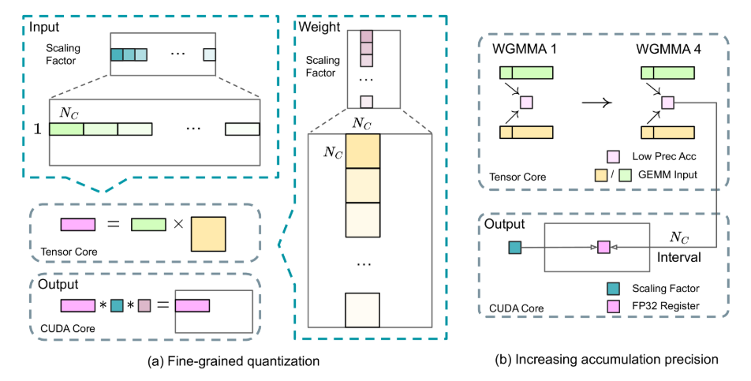

### 1 DeepSeek-v3 的FP8训练框架

我们引入了一种细粒度量化策略：使用1×Nc元素或块级分组Nc×Nc元素。

在我们的提高精度累积过程中，相关的反量化开销在很大程度上得到了缓解，这是实现准确的 FP8 一般矩阵乘法 （GEMM） 的关键方面。

此外，为了进一步减少训练中的内存和通信开销，我们在 FP8 中缓存（cache）和分块激活（dispatch activation），同时在 BF16 中存储低精度优化器状态。

#### 1.1 混合精度框架

FP8相比BF16混合精度训练框架，其理论计算速度提高了一倍

- 图1：具有 FP8 数据格式的整体混合精度框架，仅说明了 Linear 运算符。

在这个框架中，大多数计算密度运算都是在 FP8 中进行的，而少数关键运算战略性地保持其原始数据格式，以平衡训练效率和数值稳定性。

首先，为了加速模型训练，大多数核心计算内核，即 GEMM操作，都以 FP8 精度实现。这些 GEMM作接受 FP8 张量作为输入，并在 BF16 或 FP32 中生成输出。与线性运算符相关的所有三个 GEMM，即 Fprop （forward pass 前向传递）、Dgrad （activation backward pass 激活后向传递）和 Wgrad （weight  backward pass 权重后向传递），都在 FP8 中执行。此外，FP8 Wgrad GEMM 允许将激活存储在 FP8 中，以便在向后传递中使用。 这大大减少了内存消耗。

我们对以下组件保持原始精度（例如 BF16 或 FP32）：嵌入模块、输出头、MoE 门控模块、归一化运算符和注意力运算符。为了进一步保证数值稳定性，我们以更高的精度存储主权重、权重梯度和优化器状态。

#### 1.2 提高量化和乘法的精度

- 图2：（a）我们提出了一种细粒度量化方法来减轻由特征异常值引起的量化误差;为简单起见，仅对 Fprop 进行了说明。（b）结合我们的量化策略，我们以NC=128元素 MMA 进行高精度累积。

**精细量化**

标准做法，通过将输入张量的最大绝对值缩放到 FP8 的最大可表示值，输入分布与 FP8 格式的可表示范围保持一致。这种方法使低精度训练对激活异常值高度敏感，这会严重降低量化精度。

我们提出了一种细粒度量化方法，该方法在更精细的级别上应用缩放。如图2（a）所示，对于激活，我们在以 1x128 的基础上（即每token和每 128 个通道）对元素进行分组和缩放；对于权重，我们以128x128 块为基础（每128通道和每128个通道）对元素进行分组和缩放。 这种方法确保量化过程可以通过根据较小的元素组调整尺度来更好地适应异常值。

我们方法中的一个关键修改是沿 GEMM作的内部维度引入每组缩放因子。 标准 FP8 GEMM 不直接支持此功能。 但是，结合我们精确的 FP32 累积策略，它可以有效地实施。

尽管我们的 基于 tile（块）的精细量化（fine-grained quantization） 有效缓解了特征异常值（feature outliers）带来的误差，但它要求激活量化采用不同的分组方式，即 前向传播时采用 1×128 分组，而反向传播时采用 128×1 分组。类似的处理也适用于激活梯度（activation gradient）。

一个直接的策略是 按 128×128 块（block-wise）进行量化，类似于对模型权重的量化方式。这样在反向传播时只需要执行转置（transposition），可以减少计算复杂度。因此，我们进行了实验，将 Dgrad（计算激活梯度并向浅层反向传播的操作） 相关的所有张量都按照 block-wise（块级） 方式进行量化。

实验结果表明，Dgrad 操作对精度 极其敏感。具体来说，在一个 包含约 160 亿参数（16B），训练300B token 的 MoE（混合专家）模型上，对 激活梯度 进行块级量化会导致 模型发散（divergence）。

我们推测，这种敏感性来源于激活梯度在 token 之间的分布高度不均衡，导致 token 相关的异常值（token-correlated outliers）。而 块级量化 方法无法有效地处理这些异常值，从而引发模型的不稳定性。

**提高累积精度**

低精度 GEMM 操作存在下溢问题，其精度在很大程度上取决于高精度累积，这通常以 FP32 精度执行。然而，我们观察到 FP8 GEMM 在 NVIDIA H800 GPU 上的累积精度仅限于保留 14 位左右，这明显低于 FP32 累积精度。当内部维度 K 较大时，此问题将变得更加明显。这是大规模模型训练中 batch size 和 model width 增加的典型场景。有限的累积精度严重制约了训练精度。

我们采用将操作升级到cuda core上执行以获得更高精度，过程如图2（b）所示。具体来说，在 Tensor Core 上执行 MMA （矩阵乘法累加）期间，使用有限的位宽累积中间结果。一旦间隔达到$Nc$时，这些部分结果将被复制到 CUDA 核心上的FP32寄存器，在那里执行全精度FP32累加。如前所述，我们的细粒度量化沿着内部维度 K 应用每组比例因子。这些缩放因子可以在 CUDA 核心上作为反量化过程有效地乘以，而额外的计算成本最小。

值得注意的是，此修改降低了单个 warpgroup 的 WGMMA （Warpgroup level Matrix Multiply-Accumulate） 指令发出率。但是，在 H800 架构上，两个 WGMMA 通常会同时存在：当一个 warpgroup 执行提升作时，另一个 warpgroup 能够执行 MMA作。这种设计支持两个作的重叠，从而保持 Tensor Core 的高利用率。 根据我们的实验，设置 $Nc$=128 元素，相当于 4 个 WGMMA，表示可以显著提高精度而不会引入大量开销的最小累积区间。

**尾数大于指数 Mantissa over Exponents**

与之前工作采用的混合 FP8 格式相比，它在 Fprop 中使用 E4M3（4 位指数和 3 位尾数），在 Dgrad 和 Wgrad 中使用 E5M2（5 位指数和 2 位尾数），我们在所有张量上采用 E4M3 格式以获得更高的精度。我们将这种方法的可行性归因于我们的细粒度量化策略，即平铺和块级缩放。 通过对较小的元素组进行作，我们的方法有效地在这些分组元素之间共享指数位，从而减轻了有限动态范围的影响。

**在线量化**

延迟量化用于张量量化框架，它维护先前迭代中最大绝对值的历史记录以推断当前值。 为了确保准确的比例并简化框架，我们在线计算每个 1x128 激活图块或 128x128 权重块的最大绝对值。 基于它，我们推导出缩放因子，然后将激活或权重在线量化为 FP8 格式。

#### 1.3 低精度存储和通信

结合我们的 FP8 训练框架，我们通过将缓存的激活和优化器状态压缩为精度较低的格式，进一步减少了内存消耗和通信开销。

**低精度 Optimizer 状态**

我们采用 BF16 数据格式而不是 FP32 来跟踪 AdamW 优化器中的一阶和二阶矩而不会导致可观察到的性能下降。然而，优化器存储的主权重和用于批量累积的梯度仍然保留为 FP32，以确保整个训练过程中的数值稳定性。

**低精度 Activation. **

如图1所示，Wgrad操作在 FP8 精度下执行。

为了减少内存消耗，将激活值以 FP8 格式缓存用于 Linear（线性）算子的反向传播是一个自然的选择。然而，为了在低成本的同时实现高精度训练，我们对几个算子进行了特殊处理：

1. 注意力（attention）算子后的 Linear 输入

   这些激活值同样用于注意力算子的反向传播，因此对精度较为敏感。我们专门为这些激活值采用了定制的 **E5M6** 数据格式。此外，在反向传播过程中，这些激活值会从 **1×128 量化块（quantization tile）** 转换为 **128×1 量化块**。为了避免额外的量化误差，所有的缩放因子（scaling factors）都采用 **整数次幂（2 的幂次）** 进行舍入缩放。

2. MoE（混合专家）中的 SwiGLU 算子输入

   为了进一步减少内存开销，我们会缓存 SwiGLU 算子的输入，并在反向传播时重新计算其输出。这些激活值同样存储为 **FP8**，并结合 **精细量化（fine-grained quantization）** 方法，在 **内存效率** 和 **计算精度** 之间取得平衡。

**低精度通信**

通信带宽是 MoE 模型训练中的关键瓶颈。 为了缓解这一挑战，我们将 MoE 上投影之前的激活量化到 FP8 中，然后应用调度组件，这与 MoE 上projector中的 FP8 Fprop 兼容。就像 attention 运算符之后的 Linear 输入一样，此激活的比例因子是 2 的整数幂。 类似的策略应用于 MoE 下投影之前的激活梯度。 对于前向和后向组合组件，我们都将它们保留在 BF16 中，以保持训练pipeline关键部分的训练精度。