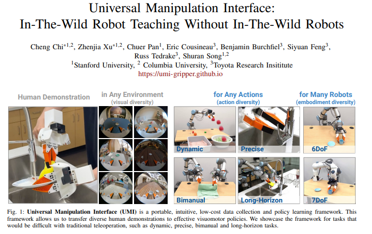
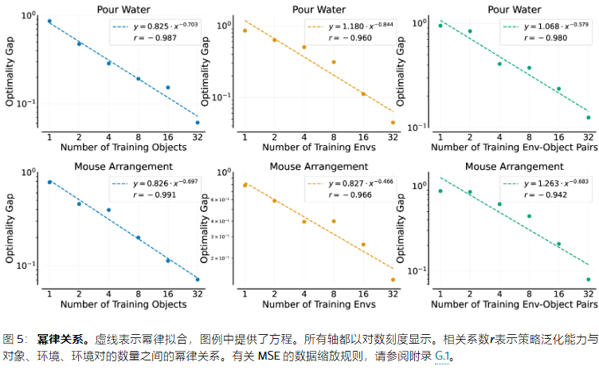
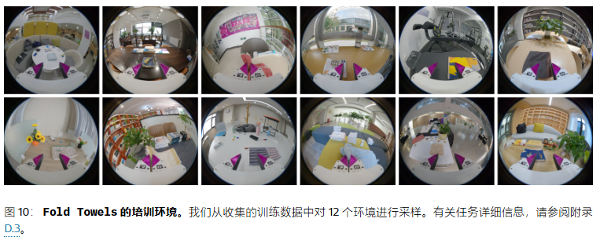
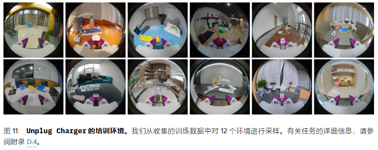
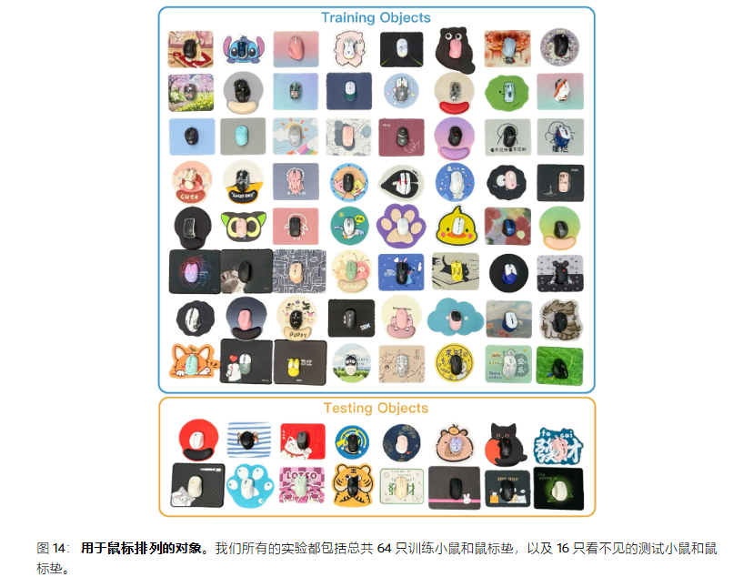
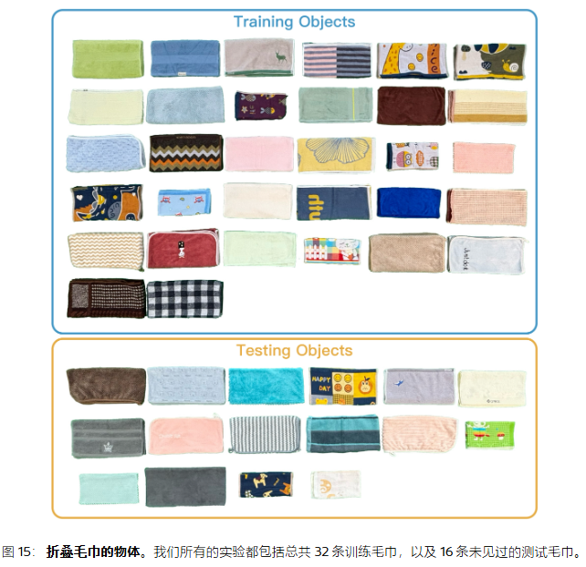
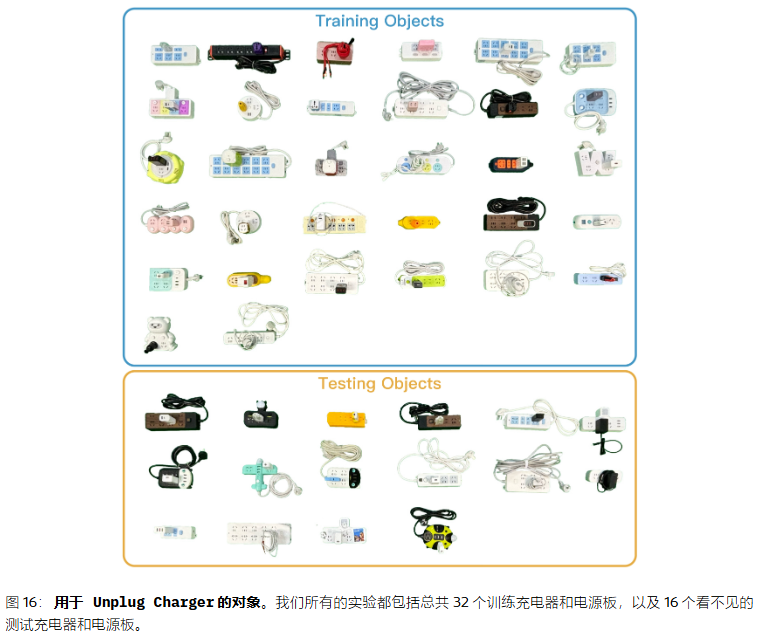

#### 1. 机器人操作的缩放定律 论文分享

《Data Scaling Laws in Imitation Learning for Robotic Manipulation》

机器人操作模仿学习中的数据缩放定律

论文地址：https://arxiv.org/abs/2410.18647

本文目标是研究以下基本问题：适当的数据扩展能否产生能够在任何环境中对任何对象进行操作的机器人策略？

#### 1.1 摘要

本文主演研究环境级泛化与对象级泛化（验证任务级泛化需要更大数量级的数据，难以承受），得出以下结论：
- 简单的幂铝。该策略对新对象/新环境的泛化能力大致按幂律进行扩展，分别与训练对象、训练环境或训练环境-对象对的数量相叠加。
- 多元化is all you need。增加环境和对象的多样性比增加每个环境或对象的演示的绝对数量要有效的多。
- 泛化比预期要容易。在尽可能多的环境（例如，32个环境）中收集数据，每个环境都有一个唯一操作对象和50个演示，从而可以训练一个可以很好地泛化（90%成功率）到任何新环境和新对象的策略。

#### 1.2 方法

1. 泛化维度。

我们使用行为克隆（BC）来训练单任务策略，这是学习真实世界操作技能的主要方法。许多BC训练表现出交叉的泛化性能，体现在两个维度上：（1）环境-泛化到以前没见过的环境；（2）对象-泛化到与人类演示中对象属于同一类别的新对象，在颜色大小几何属性上有所不同。

领域先前的研究试图通过独立控制特定因素来隔离每个维度内的变化，例如特殊照明来仅限更改照明颜色，或者3D大于对象仅改变大小而不改变其形状。然而，实际性能不取决于推广到单个因素，而是取决于同时处理变化的多个因素的复杂相互作用。为了解决这个问题，我们专注于两个维度（环境和对象）的泛化，这两个维度共同包含策略在自然、真实场景中遇到的所有因素。

2. 数据缩放定律指导。

我们考虑一个场景，其中操作任务的演示数据集是跨M个环境和N个同一类别的操作对象。每个环境可以包含任意数量的演示对象，前提是他们与操作对象不属于同一类别。对于每个对象，在环境中有k条演示被收集。我们使用测试分数来评估训练期间看不到的环境和对象上策略的效果S。本文缩放定律旨在：（1）描述S与变量M,N,K两者之间的关系，具体来说，泛化能力如何取决于环境、对象的演示和数量；（2）根据这种关系确定有效的数据收集策略以达到所需的泛化水平。

3. 数据源。

现有的机器人操作数据集无法为单个任务提供足够的环境和对象来满足我们的要求。 因此，我们选择使用通用操作接口 （UMI）用于独立收集大量演示。

图注：UMI，DiffusionPolicy一作的续作，一个通用操作夹爪，可以单独取下以供人类标注者方便的收集数据

4. 策略学习。

我们使用 Diffusion Policy 来对我们收集的大量数据进行建模。为了进一步提高性能，我们进行了两项改进：

1） DINOv2 可视编码器：在我们的实验中，对 DINOv2 ViT 进行微调优于 ImageNet 预训练的 ResNet。我们将这一改进归功于 DINOv2 功能能够显式捕获图像中的场景布局和对象边界。这些信息对于增强空间推理至关重要，这对机器人控制特别有益。为了确保模型容量在扩展数据时不会成为瓶颈，我们使用了足够大的模型 ViT-Large/14

2） 时态集成：扩散策略预测每个T_1步骤，每个序列的长度为T_2 (T_2>T_1），并且只有第一个T_1执行步骤。我们观察到，执行的动作序列之间的不连续性会导致切换过程中的生涩动作。为了解决这个问题，我们实现了 ACT 中提出的时态集成策略。具体来说，该策略在每个时间步进行预测，从而导致操作序列重叠。在任何给定的时间步长，使用指数加权方案对多个预测动作进行平均，从而平滑过渡并减少运动不连续性。

5. 评估。

我们将操作任务分为几个阶段/步骤（通常为2-3个）。每个阶段或步骤都有明确定义的评分标准。每个步骤最多可以获得3分，我们报告一个标准化分数，定义为标准化分数=考试总分/3*步数，最大值为1。与常用的成功率不同，成功率是一个过于稀疏的信号，缺乏区分策略的粒度，我们的评分机制可以捕获更细微的行为。

#### 1.3 实验

我们首先关注两个操作任务：Pour Water 和 Mouse Arrangement。 

在 Pour Water 中，机器人执行三个步骤：首先，它抓住随机放在桌子上的一个水瓶;其次，它将水倒入杯子中;最后，它将瓶子放在红色杯垫上。这项任务需要精确性，尤其是在将瓶口与杯子对齐时。 

在 Mouse Arrangement 中，机器人完成两个步骤：拿起鼠标并将其放置在鼠标垫上，正面朝前。鼠标可能会倾斜，需要机器人采用非抓握动作（即推动）来首先对齐它。

#### 对象泛化

（1）随着训练对象数量的增加，该策略在看不见的对象上的性能在所有演示部分中都持续提高。

（2） 训练对象越多，每个对象所需的演示就越少。例如，在 Pour Water 中，当使用 8 个对象进行训练时，使用 12.5% 的演示的性能明显滞后于使用 100% 的演示;但是，当使用 32 个对象进行训练时，这种差距几乎消失了。

（3）对象泛化相对容易实现。性能曲线的初始斜率非常陡峭：只有 8 个训练对象，两项任务的标准化分数都超过 0.8。当训练对象数量达到 32 个时，分数超过 0.9。这些分数对应于已很好地推广到同一类别内的任何新对象的策略。

#### 环境泛化

探索训练环境数量对泛化的影响

（1） 增加训练环境的数量可以提高策略在看不见的环境中的泛化性能。即使演示总数保持不变，这种趋势仍然存在。虽然增加每个环境中的演示分数最初会提高性能，但这种改进很快就会减弱，如代表 50% 和 100% 演示使用的线条重叠所示。

（2） 对于这两项任务，环境泛化似乎比对象泛化更具挑战性。我们观察到，当环境或对象数量较少时，与增加对象数量相比，增加环境数量会导致较小的性能提升。这反映在环境泛化性能曲线的较低斜率中。

#### 跨环境和对象的泛化

我们探索训练环境和对象同时变化的设置

（1） 增加训练环境-对象对的数量大大提高了策略的泛化性能，这与之前的观察结果一致。

（2） 有趣的是，尽管跨新环境和对象进行泛化更具挑战性，但在这种情况下，额外演示的好处会更快地饱和（25% 和 100% 演示使用的重叠线证明了这一点）。这表明，与单独更改环境或对象相比，同时更改两者会增加数据*多样性*，从而提高策略学习效率并减少对演示数量的依赖。这一发现进一步强调，扩大环境和对象的多样性比仅仅增加每个环境或对象的演示数量更有效。

#### 幂律拟合

接下来，我们探索我们的实验结果是否遵循幂律缩放定律，就像在其他领域中看到的那样。具体来说，如果两个变量Y和X满足关系 $Y=β⋅X^α$ ,它们表现出幂律关系。基于所有结果，我们总结了以下数据缩放定律：

- 该策略对新对象和/或新环境的泛化能力大致按*幂律*进行扩展，分别与训练对象、训练环境或训练环境-对象对的数量相叠加。相关系数证明了这一点r在图 [5](https://arxiv.org/html/2410.18647v1#S4.F5)

- 当环境和对象的数量是固定的时，演示的数量与策略的泛化性能之间没有明确的幂律关系。虽然性能最初随着演示的增加而迅速提高，但最终趋于平稳。

#### 高效的数据收集策略

在本节中，我们提出了一种以数据缩放定律为指导的有效数据收集策略。回想一下，我们的数据收集跨越Menvironments 和N操作对象，K每个环境中每个对象的演示。我们试图回答的主要问题是：对于给定的操作任务，我们如何以最佳方式选择M,N和K以确保策略的强大泛化，而不会产生过于费力的数据收集过程？为了探索这一点，我们继续使用任务 Pour Water 和 Mouse Arrangement 作为示例。

**如何**

**如何选择环境和对象的数量？**以前，我们只考虑每个环境都包含单个唯一操作对象的设置。但是，在实际数据收集中，每个环境收集多个对象可能会提高性能，因此是一种更有效的方法。

热力图6表示当环境数量较少时，在每个环境中收集多个对象可以提高性能。但是，随着环境数量的增加（例如，增加到 16 个），每个环境收集多个对象与仅收集单个对象之间的性能差距变得可以忽略不计。对于环境数量通常超过 16 个的大规模数据收集，在同一环境中添加多个对象不会进一步提高策略性能，这表明这种方法可能是不必要的。根据我们的实验结果，我们建议如下：

*在尽可能多的不同环境中收集数据，每个环境中只有一个唯一的对象*。当环境-对象对的总数达到 32 时，通常足以训练一个能够在新环境中运行并与以前看不见的对象交互的策略。

**如何选择演示数量？**

在泛化性的实验结果表明，将演示数量增加到某个点之后，产生的好处最小。本节旨在确定该阈值。我们首先检查其中环境M=16和对象N=64（与前面的实验一样）。我们将用于训练的演示总数从 64 到 6400 不等，并训练 8 个策略。结果显示在图 7 的最左侧图中：显示当演示数量达到 800 个时，两个任务的得分都处于平稳状态。

接下来，我们考虑收集环境-对象对的推荐设置（即M=N)。结果如图 7 最右侧的两个图所示：表示当环境-对象对的数量较少时，达到饱和所需的演示总数较少。具体来说，对于 8、16 和 32 对，性能分别稳定在 400、800 和 1600 次演示。

基于这些发现，我们建议*为每个环境-对象对收集 50 个演示（即K=50） 完成与我们的任务难度相似的任务*.更具挑战性的灵巧操作任务可能需要更多的演示;我们将这方面的探索留给未来的工作。

#### 1.4 附录

#### A 环境和对象可视化

#### B 数据源-使用UMI采集数据的经验

我们分享了从使用 UMI 中获得的关键见解（Chi 等人，[2024](https://arxiv.org/html/2410.18647v1#bib.bib13))要收集大量演示：

**（1） 随机初始姿势至关重要：**对于每个演示，必须随机化手持式夹持器的初始姿势，包括其高度和方向。这种做法有助于涵盖更广泛的起始条件。如果没有这种变化，经过训练的策略会对特定的初始姿势过于敏感，从而将其有效性限制为仅特定位置。同样，物体的初始位置范围应尽可能广泛，同时保持在机器人的运动学和动力学限制范围内。

**（2） 选择具有丰富视觉特征的环境：**由于 UMI 依赖 SLAM 进行相机姿态跟踪，因此缺乏足够视觉特征的环境（如暗区或空白墙壁）可能会导致跟踪失败。为了解决这个问题，我们使用了可视化工具 Pangolin([洛夫格罗夫，](https://arxiv.org/html/2410.18647v1#bib.bib39))验证环境是否具有足够的功能。引入更多干扰对象或向表面添加纹理（例如桌面）既可以增加视觉特征，也可以作为一种数据增强形式，帮助策略学会忽略环境中不相关的变化。此外，执行多轮映射并使用批处理 SLAM 处理可以增加有效演示的数量。

**（3） 使用适当大小的操作对象：**阻碍摄像头视野的大型物体（例如门或抽屉）可能会导致 SLAM 算法将摄像头误解为静止的，从而导致跟踪失败。这个限制影响了我们避免打开抽屉等任务的决定，突出了当前 UMI 的一个关键缺点。集成现成的姿势追踪硬件（例如 iPhone Pro 或 VIVE Ultimate Tracker）可能会提高 UMI 的准确性和稳健性。

**（4） 其他提示：**

- 标准化不同数据收集器之间的行为模式和任务完成时间，以最大限度地减少数据集中的多模态行为。

- 收集数据时，请避免移动非操纵对象（干扰项），并确保其他移动实体不会进入摄像机的视野。

- 关闭夹持器时，轻轻用力以引入轻微变形。

#### C 任务详细信息

在本节中，我们详细介绍四个操作任务和评估过程中的评分标准。

#### C1 倒入水

**任务描述。**机器人执行三个连续的动作：最初，它抓住一个饮料瓶;随后，它将水倒入杯子中;最后，它将瓶子放在指定的红色杯垫上。瓶子被随机放置在桌子上，前提是它在机器人的运动学范围内。瓶子和杯子的相对初始位置也是随机的，确保它们的间距可变，同时在抓住瓶子后保持杯子对相机可见。红色杯垫是一个直径为 9 厘米的圆圈，始终位于杯子右侧约 10 厘米处，可在所有环境中使用。由于瓶子颜色、大小和高度的变化，这项任务对机器人的泛化能力提出了挑战，并且需要将瓶口与杯子精确对齐才能成功完成。该任务还需要大量的旋转运动，这超出了基本的拾取和放置操作。倾倒和放置动作的成功执行关键取决于最初准确抓取瓶子。为了进行测试，瓶盖被紧紧地固定，没有实际的水倒出。

**评分标准。**

第1步：抓住饮料瓶

​	**0 分：**夹具不靠近饮料瓶

​	**1 分：**夹持器接触饮料瓶，但由于小错误而没有抓住它，或者它最初抓住了瓶子，然后在提升过程中滑出。

​	**2 分：**抓手在抓住饮料瓶之前将饮料瓶推了很长一段距离。

​	**3 分：**抓手成功抓住饮料瓶，没有任何滑动。

第2步：将水倒入杯子汇总

​	**0 分：**夹持器不靠近杯子。

​	**1 分：**旋转饮料瓶后，它的嘴巴保持在杯子外面，无法倒出。

​	**2 分：**旋转饮料瓶后，其瓶口位于杯子边缘的正上方，仅允许部分倒出。

​	**3 分：**旋转饮料瓶后，其口完全位于杯子内，便于完全倒出。

第3步：将瓶子放在红色杯垫上

​	**0 分：**夹持器不接近红色杯垫。

​	**1 分：**饮料瓶放在红色杯垫外面，或者放置过程会破坏杯子，导致杯子倾倒。

​	**2 分：**饮料瓶只有一部分放在红色杯垫上。

​	**3 分：**饮料瓶完全稳定地放置在红色杯垫上。

**成功标准。**成功的任务需要在第 1 步中至少获得 2 分，在第 2 步中至少获得 3 分，在第 3 步中至少获得 2 分。

#### C2 鼠标排列

**任务描述。**机器人需要完成两个步骤：拿起鼠标并将其放在鼠标垫上。第一步，鼠标可以放置在桌子上的任何位置，只要它保持在机器人的运动范围之内即可。 鼠标可能正前方，在这种情况下，机器人需要直接从后面抓住它。或者，它可能会略微向左或向右倾斜，这需要机器人采用不可抓握的动作，例如在关闭夹持器之前将鼠标推到正确的方向以拾取它。 鼠标的粗细大大限制了可行抓取姿势的数量，几乎没有出错的余地，因为即使是轻微的位置偏差也可能导致抓取失败。 此外，鼠标不断变化的几何形状和颜色要求机器人的策略具有很强的泛化能力，使其能够根据鼠标的特定形状和大小调整抓取策略。

**评分标准。**

第1步：拿起鼠标

​	**0 分：**抓手不会向鼠标移动，也不会在不接触鼠标的情况下绕着鼠标移动。

​	**1 分：**抓手接近正确的抓握姿势并触摸鼠标，但在稍微抬起鼠标后将其放下。

​	**2 分：**抓手在抓住鼠标之前将鼠标推了很长一段距离，或者鼠标被抓住但在抬起到更高的高度时掉落。

​	**3 分：**夹持器成功抓取鼠标，没有任何滑动。

第二步：将鼠标放在鼠标垫上

​	**0 分：**夹持器要么在空中保持静止，无法移向鼠标垫，要么将鼠标从高处释放，导致鼠标掉落到桌子上。

​	**1 分：**鼠标放置在鼠标垫外面，或者即使整个鼠标落在鼠标垫上，它也会因从高处释放而翻转。

​	**2 分：**只有鼠标的一部分放在鼠标垫上，或者即使整个鼠标都在鼠标垫上，由于从相对较高的高度释放，它也会轻微弹跳和移动。

​	**3 分：**在释放鼠标之前，抓手会降低到适当的高度，确保整个鼠标牢固地放置在垫子上。

**成功标准。**成功的任务需要在第 1 步中获得 3 分，在第 2 步中获得至少 2 分。

#### D 评估指标的比较

我们使用测试人员分配的分数作为我们的主要评估指标，并承认这种方法本身就引入了测试人员的一些主观性。另一个指标，即验证集上的均方误差 （MSE），提供了一种不需要人工干预的潜在客观度量。在本节中，我们将对这两个指标进行详细比较。为了计算 MSE，我们为每个评估环境或对象收集了 30 个人工演示，形成验证集。然后，我们通过平均策略预测的行动和每个时间步的人工行动之间的平方差来计算 MSE。

我们观察到在某些情况下，MSE 和标准化分数之间存在很强的负相关。例如，在图 [17](https://arxiv.org/html/2410.18647v1#A5.F17) 的右图中，实验设置评估了策略在 Pour Water 上的环境和对象中的泛化。 随着训练环境-对象对数量的增加，归一化分数逐渐上升，而 MSE 稳步下降，其中 Pearson 的r=−0.98和 Spearman 的ρ=−1.00.这表明 MSE 可能会取代人工评分方法。 但是，在某些情况下，MSE 与实际性能的相关性并不高。例如，在图 [17](https://arxiv.org/html/2410.18647v1#A5.F17) 的左图中，该实验评估了策略在 Pour Water 上跨对象的泛化。当训练对象的数量增加到 16 个时，MSE 实际上会增加，从而导致 Pearson 的r的 only−0.73. 同样，在探索模型训练策略的实验中，LoRA 的 MSE 明显低于完全微调的 MSE （0.0049 vs. 0.006）。然而，在实际测试中，LoRA 的策略表现不如完全微调，标准化分数分别为 0.72 和 0.9。

总体而言，验证集上的 MSE 通常与实际性能无关，并且许多异常出现时不可预测且没有可辨别的模式。这使我们相信 MSE 不是一个完全可靠的评估指标。在实践中，我们更多地将 MSE 用作调试工具，以快速识别存在明显问题的策略。

#### 2. RDT-1B 论文分享

《RDT-1B: a Diffusion Foundation Model for Bimanual Manipulation》

论文地址：[arxiv.org/pdf/2410.07864](https://arxiv.org/pdf/2410.07864)