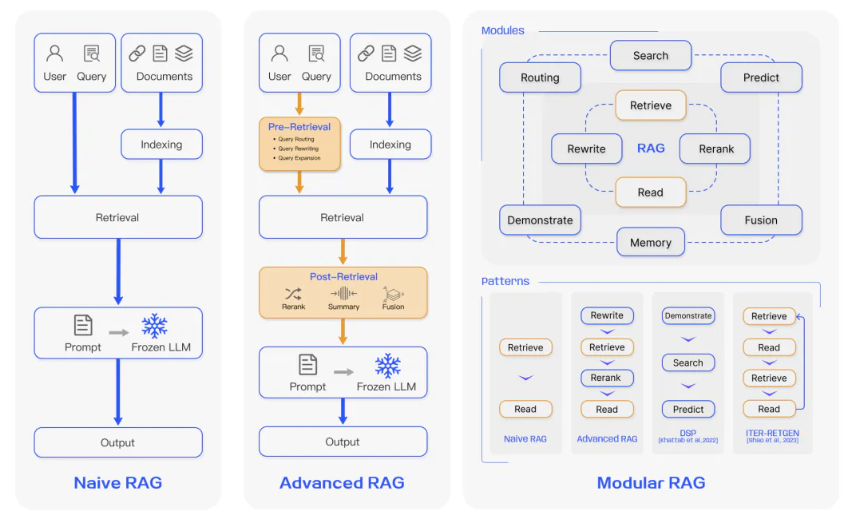
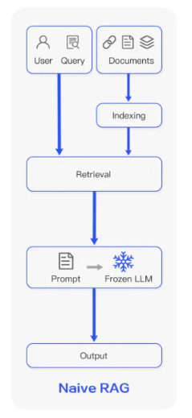
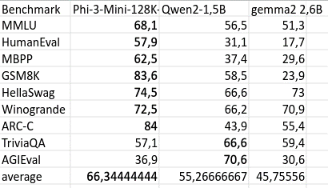
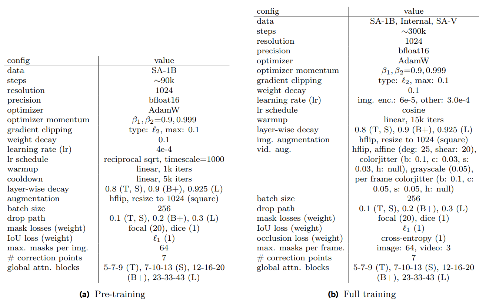
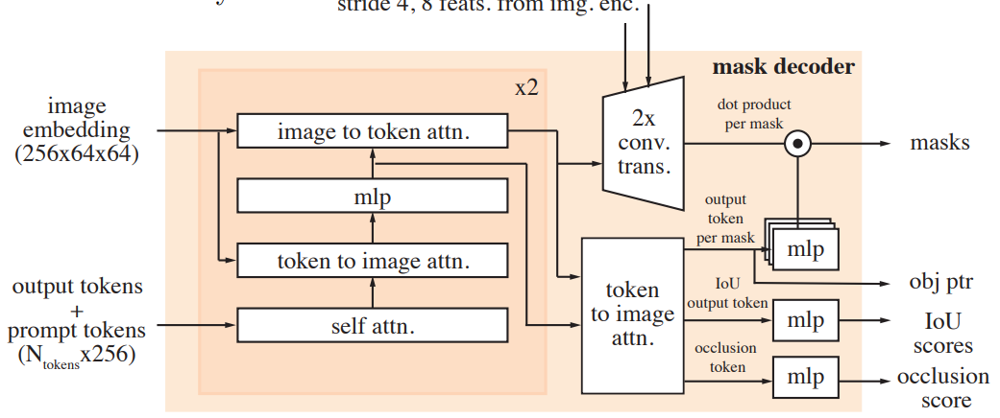

### 1 算法进展

算法最新进展，请关注：
1.算法进展表：https://alidocs.dingtalk.com/i/nodes/N7dx2rn0JbNZP2xRtdlqAyo7JMGjLRb3?doc_type=wiki_notable&iframeQuery=sheetId%3Da5mpmcw3o0a3agno7gde9%26viewId%3DRe1tn0o&rnd=0.8072404881274278

#### 1.1 HiLight模型

WebUI Demo完成，HiLight 视频问答模型一期结束。技术报告：[代码浏览 - hi_light - motern_ai - MOTERN (coding.net)](https://serverless-100013832940.coding.net/p/motern_ai/d/hi_light/git/tree/master/HiLight_Tech_Report)


- 支持纯文本和视频模态的输入

- 支持单轮对话中多个视频输入，且可自定义视频在文本之间的插入位置

- 支持视频多轮对话，多次视频输入

注：当前模型只在单轮对话单视频输入的数据集中训练过，其多轮对话任意数量视频输入虽然代码上做了兼容，但是这一能力未经充分训练，仅依靠LLM本身的泛化能力。


二期及以后：

- 训练：多视频多轮对话的充分训练
- 检索：基于视频的Grounding级别的理解，理解视频中特定帧特定区域的信息，真正实现视频的有效检索能力

- 上下文：增加模型多模态输入的上下文长度，设计**动态采样**以不损失精度的情况下低成本推理超长视频
- 实时交互性：支持视频流的实时交互的pipeline（当前模型是以对话的形式，必须完整输入视频随后再做出回答。构建实时交互的pipeline可以支持模型在接收视频流对视频状态实时理解的同时，在关键时刻主动与用户发起交互，自主反应。）

- 永久持续性：基于持续视频流或超长视频的缓存机制，模型外挂视频库存储已编码的视频特征，模型能够随时回忆到一个星期、一个月以前视频中发生了什么。


#### 1.2 LLM + RAG (导游机)项目

导游机需求的技术路线几乎没有什么争议:LLM+RAG

#### 1.2.1 RAG 部分

**RAG简介**

RAG（Retrieval Augmented Generation）是一个将输入与一组相关的支持文本结合起来的技术，这些文本可以是网页、本地txt/pdf/word……等。这些文档被添加到输入提示中，一起送入文本生成器，从而产生最终的输出。RAG的这一机制特别适用于需要应对信息不断更新的场景，因为大语言模型（LLM）所依赖的参数知识本质上是静态的。通过RAG，语言模型可以不经过重新训练而直接访问最新信息，以便生成可靠的、基于检索的输出。

简言之，RAG通过检索到的上下文来提高LLM响应的准确性、可控性和相关性，这可以弥补LLM在快速变化的环境中错误信息生成或知识缺失，在实际应用中很有价值。


RAG核心流程：

1. Prompt +Query
2. 检索（Retrieval）
3. 获得检索的结果：Context，用于增强对话上下文
4. 将Prompt、Query、Context组成LLM的输入
5. 获得文本回复

**RAG范式的演变**





pdf excel word 不同格式的文档如何处理？

如何合理分割chunks？

选择何种embedding model?

选择何种向量数据库？

如何进行合理的检索？检索准确率直接决定结果

检索出的上下文Ranking？

prompt该如何设计？使用什么语言模型？


#### 1.2.2 LLM 语言模型部分

##### 1.2.2.1 llama.cpp

**llama.cpp**：一个纯C/C++推理部署框架，目的是为了让LLM在本地或云端各种硬件上以最少的配置和最先进的性能进行推理。可以在不同的操作系统进行编译和运行，支持CPU+GPU混合推理，且提供了丰富的量化方案。

llama.cpp本身支持了很多主流的LLMs、MLLMs，对于不支持的模型可以自行添加（有一定难度，勿轻易尝试）

 **ollama**：基于llama.cpp开发的框架有UI页面，ollama专注于提高推理速度并减少语言模型的内存使用量，且优化了部署过程中的用户体验，让用户更专注于模型的下载、加载、调用等。ollama与原始 llama.cpp 项目保持兼容性，允许用户轻松在两种实现之间切换或集成ollama到现有项目中。


**Small Language Models (SLMs)选型**

总体而言，较小的模型大小会导致保留事实的能力较低。
① Phi-3-mini，来自微软，参数3.8B，支持两种上下文，分别是4k和128k，有指令微调版本

②RWKV系列，RWKV 结合了 RNN 和 Transformer 的最佳特性 --- 出色的性能、快速的推理、快速的训练、节省 VRAM、"无限" 的 ctxlen。同Mamba等线性Attention一样，RWKV具备计算开销低，边端推理友好等优势。

② OpenELM，来自Apple，最少参数版本2.7B，有预训练和指令微调版本

③ Gemma2，来自Google DeepMind，最少参数版本2.6B，从Gemma 2 27B中蒸馏而来，比起前代模型Gemma 1 2B，性能提升了10%，有预训练和指令微调版本 https://huggingface.co/google/gemma-2-2b-it-GGUF

④  Qwen2-1.5B


 

**Embedding model选型**

BGE/ MiniLM/ snowflake......

可在MTEB leaderboard上选择https://huggingface.co/spaces/mteb/leaderboard

**向量数据库选型**

Milvus/ Faiss/ Chroma……

少量数据可用内存或本地数据库存储；

如果有大量数据，例如超过一百万个向量，可以在 Docker 或 Kubernetes 上设置性能更高的 Milvus 服务器


##### 1.2.2.2 rwkv.cpp

rwkv.cpp是专门针对rwkv架构的部署框架，是RWKV-LLM到ggml（一种模型边端部署格式）的端口。同时支持GPU和CPU推理（侧重于CPU，也支持cuBLAS），除了通常支持的FP32精度外，它还支持FP16、量化INT4、INT5 和 INT8 推理.

##### rwkv.cpp在不同CPU设备上不同运行方式的推理用时

rwkv.cpp 加载 3B Q4_1量化 提示词：

```
用户询问：我迷失方向了怎么办。检索到的上下文：文档1：在野外迷失方向时，切勿惊慌失措，而是要立即停下来，总冷静地回忆一下所走过的道路，想办法按一切可能利用的标志重新制定方向，然后再寻找道路。最可靠的方法是“迷途知返”，退回于原出发地。 文档2：在山地迷失方向后，应先登高远望，判断应该向什么方向走。通常应朝地势低的方向走，这样容易碰到水源、顺河而行最为保险，这一点在森林中尤中为重要。因为道路、居民点常常是滨水临河而筑的。用户询问：我迷失方向了怎么办。
```

- 服务器CPU设备（可能只被AutoDL分配一定程度的核心，并不是CPU完整算力）：12 vCPU Intel(R) Xeon(R) Platinum 8352V CPU @ 2.10GHz 运行模型：

API推理用时：

```
第一次调用：处理最新消息时间：28.0秒；模型生成时间：74秒
第二次调用：处理最新消息时间：35.4秒；模型生成时间；5.3秒
第三次调用：处理最新消息时间：32.6秒；模型生成时间；5.3秒
```

chat bot推理用时：

```
第一次对话：处理最新消息时间：29.8秒；模型生成时间：51.7秒
第二次对话：处理最新消息时间：30.0秒；模型生成时间：48.6秒
第三次对话：处理最新消息时间：31.0秒；模型生成时间：44.7秒
```

- 个人电脑CPU设备：13th Gen Intel(R)  Core(TM) i5-13400 运行模型：

API推理用时：

```
第一次调用：处理最新消息时间：6.0秒；模型生成时间：20.3秒
第二次调用：处理最新消息时间：5.7秒；模型生成时间；20.0秒
第三次调用：处理最新消息时间：6.0秒；模型生成时间；20.1秒
```

chat bot推理用时：

```
第一次对话：处理最新消息时间：4.3秒；模型生成时间：20.4秒
第二次对话：处理最新消息时间：4.2秒；模型生成时间：20.5秒
第三次对话：处理最新消息时间：4.4秒；模型生成时间：20.6秒
```


- 观察：

1. 在服务器cpu上tokenizer_encoder用时30-35秒，模型生成时间45-50秒；在个人电脑cpu上tokenizer_encoder用时4-6秒，模型生成时间20秒。
2. 测试中结果基本稳定复现，api调用方式与chatbot启动方式时间差异不是非常显著。

- 结论：

1. 从用时上来看，不同CPU性能之间的差距对最终用时影响依然很大，当CPU性能有限时，tokenizer_encoder（处理最新消息部分）用时显著增加。

2. 从回答效果上看：
   rwkv在CPU推理回答的上限能够满足需求，其他环境及调用方式下需要特别注意 ：1.文本截断长度的设置；2.文本输出包含换行时能否正常显示。

```
个人电脑上API推理时回答（250token后被截断）：
您好，根据您的描述，我们可以提供以下建议：\n1. 首先要冷静地回忆一下所走过的道路，想办法按一切可能利用的标志重新制定方向，然后再寻找道路。\n2. 在山地迷失方向后，应先 登高远望，判断应该向什么方向走。通常应朝地势低的方向走，这样容易碰到水源、顺河而行最为保险，这一点在森林中尤中为重要。\n3. 因为道路、居民点常常是滨水临河而筑的。用户询问：我迷失方向了。\n4. 在野外迷失方向时，切勿惊慌失措，而是要立即停下来，总冷静地回忆一所走过的道路，想办法按一切可能利用的标志重新制定方向，然后再寻找道路。\n5.
```


##### rwkv.cpp在CPU上不同权重的推理结果

以下各种权重均以API调用形式测试，且提示词均为：

```
用户询问：我迷失方向了怎么办。检索到的上下文：文档1：在野外迷失方向时，切勿惊慌失措，而是要立即停下来，总冷静地回忆一下所走过的道路，想办法按一切可能利用的标志重新制定方向，然后再寻找道路。最可靠的方法是“迷途知返”，退回于原出发地。 文档2：在山地迷失方向后，应先登高远望，判断应该向什么方向走。通常应朝地势低的方向走，这样容易碰到水源、顺河而行最为保险，这一点在森林中尤中为重要。因为道路、居民点常常是滨水临河而筑的。用户询问：我迷失方向了怎么办。
```

- RWKV 1B6参数 Q4_0量化

```
第一次调用：Tokenizer_encoder：3.05秒；model_generate: 11.45秒
第二次调用：Tokenizer_encoder：3.14秒；model_generate: 8.90秒
第三次调用：Tokenizer_encoder：3.08秒；model_generate: 5.11秒
```

回答：

```
这是一个非常具体的问题，需要 进行详细的回答。首先，我们需要明确的是，在野外迷失方向是一件非常危险的事情，因为在这种情况下，我们不仅会面临生命危险，还会失去自己的方向感和定位。因此，我们需要采取一些特殊的措施来避免这种情况。
首先，我们应该保持冷静。当我们迷失方向时，我们应该保持镇定，不要惊慌失措。这样可以帮助我们更好地思考问题并找到解决办法。
其次，我们应该停下来并回忆起所走过的道路。这是非常重要的。当我们回忆起所走过的道路时，我们可以帮助我们更好地了解自己当前所处的位置和方向。同时，这也有助于我...
```

- RWKV 1B6参数 float16

```
第一次调用：Tokenizer_encoder：4.24秒；model_generate: 10.91秒
第二次调用：Tokenizer_encoder：4.16秒；model_generate: 10.51秒
第三次调用：Tokenizer_encoder：4.11秒；model_generate: 10.59秒
```

回答：

```
如果你迷失方向了，首先要冷静 下来，不要惊慌失措。然后，可以回忆一下所走过的道路，想办法按照一切可能利用的标志重新制定方向，然后再寻找道路。最可靠的方法是“迷途知返”，退回于原出发地。在野外迷失方向时，应该始终保持冷静，不要惊慌失措。
```

- RWKV 3B参数 Q4_1量化

```
第一次调用：Tokenizer_encoder：5.90秒；model_generate: 20.13秒
第二次调用：Tokenizer_encoder：6.12秒；model_generate: 19.97秒
第三次调用：Tokenizer_encoder：6.01秒；model_generate: 20.00秒
```

回答：

```
这个问题是用户询问如何在迷失 方向时，要冷静下来，并回忆所走过的道路，找到正确的方向。以下是一些可能有用的步骤：
1. 立即停下来：在迷 失方向时，首先要冷静下来，不要惊慌失措。这可以帮助你更好地分析当前的情况。
2. 总结所走过的道路：回忆一 下你所走过的道路，想办法按照一切可能利用的标志重新制定方向。
3. 找到正确的方向：通常应朝地势低的方向走 ，这样容易碰到水源、顺河而行最为保险，这一点在森林中尤为重要。因为道路、居民点常常是滨水临河而筑的。
4. 回到原出发地：如果无法找到正确的方向，那么最好是回...
```

- RWKV 3B参数 float16

```
第一次调用：Tokenizer_encoder：7.99秒；model_generate: 16.56秒
第二次调用：Tokenizer_encoder：12.16秒；model_generate: 15.86秒
第三次调用：Tokenizer_encoder：8.03秒；model_generate: 43.20秒
```

回答：

```
在野外迷失方向时，切勿惊慌失措，而是要立即停下来，总冷静地回忆一下所走过的道路，想办法按一切可能利用的标志重新制定方向，然后再寻找道路。最可靠的方法是‘迷途知返’，退回于原出发地。
```


- 结论：

1. 模型量化是在质量与效率上取得平衡，在RAG场景下，RWKV最小的1B6参数量的模型在int4 Q4_0量化下均能满足需求，生成结果质量足够。因此LLM部分只需要考虑速度即可。


**边端部署** 

Nvidia Jetson Orin 可支持常见的主流LLMs，MLLMs部署 https://jetson-ai-lab.com

算能BM1684X+RWKV1.6B  推理速率约10token/s，魔改优化效率可翻倍。仓库地址：https://github.com/szxysdt/LLM-TPU/tree/rwkv_dev


#### 1.2.3 方案预估


|          | LLM+RAG边侧                                                  | LLM边侧+RAG云                                                | LLM+RAG云                                                    |
| -------- | ------------------------------------------------------------ | ------------------------------------------------------------ | ------------------------------------------------------------ |
| 设备     | 算能BM1684X、英伟达Jetson Orin系列芯片；上手机芯片（已有案例是在三星S24 Ultra上部署的RAG+Phi-2 Q8） | 边端就是纯考虑LLM的芯片，但是边端芯片LLM就是占主要开销，所以芯片还是那些芯片，成本降不下去。 | 服务器+GPU，有多大显存上多大模型。                           |
| 优势     | 最符合应用场景，便捷性可靠性（不依赖云端通信网络，只依靠本地网络）最高的方案。 | RAG维护很方便，更新消息统一管理等。适合博物馆这种网络非常好的地方 | 相同使用人数下云服务反而是最简洁便宜的方案了。甚至可以有很多现成的LLM+RAG的付费服务，我们直接购买就是了，前期技术成本可以降到很低 |
| 劣势     | 边端推理速度，至少需要保证LLM生成10token/s，且尽量降低首个token生成的延迟（即RAG+Tokenizer Encoder的速度） | 通信延迟，首个token生成时间取决于RAG+TokenizerEncoder。在边端RAG可能速度不快，但是在云端RAG通信也需要花时间。很有可能这是最吃力不讨好的结果：LLM占资源开销大头，RAG占固定延迟（首个token延迟）大头，即承担边端LLM芯片的高昂价格，同时速度和质量都不占优势。 | 依赖网速                                                     |
| 预估成本 | 比较好体验就上N卡GPU，目前已找到的边端盒子和手机芯片方案价格都在5000-10000一台机子以上还效率很慢带不动多路。 | 单机6000-8000RMB，云服务器也不需要多少算力，跑RAG就好大约5000RMB。 | 1.自己部署云服务LLM+RAG流程只需要考虑LLM的钱，综合下来成本和纯边端差不多。2.买成熟API服务长期钱包漏水 |


备注：已调研方案

- 边端算能BM1684X+RWKV1.6B（盒子2500RMB），运行速率LLM约10token/s 魔改优化可提升一倍速率，仓库地址：https://github.com/szxysdt/LLM-TPU/tree/rwkv_dev

- 边端英伟达JetsonXavierNX 8GB+RWKV1.6B 或 JetsonXavierNX 16G+RWKV3B，价格3200-4500，运行速率能满足要求


#### 1.3 锁球器项目 


- 锁球器精度提升 

**数据增强**

```python
# data augment
data_transform = [
    AddPoissonNoise(prob=0.43),
    T.ColorJitter(brightness=(0.8,1.65), hue=0.3, contrast=0.45, saturation=0.45),
    T.RandomVerticalFlip(0.1),
    T.RandomHorizontalFlip(0.3),
    T.RandomPerspective(distortion_scale=0.25, p=0.3),
    T.RandomAffine(degrees=(-15, 15), translate=(0.0, 0.18), scale=(0.95, 1.05)),
    T.RandomErasing(p=0.2, scale=(0.0003,0.0006), ratio=(0.9, 1.1), value=114),
    AddGaussianNoise(mean=0.0, std_min=0.0015, std_max=0.18),
    AddSaltPepperNoise(prob=0.02, execution_prob=0.35),
]

# data preprocess
data_transform = {
    "train": T.Compose([
                T.Resize([960,960]),
                T.ToTensor(),
                T.RandomApply(transforms=data_transform, p=0.94), 
                    ]), 

    "val": T.Compose([
                T.Resize([960, 960]),
                T.ToTensor()
                    ])
                }
```


**网络结构**

```python
class CustomFCNModel(nn.Module):
    def __init__(self, fcn_model):
        super(CustomFCNModel, self).__init__()
        
        # Copy the base and upsample parts from the original FCN model
        self.base_model = nn.Sequential(*list(fcn_model.net.children()))
        self.upsample = nn.Sequential(*list(fcn_model.upsample.children()))

        self.pool = nn.MaxPool2d(kernel_size=2, stride=2)
        
        # New structure definition
        self.new_structure = nn.Sequential(
            nn.Conv2d(3584, 256, kernel_size=2, padding=1),
            nn.BatchNorm2d(256),
            nn.ReLU(inplace=True),
            # nn.AdaptiveMaxPool2d((1, 1)),
            nn.AdaptiveAvgPool2d((1, 1)),
            nn.Flatten(),
            nn.Linear(256, 1)
            
        )


    def forward(self, x):
        # Pass through the base model up to a specific layer
        for i, layer in enumerate(self.base_model):
            x = layer(x)
            # print(i)
            # print(x.shape)

            if i == 5:
                layer1_output = x

            # Let's say we want to concatenate the output of layer 3 (0-based index)
            if i == 6:  # Change this index to your desired layer
                layer3_output = x
        
        upsample_output = self.upsample(x)

        # pool h/2 w/2
        layer1_output_maxpool = self.pool(layer1_output)

        # print("layer3_output: ", layer1_output_maxpool.shape)
        
        # Concatenate along the channel dimension (dim=1)
        concatenated = torch.cat((layer3_output, upsample_output, layer1_output_maxpool), dim=1)
        
        # Pass through the new structure
        x = self.new_structure(concatenated)
        return x
```


**损失函数**

```python
    # Calculate the MSE loss
    mse_loss = criterion(outputs.to(torch.float32), labels.to(torch.float32))
    # Create a mask tensor: 0 where outputs and labels are equal, 1 where they are not
    mask = torch.ne(torch.round(outputs), labels).to(torch.float32)
    # Multiply the mse_loss by the mask
    masked_loss = mse_loss * mask * 1.2
    # Sum the mse_loss and masked_loss
    loss = mse_loss + masked_loss.mean() + 0.3 * not_equal_count
```


### 2 讨论

#### 2.1 SAM2 : 

[Meta Segment Anything Model 2](https://ai.meta.com/sam2/)

试用Demo

[SAM 2 Demo | By Meta FAIR (metademolab.com)](https://sam2.metademolab.com/demo)

**SAM 2对产品线的帮助**

已有解决方案是在检测模型的基础上增加大量的后处理，来应对球在高速移动中拖影形变和球处于低速状态时摄像机捕捉到不同面的花色变化带来的特征不稳定。

而SAM 2的设计本身就考虑到对象在视频时空中的边界变化问题，是最直接地正面解决这个“跟踪”问题的解决方案。


**工作背景**

Segment Anything（SAM）引入了一个用于图像快速分割的基础模型。Segment Anything model2（SAM 2）则在此基础上向时间维度延伸。视频中的分割旨在确定实体的时空范围。实体由于运动、变形、遮挡、光照变化和其他因素发生的显著外观变化，是视频分割中独特的挑战。

**SAM 2 的三大特性**

- 基于提示的分割（模糊掩码匹配）：

SAM2重点研究了将**图像分割推广到视频领域的提示视觉分割（PVS）**任务。该任务将视频的任何帧上的输入点、框或掩码作为输入，以定义要预测的时空掩码（即“掩码”的感兴趣的段）。

- 实时交互性：

一旦预测了“掩码”，就可以通过在额外的帧中提供提示来迭代改进。即除了视频最开始给予提示，也可以在视频中间任意时刻人为干预 增加提示来修正视频分割的结果。

- 记忆体（memory bank）：

SAM 2配备了存储有关物体和先前交互信息的存储器memory bank，这使得它能够在整个视频中生成掩码预测，并根据先前观察到的帧中存储物体的记忆上下文有效地纠正这些预测。


**SAM 2 模型架构**

准确的说SAM 2并不直接处理视频模态，而是逐帧地预测掩码，前一帧的信息与后一帧的信息通过记忆体（memory bank）传递。
“ 我们的流媒体架构是SAM对视频领域的自然概况，一次处理一个视频帧，配备了一个记忆关注模块来关注目标对象的先前记忆。当应用于图像时，内存是空的，模型的行为类似于SAM。”


图注：在SAM 2的框架中，使用SAM基础模型（b）来解决基于提示的视觉分割任务（a），该模型是在Meta自己的数据引擎（c）收集的大规模SA-V数据集上训练的。SAM 2 能够利用存储先前提示和预测的流存储器，通过一个或多个视频帧上的提示（点击、框或掩码）来交互式地分割区域。


图注：使用SAM 2进行交互式分割步骤：

第1步（选择）：我们在第一帧中提示SAM 2获取目标物体（舌头）的时空区域。绿色/红色的点分别表示正向/负向提示。SAM 2自动将该片段传播到以下帧（跟随蓝色箭头）以形成分割掩码。如果SAM 2丢失了对象（在第2帧之后），我们可以通过在新帧（跟随红色箭头）中提供额外的提示来修正掩码。

第2步（细化）：在第3帧中点击一下就足以恢复物体并传播它，从而获得正确的mask。解耦的SAM+视频跟踪器方法需要在第3帧（与第1帧一样）中点击好几次，才能从头开始分割时那样正确地重新注释对象。有了SAM 2记忆体memory bank，点击一下就能恢复掩码。


#### 2.1.1 模型

与SAM不同，SAM 2掩码解码器Mask Decoder使用的帧嵌入不是直接来自图像Encoder，而是以过去预测和提示帧的记忆为条件。提示帧也有可能相对于当前帧来自“未来”（即它这里的Memory Attention可能不是单向注意力，而是可以观察到后续帧的提示的）。帧的记忆是由记忆编码器Memory Encoder根据当前的预测创建的，并放置在记忆库Memory Bank中以用于后续的帧。Memory Attention操作从图像Encoder中获取每帧的嵌入，并将其条件化到记忆库中以产生嵌入，然后传递给掩码解码器Mask Decoder。


图注：对于给定的帧，分割预测以当前提示和/或之前观察到的记忆为条件。视频以流式的方式进行处理，图像编码器每次处理一帧，并交叉关注前一帧对目标对象的记忆。掩码解码器（可选地也接收输入提示）预测该帧的分割掩码。最后，记忆编码器将预测和图像编码器嵌入（未在图中显示）进行转换存储，以便在未来的帧中使用。

- image encoder

对于任意上的视频的实时处理，采用流式方法，在视频帧可用时处理他们。图像编码器在整个交互中只运行一次，它的作用是提供代表每个帧的无条件的特征嵌入。使用**MAE预训练Hiera图像编码器**[arXiv：2306.00989]，它是分层的，允许我们在解码过程中使用多尺度特征

- memory attention

记忆注意力memory attention的作用是根据过去的帧的特征和预测以及任何新的提示来条件化当前的帧的特征。我们堆叠L个transformer块，第一个transformer块将当前帧的图像编码器作为输入。每个块执行自注意力，其次是交叉注意力（有提示/无提示）帧和对象指针（见下文）的记忆，存储在记忆库（见下文）中，然后是MLP。我们使用**FlashAttention2**进行self attention和cross attention。

- prompt encoder 和 mask decoder

prompt encoder与SAM中的相同，可以通过正负点提示、边界框或mask来提示，以定义给定帧中对象的范围。稀疏提示由每种提示类型的位置编码与学习到的嵌入相加来表示，而mask提示使用卷积嵌入并与帧嵌入相加。
mask decoder设计很大程度上遵循SAM。我们堆叠更新提示和帧嵌入的双向注意力transformer块。与SAM一样，对于可能存在多个兼容目标掩码的模糊提示（例如一次点击提示），我们**预测多个掩码**。这种设计很重要，可以确保模型输出有效的掩码。在视频中，模糊性可以跨视频帧扩展，模型在每帧上预测多个掩码。如果没有后续提示解决歧义，模型只传播当前预测IoU最高的掩码。

不像SAM，总是有一个有效的对象来分割给定的正向提示，在PVS任务中，有可能没有有效的对象存在于某些帧（例如由于遮挡）。为了考虑这种新的输出模式，我们添加了一个**额外的预测头**head，用于预测感兴趣的物体是否在当前帧上存在。与SAM的另一个区别是，我们使用分层图像编码器image encoder的**跳跃连接**（绕过memory attention）来合并高分辨率信息用于mask decoder

- memory encoder

memory encoder通过使用卷积对输出掩码进行下采样，并与来自图像编码器的非条件帧嵌入（未在图中显示跳跃连接部分）**逐元素求和来生成记忆**，然后使用轻量级卷积层来融合信息。

- memory bank

memory bank通过维持一个最多N个最近帧的FIFO记忆队列来保留视频中目标对象的过去预测信息，并将提示信息存储在一个最多M个提示帧的FIFO队列中。例如，在半监督和交互式分割（VOS）任务中，初始掩码是唯一的提示，记忆库始终保留第一帧的记忆以及多达N个最近（未提示）帧的记忆。两组记忆都被存储未空间特征图。

除了空间记忆之外，我们根据每一帧的mask decoder输出token，存储一个对象指针列表作为要分割对象的高级语义信息的轻量级向量。我们的memory attention 交叉注意到空间记忆特征和这些对象指针。

我们将时间位置信息嵌入到N个最近帧的记忆中，允许模型表示短期的物体运动，但不能嵌入到提示帧的记忆中，因为提示帧的训练信号更稀疏，更难以泛化到推理的不同情况，其中提示帧可能来自与训练期间看到的时间范围非常不同。

**训练**

模型是在图像和视频数据上联合训练的，我们模拟了模型的交互提示。对8帧序列进行采样，并随机选择最多2帧提示并概率地接收正确的点击，这些点击在训练期间使用ground truth  masklet和模型预测进行采样。训练任务是顺序地预测ground truth masklet。对模型的初始提示可以是概率未0.5的ground truth掩码，从ground truth掩码中采样的概率为0.25的正向点提示，或者概率为0.25的边界框输入。

#### 2.1.2 附录

##### 2.1.2.1 局限性

SAM 2在静态图像和视频领域都表现处强大的性能，但在某些场景中遇到困难。该模型可能无法在镜头变化中分割物体，在拥挤的场景中，在长时间遮挡后或在扩展的视频中，可能会丢失或混淆物体。为了缓解这个问题，我们设计了在任何帧中提示SAM 2的能力：如果模型丢失了对象或犯了错误，在大多数情况下，细化点击额外的帧可以快速恢复正确的预测。SAM 2也难以准确跟踪非常薄或精细的物体，特别是当他们快速移动时。另一个具有挑战性的场景发生在附近由类似外观的物体时（例如，多个相同的杂耍球）。在SAM 2中假如更明确的运动建模可以减少这种情况下的错误。

虽然SAM 2可以同时跟踪视频中的多个对象，但SAM 2单独处理每个对象，仅利用共享的每帧嵌入，而不使用对象间通信。虽然这种方法很简单，但结合共享对象级别的上下文信息可以帮助提高效率。

##### 2.1.2.2 架构详细信息

- 图像编码器image encoder

我们使用特征金字塔网络FPN分别融合，步长16和32的来自Hiera图像编码器第3、4层的特征，以生成每帧的图像嵌入。此外，来自第1、2层的步长4和8的特征不用于memory attention，而是通过跳跃连接添加到mask decoder的上采样层中，这有助于产生高分辨率分割细节。我们遵循Bolya.2023[arXiv：2311.05613]等人在Hiera图像编码器中使用带窗口的绝对位置嵌入（最新研究Bolya等人认为在使用窗口注意时插值位置嵌入是错误的，例如此前的Hiera 和 ViTDet）。在Bolya.2023等人的研究中，RPB在图像编码器中提供了跨窗口的位置信息，我们采用了一种更简单的方法，即对全局位置嵌入进行插值，而不是跨窗口。我们没有使用任何相对的位置编码。我们用不同的图像编码器尺寸-T、S、B+和L来训练模型。我们遵循ViTDet文中[arXiv：2203.16527]观点，并仅在图像编码器层的子集使用全局注意力（见下表global attn. blocks）。



表注：SAM 2 预训练和全训练的超参数和详细信息。注意，有些设置会随着图像编码器的大小（T,S,B+,L）而变化。

- 记忆注意力memory attention

除了正弦绝对位置嵌入，我们还使用二维空间旋转位置嵌入（RoPE）中的自注意力和交叉注意力层。对象指针token被排除在RoPE之外，因为他们没有特定的空间对应关系。默认情况下，memory attention layer有四层。




图注：mask decoder架构。设计很大程度上遵循SAM，我们在上采样期间还接收来自image encoder步长为4和8的特征。我们还使用与输出掩码对应的掩码token作为对象指针。并生成一个mask得分，该分数表明感兴趣的对象在当前帧中是否可见。

- 提示编码器prompt encoder和掩码解码器mask decoder

提示编码器设计遵循SAM，下面讨论掩码解码器mask decoder设计更改的其他细节。我们使用输出掩码对应的掩码token作为帧的对象指针token，放置在记忆库中。如前文介绍，我们还引入了一个遮挡预测头。这是通过掩码和IoU输出token中包含一个附加token来实现的。将额外的MLP头应用于次新token，以产生一个得分分数，之时感新区的对象在当前帧中可见的可能性（如上图所示）。

SAM引入了在面对图像的被分割对象的模糊性时输出多个有效mask的能力。在视频中，这种模糊性可以扩展到整个视频帧。例如，如果一帧中只有轮胎可见，轮胎上的点击提示可能只与轮胎有关，或者随着在后续帧中更多的自行车车身部分可见，这个点提示可能是针对整个自行车的。为了处理这种模糊性，SAM 2在视频的每一步预测多个mask。如果进一步的提示不能解决歧义，则模型选择当前帧预测IoU最高的掩码，以便在视频中进一步传播。

- 记忆编码器memory encoder和记忆库memory bank

我们的记忆编码器不使用额外的图像编码器，而是重用由Hiera编码器产生的图像嵌入，这些嵌入与预测的掩码信息融合以产生memory特征。这种设计允许memory feature从图像编码器产生的强表示中收益（特别是当我们将图像编码器缩放到更大的尺寸时）。进一步，我们将记忆库中的记忆特征投影到64维，并将256-dim对象指针分割为4个64-dim的token，以便对记忆库memory bank进行交叉注意力。


