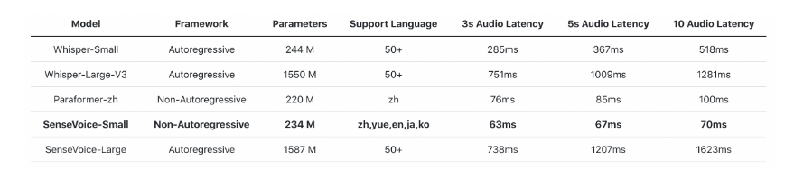

### 1 算法进展

算法最新进展，请关注：
1.算法进展表：https://alidocs.dingtalk.com/i/nodes/N7dx2rn0JbNZP2xRtdlqAyo7JMGjLRb3?doc_type=wiki_notable&iframeQuery=sheetId%3Da5mpmcw3o0a3agno7gde9%26viewId%3DRe1tn0o&rnd=0.8072404881274278

#### 1.1 Det-SAM2-项目

构建由检测模型自动提供条件约束、SAM2执行视频时空中物体追踪分割的工作流

#### 1.1.1 SAM2官网demo与Det-SAM2 pipeline效果对比

官网demo，手工在第一帧给条件提示，由SAM2自行推断广播到视频中每一帧，最终生成分割Mask：

<video src="./asset/sam2_masked_video_只在开头提示.mp4"></video>

Det-SAM2 pipeline，当前由检测模型自动地在每一帧提供条件提示，由SAM2将每一帧的条件广播到视频中的所有帧上，最终生成分割Mask：

<video src="./asset/sam2_masked_video_每帧给提示.webm"></video>

可以看到，如果只在第一帧给提示，也会存在SAM2没有分割准确的情况。但是如果由检测模型不断地给提示则可以避免这种情况。

#### 1.1.2 当前进展和需要解决的问题

已完成：

- SAM2的提示由检测模型自动生成：

  将获取YOLO的推理结果并将其转换为SAM2的条件输入

- 基于视频流的每帧推理

  允许持续地接收视频流而非只能离线加载已经录制好的视频；在接收视频流时每一帧都获取YOLO的推理结果并将其作为条件传递给SAM2进行推理

未开始：

- 实现累积视频流多帧一起处理，并且间隔检测模型的提示条件输入：

  接收视频流传入，但是允许视频累积，这样SAM2一次处理多个帧，减少传播次数；间隔检测模型的提示条件输入，实测过于频繁的条件提示会影响SAM2性能。

- 支持预加载内存库：

  允许离线条件传入，即在初始条件可以由预先加载好的视频示例（将内存库中已有视频的推理信息，使用他们对新视频进行推理）

- 限制SAM2推理传播（propagate_in_video）时只加载有限的历史帧：

  对于我们整个pipeline循环中每次传入条件时都会进行传播，后续的传播会对前面部分已经推理完成的帧进行再次重复推理（尽管这是需要修正结果时的必要措施），为了实现效率和性能的trade off，我们需要在一定程度上限制SAM2的推理传播

- 增加支持推理时添加新物体的功能：

  推理过程中如果在某一帧需要增加追踪新出现的物体，SAM2需要reset_state（）重置推理状态（清除此前记录的物体信息，重新输入新时刻所有物体，但会保留视频帧信息）。这种操作可能会影响推理连续性，我们可以通过少量修改inference_state以支持在线添加新类别

- 弥补检测模型输出的类别信息到SAM2接收的物体信息的差别：

  检测模型输出的时类别信息，即不区分多个物体哪个是哪个，只输出属于某个类别中包含多少个物体。然而SAM2只能为物体注册ID。检测模型如果将类别信息（包含多个物体）强行注册为SAM2的一个物体ID，那么以box提示的形式下会出现SAM2推理分割结果产生困惑，其Mask在多个物体上反复横跳的情况；如果以point提示的形式下，SAM2会为这个类别中所有的物体推理出同一个物体的mask，后续我们拿到这个结果也不好做后处理的区分。
  一种方式是让检测模型尽量为场景中出现的每个物体都训练一个类别，另一种方式是直接进行处理以消除类别概念到物体概念之间的鸿沟。后者的处理方式可以通过“检测结果到SAM2输入”中间插入人为设计的方法去转换，也可以通过在SAM2的prompt encoder中添加组件并训练以支持class输入。

#### 1.2. AI导游机技术选型调研

目前RAG的实现方式有两种：

1. 自构建RAG pipline（LangChain+知识处理模块+召回模块+重排模块+大模型的处理+web服务）

2. LLM 应用开发平台 （一站式 RAG+AI 工作流+Agent）

   LangChain ------有着锤子、钉子的工具箱

   Dify ------脚手架，提供了更接近生产需要的完整方案，并且经过了精良的工程设计和软件测试

   

目前口碑较好的LLM 应用开发平台：

**Dify**

Dify 是一款开源的大语言模型(LLM) 应用开发平台。它融合了后端即服务（Backend as Service）和 LLMOps 的理念，使开发者可以快速搭建生产级的生成式 AI 应用。即使你是非技术人员，也能参与到 AI 应用的定义和数据运营过程中。

由于 Dify 内置了构建 LLM 应用所需的关键技术栈，包括对数百个模型的支持、直观的 Prompt 编排界面、高质量的 RAG 引擎、稳健的 Agent 框架、灵活的流程编排，并同时提供了一套易用的界面和 API。这为开发者节省了许多重复造轮子的时间，使其可以专注在创新和业务需求上。

**RAGFlow**

RAGFlow 是一款基于深度文档理解构建的开源 RAG（Retrieval-Augmented Generation）引擎。RAGFlow 可以为各种规模的企业及个人提供一套精简的 RAG 工作流程，结合大语言模型（LLM）针对用户各类不同的复杂格式数据提供可靠的问答以及有理有据的引用。

一些Dify搭建使用：

原文

监测：

工作流编排：

本地自构建RAG调研

### STT + RAG + LLM  + TTS

### plaud

### STT

##### 	                                 					                                        						                       Whisper 可以离线部署  

##### 	                                 					                                        						                       

**最新的SenseVoice**   

##### 	                                   																			

### offline TTS

​                                                                                           ***文本正则化    ->    音素生成 ->    声码器 ->    音频合成***

### online TTS

​												**Tacotron  + WaveNet**

​												**Tacotron2**

​												**Vall-E**

​												**CosyVoice**  -> 可生成粤语

### conclude

​	

## e2e  -  a2a

  语音到语音的端到端建模，openai,google,科大讯飞。

### 2. 讨论

#### MM-SAM (Segment Anything with Multiple Modalities)  多模态SAM

SAM ----> 在数十亿规模的RGB图像mask上进行训练的预训练模型，专为光学RGB相机设计

MM-SAM -----> 基于多种视觉传感器捕获互补和配对的数据，将SAM的功能扩展到RGB相机之外，利用不同传感器的独特优势，提高感知的鲁棒性和准确性。

• 将SAM适配于跨传感器的异构数据。本文设计了无监督跨模态迁移 *Unsupervised Cross-Modal Transfer* (UCMT) ，该方法将模式特定的补丁嵌入模块和参数高效的微调整合到SAM的图像编码器中，从而促进了模式特定的传感器特征的提取。UCMT包括一个嵌入统一损失，该损失在SAM图像编码器的输出潜在空间内强制不同传感器模式间的统一表示，确保分割与提示编码器和掩码解码器的兼容性。这种简单且轻量级的设计使MM-SAM在单个模式上具有卓越的分割能力。

• 将SAM适配于协同传感器融合。我们设计了弱监督多模态融合 *Weakly-supervised Multi-Modal Fusion* (WMMF)，其特点是具有一个轻量级的选择性融合门，用于多模态嵌入的自适应融合。选择性融合门能够在复杂和动态的情况下实现有效的传感器融合，与仅使用单个模态相比，大大提高了分割的鲁棒性和准确性。

UCMT 利用来自传感器组件的未标记的多模态数据

WMMF 引入多模态伪标记来训练具有给定几何提示的选择性融合门。

通过直接将非 RGB 模态的嵌入与成对的 RGB 嵌入对齐，确保在 SAM 图像编码器的潜在空间内跨传感器模态实现统一表示。达到目的：调整 SAM 的图像编码器，使其能够处理 SAM 分割pipeline内的其他模态
