### 简单图解线性注意力机制

原文链接：https://zhuanlan.zhihu.com/p/718156896

#### 1. Linear Attention 与非必要 softmax

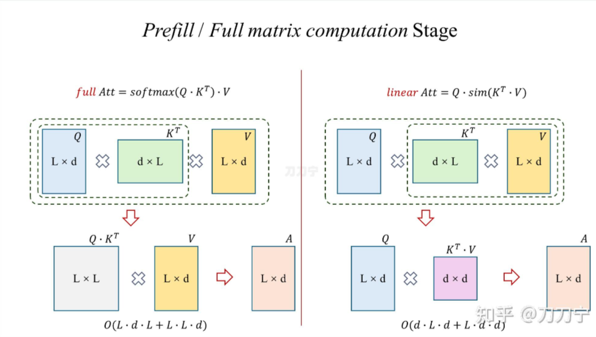

左图是我们熟悉的 full attention，矩阵乘法顺序以及计算复杂度，$L$ 是序列也就是上下文的长度，当前复杂度是 $L$ 平方级的。而右图则是将 softmax 去掉，用近似的函数 sim 来替代并且改变了 QKV 的计算顺序（这也就是本文提到的典型**线性注意力机制**）。这时神奇的事情发生了，中间结果从 $L*L$ 的矩阵变成了 $d*d$ 的，同时复杂度变成了 $d$ 平方 $L$ 线性的，（d是固定隐藏层维度，L是序列长度）整个运算过程确实和 $L$ 的长度呈线性相关性了

那么疑问来了，这只是 softmax 的原因吗？后续的深入会发现其实这和 softmax 关系不大

刚刚我们展示的是 prefill 阶段或者是整体大矩阵相乘的阶段，那么现在让我们看一下如果是在 自回归阶段或者生成阶段，一个 token 一个 token 进行输出时，矩阵计算又是怎么样的？

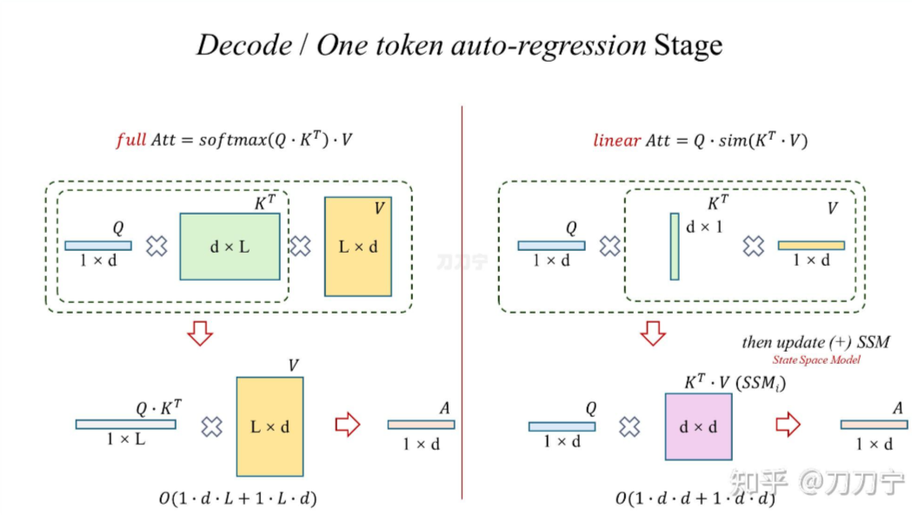

左图就是我们熟悉的 full attention 的形式，而右图则是在当前的线性注意力机制下，每一次解码时的矩阵乘法过程。略有不同的是，每一次计算出的中间结果 $d*d$ 的矩阵，是可以直接叠加到历史中间矩阵的。那么这个中间矩阵，我们可以称之为 *State Space Model* 状态空间模型 ，也就是可以理解为是一种中间状态模型，而每一次新的 SSM 则可以和之前的所有 SSM 直接进行相加。这在数学上和前面的 prefill 阶段大矩阵乘法是一样的

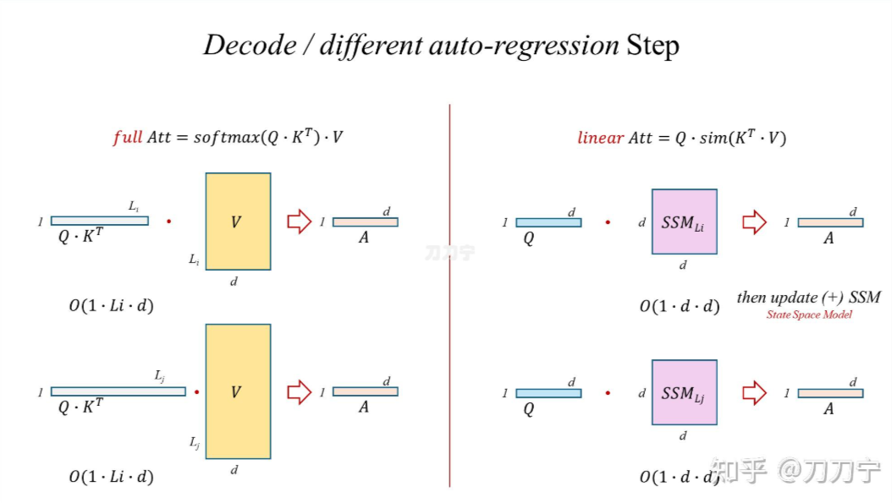

然后我们再看一下在不同长度时候，full attention 和 linear attention两者的区别，full attention 的 $L$ 在增加， attention 第二步的矩阵长度就在增加，而 linear attention 中的 SSM 大小则一直是 $d*d$。

#### 2. Linear Attention 的 state space 和 full attention 的本质区别

再进一步来看的话，full attention 因为每一次都增加了运算长度，进而保留了每一个 query 和历史上每一个生成的 token 之间的关系，而 linear attention 因为每次都在更新 SSM ，所有信息都保留在了 SSM 里，SSM 大小不变，叠加进去的具体次数的信息因为加法操作后失去了 query 的指向标签，在运行时是无法再将具体哪一次的信息单独抽取出来的。同时，既不能强调什么，也不能丢弃什么，也就是说重点也不能突出，非重点也不会忘记.

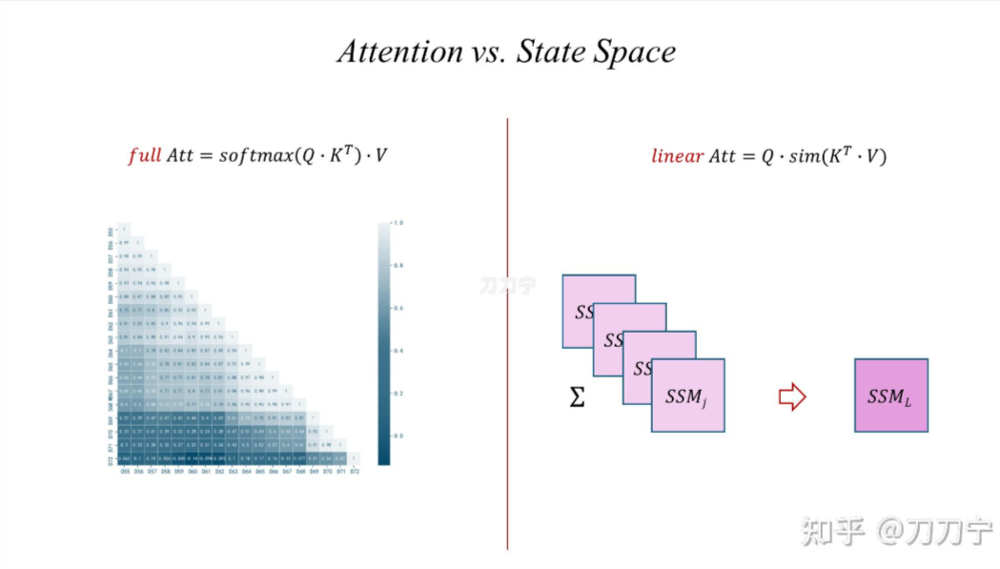

这时大家应该有所直观感受了。 softmax 除了在当次加大了重点，抛弃了非重点之外，更重要的是因为 softmax 的存在，QKV 的运算公式变成了 L 平方，进而保留了所有 token 和 token 之间的相对关系，使得信息与信息关系全部得到的完整的保留。重点的需要强调的一旦运算就得到了突出，非重点的该遗忘的多次运算后就选择了遗忘。同时，无法有效的对当前语义和之前某个具体节点进行有效的依赖。

因此，我们可以理解为 SSM 实现了对每一个历史步骤的记录和压缩，但是忽略了具体的步数索引。

#### 3. RNN、LSTM 与 cell state、state space model

这时我们自然想到了什么，RNN ！RNN 中的那个 hidden state ，就是这里的一个 state space model 的中间状态矩阵。

所以 Linear Attention Transformers 的论文名字就叫 《Transformers are RNNs: Fast Autoregressive Transformers with Linear Attention》

是不是很熟悉的感觉，RNN 也是同样面临无法有效的对当前语义与之前某个具体节点进行有效的依赖的问题，所以就有了 LSTM 这样的技术，LSTM 是长短期记忆，它通过一系列门控和组合机制，使得在下图右下图中的 hidden state space 中的状态可以根据输入捕捉到历史信息中关联最紧密的某些信息。

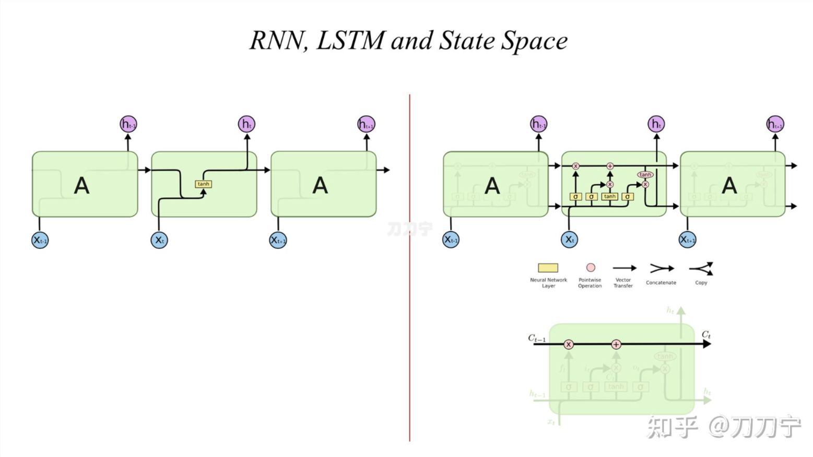

因此，大家可以发现，长短期记忆网络（LSTM）的关键在于单元状态（cell state），而这实际上就是本文中的状态空间（state space），即贯穿图顶部的水平线。单元状态类似于一条输送带，它在整个链条上持续运行，仅存在一些微小的线性相互作用。而我们需要的信息则能够以不变的、或者我们期望的状态持续流动下去。

#### 4. Linear Attention Recurrent Representation

在 RNN 和 LSTM 中的 hidden state 的暗线，我们现在可以把 Linear Attention 拿过来进行套用表示了，可以发现，和 RNN 、LSTM 来进行对比就会发现，状态线是一样的，而输入则由直接输入变成了 QKV 三类键值。而相比 full attention，KV 先乘和之前 t-1 的 SSM 进行叠加得到 t 的 SSM ，再和 Q 相乘得到输出。

#### 5. Linear Attention 的变种：Retention 与 GLA

一旦图解之后，就发现这条技术线上的几个热门方法都可以往套了

例如：[Retentive Network: A Successor to Transformer for Large Language Models](https://link.zhihu.com/?target=http%3A//arxiv.org/abs/2307.08621)

核心公式也不复杂，增加了一个用来控制对之前 SSM 状态的一个加权控制

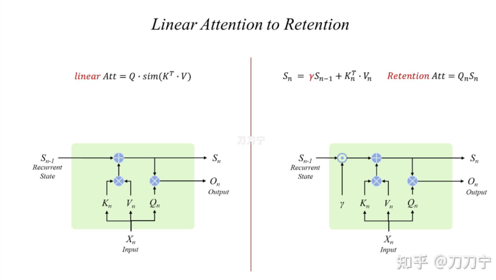

如果回到我们上面的图片逻辑表达方式上，就可以简单表达为如下图的形式：

如此简洁的结构必然存在一定的问题，其与循环神经网络（RNN）和长短期记忆网络（LSTM）具有一定的类比性，需要更为复杂的带有遗忘门（forget gate）的注意力机制/状态空间结构。并且这里的遗忘门是输入数据依赖的，并非如保留机制（retention）中人为固定的。

[Gated Linear Attention Transformers with Hardware-Efficient Training](https://link.zhihu.com/?target=http%3A//arxiv.org/abs/2312.06635)

因此，GLA 模型的结构与 LSTM/GRU 类似，其门控不依赖于上一层递归的状态，并且具有非线性结构，主要是 G 矩阵也类似 QKV 的结构得到的。在门控计算完成后，整个模型依然属于线性循环神经网络（RNN）的范畴。

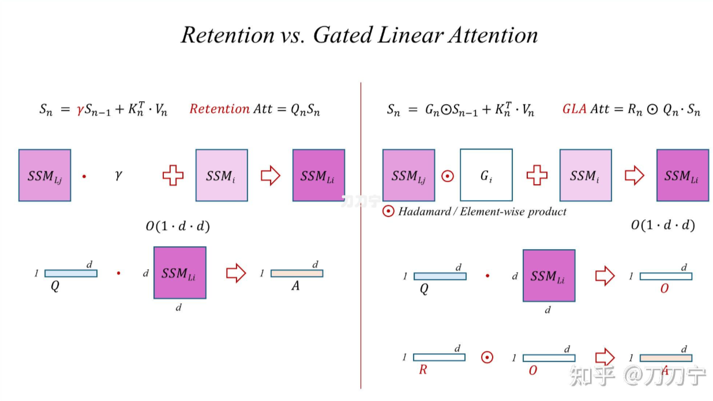

注意这里的⊙符号代表 element-wise 的计算，称为 hadamard 乘法（哈达玛积，逐元素相乘），不是矩阵乘法。

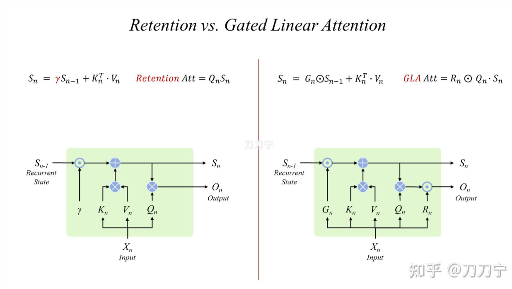

同理，我们再回到熟悉的 recurrent 表示形式上来，我们发现将公式揉出来的对应结构图，变复杂不少，输入输出各增加了一个新的门控机制。GLA 应当也算当下效果较好的 Linear Attention 的改进版。

#### 6. Mamba

Mamba 结构其实和 Linear Attention 关系不大，和 RNN 系列更像，我们今天在这里一起进行一下类比。

先看一下 Mamba 的 S4 结构，S4 结构的公式本身并不复杂，我们可以根据公式简单的对 其 recurrent 结构进行表示（这个图严格意义上说不是非常准确）。这里的 ABCD 四个矩阵，其中 A 是一个结构化的 HiPPO 矩阵，其作用是为了对 hidden state 进行加权。

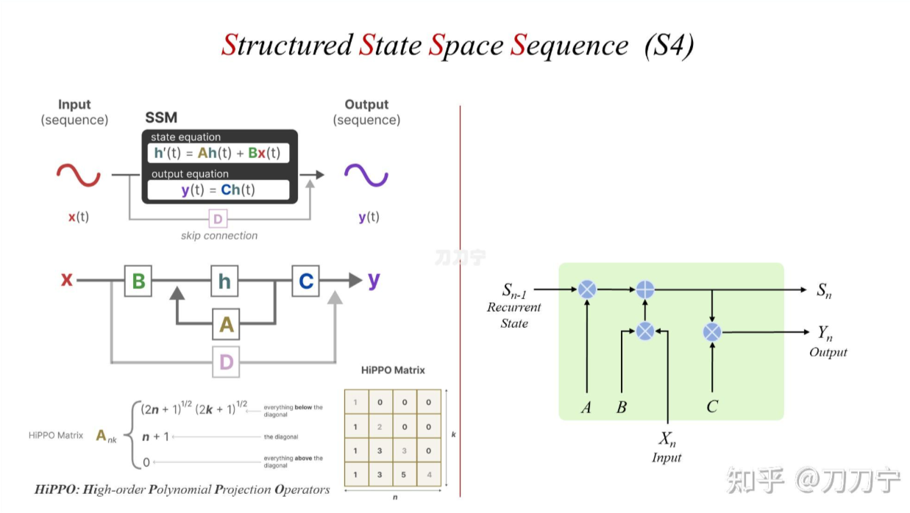

接下来我们看一下 S4 到 S6，主要是增加了 selective 和 scan 两类操作，S4 的问题在于线性不变性（Linear Time Invariance）中，SSM 依赖的 A、B 和 C 不会随不同的输入而变化。

而 selective 的处理方式是给这每个维度或者叫做每个通道都维护一个独立的 SSM。这个维度或者通道当然是模型设计者手工设计出来的，但是其物理含义也是显而易见，不同的维度维护了不同的信息，这和 [multihead](https://zhida.zhihu.com/search?content_id=247720361&content_type=Article&match_order=1&q=multihead&zhida_source=entity) Attention 中不同的注意力头，维护了不同的注意力，是一样的。

而 scan 更多是为了支持在 selective 机制下进行 parallel 处理时候的加速过程。细节不展开了。

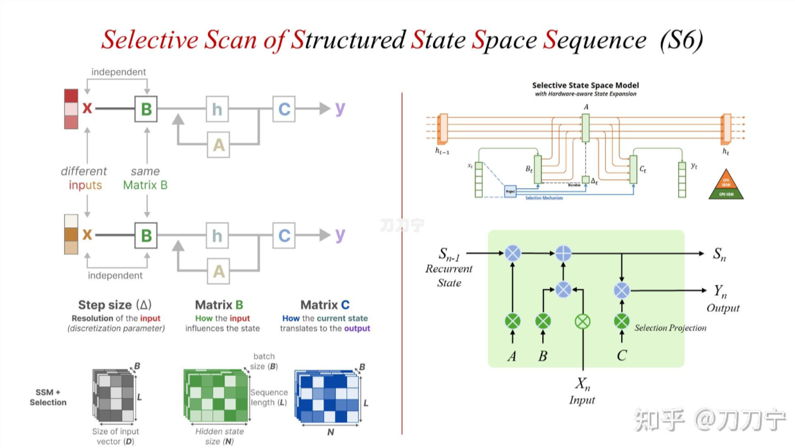

有了 selective 和 scan 机制之后，mamba 模型就可以更加高效的、有选择性的关注必须关注的、过滤掉可以忽略的，信息。

#### 7. Mamba-2

Mamba 很火，学术界水文神器，但是实测效果一言难尽，现在又出来了 Mamba2，其中提出了一些新的概念，如 SSM 衍生的 SSA、SSD。作者是 Tri Dao 和 Albert Gu，和Mamba 一样。题目直接就是：Transformers are SSMs，[arXiv 2405.21060](https://link.zhihu.com/?target=http%3A//arxiv.org/abs/2405.21060)

其中，SSA 是 state space Attention，SSD 是 state space duality，好玩吧，大家又碰头了，前面我们提到 mamba 的结构中，没有 QKV，好，现在他来了，闪亮登场。

我们可以理解 SSD 是个 dual model 的双模逻辑。Mamba-2 的 SSD 设计初衷，从大的逻辑上看，是个 full Attention 结构，但是通过各种 mask 和分块模式，将整体转换为一个有一个小的分块，每一个分块内部则是一个“线性”的 SSM 模式。SSD 就如上图右图中的重叠部分，即有 SSM 的特点又有 SMA 的特点。

在下图左图来看，希望通过画图可视化所有方法成为一种 recurrent 形式的表示。而下图右图则将几个常见方法放回 full attention的下三角矩阵，通过 Mask 和权重颜色，完成对这些方法的一种统一表示。

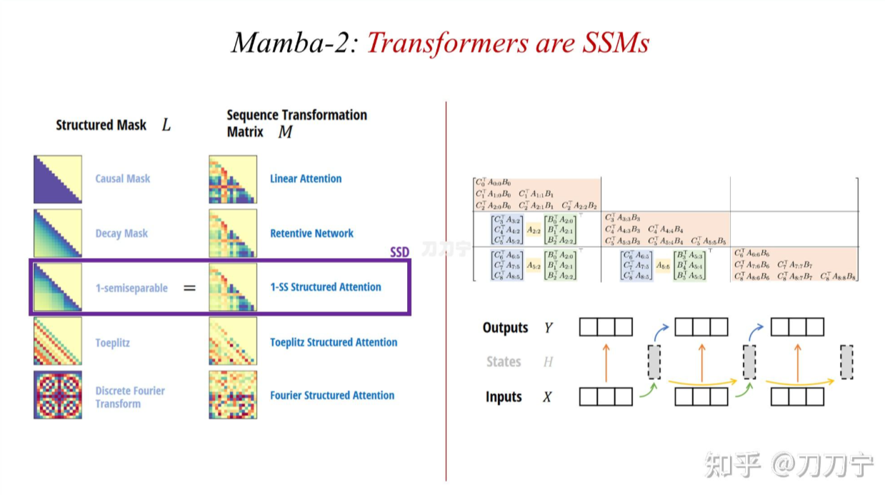
例如，前面我们分析的 retentive 网络事实上就是一种从中间三角逐渐向左下角衰减的权重形式。而今天 SSD 想用的方法则是通过 1-SS 这种方式，形成一种分块的、逐渐衰减的、可以控制的注意力机制。而具体实现上，则是通过分块后的局部低秩（Low-Rank)矩阵的方法。

这样也从另外一个角度说明，从底层数学角度，recurrent 和 full attention 都可以用统一的方式进行描述和表达。Transformers are RNNs，Transformers are SSM

当然，这只是 Mamba-2 注意力模块的部分，关于 Mamba 的全流程框架，以及一些细节，比如 multihead SSM 等等，本文暂且不表。另外，本文作者认为，Mamba2 有点过于复杂了，雕花味道太冲了，并且它硬要把 full attention 的优势点往 mamba 这种纯 rnn 模型上怼，说好听是 dual 双模，说不好听就是变相承认 mamba 不太行。并且这几个月来看，业界反应也是不温不火。

#### 8. RWKV

最后，大火的 RWKV。

从结构图可以看出，RWKV 中的 time mixing 模块，就是我们本文比较关注的重点。如何通过 SSM 的 hidden state，来将我们熟悉的 Transformer 中的 Attention 部分替换为 RWKV 独有的 recurrent 方式。所以，RWKV就是一个的线性 RNN 模型，算不算和 GLA 相类似的结构，表面上肯定是不一样的，底层逻辑上是否相似或有本质区别，本文研究不够深入暂时先不能做出判断。

### Google 最新 Titans 模型中的长时记忆机制

------

论文标题：Titans: Learning to Memorize at Test Time

论文地址：https://arxiv.org/pdf/2501.00663v1

#### 摘要 abstract

关于如何有效利用 RNN 和 Attention，人们在近十年进行了广泛的研究工作。虽然循环神经网络旨在将数据压缩到固定大小的内存（称为隐藏状态）中，但 Attention 允许关注整个上下文窗口，捕获所有标记的直接依赖关系。种更准确的依赖关系建模带来了二次成本，将模型限制在固定长度的上下文中。

本文提出了一种新的神经长期记忆模块，并证明该模块具有快速可并行训练的优势。本文将传统 Attention 作为短期记忆，将提出的神经长期记忆模块充当长期记忆。并对比了Titans模型中长期记忆模块不同插入方式的三种变体。

#### 导言 Introduction

大多数现有架构将记忆视为由输入引起的神经网络更新，并将学习定义为在给定目标情况下获得有效和有用记忆的过程。这个观点可以帮助我们更好地理解现有范式中的关键差异：例如线性Transformers与Transformer之间的主要区别在于记忆结构以及记忆更新步骤，其中线性Transformers将历史数据压缩到固定大小的矩阵值内存中，而Transformers保留所有历史数据（在上下文长度内）而不进行任何压缩。

虽然线性Transformer和线性RNN（包括状态空间模型State Space Model）都在内存更新步骤中压缩信息，但关键区别在于记忆的结构，其中线性RNN（相对于线性Transformer）使用向量值记忆（相对于矩阵值记忆）。因此，这个观点促使我们问：

- **Q1** 什么构成了记忆的良好结构？
- **Q2** 什么是适当的记忆更新机制？
- **Q3** 什么是好的记忆检索过程？

记忆不是一个单一的过程也不是单一的功能，事实上，记忆是系统的集合——短期记忆、工作记忆、长期记忆——每个系统都有不同的功能且能独立与合作。这一事实促使我们继续提出以下问题：

- **Q4** 如何设计一个包含不同互联记忆模块的高效架构？

最后，存储记忆是一个神经网络过程，需要编码和存储过去的摘要。假设单个向量或矩阵（其参数以线性方式编码数据）足以存储长期历史记录，这可能过于简单化。

- **Q5** 是否需要深度记忆模块来有效地存储/记住很久以前的内容？

#### 背景 Preliminaries

文中首先回顾了Transformer中自注意力机制：
$$
Q = x W_Q, \quad K = x W_K, \quad V = x W_V   
\tag{1}
$$

$$
y_i = \frac{\sum_{j=1}^i \exp\left(Q_i^\top K_j / \sqrt{d_{in}}\right) V_j}{\sum_{\ell=1}^i \exp\left(Q_i^\top K_\ell / \sqrt{d_{in}}\right)}
\tag{2}
$$

> **定义变量**：
>
> - 输入变量 x：是输入序列，每个时间步是一个向量，表示模型接收到的特征。
>
> - 投影矩阵 $W_Q, W_k, W_V$ :
>
>   $W_Q$：用于将输入 x 投影为查询向量（Query）
>
>   $W_K$：用于将输入 x 投影为键向量（Key）
>
>   $W_V$：用于将输入 x 投影为值向量（Value）
>
> - 生成的中间向量 :
>
>   Q：查询矩阵，通过 $Q=xW_Q$ 计算得到
>
>   K：键矩阵，通过 $K=xW_K$ 计算得到
>
>   V：值矩阵，通过 $V=xW_V$ 计算得到
>
> 自注意力的核心是计算每个序列元素与其他元素的相似性，然后用这个相似性分布对值向量加权求和，结果用作最终的输出表示。
>
> **具体公式解释**：
>
> 对于第$i$个时间步，输出$y_i$的计算方式如下：
> $$
> y_i = \frac{\sum_{j=1}^i \exp\left(Q_i^\top K_j / \sqrt{d_{in}}\right)}{\sum_{\ell=1}^i \exp\left(Q_i^\top K_\ell / \sqrt{d_{in}}\right)} V_j
> $$
>
> - 查询 $Q$ 与键 $K$ 的点积：
>
>   $Q_i^\top K_j$ : 表示查询向量 $Q_i$ 和键向量 $K_j$ 的点积
>
>   通过点积计算 $i$-位置与 $j$-位置的相关性
>
> - 缩放因子：
>
>   $d_{in}$: 为了缓解点积值过大引起的梯度不稳定问题，进行缩放。这里 $d_{in}$ 是查询和键的维度。
>
> - 指数和归一化：
>
>   $\exp\left(Q_i^\top K_j / \sqrt{d_{in}}\right)$: 将点积相似性值转化为非负数，表示 $i$ 和 $j$ 位置的注意力分数
>
>   分母是所有前 $i$ 个位置的注意力分数的总和，用来归一化
>
> - 值向量加权求和：
>
>   归一化的注意力分数 $\frac{exp⁡(...)}{∑...}$ 对对应的值向量 $V_j$ 进行加权求和，得到输出 $y_i$。
>
> **上下标说明**：
>
> - $Q_i$ : 表示第 $i$ 个位置的查询向量
>
> - $K_j$ : 表示第 $j$ 个位置的键向量
>
> - $\ell$ : 表示归一化时对前 $i$ 个位置的键向量遍历
> - $y_i$ : 表示第 $i$ 个位置的输出
>
> - 求和范围 $\sum_{j=1}^i$ :
>
>   表示只考虑当前及之前的位置，适用于因果注意力机制，确保未来的信息不被使用（例如在语言模型中处理序列预测任务时）
>
> **直观理解**:
>
> - 查询-键相似度：
>
>   通过查询向量 $Q_i$ 和键向量 $K_j$ 计算序列中位置 $i$ 和 $j$ 的相关性。
>
> - 加权求和：
>
>   用这个相似性分布对值向量 $V_j$ 进行加权，得到第 $i$ 个位置的输出。 这种机制允许模型根据上下文动态调整注意力分布，专注于输入序列的相关部分，是 Transformer 的核心计算步骤。

其中 $W_Q,W_K,W_V ∈ R^{𝑑_{in} × 𝑑_{in}}$ 是可学习参数。 尽管其在召回方面具有强大的能力和有效性，但Transformer至少需要 $N × d$ 次操作来计算输出，这导致对于更长的序列，其内存消耗更大，吞吐量更低。

为了降低长序列中softmax注意力机制的内存消耗并提高吞吐量，众多设计出更多通过稀疏化注意力矩阵、近似softmax或开发基于核函数（线性）的注意力机制。在本部分我们重点关注后者——线性注意力机制 Linear Attention，在这种机制中，标准注意力中的softmax被替代为另一种核函数。相应地注意力可以表示为：
$$
y_i 
=
\sum_{j=1}^i
\frac{
\phi(Q_i^\top K_j) V_j
}{
\sum_{\ell=1}^i \phi(Q_i^\top K_\ell)
}
=
\sum_{j=1}^i
\frac{
\phi(Q_i)^\top \phi(K_j) V_j
}{
\sum_{\ell=1}^i \phi(Q_i)^\top \phi(K_\ell)
}
=
\frac{
\phi(Q_i)^\top \sum_{j=1}^i \phi(K_j) V_j
}{
\phi(Q_i)^\top \sum_{\ell=1}^i \phi(K_\ell)
}

\tag{3}
$$
> **主要符号解释**：
>
> - 输入向量和投影：
>
>   $$Q_i,K_j,V_j$$ : 查询/键/值 向量（Query/Key/Value），分别表示第 $i$ / $j$ / $j$ 个序列的特征信息
>
>   $\phi(·)$ : 特征映射函数，用于将输入向量投影到一个新的空间，通常是非线性变换
>
> - 点积注意力的改进:
>
>   传统自注意力使用 $exp⁡(Q_i^⊤ K_j / \sqrt{d})$ 来计算点积相似度，而这里引入了特征映射 $ϕ(⋅)$，从而以更加高效的方式计算点积相似度。
>
> - 归一化因子:
>
>   分母 $\sum_{\ell=1}^i \phi(Q_i^\top K_\ell)$ 表示当前 $i$ 个位置的所有键向量 $K_ℓ$ 与查询 $Q_i$ 的相似度总和，用于归一化注意力权重。
>
> - 值加权求和:
>
>   分子 $\sum_{j=1}^i \phi(Q_i)^\top \phi(K_j) V_j$ 表示每个键向量的权重（与 $Q_i$ 的相似度）对对应值向量 $V_j$ 的加权求和。
>
> **逐步分解解释**：
> $$
> y_i 
> =
> \frac{
> \phi(Q_i)^\top \sum_{j=1}^i \phi(K_j) V_j
> }{
> \phi(Q_i)^\top \sum_{\ell=1}^i \phi(K_\ell)
> }
> $$
>
> - 相似度计算：
>
>   $\phi(Q_i)^\top \phi(K_j)$ 表示查询 $Q_i$ 和键 $K_j$ 在特征空间的相似度
>
> - 加权求和：
>
>   将相似度作为权重，对值向量 $V_j$ 进行加权求和，表示通过查询 $Q_i$ 对历史序列的信息聚合。
>
> - 归一化：
>
>   用 $\phi(Q_i)^\top \sum_{\ell=1}^i \phi(K_\ell)$ 对加权求和结果进行归一化，确保输出 $y_i$ 是一个有效的概率分布表示。
>
> - 最终形式：
>
>   通过将分子和分母表示为矩阵形式，进一步优化计算复杂度，适合处理长序列
>
> **优化特点**：
>
> - 特征映射 $\phi(·)$ : 
>
>   使用特征映射 $\phi$ 替代直接点积操作，能够减少计算开销，尤其适用于长序列。常见的 $\phi$ 选择包括核函数或基于稀疏化的近似方法
>
> - 因果结构 : 
>
>   求和范围 $j=1$ 到 $i$，限制了当前输出 $y_i$ 只依赖过去及当前的信息，保证了因果性
>
> - 矩阵形式简化 ：
>
>   通过将加权求和和归一化写为矩阵运算，可以进一步提高实现效率

由于在每一步中都重复使用了 $\sum_{j=1}^i \phi(K_j)$ 和 $\sum_{\ell=1}^i \phi(K_\ell)$ 这两个项，从而实现了更高的吞吐量。当选择核函数 $\phi$ 为单位矩阵时，上述公式也可以写成递归格式，这使得对线性注意力进行高效推理成为可能：
$$
M_t = M_{t-1} + K_t^\top V_t
\tag{4}
$$

$$
y_t = Q_t M_t
\tag{5}
$$

> $$
> y_i =\frac{\phi(Q_i)^\top \sum_{j=1}^i K_j V_j}{\phi(Q_i)^\top \sum_{j=1}^i K_j}
> $$
>
> 为了避免重复计算累积和，定义累积变量，并将其引入递归形式。
>
> **定义累积矩阵**：
>
> 定义一个累积矩阵 $M_t$，表示到当前时间 $t$ 为止的所有加权和值的累积：
> $$
> M_t = \sum_{j=1}^t K_j^\top V_j
> $$
> 根据递归的性质，我们有：
> $$
> M_t = M_{t-1} + K_j^\top V_j
> $$
> 其中 $M_{t-1}$ 是上一时间步的累积结果，$K_j^\top V_j$ 是当前时间步键和值的贡献。这个递归公式避免了每次都计算和重新求和 $\sum_{j=1}^t$ ，而是通过增量更新。
>
> 根据累积结果 $M_t$ , 可以直接计算出：
> $$
> y_t = Q_t M_t
> $$
> 这是因为归一化因子在特定场景（如选择线性核函数）可以省略，或者被吸收到权重更新中。

现代线性模型将循环神经网络（RNN）的隐藏状态视为一个记忆单元，模型旨在将信息压缩到该记忆单元中。因此，在一般形式的循环神经网络中，隐藏状态可以被视为一个记忆单元，循环（递归）过程可以拆分为读和写操作。即，我们让 $x \in \mathbb{R}^{N \times d_{in}}$ 是输入，$M \in \mathbb{R}^d$ 是记忆单元，$y \in \mathbb{R}^{d_{in}}$ 是输出，那么循环神经网络的一般形式可以定义为：
$$
M_t = f(M_{t-1}, x_t) \hspace{2cm} 
\text{\textcolor{gray}{Write}} \hspace{0.1cm} \text{\textcolor{gray}{Operation}}
\tag{6}
$$

$$
y_t = g(M_t, x_t)  \hspace{2.8cm} 
\text{\textcolor{gray}{Read}} \hspace{0.1cm} \text{\textcolor{gray}{Operation}}
\tag{7}
$$

其中 $f(...)$ 是读取函数，$g(...)$ 是写入函数。这里的 $M_t$ 表示时间 $t$ 时记忆的状态。

从这个角度看，线性Transformer的递推公式（公式4）相当于将键值 ($K_t, V_t$) 加性压缩并写入矩阵值的存储单元 $M_t$​ 中。因此，在处理长上下文数据时，这种加性性质的过程会导致记忆溢出，严重损害模型性能。为了解决这个问题，研究主要集中在两个有前景的方向上：
（1）添加遗忘机制：为线性模型提出了自适应（数据依赖）的遗忘门机制，当需要时可以清除记忆。此类模型包括 GLA、LRU、Griffin、xLSTM 和 Mamba2 。
（2）改进写入操作：为了克服传统递归模型（RNN）中记忆写入操作的加性性质，在添加记忆（即键值对）之前，模型会先清除其过去的值。

#### 测试时学习记忆 Learning to Memorize at Test Time

为了克服长期记忆的缺失，本节中，我们提出了一种神经长期记忆模块，这是一种能在测试时学习记忆的元模型。在本结第一部分中我们首先讨论神经记忆的动机和设计。在本节第二部分探讨了我们的设计如何从快速且可并行化的训练中收益，在最后一部分我们进行扩充。

##### 长期记忆 Long-termMemory

我们需要一个在线的元模型，它能学习在测试期间如何记忆/遗忘数据。在这种设置下，模型正在学习一种能够记忆的功能，而不会仅仅离线地拟合训练时的数据从而限制其在测试数据上的泛化能力。

- 学习过程与意外度量

对于人类而言，违背预期（即令人意外）的时间更令人难忘。受此启发，对于模型而言，意外的一个简单定义可以是相对于输入的梯度。梯度越大，输入数据与过去数据的差异就越大。因此，利用这一意外度量，我们可以对记忆进行更新，具体方式如下：
$$
M_t = M_{t-1} - \theta_t \underbrace{\textcolor{purple}{\nabla \ell(M_{t-1}; x_t)}}_{\text{Surprise}}
\tag{8}
$$
然而这种意外指标可能会导致错过重大意外时刻之后的重要信息，即经历几次意外步骤后梯度变得极小，从而陷入平坦区域（局部最小值），并错过序列中某些部分的信息。从人类记忆的角度看，尽管某个事件令人难忘，但它可能不会在很长的一段时间内持续令人感到意外。为了改进上述意外读指标（公式8），我们将意外度指标分解为（1）过去意外度，用于衡量最近过去的意外程度；（2）即时意外度，用于衡量新输入数据的意外程度：
$$
M_t = M_{t-1} + \textcolor{purple}{S_t}
\tag{9}
$$

$$
S_t = \eta_t \underbrace{\textcolor{purple}{S_{t-1}}}_{\text{PastSurprise}} - \theta_t  \underbrace{\textcolor{purple}{\nabla \ell(M_{t-1}; x_t)}}_{\text{MomentarySurprise}} 
\tag{10}
$$

有趣的是，这种公式与带有动量的梯度下降法类似，其中 $S_t$ 为动量元素。因此，这里的动量起到了对时间（序列长度）内意外情况的记忆作用。在这个公式中，$\eta_t$ 是数据相关的意外衰减（取决于$X_t$）,控制意外情况随时间衰减程度，而 $\theta_t$ 则控制应以数据相关的方式将多少即时意外情况纳入最终的意外度量中。这种数据相关性在这个设计中尤为重要：虽然先前 tokens 的意外情况可能会影响后续 tokens 的意外情况，但只有所在 tokens 都相关且处于相同上下文中时才有效。因此，数据相关的 $\eta$ 可以控制记忆是否需要：
（1）通过将 $\eta_t → 0$ 来忽略上一次意外情况（可能是由于上下文变化），或者（2）通过设置 $\eta_t → 1$ 完全纳入上一次的意外情况（可能是因为该 tokens 与其最近的 past tokens 高度相关）。

我们上述的意外度量是基于一个损失函数 $\ell(.;.)$，该损失函数是我们的记忆模块在学习如何在测试时执行的目标函数。也就是说，我们的记忆模块是一个元模型，它学习基于损失函数 $\ell(.;.)$ 的函数。

在本研究中，我们专注于关联记忆，其中我们旨在将过去的数据存储为键值对。给定 $x_t$，我们使用两个线性层将 $x_t$ 投影到键和值上：
$$
k_t = x_t W_K,\hspace{2cm}v_t = x_t W_V,
\tag{11}
$$
其中，$W_K$和 $W_V ∈ ℝ^{d_{in} \times d_{in}}$。接下来，我们期望我们的记忆模块学习键和值之间的关联。为此，我们定义损失函数如下：
$$
\ell(M_{t-1}; x_t) = \|M_{t-1} (k_t) - v_t\|^2_2
\tag{12}
$$

> 这是一个用于计算损失的公式，目标是通过优化累积矩阵 $M_{t−1}$ 来减少预测值和目标值之间的误差。
>
> **符号定义:**
>
> - 损失函数 $\ell(·)$ :
>
>   $\ell(M_{t-1}; x_t)$ 表示在当前时间步 $t$，给定累积矩阵 $M_{t−1}$ 和输入 $x_t$ 时的损失
>
> - 累积矩阵 $M_{t−1}$ :
>
>   表示到时间 $t-1$ 的累积结果。它总结了之前时间步中的所有历史信息，并以矩阵的形式表示
>
> - 输入 $x_t$ :
>
>   包括当前时间步的键 $k_t$ 和值 $v_t$，其中 $k_t$ 为当前时间步的键向量，$v_t$ 为当前时间步的目标值向量
>
> - 预测值：
>
>   $M_{t-1} (k_t)$ 为累积矩阵 $M_{t-1}$ 作用于键 $k_t$ 后，产生的预测值
>
> - 目标值 $v_t$ ：
>
>   表示当前时间步的真实目标值向量
>
> **公式的意义:**
>
> - 核心思想：
>
>   这个公式的目的是通过损失函数 $\ell$，衡量累积矩阵 $M_{t−1}$ 在预测当前值 $v_t$ 的准确性；
>   $M_{t-1} (k_t)$ 是对 $v_t$ 的预测，公式衡量了预测值与真实值的差距
>
> - 优化目标：
>
>   最小化损失 $\ell(M_{t-1}; x_t)$ ，即通过调整 $M_{t-1}$ ，使预测值 $M_{t-1} (k_t)$ 尽可能接近目标值 $v_t$
>
> - 递归性：
>
>   $M_{t-1}$ 是时间 $t-1$ 的累积结果，优化损失函数会间接影响下一时间步 $M_t$ 的更新
>
> - 在线下学习：
>
>   随着时间 $t$ 的推进，不断更新 $M_{t−1}$，以更好地适应未来的键-值关系

通过优化我们元模型（记忆）中的上述损失函数，模型学习如何在测试时记住键和值之间的映射。需要注意的是，类似于元学习模型，记忆的训练是在内循环中进行的，因此参数 $𝑊_𝐾$ 和 $𝑊_𝑉$ 是上述损失函数中的超参数。因此，在内循环中，我们优化 $M$ 的权重，而在外循环中，我们优化整个架构的其他参数。

- 遗忘机制

我们使用了一种自适应遗忘机制，使得记忆能够忘记不再需要的信息，从而更好地管理记忆的有限容量。也就是说，给定下一个token $𝑥_𝑡$，我们修改更新规则如下：
$$
M_t = (1 - \alpha_t) M_{t-1} + \textcolor{purple}{S_t},
\tag{13}
$$

$$
S_t = \eta_t \textcolor{purple}{S_{t-1}} - \theta_t \textcolor{purple}{\nabla \ell(M_{t-1}; x_t)},
\tag{14}
$$

其中，$𝛼_𝑡 ∈ [0,1]$ 是一个门控机制，灵活地控制记忆的更新，即决定应忘记多少信息。例如，通过让 $𝛼_𝑡 → 0$，它可以在不影响过去特征的情况下更新记忆；而通过让 $𝛼_𝑡 → 1$，它可以清除整个记忆。

- 记忆架构

在本文中，我们将焦点放在简单的 MLP（多层感知机）上，其中 $L_M ≥ 1$ 层作为我们长期记忆的架构。选择这一架构的主要原因是我们希望更好地阐述长期记忆的设计动机以及它如何被融入架构中。然而，我们的公式和架构设计开辟了一个新的研究方向，即设计在数据记忆方面更有效率和高效的神经网络架构。

当使用向量值或矩阵值记忆时，记忆模块会压缩过去的数据并将其拟合到一条线上。也就是说，从元学习或在线学习的角度来看，使用矩阵值记忆 $𝑀 = 𝑊 ∈ ℝ^{d_{in} \times d_{in}}$ 相当于优化损失函数：$$ \ell(W_{t-1}; x_t) = \|W_{t-1} k_t - v_t\|_2^2 $$ 。这是一个在线线性回归目标，因此最优解假设历史数据之间的依赖关系是线性的。另一方面，我们认为深度记忆模块（即 $L_M ≥ 2$）具有更高的效能。与理论结果一致，即至少两层的 MLP 比线性模型具有更强的表达能力，在后续的实验中，我们展示了深度记忆模块在实践中更有效。

- 检索记忆

在上述内容中，我们讨论了如何设计和训练一个长期记忆模块，使其能够在测试时学习并记住信息。一个关键的未解问题是：如何从记忆中检索信息？我们简单地使用前向传播（即推理）来检索与查询对应的记忆。正式地说，给定一个输入 $𝑥_𝑡$ ，我们使用一个线性层 $𝑊_𝑄$ 来对输入进行投影，即 $q_t = x_t W_Q$，然后通过以下方式从记忆中检索相应的（或有用的）信息：
$$
y_t = M^*(q_t)
\tag{15}
$$

##### 如何并行化长期记忆训练 How to Parallelize the Long-term Memory Training

图一注：神经记忆训练如何并行进行并使用矩阵乘法（matmuls)的示意图。

如上所述，我们的长期记忆模块的设计相当于通过优化关联记忆损失函数 $\ell(M_{t-1}; x_t) = \|M_{t-1}(k_t) - v_t\|_2^2$ 来训练一个元模型，采用带动量和权重衰减的梯度下降。因此，理论上，长期记忆模块的训练需要 $O(N)$ 次浮点运算（FLOPs），其中 $N$ 是序列长度。然而，在实践中，我们需要并行化训练过程，并充分利用硬件加速器，因此我们需要张量化过程并使用更多的矩阵乘法（matmuls）。

接下来，我们展示了如何通过小批量梯度下降、数据依赖的学习率和权重衰减来计算内循环中的权重，这些可以被重构为仅使用矩阵乘法和求和操作。我们基于前人的工作，表明优化模型的前向传播（使用常数学习率的小批量梯度下降）可以通过矩阵乘法计算。我们可以将序列拆分为大小为 $b \geq 1$ 的块，并将小批量（mini batch）梯度下降写为：
$$
M_t = (1 - \alpha_t)M_{t-1} - \theta_t \nabla \ell(M_{t-1}; x_t) = \beta_t M_0 - \sum_{i=1}^{t} \theta_i \frac{\beta_t}{\beta_i} \nabla \ell(M_{t'}; x_i)
\tag{16}
$$
> **符号定义**：
>
> - $M_t$ 表示第$t$次迭代时模型的权重
> - $(1 - \alpha_t)M_{t-1}$ 表示权重的衰减部分，$\theta_t \nabla \ell(M_{t-1}; x_t)$ 表示权重的更新部分，$\theta_t$ 是学习率，$\nabla \ell(M_{t-1}; x_t)$ 是损失函数在当前权重和数据点 $x_t$ 下的梯度
> - $\beta_i = \prod_{j=1}^{i}(1 - \alpha_j)$ 是衰减稀疏的累积乘积，它反映了从初始权重到当前权重的衰减程度。
> - $M_{t'}$ 中的 $t' = t - \text{mod}(t, b)$ 是为了将序列拆分成大小为 $b=\text{batchsize}$ 的块，*t*′ 表示当前块的起始位置。
>
> **计算步骤**，对于每次迭代 $t = 1,2, ...,T$ ：
>
> - 计算当前的衰减系数 $\beta_i = \beta_{t-1}(1 - \alpha_t)$  
>
> - 计算当前的梯度 $\nabla \ell(M_{t'}; x_i)$ ，其中 $t' = t - \text{mod}(t, b)$ 是当前块的起始位置
>
> - 计算当前的梯度更新项 $\theta_t \frac{\beta_t}{\beta_t} \nabla \ell(M_{t'}; x_t) = \theta_t \nabla \ell(M_{t'}; x_t)$ 
>
> - 将当前的梯度更新项加入到累积和中，即:
>   $$
>   \sum_{i=1}^{t} \theta_i \frac{\beta_t}{\beta_i} \nabla \ell(M_{t'}; x_i)
>   =
>   \sum_{i=1}^{t-1} \theta_i \frac{\beta_t}{\beta_i} \nabla \ell(M_{t'}; x_i)
>   +
>   \theta_t \nabla \ell(M_{t'}; x_t)
>   $$
>
> - 更新权重 $M_t = \beta_t M_0 - \sum_{i=1}^{t} \theta_i \frac{\beta_t}{\beta_i} \nabla \ell(M_{t'}; x_i)$

其中 $t' = t - \text{mod}(t, b)$，并且 $\beta_i = \prod_{j=1}^{i}(1 - \alpha_j)$。为了简便起见，我们专注于第一个块，即 $t = b$，因此 $t' = 0$。此外，我们解释在 $M_t = W_t$ 线性情况下的过程。对于具有 $N_p \geq 2$ 的 MLPs，过程类似。使用我们的损失函数，我们得到：
$$
\nabla \ell(W_0; x_t) = (W_0 x_t - x_t) x_t^\top \Rightarrow \sum_{i=1}^{b} \theta_i \frac{\beta_b}{\beta_i} \nabla \ell(W_0; x_i) = \Theta_b B_b(W_0 X - X) X^\top
\tag{17}
$$
> **符号定义**：
>
> - $\nabla \ell(W_0; x_t) = (W_0 x_t - x_t) x_t^\top$ : 这是在第 $t$ 个数据点 $x_t$ 上，损失函数 $\ell$ 关于权重 $W_0$ 的梯度。假设以平方损失，即 $\ell(W_0; x_t) = \|W_0 x_t - x_t\|^2_2$ 。因此，梯度是 $(W_0 x_t - x_t) x_t^\top$ 
> - $\sum_{i=1}^{b} \theta_i \frac{\beta_b}{\beta_i} \nabla \ell(W_0; x_i)$ : 这是在小批量中，从第 1 个数据点到第 $b$ 个数据点的梯度更新的累积和。其中，$\theta_i$ 是第 $i$ 个数据点的学习率，$\beta_b$ 和 $\beta_i$ 是衰减系数的累积乘积，$\nabla \ell(W_0; x_i)$ 是第 $i$ 个数据点的梯度
> - $\Theta_b = \text{diag}(\theta_1, \theta_2, \dots, \theta_b)$ :  这是一个对角矩阵，对焦线上的元素是每个数据点的学习率
> - $B_b$ : 这是一个矩阵，其元素定义在 $\frac{\beta_b}{\beta_i}$ 上，反映了不同数据点衰减程度差异
> - $W_0 X - X$ : 权重 $W_0$ 下的预测误差
>
> - $(W_0 X - X) X^\top$ : 这是一个矩阵，每一列都是 $(W_0 X - X)$ 中的一个预测误差向量与 $X^\top$ 的一个数据点的外积。这个外积矩阵反映了预测误差在数据空间中的分布情况，通过计算这个外积矩阵，我们可以得到梯度方向

其中 $\Theta_b = \text{diag}(\theta_1, \theta_2, \dots, \theta_b)$，$B_b$ 类似地定义在 $\frac{\beta_b}{\beta_i}$ 上。需要注意的是，我们不需要存储所有的学习率矩阵 $\Theta_{kb}$ 和权重衰减矩阵 $B_{kb}$（对于 $k = 1, \dots, N/b$），而是为每个块存储这些矩阵，从而减少内存使用。接下来，我们扩展这个表示，使得我们也能包含动量项。在具有动量的小批量梯度下降中，如果我们查看动量项，我们得到：
$$
S_t = \eta_t S_{t-1} - \theta_t u_t
\tag{18}
$$
其中 $u_t = \nabla \ell(M_{t'}; x_t)$。需要注意的是，我们可以同时计算所有的 $u_t$，因此方程（公式18）是一个线性递归，$u_t$ 作为输入，$S_t$ 作为隐藏状态，$\eta_t$ 作为输入依赖的过渡值。因此，我们可以使用并行的关联扫描来计算这个块中的 $S_t$。

-  参数作为Chunks的函数 Parameters as the Function of Chunks.

参数作为块的函数，而不是让参数如 $$\alpha_t$$, $$\theta_t$$ 和 $$\eta_t$$ 依赖于输入（作为 token $$x_t$$ 的函数），我们可以将它们定义为依赖于其块的函数。尽管这样做会丧失一些表达能力，但这种形式可以帮助加速训练过程。在这种情况下，我们在每个块中使用相同的 $$\alpha$$、$$\theta$$ 和 $$\eta$$ 值。因此，在公式 (17) 中，我们可以将 $$\Theta$$ 存储为一个标量。类似地，我们也可以加速公式 (18) 的计算。即，当 $$\eta$$ 和 $$\theta$$ 在每个块内是可学习的但时间不变时，该方程变成了一个线性时不变系统LTI（linear time-invariant system），可以通过全局卷积来计算。在我们的实验中，我们将这些参数定义为 token 的函数。然而，这种简化（即作为块的函数）可能是未来研究的兴趣点，以便更高效地训练更大的模型。

##### 持续性记忆 Persistent Memory

我们的长期记忆也可以视为上下文记忆，这意味着输出完全依赖于上下文。因此，除了长期记忆外，我们还使用一组可学习但与输入无关的参数作为任务相关的记忆。这种类型的记忆在文献中被称为持久记忆或元记忆。给定 $𝑁_𝑝 ≥ 1$ ，我们使用可学习的参数 $𝑃 = [𝑝1 \hspace{0.2cm} 𝑝2 \hspace{0.2cm} ... \hspace{0.2cm} 𝑝_{𝑁𝑝}]$ 并将其附加到我们的序列开头：即给定大小为 $𝑁$ 的上下文窗口，我们将输入修改为：
$$
\mathbf{x_{new}} = [p_1 \hspace{0.2cm} p_2 \hspace{0.2cm} \dots \hspace{0.2cm} p_{N_p} ] \hspace{0.2cm} || \hspace{0.2cm} \mathbf{x}
\tag{19}
$$
其中，$||$ 表示连接操作。接下来，我们从三个角度讨论持久记忆的动机：

- 记忆角度

  我们的神经长期记忆是一个上下文记忆，其中所有参数都是输入依赖的。然而，一个有效的记忆系统还需要一些与输入无关的参数来存储任务知识的特征。也就是说，掌握一个任务需要记住如何完成任务的知识，而这些参数负责存储这样的知识。

- 前馈神经网络角度

  在 Transformer 架构中，注意力模块后面有全连接层，这些层与注意力权重类似，但它们有数据无关的参数。也就是说，将全连接层中的 ReLU 替换为 Softmax 可以得到类似注意力的权重，其中权重是数据无关的：$$ \text{FFN}(x) = W_V \hspace{0.2cm} \text{Softmax}(W_K x) $$

  实际上，当 $W_K$ 和 $W_V$ 与输入无关时，它们类似于注意力模块中的 $K$ 和 $V$ 矩阵。持久记忆权重预计具有相同的功能，这意味着在序列的第一部分使用它们将导致具有输入无关的注意力权重。

- 技术角度

  带有因果掩码的注意力对序列中的初始标记具有隐式偏见，因此注意力权重通常对初始标记高度活跃，这会导致性能下降。从技术角度来看，序列开头的这些可学习参数可以通过更有效地重新分配注意力权重来缓解这种影响。

  

#### 如何融入记忆 How to Incorporate Memory?

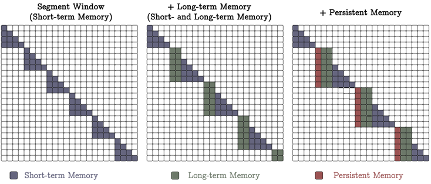

图三（a）注：不同变种titan的注意力掩码：**记忆作为上下文 (MAC). **我们将序列进行分段，并在每个窗口中使用完全因果注意力。同样，序列中的前 $𝑁_𝑝$ 个标记为持久性记忆，接下来的 $𝑁_𝑙$ 个标记为长期记忆标记。

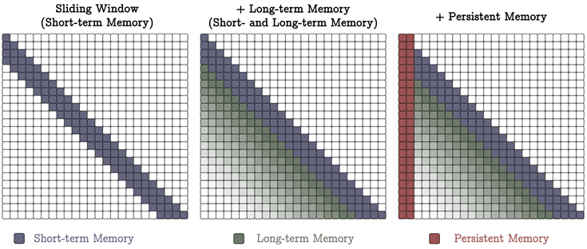

图三（b）注：不同变种titan的注意力掩码：**记忆作为门控 (MAG).** 我们使用滑动窗口注意力 (SWA) 作为短期记忆，将其与我们的神经记忆模块作为长期记忆结合，通过门控机制进行组合。

如何有效地将设计好的神经记忆模块整合到网络中？Transformer中的 $K$ 和 $V$ 矩阵对可以被解释为一个关联记忆模块。我们将其视为上下文窗口有限、建模准确的短期记忆模块。我们设计的神经记忆模块能够持续从数据中学习并将其存储在权重中，可以充当长期记忆模块。本节将提出三种不同的变体Titans，来探究如何有效将神经记忆模块整合到网络中。

##### 记忆作为上下文 Memory as a Context

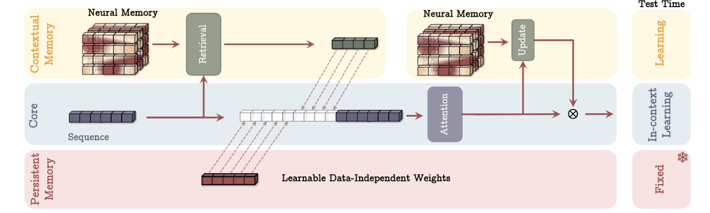

图二注：记忆作为上下文（MAC）架构。该架构包括三个分支：（1）核心分支，（2）上下文（长期）记忆分支，和（3）持久记忆分支。核心分支将相应的长期记忆和持久记忆与输入序列进行连接。接下来，注意力机制在序列上执行，并决定哪些部分的信息应该存储在长期记忆中。在测试阶段，与上下文记忆对应的参数仍在学习，而与核心分支对应的参数负责上下文学习，持久记忆的参数则负责存储任务相关的知识，因此是固定的。

在第一个架构设计中（见图2），我们将记忆视为当前信息的上下文。即，给定一个长序列 $ x \in \mathbb{R}^{N \times d_{\text{in}}} $，我们首先将序列分割成固定大小的片段 $ S^{(i)} $，其中 $ i = 1, \dots, N/C $。对于传入的片段 $ S^{(t)} $，我们将其视为当前上下文，并将其过去的片段视为历史信息。因此，设 $ M_{t-1} $ 为片段 $S^{(t)}$ 之前的长期记忆状态，我们使用输入上下文作为查询，向记忆 $M_{t-1}$ 检索对应的历史信息。即，我们检索与 $S^{(t)}$ 相对应的过去信息如下：
$$
h_t = M^*_{t-1}(q_t)
\tag{21}
$$
其中 $$ q_t = S^{(t)} W_Q $$。接下来，我们将这些历史信息与我们的持久性记忆参数一起作为输入序列传递给注意力模块：
$$
\tilde{S}(t) = [p_1 \hspace{0.2cm} p_2 \hspace{0.2cm} \dots p_{N_p}] \hspace{0.2cm} \parallel h_t \parallel S^{(t)}
\tag{22}
$$

$$
y_t = \text{Attn}(\tilde{S}^{(t)})
\tag{23}
$$

整个序列的注意力图结构如图 3(a) 所示。然后，我们使用 $$ y_t $$ 来更新长期记忆模块，以便为下一个片段准备，并得到最终输出：
$$
M_t = M_{t-1}(y_t)
\tag{24}
$$

$$
o_t = y_t \otimes M^*_{t}(y_t)
\tag{25}
$$

在上述过程中，我们通过前向传播更新 $ M_{t-1} $ 的权重

这种架构有两个关键优势：（1）注意力机制由于同时具备历史和当前的上下文，能够决定在给定当前数据的情况下，是否需要长期记忆中的信息。（2）注意力模块有助于长期记忆仅存储当前上下文中有用的信息。也就是说，并非每个分段中的所有标记都是有用的，记住所有标记可能会导致记忆溢出。因此，注意力机制帮助记忆理解哪些信息是有用的，从而更好地管理记忆容量。（3）在测试时：（i）持久记忆参数是固定的，因为它们编码了关于任务的知识，不应改变；（ii）注意力模块的权重是上下文学习器；（iii） 长期记忆模块仍然在测试时学习（记忆）信息。也就是说，即使在测试时，我们仍然更新神经记忆的权重，因为这些权重编码了长时间过去的特征。

##### 门控记忆 Gated Memory

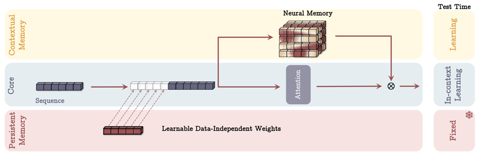

图四注：**Memory as a Gate (MAG) 架构.** 该架构与前述架构类似，具有三个分支：(1) 核心分支，(2) 上下文记忆，(3) 持久记忆。它将持久记忆仅仅融入上下文，并通过门控机制将记忆与核心分支结合。在测试时，其行为与图 2 中相同。

在下一个变体中（见图4），在一个分支中，我们直接使用输入数据来更新长期记忆，而在第二个分支中，我们使用滑动窗口注意力（SWA）：
$$
\tilde{x} = [p_1 \hspace{0.2cm} p_2 \hspace{0.2cm} \dots \hspace{0.2cm} p_{N_p}] \hspace{0.2cm} || \hspace{0.2cm} x
\tag{26}
$$

$$
y = \text{SW-Attn}^*(\tilde{x})
\tag{27}
$$

$$
o = y \otimes M(\tilde{x})
\tag{28}
$$

其中，$SW-Attn^*$ 是带前缀的滑动窗口注意力（见图3b）。需要注意的是，与之前的设计不同，我们并没有对输入数据进行分段。此外，我们在符号上做了一些简化，使用 $M(x)$ 表示经过所有递归计算后的记忆模块的最终输出。在上述公式中，$\otimes$ 可以是任何非线性门控。在我们的实验中，我们使用可学习的向量值权重对输出 $y$ 和 $M(\tilde{x})$ 进行归一化，并接着应用非线性激活函数 $\sigma(.)$。

该设计的整体注意力掩码如图3b所示。在此设计中，滑动窗口注意力充当了精确的短期记忆，而神经记忆模块充当了模型的衰退记忆。这个架构设计也可以看作是一个多头架构，其中各头的结构不同。

##### 记忆单独作为一层 Memory as a Layer

图五注：**Memory as a Layer (MAL) 架构.** 在此架构中，记忆层负责在注意力模块之前压缩过去和当前的上下文。

最后一个变体使用了深度神经网络中的神经记忆层（MAL）（见图 5）。该架构设计在文献中更为常见，混合模型堆叠了递归模型与全窗口或滑动窗口注意力。给定输入  $x$ ，模型的过程如下：
$$
\tilde{x} = [p_1 \hspace{0.2cm} p_2 \hspace{0.2cm} \dots \hspace{0.2cm} p_{N_p}] \parallel x
\tag{29}
$$

$$
y = M(\tilde{x})
\tag{30}
$$

$$
o = \text{SW-Attn}(y)
\tag{31}
$$

在上述设计中，SW-Attn 是滑动窗口注意力。该设计的主要缺点在于，模型的能力受到每个层的限制，因此无法充分利用注意力和神经记忆模块的互补数据处理。在我们的实验中，为了评估该设计中的记忆效果，我们使用了类似 H3 架构，其中我们将序列模型替换为我们的神经记忆模块（LMM）。

- 没有注意力的记忆

尽管在上文中我们讨论了将 LMM 和注意力结合的 MAL 架构，但 MAL 的一个简单变体是将 LMM 作为一个序列模型，而不使用任何注意力机制。从记忆的角度来看，正如第1节所讨论的，我们期望记忆系统的每个部分能够独立工作，即使其他组件受到干扰。因此，即使没有短期记忆（即注意力机制），长期记忆模块仍应是一个强大的模型。在我们的实验中，我们将这个变体称为 LMM 或 Titans（LMM）。我们在附录 C 中提供了关于 Titans 与其他现代RNN模型的联系的进一步讨论。

#### 实验 Experiments

接下来，我们评估了Titans及其变体在语言建模、常识推理、大海捞针、DNA建模和时间序列预测任务中的表现。

##### 实验设置

我们重点关注Titans的三个变体，分别称为：（1）以记忆作为上下文（MAC）的Titan，（2）以记忆作为门控（MAG）的Titan，（3）以记忆作为层（MAL）的Titan，以及（4）单独的神经记忆模块。以上模型中的每一个我们都考虑了四种规模，分别是 170M、340M、400M 以及 760M 参数。前三个模型都是在FineWeb-Edu数据集中采样的15B tokens子集中训练的，最后一个模型是在30B tokens子集上训练的。

在训练过程中，我们遵循（arXiv:2412.06464）训练流程，使用32K tokens 的 LLama2分词器，训练长度为4K tokens。采用AdamW优化器，学习率为4e-4，采用余弦退火学习率策略，batch size为 0.5M tokens，权重衰减率 0.1

##### 大海捞针

表 1：Titan 模型与基于递归和 Transformer 的基准模型在语言建模和常识推理任务上的表现。混合模型用 * 标记。最佳结果的简单模型(黄)和混合模型（蓝）中已加亮显示。

表 2：Titans 和基准模型在 RULER 基准的 S-NIAH 任务上的表现。简单模型（黄）和混合模型（蓝）中的最佳结果已突出显示。

在这一部分，我们使用来自 RULER 基准的 Single NIAH (S-NIAH) 任务，并评估 Titans 和基准模型在长度为 2K、4K、8K 和 16K 的序列上的表现。结果如表 2 所示。神经记忆模块在所有三个任务中均取得了最好的成绩。我们将这种优越的表现归因于 Titans 相较于现有序列模型的三个关键差异：（1）与 TTT 相比，我们的神经记忆通过使用动量以及遗忘机制（即权重衰减）更好地处理了记忆容量。因此，随着序列长度的增加，神经记忆的性能没有下降，且呈现出一致的趋势；（2）与 Mamba2 相比，后者拥有门控（遗忘）机制，Titans 具有更深的非线性记忆，从而实现了更好的记忆管理。此外，与我们的神经记忆和 DeltaNet 不同，Mamba2 无法移除记忆。我们可以看到，当增加序列长度时，性能显著下降；（3）与 DeltaNet 相比，尽管它能够使用 delta 规则移除记忆，但由于缺乏遗忘机制，它不能完全抹除记忆。最后，正如预期的那样，使用 Titans 变种时，我们可以看到相当或更好的结果，其中最佳结果对应于 MAC。

##### BABILong 基准测试

在上一节中，我们讨论了在简单的 NIAH 任务中的结果，其中需要检索单个针头。尽管 Titans 相比基准模型表现更好，但它们在超长序列上的真正优势仍然没有完全显现。为此，在本节中，我们使用了来自 BABILong 基准中的更难任务，在该任务中，模型需要在极长文档中推理分布的事实。

我们遵循基准中的原始实验设置和训练过程。实验有两个设置：（1）少样本设置，在该设置中我们使用大型预训练模型；（2）微调设置，在该设置中我们微调 Titans 的 MAC 变种，并将其与其他微调基准进行比较。 少样本设置的结果如图 6a 所示。在这个设置中，我们可以看到 Titans 超越了所有基准模型——即 Mamba2.8B、RWKV-6-7B、RecurrentGemma-9B、Gemma-9B、Llama3.1-8B、GPT-4 和 GPT4o-mini。这些结果是在 Titans（MAC）的参数远少于基准模型的情况下取得的。 

在微调设置中，我们将微调版的 Titans（MAC）与以下几种模型进行比较：（i）微调的小型模型（与 Titans 参数几乎相同），例如 Mamba、RMT；（ii）带有检索增强生成（RAG）的较大模型，例如 Llama3.1-8B；（iii）极大规模模型，例如 GPT-4、GPT4o-mini、Qwen2.5-72B 和 Llama3.1-70B。基准结果由 Yuri Kuratov 等（2024）报告。

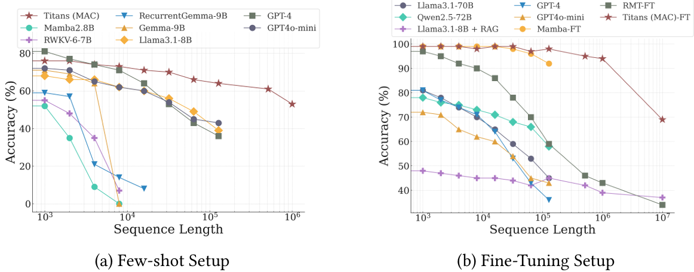

图六注: Titans 和基准模型在 BABILong 基准上的表现。Titans（MAC）超越了所有基准模型，包括极大规模的模型，如 GPT4。

Titans 和基准模型的结果如图 6b 所示。Titans 超越了所有模型，甚至是 GPT4 这样的大型模型。而与带有记忆模块的 Transformer 模型如 RMT 相比，Titans 显示出更好的性能，主要归功于其强大的记忆能力。即，RMT 将历史数据压缩为大小为 16 的向量值记忆，而 Titans 使用上下文在线记忆学习器能够将过去的信息编码到模型的参数中。有趣的是，即使将 Llama3.1-8B 模型与 RAG 进行增强，性能也不如 Titans，且参数量大约少了 70 倍。

##### 深度记忆的影响

在这一部分，我们评估了深度记忆对实际训练时间和模型性能的影响。为此，我们关注不同变体的神经记忆模块，其中 \(L_M = 1, 2, 3, 4\)。我们还使用 Mamba 作为模型性能的基线。为了公平比较，我们对所有模型使用相同的训练过程，并在 Pile 数据集的一个子集上进行训练。 

图七注: 记忆深度对困惑度的影响。较深的长期记忆在较长序列中表现出更好的扩展性。

我们报告了模型和基线在序列长度变化下的困惑度，如图 7 所示。有趣的是，随着记忆深度 \(L_M\) 的增加，模型在整体序列长度上的困惑度表现更好。此外，较深的记忆模块在参数较少的模型上对序列长度更加稳健。随着参数数量的增加，所有模型在较长序列上显示出更好的性能。

图 8: 记忆深度对训练吞吐量的影响

我们还评估了记忆深度（\(L_M = 1, 2, 3, 4\)）对训练吞吐量的影响。我们报告了训练吞吐量（每秒处理的token数）随序列长度变化的情况，如图 8 所示。所有模型在上下文长度上都呈线性扩展（即，随着序列长度的增加，每秒处理的令牌数保持恒定趋势）。此外，随着记忆深度的增加，正如预期的那样，我们看到一个线性趋势，表明更深的记忆导致了较慢的训练。因此，使用更深的记忆模块并不总是高效的，显示出效果与效率之间的权衡。

##### 消融实验

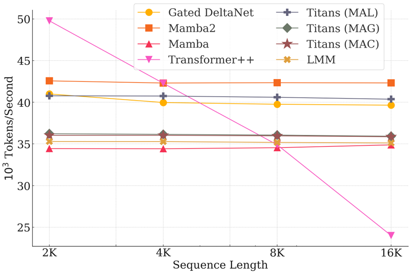

图九注: Titans 和基准模型的训练吞吐量比较。

最后，我们对 Titans 中不同架构选择进行消融研究。我们将神经记忆模块作为基线模型，然后逐个改变一个组件：（1）用线性记忆替代深度记忆，（2）移除卷积，（3）移除在意外度度量中的动量，（4）去除权重衰减（或遗忘机制），以及（5）去除持久记忆。

表 5：Titans 的消融研究。Titans 的所有组件都对其性能做出了积极贡献。

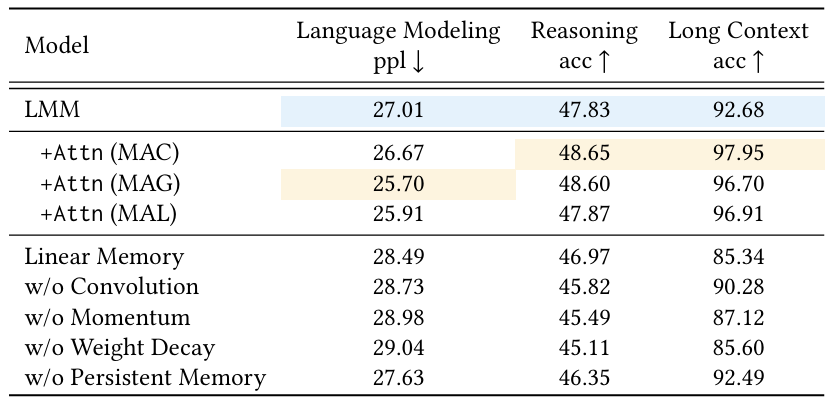

结果如表 5 所示。神经记忆设计的所有组件都对其性能做出了积极贡献，其中最大贡献来自权重衰减、动量、卷积和持久记忆。

为了评估架构设计的效果，我们比较了 Titans 三个变体在以下三个方面的性能：（i）语言建模，（ii）常识推理，以及（iii）长上下文 NIAH（BABILong）任务。

结果如表 5 所示。我们发现 MAC 和 MAG 在语言建模和常识推理任务中表现相近，而 MAC 在长上下文 NIAH 任务中表现显著更好。这两种模型的性能都优于 MAL。这些结果连同图 9 一起，展示了快速训练和更具表现力设计之间的权衡。

#### 附录 

##### C	Long-term Memory Module(LMM) as a Sequence Model

在这一部分，我们讨论 LMM 作为序列模型如何与现代线性递归模型连接。为了简化起见，我们从线性记忆开始，$ M_t = W_t \in \mathbb{R}^{d_{in} \times d_{in}} $。在这种情况下，我们的目标函数变为 $\ell(M; x_t) = \frac{1}{2} \| M_t k_t - v_t \|_2^2$，其中我们使用带动量和权重衰减的梯度下降进行优化。 因此，重新审视方程（公式13）中的递归公式：
$$
M_t = \text{diag}(1 - \alpha_t) M_t + S_t
\tag{32}
$$

$$
S_t = \text{diag}(\eta_t) S_{t-1} - \text{diag}(\theta_t) M_{t-1} k_t^\top - v_t^\top k_t
\tag{33}
$$

**LMM 是广义门控 DeltaNet**

如 DeltaNet 文中讨论，DeltaNet 可以被解释为一种在线学习问题，优化目标为 $L = \frac{1}{2} \| S_t k_t - v_t \|_2^2$ ，从而得到：
$$
S_{t+1} = S_t - \theta_t \nabla L = S_t (I - \theta_t k_t k_t^\top) + \theta_t v_t k_t^\top.
\tag{34}
$$
在这个公式中，门控 DeltaNet 与上述相同，但额外添加了权重衰减项。比较公式32 和公式34，我们可以看到当设置 $\eta_t = 0$ 时，两个公式是等价的。因此，我们可以说 LMM 从以下三个方面对最近的门控 DeltaNet 研究进行了推广：

- 基于动量的规则：Delta 规则基于瞬时的意外，意味着 token 的流动不会影响记忆更新规则。然而，LMM 基于动量规则，考虑了过去和瞬时的意外。

- 深度记忆：虽然门控 DeltaNet 限于线性（矩阵值）记忆，因为它需要找到闭合递归形式，但 LMM 通过使用基于梯度的公式允许使用深度记忆模块，从而带来了更强的表达能力。
- 非线性递归：虽然 DeltaNet 和门控 DeltaNet 基于线性递归，但我们的 LMM 使用了块间非线性递归和块内线性递归。这种设计使得 LMM 拥有更强的表达能力。

在这里，我们将门控 DeltaNet 作为最近一代递归模型的一个示例进行了讨论。类似的方法，如 RWKV-7，也使用相同的公式和损失函数，因此 LMM 所有类似的模型的衍生泛化。

**LMM 是广义的 Longhorn**

与 DeltaNet 类似，Longhorn（B. Liu 等，2024）使用相同的损失函数，但它通过隐式在线学习推导出闭合形式：
$$
S_{t+1} = S_t I - \delta_t k_t k_t^\top + \delta_t v_t k_t^\top
\tag{35}
$$

$$
其中 \hspace{0.2cm} \delta_t = \frac{\theta_t}{1 + \theta_t k_t k_t^\top}
$$

然而，它缺少遗忘门，导致记忆溢出速度较快。因此，除了上述的 (1) 基于动量的规则，(2) 深度记忆，和 (3) 非线性递归这三个方面外，LMM 还具有使用额外的 (4) 遗忘门的优势，从而实现了更好的记忆管理。

**LMM 是广义的 TTT Layer**

据我们所知，TTT 是唯一具有基于梯度的更新规则的现代线性递归模型。除了不同的架构设计和目标函数外，我们的 LMM 与呈现的 TTT 层有三个关键区别：

- 遗忘机制：TTT 层在每个时间点更新记忆，没有机会遗忘过去的数据。因此，当固定记忆大小时，模型无法有效管理长序列的记忆。而 LMM 的遗忘机制允许在不再需要很久以前的信息时清除记忆。我们表明，在一般情况下，这种遗忘机制等同于权重衰减，并提供了一种快速方法将其并行训练纳入模型。

- 基于动量的更新规则：TTT 层基于瞬时意外度量，这意味着token的流动不能影响记忆更新规则。而 LMM 基于动量规则，同时考虑了过去和瞬时的意外。

- 深度记忆：虽然 TTT 层允许更深的记忆，但尚未对这种深度记忆模块的优缺点进行实验评估

据我们所知，我们的神经长期记忆模块是第一个具有基于动量的更新规则的线性递归模型。 

最后，作为与上述所有模型以及其他现代线性递归研究的一个关键区别，请注意，现代线性模型的混合变体——例如 Griffin、DeltaNet、Gated DeltaNet、H3、Mamba2、Samba等——都是基于顺序层设计的。我们提出 Titans 来展示如何有效地将这样的记忆模块融入架构中。

#### Meta 对记忆层的最新研究

------

论文标题：Memory Layers at Scale

论文地址：https://arxiv.org/pdf/2412.09764

#### 摘要 abstract

记忆层使用可训练的键值(key-value)查找机制向模型添加额外的参数，而不会增加FLOP。从概念上讲，稀疏激活的记忆层补充了计算量大的密集前馈层，提供了专用容量来廉价地存储和检索信息。

在下游任务中，使用我们改进的记忆层增强的LLM性能优于计算量增加两倍以上的Dense模型，并且也优于计算和参数量相当的MoE模型。我们发现，事实性任务的收益尤为明显。我们提供了一个可以完全并行化的记忆层是心啊，展示了 128B 记忆参数的缩放定律（scaling laws），预训练为 1T tokens，用来比较的基准模型具有8B参数。

图 1 注：扩展记忆大小对 13 亿参数基础模型的影响（零记忆参数对应密集模型），训练数据为 1T tokens。左侧为事实问答准确率（在 NaturalQuestions 上的精确匹配和 TriviaQA 上的 F1 分数），右侧为任务的负对数似然（NLL，越低越好）。虚线表示一个 70 亿参数的模型，在 2T tokes 上训练，计算量为原来的 10 倍。

#### 记忆增强架构 Memory Augmented Architectures

可训练的记忆层与普遍使用的注意力机制类似。给定一个查询 $q ∈ \mathbb{R}^n$，一组键 $K ∈ \mathbb{R}^{N×n}$ 和值 $V ∈ R^{N×n}$，输出是 value 的软组合，根据 $q$ 与相应 key 之间的相似度加权。

记忆层与注意力层的两个主要区别将它们区分开来。首先，记忆层中的key和value是可训练的参数，而不是激活值。其次，记忆层通常在key和value的数量上具有更大的规模，因此需要稀疏查找和更新。例如，在本研究中，我们将键值对的数量扩展到几百万。在这种情况下，只有最相似的 top-k 键及其相应的值参与输出。一个简单的记忆层可以通过以下方程描述：
$$
I = SelectTopkIndices(K_q)  
\hspace{2cm}
s = Softmax(K_I *q)
\hspace{2cm}
y = s*V_I
\tag{1}
$$
这里有一个索引集合 $I$，$$s \in \mathbb{R}^k$$，$$K_I,V_I \in \mathbb{R}^{k\times n}$$，输出 $$y \in \mathbb{R}^n$$。每个 token 嵌入（对我们来说，是前一个注意力层的输出）都会独立地经过这个记忆检索，类似于我们所替换的 FFN 操作。

##### 扩展记忆层 Scaling memory layers

由于计算量小，记忆量大，记忆层面临明显的扩展挑战。本节将详细介绍其中的一些挑战以及如何应对这些挑战。

- 查询机制

在扩展记忆层时会遇到的一个瓶颈是查询-键（query-key）检索机制。一种简单的最近邻搜索需要比较每一对查询-键，这在面对大型记忆时很快就会变得不可行。

我们采用了（"Large Memory Layers with Product Keys", Lample 等，2019）中的可训练乘积量化键。乘积键的工作原理是使用两组键（key）而非一组，其中 $$K_1,K_2 \in \mathbb{R}^{\sqrt{N}\times \frac{n}{2}}$$。$K_1,K_2$ 这两组键的乘积构成了大小为 $$N \times n$$ 的完整键集。但其不会被实例化，而是由这两组键（的乘积）来表示。通过首先搜索小得多的半键集（half-keys），可以高效地在完整键集上进行 top-k 检索，从而节省计算和内存。为了进行检索，我们首先将查询分为两个子查询 $$q_1,q_2 \in \mathbb{R}^{\frac{n}{2}}$$。每个子查询分别在 $K_1,K_2$ 中进行 top-k 检索，得到 $$I_1,I_2$$ ，以及其对应的分数 $$s_1,s_2$$ 。由于每组中只有 $$\sqrt{N}$$ 个键，因此此操作效率很高。可以通过组合 $K_1,K_2$ 中的检索结果（$s_1[i_1] + s_2[i_2]$）并取其中分数最大的组合，即 $${\text{argmax}}_{i_1 \in I_1,i_2 \in I_2} \ s_1[i_1] + s_2[i_2]$$ ，来找到整体的索引和分数。

> 《Large Memory Layers with Product Keys》论文补充说明：
>
> 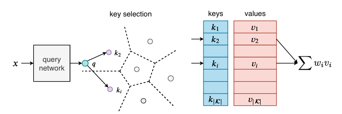
>
> 《Large Memory Layers with Product Keys》补充图一注：**键值记忆层概述：**输入 x 通过查询网络处理，生成查询向量 q，然后将其与所有键进行比较。输出是与所选键相关联的记忆的稀疏加权和。对于大量键 K，键选择过程在实际中变得过于昂贵。我们的乘积键方法是精确的，并使这一搜索过程非常快速。
>
> 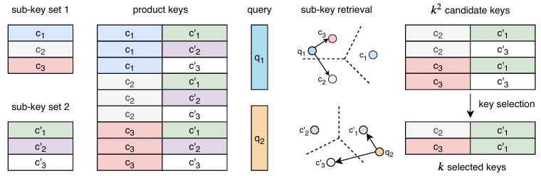
>
> 《Large Memory Layers with Product Keys》补充图二注：**乘积键的说明：**我们定义了两个离散的键子集（子键集 1 和子键集 2）。它们诱导出一个更大的键集，但这个键集从未被明确表示（乘积键）。给定一个查询，我们将它分成两个子查询（q₁ 和 q₂）。在每个子集中选择 k 个最接近的键（图中 k = 2）隐式地选择了 k² 个键。与查询内积最大的 k 个键保证属于这个子集，在这个子集上可以高效地进行搜索。

- 并行记忆

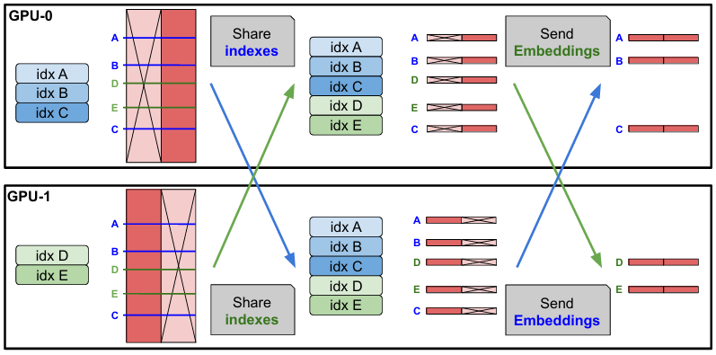

图 2 注：两个 GPU 的“记忆组”的并行 EmbeddingBag 实现说明。每个 GPU 在组的所有索引上执行 EmbeddingBag 操作，但仅在其可访问的半维度嵌入上进行。

我们在多个 GPU 上并行化嵌入查找和聚合操作。记忆值在嵌入维度上被切分。在每一步，索引从进程组中收集，每个工作进程进行查找，然后聚合其自身切片中的嵌入部分。

在此之后，每个工作进程收集对应于其自身索引部分的部分嵌入。我们注意在这个阶段保持激活内存的可管理性，确保每个 GPU 只获取其自身部分，而无需实例化整个嵌入输出。该过程如图 2 所示。此实现与其他模型并行化方案（如张量、上下文或pipeline并行化)独立，并在其自身的进程组上运行。

> ps：这里不太明白，两个GPU之间有信息交换吗？

- 共享记忆

深度网络在不同层次的抽象中编码信息。在多个层次上添加记忆可能有助于模型以更灵活的方式使用其记忆。与之前的工作不同，我们在所有记忆层之间使用共享的记忆参数池，从而保持参数数量不变并最大化参数共享。我们发现，多个记忆层的性能显著优于具有相同总参数数量的单一层，直到一定数量的层（在我们的情况下，是 3 层）。超过这个点，进一步替换 FFN 层会降低性能，表明稀疏层和密集层都是必需的，并且很可能是互补的（见消融实验 表3）。

- 稳定性改进
  

图 3 注：左侧是常规记忆层（只增加灰绿色memory部分）。右侧是 Memory+ 模块，添加了 projection、gating 和 silu 非线性激活函数（蓝色部分以稳定训练）。

我们通过引入输入依赖的门控机制，并使用非线性 silu 激活函数 来提升记忆层的训练性能。公式（1）中的输出变为：
$$
\text{output}=(y \odot \text{silu}(x^\top W_1)) ^\top W_2
 \tag{2}
$$
其中，$$\text{silu}(x)=x\cdot\text{sigmoid}(x)$$，$$\odot$$ 表示逐元素乘法（也可参见图 3）。我们发现，对于大型记忆层，训练可能会变得不稳定，特别是对于小型基础模型。在需要时，我们使用 qk-normalization（Team，2024）来缓解这一问题。

#### 结果 Scaling results

##### 具有固定的memory大小 

首先，我们固定记忆的大小，并将其与密集基线模型以及大致参数匹配的 MOE 和 PEER 模型进行比较。记忆模型half keys 的数量为 2¹⁰，即记忆 value 的数量为 2²⁰。PEER 基线模型 half keys 的数量为 768，其总参数量略多于记忆模型。MOE 模型选择最低数量的专家，参数量超过记忆模型（分别对应于 1.34 亿、3.73 亿、7.2 亿和 13 亿尺寸的 16、8、6 和 4 个专家）。

普通的 Memory 模型只有一个记忆层，我们用它替换 Transformer 的 FFN 层。我们改进的 Memory+ 模型有 3 个记忆层，（1.34 亿模型以 4 为步长居中放置，其他模型以 8 为步长居中放置）。此外，它还包括自定义的 swilu 非线性以及优化的 key 维度（设置为等于 value 维度的一半）。如前所述，记忆层共享参数，因此与单个记忆层具有相同的内存占用。

图 4 注：展示了不同大小的 Memory、MOE 和密集模型在 NaturalQuestions 和 TriviaQA 问答任务上的准确率与基础参数的关系（Memory+ 模型使用了 1m memory embeddings）

从表 1 可以看出，记忆 Memory 模型在密集基线模型上有了显著提升，并且通常在问答任务上与参数数量翻倍的密集模型性能相当。Memory+ 在 Memory 的基础上进一步提升，其性能通常介于计算量高出 2-4 倍的密集模型之间。对于相同数量的参数，PEER 架构的性能与 Memory 相似，但落后于 Memory+。MOE 模型的性能远远落后于记忆变体。图 4 展示了 Memory、MOE 和密集模型在各种基础模型尺寸上的问答任务的扩展性能。

表 1 ： 比较记忆增强架构与基线模型在问答任务上的表现。除非在模型配置列中另有说明，否则记忆模型具有 1 百万 value 嵌入。指标为 NQ、PIQA、OBQA 的准确率以及 TQA、HotpotQA 的 F1 分数。

##### 固定模型而调整记忆大小

我们在固定基础模型的情况下，调整记忆大小，研究模型的扩展能力。图 1 显示，Memory+ 模型的实际 QA 性能随着记忆大小的增加而持续增加。在 6400 万个键（1280 亿个记忆参数）时，1.3B 的 Memory 模型的性能接近于 Llama2 7B 模型，而 Llama2 7B 模型使用了 10 倍以上的 FLOPs（见表 2）

表 2 ：8B 基础模型的结果。Memory+ 模型具有 1600 万个 memory value（640 亿个额外参数）。指标为 NQ、PIQA、OBQA、HellaSwag、MMLU 的准确率；TQA、HotPotQA 的 F1 分数；HumanEval、MBPP 的 pass@1。每个模型的训练 token 数量用括号表示

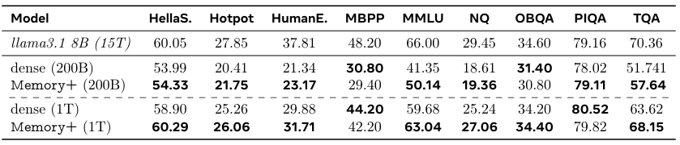

##### 模型消融

- 记忆层位置

由于记忆层是共享的，因此我们在不增加内存或计算的情况下讲更多的FFN层替换为记忆层。我们看到随着我们添加更多记忆层，性能最初会提高，然而最终模型性能会下降（表3，左）。此外，我们还实验了这些层的放置位置，修改其中心位置和间距。我们发现，具有较大步长的居中放置效果更好，我们在 Memory+ 架构中采用了这种放置方式。

表 3 ：左侧为具有共享记忆的记忆层数量，右侧为不同的记忆架构变体。指标均为对数似然，在训练集上的 NQ 答案和 TQA 答案。

- 记忆层变体

我们对记忆机制进行了少量修改（表 3，右侧）。我们尝试了：
	1. 使用线性投影作为门控结构来控制记忆，
	1. 添加自定义的 swilu 非线性（图 3），
	1. 在预训练期间除了 top-k 之外还添加随机键值对以消除键选择的偏差，
	1. 在预训练期间向所选的 top-k 值中添加一个单一固定的键值对（softmax sink）作为“锚点”。

我们发现 swilu 非线性能够持续改善结果，并将其纳入到我们的模型中。简单的控制在某些情况下可以提升性能，并且 swilu 在一定程度上已经涵盖了这种行为，所以我们决定不再进行额外的控制。对于 key 采样改进，包括随机 key 和固定（sink）key，我们看到了一些微小的改进，然而这些在我们的实现中对训练速度有一些负面影响，并且对于更大模型尺寸，收益并不一致，因此我们将其从实验中排除，留待未来探索。

- key 和 value 的维度

默认情况下，记忆 value 的维度被选择为与基础模型维度相同。然而，我们可以通过在 Memory 之后使用额外的投影，在不改变记忆的总参数大小的情况下，潜在地权衡 value 的维度与记忆中的 value 的数量。我们在表 4（左侧）中展示了这一消融研究，并发现默认配置是最优的。我们也可以独立地增加 key 嵌入的维度，我们在表 4（右侧）中进行了这一操作。我们并不意外地发现，增加 key 维度是有益的。然而，增加 key 维度确实会向模型添加更多的密集参数，因此我们不能无限地增加它而不破坏我们的公平比较。在我们的实验中，我们选择 key 维度为基础模型维度的一半。

表 4 ：左侧为在保持总参数数量不变的情况下，变化 value 嵌入维度；右侧为变化 key 维度。指标均为对数似然，在训练集上的 NQ 答案和 TQA 答案。这些是在 373m 模型尺寸上进行的，该模型使用了 1024 的隐藏层维度。key 维度是 sub-keys 维度的总和

