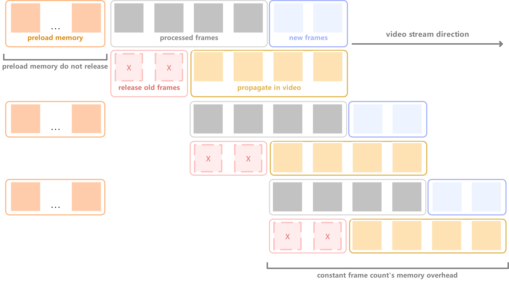

### Det-SAM2-技术报告


图注：SAM2论文中展示的模型框架图，[Meta Segment Anything Model 2](https://ai.meta.com/sam2/)


- SAM2原始框架


图注：SAM2原始框架图，SAM2原文中提到的但是未在SAM2原文图中绘制的是：Memory Decoder不仅接收来自Mask Decoder的输出结果，也接收来自Image Encoder的输出结果。路径如图中下方的跳跃连接。


- Det-SAM2-台球算法整体任务概览


图注：Det-SAM2任务概览。整体技术pipeline由三个部分组成：检测部分、SAM2实例的像素级视频追踪部分 和 后处理部分。检测模型提供初步（可能会出错）的检测框，将检测框作为SAM2的条件提示，SAM2视频预测器将离散帧的条件提示传播（propagate_in_video）到视频中所有帧中连续地进行推理，最终SAM2视频预测器输出物体实例在视频时空中的Mask。后处理部分对获取到的Mask做相应的判断以提供准确且量化的结果以支持AI教练或AI裁判功能。
本技术报告重点在Det-SAM2整体框架的搭建与SAM2部分的后续工程优化（新功能实现），其中涉及：2.实时视频流处理，3.视频流累积与间隔检测模型提示，4.限制视频传播的最大长度，5.预加载离线内存库，6.支持追踪过程中新增物体类别而不重置推理状态（reset_state）。

### SAM2工程优化

#### 1.Det-SAM2试验Demo

我们希望通过检测模型自动地为SAM2提供条件提示。
Det-SAM2试验Demo：仅在其中一帧上运行检测模型（第一帧提供条件为条件帧，后续帧都是非条件帧）：


图注：Det-SAM2试验Demo框架图。自动地为某一帧添加条件提示，条件提示由检测模型（这里使用的是YOLOv8）给出，检测框结果信息作为框提示输入给Prompt Encoder。


#### 2. 接收在线视频流的实时处理框架Det-SAM2

官方demo只支持读取视频路径，处理预先完结的离线视频。我们希望实现加载视频流，不断对新帧进行推理，且每一帧都运行我们检测模型，为SAM2添加条件提示。

首先我们在流程上的Det-SAM2框架如下：


图注：Det-SAM2框架允许自动地为每一帧都添加条件提示

在接收视频流的时间维度上Det-SAM2处理方式如下：


图注：处理视频流示意图。每一帧都经过Detection Model作为SAM2的条件帧（图中青绿色），随后在整个已有视频帧中进行传播推理propagate in video（图中黄色）。

在实际情况中，传播过程（propagate in video）占用了相当长的时间。在传播过程中，每一次新增视频推理，都会对此前所有帧执行一次SAM2推理。这使得我们对长度为N帧的视频应用当前推理框架时，会对$$ \frac{1}{2} N^2 $$的帧执行推理。


#### 3. 累积视频流和间隔检测模型的条件提示输入

我们希望在接收视频流的基础上，允许新进来的视频帧累积再视频帧缓存中。我们每次送给Det-SAM2框架进行推理的内容不要一帧一帧地频繁给，而是一次送进去一个视频帧累积的序列，这样SAM2一次处理多个帧，减少传播次数。
同时我们还希望间隔检测模型的推理，不需要送给SAM2的每一帧都添加检测模型的条件。经过上一步Demo的实验，我们发现如果每一帧都施加条件的话，SAM2无法修正来自条件帧的内容。

视频流累积和间隔检测条件提示的流程示意图：


图注：Det-SAM2中视频流累积和间隔检测条件提示的流程图。对于视频流接收到的每一帧，会先累积到帧缓存中，当人为设置存储大小的帧缓存累积了一定帧时，则送给Det-SAM2框架进行推理。在推理当前累积的视频序列时，会根据间隔设置判断那些帧是条件帧(cond-frame)那些帧是非条件帧(non-cond-frame)。条件帧则由检测模型提供提示，由SAM2的Prompt Encoder提供特征嵌入。

我们通过累积一定数量的视频帧再进行推理可以极大地缓解SAM2传播的次数。假设我们缓存K帧一并进行推理，则整个长度为N帧的视频执行的传播propagate in video过程只需要对大约$$ \frac{1}{2K} N^2 $$帧进行处理。


#### 4. 限制视频传播propagate in video的长度

我们在了解propagate in video传播机制每次推理都会对所有历史帧中的非条件帧non-cond-frames进行追踪，这也是SAM2之所以能够修正的机制，当获取到新的条件帧时，传播机制可以依赖条件帧的信息对过去的所有非条件帧二次推理并将结果覆盖。
然而，在Det-SAM2流程的实际情况中，需要修正的非条件帧与其所依赖的条件帧之间不会间隔太远。因此我们可以限制每次propagate in video传播时推理所涉及到的帧数。在视频流过程中，相对于本次推理，遥远的视频开始的大多数帧都是已经确定且不需要被修正的，越是靠近新时刻的推理结果越有可能在未来的推理中被颠覆。
因此我们需要对propagate in video传播操作做如下限制：

- 传播中追踪处理顺序为倒序处理，起始帧为当前最新帧
- 传播中限制追踪处理的最大视频帧数，但是本次传播处理的长度（极端情况下）应当至少包含上一次推理的累积视频帧序列，否则传播将不具备任何修正意义。

限制传播长度的流程示意图如下：


图注：限制传播长度的流程示意图。propagate in video部分执行时只追踪人为设置的固定长度，而不需要每次传播都重复追踪视频靠前的帧。

增加视频传播的最大长度可以扩大修正范围，但也会带来更大的计算开销。减小视频传播的最大长度则可以带来更快的推理速度，但也会降低视频流中条件帧能够修正非条件帧的最大范围。

通过限制传播长度为M，累积帧缓存为K，我们在推理长度为N帧的视频时只需要对大约$$ \frac{M}{K} N $$帧做处理。


#### 5. 预加载Memory Bank内存库

SAM2能将图像分割能力迁移到视频分割领域的一个重要改进就是增加了Memory Bank可以提供帧与帧之间的关联（Memory Attention）。然而，Memory Bank内存库的生成与构造是在线的，基于当前传入的视频中已加载的帧（每次加载帧时会将条件提示、掩码输出与原始输入添加在内存库中）。

我们希望能够通过预加载一个在旧视频中已经构建好的内存库，从而可以在新的视频上无需条件提示直接进行推理。即允许SAM2预先加载一个离线内存库，该离线内存库经过精心设计，包含了新视频中可能会需要的所有提示和难样本提示示例，就像“系统提示词”一样。在之后新视频的推理中，新生成的Memory会累加在预加载的内存库上。新生成的Memory与预加载的Memory在人为概念上区分，但是在SAM2实际推理中没有区别。

预加载内存库流程示意图如下：

图注：预加载内存库流程图。Memory Bank预先加载一个离线内存库，源自此前推理过的视频。至此，本次推理的时候可以直接将先前视频中的推理记忆作用于新视频的推理。

在具体实现上，SAM2代码中的inference_state存有memory bank中所有的信息，因此将inference_state迁移到新视频推理中，且新视频不再重新初始化init_state即可。


#### 6. 允许追踪过程中增加新物体ID

在SAM2官方代码中只允许在追踪开始之前事先确定好本次视频推理中需要分割的实例，而不允许在追踪过程中临时新增需要分割的新实例。在我们Det-SAM2处理实时视频流的工作流中，我们大部分情况下无法预知未来会出现什么物体，此前遇到新需要分割的物体时我们就必须执行reset_state重置内存库，相当于丢失前面所有推理结果重此刻重新开始追踪分割。这种情况下就无法利用到此前的条件帧信息了，相当于一个新的视频开始，后续预测时均无法利用前面的预测信息，会影响难样本中分割预测的准确性。

我们希望能够允许追踪过程中自然地增加新物体ID而不需要重置整个内存库，我们通过追踪过程中在线地更新内存库来实现。我们需要更新的内存库内容如下：

1. 初始化，在内存库中注册新ID相应的ID索引列表和信息存储字典

2. 更新此前所有帧的记忆库信息（重新获取输出字典或临时输出字典，通过memory_encoder生成新ID关系下的记忆库信息）

   

追踪过程中在线更新内存库示意图如下：


图注：Det-SAM2追踪过程中输入新增物体ID，在线更新内存库示意图。当框架在追踪开始后接收到新的需要预测的物体时，首先在内存库中注册其相关ID映射，其次基于新的映射关系更新此前所有历史帧在Memory bank记忆库中的信息（每一帧在记忆库中的信息张量的Batch维度大小取决于需要预测的ID数量，如果不更新则会引发张量不匹配无法计算Memory Attention）


至此，我们支持了在追踪开始后在线添加新物体ID的情况。然而，对于长视频追踪中，这种方法一旦使用便会对所有历史帧都进行一次处理（经过Memory encoder）。为了性能高效，我们还需要对两个组件进行限制，一是在线增加新ID时更新memory bank的帧数，二是Memory Attention计算的条件帧数量。

具体做法是：

1. 限制Memory Attention计算的条件帧数量的同时必须保证预加载内存库中所有条件帧参与计算。
2. 追踪过程中在线新增类别时更新内存库信息限制一定时间内的帧更新时也必须保证预加载内存库中所有帧被更新。

追踪过程中在线更新类别（新增客户端ID）的优化示意图：


图注：Det-SAM2追踪过程中输入新增物体ID，在线更新内存库信息的优化示意图。通过限制更新内存库信息的最大帧数和Memory Attention计算的条件帧数量，同时保证预加载内存库Preload Memory中的帧必须被更新和Memory Attention计算来保证效能的同时减小计算开销。


#### 7.内存库体积的优化

在优化一系列计算开销之后，我们开始着手Det-SAM2架构在推理过程中的内存与显存占用。在优化前，我们使用4090显卡24G显存大约可以推理200视频帧/每帧6-7个分割物体，我们的显存占用与内存占用是随着帧数线性增长的。


1.我们首先使用官方预留的接口，SAM2VideoPredictor()中init_state()方法的offload_video_to_cpu参数：

```python
offload_video_to_cpu=True
```

该参数可以将内存库中的视频帧（即inference_state["images"]）从GPU显存中转移到CPU内存上。在1080p视频分辨率下，可以降低大约每帧0.025G显存开销，即减小2.5G开销/100帧。


2.我们其次尝试官方预留的第二个接口，SAM2VideoPredictor()中init_state()方法的offload_state_to_cpu参数：

```python
offload_state_to_cpu=True
```

可能这个参数在官方源码中是有效的，但是在我们构建的Det-SAM2 pipeline中这个参数一开始并没有起到节省显存的作用反而导致最终生成mask错位，直到我们将其涉及到的inference["storage_device"]张量设备迁移的所有位置均设置张量转移参数non_blocking=False时，才能正常使用：

```python
device = inference_state["storage_device"]
tensor.to(device,non_blocking=False)
```

offload_state_to_cpu=True时，修复后的最终效果正如官方在注释中所说，会节约显存，同时推理耗时增加约22%


3.我们受到官方仓库issue中讨论的启发，希望尝试能否选择不断清除掉旧的帧数据（前提是确保不会再使用到它）以维持记忆总量不再无限上升：
https://github.com/facebookresearch/sam2/issues/196#issuecomment-2286352777

为了实现这个功能，我们在sam2.sam2_video_predictor.py中SAM2VideoPredictor()类实现了release_old_frames()方法，该方法可以设置最大保留帧数max_inference_state_frames，距离当前帧超过最大保留帧数距离的帧会被认为是需要清除的帧。因此为了确保只清除掉不会再被使用的max_inference_state_frames应当大于propagate_in_video()中的最大传播长度max_frame_num_to_track。



图注：不断释放旧帧以维持恒定显存开销示意图。图中为保留最大帧数等于最大传播长度的情况(图中示例max_inference_state_frames=max_frame_num_to_track=4)，在每次传播propagate in video后超过最大保留帧数（4帧）的已处理帧会被释放清除。除此之外，预加载内存库中的帧永远不应该被释放。因此在这个示例（最大保留帧数等于最大传播长度）长视频稳定推理过程中：
显存占用的上限为len(new_frames)+max_inference_state_frames+len(preload_memory)帧的数据占用；
显存占用的下限为max_frame_num_to_track+len(preload_memory)帧的数据占用。

在release_old_frames()方法清除旧帧过程中具体会释放内存库中'output_dict'和'output_dict_per_obj'中的非条件帧以及'output_dict'、'output_dict_per_obj'和'consolidated_frame_inds'的条件帧：

```python
# delate old non_cond_frames
inference_state['output_dict']['non_cond_frame_outputs'].pop(old_idx)
for obj in inference_state['output_dict_per_obj'].keys():
	inference_state['output_dict_per_obj'][obj]['non_cond_frame_outputs'].pop(old_idx)
# delate old cond_framse
inference_state['output_dict']['cond_frame_outputs'].pop(old_idx)
inference_state['consolidated_frame_inds']['cond_frame_outputs'].discard(old_idx)
for obj in inference_state['output_dict_per_obj'].keys():
	inference_state['output_dict_per_obj'][obj]['cond_frame_outputs'].pop(old_idx)
```

至此可以在无限长度的视频帧推理过程中，真正实现恒定的显存开销。


4.我们意外地发现Memory Attention计算在我们的pipeline中会产生大量未被及时释放的中间变量占用显存，因此我们在sam2.modeling.sam2_base.py中SAM2Base类_prepare_memory_conditioned_features()方法中的Memory Attention计算后增加释放显存的操作：

```python
def _prepare_memory_conditioned_features()
	...
    pix_feat_with_mem = self.memory_attention(
        curr=current_vision_feats,
        curr_pos=current_vision_pos_embeds,
        memory=memory,
        memory_pos=memory_pos_embed,
        num_obj_ptr_tokens=num_obj_ptr_tokens,
    )
    # Add release GPU memory
    torch.cuda.empty_cache()
    ...
```

我们发现它在pipeline中可以显著降低显存占用上限。


5.受到官方仓库中issue的启发[issue196](https://github.com/facebookresearch/sam2/issues/196#issuecomment-2286352777)，我们同样尝试了将图像以FP16半精度存储而非原始的FP32，这样可以在1920*1080分辨率下节约0.007G/帧的内存开销：

```python
def load_video_frames()  # in sam2.utils.misc.py
	...
    images = torch.zeros(num_frames, 3, image_size, image_size, dtype=torch.float16)
    ...
```


除此之外，我们尝试过一些其他方法但是是无效的：

使用官方预留的第三个接口，SAM2VideoPredictor()中init_state()方法的async_loading_frames参数以异步加载图像帧，在我们的pipeline中没有效果。


### 台球事件post-processing后处理实现

在台球场景下首先需要根据分割掩码计算出掩码的质心（每个球的位置坐标）以及两帧之间球的速度向量。以位置坐标和速度向量为基础，进行中层事件（例如进球，碰撞，翻袋）判断。

##### 1. 进球检测

首先从SAM2推理主干的检测模型中获取6个袋口位置，为6个袋口位置分配名称，确定哪个位置是哪个袋口。

在每一帧遍历过程中判断：

​	1.球的上一帧的位置在洞口附近，并在这一帧消失；
​	2.球上一帧速度指向洞口。

​	如果1，2条件都满足，则认为该球进了目标洞口。

修正机制。如果后续有该球重复进洞的信息，最新的进球信息会覆盖旧信息。

##### 2. 球间碰撞检测

在每一帧遍历过程中，如果球速度向量发生显著变化（超出一定阈值）的时候开始检测判断：

​	1.找到可能与当前球发生碰撞的球——符合碰撞后后变化的速度向量；
​		1.1 碰撞前两颗球相向运动
​		1.2 碰撞后两颗球速度发生明显变化，且加速度具有相关性（例如新增相互远离的分量）

​	2.判断可能发生碰撞的球是否在当前球附近。

​	如果1，2条件都满足，则认为两个球之间发生了碰撞。

修正机制。后续如果再次对这一帧进行判断而出现不同结果时，新判断结果会覆盖旧信息。

注：球间碰撞需要计算加速度，因此计算条件需要获取当前帧+前两帧，共计三帧的信息。

##### 3. 桌边反弹检测

首先从获取到的六个袋口的坐标中，提取出球桌上下左右四个有效边界，并根据四个有效边界向内缩小，得到用于触发反弹检测的上下左右边带缓冲区域。

在每一帧遍历过程中，当球处于缓冲边界内，记录边界位置（上下左右）并触发桌边反弹检测判断：

​	1.判断反弹前（上一帧）球是否与对应边界相向运动；
​	2.判断反弹后（这一帧）球是否与对应边界相离运动；
​	3.检查垂直于边界的速度分量变化是否基本反向，如否，改为检查平行于边界的速度分量是否基本一致；

​	如果1，2，3条件均满足，则认为球在对应边界发生反弹。如果满足1 不满足2，3 则继续检查是否因为撞击的时袋口附近的弧面而无法使用一般的反弹规律来判断：

​		4.检查当前球是否在洞口附近；
​		5.判断这一帧与前一帧的速度向量显著变化（说明可能发生了外力碰撞）；
​		6.检查前一帧并不朝向任何球靠近（速度分量并不大致指向任何球，排除在洞口附近撞击球的情况）；
​		7.继续确认当前帧不存在该球和其他球的碰撞（直接从球间碰撞结果字典中查询）。

​		如果4，5，6，7条件均满足，则同样认为球在对应边界发生反弹。

修正机制。后续如果再次对这一帧进行重复判断而结果不一致时，新的判断结果会覆盖旧结果。

注：桌边反弹需要计算前一帧的速度向量，因此计算条件需要获取当前帧+前两帧，共计三帧的信息。


#### Det-SAM2 + post-process 完整流程

Det-SAM2_pipeline.py使用det_sam2_RT.py中视频推理主干类和postprocess_det_sam2.py中后处理类，在Det-SAM2_pipeline.py的DetSAM2Pipeline完整流程类的inference函数中集成。

在inference过程中，SAM2视频推理主干和后处理各占一个线程，两个线程实现异步并行的工作流：

1.主推理线程：

负责逐帧从视频流中读取数据并执行检测与分割推理。

- 从视频源中以视频流的形式读取视频每一帧
- 将读取的帧传入Det-SAM2推理框架（检测模型给予条件提示SAM2执行分割与修正分割的实时视频流框架）
- 将Det-SAM2每次推理传播（propagate_in_video）的分割结果存入推理结果缓存video_segments，并将新增推理结果缓存添加到后处理队列（frames_queue）中
- 触发后处理线程，当后处理需要的设置（袋口坐标、球桌边界）收集完成时，启动后处理线程

2.后处理线程：

并行处理主推理线程推送的分割结果，用于进一步的物体跟踪和状态分析。

- 监听后处理队列（frames_queue），当有新的推理结果进入时，立即开始处理（可以处理过去处理过的帧，但不允许跳过一些帧直接处理后面的帧）

- 根据从frames_queue获取到的分割结果，进行球位置坐标与速度向量计算
- 对当前处理的帧执行进球检测（从第2帧开始）
- 对当前处理的帧执行碰撞检测（从第3帧开始）
- 对当前处理的帧执行反弹检测（从第3帧开始）
