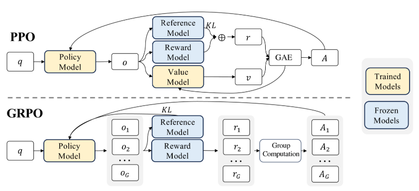
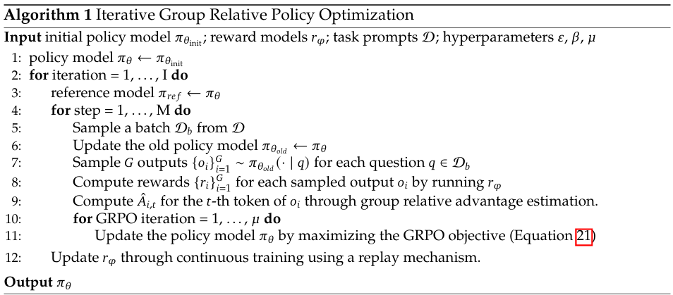
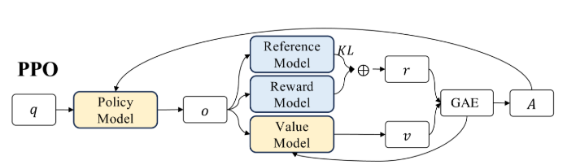
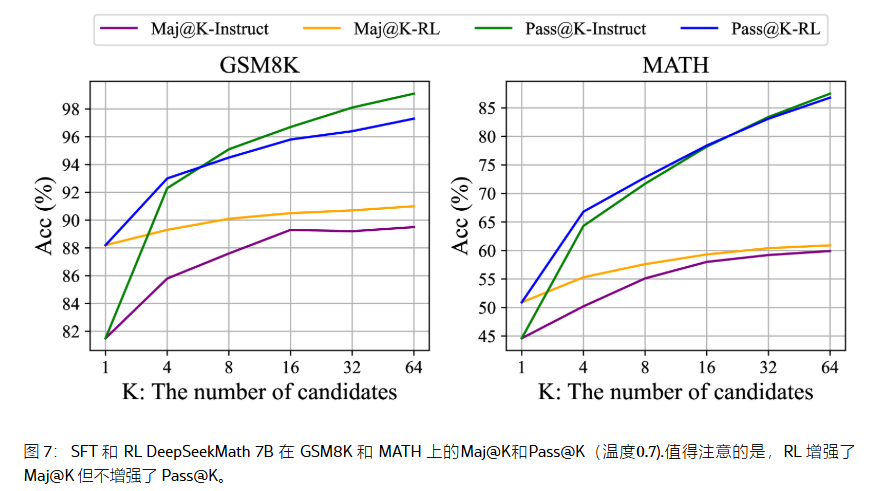
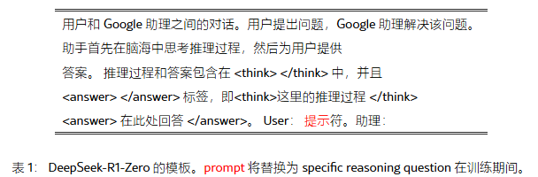
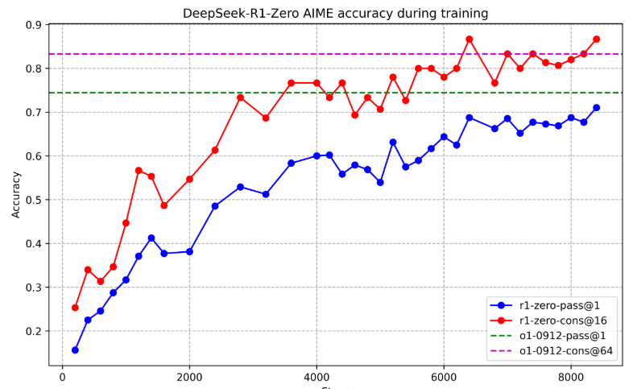
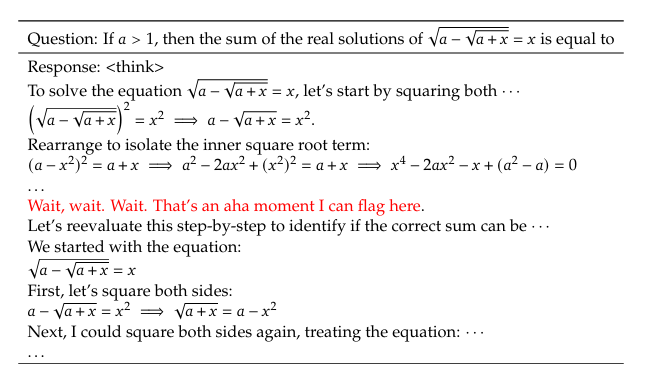

#### 1. PPO

------

视频详解：【中文语音】Umar Jamil 讲解RLHF和PPO https://www.bilibili.com/video/BV1QCq5Y8Eto?vd_source=9d018d6ed6982648faec801ea28f74d9

#### 2. 从 PPO 到 GRPO

------

论文原文：[DeepSeekMath：在开放语言模型中突破数学推理的极限](https://arxiv.org/html/2402.03300v3)

论文精读：https://www.bilibili.com/video/BV1qUFMeGE2q/?share_source=copy_web

#### 2.1 GRPO的提出

Proximal Policy Optimization (PPO) 被广泛用于LLM的强化学习微调（RLHF）阶段。在RLHF中，PPO通过最大化以下代理目标函数来优化LLM：
$$
\mathcal{J}_{PPO}(\theta) = 
\mathbb{E}_{q \sim P(Q), \, o \sim \pi_{\theta_{\text{old}}}(O | q)}
\left[
\frac{1}{|o|}
\sum_{t=1}^{|o|}
\min \left(
\frac{\pi_{\theta} (o_t | q, o_{<t})}{\pi_{\theta_{\text{old}}} (o_t | q, o_{<t})} A_t, \,
\text{clip} \left(
\frac{\pi_{\theta} (o_t | q, o_{<t})}{\pi_{\theta_{\text{old}}} (o_t | q, o_{<t})}, 1 - \epsilon, 1 + \epsilon
\right) A_t
\right)
\right]
$$

> $πθ$ ：当前**策略模型（Policy Model）**。
>
> $\pi_{\theta_{\text{old}}}$ ：**旧的策略模型**（上一次迭代的模型），用于计算**重要性采样比率**。
>
> $q$ ：从**问题数据集** P(Q) 中采样的问题（prompt）。
>
> $o$ ：在旧策略 πθold\pi_{\theta_{\text{old}}}πθold 下生成的输出。
>
> $\epsilon$ ：PPO 引入的**裁剪超参数（clipping-related hyperparameter）**，用于**稳定训练**。
>
> $A_t$** ：优势函数（Advantage Function），用于衡量**当前策略比基准策略更优的程度**，通过**广义优势估计（GAE, Schulman et al., 2015）**计算： 
> $$
> A_t = \sum_{t' \geq t} \gamma^{t'-t} (r_{t'} - V_{\psi}(s_{t'}))
> $$

因此，在 PPO 中，价值函数需要与策略模型 一起训练。此外，为了防止策略过度优化奖励模型，标准方法是在每个 token 的奖励中加入一个 来自参考模型（Reference Model）的 KL 惩罚：
$$
r_t = r_{\phi}(q, o_{\leq t}) - \beta \log \frac{\pi_{\theta} (o_t | q, o_{<t})}{\pi_{\text{ref}} (o_t | q, o_{<t})}
$$

> $r_ϕ $：**奖励模型（Reward Model）**，用于计算模型生成结果的奖励。
>
> $\pi_{\text{ref}}$：**参考模型（Reference Model）**，通常是 **初始 SFT（Supervised Fine-Tuning）模型**，用于作为对比基准。
>
> $\pi_{\theta}$ ：**当前策略模型（Policy Model）**，用于生成 token 。$β$ :  KL 惩罚的系数，控制 KL 正则项的影响程度。
> $β$ ：KL 惩罚的系数，控制 KL 正则项的影响程度。

然而：

1.PPO中采用的 Value Model（价值函数）通常是另一个与策略模型大小相当的模型，会带来大量内存和计算负担。

2.在RL训练期间，价值函数的主要作用是计算 Advantage （优势函数）时减少梯度估计的方差，提高训练稳定性。

> $$
> A(s,a)=Q(s,a)−V(s)
> $$
>
> 其中 $Q(s,a)$ 表示采取动作 $a$ 之后的预期总回报（通常来自蒙特卡洛采样）;
>
> $V(s)$ 是价值函数，表示该状态的预期回报，作为基准（baseline）。

3.由于LLM训练中奖励函数的特殊性，奖励通常只作用于最后一个 token，而 PPO 需要对整个 token 序列估计价值函数，这会导致价值函数训练变得困难，因为前面 token 的奖励信息是间接的。

> 在 LLM 的强化学习（RLHF，Reinforcement Learning from Human Feedback）中，奖励通常只针对最终生成的整个序列，或者仅针对最后一个 token。
>
> 但是价值函数的目标是预测每个 token 的回报，也就是说：
>
> - 在 RL 典型任务（如游戏）中，每个状态 sss 都有一个合理的 $V(s)$。
> - 但在 LLM 中，如果只有最终 token 才有奖励，那么训练价值函数 $V(s)$ 变得困难，因为前面的 token 并没有明确的奖励信号。

图注：PPO 和我们的 GRPO 示范。GRPO 放弃了价值模型，而是根据组分数估计基线，从而显著减少了训练资源

因此我们提出了组相对策略优化 Group Relative Policy Optimization （GRPO） ，它消除了像 PPO 中那样需要额外的价值函数近似，而是使用多个采样输出的平均奖励。更具体地说，对于每个问题 $q$ 中，GRPO对一组输出 从旧策略$\pi_{\theta}$ 进行采样 {$o_1,o_2,...,o_G$} ，然后通过最大化以下目标来优化策略模型：
$$
\mathcal{J}_{GRPO}(\theta) =
\mathbb{E} \left[
q \sim P(Q),
\{ o_i \}_{i=1}^{G} \sim \pi_{\theta_{old}}(O | q)
\right]
\\
\frac{1}{G} \sum_{i=1}^{G} \frac{1}{|o_i|} \sum_{t=1}^{|o_i|}
\left\{
\min \left[
\frac{\pi_{\theta} (o_{i,t} | q, o_{i, <t})}{\pi_{\theta_{old}} (o_{i,t} | q, o_{i, <t})} \hat{A}_{i,t},
\text{clip} \left(
\frac{\pi_{\theta} (o_{i,t} | q, o_{i, <t})}{\pi_{\theta_{old}} (o_{i,t} | q, o_{i, <t})},
1-\epsilon, 1+\epsilon
\right) \hat{A}_{i,t}
\right]
- \beta \mathbb{D}_{KL} [\pi_{\theta} || \pi_{\text{ref}}]
\right\}
$$

> 其中：
>
> - $\pi_{\theta}$ 和 $\pi_{\theta_{old}}$ 分别是当前和旧的策略模型；
> - $q$ 是输入问题，从问题分布 $P(Q)$ 采样；
> - $o_i$ 是采样得到的输出，每组有 $G$ 个输出；
> -  $\hat{A}_{i,t}$ 是 GRPO 计算的优势估计（基于组内相对奖励）；
> - $\epsilon$ 是 PPO 的裁剪超参数，控制策略更新幅度； 
> -  $\beta$ 是 KL 散度的正则化系数； 
> -  $\mathbb{D}_{KL} [\pi_{\theta} || \pi_{\text{ref}}]$ 是当前策略 $\pi_{\theta}$ 和参考策略 $\pi_{\text{ref}}$ 之间的 KL 散度。

与标准 PPO 不同，GRPO 计算优势估计时，仅基于 **同一问题下不同输出的相对奖励**，更符合奖励模型的 **比较性质**，因为奖励模型通常是基于不同答案的相对评分进行训练的。此外，GRPO **直接在损失函数中加入 KL 散度项**，而不是像 PPO 那样在奖励函数中加 KL 惩罚，避免影响优势估计的计算。

我们使用以下无偏估计器来估计KL散度：
$$
\mathbb{D}_{KL} [\pi_{\theta} || \pi_{\text{ref}}] =
\frac{\pi_{\text{ref}}(o_{i,t} | q, o_{i,<t})}{\pi_{\theta} (o_{i,t} | q, o_{i,<t})}
- \log \frac{\pi_{\text{ref}}(o_{i,t} | q, o_{i,<t})}{\pi_{\theta} (o_{i,t} | q, o_{i,<t})}
- 1
$$
该估计方式保证了 KL 散度始终为正值；通过无偏估计，可以更稳定地约束策略更新，防止过度优化。

GRPO 相较于 PPO 的核心区别

优势估计方式不同：   

- PPO 直接使用 单个样本的奖励 计算优势估计；
- GRPO 采用 组内相对奖励 计算优势估计，更符合奖励模型的比较性质

KL 正则化方式不同：

- PPO 在奖励中添加 KL 惩罚项；
- GRPO 直接在损失函数中加入 KL 散度，使其约束更稳定。

目标函数不同：

- PPO 直接优化单个样本的概率比；
- GRPO 计算 组内所有输出的平均值 作为优化目标，使训练更加稳定。

#### 2.2 GRPO的使用方式

##### Outcome Supervision RL with GRPO

结果监督（Outcome Supervision）仅在输出完成后提供奖励，并不考虑输出过程中的细节。

通过对奖励进行标准化，可以消除奖励的尺度影响，使训练更稳定。

这种方法适用于短文本或简单任务，但对于复杂推理任务，可能监督信号不足。

##### Process Supervision RL with GRPO

果监督方法仅在输出结束时提供奖励，对于数学推理等复杂任务来说，可能不够充分或高效。因此，我们采用过程监督（Process Supervision），在推理的每个步骤结束时提供奖励。

##### Iterative RL with GRPO

> 这里通俗解释一下 Iterative RL
>
> 
>
> 图中Reference Model来自训练前的原模型；Reward Model来自预先训练好的判别模型（奖励模型），这两个都是冻结的。随着训练的进行，Policy Model和Value Model的效果变得越来越好，Policy Model和Value Model 与 原来冻结的 Reference Model和Reward Model 的差距变得越来越大，Policy Model输出的结果也与 原始冻结的 Reference Model的输出差距越来越大，那么此时使用 Reference Model和Reward Model 来评估效果的效果评估的差距也越来越大。
>
> 而我们希望Reward Model能够在Policy Model更新的时候也提升一下能力，即在模型训练的时候也训练一下 Reward Model。即可以在训练10%的时间里将Reward Model当作Policy Model，把Policy Model当作Reward Model，两者交换位置交替训练。

随着强化学习训练的进行，旧的奖励模型可能无法有效监督当前的策略模型。因此，我们提出了一种迭代强化学习方法（Iterative RL with GRPO）

**流程**：

1. **生成新的奖励数据集**：使用策略模型采样数据，构建新的奖励模型训练集。
2. **持续训练奖励模型**：采用重放机制（Replay Mechanism），将 10% 的历史数据与新数据混合训练奖励模型。
3. **更新参考模型**：将当前策略模型设为新的参考模型。
4. **使用新奖励模型继续训练策略模型**。

为什么要迭代训练？

- 训练初期，奖励模型是静态的，但随着策略模型优化，数据分布可能发生变化，导致奖励模型对新策略的指导效果下降。

- 通过迭代训练，奖励模型可以持续适应策略模型的变化，保持监督信号的有效性。

#### 2.3 讨论

##### Insights of Reinforcement Learning

在本节中，我们提供了一个统一的范式来分析不同的训练方法，例如 SFT（监督微调）、RFT（奖励微调）、DPO（直接偏好优化）、PPO（近端策略优化）、GRPO（梯度正则化策略优化），并进一步进行实验来探索该范式中的关键因素。通常，一个训练方法相对于参数 θ 的梯度可以表示为：
$$
\nabla_{\theta} \mathcal{J}_\textcolor{red}{\mathcal{A}} (\theta) =
\mathbb[{E}_{\underbrace{{(q, o) \sim \textcolor{red}{\mathcal{D}}}}_{\text{Data Source}}}]
\left[
\frac{1}{|o|}
\sum_{t=1}^{|o|}
\underbrace{G C_{\mathcal{A}} (q, o, t, \textcolor{red}{\pi_{rf}})}_{\text{Gradient Coefficient}}
\nabla_{\theta} \log \pi_{\theta} (o_t | q, o_{<t})
\right].
$$
在此公式中，存在三个关键组成部分：

1. **数据源（Data Source） $\mathcal{D}$**     确定训练数据的来源，即模型的输入数据分布。这可能包括人工标注数据、采样数据或通过不同策略生成的数据。 

2. **奖励函数（Reward Function） $\pi_{rf}$**     提供训练中的奖励信号，决定模型如何优化策略。这可以是基于人类偏好训练的奖励模型，或者是从外部环境反馈得到的奖励。 

3. **算法（Algorithm） $\mathcal{A}$**     处理训练数据和奖励信号，计算梯度系数 $GC_{\mathcal{A}}$，从而确定对数据的惩罚或强化程度。不同的训练方法主要在于如何构造 $GC_{\mathcal{A}}$，即如何调整梯度方向和幅度。

   

##### Why RL Works?

如图 [7](https://arxiv.org/html/2402.03300v3#S5.F7) 所示，RL 增强了 Maj@K 的性能，但Pass@K没有。这些发现表明，RL 通过使输出分布更加稳健来提高模型的整体性能，换句话说，**这种改进似乎归因于提高 TopK 的正确响应，而不是基本能力的增强。**

同样地（Wang 等人，[2023 年一](https://arxiv.org/html/2402.03300v3#bib.bib47))发现了 SFT 模型内推理任务中的**错位问题**，表明可以通过一系列偏好对齐策略来提高 SFT 模型的推理性能

强化学习（RL）主要通过**调整输出分布**来提升模型的最终决策稳定性，而不是让模型学习更多的知识。它让正确答案在 Top-K 选项中更有可能被选中，而不是提高所有答案的质量。这与之前的研究相符合，即**偏好对齐（preference alignment）可以优化推理任务中的模型表现**。

#### 3. DeepSeek-R1

------

论文地址：[DeepSeek-R1：通过强化学习激励 LLM 中的推理能力](https://arxiv.org/html/2501.12948v1)

论文导读：https://www.bilibili.com/video/BV1EmF9e6EdG/?share_source=copy_web

图注：源自导读视频中作者的总结（见评论区置顶)：https://www.bilibili.com/video/BV1EmF9e6EdG/?share_source=copy_web

#### 3.1 贡献 Contributions

后训练：在基础模型上进行大规模强化学习

- 在DeepSeek-v3的基础上直接使用 RL 而没有预先经过 SFT 从而训练出的DeepSeek-R1-Zero。这种直接的方式可以让一个基座模型产生CoT 思维链的能力，从而解决许多复杂问题。DeepSeek是第一个公开大规模实验以验证LLM推理可用纯粹通过RL来提升而无需SFT的，这标志着研究界的一个重要的里程碑。

- 该文介绍了一个用来训练出DeepSeek-R1的pipeline。其包含两个阶段的RL与两个阶段的SFT。

知识蒸馏：小模型也可以很强大

- 我们证明，较大模型所拥有的推理方式（例如CoT等）也可以被蒸馏到小的模型中去。与通过在小模型上使用RL训练得到的推理方式相比，前者效果更好。开源DeepSeek-R1及其API将使研究社区在未来能够蒸馏出更好的小模型。
- 将阿里和meta训练到的模型 Qwen2.5 和 Llama3 通过R1进行蒸馏可以超越，它们同系列中更大的模型的能力。

#### 3.2 方法 Approach

##### 3.2.1 Overview

此前所有工作都使用大量的标注的有监督的数据。在本项工作中证明，即使不使用SFT，也可以通过大量的RL来显著提高推理能力。此外，模型的推理能力还可以被进一步提升，通过少量数据的SFT

##### 3.2.2 DeepSeek-R1-Zero：基础模型上的强化学习

用纯粹的强化学习来优化模型的推理方式。这里DeepSeek-R1-Zero是在以DeepSeek-v3(相当于GPT-4o)为基础模型进行不包含SFT，**没有任何监督数据**的RL。

##### 3.2.2.1强化学习算法 Reinforcement Learning Algorithm

使用DeepSeeK与24.2月份贡献的强化学习算法GRPO，GRPO介绍见前文

##### 3.2.2.2 奖励建模 Reward Modeling

奖励是训练信号的来源，它决定了RL的优化方向。在R1-Zero的训练期间，我们采用了rule-based基于规则的奖励系统，包含两种类型的奖励：

- 准确率奖励：准确率奖励模型用于评估响应是否正确。
  例如，对于具有确定性结果的数学问题，模型需要以指定格式（例如，在框内）提供最终答案，从而实现可靠的基于规则的正确性验证。同样，对于 LeetCode 问题，可以使用编译器根据预定义的测试用例生成反馈。

- 格式奖励：除了准确性奖励模型外，我们还采用了格式奖励模型，该模型强制模型将其思考过程置于 \<think> 和 \</think> 标签之间。

在开发DeepSeek-R1-Zero时，我们使用的奖励系统是基于规则的函数而非神经网络模型。因为我们发现神经网络奖励模型在大规模强化学习中可能会遭遇奖励欺骗（Reward Hacking），重新训练奖励模型需要额外的训练资源，并且使整个训练pipeline复杂化。

> **“奖励欺骗（Reward Hacking）”** 指的是，在大规模强化学习过程中，模型可能会找到某种“漏洞”来最大化奖励，而不是学到真正有价值的策略。这意味着：
>
> - 模型可能会生成**看似符合奖励函数但实际上不合理或低质量的输出**。
> - 由于强化学习依赖奖励信号进行优化，如果奖励模型本身存在偏差，训练出来的模型也会继承这些偏差，甚至放大它们。
> - 在大规模训练中，这个问题**尤其严重**，因为模型可能会利用训练数据中的模式“投机取巧”，而不是学习通用能力。
>
> Neural Reward Mode 需要不断进行重新训练（retraining）：
>
> - 由于奖励模型本身是一个神经网络，它可能需要定期更新，以适应强化学习过程中策略的变化。

##### 3.2.2.3 训练模板 Training Template

##### 3.2.2.4 DeepSeek-R1-Zero 的性能、自我进化过程 Self-evolution Process 和顿悟时刻 Aha Moment

**DeepSeek-R1-Zero 的性能**：

表2：DeepSeek-R1-Zero 和 OpenAI o1 模型在推理相关基准测试中的比较（pass@1为一次性输出通过率表现，consistent@64为连续生成64次表现）

图 2：DeepSeek-R1-Zero 在训练期间的 AIME 准确性。对于每个问题，我们抽样 16 个回答并计算总体平均准确性，以确保评估稳定。

红色是一次性输出准确度，蓝色为输出连续性，可以看到在训练8000步左右R1达到o1的水平。

**自我进化过程 Self-evolution Process**：

图3：RL 过程中 DeepSeek-R1-Zero 在训练集上的平均响应长度。DeepSeek-R1-Zero 自然而然地学会了用更多的思考时间来解决推理任务。

如图 [3](https://arxiv.org/html/2501.12948v1#S2.F3) 所示，DeepSeek-R1-Zero 的思考时间在整个训练过程中显示出持续的改进。这种改进不是外部调整的结果，而是模型内部的内在发展。DeepSeek-R1-Zero 通过利用增加推理响应时间来进行计算，自然而然地获得了解决日益复杂的推理任务的能力。这种计算范围从生成数百到数千个token，使模型能够更深入地探索和完善其思维过程。

**顿悟时刻 Aha Moment**：

表 3：DeepSeek-R1-Zero 中间版本的一个有趣的“顿悟时刻”。该模型学会使用拟人化的语气重新思考。这对我们来说也是一个顿悟的时刻，让我们见证了强化学习的力量和美丽

在 DeepSeek-R1-Zero 的训练过程中观察到的一个特别有趣的现象是“顿悟时刻”的出现。如表 [3](https://arxiv.org/html/2501.12948v1#S2.T3) 所示，这个时刻发生在模型的中间版本中。在这个阶段，DeepSeek-R1-Zero 通过重新评估其初始方法，学会为问题分配更多的思考时间。这种行为不仅证明了模型不断增长的推理能力，也是强化学习如何导致意想不到的复杂结果的迷人例子。

这一刻不仅是模型的“顿悟时刻”，也是观察其行为的研究人员的“顿悟时刻”。它强调了强化学习的力量和美感：我们不是明确地教模型如何解决问题，而是简单地为其提供正确的激励措施，然后它就会自主开发高级问题解决策略。 “顿悟时刻”有力地提醒我们，RL 有可能在人工系统中解锁新的智能水平，为未来更加自主和自适应的模型铺平道路。

**DeepSeek-R1-Zero 的缺点**

尽管 DeepSeek-R1-Zero 表现出强大的推理能力，，但它面临几个问题。例如，DeepSeek-R1-Zero 正在努力应对可读性差和语言混合等挑战。为了使推理过程更具可读性，我们探索了 DeepSeek-R1，这是一种利用 RL 和人类友好型冷启动数据的方法。

#### 3.2.3 DeepSeek-R1： 使用冷启动进行强化学习

受到 DeepSeek-R1-Zero 的可喜结果的启发，自然而然地出现了两个问题：

1） 通过将少量高质量数据作为冷启动，是否可以进一步提高推理性能或加速收敛？
2） 我们如何训练一个用户友好的模型，该模型不仅产生清晰连贯的思维链 （CoT），而且还表现出强大的通用能力？

为了解决这些问题，我们设计了一个pipeline来训练 DeepSeek-R1 。该pipeline由四个阶段组成，概述如下。

##### 3.2.3.1 冷启动 Cold Start

与 DeepSeek-R1-Zero 不同，为了防止基础模型出现 RL 训练的早期不稳定冷启动阶段，对于 DeepSeek-R1，我们构建并收集少量长 CoT 数据，以将模型作为初始 RL 参与者进行微调。为了收集这些数据，我们探索了几种方法：以长 CoT 的 few-shot 提示为例，直接提示模型通过反思和验证生成详细的答案，以可读格式收集 DeepSeek-R1-Zero 输出，并通过人工注释者进行后处理来提炼结果。

我们收集了数千个冷启动数据，以微调 DeepSeek-V3-Base 作为 RL 的起点。 与 DeepSeek-R1-Zero 相比，冷启动数据的优势包括对人类的可读性，和先前实验得到的性能更好的结论

##### 3.2.3.2 面向推理的强化学习 Reasoning-oriented Reinforcement Learning

在根据冷启动数据微调 DeepSeek-V3-Base 后，我们应用了与 DeepSeek-R1-Zero 中相同的大规模强化学习训练过程。此阶段侧重于增强模型的推理能力，尤其是在推理密集型任务中。

在训练过程中，我们观察到 CoT 经常表现出语言混合，尤其是当 RL 提示涉及多种语言时。为了缓解语言混合问题，我们在 RL 训练期间引入了语言一致性奖励，其计算方式是目标语言单词在 CoT 中的比例。

尽管消融实验表明，这种对齐会导致模型的性能略有下降，但这种奖励与人类的偏好一致，使其更具可读性。最后，我们将推理任务的准确性和语言一致性的奖励结合起来，直接相加形成最终的奖励。然后，我们在微调模型上应用 RL 训练，直到它在推理任务上实现收敛。

##### 3.2.3.3 抑制采样和监督微调 Rejection Sampling and Supervised Fine-Tuning

我们将上一轮面向推理的RL训练收敛时的checkpoint来收集SFT数据，用于下一轮的巡的训练。与主要关注推理的初始冷启动数据不同，此阶段整合了来自其他领域的数据，以增强模型在写作、角色扮演和其他通用任务方面的能力。

**推理数据 Reasoning data** 

我们通过从上述 RL 训练的权重执行抑制采样来策划推理提示并生成推理轨迹。 在上一阶段，我们只包含可以使用基于规则的奖励进行评估的数据。然而，在这个阶段，我们通过整合额外的数据来扩展数据集，其中一些数据通过使用生成奖励模型，将真实和模型预测输入到 DeepSeek-V3 中进行判断。 此外，由于模型输出有时混乱且难以阅读，因此我们过滤掉了混合语言、长释义和代码块的思维链。 对于每个提示，我们会对多个响应进行采样，并仅保留正确的响应。我们总共收集了大约 600k 个推理相关的训练样本。

**非推理数据 Non-Reasoning data** 

对于非推理数据，如写作、事实 QA、自我认知和翻译，我们采用DeepSeek-V3 pipeline，并复用DeepSeek-V3的SFT数据集的一部分。对于某些非推理任务，我们调用DeepSeek-V3来生成一个潜在的思维链，然后通过提示来回答问题。但是，对于更简单的查询，例如“hello”，我们不提供 CoT 作为响应。 最后，我们总共收集了大约 200k 个与推理无关的训练样本。

我们使用上述约 800k 样本的精选数据集对 DeepSeek-V3-Base 进行了两个 epoch 的微调。

##### 3.2.3.4 适用于所有场景的强化学习 Reinforcement Learning for all Scenarios

使用一种两个阶段的强化学习训练：

- 对于推理数据，我们遵循 DeepSeek-R1-Zero 中的RL方法，利用基于规则的奖励函数来指导数学、代码和逻辑推理领域的学习过程。

- 对于一般数据，我们采用奖励模型来捕捉复杂和细微场景中的人类偏好。

我们以 DeepSeek-V3 pipeline为基础，采用类似的偏好对和训练提示分布。

#### 3.2.4 Distillation：为小模型赋能推理能力

我们直接对 Qwen 等开源模型进行了蒸馏微调，使用通过 DeepSeek-R1 精选的 800k 样本，这种简单的蒸馏方法显着增强了较小模型的推理能力。

对于蒸馏模型，我们只应用 SFT，不包括 RL 阶段，即使合并 RL 可以大大提高模型性能。我们在这里的主要目标是证明蒸馏技术的有效性。

#### 3.4 讨论

#### 3.4.1 蒸馏与强化学习

通过提炼 DeepSeek-R1，小模型可以取得令人印象深刻的结果。然而，仍然剩下一个问题：该模型能否通过论文中讨论的大规模 RL 训练实现相当的性能，而无需蒸馏？

表6：蒸馏模型和 RL 模型在推理相关基准上的比较。

为了回答这个问题，我们使用数学、代码和 STEM 数据在 Qwen-32B-Base 上进行了大规模 RL 训练，训练了超过 10K 个步骤，从而产生了 DeepSeek-R1-Zero-Qwen-32B。表 [6](https://arxiv.org/html/2501.12948v1#S4.T6) 所示的实验结果表明，经过大规模 RL 训练后，32B 基础模型的性能与 QwQ-32B-Preview 相当。但是，从 DeepSeek-R1 中提炼出来的 DeepSeek-R1-Distill-Qwen-32B 在所有基准测试中的表现明显优于 DeepSeek-R1-Zero-Qwen-32B。

因此，我们可以得出两个结论：首先，将更强大的模型蒸馏成更小的模型会产生极好的结果，而依赖于本文提到的大规模 RL 的较小模型需要巨大的计算能力，甚至可能无法达到蒸馏的性能。其次，虽然蒸馏策略既经济又有效，但超越智能界限可能仍然需要更强大的基础模型和更大规模的强化学习。

#### 3.4.2 未成功的尝试

##### 流程奖励模型 （PRM）

PRM 的核心思想

- PRM（Process Reward Model）是一种用于推理任务的强化学习方法，**通过奖励细粒度的推理步骤来引导模型学习更好的推理路径**。
- 目标是鼓励模型采取更合理的解题路径，而不仅仅是最终答案正确。

PRM 的三个主要局限

1. 难以定义细粒度推理步骤
   - 在一般推理任务中，拆解出清晰的、可学习的中间步骤并不容易。
   - 例如，数学推理可能有多种不同的解题路径，难以确定哪种路径才是“最优的”。
2. 难以准确评估中间步骤的正确性
   - 需要判断模型当前的中间推理步骤是否正确，这在实践中是一个很大的挑战：
     - **自动标注（auto-annotation）**：使用模型来自动生成推理步骤的正确性标签，可能会产生错误或偏差。
     - **人工标注（manual annotation）**：需要大量人工干预，难以扩展到大规模数据集。
3. Reward hacking 问题 + 训练成本
   - PRM 可能会导致奖励欺骗（Reward Hacking）
     - 例如，模型可能学会“优化奖励”而不是“真正改进推理”。
   - 需要不断重新训练奖励模型
     - 训练和维护奖励模型需要额外的计算资源，增加了训练的复杂性。

##### 蒙特卡洛树搜索 （MCTS）

MCTS 的核心思想

- 受 **AlphaGo（Silver et al., 2017b）** 和 **AlphaZero（Silver et al., 2017a）** 启发，MCTS 被用于在推理任务中增强计算的可扩展性。
- 核心思路：
  - **将复杂问题拆解为较小的部分**，然后逐步探索解空间。
  - **引导模型进行搜索**，让它生成多个标签，对应于搜索过程中需要的特定推理步骤。
  - **使用 MCTS 搜索答案**，再利用搜索得到的答案训练一个**价值模型（value model）**，并不断优化整个过程。

MCTS 在推理任务上的挑战

1. 搜索空间远大于棋类游戏
   - 在国际象棋或围棋中，搜索空间有限，状态转换明确。
   - 但在语言任务中，**token 的组合方式呈指数级增长**，导致搜索空间**比棋类游戏大得多**，难以进行高效搜索。
   - 解决方案：限制每个搜索节点的扩展数量（但可能会导致局部最优问题）。
2. 价值模型的训练困难
   - 价值模型（Value Model）决定了搜索过程中哪些路径应该被优先考虑。
   - 但训练一个细粒度的价值模型本身就非常困难，特别是在语言任务中，价值模型可能会**误导搜索过程**，从而影响最终生成质量。
3. 难以复制 AlphaGo 的成功经验
   - AlphaGo 之所以成功，是因为**价值模型的逐步优化**，让搜索变得越来越精准。
   - 但在**自然语言任务**中，由于搜索空间过大、奖励信号复杂，**这一策略难以复现**，导致 MCTS 在增强推理能力方面的效果有限。
