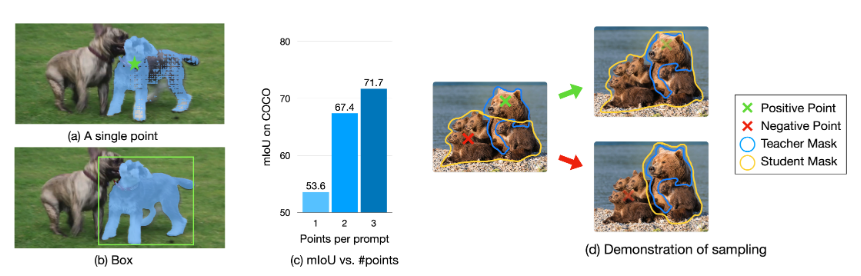
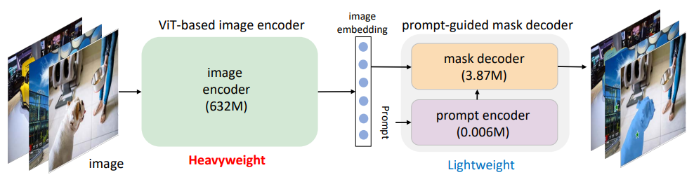
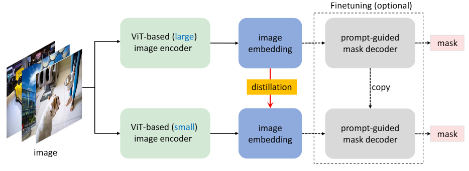
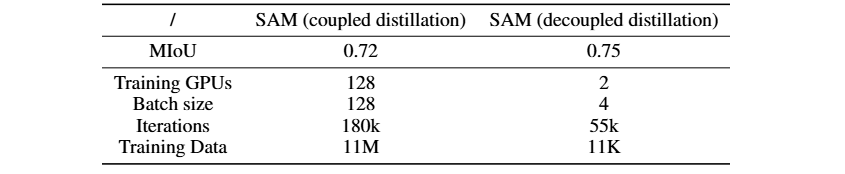
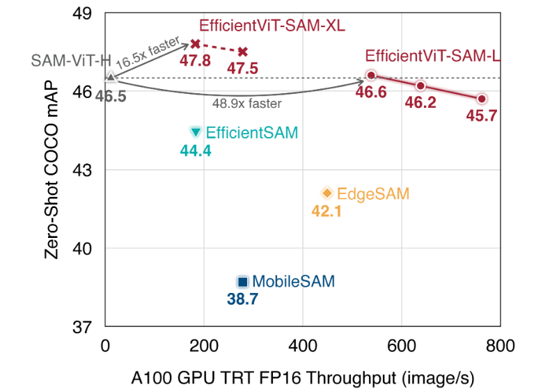
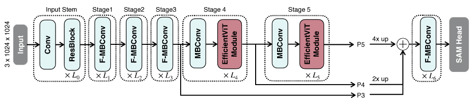
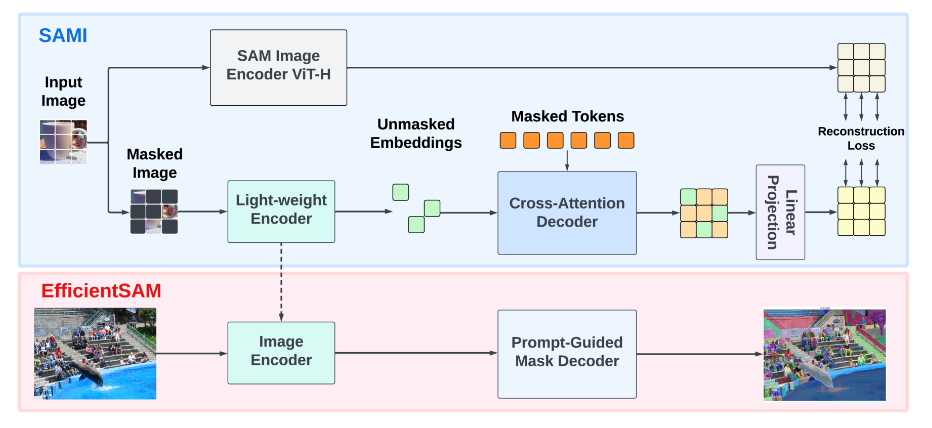
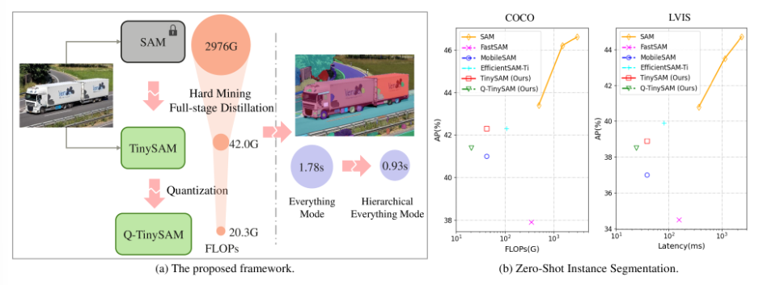
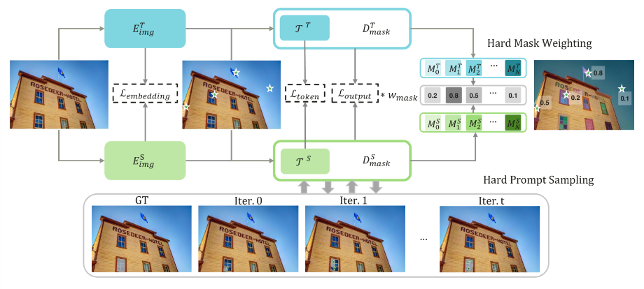
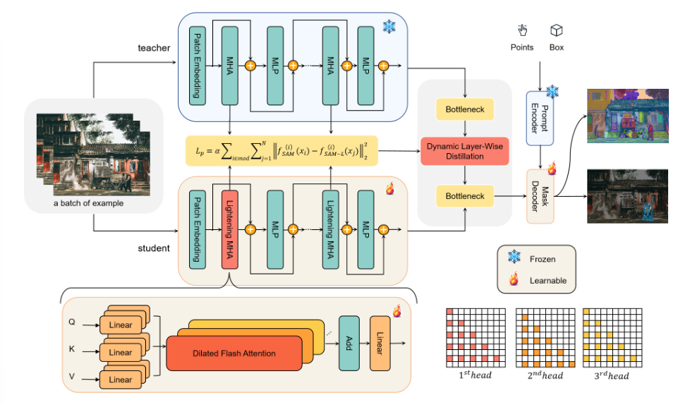

### SAM已有轻量化方案（知识蒸馏 KD）

#### 1. EdgeSAM

https://arxiv.org/abs/2312.06660

通过对各种蒸馏策略进行测试，证明于任务无关的编码器蒸馏无法捕获SAM中全部知识。为此：

1. 本文在蒸馏过程中同时加入了提示编码器和掩码解码器，在循环中加入了框和点提示，以便蒸馏模型能够准确捕捉用户输入和掩码生成之间的复杂动态。

2. 为缓解点提示蒸馏引起的数据集偏差问题，本文在编码器中加入了一个轻量级模块。

#### 导言

图注：图a展示了EdgeSAM的概述。我们首先在SAM和EdgeSAM的图像编码器的输出功能之间应用仅编码器KD。然后我们采用prompt-in-the-loop KD，它以交互方式从错误分割的区域采样点提示。请注意，初始提示符也可以是一个框。

在广泛的实验中，我们发现从SAM中提炼知识，蒸馏过程中提示的战略选择至关重要。因此我们引入一种新的方法：动态prompt-in-the-loop策略。它涉及将学生模型与SAM的多粒度输出掩码积极对齐，并在学生模型显示不准确的区域迭代引入新提示。

在我们的最终观察中，我们注意到 SAM 在具有多粒度注释的数据集上进行了训练，当面对模棱两可的提示（例如单个点）时，在解决输出粒度方面遇到了挑战。在评估期间，当 SAM 在 COCO 数据集上使用中心点提示时，这一点尤其明显;该模型不会始终生成实例级掩码，而是生成部分级掩码。当 SAM 充当教师模型时，这个问题变得更加明显。为此，我们提出了一个简单有效的模块：旨在明确识别和适应特定于给定测试集或应用程序场景的粒度先验。此模块增强了 SAM 准确解释和响应不同级别的提示歧义的能力。

#### 仅编码器知识蒸馏

受到MobileSAM的启发，我们采用像素级特征蒸馏损失损失 L_p 在图像编码器之间 T_e⁢n⁢c 的SAM和高效的网络S_e⁢n⁢c如下：
$$
L_{p} = \text {MSE}(T_{enc}(I), S_{enc}(I))
$$
I 表示输入图像。由于学生模型和SAM图像编码器的下采样步幅和特征通道未对齐，因此MobileSAM会删除学生模型最后两个阶段的下采样操作，并使用投影层来对齐通道维度。但我们保留下采样层不变。相反，我们构建了一个微型FPN，它将特征上采样到所需分辨率，并与前几个阶段的特征进行逐元素相加。

我们按照这种范式探索各种高效的骨干网，包括基于 ViT ，基于 CNN和混合网络。但是，我们发现始终存在相当大的性能差距。使用较长时间表或使用蒸馏损失的训练没有明显的改进。因此，我们进一步考虑在蒸馏过程中使用提示，以提供特定于任务的指导。

图注：图（a-c）显示了具有不同提示符的SAM的行为。当提示模糊时，例如仅有一个点提示，SAM产生的结果不理想。信息量更大的提示可以解决这个问题。在图（d）中，我们演示了Prompt-in-the-loop KD的采样过程。特别时在蒸馏过程中，我们从循环中的假阴性/假阳性区域随机采样新的正/负点提示，以便学生模型动态地关注这些区域。

#### Prompt-In-the-Loop 知识蒸馏

由于最初SAM解码器足够轻量，我们保留架构以便继承其预训练权重。此处我们重新审视SAM掩码解码器。它接收来自图像特征的输入，也接受来自prompt embeddings的输入。在这些输入的基础上，教师和学生模型就有许多潜在的蒸馏目标需要调整。通过实证研究，我们发现以教师掩码输出作为基本事实来监督学生是最有效的，mask decoder loss表述如下：
$$
L_d = L_\text {mask}(\phi (T_{dec}(f_t, p, m, \mathbf {c})), S_{dec}(f_s, p, m, \mathbf {c}))
$$
其中，ϕ(⋅)是二值阈值操作，f_t 和 f_s分别表示来自教师和学生图像编码器的特征。教师和学生共享相同的 p、m 和 c 集合，并在训练过程中保持冻结状态。我们采用Dice损失和BCE损失的组合作为掩码损失L_mask。需要注意的是，我们允许梯度回传到图像编码器，以便进行联合学习。

为了提高蒸馏过程的效率，我们引入了动态快速采样策略。这种方法旨在实现三个关键目标：（1） 从初始提示（无论是框还是点）动态生成一组不同的提示组合；（2） 准确识别掩码内学生模型表现出不准确的区域，从而将其重点引导到这些特定部分；以及 （3） 强制教师模型SAM生成高质量的mask以实现更精确的引导。

从交互式分割方法的最新进展中汲取灵感，我们的策略涉及在蒸馏阶段对循环中的新提示进行迭代采样。 我们从初始提示开始。SA-1B 数据集提供的方框或点提示以相等的概率输入到教师和学生模型的解码器中。随后，我们确定了教师和学生的掩码预测存在分歧的区域。以老师的输出为参考，我们对新的提示进行统一采样：标记为假阴性区域的正点，或者识别为假阳性的区域中的负点。然后，这些新采样的点将与现有提示合并，以进行后续的解码迭代。伪代码如下：

请务必注意，每个提示都会产生不同粒度级别的四个掩码预测。在我们的分析中，差异是专门计算 IoU 分数最高的教师掩码与其相应的学生掩码之间的。

#### 2. Mobile-SAM

https://arxiv.org/abs/2306.14289

本文提出解耦蒸馏。具体来说，本文将知识从原始SAM中的重型图像编码器ViT-H提取到一个轻量级的图像编码器。该编码器可以自动兼容原始SAM中的掩码解码器。

图注：SAM各组件参数量大小，SAM权重集中分布在Image encoder上

#### 耦合蒸馏

我们使用较小的图像编码器重新训练新的SAM。使用ViT-H图像编码器训练SAM需要在256个A100上花费68小时。将ViT-H替换为ViT-L或ViT-B，将所需的gpu数量减少到128个。尽管如此，这仍然是一个重要的负担，我们进一步采用更小的图像编码器，并使用他们提供的11-T分割数据集重新训练新的SAM。数据集中的mask由预训练SAM给出，本质上，这个再训练过程是知识蒸馏。

图注：SAM的耦合知识蒸馏。左子图表示全耦合蒸馏，右子图表示半耦合蒸馏。

#### 从半耦合到解耦蒸馏

将原始SAM转换为较小图像编码器的KD时，难点主要在于图像编码器和组合解码器的耦合优化。直观地说，图像编码器的优化取决于图像解码器的质量，反之亦然。当SAM中的两个模块都处于不好的状态时，将他们都训练到好的状态更具挑战性。

本文建议将KD任务划分为两个子任务：图像编码器蒸馏和掩码解码器微调。首先将图像编码器替换为一个轻量级网络进行蒸馏。由于原始掩码解码器已经时轻量级的，我们计划保留它的架构。为了缓解耦合蒸馏优化问题，一种直接的方法时使用复制和冻结的掩码解码器优化图像编码器（如上图右子图）。冻结操作有助于防止呀那么解码器的质量因图像编码器质量差而下降。我们称这种蒸馏半耦合。经验上，这种优化任然具有挑战性，因为提示的选择时随机的，这使得掩码解码器是可变的，从而增加了优化的难度。因此**我们建议直接从原始SAM中的ViT-H提取小图像编码器，而不需要借助于组合解码器**，这被称为解耦蒸馏（如下图）。对图像嵌入执行蒸馏的另一个优点是，我们可以采用简单的MSE损失，而不是使用focal损失和dice损失的组合来进行掩码预测。

图注：解耦蒸馏

#### 掩码解码器微调的必要性

与半耦合蒸馏不同，上述解耦蒸馏产生了一个轻量级的图像编码器，可能与原始冻结的掩码解码器不匹配。从经验上看，这是不正确的，因为从学生图像编码器生成的图像编码可以足够接近原始教师编码器的图像编码，这使得第二阶段对组合解码器的微调是可选的。在冻结的轻量级图像编码器上微调掩码解码器或将他们联合微调可能会进一步提高性能。

#### 初步评估

我们计算教师SAM和学生SAM在同一个提示点上生成的两个mask之间的mIoU。直观上，假设ViT-H生成的掩码是真实掩码，较高的mIoU表面较高的掩码预测性能。

- 对于耦合蒸馏，采用ViT-B的SAM，在SA-1B（11M图像）上128个GPU（每个GPU1个样本）进行180k迭代。
- 在解耦蒸馏设置中，我们在2个GPU上（每个GPU2个样本以节省计算资源）对0.1%的SA-1B数据集（11k）图像样本进行55k迭代训练模型。

总体而言，解耦蒸馏比耦合蒸馏占用不到1%的计算资源，而耦合蒸馏的平均mIoU为0.75比0.72。

表注：以ViT-B为图像编码器的SAM耦合蒸馏和解耦蒸馏算法比较。解耦蒸馏比耦合蒸馏性能更好，所需的计算资源少于1%

由于ViT-B对移动设备来说仍然是一个重要的负担，因此在接下来的实验中，我们基于我们提出的解耦蒸馏，使用TinyViT(具有5M参数)进行试验。

#### 3. EfficientViT-SAM

https://arxiv.org/abs/2402.05008

本文保留了SAM的轻量级提示编码器和掩码解码器，同时用EfficientViT取代沉重的图像编码器。在训练中，我们从SAM-ViT-H图像编码器到EfficientViT的知识蒸馏(KD)开始。随后，我们在SA-1B数据集上进行端到端训练。

图注：吞吐量与coco Zero-Shot实例分割mAP

#### 方法

图注：EfficientViT-SAM-XL架构。“ResBlock”是指ResNet334的基本构建块，“F-MBConv”是指EfficientNetv2，“EfficientViT Module”是指EfficientViT

我们保留了SAM的提示编码器和掩码解码器架构，同时用EfficientViT替换了图像编码器。它由五个阶段组成。与EfficientViT相似，我们在早期阶段使用卷积块，最后两个阶段使用EfficientViT模块。我们通过上采样和加法融合了最后三个阶段的功能。融合特征被送入几个融合的MBConv块组成的颈部，然后送入SAM头。

#### 训练

我们首先将SAM-ViT-H 的图像嵌入提取到 EfficientViT 中。我们使用 L2 损失作为损失函数。对于提示编码器和掩码解码器，我们通过从 SAM-ViT-H 加载权重来初始化它们。然后，我们在 SA-1B 数据集上以端到端的方式训练 EfficientViT-SAM。

在端到端训练阶段，我们在 box 提示和 point 提示之间随机选择，概率相等。在点提示的情况下，我们从ground truth掩码中随机选择 1-10 个前景点，以确保我们的模型在各种点配置下都能有效执行。在框提示的情况下，我们使用真实边界框。我们将 EfficientViT-SAM-L/XL 型号的最长边调整为 512/1024，并相应地填充较短的边。我们为每个图像选择最多 64 个随机采样的蒙版。为了监督训练过程，我们使用了focal损失和dice损失的线性组合，focal损失与dice损失的比例为 20：1。与 SAM 中为减轻歧义而采用的方法类似，我们同时预测三个掩码，并且只反向传播最低的损失。

我们在 SA-1B 数据集上训练 EfficientViT-SAM 2 个epoch，使用批处理大小 256。AdamW 优化器的动量为β1= 0.9 和β2= 0.999 的。初始学习率设置为 2e*-6*/1e*-6*对于 EfficientViT-SAM-L/XL，使用余弦衰减学习率计划衰减到 0。关于数据增强，我们使用随机水平翻转。

#### 4. EfficientSAM

https://arxiv.org/abs/2312.00863

本文采用SAM预训练的轻量级图像编码器和掩码解码器来构建EfficientSAMs，并在SA-1B上微调模型以分割任何任务。本文使用了**MAE方法**来训练Image Encoder，因此在相同吞吐量下EfficientSAM的质量击败MobileSAM并不意外。

图注：大家方法都类似，EfficientSAM-Ti与MobileSAM吞吐量相当，性能更好

#### 方法

图注：EfficientSAM框架概述。我们提出的EfficientSAM包含两个阶段：ImageNet上SAMI预训练（上）和SA-1B上的SAM微调（下）。对于SAMI预训练，掩码自编码器将SAM图像编码器的特征嵌入作为重建目标。在SAMI预训练之后，解码器被丢弃，轻量级编码器被用作EfficientSAM的图像编码器，用于在SA-1B上进行微调。

#### 利用SAM的Mask图像预训练

我们现在采用 MAE 框架以获得高效的图像编码器，用于训练Segment anything model。我们探讨了 SAM 图像编码器的潜在特征作为利用 MAE 的重建目标。我们方法强调转移嵌入在SAM中的知识，上图顶部概述了利用SAM掩码图像预训练SAM Image Encoder。编码器将未编码的标记转换为潜在特征表示，解码器在编码器的输出特征嵌入的帮助下重建掩码标记的表示。

##### Cross-Attention Decoder

在SAM提供监督信号下，我们观察到只需要通过Decoder重建Masked Tokens，而Encoder的输出可以在重建过程中充当锚点。在交叉注意力解码器中，**query来自Masked Tokens，Key和Value来自Encoder的未被掩码的特征和掩码特征**。我们将交叉注意力解码器的Masked Tokens的输出特征和编码器的未被mask的token的输出特征合并，用于MAE输出embedding。然后，这些组合特征将被重新排序到最终MAE输出的输入图像token的原始位置，还原出完整的图像特征。

##### Linear Projection

我们通过编码器和交叉注意力解码器获取图像输出。然后，我们将这些特征输入到投影层中以对齐来自SAM图像编码器的特征。

##### 重建 Loss

在每次训练迭代中，SAMI 包含从 SAM 图像编码器进行的前馈特征提取，以及 MAE 的前馈和反向传播过程。SAM 图像编码器和 MAE 线性投影头的输出被用来计算重构损失。

我们将 SAM 图像编码器表示为 $f_{\text{sam}}$ ，将 MAE 的编码器和解码器分别表示为 $g_e$ 和$g_d$，其权重分别为 $W_e $和 $W_d$，线性投影头表示为 $h_{\theta}$，其权重为 $W_{\theta}$。假设输入的令牌表示为 $ \{\mathbf{x}_i\}_{i=1}^N$，其中 $N$ 是令牌的数量。输入的令牌被随机分为未掩盖的令牌 $\{\mathbf{x}_i\}_{i \in \mathcal{U}}$ 和具有给定掩码比例的掩盖令牌 $M\{\mathbf{x}_i\}_{i \in \mathcal{M}}$。令特征重排序操作符为 $\phi$，合并操作符为$\oplus$。

SAM 图像编码器获取的目标特征可以表示为$f_{\text{sam}}(\mathbf{x}) = f_{\text{sam}}(\{\mathbf{x}_i\}_{i=1}^N)$，MAE 编码器的输出为 $g_e(\{\mathbf{x}_i\}_{i \in \mathcal{U}})$，解码器的输出为 $g_d(\{\mathbf{x}_i\}_{i \in \mathcal{M}})$。线性投影头的输出为 $ fh(x)=h_θ(ϕ(g_e\{x_i\}_{i∈U}⊕g_d\{x_i\}_{i∈M}))$。因此，我们的目标重构损失可以表示为：
$$
\label {equ:recon} \begin {split} L_{W_e, W_d, W_{\theta }} = \frac {1}{N} \cdot \sum _{j = 1}^N ||f^{\text {sam}}(\mathbf {x}) - f^h(\mathbf {x})||^2  \end{split}
$$
其中 $N$ 是输入令牌的数量，$∥⋅∥$ 表示一个范数。我们在实验中使用 $ℓ2$ 范数作为重构损失。通过最小化重构损失 $L_{W_e, W_d, W_{\theta}}$，我们的编码器 geg_ege 被优化为一个图像主干，以提取与 SAM 图像编码器相同的特征。我们的编码器、解码器和线性投影头被优化，以从 SAM 图像编码器中学习上下文建模能力。在所有令牌上优化重构损失能够传递 SAM 中嵌入的知识。

#### 5. TinySAM

https://arxiv.org/abs/2312.13789

- 本文首先提出了一种具有难样本提示采样和难样本掩码加权策略的全阶段知识蒸馏方法，以此提炼出一个轻量级学生模型。
- 此外还将训练后量化调整未可提示的分割任务，并进一步降低计算成本。
- 此外提出了一种分层分割一切策略（segment everything模式的加速策略），加速推理2倍且几乎没有性能下降。

图注：（a）我们提出的方法的总体框架。由hard mining全阶段知识蒸馏、训练后量化和分层一切（Hierachical Everything Mode）推理等模块组成，计算成本降低了数量级。（b）所提出的TinySAM可以在保持性能的同时节省相当大的计算成本。部署在NVIDIA T4 GPU上使用TensorRT进行测试。

为了进一步推动高效分割任何模型的极限，我们提出了一种难样本挖掘全阶段知识蒸馏方法，以提高紧凑学生网络的能力。提出了一种掩模加权蒸馏损失，以通过大量不同的 SA-1B 掩模有效地将信息从教师传递给学生。此外，提出了一种在线硬提示采样策略，使蒸馏过程更多地关注困难示例，从而提高最终性能。此外，我们发现分割图像中的所有内容需要巨大的计算成本，因为必须从网格提示点生成大量蒙版。 为此，提出了一种分层分割一切策略，通过以下方式加速一切推理2×几乎没有性能下降。 

#### 方法

图注：难样本挖掘Hard-Mining全阶段知识蒸馏框架。我们设计了用于提示的Hard Mining采样和用于蒸馏损失的难样本掩码Hard Mask加权。对于难样本提示Hard Prompt采样过程，星号表示不同迭代的采样点。**通过提示采样的迭代，采样区域更接近目标掩码的边缘，这使得提示相对更难学习**。此外，根据学生和教师网络之间的差距，在计算蒸馏损失时为每个掩码分配不同的权重

##### Hard Mining 全阶段知识蒸馏

受到MobileSAM的启发，我们使用TinyViT替换原来的ImageEncoder。这种简单的替换存在相当大的性能衰减。因此，我们提出了一种Hard Mining全阶段KD策略，从多个知识层次指导轻量级图像编码器。

除了预测结果和真实标签之间的常规loss之外，我们还引入了不同阶段的多次蒸馏损失，如上图所示。具体来说，我们选择了教师网络的几个节点。首先我们选择图像编码器的输出特征，图像嵌入的KD loss可以表示为：
$$
L_{embedding} = L(E^T_{img}(I),E^S_{img}(I))
$$
由于图像级别信息与掩码预测没有直接关系，因此更接近最终输出的特征对此分割任务至关重要。自然地，教师网络的最终输出被选为蒸馏点。输出蒸馏损失可以描述为：
$$
L_{output} = L(D^T_{mask}(E^T_{img}(I), q), D^S_{mask}(E^S_{img}(I), q))
$$
q表示掩码解码器的query，它是prompt embeding和output token的串联。由于SAM结构相当复杂，前面提到的两次蒸馏可能不一致，轻量级学生模型很难学习。我们进一步建议从掩码解码器的双向Transformer中提取输出token，该Transformer来自提示嵌入和图像嵌入的信息进行交互。它以更抽象的方式捕获目标掩码信息。相应的蒸馏loss可以描述为：
$$
L_{token} = L(T^T(E^T_{img}(I), q), T^S(E^S_{img}(I), q))
$$
T是来自mask decoder的双向Transformer块，我们凭经验发现，特征差异的数值可以使常规使用的MSE损失（L2 distance）太小而无法很好地优化。因此我们使用L1 distance整体蒸馏损失可以表示为：
$$
L_{distill} = α ∗ L_{embedding} + β ∗ L_{token} + γ ∗ L_{output}
$$
α,β,γ表示每个蒸馏loss的超参数，总训练loss是掩码预测的蒸馏损失和真实损失的线性组合$L_{mask}$和IoU预测$L_{ious}$， $L_{mask}$是focal loss和dice loss的组合，$L_{ious}$是L1loss在预测IoUs和计算IoUs之间的损失函数：
$$
L_{total} = L_{distill} + L_{mask} + L_{ious}
$$

##### Hard Mask Weighting 难样本掩码加权

为了使知识蒸馏更有效，我们在计算loss时设计了一个Hard Mask加权策略。据观察，由于SA-1B数据集的细粒度且没有语义约束，因此SA-1B数据集的单个图像中的mask可能非常多样化。如图2所示，分割具有复杂边界的标志可能很困难，而分割具有高对比度颜色的矩形窗口可能很容易。Hard Mask应合理地分配更大的权重，以便学生学习。具体来说，我们计算学生网络和教师网络输出的差距来表示掩码的难度
$$
H_i = sigmoid(\frac{IoU(M^T_i, M^{GT}_i )}{
IoU(M^S_i, M^{GT}_i) + ϵ}− 1)
$$
$M^T_i,M^S_i,M^{GT}_i$表示教师网络Mask预测，学生网络Mask预测和ground truth Mask。因此，蒸馏loss可以用：
$$
L^*_{\text{distill}} = \alpha * L_{\text{embedding}} + \beta * L_{\text{token}} + \gamma * \sum_{i=1}^{N} H_i \times L^i_{\text{output}}
$$

##### Hard prompt 采样

通常可以采用从以标注训练数据中随机采样来生成，以驱动基于提示的掩码预测网络作为SAM的端到端训练。为了进一步简化教师与轻量级学生网络之间蒸馏的学习过程，我们提出了一种难样本提示采样策略，使训练样本集中在预测的难点区域。以点提示为例，$P_0$ 最开始在掩码区域 $M_{\text{gt}}$ 内采样提示点，这些初始点与输入图像一起送到网络中，以获得预测的掩码区域$M_0$，然后我们从 $M_{\text{gt}}$ 和 $M_0$ 的差集内采样提示点，并以交互的方式i进行操作。在第$i+1$轮中采样点来自 $M_{\text{gt}}$ 和 $M_i$ 的差集：
$$
P_{i+1} \in M_{\text{gt}} - M_i, \quad i = 0, 1, 2, \ldots
$$
其中：
$$
 M_i = D_{\text{mask}}(E_{\text{prompt}}(P_i), E_{\text{img}}(I))
$$
在训练过程中，第$i$次迭代的$i$是从0到9随机采样的，这使得采样提示的难度在一个受限的范围内。上图的底部显示了采样提示随迭代次数的变化位置，绿色星星表示使用在线困难提示采样策略新采样的点。随着迭代次数的增加，采样点越来越接近地真掩码的边缘区域。

##### Hierarchical Segmenting Everything 分层分割一切

图：我们的分层策略与原始策略之间的比较。（a）原始分割一切模式的点采样，以points_per_side=16为例。（b）原始策略的细分结果。（c）我们分层策略的第一步，只是对1/16的点采样。（d）从（c）获得高置信度区域，并忽略此区域中的点，高置信度区域显示为白色掩码。（e）我们的分层策略的细分结果。

SAM 提出了一个自动掩码生成器，它将点采样为网格以分割所有内容。然而，我们发现密集的点网格会导致分割结果过于细粒度，并且还占用了大量的计算资源。一方面，对于完整的对象，过多的采样点可能会导致对象略有不同的部分被错误地分割为单独的掩码。另一方面，由于图像编码器已经大大缩小，一切模式推理的时间成本主要在掩码解码器部分。对于 SAM 自动模板生成器的默认设置，它会采样32×32=1024点作为提示符，这意味着掩码解码器是由1024次。费用16ms 用于图像编码器和894ms 用于单个 V100 GPU 上的掩码解码器。

为了降低 everything 模式的时间成本，我们提出了一种分层掩码生成方法。我们的分层策略与原始策略之间的比较如图 [3](https://arxiv.org/html/2312.13789v2#S3.F3) 所示。与原来的 everything 模式不同，第一步我们只使用25%点数，因此总点数为1/16的原始设置，如图 [3](https://arxiv.org/html/2312.13789v2#S3.F3)（c） 所示。然后，我们使用这些提示推断 prompt encoder 和 mask decoder 并得到结果。

然后，我们过滤掉一些掩码，置信度超过阈值τ，并将相应的位置标记为可视为最终预测的区域。对于这些区域，由于它们被视为具有高置信度的实例的分割结果，因此无需重新生成点提示。然后，我们将点采样为与原始设置相同的密度，但忽略上述区域中的点。如上图（d）所示，我们的策略忽略了第一头奶牛的草地和身体上的大多数点。同时，第二头奶牛和天空上的点被保留以进一步分割。具体来说，第二头奶牛被错误地分割为与第一头奶牛相同的对象。此策略可以避免推理时间成本和对象的过度精细分割。然后，我们利用第二轮采样的点提示来获得掩码预测。最后，将这两轮的结果合并并进行后处理，得到最终的蒙版。超过50%我们的方法忽略了 points 的 Points，从而大大减少了延迟。

#### 6. SAM-Lightening

https://arxiv.org/abs/2403.09195

现有的工作集中在优化编码器上，但并没有充分解决注意力机制本身的低效率问题，即使被提炼成一个更小的模型。

- 我们引入了 SAM-Lightening，这是 SAM 的一种变体，它具有重新设计的注意力机制，称为 Dilated Flash Attention。 它不仅有助于提高并行度，提高处理效率，而且保持与现有 FlashAttention 的兼容性。
- 相应地，我们提出了一种渐进式蒸馏法，以实现从普通 SAM 的高效知识转移，而无需从头开始进行昂贵的培训。

在 COCO 和 LVIS 上的实验表明，SAM-Lightening 在运行时效率和分割精度方面都明显优于最先进的方法。 具体来说，对于大小为 1024 的图像，它可以实现每张图像 7 毫秒 （ms） 的推理速度×1024 像素，即30.1×比原版 SAM 更快，并且2.1×比最先进的。 此外，它只需要244 MBmemory，即(3.5%)原版 SAM。

图注：SAM-Lightening 的整体框架以及动态分层蒸馏，可以有效地从原版 SAM 中转移知识

#### Dilated Flash Attention

为了满足 SAM 图像编码器的高计算需求，我们使用 FlashAttention 设计了一种新的注意力操作来加快推理速度。

##### 分割和稀疏化

为了减轻QKV的处理，我们将每个输入分成等长的部分W，然后沿每个区段内的序列维度应用稀疏化。这种稀疏化涉及以固定间隔（r），从而减少attention机制需要处理的数据量。如上图所示。

##### 使用FlashAttention进行并行处理

每个输入数据的稀疏片段是密集矩阵，可以独立参与注意力计算，因此可以并行处理。 这种并行性对于有效管理大规模图像数据集至关重要，可以显著加快处理时间并提高模型的实时图像分割效率。 合并 FlashAttention 通过在过程中并行化密集矩阵计算来进一步提高效率。

 在提出的 Dilated Flash Attention 框架中，我们并行处理稀疏的 Segment：
$$
O_{i} = \text{softmax}(Q_{i} \cdot K_{i}^T) \cdot V_{i} \quad
$$
将这些输出重新组合成内聚的最终输出O涉及精心设计的流程：

1. 首先，我们建立一个与原始输入尺寸相同的零矩阵$O_{\text{init}} $，用于累加各个片段的输出。 
2.  对于每个计算出的片段输出$ O_{i}$，会确定一个特定的偏移量 $ \gamma_i$。该偏移量决定了 $O_{i} $ 在 $ O_{\text{init}} $ 矩阵中的精确起始位置。
3.  使用基于 $ \gamma_i $ 的映射操作将每个 $ O_{i} $ 映射到 $ O_{\text{init}} $ 中：

“MAP”操作将每个$ O_{i}$ 元素根据$ \gamma_i$确定的位置放置到 $O_{\text{init}}$中。这保证了每个片段的输出在最终输出矩阵$ O $中与原始输入位置的准确对齐。

#### Dynamic Layer-Wise Distillation 动态分层蒸馏 (DLD)

从头开始训练 SAM-Lightening 的成本很高，而由于以 ViT-H 作为特征编码器的 SAM 与 SAM-Lightening 之间的独特结构，层适应具有挑战性。 为了实现从普通 SAM 到所提出的框架的高效知识传递，我们提出了一种新的动态分层蒸馏 （DLD），它可以动态修改特征权重以增强模型之间的分层蒸馏

##### 动态分层权重

当前一层没有得到很好的提炼时，后一层的性能可能会受到从前一层中提取的低质量特征的影响。通过为这些初始层的损失分配更大的权重，动态加权可确保它们在训练过程中获得更多关注。这有助于在初始阶段更好地使学生模式与教师模式保持一致。

##### 解耦特征蒸馏

蒸馏过程将知识从 SAM 的编码器（教师模型）转移到我们提议的编码器（学生模型），如上图所示。我们选择了N最接近 output 的 Layers 进行特征蒸馏。由于这些更深的层与模型的输出直接相关，因此提炼它们可以更有效地传输预测结果的关键信息。这些图层被指定为 “焦点图层”。

在训练的初始阶段，更靠近 input 的层优先。这里的目的是对齐学生模型的 SAM-Lightning 主要特征表示。随着训练的进行，分层权重会动态变化。与后续层相关的损耗逐渐放大。

##### 对齐解码器

此外，通过解耦蒸馏获得的轻量级图像编码器与冻结解码器存在对齐问题，尤其是对于基于点的提示分割任务。因此，我们通过在 SA-1B 数据集上采样点提示和框提示来微调解码器，使其与图像编码器保持一致。

