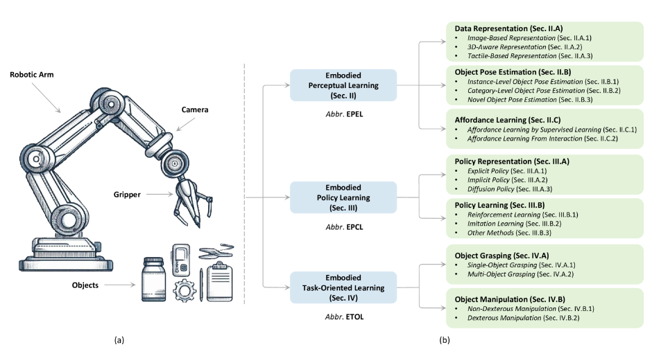
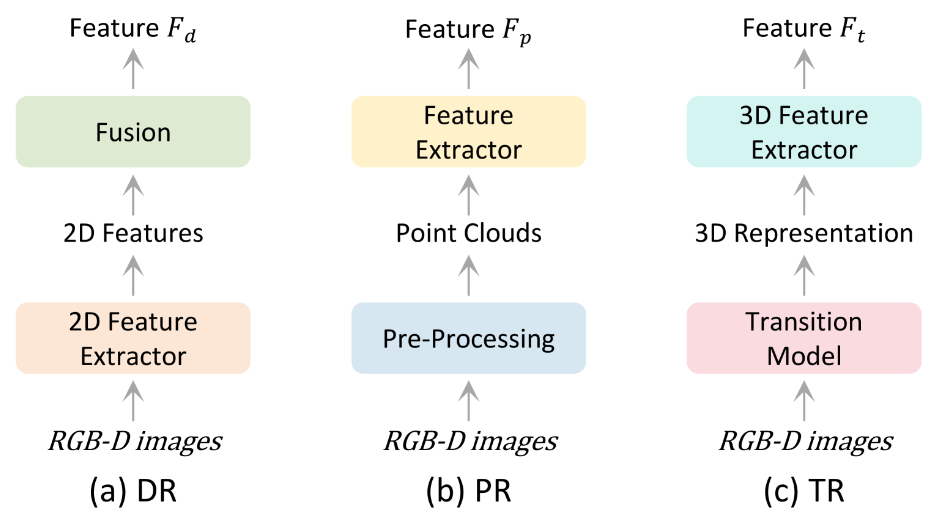
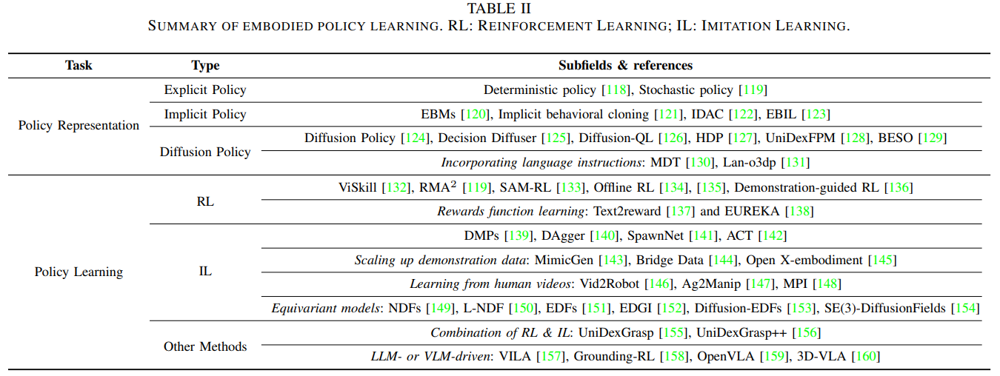
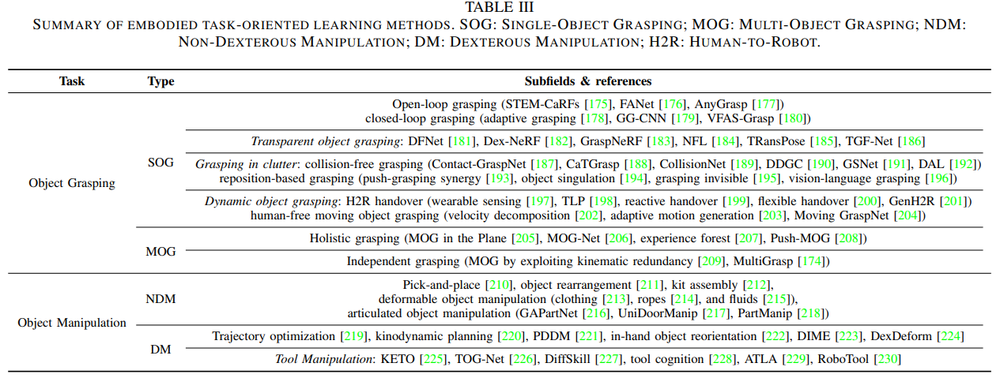
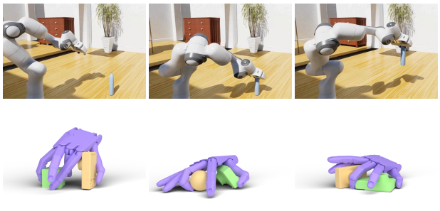
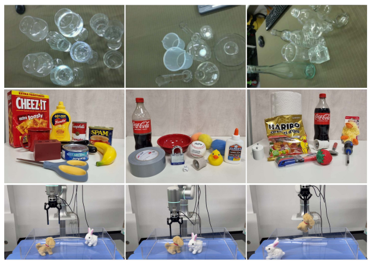
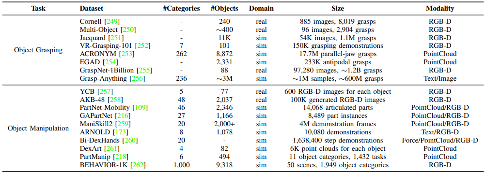

#### 具身智能机器人操作综述

#### A Survey of Embodied Learning for Object-Centric Robotic Manipulation

[[2408.11537v1\] A Survey of Embodied Learning for Object-Centric Robotic Manipulation (arxiv.org)](https://arxiv.org/abs/2408.11537v1)

一个典型的机器人操作系统，它的智能围绕三个关键方面展开，对应三种类型的具身学习方法：
1，高级感知能力，Perceptual Learning，利用不同传感器捕获的数据来了解与表征目标物体和外部环境
2，精确的策略生成，Policy Learning，分析感知到的信息以做出最佳决策
3，任务导向，Task-Oriented Learning，通过优化执行过程以实现最大效率，确保系统能够适应特定任务

- 图注：机器人操作系统的插图（左）和以对象为中心的机器人操作的具身学习方法的类型（右）。EPEL 将从摄像头等传感器获得的数据作为输入，通过交互增强对物体和环境的理解。它是 EPCL 和 ETOL 的基础。EPCL 利用 EPEL 提供的感知信息为机械臂和夹具等末端执行器制定动作策略，从而为 ETOL 提供特定的操作能力。ETOL 集成了 EPEL 和 EPCL，学习根据不同对象的特性执行不同的任务。这三个密切相关的学习过程协同工作，使机器人能够完成复杂的任务。

#### 1 具身感知学习 Perceptual Learning

#### 1-A 数据表示：
##### 1-A1 基于图像的表示

现有方法大致可分为四种类型：单图像单分支 （SISB）、单图像多分支 （SIMB）、多图像单分支 （MISB）和多图像多分支 （MIMB）

- 图注：SISB: Single-Image Single-Branch 单图像单分支; SIMB: Single-Image MultiBranch 单图像多分支; MISB: Multi-Image Single-Branch 多图像单分支; MIMB: Multi-Image MultiBranch 多图像多分支

（a）SISB 方法将单个 RGB 图像作为输入，具有具有单个主路径的流线型网络架构。尽管 SISB 速度快、简单，但在表达对象的 3D 几何信息方面的限制可能会导致随后的物体姿态估计更粗糙。
（b）为了克服 SISB 的局限性，SIMB 方法在主要途径旁边引入了额外的网络分支。这些附加分支旨在捕获更丰富的辅助信息，例如生成关键点热力图和法线图。它提供更强大的中间表示，从而提高姿势估计的准确性。但是，此方法在很大程度上依赖于其他分支的预测准确性。由于基于单个图像进行预测的固有局限性，在生成的中间表示中不可避免地会引入错误。这些错误会放大对后续处理步骤的不利影响，并增加机器人操作任务的不确定性。
（c） 由于单个图像中缺乏比例信息，准确估计物体的 3D 几何信息相当具有挑战性。因此，许多研究都集中在探索使用多张图像来解决这一限制的方法上。该框架旨在使用多个图像进行 3D 重建，以恢复场景的深度信息，这反过来又有助于生成高效的 3D 表示。具体来说，深度恢复可以通过NeRF或3D高斯喷溅等先进技术来实现
（d)与 MISB 不同，MIMB 旨在从机器人在多个位置捕获的图像中直接生成多视图图像表示，绕过 3D 重建阶段。MIMB 方法结合了额外的预测器来获取额外的信息，弥补了 3D 信息的缺失并增强了机器人的场景感知。

##### 2-A2 3D感知表示

现有方法根据它们生成的表示分为三类：基于深度的表示 （DR）、基于点云的表示 （PR） 和基于过渡的表示 （TR）。

- 三个 3D 感知表示框架的概念比较。DR：基于深度的表示; PR：基于点云的表示; TR：基于过渡的表示。

（a）DR 方法通常采用网络同时从 RGB-D 图像中提取 2D 特征。一种方法是引入一个两阶段级联网络架构，其中第一个网络有效地过滤掉了在提取特征时生成的许多不太可能的抓取，第二个网络专注于评估来自第一个网络的检测。另一条研究路线是利用双流网络从 RGB 和深度图像中独立提取 2D 特征。随后，这些特征被组合或融合以生成最终特征用于下游任务。
（b）PR 方法不是直接提取 RGB-D 图像上的特征，而是首先通过预处理创建点云。主流方法更喜欢利用类似 PointNet 的框架，这些框架支持从点云中的各个点直接提取特征，然后是针对不同目标定制的任务特定模块。
（c）TR方法专注于通过将输入 RGB-D 数据转换为 3D 表示形式（如占用场、NeRF 或 3D 高斯）来提高模型对 3D 几何的理解。

##### 1-A3 基于触觉的表示
触觉传感技术领域多种多样，例如接触位置、法向力、切向力和扭矩。此数据的表示方法也各不相同。一种常见的表示形式是通过在特定时间窗口内对触觉反馈进行多次采样而获得的时间序列。另一种表现形式是触觉图像，它以类似于标准 RGB 图像的直观格式直观地呈现触觉信息，并且可以使用 CNN 直接处理以进行特征提取。此外，触觉数据可以与其他模态（例如视觉和音频）集成，以创建多模态表示。

此外，创建高质量的触觉表示通常需要大量的训练数据。但是，收集触觉数据比收集视觉数据更耗时。为了克服这一挑战，研究人员提议利用 NeRF 或 GAN 等技术来生成触觉数据或构建模拟环境以模拟触觉体验。

#### 1-B 对象姿态估计

取检测是机器人操作的重要组成部分，它依赖于准确的物体姿态估计作为关键步骤。姿态估计的精度会显著影响机器人成功抓取目标物体的能力。根据预测输出的类型，物体姿态估计方法主要分为两类：2D 平面姿态估计和 3D 空间中的 6D 姿态估计。现有的大多数工作都集中在 6D 物体姿态估计上，它可以分为三类：实例级、类别级和新颖的物体姿态估计

##### 1-B1 实例级物体姿态估计 （ILOPE）

它是指估计物体的特定实例的姿势，例如特定的杯子。现有方法通常需要对物体的形状和外观有详细的先验知识，而纹理 CAD 模型可以提供这些知识。由于这些方法对目标对象的特定样本进行训练，因此训练的模型是特定于对象的。

一些方法利用深度神经网络直接回归物体的 6D 姿态，例如 PoseCNN 和 CDPN .但是，这些方法可能仍需要后处理优化获得更好的预测结果，因为它们相对简单。另一类方法涉及使用关键点学习 2D-3D 或 3D-3D 对应关系然后采用基于 RANSAC 的 PnP（Perspective-n-Point）算法生成姿势估计结果。此外，模板匹配template matching或特征点投票feature point voting是 6D 物体姿态估计的有前途的方法。

上述方法的优点是可以产生高度准确的姿态估计结果。但是，它们需要针对每个实例进行训练，这使得它们不适合处理大规模和多样化的对象集。

##### 1-B2 类别级对象姿态估计 （CLOPE）
它涉及估计属于预定义类别的对象的姿势，例如杯子。此任务的现有方法通常不依赖于对对象的特定实例的训练。相反，它们使用对象类内或对象类之间的某些特征执行姿势估计。这些方法不需要每个实例都有 3D 模型，这在事先不知道物体的确切形状和外观时特别有用。

为了在类别级别估计物体姿态，一些人引入了 NOCS（标准化对象坐标空间），这是一种基于对象类别的坐标系。NOCS 将物体的姿态和大小编码为归一化坐标向量，然后可以通过神经网络直接推断观察到的像素与 NOCS 之间的对应关系。另一些人利用对象类别的结构化先验来指导姿势适应，并采用基于 transformer 的网络来模拟对象实例和先验之间的全局结构相似性。 这些方法主要适用于刚性物体的位姿估计。对于复杂的铰接式物体姿势，研究人员在NOCS 的基础上进行了扩展，并引入了 ANCSH（发音感知标准化坐标空间层次结构），这是一种为铰接对象量身定制的类别级表示方法。此外，研究人员还提出了一种称为 CAPER （CAPE-Real） 的真实任务设置，它可以处理多个实例和不同的运动结构。

上述方法都是在假设对象类别已知的情况下估计对象的姿态。他们通常使用已知对象类别的数据集训练模型，然后对对象的新实例执行姿势估计。这些方法支持在预定义的对象类别中泛化，但它们无法处理新的对象类别。

##### 1-B3 新物体姿态估计 （NOPE）

近年来，它已成为一个非常活跃的研究领域，用于在训练期间估计以前看不见的类别中新物体的姿态。在这种情况下，实例级 3D 模型和类别级先验信息不可用，但我们可以获取目标对象的参考图像作为辅助。

在这个领域，经典方法通常采用图像匹配或特征匹配技术，然后对新的对象实例执行姿势估计。例如Gen6D（一种新颖的 6D 位姿估计方法，集成了对象检测器、视点选择器和位姿优化器，无需依赖 3D 模型即可推断看不见的物体的 6D 位姿），和Goodwin等人提出的一种基于自监督视觉转换器和语义对应的方法，以实现零镜头物体姿态估计。

最近，研究界越来越关注利用大型模型来增强 NOPE 任务的深度模型的泛化能力。例如SAM-6D 方法采用SAM强大的语义分割功能以生成潜在的对象提议。同时，weng等人研究了将 LLM 与对比学习相结合的方法，通过在大规模合成数据集上进行训练来显着提高模型泛化。
这些方法的主要优点是它们可以处理新的对象类别，从而增强它们在更广泛的实际场景中的通用性和适用性。

#### 1-C 可供性学习

获得估计的物体姿态后，下一步涉及识别物体的潜在交互区域，这个过程称为可供性学习。作为机器人操作的关键组成部分，可供性学习使机器人能够理解对象的功能和潜在动作。根据数据源，可供学习可分为两种类型：通过监督学习进行可供学习和从交互中获得可供性学习。

- 来自数据集的四个代表性可供性预测示例的可视化，包括提袋、开瓶、抓刀和水龙头打开。给基准真实标签以红色突出显示。

##### 2-C1 通过监督学习进行可供性学习

为了让机器人理解对象操作，已经提出了各种利用静态数据来学习可供性的方法。例如，AffordanceNet将来自公共数据集的人工注释的 RGB 图像视为输入，并同时通过两个不同的分支执行对象定位和可供性预测。具体来说，这种方法为预测对象中的每个像素分配了一个可能的可供标签，有效地使其成为语义分割任务的一部分。此外，也可以利用交互热点地图来描述对象视觉，并在大规模人机交互视频数据集上训练模型。

虽然上述方法在静态数据集上显示出有希望的结果，但它们尚未探索将学习的可供性应用于机器人操作任务。为了弥合这一差距，VRB整合了一个轨迹预测模型，从以自我为中心的视频中提取可供性，并将生成的模型集成到各种机器人学习框架中。为了提高对看不见对象的泛化，Robo-ABC强调语义对应，并已成功在真实平台上实施其模型以抓取新事物。此外，RAM开发了一种基于检索的架构，将 2D 可供性提升为 3D，从而实现与实施体无关的机器人操作。该框架引入了一个分层检索管道，用于将可操作的知识从域外数据传输到特定的目标域。为了克服封闭集可供性学习的约束，OpenAD测量了基于语言的可供标签和逐点高维特征之间的相似性，并将可供学习扩展到开放词汇表上下文。

##### 2-C2 从交互中学习的可供性

从交互框架中进行可供性学习，而不是依赖于从静态数据中监督学习，而是寻求通过模拟收集训练数据。此方法允许系统从交互中学习，为其提供实际部署所需的先验知识。作为该领域的先驱，Where2Act对铰接式 3D 对象采用自监督交互，在 SAPIEN 中使用单帧图像或部分点云作为观察模拟器。但此范式忽略了导致供给性不准确的隐藏运动学不确定性。为了解决这个问题，AdaAfford提出了一种方法，该方法涉及对多个测试时交互进行采样，以促进快速适应。基于类似的概念，DualAfford将交互式学习框架扩展到双夹持器操作，以拓宽机器人的操作能力。然而，依赖随机交互进行数据收集会使这些方法的样本效率低下。ActAIM 行动通过基于聚类的策略和生成模型来解决这个问题，以提高交互多样性和数据质量。此外，IDA提出了一种信息驱动的可供性发现方法，以提高交互效率。Where2Explore通过利用可操作部件的局部几何图形，对新颖实例甚至各种对象类别进行通用可供识别。

需要注意的是，上述所有方法都是在无噪声视觉信息的假设下运行的，这通常是不现实的。作为回应，Ling 等人。引入了从粗到精的架构，以减少点云噪声并提高可供学习性能。除了只关注单个对象可供性之外，Cheng 等人在环境中纳入现实的物理约束，并采用数据高效的对比学习方法来获得环境感知的可供性，即使在遮挡下也是如此。RLAfford，与之前受预定义可供性基元限制的工作相比，集成了强化学习以促进端到端可供性学习。具体来说，他们将 RL 过程中感兴趣的接触图视为视觉可供性，并无缝地使架构适应各种操作任务。

#### 2 具身策略学习 Policy Learning
Embodied Policy Learning 旨在为机器人提供高效执行操作任务所需的复杂决策能力。本节将具体策略学习的过程分为两个基本阶段：策略表示和策略学习，阐明这些技术如何使机器人能够实现预定义的目标。

- 策略学习的关键工作

#### 2-A 策略表示

策略的作用是通过将机器人的观察结果作为输入并确定要执行的相应操作来对机器人的行为进行建模。策略表示在具身策略学习中至关重要，因为它会显著影响机器人的决策能力。根据建模选项，策略表示分为显式、隐式和扩散策略，无论操作空间是离散的还是连续的。

##### 2-A1 显式策略

显式策略利用参数化函数来映射机器人当前的观察到动作。通常，显式策略使用神经网络等前馈模型进行参数化，并且可以是确定性的或随机性的。确定性策略直接预测一个动作，而随机策略则从估计的分布中对操作进行采样。与确定性策略相比，随机策略增强了代理的探索能力，并在复杂、不确定的环境中提供了更强的稳健性。

在离散的动作空间中，策略表示可以从一组有限的动作中转换为最佳动作选择过程。分类分布通常用于计算操作概率，根据估计结果从中抽样操作。例如，Zhang 等人将机器人装配体操作策略概念化为平移、旋转和插入基元，随后使用RL 优化该策略。在连续动作空间中，通常选择对角线高斯分布来表示动作分布，以均方误差 （MSE） 或基于 RL 的目标等回归损失为指导。

##### 2-A2 隐式策略

与显式策略模型不同，隐式策略试图通过利用基于能源的模型 （EBM） 为每个操作分配价值得分，它们也被识别为动作值函数。此范例通过优化连续函数来学习策略，以最少的能量找到操作。
通常，给定一系列专家演示或在线收集的轨迹，隐式策略由 InfoNCE 样式的损失训练。训练完成后，将应用随机优化来确定隐式推理的最佳操作。一些人将 EBM 整合到逆向 RL 架构中，利用估计的专家能量作为替代奖励。Florence 等人，进一步提出了一种基于此框架的隐式行为克隆方法，并评估了其在各种机器人任务领域（如模拟推送和双手动扫描）的性能。

##### 2-A3 扩散策略

从降噪扩散概率模型 （DDPM） 中汲取灵感，它逐渐对随机输入进行降噪以生成数据样本，扩散策略将策略建模为条件生成模型。此方法近似于处理一个由观察作为生成动作的条件之一的条件分布。

作为同期工作，Decision Diffuser和 Diffusion-QL率先将扩散策略集成到离线 RL 中。这些研究表明，这种方法产生了超越传统策略格式的高度表现力的策略表示。Decision Diffuser建议扩展扩散策略以处理高维视觉观察，其目前的重点仍然是基于状态的基准。相比之下，Chi 等人提出了一种为基于视觉的机器人操作任务量身定制的新颖扩散策略。他们的实验结果强调了视觉运动策略中扩散策略的有效性及其在管理模仿学习中行为多模态方面的优越性。他们还采用了receding horizon control和时间序列diffusion transformer等技术，以适应高维动作空间的策略，从而实现更稳定的训练。

一些人将扩散策略集成到一个高级规划代理中，用于多任务机器人操作。而而 UniDexFPM应用扩散策略进行预抓操作。通过利用条件生成范式，扩散策略非常适合多模态策略学习。例如，MDT和 Lan-o3dp通过结合语言指令进行高级多模式策略学习。不同的是，BESO通过将评分模型学习与抽样过程解耦，促进了扩散策略中的快速推理。

#### 2-B 策略学习

在建立了合适的策略表示形式之后，下一个关键任务是训练策略有效地执行特定的操作任务。策略学习方法大致可分为几种方法，包括强化学习 （RL）、 模仿学习 （IL）和其他方法将两者的元素相结合或引入完全不同的学习范式。

##### 2-B1 RL强化学习系列

通过将策略学习过程建模为马尔可夫决策过程 （MDP），RL 旨在发现最佳策略可以最大化预期的累积折扣奖励。
作为决策的关键要素，RL 已在机器人操作中得到广泛研究。OpenAI 的研究人员开发了一个 Sim-to-Real 训练管道，使物理五指机器人手能够执行基于视觉的物体重新定位。该管道最初使用 Proximal Policy Optimization （PPO） 在模拟中训练策略然后通过域随机化将其适应物理硬件。需要强调的是，PPO 是机器人操作中广泛使用的策略 RL 算法，因其简单性和有效性而受到重视。

对于长距离手术机器人任务，ViSkill引入了一种名为 Value-informed Skill Chaining 的新机制来学习 Smooth Subtask 策略。为了创建适用于各种对象形状的通用操作策略，RMA2提出了一个两阶段训练框架，在 PPO 中有一个额外的适配器训练阶段，增强了策略在不同对象的鲁棒性。受基于模型的 RL 的启发、SAM-RL提出了一种传感感知架构，该架构从不同的角度渲染图像，并通过将这些生成的图像与实际的原始观察结果对齐来完善学习的世界模型，展示了显着的真实世界性能。Mandlekar 等人探索了离线 RL 中各种设计选择的影响并公开了他们的数据集以供进一步研究。为了克服RL中探索性挑战，Huang 等人提出了演示导向的 RL，它使用非参数回归为专家首选的操作分配高值。

除了算法增强之外，制作奖励函数仍然是 RL 中的一个重大挑战，因为需要特定领域的知识来准确捕获任务目标。最近，研究越来越多地探索 LLM 在奖励学习方面的能力。例如，Text2reward和 EUREKA利用 LLM 的理解和生成功能，将目标的自然语言描述转换为密集且可解释的奖励代码，这些奖励代码可以通过人工反馈迭代优化。这个迭代过程至关重要，因为它允许奖励函数根据新的见解或任务要求的变化而发展。因此，该方法简化了复杂操作任务的解决，减少了对手动编写的奖励函数的依赖，并可能提高学习过程的有效性。

##### 2-B2 IL模仿学习系列

IL 的目标是模仿专家的行为，而不是像 RL 那样以试错的方式学习。通常，IL 包括三种主要方法：行为克隆 （BC）、逆向强化学习 （IRL）和生成对抗性模仿学习 （GAIL）。BC 是一种简单而有效的方法，它通过监督学习最大限度地减少专家行动与策略预测之间的均方误差来学习策略。IRL 以两阶段循环运行，最初从演示中推断出奖励函数，然后使用 RL 技术进行策略优化。GAIL 是一种基于生成模型的方法，它依靠对抗性学习同时开发判别器和操作生成器，以区分专家的操作和策略产生的操作。

早期的可微非线性动态系统，如动态运动基元 （DMP）用于从轨迹级别的演示中获得技能。DMP 的本质在于将由一组加权基函数组成的强制项合并到系统动力学中。这些权重是通过对所需轨迹进行回归分析来确定的。尽管使用的参数数量有限，但 DMP 的有效性受到基函数选择的限制。相反，DAgger通过专家策略演示逐步聚合当前策略交互数据，以增强训练数据。SpawnNet整合了一个预先训练的视觉模型，为不同的操作任务开发了一个通用的策略。Kim 等人引入了自我注意机制来过滤掉不相关的信息，而 ACT直接在动作序列上训练生成式 transformer 模型，专门用于对真实世界收集的数据进行双臂操作。

鉴于收集人工演示的成本很高，因此重点放在扩大演示数据上。MimicGen设计了一个系统，该系统输入了一些专家演示，并通过集成各种场景和分割对象创建了一个增强的数据集。相反，像 Bridge Data 这样的计划和 Open X 的实施努力编译跨不同领域的广泛人类演示数据集。此外，一些研究人员利用大量以自我为中心的人类活动视频，探索了野外数据对 IL 的潜力。Vid2机器人通过在人类视频数据上训练统一模型，提出了一个端到端的策略学习框架。最近，例如 Ag2Manip和 MPI也采用了这种方法从人类视频中提取技能，在多任务机器人操作中表现出了出色的性能。

Equivariant models 其在提高 IL 中样本效率和泛化的优势而受到关注。一个值得注意的例子是 Simeonov 等人的工作中引入了神经描述符字段 （NDF）。这些字段利用 SE（3） 等方差来表示纵的对象，并通过在演示数据中搜索匹配的姿势来促进 IL。在此基础上，局部神经描述符场 （L-NDF）通过在对象之间引入共享的局部几何特征来扩展概念。然而，NDF 面临固有的限制，限制了它们对非固定靶标的泛化。为了解决这个问题，等变描述符字段 （EDF）在概率学习框架内重新制定 NDF，增强其灵活性。进一步的进步包括将扩散模型集成到 EDF 中，如 Diffusion-EDF 所示、EDGI和 SE（3）-DiffusionFields。这些方法旨在提高模型在更广泛的场景中泛化的能力。

##### 2-B3 其他方法

在具身策略学习领域，出现了几种结合了 RL 和 IL 优势的创新方法。作为一系列工作，UniDexGrasp和 UniDexGrasp++延续了师生学习的范式，旨在开发一种可以有效地泛化不同对象和场景的通用 GRASP 策略。最初，这些方法采用无模型的 RL 算法来培养一个以 oracle 状态作为输入的教师模型。随后，教师模式获得的技能通过 IL 提炼为学生政策，其中学生政策只能获得现实的观察，例如通过视觉获得的观察。
LLM 和视觉语言模型 （VLM） 的最新突破激发了人们对它们在机器人技术中策略学习应用的兴趣，利用它们在感知、推理和决策方面的能力。这些模型采用当前的视觉观察和语言指令作为输入，通过可训练的适配器生成相应的动作序列，使机器人能够执行复杂的任务并适应新的情况。
著名的例子包括 VILA和Grounding-RL，它们在其策略学习方法中使用预先训练的 LLM。相比之下，OpenVLA使用预先训练的视觉编码器来提取视觉特征，然后将它们映射到语言嵌入空间中。该方法利用低秩适应微调策略为机器人操作任务定制 LLM。3D-VLA通过结合 3D 空间观测和集成用于目标感知状态生成的扩散模型，进一步扩展了这一概念，从而产生了 3D 生成世界模型。

#### 3 具身任务导向学习 Task-Oriented Learning
以任务为导向的具体学习不仅涉及通过强大的感知进行战略规划，还需要机器人了解其物理属性如何影响决策和任务执行。具体来说，具身面向任务的学习的现有工作集中在两个领域：对象抓取和对象操作。具身面向任务的学习方法总结。SOG： 单对象抓取;MOG：多对象抓取;NDM： 非灵巧操作;DM：灵巧操作;H2R：人对机器人。

- 具身面向任务的学习方法总结。SOG： 单对象抓取; MOG：多对象抓取;NDM： 非灵巧操作; DM：灵巧操作; H2R：人对机器人。

#### 3-A 对象抓取

对象抓取是对象操作的基本基石。它封装了机器人使用夹具或吸盘等末端执行器可靠捕获目标的能力。此过程需要分析对象属性，如位置、形状、大小和材料，以制定抓取策略，确保在保持对象完整性的同时进行稳定控制。抓取方法进一步区分为单个对象抓取和多对象抓取，每个都呈现出自己的复杂性。

- 图注：上行为单对象抓取SOG ，下行为多对象抓取MOG。示例源自 ARNOLD benchmark 和 Grasp’Em 数据集。

##### 3-A1 SOG单对象抓取

典型和直接的 SOG 涉及三个步骤：抓握检测、轨迹规划和执行。在此流程中，机器人首先使用外部摄像头捕获局部场景，并为目标对象规划一组候选配置。一些方法以开环方式执行最佳抓取，即在选择最佳抓取后直接执行抓取，无需进一步的传感器反馈。在开环抓取中，抓取检测至关重要，因为后续步骤依赖于此阶段生成的坐标。例如，Asif 等人提出了分层级联森林，以推断 Patch 和 Object 级别的 Object Class 和 Grasp-Pose 概率。Zhai 等人设计了 FANet，利用抓取关键点来提高抓取检测精度，同时保持实时效率。在 AnyGrasp 中物体的质心被纳入目标检测，并在整个抓取过程中采用开环策略。

尽管开环抓取已被广泛研究，但由于姿势估计不足和其他感知伪影，它可能会失败。为了解决这些问题，人们提出了闭环抓取，利用实时反馈来纠正感知错误并处理物体干扰。具体来说，物体跟踪和视觉伺服是实现闭环抓取的两种主要方法。

例如，Marturi 等人显式跟踪 6DoF 对象姿势，并将其与预先计算的抓取姿势相结合，以实现自适应抓取规划和执行。此外，Morrison 等人提议 GG-CNN 执行闭环独立于对象的抓取，使用轻量级 CNN 来预测像素级抓取质量。在那之后，Piacenza 等人介绍了 VFAS-Grasp，它使用来自点云的视觉反馈和不确定性感知自适应采样策略来维护闭环系统。

除了上面提到的一般 SOG 方法外，还有三个具体任务，如图所示。因其高水平的挑战而获得了极大的关注：透明物体抓取、杂波抓取和动态物体抓取。

- 图注：透明对象（第一行）、杂乱环境（第二行）和动态对象抓取（最后一行）的插图。这些示例分别来自 TRansPose 数据集、CEPB 基准测试和 Moving GraspNet.

**透明对象抓取**

透明物体是指光线可以穿过而不会产生明显散射或反射的物品，例如日常生活中常见的玻璃容器和塑料瓶。研究用于抓取透明物体的具身学习技术对机器人应用具有深远影响。但是，抓取透明物体会带来重大挑战。首先，缺乏独特的纹理和外观特征，再加上光反射和折射，使大多数传感器无法准确捕获表面信息，使传统视觉系统难以识别和定位这些物体。其次，透明物体的低摩擦使抓取过程中的稳定操作变得复杂。

大多数抓取方法严重依赖深度图像，因此需要透明物体的精确深度信息。Fang 等人开发了 DFNet，这是一个端到端的深度完成网络，使用 RGB 图像和不准确的深度图来生成精细的深度图。其他一些方法利用 NeRFs 直接生成透明物体的深度信息。例如，Ichnowski等人通过放置额外的照明来增强透明对象的镜面反射，并使用 NeRF 进行透明度感知深度渲染。但是，此方法每次抓取需要数小时的计算。为了加快抓取过程，Dai 等人推出 GraspNeRF，使用 6 张稀疏多视图 RGB 图像进行零样本 NeRF 构建和抓取检测，在 90ms 内实现与材料无关的抓取检测。相比之下，Lee 等人提出 NFL 从每像素表面法线估计而不是 RGB 图像来训练神经体积，并采用分割来识别透明物体，只需要 40 秒的训练时间。

除了深度信息外，一些研究人员还利用其他信息来检测场景中的透明对象。例如，Kim等人创建了 TRansPose，这是第一个结合了立体 RGB-D、热红外图像和物体姿态的大规模多光谱数据集，以促进透明物体抓取的研究。此外，Yu等人建议使用 TGF-Net 来学习表面碎片、边缘特征和几何特征，用于透明物体的 6D 姿态估计，旨在增强对外观变化的鲁棒性。

**在杂乱中抓取**

它是指机器人能够在拥挤和杂乱的环境中精确抓取目标物体，这对于自动化家庭服务、制造零件拣选和废物分类等应用至关重要。

目前的研究主要集中在无碰撞物体抓取上，目标是为机器人规划一条安全高效的抓取和执行路径，以确保过程顺畅无阻。Murali 等人提出了一种 grasp 学习方法，该方法使用名为 CollisionNet 的深度网络来评估在杂乱场景中生成的 grasp 的碰撞风险。Lundell 等人引入了 DDGC，这是一种生成多指无碰撞抓取样本的快速方法，解决了计算时间长和避障挑战的问题。Wang 等人引入了 Graspness 的概念，这是一个结合了几何提示和碰撞标签的质量指标，用于评估杂乱场景中的可抓取区域。为了减轻对大量标记数据的依赖，Wei 等人引入了判别性主动学习框架，该框架采用判别器来评估未标记样本的信息价值，并智能选择样本进行注释。

此外，研究范围已经扩展到无碰撞物体抓取之外，并探索了涉及抓取和推动以重新定位周围物体的策略，这在目标对象被遮挡或无法直接访问时尤为重要。马里奥斯等人解决了避免碰撞的挑战，并建议使用 Push 操作将目标对象与周围的杂波隔离开来。Yang 等人进一步探索了在杂波中抓取不可见物体的问题，并将深度 Q-Learning 与领域知识相结合，以设计出最佳的推动和抓取动作。最近，Xu 等人采用视觉语言模型，根据语言指令在杂乱的环境中抓取物体，并利用一系列障碍物清除动作来引导机器人抓取目标物体。尽管已经取得了实质性进展，但掌握杂乱无章仍然面临重大挑战。基于语言条件的抓取已成为一个新颖且有前途的研究领域，越来越受到未来探索的关注。

**动态对象抓取**

这是一个极具挑战性的研究领域，专注于增强机器人稳定抓取移动物体的能力。其应用范围从在工厂装配线上拾取产品零件到在家庭服务中运送物品，甚至在手术过程中准确抓取和转移手术器械。与抓取静止对象相比，动态对象抓取要困难得多。它要求机器人快速调整其抓握方式，以匹配物体的运动，以实现精确对接，并预测连续运动以处理物体潜在的非线性和不可预测的轨迹。这给机器人的实时处理、适应性和高级运动预测能力带来了重大挑战。

现有工作的一个重点是人与机器人 （H2R） 的切换，旨在使机器人能够接收来自人类的物体。已经进行了一些研究，通过了解人类意图来提高 H2R 交接的成功率。Wang 等人探索了多模态输入的集成，例如视觉和语言，并提出了一个多模态学习框架来预测人类行为意图。另一个研究方向涉及动态运动规划用于 H2R 切换。Yang 等人通过将闭环运动规划策略与 Grasp 生成集成，解决了动态环境中物体可变性带来的挑战。为了进一步提高 H2R 切换方法的通用性，Wang 等人采用大规模模拟演示和模仿学习，使机器人能够拾取人类以复杂轨迹转移的任何形状的物体。

另一项工作是无人移动物体抓取，不涉及人工参与。早期研究通过假设物体运动的先验知识来简化这个问题。例如，Ye 等人专注于自上而下的抓取策略，提出了一种基于分析速度分量的规划算法来预测运动物体的轨迹。随后，Akinola 等人通过开发一种结合了可达性和运动感知的动态抓取方法，扩展了这一假设，从而提高了整体成功率，而无需依赖物体运动的先验知识或限制抓取方向。近年来，机器人学界对反应式抓取表现出了浓厚的兴趣，因为它在复杂和动态环境中具有自主适应性。具体来说，Liu 等人引入了一种目标引用的反应式抓取方法，该方法强调预测抓取姿势的时间平滑度和语义一致性。总体而言，抓取移动物体的技术仍在不断发展，进一步的深入研究将使机器人能够开发出更强大和普遍适用的抓取能力。

##### 3-A2 多对象抓取 （MOG）

它体现了机器人在单个操作周期内有效捕获两个或多个物体的先进性能。此功能为各种机器人应用具有巨大的潜力，包括物流自动化、产品包装和家庭服务，可显著提高任务执行效率。与 SOG 相比，MOG 对机器人的综合能力提出了更严格的要求，包括敏锐的感知能力、复杂的策略制定和精确的执行协调。机器人必须熟练地识别和定位多个目标物体，同时掌握复杂的规划和协调机制，以确保在各种环境中同时抓取多个物体，实现高效与稳定的完美结合。

在 MOG 的领域内，一些方法将其视为一个整体抓取问题，其中多个目标对象被视为一个完整的实体进行操作。这些方法旨在在单个操作中包含带有夹持器或手指的所有对象，无论它们各自的放置或堆叠配置如何。在实践中，接触点仅限于物体的集体外围，机器人需要施加精确的抓取力，以确保整体的稳定性和抓取的可靠性。Sun 等人开发了一个全面的分类法，包括 12 种不同类型的 MOG，其中包括对形状和功能的考虑。Agboh 等人将物体间摩擦系数集成到他们的方法中，显著提高了机器人在单个动作中抓取多个物体的能力。许多现有方法都基于目标物体在空间中紧密相邻的假设。然而，这个假设并不总是适用于实际的、现实世界的情况。为了应对这一挑战，Aeron 等人引入了 Push-MOG 方法，该方法利用推动机动将无序的多边形对象集合系统地排列成紧凑且易于掌握的集群。

另一种方法涉及将每个物体视为一个独立的单元，这显着增强了机器人的灵活性和适应性。Yao 等人提出了一种模仿人类灵巧抓取的算法，使机械手能够利用手指之间的协作空间来高效、连续地抓取多个物体。 Li 等人引入了 MultiGrasp 框架，专注于保持独立操作每个对象的能力，同时系统地提高复杂 MOG 场景中的整体抓取效率。 尽管该领域取得了重大进展，但迫切需要更详尽的关注和进一步深入的调查。

#### 3-B 对象操作

物体操作涉及机器人执行的各种控制活动，从物体抓取和利用到环境交互。这些功能在各种应用中都至关重要，包括产品组装、家庭服务和精准医疗手术。目前，该领域的方法在概念上分为两大类：非灵巧操作和灵巧操作。

- 图注：非灵巧操作（上行：关闭抽屉）和灵巧操作（下行：手部操作）的插图。这些示例分别来自 ARNOLD 基准测试和 DexDeform.

##### 3-B1 非灵巧操作（NDM）

它是指机器人在任务执行过程中使用简单的末端执行器，如夹具、吸盘或推杆，而不是依赖精细的手指操作或复杂的手部协调。这种类型的操作通常具有较少的自由度。它非常适合对精度或复杂性要求不高的任务，例如基本的抓取、推和拉。虽然它可能不如灵巧的操作灵活或适应性强，但其简单性和效率使其在以重复性任务为特征的领域非常有前途。

Pick-and-place 是 NDM 的一项基本任务，近年来得到了广泛的研究。它涉及机器人从一个位置拾取物体并将其放置在另一个指定位置。早期的研究主要集中在估计已知物体的姿势上在结构化环境中或依赖脚本规划和运动控制。但是，最近出现了创建通用 pick and-place 策略的转变以增强在更广泛场景中的适应性。此外，一些研究还扩展了基本的拾取和放置功能，以执行更高级别的任务，例如对象重排和套件组装 kit assembly。这些进步代表了向更高级操作技能迈进的进步，并标志着复杂机器人操作的下一步。

另一项研究方向侧重于提高机器人的智能能力，以处理更复杂的任务，例如操纵可变形和铰接的物体。对于可变形对象操作，不同材料的物理属性变化以及外力作用下的复杂变形行为在操作过程中引入了不可预测性，并增加了控制复杂性。该领域的研究人员正在从日常生活中的人与物体互动中汲取见解，为服装等材料开发特定的操作策略：绳索和流体。对于铰接式物体操作，核心挑战在于精确感知和控制每个关节部分的角度和位置，同时还需要深入了解它们的运动特性和动态交互。典型的铰接物体，如门、抽屉和水桶，构成了研究兴趣的核心。目前的研究前沿集中在建立基准上（GAPartNet，UniDoorManip），用于部件级别的铰接式对象操作和开发通用操作策略（PartManip）可以有效地处理以前看不见的形状和类别。

尽管现有方法已证明对各种 NDM 任务的熟练程度，但它们仍然面临一些挑战。例如，在长时间操作中，确保高稳定性和无缝操作连续性至关重要，这就要求系统具有强大的耐用性，以便执行长期任务;在动态环境中，机器人需要根据环境变化或物体的瞬时状态来调整其位置和方向，这需要集成主动的视觉适应和学习机制；当机器人操作过程中出现偏差或错误时，立即准确地识别错误并采取自主纠正措施对于确保不间断地完成任务至关重要。未来的研究工作必须解决这些挑战，以推进 NDM 技术的发展。

##### 3-B2 灵巧操作（DM）

它旨在复制细微的人类动作，例如拧开瓶盖或处理工具。它依赖于复杂的机械手，与 NDM 中常用的平行夹持器不同。通常，这些机械手模仿人手的结构，具有多个手指并表现出非凡的灵活性，专门从事精确抓取和操作任务。

DM 的早期方法依赖于分析运动学和动力学模型，并使用轨迹优化和 Kinodynamic 规划建立机器人控制策略和运动轨迹。然而，这些方法有一个很大的局限性，因为它们严重依赖于对动态属性的精确知识和对对象几何结构的简化假设，而这在复杂的实际应用中通常很难获得。近年来，基于模型（ PDDM）或无模型（in-hand object reorientation）的RL 方法在 DM 中越来越普遍。前者旨在从收集的数据中训练一个模型，该模型可以预测状态转换和奖励，以指导策略优化。相比之下，后者不涉及环境的显式模型构建;相反，它直接从通过与环境交互获得的经验中学习。另一条工作线在于模仿学习，从演示中学习最佳控制策略，有时与 RL 集成以增强 DM 的有效性。这些方法在执行 DM 任务方面已显示出有效性;尽管如此，它们主要是针对特定类别的任务进行设计和优化的。因此，开发通用且适应性广泛的 DM 框架仍然是一个需要进一步探索的领域。

**工具操作**

作为人类普遍的基本技能，工具操作已成为 DM 领域的关键焦点，该领域致力于使机器人能够使用复杂灵巧的双手或专门的末端执行器熟练地操纵各种工具。它的适用性涵盖从工业自动化到外科手术，甚至太空探索，使机器人能够承担极其复杂和特殊的任务。与传统的物体操作相比，工具操作对机器人提出了更严格的挑战。它不仅需要精确抓取刀具，还需要复杂地使用触觉反馈来准确识别接触状态和刀具与工件相互作用的效果。考虑到现实世界中的工具种类繁多，其形状、材料和用途各不相同，机器人需要表现出强大的感知和决策能力，以灵活适应和处理每个工具的特定物理特性和操作要求。

当前对工具操作的研究通常围绕学习特定任务的技能展开，包括使用工具的运动策略和操作技术。这类似于操作非工具对象的学习方法，但强调将工具集成到机器人操作中。Qin 等人提出了 KETO 框架，该框架采用深度神经网络从点云中预测与任务相关的关键点。Fang 等人推出了 TOG-Net（面向任务的抓取网络），它利用大规模模拟进行自我监督学习，以优化工具抓取和操作策略。Lin 等人使用 DiffSkill 框架推进了该领域，利用可微分物理模拟器来学习技能抽象，以便对可变形对象进行基于工具的长视距操作。与这些依赖于先前工具学习的方法不同，Tee 等人引入了一个受神经科学原理启发的框架，使机器人能够识别并巧妙地应用新工具来执行各种任务，而无需事先学习。最近，研究趋势已经冒险利用 LLM 来增强机器人的工具操作能力，突出了实现更灵活、更高效的机器人工具操作的新方法的新方向。

#### 4 数据集和评估指标

#### 4-A 数据集

根据具体操作任务的不同，现有数据集可以分为两类：对象抓取和对象操作。它们中的大多数来自模拟环境，并且在类别、对象、数据域、大小和模态方面表现出相当大的差异。

- 图注：机器人操作数据集，Domain表示数据集是来自真实环境还是通过模拟生成的。“-”表示相应的数量不可用。

##### 4-A1 用于对象抓取的数据集

物体抓取任务的目标是让机械臂能够成功、稳定地抓取物体。因此，相关数据集主要围绕丰富物体类别和抓取姿势等方面构建。

**Cornel** 数据集包含 240 个不同的对象，其中 885 个 RGB-D 图像是使用自上而下的成像透视图捕获的。它提供 8019 个手动注释的正负抓取样本。该数据集首次引入定向矩形来表示抓取，从而能够在图像上高效训练抓取检测网络模型。

**Multi-Object** 数据集包含 96 张真实世界的图像，每张图像包含 3-5 个对象，总共大约 400 个对象。每个对象都标注了多个抓取，总共包括 2,904 个抓取，使其适用于评估多对象/多抓取任务。

**Jacquard** 数据集包含 11K 对象的 54K 图像，并提供 110 万个抓取位置，这些位置由图像上的 2D 矩形表示。所有数据都是通过在 CAD 模型上进行仿真生成的，可用于基于图像的抓取位置估计。

**VR-Grasping-101** 数据集包括 7 个类别的 101 个日常物品，并根据虚拟现实 （VR） 中收集的人类演示合成了大约 150K 的抓取样本。该数据集特别适用于 6DoF 平行钳口抓取任务。

**ACRONYM** 数据集基于模拟构建，包括 ShapeNetSem 数据集中 262 个类别的 8,872 个对象，并提供有关 1770 万个平行下颌抓取姿势的数据。作为大规模抓取数据集，可用于训练基于学习的抓取检测算法。

**EGAD** 数据集包含 2,331 个由 3D 网格表示的对象，每个对象都用 100 个对映点进行注释。此外，还精选了 49 个适合 3D 打印的对象，以促进在实际场景中测试机器人抓取任务。

**GraspNet-1Billion** 数据集包含 88 个日常对象，并从 190 个杂乱的场景中收集了这些对象的 97,280 张 RGB-D 图像，并提供精确的 3D 网格模型。所有数据均使用真实世界的传感器和相机采集。此外，通过分析计算注释了超过 10 亿个抓取姿势，为机器人物体抓取技术的发展提供了大规模基准。

**Grasp-Anything** 数据集基于基础模型构建，包括 LVIS 数据集中的 236 个对象类别。它提供了 ChatGPT 生成的 100 万个场景描述和 Stable Diffusion 生成的相应图像，对象总数约为 300 万。对于每个对象，平均有 200 个抓握，由 2D 矩形表示，总共大约有 600 万个抓握。该数据集有可能大大支持零镜头抓取检测领域的研究。

##### 4-A2 用于对象抓取的数据集

与抓取检测相比，物体操作是一项更复杂和通用的任务，包括抓取动作和抓取后对物体执行的各种操作。因此，该领域的数据集更侧重于涵盖更广泛的任务类型、场景和技能。

**YCB** 数据集由 5 种类型的对象集组成，总共有 77 个对象的子类。所有数据均使用 5 个 RGB-D 传感器和 5 个高分辨率 RGB 相机捕获。对于每个对象，它提供 600 个 RGB-D 图像、600 个高分辨率 RGB 图像、分割掩码、校准信息和带有纹理映射的 3D 网格模型。该数据集主要用于与机器人抓取和操作相关的研究。

**AKB-48** 数据集包含 48 种类型的对象，总共包含 2,037 个铰接对象实例。每个实例都经过从现实世界中扫描并由人工进行人工优化。基于这些模型，已经生成了 100K RGB-D 图像用于网络训练。此外，还收集了 10K 张真实世界的图像，其中 50% 用于微调，另外 50% 用于测试。该数据集可用于促进机器人操作方法从模拟到现实的推广。

**PartNet-Mobility** 数据集包含 46 类常见室内对象，总计 2,346 个铰接对象模型，并提供 14,068 个移动部件注释。具体来说，零件的运动分为三种类型：铰链、滑块和螺钉。该数据集用作机器人感知和基于零件的操作任务的评估基准。

**GAPartNet** 数据集是一个用于对象操作的大规模以部件为中心的数据集，具有 27 个类别的 1,166 个铰接对象模型，全部来自 AKB-48 数据集和 PartNet-Mobility 数据集。它定义了 9 类跨类别的 GAPart，并为每个对象上的功能部分提供注释，总计 8,489 个 GAPart 实例。此数据集适用于对象感知和操作的域通用任务。

**ManiSkill2** 数据集是在 OpenAI Gym 模拟器上开发的，由 20 个操作任务组成，这些任务涵盖各种任务类型，包括固定/移动、单臂/双臂和刚性/软。它包含 2000 多个对象模型，并提供 400 多万个演示帧。该数据集特别适合推进和评估学习可推广操作技能领域的研究。

**ARNOLD** 数据集建立在 Isaac Gym 模拟器之上并包含 8 个基于语言的操作任务，每个任务都呈现通过人类语言表达的四个目标状态。该数据集提供了 10080 个学习演示的全面集合，每个演示由 4-6 个关键帧组成。它由 40 个不同类别的 1,078 个 3D 对象模型和跨越 20 种不同类型的 1,114 个场景组成。该数据集为语言条件操作方法和所学技能的泛化建立了评估基准。

**Bi-DexHands** 数据集包括 20 种类型的双手动操作任务，具有数千个目标对象，并提供多模态信息，如接触力、RGB 图像、RGB-D 图像和点云。该数据集为针对灵巧的双手操作任务的通用强化学习方法提供了全面的基准。

**DexArt** 数据集包括水龙头、水桶、笔记本电脑和马桶 4 类对象，共包括 82 个对象。对于每个对象，它提供 6k 点云，其中包括实际观察到的点和想象的点。该数据集的主要重点是面向铰接对象的可推广灵巧操作。

**PartManip** 数据集基于 GAPartNet 数据集构建，包含 11 种不同类型的 494 个对象。它由 1,432 个子任务组成，分别属于 6 个主要任务类别，分别为 OpenDoor、OpenDrawer、CloseDoor、CloseDrawer、PressButton 和 GraspHandle。此数据集旨在推进对基于部件的跨类别对象操作方法的研究。

**BEHAVIOR-1K** 数据集包含来自 50 个日常场景的 1,000 个行为类别的全面集合，包括 1,949 个对象类别，总共 9,318 个单独的对象模型。此外，它还为每个对象提供了丰富的物理和语义注释。BEHAVIOR-1K 中的所有数据都是在名为 OMNIGIBSON 的模拟环境中生成的，该环境专为评估复杂机器人操作任务的不同方法而量身定制。

#### 4-B 评估指标

##### 4-B1 对象抓取

准确率 Accuracy 是评估对象抓取的经典指标，它衡量正确预测占所有预测输出的百分比。确定预测正确性有两个关键指标：“point”指标和 'rectangle' 指标。

在“point”指标中，如果预测矩形的中心点位于距真实把握点的特定阈值距离内，则认为预测是正确的。但是，此指标未考虑抓取方向，这可能会导致高估实际效果。

另一方面，'rectangle' 指标是专门为矩形设计的，并将方向误差纳入评估标准。首先，它过滤掉与真实矩形 $G$ 的角度偏差超过 30 度的预测矩形。然后，在剩下的预测中，计算预测矩形 $G^{\hat{}}$ 和真实矩形 $G$ 之间的交并比 (IoU)：
$$
 J(G, G^{\hat{}}) = \frac{|G^{\hat{}} \cap G|}{|G^{\hat{}} \cup G|} 
$$
最后，如果 $J(G, G^{\hat{}})$ 超过某个阈值 $\tau$，则认为预测 $G^{\hat{}}$ 是正确的。

此外，抓取成功率（Grasp Success Rate, GSR）通常被用作实际机器人实验的评估指标。假设机器人在 $m$ 次抓取尝试中成功抓取了 $n$ 次，则 GSR 为： $$ \text{GSR} = \frac{n}{m} $$ 另外，还提出了几个专门定制的评估指标，例如完成率和平均精度（AP）。

##### 4-B2 对象操作

对象操作最常用的评估指标是任务成功率（Task Success Rate, TSR）。当任务满足特定条件时，该任务被视为成功。通常，每个任务使用不同的随机种子多次执行，以减少随机变化对评估结果的影响，然后报告平均值和方差。以下公式正式定义了 TSR：
$$
 TSR = \frac{N_s}{N} 
$$
其中，$N_s$ 和 $N$ 分别表示成功执行的次数和总执行次数。值得注意的是，不同类型的操作任务有不同的成功条件。以打开橱柜抽屉的任务为例，成功的条件是目标抽屉已经打开到其最大打开范围的至少 90%，并且必须保持静止状态。此外，还有一些额外的评估指标可以从多个角度评估模型，例如模拟时间和运动对象杂乱度。