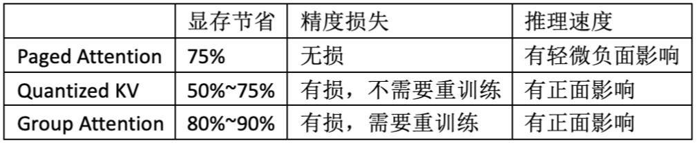
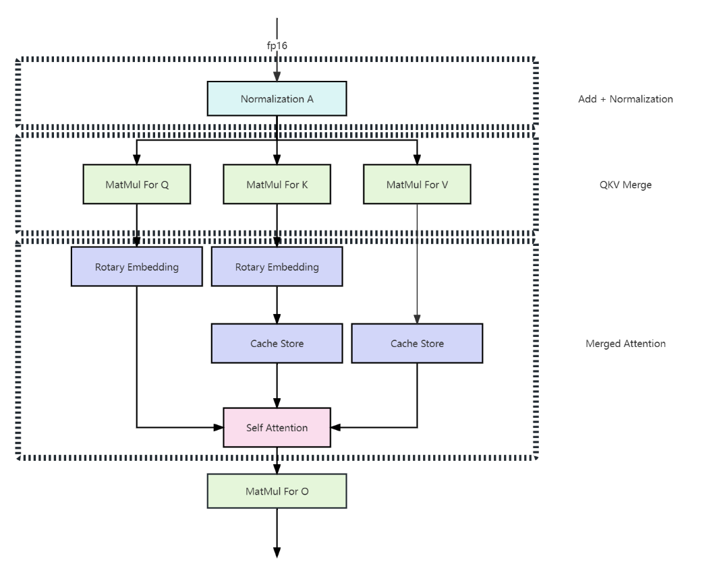
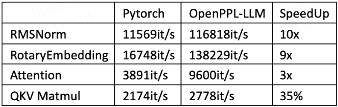
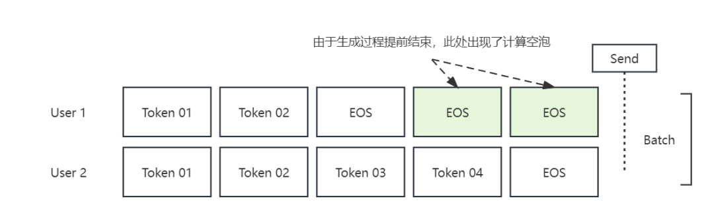
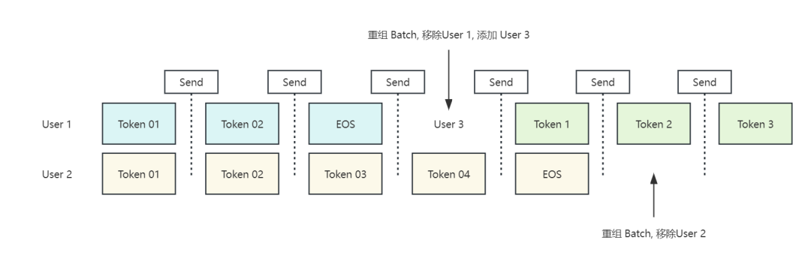
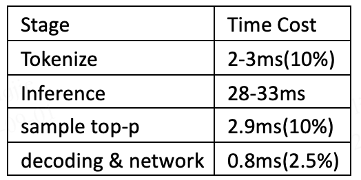
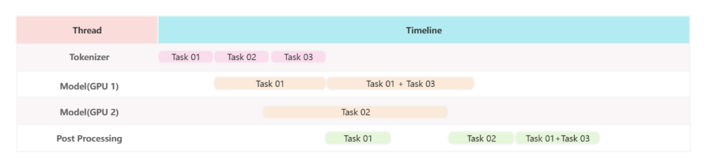

Model-level 的推理加速（模型轻量化）：

- 减枝
- 蒸馏
- 量化

System-level 的推理加速（推理方案）：

- LLM分离式推理（Prefill-Decode分离）https://zhuanlan.zhihu.com/p/8056351077 。P（计算密集型）D（访存密集型）分离的几个层次：

  Level -1：P和D在一张卡上融合，算是和PD分离反着来的一种设计

  Level 0：P和D分别计算，但还是在一张卡上调度，这是目前主流框架的默认玩法

  Level 1：在同构设备[同构网络](https://zhida.zhihu.com/search?content_id=250634037&content_type=Article&match_order=1&q=同构网络&zhida_source=entity)中分离P和D，比如在一个H20节点内搞，不用改造现有集群

  Level 2：把P和D分到同构设备但异构网络中，比如P和D各占一个H20节点，需要高速互联但不用改造集群

  Level 3：干脆把P和D放在异构设备上，比如用[昇腾910](https://zhida.zhihu.com/search?content_id=250634037&content_type=Article&match_order=1&q=昇腾910&zhida_source=entity)跑P，H20跑D，这个就得改造集群加高速互联了

- kernel融合与Flash Attentionhttps://www.zhihu.com/question/591646269/answer/3309904882：

  GPU的计算流程：将数据从显存（HBM）加载至on-chip的SRAM中，然后由SM读取并进行计算。计算结果再通过SRAM返回给显存。

  我们知道显存的带宽相比SRAM要小的多，读一次数据是很费时的，但是SRAM存储又太小，装不下太多数据。所以我们就以SRAM的存储为上限，尽量保证每次加载数据都把SRAM给打满，节省数据读取时间。因此在SRAM存储容许的情况下，能合并的计算我们尽量合并在一起，避免重复从显存读取数据。

  举例来说，我现在要做计算A和计算B。在老方法里，我做完A后得到一个中间结果，写回显存，然后再从显存中把这个结果加载到SRAM，做计算B。但是现在我发现SRAM完全有能力存下我的中间结果，那我就可以把A和B放在一起做了，这样就能节省很多读取时间，我们管这样的操作叫**kernel融合**。

  

推理框架，则是集成了一定推理方案和模型轻量化的。

OpenPPL-LLM 推理优化方案 [OpenPPL-LLM | OpenPPL之大语言模型推理引擎来啦 - 知乎](https://zhuanlan.zhihu.com/p/653808774)：

我们需要最小化每一位用户在服务器上占用的显存空间。OpenPPL-LLM将使用三种不同的优化策略，它们将成倍地降低上下文的显存占用，提供成倍的吞吐量提升。

**模型吞吐量与显存优化**

Paged Attention： 在大语言模型的推理中，每当新的用户到来，我们就会在显存上为他开辟一片充分长的KV缓存空间，用于保存用户的上下文数据。Paged Attention 实际上是一个动态分配显存的管理器，在使用了这项技术之后，我们会在模型的推理过程中不断动态地为用户追加分配他们的上下文空间。OpenPPL-LLM在此基础上使用一套基于GPU虚拟内存(MMU)的缓存管理机制，这使得我们实现的Self Attention算子能够以极低的开销访问硬件层面不连续的内存地址，并动态地完成Cache扩容。

Quantized KV Cache：这是由OpenPPL-LLM提供的缓存量化功能，我们会在写入KV缓存数据集将其量化到更低比特，从而压缩显存空间。我们会使用[分组量化](https://zhida.zhihu.com/search?content_id=233419378&content_type=Article&match_order=1&q=分组量化&zhida_source=entity)的方式将用户的上下文缓存数据进行高精度压缩，它的执行精度可以得到很好的保证，我们会将数据的解压缩过程融合进入Attention算子。这将节省大约50%~75%的显存空间，并且加速算子的执行。

Group Attention：在大语言模型中我们广泛应用[多头注意力机制](https://zhida.zhihu.com/search?content_id=233419378&content_type=Article&match_order=1&q=多头注意力机制&zhida_source=entity)，这是对自注意力的一种扩展，通过使用多个独立的注意力头来计算不同的注意力权重。每个头都学习不同的表示和语义信息。Group Attention通过修改网络结构的方式直接削减了参与运算的注意力头的数量，可以成倍的压缩上下文缓存空间。并且许多实验结果显示大部分情况网络的性能都不会因此受到很大影响。

**算子融合与延迟优化**

算子融合旨在将多个相邻的算子合并为一个更大的算子，以减少计算和内存开销，从而提高网络执行的效率。算子融合能够减少中间计算结果的存储，从而降低了内存访问次数。在大语言模型推理中，核心的图融合优化全部发生在Attention Block中。如上图所示，我们将执行四个关键的算子融合：1）我们将合并残差链接与归一化层之间的操作全部融合，这将减少数次对全局内存的访问；2）我们将横向合并Q, K, V矩阵乘，更大规模的矩阵乘将更充分地利用算力；3）我们将合并Rotary Embedding的相关操作，这将减少数次全局内存访问；4）我们将使用[flash attention](https://zhida.zhihu.com/search?content_id=233419378&content_type=Article&match_order=1&q=flash+attention&zhida_source=entity)这一较高性能的实现。

下表展示了与LLama实现的算子相比，融合操作的性能提升情况：

正如前文所述，在充分融合后的大语言模型中，所有细碎的算子均被合并了，这会导致在模型运行过程中矩阵乘的时间占比可以达到惊人的90%以上。

接下来我们将介绍No Pad优化，这项技术可以有效缩减模型推理时所需的计算量：Padding操作通过在较短的文本序列末尾添加特定的符号（通常是0）来实现。这些添加的符号并不携带实际的语义信息，只是用来填充序列长度。填充后，所有的文本序列就会有相同的长度，从而可以被作为一个统一的批次输入到模型中进行处理。

而在大语言模型中推理中，我们可以通过修改Attention算子实现的方式移除网络推理时所需的padding，这项技术目前也被LightSeq, Faster Transformer, TGI等推理框架广泛使用。具体来说，我们会将参与运算的所有文本序列头尾相接，拼接成一个超长的输入序列。为了标记每一个文本序列的起止位置，我们还会需要一个序列去记录拼接文本的长度。

No Padding技术的引入，可以使得我们在大语言模型prefill阶段的运算量减少50%以上，这大大提升了系统的响应速度。

**推理服务优化**
1.Dynamic Batching :

如上图所示，假设我们在一个Batch中，同时为{User1, User2}两位用户提供服务，User1只需生成两个Token就可以完成推理，而User2需要四个Token完成它的推理。那么对于这一个batch的推理而言我们必须等待User2的推理全部结束时才能拿到结果，并发送回客户端(Send)。并且在第三个Token之后针对User1的计算是无用的，这些出现的计算空泡使得大量算力被浪费了。

为了解决上述问题，我们将针对性地展开优化，经过优化的工作流如下图所示。首先，我们不再等待到推理结束时再一次性地返回结果，而是在每次token生成结束后都立即返回结果给用户(Send)。这样修改过后，从用户发起请求到其拿到第一批结果（虽然只有一个Token）的时间就大大缩短了。

而后，我们希望在模型推理过程中动态重组推理请求，从而充分利用算力。具体来说，我们希望从推理服务中立即移除那些已经结束推理的用户请求，并在合适的时机将新的用户请求切换到当前的模型推理过程中来。这样一来我们就可以尽可能地减少计算空泡。这种动态重组推理请求的技术也被称为Dynamic Batching。由于计算空泡的减少，在实际的推理场景中，Dynamic Batching技术的引入将提升100%~200%大模型推理服务能力(QPS)。

这是我们首次引入QPS(每秒服务用户数量)这个概念，与模型吞吐量不同，QPS衡量了大模型系统所能提供的实际业务服务能力。举例来说，假设我们搭建的大语言模型系统吞吐量为5000 tokens/sec，但计算过程中有太多无效计算（存在大量计算空泡），许多生成的token都是无效的EOS标记，这会使得生成的5000个token中可能只有2500个是有效的（实际情况接近这个比例），从而导致系统吞吐量高，但系统实际的服务能力很低。

Dynamic Batching技术的引入使得系统可以充分发挥吞吐量优势服务更多用户，首个从工业角度解决上述问题的框架是text-generation-inference(TGI)，这是由著名的huggingface团队推出的专为大语言模型推理设计的完整技术方案。借助Dynamic Batching技术，TGI的模型服务能力(QPS)可达Faster Transformer的两倍以上，即使Faster Transformer的算子优化做的更好，并且可以提供更高的模型吞吐量。

OpenPPL-LLM 提出的大模型推理方案同样使用了Dynamic Batching技术，并且借助PPL Cuda的优秀框架与算子实现，Open PPL-LLM的大模型推理方案吞吐量相比Faster Transformer而言具有优势，相比TGI也具有更高的模型服务能力。

2.Async Severing

随着模型吞吐量的提升，模型推理过程中的前后处理与网络数据传输开销就无法被忽视了，以7B的大语言模型为例，模型的推理时间和后处理时间占比如下表所示：

OpenPPL-LLM使用高性能的后处理算子与多线程操作掩蔽前后处理的时间开销，具体来说为了解决前后处理耗时长的问题，OpenPPL-LLM启动多个线程分别处理Tokenize, Model Inference与Post Processing任务。

如下图所示，OpenPPL-LLM将启动多个线程异步地执行Tokenizer(模型前处理)与PostProcessing(模型后处理)，负责前处理的线程还将承担负载均衡的职责，会将用户请求”均匀”地发送给推理线程(Model GPU1, Model GPU2)，推理线程在接到请求后还将利用dynamic batching的特性拼接任务，在处理完毕后将结果发送给后处理线程。

通过线程间的延迟相互掩蔽，在大吞吐量的场景下，OpenPPL-LLM最多可以获得30%~50%的性能提升。读者需要注意的是，随着模型规模的增长，模型的吞吐量会显著下降，模型前后处理的时间可能在大模型推理过程中的时间占比会缩小。